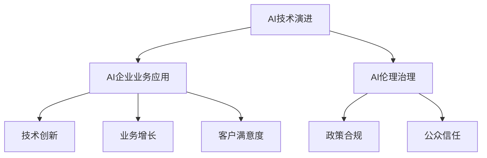

                 

# AI企业的未来发展方向

## 1. 背景介绍

随着人工智能技术的迅猛发展，AI企业在全球范围内的兴起势不可挡。AI技术正逐步渗透到各行各业，为企业带来变革性的创新能力。从零售、制造到金融、医疗，从自动化、机器人到自然语言处理、视觉识别，AI技术的广泛应用正在重塑各行各业的商业生态。在AI技术的驱动下，企业能够实现更高效的生产流程、更精准的市场预测、更个性化的用户体验，从而在竞争中占据优势。

然而，AI企业的未来发展之路并非一帆风顺。从技术突破到商业落地，从数据治理到伦理合规，AI企业面临着诸多挑战。本文将从AI企业的技术演进、业务应用、伦理治理等多个维度，深入探讨AI企业的未来发展方向，为读者提供全面的视角和思考。

## 2. 核心概念与联系

### 2.1 核心概念概述

为了更好地理解AI企业的发展方向，我们首先需要厘清几个核心概念：

- **AI技术演进**：从机器学习、深度学习到强化学习，AI技术经历了从基础到高级的演化过程。AI技术不断突破，带来了更强的数据处理能力、更高效的模型训练方法和更智能的决策制定能力。

- **AI企业业务应用**：AI技术在实际业务中的应用场景多种多样，包括自动化流程、智能推荐、自然语言处理、图像识别等。AI企业通过将AI技术应用于业务流程中，提升运营效率、降低成本、优化客户体验。

- **AI伦理治理**：随着AI技术的广泛应用，其带来的伦理问题也愈发凸显。AI企业的伦理治理包括数据隐私、模型偏见、算法透明性等方面，是企业可持续发展的重要保障。

这些核心概念之间的关系可以通过以下Mermaid流程图来展示：



该流程图展示了AI技术演进、AI企业业务应用与AI伦理治理之间的相互作用关系。AI技术演进驱动业务应用，而AI伦理治理则确保技术应用的安全和公正，同时影响企业的技术创新和业务增长。

## 3. 核心算法原理 & 具体操作步骤

### 3.1 算法原理概述

AI企业的未来发展方向，从根本上依赖于AI技术的进步和创新。以下是AI企业核心的算法原理及其操作步骤：

#### 3.1.1 机器学习

机器学习是AI技术的基础。通过收集和分析大量数据，机器学习模型能够从中学习到数据中的模式和规律，并用于预测、分类、聚类等任务。机器学习算法包括监督学习、无监督学习和强化学习等。

#### 3.1.2 深度学习

深度学习是机器学习的高级形式，通过多层次的神经网络结构，能够处理复杂的非线性关系。深度学习在图像识别、语音识别、自然语言处理等领域取得了显著成效。

#### 3.1.3 强化学习

强化学习通过与环境的交互，学习如何在特定环境中做出最优决策。强化学习广泛应用于游戏、机器人控制、自动驾驶等领域。

### 3.2 算法步骤详解

AI企业的算法步骤一般包括以下几个关键环节：

#### 3.2.1 数据收集与预处理

数据是AI企业的核心资源。AI企业需要收集和整理结构化和非结构化数据，包括文本、图像、语音、视频等，并进行清洗、归一化等预处理操作。

#### 3.2.2 模型设计与训练

根据具体业务需求，AI企业需要设计适合的AI模型，包括选择算法、确定参数、设置超参数等。然后使用大量的标注数据进行模型训练，以优化模型参数。

#### 3.2.3 模型评估与部署

在模型训练完成后，AI企业需要对模型进行评估，使用测试集进行验证，确保模型在实际应用中的表现。然后，将模型部署到生产环境中，实现业务自动化和智能化。

#### 3.2.4 持续学习与优化

AI企业需要持续收集新数据，对模型进行微调和优化，以适应新的业务需求和技术趋势。

### 3.3 算法优缺点

AI企业的算法优化是一个不断探索的过程，不同的算法在具体应用场景中具有不同的优缺点：

#### 3.3.1 机器学习的优点

- **可解释性高**：机器学习模型的决策过程透明，易于理解和解释。
- **对标注数据依赖较低**：机器学习算法通常需要较少的标注数据，降低了数据获取成本。

#### 3.3.2 机器学习的缺点

- **对数据质量敏感**：机器学习模型依赖高质量的数据，数据偏差可能导致模型表现不佳。
- **计算资源消耗较大**：传统机器学习算法需要大量的计算资源进行模型训练。

#### 3.3.3 深度学习的优点

- **处理复杂数据能力强**：深度学习模型能够处理高维、复杂的非线性数据。
- **自动特征提取**：深度学习模型能够自动提取数据中的特征，减少了特征工程的工作量。

#### 3.3.4 深度学习的缺点

- **需要大量标注数据**：深度学习模型通常需要大量的标注数据进行训练。
- **模型复杂度高**：深度学习模型结构复杂，训练和调优难度较大。

#### 3.3.5 强化学习的优点

- **自适应能力强**：强化学习算法能够通过与环境的交互，自适应地学习最优决策。
- **对数据依赖低**：强化学习算法不需要大量的标注数据，适用于数据获取困难的场景。

#### 3.3.6 强化学习的缺点

- **计算资源消耗高**：强化学习算法需要大量的计算资源进行模型训练和环境模拟。
- **模型难以解释**：强化学习算法的决策过程复杂，难以解释。

### 3.4 算法应用领域

AI技术的广泛应用，带来了多个行业的创新和发展。以下是AI技术在不同领域的应用方向：

#### 3.4.1 零售行业

AI技术在零售行业的应用包括智能推荐、库存管理、客户服务、供应链优化等。通过AI技术，零售企业能够实现更精准的市场预测、更高效的库存管理、更个性化的客户体验，从而提升销售业绩和客户满意度。

#### 3.4.2 制造业

AI技术在制造业的应用包括智能制造、质量控制、设备维护、预测性维护等。通过AI技术，制造企业能够实现更高效的生产流程、更精确的产品质量控制、更可靠的设备维护，从而提升生产效率和产品质量。

#### 3.4.3 金融行业

AI技术在金融行业的应用包括信用评估、风险管理、智能投顾、反欺诈检测等。通过AI技术，金融企业能够实现更准确的信用评估、更精确的风险管理、更个性化的智能投顾、更高效的反欺诈检测，从而降低风险、提升客户体验。

#### 3.4.4 医疗行业

AI技术在医疗行业的应用包括疾病诊断、医学影像分析、个性化治疗、医疗知识图谱等。通过AI技术，医疗机构能够实现更准确的疾病诊断、更高效的医学影像分析、更个性化的治疗方案、更全面的医疗知识图谱，从而提升医疗服务的质量和效率。

#### 3.4.5 自动驾驶

AI技术在自动驾驶领域的应用包括环境感知、路径规划、行为决策等。通过AI技术，自动驾驶车辆能够实现更高效的环境感知、更精确的路径规划、更安全的驾驶行为决策，从而提升驾驶安全性和用户体验。

## 4. 数学模型和公式 & 详细讲解 & 举例说明

### 4.1 数学模型构建

在AI技术的应用中，数学模型是核心。以下以机器学习中的线性回归模型为例，展示其数学模型构建过程。

假设数据集为 $(x_i,y_i)$，其中 $x_i \in \mathbb{R}^n$ 为输入特征，$y_i \in \mathbb{R}$ 为输出标签。线性回归模型的目标是通过拟合一条直线 $y = \theta_0 + \sum_{i=1}^n \theta_i x_i$ 来最小化均方误差 $MSE = \frac{1}{N}\sum_{i=1}^N (y_i - (\theta_0 + \sum_{i=1}^n \theta_i x_i))^2$。

### 4.2 公式推导过程

线性回归模型的求解过程包括以下几个步骤：

1. 最小化均方误差 $MSE$。
2. 对 $\theta_0$ 和 $\theta_i$ 求偏导数。
3. 解方程组 $\frac{\partial MSE}{\partial \theta_0} = 0$ 和 $\frac{\partial MSE}{\partial \theta_i} = 0$，得到 $\theta_0$ 和 $\theta_i$ 的解。

通过求解上述方程组，可以得到最优的参数值 $\theta_0$ 和 $\theta_i$，从而构建出线性回归模型。

### 4.3 案例分析与讲解

假设一个电商企业希望通过机器学习模型预测客户的购买行为。企业收集了用户的浏览记录、购买记录、年龄、性别等特征，并使用这些数据进行模型训练。在模型训练完成后，企业可以根据新的用户数据，预测该用户的购买意愿，从而实现个性化推荐和精准营销。

## 5. 项目实践：代码实例和详细解释说明

### 5.1 开发环境搭建

在开始项目实践前，需要准备好开发环境。以下是Python环境配置的具体步骤：

1. 安装Anaconda：从官网下载并安装Anaconda，用于创建独立的Python环境。
2. 创建并激活虚拟环境：
```bash
conda create -n pytorch-env python=3.8 
conda activate pytorch-env
```
3. 安装PyTorch：根据CUDA版本，从官网获取对应的安装命令。例如：
```bash
conda install pytorch torchvision torchaudio cudatoolkit=11.1 -c pytorch -c conda-forge
```
4. 安装TensorFlow：
```bash
conda install tensorflow tensorflow-gpu -c tf -c conda-forge
```
5. 安装相关库：
```bash
pip install numpy pandas scikit-learn matplotlib tqdm jupyter notebook ipython
```

### 5.2 源代码详细实现

以下以机器学习模型训练为例，给出使用PyTorch和TensorFlow进行线性回归模型训练的代码实现。

```python
# PyTorch实现
import torch
from torch import nn, optim
from torch.utils.data import DataLoader, TensorDataset
import torchvision.transforms as transforms
from torchvision.datasets import MNIST

# 数据预处理
transform = transforms.Compose([transforms.ToTensor(), transforms.Normalize((0.5,), (0.5,))])

train_dataset = MNIST(root='data', train=True, download=True, transform=transform)
train_loader = DataLoader(train_dataset, batch_size=64, shuffle=True)

# 定义模型
model = nn.Linear(784, 10)

# 定义损失函数和优化器
criterion = nn.CrossEntropyLoss()
optimizer = optim.SGD(model.parameters(), lr=0.01)

# 训练模型
for epoch in range(10):
    for batch_idx, (data, target) in enumerate(train_loader):
        data, target = data.to(device), target.to(device)
        optimizer.zero_grad()
        output = model(data.view(-1, 784))
        loss = criterion(output, target)
        loss.backward()
        optimizer.step()
```

```python
# TensorFlow实现
import tensorflow as tf
import numpy as np

# 数据预处理
train_images = np.load('train_images.npy')
train_labels = np.load('train_labels.npy')

# 定义模型
model = tf.keras.Sequential([
    tf.keras.layers.Dense(64, activation='relu', input_shape=(784,)),
    tf.keras.layers.Dense(10)
])

# 定义损失函数和优化器
criterion = tf.keras.losses.SparseCategoricalCrossentropy()
optimizer = tf.keras.optimizers.SGD(learning_rate=0.01)

# 训练模型
model.compile(optimizer=optimizer, loss=criterion, metrics=['accuracy'])
model.fit(train_images, train_labels, epochs=10, batch_size=64)
```

### 5.3 代码解读与分析

在上述代码中，我们展示了使用PyTorch和TensorFlow进行线性回归模型训练的基本流程：

- 数据预处理：使用torchvision库对MNIST数据集进行预处理，将其转换为Tensor格式。
- 定义模型：使用PyTorch的nn.Linear层定义线性回归模型。
- 定义损失函数和优化器：使用nn.CrossEntropyLoss作为损失函数，SGD优化器进行模型参数的优化。
- 训练模型：使用for循环和DataLoader迭代训练数据，通过前向传播计算损失，反向传播更新模型参数。

使用TensorFlow进行模型训练时，我们同样需要定义模型、损失函数、优化器等组件，并使用fit方法进行训练。TensorFlow的代码实现相对简洁，但由于其底层使用了计算图机制，训练过程较为复杂。

### 5.4 运行结果展示

在完成模型训练后，我们可以使用测试集数据对模型进行评估，并输出模型性能指标：

```python
# PyTorch实现
test_dataset = MNIST(root='data', train=False, download=True, transform=transform)
test_loader = DataLoader(test_dataset, batch_size=64, shuffle=False)

correct = 0
total = 0
with torch.no_grad():
    for data, target in test_loader:
        data, target = data.to(device), target.to(device)
        output = model(data.view(-1, 784))
        _, predicted = torch.max(output.data, 1)
        total += target.size(0)
        correct += (predicted == target).sum().item()

print('Accuracy of the network on the test images: %d %%' % (100 * correct / total))
```

```python
# TensorFlow实现
test_images = np.load('test_images.npy')
test_labels = np.load('test_labels.npy')

# 评估模型
test_loss, test_acc = model.evaluate(test_images, test_labels)
print('Test accuracy:', test_acc)
```

## 6. 实际应用场景

### 6.1 智能客服系统

智能客服系统是AI技术在零售、金融、医疗等多个领域的重要应用之一。通过自然语言处理技术，智能客服系统能够理解客户需求，并提供精准的解答。智能客服系统的实现需要依赖大量的标注数据和先进的算法模型，以实现对客户需求的快速识别和响应。

### 6.2 金融风险管理

在金融领域，AI技术被广泛应用于风险管理、信用评估、智能投顾等领域。通过机器学习和深度学习模型，金融机构能够预测客户的违约风险、评估信用等级、提供个性化的投资建议，从而降低风险、提升客户体验。

### 6.3 医疗影像分析

在医疗领域，AI技术被广泛应用于医学影像分析、疾病诊断等领域。通过深度学习模型，医疗机构能够对医学影像进行自动标注和分析，辅助医生进行疾病诊断和治疗方案制定，从而提升医疗服务的质量和效率。

### 6.4 自动驾驶

自动驾驶技术是AI技术在交通领域的重要应用。通过计算机视觉、深度学习等技术，自动驾驶车辆能够实现环境感知、路径规划、行为决策等功能，从而实现自动驾驶。自动驾驶技术的广泛应用，将极大地提升道路交通的安全性和效率。

## 7. 工具和资源推荐

### 7.1 学习资源推荐

为了帮助开发者系统掌握AI技术，这里推荐一些优质的学习资源：

1. **《深度学习》系列书籍**：由Ian Goodfellow、Yoshua Bengio、Aaron Courville等深度学习专家合著，全面介绍了深度学习理论和应用。
2. **Coursera《深度学习专项课程》**：由Andrew Ng教授主讲，涵盖了深度学习的基本概念、算法和应用。
3. **Kaggle竞赛平台**：一个数据科学和机器学习的竞赛平台，通过参与竞赛可以学习到许多实用的AI技术和方法。
4. **GitHub开源项目**：GitHub上有许多优秀的AI项目和代码库，可以供开发者参考和学习。

### 7.2 开发工具推荐

AI技术的应用离不开高效的工具支持。以下是几款常用的开发工具：

1. **Jupyter Notebook**：一个交互式的Python开发环境，支持代码编辑、数据可视化等操作，是数据科学和机器学习开发的首选工具。
2. **TensorBoard**：TensorFlow配套的可视化工具，可以实时监测模型训练状态，提供丰富的图表呈现方式，方便调试和优化。
3. **Weights & Biases**：一个模型实验跟踪工具，可以记录和可视化模型训练过程中的各项指标，方便对比和调优。
4. **PyTorch Lightning**：一个轻量级的PyTorch框架，提供了丰富的API和插件，方便快速搭建和训练深度学习模型。

### 7.3 相关论文推荐

AI技术的发展离不开学界的持续研究。以下是几篇奠基性的相关论文，推荐阅读：

1. **《深度学习》Ian Goodfellow**：全面介绍了深度学习的基本概念、算法和应用，是深度学习领域的经典教材。
2. **《TensorFlow：实战Google深度学习框架》Madhav Manglani**：介绍了TensorFlow的基本概念和应用，提供了丰富的代码示例和项目实战。
3. **《强化学习：Reinforcement Learning: An Introduction》Richard S. Sutton, Andrew G. Barto**：介绍了强化学习的基本概念、算法和应用，是强化学习领域的经典教材。

## 8. 总结：未来发展趋势与挑战

### 8.1 总结

AI技术的快速演进，正在推动各行各业的数字化转型和智能化升级。从机器学习、深度学习到强化学习，AI技术在各个领域的应用越来越广泛。然而，AI企业也面临着技术突破、业务应用、伦理治理等多方面的挑战。本文从多个维度探讨了AI企业的未来发展方向，为读者提供了全面的视角和思考。

通过系统梳理AI技术的演进和应用，可以看出，AI技术正逐渐成为推动各行各业发展的核心动力。未来，随着AI技术的不断进步和应用，AI企业将在更多领域实现突破，为人类社会的进步贡献力量。

### 8.2 未来发展趋势

展望未来，AI企业的未来发展趋势包括以下几个方面：

1. **AI技术的持续演进**：随着算力和数据的不断增长，AI技术将不断突破，带来更强的计算能力和更广泛的适用范围。
2. **AI与业务深度融合**：AI技术与各行各业的深度融合，将推动各行业的智能化转型，提升运营效率和客户体验。
3. **AI伦理治理的加强**：AI技术的广泛应用将带来更多的伦理问题，AI企业的伦理治理将不断加强，保障技术的可持续发展。

### 8.3 面临的挑战

尽管AI企业在发展过程中取得了显著进展，但也面临着诸多挑战：

1. **技术突破的难度**：AI技术的不断突破需要大量的研究和投入，难度较大。
2. **业务应用的不成熟**：AI技术在实际应用中仍存在很多不成熟的地方，需要不断优化和改进。
3. **伦理治理的复杂性**：AI技术的广泛应用将带来更多的伦理问题，需要不断完善治理机制。
4. **资源消耗的巨大**：AI技术的广泛应用需要大量的计算资源和数据资源，成本较高。

### 8.4 研究展望

未来，AI企业需要在以下几个方面进行深入研究：

1. **AI技术的持续演进**：深入研究新的算法和模型，提升AI技术的计算能力和应用范围。
2. **AI与业务深度融合**：探索AI技术在各行业的应用场景，推动各行业的智能化转型。
3. **AI伦理治理的加强**：制定和完善AI技术的伦理规范，确保技术的可持续发展。

通过系统探索AI技术的演进和应用，相信AI企业能够在未来实现更广泛、更深层次的突破，推动各行各业的数字化转型和智能化升级。

## 9. 附录：常见问题与解答

**Q1: AI企业未来发展方向主要有哪些？**

A: AI企业的未来发展方向主要包括以下几个方面：
1. AI技术的持续演进。
2. AI与业务深度融合。
3. AI伦理治理的加强。

**Q2: AI企业面临的挑战有哪些？**

A: AI企业面临的挑战包括以下几个方面：
1. 技术突破的难度。
2. 业务应用的不成熟。
3. 伦理治理的复杂性。
4. 资源消耗的巨大。

**Q3: 如何提高AI企业的竞争力？**

A: 提高AI企业的竞争力可以从以下几个方面进行：
1. 深入研究新的算法和模型，提升AI技术的计算能力和应用范围。
2. 探索AI技术在各行业的应用场景，推动各行业的智能化转型。
3. 制定和完善AI技术的伦理规范，确保技术的可持续发展。

**Q4: AI企业如何构建良好的伦理治理机制？**

A: AI企业构建良好的伦理治理机制可以从以下几个方面进行：
1. 制定和完善AI技术的伦理规范。
2. 建立伦理审查委员会，对AI技术的应用进行评估和监督。
3. 加强公众教育，提升社会对AI技术的理解和信任。

通过系统探索AI技术的演进和应用，相信AI企业能够在未来实现更广泛、更深层次的突破，推动各行各业的数字化转型和智能化升级。

