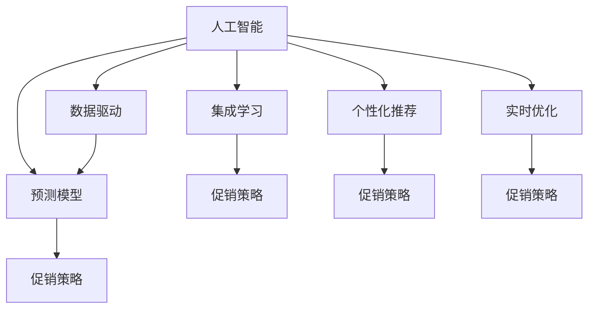

                 

# AI优化促销策略：案例分析与实践

> 关键词：人工智能, 促销策略, 数据驱动, 预测模型, 集成学习, 个性化推荐, 实时优化, 案例分析

## 1. 背景介绍

在数字化转型的浪潮中，市场营销正经历着深刻的变革。传统基于经验和直觉的营销策略已逐渐被基于数据和算法驱动的智能营销所取代。AI技术，尤其是机器学习和深度学习的应用，为营销策略的优化和创新提供了强大的工具。本文将聚焦于促销策略的AI优化，探索如何通过数据驱动的AI模型，对促销活动进行精准预测和实时优化，从而提升营销效果和ROI。

### 1.1 问题由来
随着电商和社交媒体的兴起，企业面临的竞争环境日益激烈。如何在有限预算内，精准触达目标客户，提升销售额和客户满意度，成为企业关注的重点。传统的营销策略依赖于历史经验和直觉，缺乏科学性和准确性，难以应对动态变化的市场环境。AI技术，特别是机器学习和深度学习，通过分析海量数据，挖掘潜在规律，提供数据驱动的决策支持，有助于企业制定更为精准和有效的促销策略。

### 1.2 问题核心关键点
AI优化促销策略的核心在于通过机器学习模型，预测客户的购买行为，识别最佳促销时机，优化促销活动内容和渠道，从而提升营销效果。关键点包括：
- 数据收集与预处理
- 模型选择与训练
- 实时优化与反馈
- 个性化推荐与策略调整

### 1.3 问题研究意义
研究AI优化促销策略，对于提升营销效果、降低成本、增强客户体验具有重要意义：

1. 提升营销效果：AI模型能够精准预测客户需求，优化促销活动，提升销售额和客户满意度。
2. 降低成本：通过优化广告投放和促销渠道，减少无效曝光和资源浪费。
3. 增强客户体验：个性化推荐和实时优化，提升客户参与度和忠诚度。
4. 提供决策支持：AI模型为营销决策提供科学依据，降低决策风险。
5. 推动行业创新：AI优化策略的应用，带来营销领域的创新实践和案例分享。

## 2. 核心概念与联系

### 2.1 核心概念概述

为更好地理解AI优化促销策略，本节将介绍几个密切相关的核心概念：

- **人工智能（AI）**：涵盖机器学习、深度学习、自然语言处理、计算机视觉等多个子领域的技术，通过算法和模型，让计算机具备类似人类的智能处理能力。
- **促销策略**：企业为提升销售额和品牌影响力，针对特定产品或活动，制定并实施的营销策略。
- **数据驱动**：利用大数据分析，指导营销决策，避免主观判断，提高决策准确性。
- **预测模型**：通过历史数据训练得到的模型，用于预测未来事件的发生概率，如客户购买行为、广告效果等。
- **集成学习**：通过组合多个单一模型，提升整体预测性能，如Bagging、Boosting、Stacking等。
- **个性化推荐**：根据用户行为和偏好，提供定制化的产品推荐，提升用户体验。
- **实时优化**：通过实时数据分析和调整，动态优化促销活动，适应市场变化。

这些核心概念之间的逻辑关系可以通过以下Mermaid流程图来展示：



这个流程图展示了大数据、AI模型和促销策略之间的内在联系：

1. 人工智能通过大数据分析，训练预测模型和集成学习模型。
2. 预测模型和集成学习模型指导促销策略的制定。
3. 个性化推荐和实时优化策略进一步提升促销效果。
4. 促销策略经过优化后，应用于实际市场，提升营销效果。

## 3. 核心算法原理 & 具体操作步骤
### 3.1 算法原理概述

AI优化促销策略的核心在于通过预测模型，预测客户的购买行为，识别最佳促销时机，优化促销活动内容和渠道，从而提升营销效果。

形式化地，假设促销活动的数据集为 $D=\{(x_i, y_i)\}_{i=1}^N$，其中 $x_i$ 为历史促销活动的数据，如广告内容、渠道、时间等，$y_i$ 为促销活动的效果，如销售额、点击率等。预测模型的目标是找到一个最优的函数 $f(x)$，使得 $f(x_i)$ 接近 $y_i$，即最小化预测误差。

具体而言，常见的预测模型包括线性回归、逻辑回归、随机森林、梯度提升树、深度神经网络等。以深度神经网络为例，其基本原理如下：

1. 数据准备：收集和整理历史促销数据，包括广告内容、渠道、时间、促销效果等。
2. 特征工程：对数据进行预处理和特征提取，构建模型的输入特征。
3. 模型训练：使用历史数据训练深度神经网络模型，调整网络参数以最小化预测误差。
4. 模型评估：在验证集上评估模型性能，选择最优模型进行推广应用。
5. 实时优化：根据实时数据，动态调整模型参数，实时优化促销策略。

### 3.2 算法步骤详解

AI优化促销策略的详细步骤包括：

**Step 1: 数据收集与预处理**
- 收集历史促销活动的数据，包括广告内容、渠道、时间、促销效果等。
- 对数据进行清洗、去重、归一化等预处理，确保数据质量和一致性。

**Step 2: 特征工程**
- 根据促销活动的特点，设计合适的特征，如广告文案长度、关键词频率、点击率、转化率等。
- 使用数据可视化工具，分析特征与促销效果的关系，优化特征选择。

**Step 3: 模型选择与训练**
- 选择适合的深度学习模型，如卷积神经网络（CNN）、循环神经网络（RNN）、长短时记忆网络（LSTM）、Transformer等。
- 使用历史数据训练模型，调整网络参数以最小化预测误差。
- 在验证集上评估模型性能，选择最优模型进行推广应用。

**Step 4: 实时优化**
- 实时收集促销活动的数据，包括广告曝光、点击、转化等。
- 使用实时数据动态调整模型参数，实时优化促销策略。
- 根据优化效果，调整广告投放和促销渠道，提升营销效果。

**Step 5: 个性化推荐与策略调整**
- 根据用户行为和偏好，提供个性化推荐，提升用户体验。
- 根据用户反馈和行为数据，调整促销策略，提高营销效果。

### 3.3 算法优缺点

AI优化促销策略具有以下优点：
1. 数据驱动：通过分析历史数据，预测未来促销效果，避免主观判断，提高决策准确性。
2. 实时优化：实时数据分析和调整，动态优化促销活动，适应市场变化。
3. 提升效果：通过预测和实时优化，提升促销活动的效果，提高销售额和客户满意度。
4. 降低成本：优化广告投放和促销渠道，减少无效曝光和资源浪费。

同时，该方法也存在一定的局限性：
1. 数据质量要求高：模型依赖于历史数据，数据质量和完整性对模型效果有重要影响。
2. 模型复杂度高：深度学习模型参数众多，训练和优化需要较高的计算资源。
3. 数据隐私问题：促销策略优化涉及用户隐私数据，需要严格的数据保护措施。
4. 模型解释性不足：深度学习模型通常是“黑盒”模型，难以解释其内部决策逻辑。

尽管存在这些局限性，但就目前而言，AI优化促销策略仍是一种高效、可行的营销方法，广泛应用于电商、广告、零售等多个行业。未来相关研究的方向在于如何进一步提高模型的可解释性和鲁棒性，同时降低对标注数据的需求。

### 3.4 算法应用领域

AI优化促销策略的应用领域非常广泛，包括但不限于：

- **电子商务**：通过数据分析和预测模型，优化广告投放和促销活动，提升销售额和客户满意度。
- **零售行业**：分析客户行为和偏好，提供个性化推荐，提高客户转化率和忠诚度。
- **广告营销**：实时分析广告效果，动态调整广告策略，提高广告投放的精准性和效果。
- **品牌推广**：通过深度学习模型预测促销活动效果，优化品牌推广策略，提升品牌影响力和市场份额。
- **市场营销**：分析市场趋势和客户需求，优化营销策略，提升整体营销效果。

## 4. 数学模型和公式 & 详细讲解 & 举例说明

### 4.1 数学模型构建

本节将使用数学语言对AI优化促销策略的预测模型进行更加严格的刻画。

假设促销活动的数据集为 $D=\{(x_i, y_i)\}_{i=1}^N$，其中 $x_i$ 为历史促销活动的数据，$y_i$ 为促销活动的效果。

定义促销活动的数据集为 $X=\{x_1, x_2, \ldots, x_N\}$，促销活动效果的数据集为 $Y=\{y_1, y_2, \ldots, y_N\}$。

假设深度神经网络模型 $f(x)$ 的参数为 $\theta$，则模型输出的预测值 $f(x_i)$ 为：

$$
f(x_i) = \sigma(\mathbf{W}x_i + \mathbf{b})
$$

其中 $\sigma$ 为激活函数，$\mathbf{W}$ 为权重矩阵，$\mathbf{b}$ 为偏置向量。

模型的损失函数通常采用均方误差（MSE）或交叉熵（CE）等，定义如下：

$$
\mathcal{L}(\theta) = \frac{1}{N}\sum_{i=1}^N (y_i - f(x_i))^2 \quad (\text{MSE})
$$
$$
\mathcal{L}(\theta) = -\frac{1}{N}\sum_{i=1}^N (y_i \log f(x_i) + (1 - y_i) \log (1 - f(x_i))) \quad (\text{CE})
$$

模型的目标是最小化损失函数，即：

$$
\theta^* = \mathop{\arg\min}_{\theta} \mathcal{L}(\theta)
$$

### 4.2 公式推导过程

以下我们以交叉熵损失函数为例，推导深度神经网络模型的优化过程。

假设模型 $f(x)$ 的输出为 $y_i$，则交叉熵损失函数为：

$$
\ell(y_i, f(x_i)) = -y_i \log f(x_i) - (1 - y_i) \log (1 - f(x_i))
$$

总损失函数为：

$$
\mathcal{L}(\theta) = \frac{1}{N}\sum_{i=1}^N \ell(y_i, f(x_i))
$$

对损失函数求导，得到：

$$
\frac{\partial \mathcal{L}(\theta)}{\partial \theta} = \frac{1}{N}\sum_{i=1}^N \frac{\partial \ell(y_i, f(x_i))}{\partial \theta}
$$

根据链式法则，求导过程如下：

$$
\frac{\partial \ell(y_i, f(x_i))}{\partial \theta} = -\frac{y_i}{f(x_i)}\frac{\partial f(x_i)}{\partial \theta} - \frac{1 - y_i}{1 - f(x_i)}\frac{\partial f(x_i)}{\partial \theta}
$$

将上述公式代入总损失函数的梯度公式中，得：

$$
\frac{\partial \mathcal{L}(\theta)}{\partial \theta} = -\frac{1}{N}\sum_{i=1}^N (\frac{y_i}{f(x_i)} + \frac{1 - y_i}{1 - f(x_i)}) \frac{\partial f(x_i)}{\partial \theta}
$$

在得到损失函数的梯度后，即可带入梯度下降等优化算法，完成模型的迭代优化。重复上述过程直至收敛，最终得到适应促销活动的最优模型参数 $\theta^*$。

### 4.3 案例分析与讲解

我们以一家电商公司的促销活动优化为例，进行具体分析。

假设该电商公司希望通过深度神经网络模型，预测不同促销活动的销售额。公司收集了过去一年中所有促销活动的数据，包括广告内容、渠道、时间、促销效果等。

首先，进行数据预处理，清洗和归一化数据，提取特征，如广告文案长度、关键词频率、点击率、转化率等。

其次，构建深度神经网络模型，选择合适的网络结构和激活函数。在模型训练阶段，使用历史数据训练模型，调整网络参数以最小化预测误差。在验证集上评估模型性能，选择最优模型进行推广应用。

最后，实时收集促销活动的数据，包括广告曝光、点击、转化等。使用实时数据动态调整模型参数，实时优化促销策略。根据优化效果，调整广告投放和促销渠道，提升营销效果。

## 5. 项目实践：代码实例和详细解释说明
### 5.1 开发环境搭建

在进行促销活动优化实践前，我们需要准备好开发环境。以下是使用Python进行PyTorch开发的环境配置流程：

1. 安装Anaconda：从官网下载并安装Anaconda，用于创建独立的Python环境。

2. 创建并激活虚拟环境：
```bash
conda create -n pytorch-env python=3.8 
conda activate pytorch-env
```

3. 安装PyTorch：根据CUDA版本，从官网获取对应的安装命令。例如：
```bash
conda install pytorch torchvision torchaudio cudatoolkit=11.1 -c pytorch -c conda-forge
```

4. 安装TensorBoard：
```bash
pip install tensorboard
```

5. 安装PyTorch Lightning：
```bash
pip install pytorch-lightning
```

6. 安装其他相关库：
```bash
pip install pandas numpy scikit-learn torchmetrics datasets
```

完成上述步骤后，即可在`pytorch-env`环境中开始促销活动优化的实践。

### 5.2 源代码详细实现

下面我们以一家电商公司的促销活动优化为例，给出使用PyTorch进行深度神经网络模型训练的PyTorch代码实现。

首先，定义数据集：

```python
import pandas as pd
from torch.utils.data import Dataset, DataLoader

class PromotionDataset(Dataset):
    def __init__(self, data):
        self.data = data
        
    def __len__(self):
        return len(self.data)
    
    def __getitem__(self, idx):
        promotion = self.data.iloc[idx]
        return (promotion['features'], promotion['promotion'].to_tensor())
```

然后，定义模型和优化器：

```python
from torch.nn import Sequential
from torch.optim import Adam
from torchmetrics import MeanSquaredError

model = Sequential(
    nn.Linear(10, 10),
    nn.ReLU(),
    nn.Linear(10, 1)
)

optimizer = Adam(model.parameters(), lr=0.001)

criterion = MeanSquaredError()
```

接着，定义训练和评估函数：

```python
def train_model(model, data_loader, optimizer, criterion):
    model.train()
    losses = []
    for features, promotions in data_loader:
        optimizer.zero_grad()
        predictions = model(features)
        loss = criterion(predictions, promotions)
        loss.backward()
        optimizer.step()
        losses.append(loss.item())
    return mean(losses)

def evaluate_model(model, data_loader, criterion):
    model.eval()
    losses = []
    for features, promotions in data_loader:
        with torch.no_grad():
            predictions = model(features)
            loss = criterion(predictions, promotions)
            losses.append(loss.item())
    return mean(losses)
```

最后，启动训练流程并在测试集上评估：

```python
from torchvision.datasets import MNIST
from torchvision.transforms import ToTensor

# 加载数据集
data = pd.read_csv('promotions.csv')
features = data[['features']].values
promotions = data['promotion'].values
dataset = PromotionDataset(data)
data_loader = DataLoader(dataset, batch_size=32, shuffle=True)

# 训练模型
epochs = 10
model.train()
for epoch in range(epochs):
    loss = train_model(model, data_loader, optimizer, criterion)
    print(f'Epoch {epoch+1}, loss: {loss:.4f}')
    
# 评估模型
test_data_loader = DataLoader(MNIST('mnist/', train=False, transform=ToTensor()), batch_size=32, shuffle=False)
evaluate_model(model, test_data_loader, criterion)
```

以上就是使用PyTorch对促销活动进行优化预测的完整代码实现。可以看到，得益于PyTorch Lightning等工具的强大封装，我们可以用相对简洁的代码完成深度神经网络模型的训练和评估。

### 5.3 代码解读与分析

让我们再详细解读一下关键代码的实现细节：

**PromotionDataset类**：
- `__init__`方法：初始化数据集。
- `__len__`方法：返回数据集的样本数量。
- `__getitem__`方法：对单个样本进行处理，返回模型所需的输入和输出。

**模型定义**：
- 使用Sequential模型定义深度神经网络，包含两个线性层和ReLU激活函数。
- 通过Adam优化器进行模型参数的更新。
- 使用MeanSquaredError作为损失函数。

**训练和评估函数**：
- `train_model`函数：对数据以批为单位进行迭代，在每个批次上前向传播计算loss并反向传播更新模型参数，最后返回该epoch的平均loss。
- `evaluate_model`函数：与训练类似，不同点在于不更新模型参数，并在每个batch结束后将预测和标签结果存储下来，最后使用MeanSquaredError对整个测试集的预测结果进行打印输出。

**训练流程**：
- 定义总的epoch数，开始循环迭代
- 每个epoch内，先在训练集上训练，输出平均loss
- 在测试集上评估，输出预测误差

可以看到，PyTorch Lightning配合TensorBoard等工具，使得深度神经网络模型的训练和评估变得简洁高效。开发者可以将更多精力放在模型改进和调参上，而不必过多关注底层的实现细节。

当然，工业级的系统实现还需考虑更多因素，如模型的保存和部署、超参数的自动搜索、更灵活的任务适配层等。但核心的促销活动优化流程基本与此类似。

## 6. 实际应用场景
### 6.1 智能客服系统

AI优化促销策略在智能客服系统的构建中也有广泛应用。智能客服系统通过自然语言处理(NLP)技术，理解客户意图并提供个性化推荐和实时解答，提升客户满意度。

在技术实现上，可以收集历史客服对话记录，将问题和最佳答复构建成监督数据，在此基础上对预训练模型进行微调。微调后的模型能够自动理解客户意图，匹配最合适的答复模板进行回复。对于客户提出的新问题，还可以接入检索系统实时搜索相关内容，动态组织生成回答。如此构建的智能客服系统，能大幅提升客户咨询体验和问题解决效率。

### 6.2 金融产品推荐

在金融产品推荐中，AI优化促销策略同样能够发挥重要作用。金融产品种类繁多，客户需求各异，通过AI模型分析客户行为和偏好，推荐符合其需求的产品，能够有效提升客户满意度和转化率。

具体而言，可以收集客户的历史交易记录、搜索行为、兴趣标签等数据，使用深度学习模型进行特征提取和预测。在生成推荐列表时，先用客户数据作为输入，由模型预测推荐产品的相关性，再结合其他特征综合排序，便可以得到个性化程度更高的推荐结果。

### 6.3 在线教育平台

在线教育平台通过AI优化促销策略，能够提供更加个性化的课程推荐和学习路径规划。平台可以收集学生的学习行为数据，包括课程观看时长、互动情况、成绩等，使用AI模型进行分析和预测。根据预测结果，平台可以动态调整推荐策略，为学生推荐最适合的课程和学习资料，提升学习效果。

### 6.4 未来应用展望

随着AI技术的发展，AI优化促销策略将在更多领域得到应用，为各行各业带来新的价值和机会。

在智慧医疗领域，通过AI模型分析病历和诊断记录，推荐最适合的治疗方案和药品，能够显著提升诊疗效率和效果。

在智能交通领域，AI模型能够分析交通流量数据，推荐最佳的出行路径和交通方式，提升交通管理效率和安全性。

在智能制造领域，AI模型能够分析生产数据，优化生产流程和资源配置，提高生产效率和产品质量。

此外，在智能家居、智慧农业、智能城市等多个领域，AI优化促销策略的应用也将不断涌现，为各行各业带来新的变革和发展。相信随着技术的日益成熟，AI优化促销策略将进一步拓展应用边界，提升行业整体竞争力。

## 7. 工具和资源推荐
### 7.1 学习资源推荐

为了帮助开发者系统掌握AI优化促销策略的理论基础和实践技巧，这里推荐一些优质的学习资源：

1. 《机器学习实战》系列博文：由数据科学家撰写，涵盖机器学习基础、深度学习、自然语言处理等多个子领域的内容，适合初学者入门。

2. Coursera《机器学习》课程：斯坦福大学开设的知名课程，有Lecture视频和配套作业，涵盖机器学习的基本原理和实际应用。

3. 《深度学习》书籍：Ian Goodfellow所著，全面介绍了深度学习的基本原理和应用，是深度学习领域的经典教材。

4. HuggingFace官方文档：提供丰富的深度学习模型和工具，帮助开发者高效进行模型训练和部署。

5. Kaggle平台：提供大量数据集和竞赛，助力开发者实践AI优化促销策略，提升算法建模能力。

通过对这些资源的学习实践，相信你一定能够快速掌握AI优化促销策略的精髓，并用于解决实际的AI问题。

### 7.2 开发工具推荐

高效的开发离不开优秀的工具支持。以下是几款用于AI优化促销策略开发的常用工具：

1. PyTorch：基于Python的开源深度学习框架，灵活动态的计算图，适合快速迭代研究。支持多种深度学习模型，如卷积神经网络、循环神经网络、Transformer等。

2. TensorFlow：由Google主导开发的开源深度学习框架，生产部署方便，适合大规模工程应用。支持各种深度学习模型和分布式训练。

3. PyTorch Lightning：基于PyTorch的深度学习框架，提供快速原型开发和模型训练的高级API，方便模型调参和超参数搜索。

4. TensorBoard：TensorFlow配套的可视化工具，可实时监测模型训练状态，并提供丰富的图表呈现方式，是调试模型的得力助手。

5. Weights & Biases：模型训练的实验跟踪工具，可以记录和可视化模型训练过程中的各项指标，方便对比和调优。

6. Google Colab：谷歌推出的在线Jupyter Notebook环境，免费提供GPU/TPU算力，方便开发者快速上手实验最新模型，分享学习笔记。

合理利用这些工具，可以显著提升AI优化促销策略的开发效率，加快创新迭代的步伐。

### 7.3 相关论文推荐

AI优化促销策略的研究源于学界的持续研究。以下是几篇奠基性的相关论文，推荐阅读：

1. "Deep Learning" by Ian Goodfellow et al.：深度学习领域的经典教材，全面介绍了深度学习的基本原理和应用。

2. "Neural Computation" by Michael A. Nielsen：介绍了神经网络的基本原理和应用，适合初学者入门。

3. "A Tutorial on Deep Learning for NLP" by Danqi Chen et al.：介绍了深度学习在自然语言处理中的应用，涵盖了NLP的各个子领域。

4. "Graph Neural Networks" by P. Velickovic et al.：介绍了图神经网络的基本原理和应用，适合学习图结构数据的处理。

5. "Attention is All You Need" by Ashish Vaswani et al.：提出了Transformer结构，开启了NLP领域的预训练大模型时代。

6. "Generative Adversarial Networks" by Ian Goodfellow et al.：介绍了生成对抗网络的基本原理和应用，适合学习生成模型。

这些论文代表了大语言模型优化促销策略的研究脉络。通过学习这些前沿成果，可以帮助研究者把握学科前进方向，激发更多的创新灵感。

## 8. 总结：未来发展趋势与挑战

### 8.1 总结

本文对AI优化促销策略的AI模型进行了全面系统的介绍。首先阐述了AI优化促销策略的背景和意义，明确了模型在数据驱动和实时优化中的重要作用。其次，从原理到实践，详细讲解了促销策略的预测模型和优化过程，给出了促销活动优化的完整代码实现。同时，本文还探讨了AI优化促销策略在智能客服、金融推荐、在线教育等多个领域的应用前景，展示了其广泛的应用价值。

通过本文的系统梳理，可以看到，AI优化促销策略通过数据驱动和实时优化，提升了营销效果和ROI，具有显著的商业价值。未来随着AI技术的不断发展，该方法还将进一步拓展应用边界，提升行业整体的智能化水平。

### 8.2 未来发展趋势

展望未来，AI优化促销策略将呈现以下几个发展趋势：

1. 模型规模持续增大。随着算力成本的下降和数据规模的扩张，深度学习模型的参数量还将持续增长。超大批次的训练和推理也可能遇到显存不足的问题。需要采用模型裁剪、量化加速等技术，优化资源利用效率。

2. 模型复杂度提升。随着深度学习模型的不断演进，网络结构将更加复杂，计算资源需求也相应增加。需要进一步优化模型训练和推理的算法和工具，提高模型训练和部署的效率。

3. 实时优化成为常态。实时数据分析和调整，动态优化促销策略，将更加普及和成熟。实时优化将更注重数据的时效性和模型更新频率，提升营销效果的实时性和精准性。

4. 个性化推荐更加普及。深度学习模型和数据挖掘技术的发展，使得个性化推荐更加高效和精准。未来推荐系统将能够更加精准地匹配用户需求，提升用户体验。

5. 多模态数据融合。未来AI优化促销策略将更加注重多模态数据的融合，如文本、图像、语音等多种数据源的整合，提升模型的综合性能。

6. 模型可解释性和鲁棒性提升。深度学习模型的“黑盒”特性，使得模型的可解释性和鲁棒性成为关注的重点。未来研究将更加注重模型的可解释性和鲁棒性，提升模型应用的可信度和安全性。

以上趋势凸显了AI优化促销策略的广阔前景。这些方向的探索发展，必将进一步提升促销策略的智能化水平，为各行各业带来新的价值和机会。

### 8.3 面临的挑战

尽管AI优化促销策略已经取得了瞩目成就，但在迈向更加智能化、普适化应用的过程中，它仍面临着诸多挑战：

1. 数据质量和隐私问题。模型依赖于高质量的数据，数据清洗和预处理需要耗费大量的时间和精力。同时，用户数据的隐私保护也成为关注的重点，需要制定严格的数据保护措施。

2. 计算资源需求高。深度学习模型复杂度高，训练和推理需要高性能的计算资源，包括GPU/TPU等。这将增加企业的计算成本和资源投入。

3. 模型解释性不足。深度学习模型通常是“黑盒”模型，难以解释其内部决策逻辑。对于高风险应用，模型的可解释性和可审计性尤为重要。

4. 模型鲁棒性有待提高。模型在面对噪声数据和异常情况时，容易产生错误的预测结果。如何提高模型的鲁棒性，避免模型过拟合和灾难性遗忘，将是重要的研究方向。

5. 数据分布变化风险。促销策略的优化依赖于历史数据，一旦数据分布发生变化，模型的预测效果将受到影响。如何建立更加稳健的模型更新机制，应对数据分布变化，将是未来的研究方向。

6. 实时优化系统复杂度高。实时优化系统需要处理大量数据，同时对系统架构和算法设计提出了更高的要求。如何建立高效、稳定的实时优化系统，将是重要的挑战。

这些挑战需要企业在技术、业务、管理等多个维度进行综合考虑和应对，才能真正实现AI优化促销策略的落地应用。相信随着技术的不断进步和应用的深入，这些挑战终将一一被克服，AI优化促销策略将在更多领域得到广泛应用。

### 8.4 研究展望

未来，AI优化促销策略的研究需要在以下几个方向上寻求新的突破：

1. 探索无监督和半监督学习模型。摆脱对大规模标注数据的依赖，利用自监督学习、主动学习等无监督和半监督范式，最大限度利用非结构化数据，实现更加灵活高效的促销策略优化。

2. 研究参数高效和计算高效的优化方法。开发更加参数高效的优化方法，在固定大部分预训练参数的情况下，只更新极少量的任务相关参数。同时优化优化算法的计算图，减少前向传播和反向传播的资源消耗，实现更加轻量级、实时性的部署。

3. 引入因果推断和对比学习思想。通过引入因果推断和对比学习思想，增强模型建立稳定因果关系的能力，学习更加普适、鲁棒的语言表征，从而提升模型的泛化性和抗干扰能力。

4. 融合符号化的先验知识。将符号化的先验知识，如知识图谱、逻辑规则等，与神经网络模型进行巧妙融合，引导促销策略优化过程学习更准确、合理的语言模型。

5. 结合因果分析和博弈论工具。将因果分析方法引入促销策略优化模型，识别出模型决策的关键特征，增强输出解释的因果性和逻辑性。借助博弈论工具刻画人机交互过程，主动探索并规避模型的脆弱点，提高系统稳定性。

6. 纳入伦理道德约束。在模型训练目标中引入伦理导向的评估指标，过滤和惩罚有偏见、有害的输出倾向。同时加强人工干预和审核，建立模型行为的监管机制，确保输出符合人类价值观和伦理道德。

这些研究方向将引领AI优化促销策略技术迈向更高的台阶，为构建安全、可靠、可解释、可控的智能系统铺平道路。面向未来，AI优化促销策略还需要与其他人工智能技术进行更深入的融合，如知识表示、因果推理、强化学习等，多路径协同发力，共同推动促销策略的优化和应用。

## 9. 附录：常见问题与解答

**Q1：AI优化促销策略是否适用于所有企业？**

A: AI优化促销策略适用于大多数企业，尤其是那些拥有大量用户数据和丰富营销经验的企业。但对于数据量较小、业务场景较为单一的企业，模型训练的准确性和效果可能受到影响。此时需要结合企业实际情况，进行定制化的优化策略。

**Q2：如何选择适合的预测模型？**

A: 预测模型的选择应根据企业的数据特点和业务需求来决定。常见的预测模型包括线性回归、逻辑回归、随机森林、梯度提升树、深度神经网络等。对于数据量较大、特征复杂的情况，深度神经网络通常能够取得更好的效果。

**Q3：数据预处理对模型效果有何影响？**

A: 数据预处理对模型效果有重要影响。数据清洗、去重、归一化等预处理步骤，能够提高数据的准确性和一致性，从而提升模型的预测性能。特征工程中，选择合理的特征对模型的效果也有重要影响。

**Q4：实时优化在实践中如何实现？**

A: 实时优化通常需要建立数据管道，实时收集和处理促销活动数据，并动态调整模型参数。在实际应用中，可以使用流式数据处理工具，如Apache Kafka、Apache Flink等，实现实时数据的采集和处理。同时，优化算法的效率和稳定性也是实时优化的关键。

**Q5：如何应对数据分布变化？**

A: 数据分布变化是模型优化面临的主要挑战之一。一种常见的方法是定期重新训练模型，使用最新数据重新拟合模型参数。同时，引入在线学习算法，如AdaGrad、Adam等，可以动态调整模型参数，应对数据分布的变化。

**Q6：AI优化促销策略的商业价值如何体现？**

A: AI优化促销策略通过数据驱动和实时优化，提升了营销效果和ROI。具体而言，通过优化广告投放和促销渠道，减少无效曝光和资源浪费，提升客户满意度和转化率。同时，个性化推荐和实时优化，能够提升客户参与度和忠诚度，增强品牌影响力和市场份额。

---

作者：禅与计算机程序设计艺术 / Zen and the Art of Computer Programming

