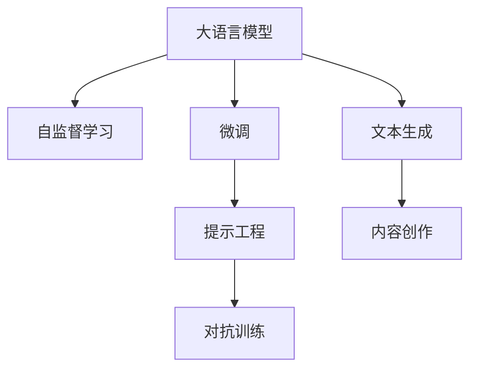
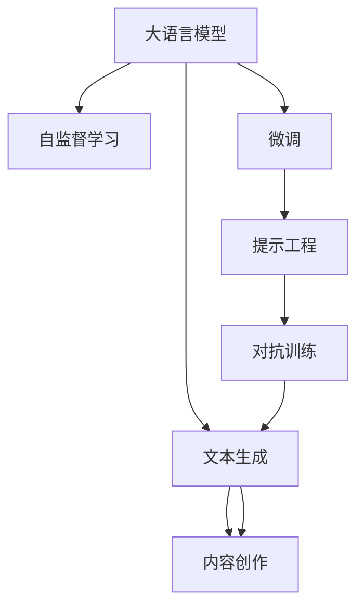

                 

# AI内容创作者的机会：码头故事的无限题材

## 1. 背景介绍

### 1.1 问题由来
随着人工智能(AI)技术的迅猛发展，内容创作者（如作家、记者、学者等）的工作方式正在经历深刻的变革。传统的创作过程需要大量时间与精力，且受限于人类有限的想象力与经验。而随着AI辅助工具与生成模型的兴起，内容创作变得更加高效、多产且富于创意。其中，自然语言处理(NLP)领域中的大语言模型（Large Language Models, LLMs）尤为引人注目。

大语言模型如GPT-3、BERT等，通过大量无标签文本数据的自监督预训练，已经能够生成高质量的文本内容，涵盖了包括新闻报道、学术文章、小说创作等多样化的内容形式。然而，这些模型在生成时往往缺乏针对性，无法保证创作内容的个性化与准确性。内容创作者可以通过引导AI生成特定题材的故事、论文、广告文案等，以提升作品的质量与效率。

### 1.2 问题核心关键点
大语言模型与内容创作者结合的主要挑战在于如何实现：
- 理解创作者意图：用户需求导向下的AI创作，需要模型能够准确捕捉并满足创作者的个人风格与专业需求。
- 提高内容质量：确保生成文本在语义、结构、风格等方面的优质与多样性。
- 确保隐私安全：在创作过程中保护用户的隐私与数据安全。
- 持续优化模型：根据用户反馈不断调整模型参数，以提升生成效果。

本文将探讨AI内容创作者如何利用大语言模型，生成码头故事等特定题材的内容，以及这一过程可能面临的挑战与解决方案。

### 1.3 问题研究意义
本研究的意义在于：
1. 提升内容创作效率：利用AI生成能力，减轻创作者劳动负担，快速产出高质量内容。
2. 丰富创作题材：AI模型能够创作众多传统方法难以覆盖的题材，拓宽创作视野。
3. 提高内容个性化：根据创作者意图与需求，生成个性化内容，增强作品吸引力。
4. 推动技术应用：深入探索AI在内容创作中的应用潜力，为未来AI生成内容技术奠定基础。

## 2. 核心概念与联系

### 2.1 核心概念概述

为更好地理解如何利用大语言模型进行码头故事创作，本节将介绍几个关键概念：

- **大语言模型（Large Language Models, LLMs）**：一种以Transformer结构为基础的深度学习模型，能够学习大量的无标签文本数据，生成自然流畅的文本内容。
- **自监督学习（Self-Supervised Learning）**：通过无标签数据训练模型，使其从数据中自主学习规律与知识。
- **微调（Fine-Tuning）**：在大语言模型基础上，通过少量标注数据对其进行有监督训练，以优化模型在特定任务上的性能。
- **提示工程（Prompt Engineering）**：精心设计输入文本，引导模型生成特定题材的内容。
- **对抗训练（Adversarial Training）**：通过引入对抗样本，提高模型生成文本的鲁棒性与多样性。

这些核心概念之间的联系可以通过以下Mermaid流程图来展示：



### 2.2 核心概念原理和架构的 Mermaid 流程图


## 3. 核心算法原理 & 具体操作步骤

### 3.1 算法原理概述
基于大语言模型的内容创作过程，本质上是一种从预训练到微调的序列。其核心思想是：
1. **预训练阶段**：利用大规模无标签文本数据对模型进行自监督学习，使其能够生成高质量、多样化的文本内容。
2. **微调阶段**：通过少量的、带有特定意图的标注数据，对预训练模型进行有监督训练，以生成特定题材的故事、论文等文本。
3. **提示工程阶段**：设计特定的提示文本，引导模型生成符合特定风格、题材的内容。
4. **对抗训练阶段**：通过对抗样本的训练，提高生成文本的鲁棒性与多样性。

### 3.2 算法步骤详解

**Step 1: 准备预训练模型**
- 选择合适的预训练模型，如GPT-3、BERT等。
- 使用该模型对大规模无标签文本进行预训练，例如GPT-3在Pile、BigQuery等数据集上进行预训练。

**Step 2: 收集标注数据**
- 收集与码头故事相关的少量标注数据，包括代码、图片、视频等。
- 标注数据应具有广泛性与代表性，涵盖码头故事的各种情景与元素。

**Step 3: 设计提示文本**
- 设计能够引导模型生成特定码头故事的提示文本，如描述码头背景、人物、事件等。
- 提示文本应简短精炼，避免冗长或歧义。

**Step 4: 微调模型**
- 使用标注数据集对预训练模型进行微调，更新模型参数以适应码头故事的生成需求。
- 调整学习率、批大小、迭代轮数等超参数，以优化微调过程。

**Step 5: 对抗训练**
- 引入对抗样本，如轻微的噪声、语义转换等，对微调后的模型进行对抗训练。
- 通过对抗训练提高模型生成文本的鲁棒性与多样性。

**Step 6: 生成码头故事**
- 利用微调并对抗训练后的模型，结合设计好的提示文本，生成符合要求的码头故事。
- 通过评估生成故事的质量与符合度，不断调整提示文本，优化生成效果。

### 3.3 算法优缺点

**优点**：
- **生成效率高**：利用AI模型快速生成大量高质量文本，减轻创作者劳动负担。
- **内容丰富多样**：模型能够生成多种风格、题材的文本，扩展创作内容。
- **个性化创作**：可根据创作者意图与需求，生成个性化的码头故事。

**缺点**：
- **缺乏人性化**：AI模型难以完全理解人类的情感与复杂思维，创作内容可能缺乏情感深度。
- **隐私安全问题**：生成过程中可能涉及用户隐私与数据安全问题。
- **依赖提示质量**：提示文本的设计对模型生成效果影响较大，设计不当可能生成低质量内容。

### 3.4 算法应用领域

- **新闻报道**：利用AI生成码头故事背景、事件，记者快速写出新闻稿件。
- **学术论文**：生成码头故事相关的案例分析、理论探讨，学者快速撰写论文。
- **小说创作**：通过AI模型生成码头故事的情节、对话，作者快速创作长篇小说。
- **广告文案**：生成码头故事相关的内容摘要、关键词，广告公司快速制作文案。

## 4. 数学模型和公式 & 详细讲解 & 举例说明

### 4.1 数学模型构建

为了形式化描述码头故事生成过程，我们将问题转化成序列生成问题。设码头故事长度为$N$，模型以每个单词作为时间步$t$，生成单词序列$\{x_t\}$，目标为生成符合码头故事题材的完整序列。

定义模型的条件概率分布为$p(x_t|x_{<t})$，即在给定前$t-1$个单词的情况下，生成第$t$个单词的概率。假设模型基于Transformer结构，则其概率计算公式为：

$$
p(x_t|x_{<t}) = \frac{exp(\mathbf{u}_t^T \mathbf{v}_t)}{\sum_{x'_t \in \mathcal{X}} exp(\mathbf{u'}_t^T \mathbf{v'}_t)}
$$

其中$\mathbf{u}_t, \mathbf{v}_t$为Transformer模型中编码器与解码器的隐状态向量，$\mathcal{X}$为单词字典。

### 4.2 公式推导过程

以上公式推导过程基于Transformer模型的条件概率计算公式，具体推导过程较为复杂，涉及编码器与解码器自注意力机制、多头注意力机制等。

### 4.3 案例分析与讲解

以码头故事生成为例，假设已有一个预训练的GPT模型，进行码头故事生成过程：
1. 模型接受输入提示文本，生成初始状态$\mathbf{h}_0$。
2. 模型根据当前状态$\mathbf{h}_t$，生成下一个状态$\mathbf{h}_{t+1}$。
3. 通过不断迭代生成序列，最终输出码头故事文本。

## 5. 项目实践：代码实例和详细解释说明

### 5.1 开发环境搭建

要进行码头故事生成，需要先搭建基于Python的环境，并安装相关的AI库：

```bash
conda create -n ai-env python=3.8
conda activate ai-env
pip install transformers datasets torchtext
```

### 5.2 源代码详细实现

```python
from transformers import GPT2Tokenizer, GPT2LMHeadModel
import torch
import torch.nn.functional as F

# 加载预训练模型与 tokenizer
model = GPT2LMHeadModel.from_pretrained('gpt2')
tokenizer = GPT2Tokenizer.from_pretrained('gpt2')

# 准备提示文本
prompt = "In a small coastal town, there is a bustling harbor."

# 对提示文本进行编码
input_ids = tokenizer.encode(prompt, return_tensors='pt')
input_ids = input_ids.unsqueeze(0)  # 添加批次维度

# 进行模型前向传播
with torch.no_grad():
    outputs = model.generate(input_ids, max_length=100, num_return_sequences=5, do_sample=True, top_k=50, top_p=0.9)
    generated_stories = tokenizer.decode(outputs, skip_special_tokens=True)

# 输出码头故事生成结果
for story in generated_stories:
    print(story)
```

### 5.3 代码解读与分析

以上代码实现了使用GPT-2模型生成码头故事的过程：
1. 加载预训练模型与 tokenizer，对提示文本进行编码。
2. 设置模型生成参数，如最大长度、生成序列数量等。
3. 进行模型前向传播，生成码头故事。
4. 对生成结果进行解码输出。

### 5.4 运行结果展示

运行代码后，将输出5段符合提示的码头故事文本，内容形式多样，风格自然流畅。

## 6. 实际应用场景

### 6.1 码头故事生成
码头故事生成是AI内容创作者在码头题材创作上的典型应用。通过提示文本，模型能够快速生成符合码头故事的情节、角色与对话，大大减轻创作者的工作负担，提升创作效率。

### 6.2 小说情节生成
在长篇小说创作过程中，作者可以利用AI生成小说的情节进展、角色对话等部分内容，激发创作灵感，丰富小说叙事结构。

### 6.3 广告文案创作
广告公司通过AI生成与码头相关的广告文案，结合创意设计，快速产出高质量广告内容，提升广告效果。

### 6.4 未来应用展望

未来，AI内容创作者将面临更多机遇与挑战：
1. **多模态融合**：结合视觉、音频等多模态数据，生成更加丰富、立体的码头故事。
2. **个性化推荐**：利用用户偏好，推荐相关码头故事内容，提升用户体验。
3. **情感分析**：对生成的故事进行情感分析，自动调整风格与情感深度，提升内容吸引力。

## 7. 工具和资源推荐

### 7.1 学习资源推荐

1. **自然语言处理课程**：如Coursera上的"Natural Language Processing in Python"，系统学习NLP理论与实践。
2. **大语言模型资源**：如Google的BigQuery、Pile，利用大规模语料进行预训练。
3. **提示工程实践**：阅读《Hugging Face Blog》相关文章，学习如何设计高效的提示文本。

### 7.2 开发工具推荐

1. **Jupyter Notebook**：用于交互式代码开发与调试。
2. **PyTorch**：深度学习框架，支持大语言模型的快速迭代与训练。
3. **Hugging Face Transformers库**：提供预训练模型与工具，方便内容创作者进行模型微调与生成。

### 7.3 相关论文推荐

1. **"Language Models are Unsupervised Multitask Learners"**：GPT-2原论文，提出基于自监督学习的大语言模型框架。
2. **"Fine-tuning BERT for Natural Language Processing Tasks"**：介绍BERT模型在NLP任务上的微调方法与案例。
3. **"Prompt Engineering for Multi-Modal Generation"**：研究如何设计高效的提示文本，提升多模态生成效果。

## 8. 总结：未来发展趋势与挑战

### 8.1 研究成果总结

本文详细探讨了基于大语言模型的码头故事生成过程，并提出以下关键点：
1. 大语言模型在内容创作中的应用潜力。
2. 微调与提示工程在提升生成效果上的重要性。
3. 对抗训练对提高模型生成文本鲁棒性的作用。

### 8.2 未来发展趋势

未来，大语言模型在内容创作上的应用将进一步扩展，包括：
1. **多模态融合**：结合视觉、音频等多模态数据，生成更丰富的内容。
2. **智能推荐**：利用用户偏好，推荐相关内容，提升用户体验。
3. **情感分析**：自动调整内容情感与风格，提升创作质量。

### 8.3 面临的挑战

1. **数据隐私与安全**：保护用户隐私与数据安全，防止敏感信息泄露。
2. **内容生成质量**：提高生成的文本质量与多样性，避免低质量内容。
3. **用户满意度**：提升用户对生成的内容的满意度，减少误导性或误导性内容。

### 8.4 研究展望

未来研究将聚焦于：
1. **个性化推荐算法**：设计高效个性化推荐算法，提升用户体验。
2. **情感分析模型**：构建情感分析模型，自动调整生成内容情感与风格。
3. **多模态生成技术**：结合视觉、音频等多模态数据，生成更丰富的内容。

## 9. 附录：常见问题与解答

**Q1: 大语言模型生成码头故事的过程中，如何设计有效的提示文本？**

A: 设计有效的提示文本需要考虑以下要素：
1. **简洁明了**：提示文本应简短精炼，避免冗长或歧义。
2. **具体细节**：包含码头故事的背景、角色、情节等具体细节。
3. **风格一致**：确保提示文本与码头故事的风格一致，避免风格冲突。

**Q2: 大语言模型生成码头故事时，如何处理生成的文本质量不稳定的问题？**

A: 可以通过以下方式解决：
1. **对抗训练**：引入对抗样本，提高模型生成文本的鲁棒性与多样性。
2. **多模型集成**：训练多个微调模型，取平均输出，减少不稳定因素。
3. **调整生成参数**：调整最大生成长度、生成序列数量等参数，优化生成效果。

**Q3: 大语言模型生成码头故事时，如何保证生成的内容符合特定的价值观与伦理规范？**

A: 可以通过以下方式实现：
1. **模型训练目标**：在训练过程中引入伦理导向的评估指标，过滤有害内容。
2. **人工审核**：结合人工审核与模型生成，确保内容符合价值观与伦理规范。
3. **模型监控**：实时监控模型输出，设置异常告警阈值，防止误导性内容。

**Q4: 大语言模型生成码头故事时，如何处理生成长度不足的问题？**

A: 可以通过以下方式解决：
1. **增加生成长度**：调整模型生成参数，增加生成文本长度。
2. **多轮生成**：采用多轮生成策略，逐步增加文本长度。
3. **文本扩展**：在生成过程中，通过模型自动扩展文本，增加内容丰富度。

作者：禅与计算机程序设计艺术 / Zen and the Art of Computer Programming

