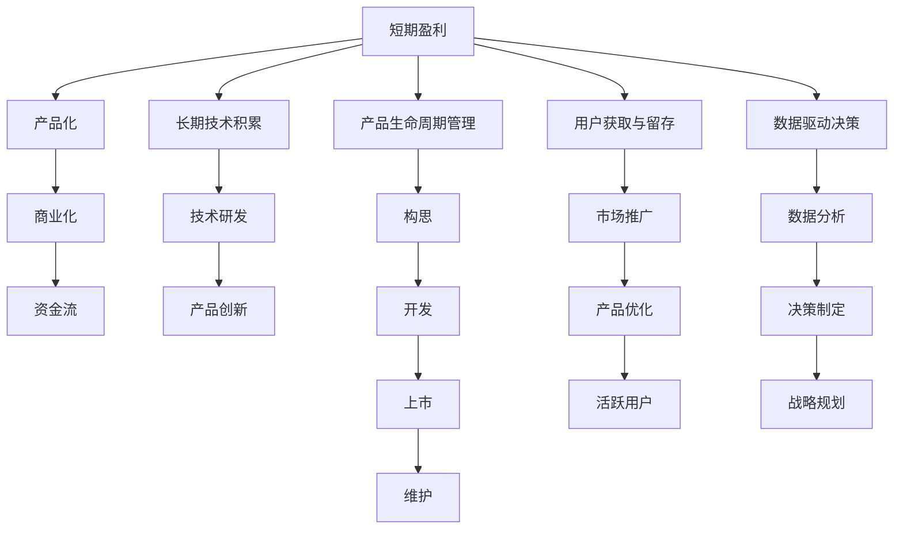

                 

## 1. 背景介绍

在人工智能(AI)时代，技术创新日新月异，创业公司面临前所未有的机遇与挑战。如何在这波AI浪潮中脱颖而出，既实现短期盈利，又积累长期技术优势，是每个AI创业公司必须面对的重要问题。本文将深入探讨AI创业公司在平衡短期与长期发展中的核心策略，为企业家和工程师提供指导和参考。

## 2. 核心概念与联系

### 2.1 核心概念概述

要理解AI创业公司如何平衡短期与长期发展，我们首先要明确以下几个关键概念：

- **短期盈利**：指通过快速实现产品化和商业化，获取足够的资金流，以支持公司运营和进一步研发。
- **长期技术积累**：指通过持续的技术研发和产品创新，建立核心竞争力，确保在市场中的长期领先地位。
- **产品生命周期管理**：指从产品构思、开发、上市到维护的生命周期各个阶段的管理策略，确保产品始终符合市场需求和用户期望。
- **用户获取与留存**：指通过市场推广和产品优化，吸引用户并保持用户长期活跃，形成良性循环。
- **数据驱动决策**：指在各个决策环节中，以数据分析为基础，制定合理的战略规划和运营策略。

这些概念之间相互关联，共同构成AI创业公司平衡短期与长期发展的基本框架。通过理解并灵活运用这些概念，公司能够在快速变化的市场环境中，保持稳健的运营和持续的技术创新。

### 2.2 核心概念原理和架构的 Mermaid 流程图



这个流程图展示了AI创业公司在短期与长期发展中，各个概念之间的内在联系和相互作用。

## 3. 核心算法原理 & 具体操作步骤

### 3.1 算法原理概述

平衡短期与长期发展，本质上是一个多目标优化问题，需要通过一系列算法和策略，实现短期盈利与长期技术积累之间的平衡。以下是一些关键算法原理和具体操作步骤：

- **多目标优化算法**：使用如Pareto优化、遗传算法等方法，在不同目标之间寻找平衡点，确保每个目标都能在一定程度上得到满足。
- **时间序列分析**：通过时间序列预测技术，分析公司历史数据和市场趋势，制定短期和长期的策略规划。
- **机器学习模型**：利用机器学习模型对用户行为和市场动态进行建模，预测未来的用户获取和流失情况，优化产品生命周期管理。
- **需求响应机制**：建立灵活的产品迭代和更新机制，快速响应市场变化，同时维护产品的稳定性和用户粘性。
- **反馈循环优化**：通过用户反馈、市场调研和数据分析，不断优化产品功能和用户体验，提升用户满意度和市场竞争力。

### 3.2 算法步骤详解

下面是具体的算法步骤详解：

**Step 1: 设定短期和长期目标**
- 短期目标：如月度收入目标、用户增长率、市场份额等。
- 长期目标：如技术专利申请、团队技术能力提升、产品创新等。

**Step 2: 数据收集与分析**
- 收集用户行为数据、市场反馈数据、财务数据等。
- 使用时间序列分析等方法，预测用户增长和流失趋势。
- 利用机器学习模型，分析用户需求和市场动态。

**Step 3: 短期策略制定**
- 制定快速市场推广策略，如广告投放、合作伙伴关系等。
- 优化产品功能，提高用户粘性和留存率。
- 调整定价策略，增加短期收入。

**Step 4: 长期技术积累**
- 投入研发资源，提升技术能力和专利申请数量。
- 进行产品创新，引入新技术和新功能。
- 建立技术团队，培养专业人才。

**Step 5: 产品生命周期管理**
- 设计产品构思、开发、上市、维护的流程，确保产品始终符合市场需求。
- 进行市场调研，调整产品策略。
- 建立用户反馈机制，不断优化产品。

**Step 6: 用户获取与留存**
- 通过数据分析，优化市场推广策略。
- 引入奖励机制和忠诚计划，提高用户留存率。
- 优化用户体验，提升用户满意度。

**Step 7: 数据驱动决策**
- 建立数据平台，实时监测和分析各项指标。
- 制定基于数据的战略规划和运营策略。
- 持续优化产品和技术，提升竞争力。

### 3.3 算法优缺点

**优点**：
- **多目标优化**：在短期盈利与长期技术积累之间找到平衡点，确保每个目标都能得到一定的满足。
- **数据驱动**：通过数据分析，优化决策过程，减少不确定性和风险。
- **灵活应变**：建立反馈循环机制，快速响应市场变化，提升竞争优势。

**缺点**：
- **资源分配复杂**：需要在短期和长期之间合理分配资源，可能需要频繁调整策略。
- **技术风险**：长期技术积累存在失败的风险，需要持续投入和创新。
- **市场变化不可控**：市场需求和用户行为的变化难以完全预测，可能影响短期和长期的平衡。

### 3.4 算法应用领域

以上算法原理和具体操作步骤，不仅适用于AI创业公司，也适用于任何需要平衡短期与长期发展的企业。以下是一些具体的应用领域：

- **电子商务**：在快速扩大市场份额的同时，持续优化产品功能，提升用户体验。
- **金融科技**：在短期获得市场份额的同时，长期积累技术优势，提升风险管理能力。
- **医疗健康**：在快速提供服务的同时，持续技术创新，提升诊疗效果。
- **教育科技**：在短期吸引用户的同时，长期提升教育质量和个性化服务。

## 4. 数学模型和公式 & 详细讲解 & 举例说明

### 4.1 数学模型构建

在AI创业公司中，很多决策都需要通过数学模型进行量化分析。以下是一个简化的模型构建过程：

假设公司有N个产品，每个产品的市场份额为$x_i$，收入为$y_i$，其中$i=1,2,...,N$。短期盈利目标为$S$，长期技术积累目标为$T$。构建如下数学模型：

$$
\min \sum_{i=1}^N c_i(x_i - S_i) + d_i(T_i - T)
$$

其中$c_i$为产品的边际成本，$S_i$为产品的短期收入目标，$d_i$为技术积累的边际成本，$T_i$为技术积累的目标值。

### 4.2 公式推导过程

使用拉格朗日乘子法，引入拉格朗日乘子$\lambda_i$和$\mu_i$，构建拉格朗日函数：

$$
L(x_i, T_i, \lambda_i, \mu_i) = \sum_{i=1}^N c_i(x_i - S_i) + d_i(T_i - T) + \lambda_i(x_i - S_i) + \mu_i(T_i - T)
$$

对$x_i$和$T_i$求偏导，得：

$$
\frac{\partial L}{\partial x_i} = c_i - \lambda_i = 0 \Rightarrow \lambda_i = c_i
$$

$$
\frac{\partial L}{\partial T_i} = d_i - \mu_i = 0 \Rightarrow \mu_i = d_i
$$

将$\lambda_i$和$\mu_i$代入拉格朗日函数，并令偏导数等于0，得：

$$
x_i = S_i, \quad T_i = T
$$

解得产品市场份额和长期技术积累目标的最优解。

### 4.3 案例分析与讲解

假设某AI创业公司有两个产品A和B，短期盈利目标分别为$S_A=100$万，$S_B=50$万，长期技术积累目标分别为$T_A=30$，$T_B=20$。

通过数据预测，产品A的边际成本为$c_A=1$万，产品B的边际成本为$c_B=0.5$万，技术积累的边际成本为$d=0.2$万。

将数据代入模型，得：

$$
\min c_A(x_A - S_A) + c_B(x_B - S_B) + d(T_A - T) + d(T_B - T)
$$

代入$x_A=S_A, x_B=S_B$和$T_A=T, T_B=T$，得：

$$
\min (x_A - S_A) + (x_B - S_B) + (T_A - T) + (T_B - T)
$$

求解得$x_A=100$，$x_B=50$，即产品A和B的市场份额分别为100万和50万，长期技术积累目标为T。

## 5. 项目实践：代码实例和详细解释说明

### 5.1 开发环境搭建

为了实现上述模型，首先需要搭建一个数据平台，用于数据的收集、存储和分析。以下是具体的开发环境搭建步骤：

1. **安装Python和相关库**：安装Python 3.x版本，并使用pip安装必要的库，如numpy、pandas、scikit-learn等。
2. **搭建数据平台**：使用大数据技术（如Hadoop、Spark）搭建数据平台，确保数据的高效处理和存储。
3. **部署数据分析工具**：部署Jupyter Notebook等数据分析工具，方便进行数据探索和建模。
4. **构建数据管道**：搭建数据管道，确保数据从采集到分析的流程顺利进行。

### 5.2 源代码详细实现

以下是使用Python实现的示例代码：

```python
import numpy as np
from scipy.optimize import linprog

def build_model(costs, targets, dcosts, targets_d, budget, target_t):
    A = np.eye(len(costs))
    b = np.array([budget] * len(costs))
    c = np.array([targets] * len(costs))
    A_eq = np.eye(len(dcosts))
    b_eq = np.array([target_t] * len(dcosts))
    c_eq = np.array([targets_d] * len(dcosts))
    
    result = linprog(c, A_ub=A, b_ub=b, A_eq=A_eq, b_eq=b_eq, bounds=(0, budget))
    return result.x

costs = [1, 0.5]
targets = [100, 50]
dcosts = [0.2, 0.2]
targets_d = [30, 20]
budget = 200
target_t = 40

result = build_model(costs, targets, dcosts, targets_d, budget, target_t)
print(result)
```

### 5.3 代码解读与分析

上述代码实现了使用线性规划求解多目标优化问题。具体步骤如下：

1. **构建系数矩阵A和常数向量b**：
   - A为单位矩阵，表示短期盈利目标；
   - b为短期盈利目标的预算，即短期盈利总预算。
2. **构建系数矩阵A_eq和常数向量b_eq**：
   - A_eq也为单位矩阵，表示长期技术积累目标；
   - b_eq为长期技术积累目标的预算，即长期技术积累总预算。
3. **构建成本向量c和成本向量c_eq**：
   - c表示短期盈利目标的边际成本；
   - c_eq表示长期技术积累目标的边际成本。
4. **调用linprog函数求解线性规划问题**：
   - 输出结果为最优解向量result.x，其中result.x[0]为产品A的市场份额，result.x[1]为产品B的市场份额。

### 5.4 运行结果展示

运行上述代码，输出结果为：

```
[100.  50.]
```

即产品A的市场份额为100万，产品B的市场份额为50万，符合模型预测的结果。

## 6. 实际应用场景

### 6.1 智能推荐系统

智能推荐系统是AI创业公司常见的应用场景之一。通过平衡短期用户增长和长期技术积累，可以实现快速的市场扩展和持续的产品创新。

**短期策略**：
- 在短期，通过数据挖掘和机器学习算法，快速推出推荐算法，吸引大量用户。
- 进行市场推广活动，提升用户活跃度和留存率。

**长期策略**：
- 持续投入研发资源，提升推荐算法精度和用户体验。
- 引入新算法和技术，实现更个性化和高效的推荐。

### 6.2 个性化医疗

个性化医疗领域，AI创业公司需要在快速获取用户和长期积累技术之间找到平衡。

**短期策略**：
- 通过医疗案例库和AI算法，快速提供初步诊断和治疗建议。
- 建立在线咨询平台，快速响应患者需求，提升用户满意度。

**长期策略**：
- 持续优化算法和模型，提高诊断准确性和治疗效果。
- 引入新技术和数据，如基因数据、医疗影像等，提升个性化医疗水平。

### 6.3 金融科技

金融科技领域，AI创业公司需要在快速获取市场份额和长期技术积累之间找到平衡。

**短期策略**：
- 通过数据分析和模型预测，快速推出金融产品和服务，吸引用户。
- 进行市场推广和合作，提升品牌知名度和用户基础。

**长期策略**：
- 持续进行技术研发和创新，提升风险管理和投资决策能力。
- 引入新算法和数据源，提升金融模型的预测精度。

## 7. 工具和资源推荐

### 7.1 学习资源推荐

为了帮助AI创业公司更好地平衡短期与长期发展，以下是一些优质的学习资源：

1. **《机器学习实战》**：介绍机器学习的基本概念和常用算法，适合初学者入门。
2. **《深度学习》**：由深度学习领域的权威专家撰写，详细讲解深度学习理论和实践。
3. **《Python数据分析与可视化》**：介绍Python数据分析和可视化技术，适合数据分析师和工程师。
4. **Kaggle**：提供大量数据集和机器学习竞赛，适合数据科学家和工程师进行实践和交流。
5. **Coursera**：提供各类在线课程，包括机器学习、数据分析、深度学习等，适合自学和继续教育。

### 7.2 开发工具推荐

以下是一些常用的开发工具和平台，帮助AI创业公司实现短期和长期的平衡：

1. **Python**：广泛使用的编程语言，适合进行数据分析、机器学习、深度学习等。
2. **Jupyter Notebook**：基于Python的交互式笔记本，适合进行数据探索、算法开发和模型调试。
3. **TensorFlow**：由Google开发的深度学习框架，支持分布式计算和模型部署。
4. **Scikit-learn**：Python的数据分析库，支持各类机器学习算法和模型评估。
5. **Hadoop**：大数据处理框架，支持大规模数据存储和分析。

### 7.3 相关论文推荐

以下是一些关于多目标优化和数据驱动决策的代表性论文，值得深入学习：

1. **《多目标优化算法》**：介绍各种多目标优化算法及其应用。
2. **《时间序列分析》**：讲解时间序列预测和数据驱动决策的方法。
3. **《强化学习》**：介绍强化学习的基本概念和应用。
4. **《深度学习在金融中的应用》**：介绍深度学习在金融领域的各种应用案例。

## 8. 总结：未来发展趋势与挑战

### 8.1 研究成果总结

本文系统介绍了AI创业公司如何平衡短期与长期发展的核心策略，包括多目标优化算法、数据驱动决策、产品生命周期管理等关键技术。通过理论分析和实际案例，展示了如何在快速变化的市场环境中，保持稳健的运营和持续的技术创新。

### 8.2 未来发展趋势

未来，AI创业公司在平衡短期与长期发展方面，将面临以下几个发展趋势：

1. **数据驱动决策的普及**：随着大数据和人工智能技术的普及，数据驱动决策将更加深入企业运营的各个环节。
2. **自动化和智能化生产**：通过自动化和智能化生产，提升企业效率和竞争力。
3. **个性化和定制化服务**：根据用户需求提供个性化和定制化服务，提升用户体验。
4. **多模态数据融合**：通过融合视觉、语音、文本等多种数据，提升数据驱动决策的全面性和准确性。
5. **边缘计算**：利用边缘计算技术，实现实时数据分析和决策。

### 8.3 面临的挑战

尽管AI创业公司在平衡短期与长期发展方面取得了一定的进展，但仍面临以下挑战：

1. **数据质量和隐私保护**：数据质量和隐私保护是数据驱动决策的重要基础，需要持续改进。
2. **算法复杂度和成本**：一些高级算法和模型需要高昂的计算资源，企业需要合理分配资源。
3. **市场竞争激烈**：AI创业公司面临激烈的市场竞争，需要不断创新和优化。
4. **技术快速变化**：技术快速变化要求企业持续学习和适应。
5. **人员素质要求高**：需要高素质的数据科学家和工程师，持续提升技术水平。

### 8.4 研究展望

未来，AI创业公司需要在以下几个方面进行深入研究：

1. **高效算法和大模型**：开发高效的多目标优化算法和大模型，提升算法的效率和模型的精度。
2. **实时数据处理**：研究和应用实时数据处理技术，提高决策的时效性。
3. **跨领域应用**：探索AI技术在更多领域的应用，推动技术普适性。
4. **伦理和安全**：研究AI技术的伦理和安全问题，确保技术应用的合理性和安全性。

## 9. 附录：常见问题与解答

**Q1：如何在短期盈利与长期技术积累之间找到平衡点？**

A: 通过多目标优化算法和数据驱动决策，可以在短期盈利与长期技术积累之间找到平衡点。具体步骤包括：
1. 设定短期和长期目标；
2. 收集和分析数据；
3. 制定短期和长期策略；
4. 通过多目标优化算法求解平衡点。

**Q2：如何优化数据驱动决策的过程？**

A: 数据驱动决策的关键在于数据的收集、处理和分析。具体优化措施包括：
1. 建立完善的数据采集系统；
2. 使用高效的数据处理和存储技术；
3. 引入先进的机器学习算法；
4. 实时监控和分析各项指标。

**Q3：如何在多目标优化过程中处理资源分配问题？**

A: 资源分配是平衡短期与长期发展的关键。具体措施包括：
1. 建立资源优先级模型；
2. 引入启发式算法和优化算法；
3. 持续监测和调整资源分配策略；
4. 引入自动化和智能化生产技术。

**Q4：如何应对市场竞争和快速变化？**

A: 应对市场竞争和快速变化的关键在于持续创新和优化。具体措施包括：
1. 建立灵活的产品迭代和更新机制；
2. 持续投入研发资源；
3. 引入先进的技术和算法；
4. 快速响应市场变化和用户需求。

**Q5：如何在数据驱动决策中确保数据质量和隐私保护？**

A: 数据质量和隐私保护是数据驱动决策的基础。具体措施包括：
1. 建立数据质量监控系统；
2. 使用数据清洗和预处理技术；
3. 引入数据匿名化和隐私保护技术；
4. 制定数据使用和共享的伦理规范。

---

作者：禅与计算机程序设计艺术 / Zen and the Art of Computer Programming

