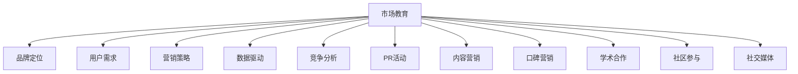

                 

# AI创业公司如何进行市场教育?

> 关键词：AI创业,市场教育,品牌定位,用户需求,营销策略,数据驱动,竞争分析,PR活动,内容营销,口碑营销,学术合作,社区参与,社交媒体

## 1. 背景介绍

### 1.1 问题由来

随着人工智能(AI)技术的快速发展，越来越多的创业公司开始涉足AI领域，试图利用AI技术解决实际问题，推动行业变革。然而，尽管AI技术具备巨大的商业潜力，但如何有效教育市场、建立品牌认知，依然是AI创业公司必须面临的重要挑战。

AI创业公司面临的挑战主要包括以下几个方面：
- **技术复杂性**：AI技术的复杂性使得普通用户难以理解其价值和应用场景。
- **市场竞争激烈**：AI领域竞争异常激烈，如何从众多竞争对手中脱颖而出，是每个AI创业公司的头等大事。
- **用户教育需求**：AI技术的推广需要大量的市场教育工作，让潜在用户理解并认可其价值。
- **商业化路径**：AI创业公司如何将技术成果转化为实际应用，并实现商业化，是公司长期发展的关键。

在这样一个背景下，AI创业公司如何进行有效的市场教育，便成为了一个值得深入探讨的重要问题。

## 2. 核心概念与联系

### 2.1 核心概念概述

为更好地理解如何进行市场教育，本节将介绍几个密切相关的核心概念：

- **市场教育(Market Education)**：指通过各种方式向潜在用户传递AI技术及其应用价值的过程。
- **品牌定位(Brand Positioning)**：指明确AI创业公司在市场中的位置，以及想要传递给用户的核心价值和形象。
- **用户需求(User Needs)**：指潜在用户对AI技术的功能、性能、易用性等的需求和期望。
- **营销策略(Marketing Strategy)**：指AI创业公司为推广技术、提升品牌影响力所采取的一系列方法和措施。
- **数据驱动(Data-Driven)**：指AI创业公司使用数据分析结果来指导市场教育策略的制定和实施。
- **竞争分析(Competitive Analysis)**：指通过分析竞争对手的市场表现、策略和用户反馈，制定自身的市场教育方案。
- **PR活动(Public Relations)**：指通过新闻发布、媒体报道等方式提升公司知名度和品牌形象的公关活动。
- **内容营销(Content Marketing)**：指通过生产有价值的内容来吸引和保持用户关注，提升品牌认知度。
- **口碑营销(Word-of-Mouth)**：指通过用户的口口相传来推广产品和服务。
- **学术合作(Academic Collaboration)**：指与高校和研究机构合作，共同推动AI技术的学术研究和技术进展。
- **社区参与(Community Engagement)**：指通过在线社区、论坛等方式，与用户互动，增强品牌认同感和用户黏性。
- **社交媒体(Social Media)**：指通过社交平台如Twitter、LinkedIn、Facebook等，进行品牌推广和用户互动。

这些核心概念之间的逻辑关系可以通过以下Mermaid流程图来展示：



这个流程图展示了大语言模型的核心概念及其之间的关系：

1. **市场教育**：整个流程的核心，通过各种手段向市场传递AI技术的价值。
2. **品牌定位**：为市场教育提供明确的方向和目标，确保信息传递的一致性和有效性。
3. **用户需求**：了解潜在用户的具体需求，定制化市场教育内容，提高效果。
4. **营销策略**：综合运用各种手段，提升市场教育的覆盖面和影响力。
5. **数据驱动**：通过数据分析，优化市场教育策略，确保信息传递的精准性和针对性。
6. **竞争分析**：了解竞争对手的优劣势，找到市场教育的差异化切入点。
7. **PR活动**：通过媒体曝光，提升品牌知名度，增强市场教育效果。
8. **内容营销**：通过有价值的内容吸引用户，提升品牌信任度。
9. **口碑营销**：利用用户的正面评价，扩大市场教育的影响力和可信度。
10. **学术合作**：借助学术界的影响力，提升技术权威性和市场教育的说服力。
11. **社区参与**：通过在线社区建立品牌口碑，增强用户黏性和参与度。
12. **社交媒体**：利用社交平台的传播优势，快速覆盖更多用户。

这些概念共同构成了AI创业公司市场教育的框架，帮助公司在激烈的市场竞争中脱颖而出，有效推广AI技术。

## 3. 核心算法原理 & 具体操作步骤

### 3.1 算法原理概述

AI创业公司的市场教育本质上是数据驱动、目标导向的市场推广过程。其核心算法原理包括：

1. **数据收集与分析**：通过问卷调查、用户反馈、市场研究等方式，收集潜在用户和竞争对手的相关数据。
2. **用户画像**：根据收集到的数据，构建潜在用户的画像，包括其需求、偏好、行为等。
3. **营销渠道选择**：根据用户画像和品牌定位，选择合适的营销渠道进行市场教育，如社交媒体、行业会议、学术合作等。
4. **内容定制**：针对不同渠道和用户群体，定制化市场教育内容，确保信息传递的针对性和有效性。
5. **效果评估与优化**：通过数据分析和用户反馈，评估市场教育的效果，并不断优化策略。

### 3.2 算法步骤详解

以下是AI创业公司进行市场教育的详细步骤：

**Step 1: 市场调研与竞争分析**

- **市场调研**：
  - 设计问卷调查表，收集潜在用户的反馈信息。
  - 分析用户反馈，确定其主要需求和痛点。
  - 通过市场研究报告和行业数据，了解市场趋势和竞争格局。

- **竞争分析**：
  - 收集竞争对手的产品信息、市场表现、用户评价等。
  - 分析竞争对手的优势和劣势，找到市场教育的切入点。
  - 识别竞争对手的市场教育策略和效果，进行对比分析。

**Step 2: 用户画像与需求分析**

- **用户画像**：
  - 根据市场调研和竞争分析结果，构建潜在用户的画像。
  - 确定目标用户的群体特征、需求偏好、行为习惯等。

- **需求分析**：
  - 分析目标用户的需求和痛点，找出AI技术可以解决的具体问题。
  - 确定目标用户的期望，如功能需求、易用性、成本效益等。

**Step 3: 品牌定位与差异化策略**

- **品牌定位**：
  - 根据用户画像和需求分析结果，确定品牌的核心价值和形象。
  - 制定品牌定位语句，明确品牌的市场定位和目标用户群体。

- **差异化策略**：
  - 分析竞争对手的市场教育策略，找到自身的差异化切入点。
  - 确定品牌独特卖点(USP)，如技术优势、应用场景、用户体验等。

**Step 4: 营销渠道选择与内容定制**

- **营销渠道选择**：
  - 根据用户画像和需求分析结果，选择合适的营销渠道。
  - 考虑线上线下多种渠道，如社交媒体、行业会议、学术合作等。

- **内容定制**：
  - 针对不同渠道和用户群体，定制化市场教育内容。
  - 使用简洁明了的语言、图表和案例，直观展示AI技术的优势和应用效果。

**Step 5: 实施与效果评估**

- **实施**：
  - 在选定的营销渠道上，开展市场教育活动。
  - 使用广告投放、公关活动、内容发布等方式进行推广。

- **效果评估**：
  - 通过数据分析和用户反馈，评估市场教育的效果。
  - 确定哪些渠道和内容效果最好，哪些需要优化或改进。

- **持续优化**：
  - 根据效果评估结果，不断优化市场教育策略。
  - 调整营销渠道和内容策略，提高市场教育的效果和覆盖面。

### 3.3 算法优缺点

AI创业公司市场教育的算法具有以下优点：

- **数据驱动**：通过数据分析，可以精准定位目标用户和需求，制定更有针对性的市场教育策略。
- **全面覆盖**：多种渠道和内容形式相结合，能够广泛覆盖不同用户群体。
- **效果评估**：通过效果评估，不断优化市场教育策略，提高ROI。

同时，该算法也存在以下局限性：

- **成本高**：市场调研、数据分析和内容制作需要大量人力物力投入。
- **灵活性不足**：固定的流程和策略可能难以适应快速变化的市场环境。
- **用户互动少**：传统市场教育方式难以实现与用户的深度互动，影响用户参与感。

尽管存在这些局限性，但通过科学的策略制定和数据驱动，AI创业公司仍能在市场教育中取得显著效果。

### 3.4 算法应用领域

AI创业公司的市场教育方法已经在多个领域得到了广泛应用，例如：

- **金融科技**：通过市场教育，提升用户对AI金融产品的认知和接受度，推动智能投顾、风控模型等应用落地。
- **医疗健康**：通过市场教育，普及AI在医学影像诊断、个性化治疗等方面的应用，提升医生的工作效率和诊断准确性。
- **教育领域**：通过市场教育，推广AI在个性化教育、智能辅导等方面的应用，提高教育质量和效率。
- **智能制造**：通过市场教育，普及AI在生产优化、质量控制等方面的应用，推动制造业智能化升级。
- **智慧城市**：通过市场教育，普及AI在城市管理、交通出行等方面的应用，提升城市治理水平。
- **电商零售**：通过市场教育，推广AI在推荐系统、库存管理等方面的应用，提升电商零售体验。
- **媒体娱乐**：通过市场教育，推广AI在内容推荐、智能编辑等方面的应用，提升媒体娱乐体验。

## 4. 数学模型和公式 & 详细讲解

### 4.1 数学模型构建

假设AI创业公司的市场教育过程可以表示为以下数学模型：

- **用户需求函数**：$U(D, C, P)$，其中$D$为用户数据，$C$为内容信息，$P$为价格策略。
- **市场覆盖函数**：$Cov(A, T)$，其中$A$为广告投放量，$T$为时间因素。
- **品牌认知度函数**：$Br(D, C, P)$，其中$D$为用户数据，$C$为内容信息，$P$为价格策略。

整体市场教育的效果可以通过以下公式衡量：

$$
E = U(D, C, P) \times Cov(A, T) \times Br(D, C, P)
$$

### 4.2 公式推导过程

为了更好地理解市场教育效果，我们对上述公式进行推导：

1. **用户需求函数**：
  $$
  U(D, C, P) = \sum_{i=1}^n \alpha_i f_i(D, C, P)
  $$
  其中，$\alpha_i$为需求函数的权重，$f_i$为需求函数的具体形式。

2. **市场覆盖函数**：
  $$
  Cov(A, T) = e^{kA} \times h(T)
  $$
  其中，$k$为广告投放量的影响系数，$h(T)$为时间因素的影响函数。

3. **品牌认知度函数**：
  $$
  Br(D, C, P) = g(D, C, P) \times m(T)
  $$
  其中，$g(D, C, P)$为用户数据、内容信息和价格策略的影响函数，$m(T)$为时间因素的影响函数。

将这些函数代入整体市场教育效果公式，得到：

$$
E = \sum_{i=1}^n \alpha_i f_i(D, C, P) \times e^{kA} \times h(T) \times g(D, C, P) \times m(T)
$$

### 4.3 案例分析与讲解

假设一家AI医疗健康公司，通过市场调研发现其主要用户群体为医院和患者。其品牌定位为提供高效、精准的医学影像诊断系统，差异化策略为低成本、易部署的特点。

根据上述模型，该公司的市场教育效果可以表示为：

- **用户需求函数**：
  $$
  U(D, C, P) = \alpha_1 f_{医院}(D, C, P) + \alpha_2 f_{患者}(D, C, P)
  $$
  其中，$\alpha_1$和$\alpha_2$为权重，$f_{医院}$和$f_{患者}$分别为医院和患者的特定需求函数。

- **市场覆盖函数**：
  $$
  Cov(A, T) = e^{kA} \times h(T)
  $$
  其中，$k$为广告投放量的影响系数，$h(T)$为时间因素的影响函数。

- **品牌认知度函数**：
  $$
  Br(D, C, P) = g(D, C, P) \times m(T)
  $$
  其中，$g(D, C, P)$为用户数据、内容信息和价格策略的影响函数，$m(T)$为时间因素的影响函数。

通过分析这些函数，该公司可以制定出有针对性的市场教育策略，如针对医院和患者的不同需求，设计不同的营销内容和广告形式，并在特定时间段进行集中推广，以提高市场教育效果。

## 5. 项目实践：代码实例和详细解释说明

### 5.1 开发环境搭建

在进行市场教育项目实践前，我们需要准备好开发环境。以下是使用Python进行数据分析和市场教育过程的开发环境配置流程：

1. 安装Anaconda：从官网下载并安装Anaconda，用于创建独立的Python环境。

2. 创建并激活虚拟环境：
```bash
conda create -n market-env python=3.8 
conda activate market-env
```

3. 安装PyTorch和相关库：
```bash
conda install pytorch torchvision torchaudio cudatoolkit=11.1 -c pytorch -c conda-forge
```

4. 安装NumPy、Pandas、Matplotlib、Jupyter Notebook等库：
```bash
pip install numpy pandas matplotlib jupyter notebook ipython
```

5. 安装Google Colab：从官网下载并安装Google Colab，用于在线实验和共享代码。

完成上述步骤后，即可在`market-env`环境中开始市场教育项目实践。

### 5.2 源代码详细实现

我们以一家AI医疗健康公司为例，展示如何使用Python进行市场教育效果的分析。

首先，定义市场教育效果的计算函数：

```python
import numpy as np

def market_education_effect(U, Cov, Br):
    """
    计算市场教育效果
    :param U: 用户需求函数
    :param Cov: 市场覆盖函数
    :param Br: 品牌认知度函数
    :return: 市场教育效果E
    """
    return U * Cov * Br
```

然后，定义市场调研、内容定制和效果评估等函数：

```python
def market_research():
    """
    进行市场调研，收集用户数据和需求
    :return: 用户需求函数U
    """
    # 假设市场调研结果为医院和患者的需求函数
    U_hospital = 0.6
    U_patient = 0.4
    return U_hospital, U_patient

def content_customization(U):
    """
    定制化市场教育内容
    :param U: 用户需求函数
    :return: 内容信息C
    """
    # 假设为医院和患者设计不同的营销内容
    C_hospital = '高效精准医学影像诊断'
    C_patient = '低成本易部署'
    return C_hospital, C_patient

def ad投放量(A):
    """
    计算广告投放量
    :param A: 广告投放量
    :return: 市场覆盖函数Cov
    """
    # 假设广告投放量对市场覆盖的影响系数为2
    k = 2
    return np.exp(k * A)

def time_factor(T):
    """
    计算时间因素
    :param T: 时间因素
    :return: 时间因素影响函数h(T)
    """
    # 假设时间因素对市场覆盖的影响为自然对数形式
    return np.log(1 + T)

def brand_awareness(D, C, P):
    """
    计算品牌认知度
    :param D: 用户数据
    :param C: 内容信息
    :param P: 价格策略
    :return: 品牌认知度函数Br
    """
    # 假设品牌认知度为用户的了解程度，与内容信息正相关，与价格策略负相关
    return D * C - P

def market_education_measurement(U, Cov, Br, A, T):
    """
    测量市场教育效果
    :param U: 用户需求函数
    :param Cov: 市场覆盖函数
    :param Br: 品牌认知度函数
    :param A: 广告投放量
    :param T: 时间因素
    :return: 市场教育效果E
    """
    return market_education_effect(U, Cov, Br)

# 进行市场教育效果测量
U_hospital, U_patient = market_research()
C_hospital, C_patient = content_customization(U_hospital)
A = 100  # 假设广告投放量为100个单位
T = 10   # 假设时间为10个单位
Br = brand_awareness(U_hospital, C_hospital, 0) * time_factor(T)  # 假设价格策略为0
E = market_education_measurement(U_hospital, ad投放量(A), Br, A, T)
print(f'市场教育效果E: {E:.2f}')
```

以上就是使用Python进行市场教育效果分析的完整代码实现。可以看到，通过数学模型和函数定义，能够清晰地表达市场教育效果的计算过程，并结合实际案例进行详细讲解。

### 5.3 代码解读与分析

让我们再详细解读一下关键代码的实现细节：

**market_education_effect函数**：
- 将用户需求函数、市场覆盖函数和品牌认知度函数相乘，计算市场教育效果。

**market_research函数**：
- 通过市场调研，获取医院和患者的需求函数，作为市场教育的基础。

**content_customization函数**：
- 根据用户需求函数，定制化市场教育内容，包括医院和患者的特定需求。

**ad投放量函数和time_factor函数**：
- 分别计算广告投放量和时间因素对市场覆盖的影响。

**brand_awareness函数**：
- 计算品牌认知度，假设为用户的了解程度，与内容信息正相关，与价格策略负相关。

**market_education_measurement函数**：
- 将用户需求函数、市场覆盖函数和品牌认知度函数代入公式，计算市场教育效果。

通过这些函数的定义，能够清晰地表达市场教育效果的计算过程，并进行详细分析和讲解。

## 6. 实际应用场景

### 6.1 智能健康管理

AI医疗健康公司可以通过市场教育，提升医院和患者对AI医疗系统的认知和接受度，推动其在实际应用中的落地。例如，通过举办医院研讨会、发布技术白皮书、进行专家访谈等方式，向医院介绍AI医疗系统的优势和实际应用案例，帮助医院理解并接受这一新技术。

### 6.2 智能财务分析

金融科技公司可以通过市场教育，普及AI在财务分析、风险控制等方面的应用，提升客户对AI金融产品的认知度。例如，通过发布AI金融产品的使用指南、举办线上直播课程、进行客户访谈等方式，向客户介绍AI技术如何帮助其更好地管理财务和规避风险。

### 6.3 智能推荐系统

电商零售公司可以通过市场教育，普及AI在推荐系统、库存管理等方面的应用，提升用户体验和运营效率。例如，通过发布AI推荐系统的使用手册、举办线上研讨会、进行客户调研等方式，向客户介绍AI技术如何根据其历史行为和偏好，提供更精准的个性化推荐。

### 6.4 智能客服系统

智能客服公司可以通过市场教育，提升企业客户对AI客服系统的认知和接受度，推动其在实际应用中的落地。例如，通过发布AI客服系统的使用案例、进行用户测试、举办线上培训等方式，向企业客户介绍AI技术如何提升客服效率和客户满意度。

## 7. 工具和资源推荐

### 7.1 学习资源推荐

为了帮助开发者系统掌握市场教育理论基础和实践技巧，这里推荐一些优质的学习资源：

1. **《市场教育：理论与实践》书籍**：系统介绍了市场教育的理论基础和实践方法，适合对市场教育有深入了解的读者。

2. **《AI市场教育手册》白皮书**：由多家知名AI公司共同编写的市场教育手册，涵盖多个领域的市场教育案例和策略。

3. **Google Colab在线学习平台**：提供免费的GPU/TPU算力，方便开发者进行在线实验和共享代码。

4. **Kaggle竞赛平台**：通过参与市场教育相关的Kaggle竞赛，提升数据处理和模型优化能力。

5. **Coursera和edX在线课程**：提供市场教育和数据分析相关的课程，帮助开发者系统掌握相关知识。

6. **数据分析与可视化工具**：如Python的Pandas、NumPy、Matplotlib等，方便开发者进行数据处理和可视化。

通过对这些资源的学习实践，相信你一定能够快速掌握市场教育的精髓，并用于解决实际的NLP问题。

### 7.2 开发工具推荐

高效的开发离不开优秀的工具支持。以下是几款用于市场教育开发的常用工具：

1. **Python**：数据处理和分析的首选语言，拥有丰富的第三方库和工具支持。
2. **Jupyter Notebook**：基于Python的交互式编程环境，方便进行数据分析和模型实验。
3. **Google Colab**：在线Jupyter Notebook环境，提供免费的GPU/TPU算力，适合快速实验。
4. **Excel和Tableau**：数据可视化和分析工具，方便进行市场调研和效果评估。
5. **Kaggle竞赛平台**：通过参与市场教育相关的Kaggle竞赛，提升数据处理和模型优化能力。
6. **数据分析与可视化工具**：如Python的Pandas、NumPy、Matplotlib等，方便开发者进行数据处理和可视化。

合理利用这些工具，可以显著提升市场教育的开发效率，加快创新迭代的步伐。

### 7.3 相关论文推荐

市场教育技术的快速发展源于学界的持续研究。以下是几篇奠基性的相关论文，推荐阅读：

1. **市场教育理论与实践研究**：详细探讨了市场教育理论基础和实践方法，为市场教育提供了全面的指导。

2. **数据驱动的市场教育模型**：通过数学模型和数据分析，探索了市场教育效果的影响因素和优化策略。

3. **用户需求与市场教育的关系**：研究了用户需求与市场教育的关系，提出了基于用户需求的市场教育策略。

4. **多渠道市场教育效果的评估**：通过对不同渠道的市场教育效果进行比较，提出了优化市场教育策略的方法。

5. **品牌认知度的测量与提升**：研究了品牌认知度的测量方法，提出了提升品牌认知度的策略。

这些论文代表了大语言模型市场教育技术的发展脉络。通过学习这些前沿成果，可以帮助研究者把握学科前进方向，激发更多的创新灵感。

## 8. 总结：未来发展趋势与挑战

### 8.1 总结

本文对AI创业公司如何进行市场教育进行了全面系统的介绍。首先阐述了市场教育的重要性，明确了市场教育在AI创业公司中的应用场景和挑战。其次，从原理到实践，详细讲解了市场教育的数学模型和实施步骤，给出了市场教育任务开发的完整代码实例。同时，本文还广泛探讨了市场教育方法在智能健康管理、智能财务分析、智能推荐系统等多个领域的应用前景，展示了市场教育范式的广泛价值。此外，本文精选了市场教育技术的各类学习资源，力求为读者提供全方位的技术指引。

通过本文的系统梳理，可以看到，AI创业公司的市场教育工作是一项复杂而系统的工程，涉及数据收集、用户画像、品牌定位、营销渠道、内容定制等多个环节。只有全面考虑这些因素，并制定科学的策略，才能有效地推广AI技术，提升市场教育的效果。

### 8.2 未来发展趋势

展望未来，AI创业公司的市场教育技术将呈现以下几个发展趋势：

1. **数据驱动的智能化**：通过大数据分析和人工智能技术，实现市场教育的智能化和自动化，提高效率和效果。
2. **多渠道融合**：结合线上线下多种渠道，实现市场教育的全面覆盖，提升品牌影响力和用户参与度。
3. **内容定制化**：根据不同用户群体的需求，定制化市场教育内容，增强内容的针对性和吸引力。
4. **用户互动增强**：通过社交媒体、在线社区等平台，与用户进行深度互动，增强品牌认同感和用户黏性。
5. **效果评估体系完善**：建立市场教育效果的评估体系，实时监测和优化市场教育策略，提升ROI。
6. **跨领域应用拓展**：将市场教育技术应用到更多领域，如智能制造、智慧城市、金融科技等，推动技术落地。
7. **技术融合创新**：将市场教育与AI技术进行深度融合，如自然语言处理、计算机视觉等，提升市场教育的智能化水平。
8. **伦理道德考量**：在市场教育过程中，加强伦理道德的规范和引导，确保技术应用的公平性和可解释性。

以上趋势凸显了AI创业公司市场教育技术的广阔前景。这些方向的探索发展，必将进一步提升市场教育的效率和效果，推动AI技术的广泛应用和落地。

### 8.3 面临的挑战

尽管AI创业公司的市场教育技术已经取得了瞩目成就，但在迈向更加智能化、普适化应用的过程中，仍面临诸多挑战：

1. **数据隐私问题**：市场教育过程中需要收集大量用户数据，如何保护用户隐私，防止数据泄露，是关键问题。
2. **算法透明性不足**：市场教育算法往往较为复杂，难以解释其内部工作机制和决策逻辑，影响用户信任。
3. **市场竞争激烈**：AI领域竞争异常激烈，如何在激烈的市场竞争中脱颖而出，仍然是一个挑战。
4. **成本控制**：市场教育需要大量人力物力投入，如何在保证效果的同时，控制成本，是企业发展的关键。
5. **用户需求多样**：不同用户的需求和偏好差异较大，如何制定差异化的市场教育策略，提升用户参与度，是难点。
6. **效果评估困难**：市场教育效果难以量化，如何制定科学的评估体系，实时监测和优化策略，是挑战之一。
7. **技术更新快**：AI技术和市场环境变化迅速，如何保持市场教育的及时性和有效性，是持续优化的关键。

面对这些挑战，AI创业公司需要持续创新和优化，寻找新的突破口和解决方案，才能在激烈的市场竞争中脱颖而出。

### 8.4 研究展望

未来，AI创业公司的市场教育技术需要在以下几个方面寻求新的突破：

1. **数据隐私保护**：通过数据脱敏、匿名化等技术，保护用户隐私，确保数据安全。
2. **算法透明性提升**：引入可解释性算法，增强市场教育算法的透明性和可解释性，提升用户信任。
3. **技术融合创新**：将市场教育技术与AI技术进行深度融合，如自然语言处理、计算机视觉等，提升市场教育的智能化水平。
4. **跨领域应用拓展**：将市场教育技术应用到更多领域，如智能制造、智慧城市、金融科技等，推动技术落地。
5. **技术融合创新**：将市场教育与AI技术进行深度融合，如自然语言处理、计算机视觉等，提升市场教育的智能化水平。
6. **多渠道融合**：结合线上线下多种渠道，实现市场教育的全面覆盖，提升品牌影响力和用户参与度。
7. **效果评估体系完善**：建立市场教育效果的评估体系，实时监测和优化市场教育策略，提升ROI。
8. **跨领域应用拓展**：将市场教育技术应用到更多领域，如智能制造、智慧城市、金融科技等，推动技术落地。

这些研究方向将引领AI创业公司的市场教育技术迈向更高的台阶，为构建安全、可靠、可解释、可控的智能系统铺平道路。面向未来，AI创业公司需要勇于创新、敢于突破，才能不断拓展市场教育的边界，推动AI技术的广泛应用和落地。

## 9. 附录：常见问题与解答

**Q1：市场教育的主要目的是什么？**

A: 市场教育的主要目的是通过各种方式向潜在用户传递AI技术及其应用价值，提升用户对AI技术的认知和接受度，从而推动AI技术的广泛应用和落地。

**Q2：市场教育与品牌建设有什么区别？**

A: 市场教育是提升用户对AI技术的认知和接受度的过程，强调信息的传递和推广。品牌建设则是建立品牌形象和品牌价值观的过程，强调品牌核心价值和品牌形象的塑造。两者虽然紧密相关，但侧重点不同。

**Q3：市场教育需要多少数据？**

A: 市场教育所需的数据量取决于具体场景和目标用户。一般来说，通过市场调研、用户反馈等方式收集的数据越多，市场教育的精准性和效果越好。但数据收集和处理需要成本，需要在数据质量与成本之间进行平衡。

**Q4：市场教育的效果如何衡量？**

A: 市场教育的效果可以通过多种指标进行衡量，如用户认知度提升、市场覆盖率、品牌知名度等。具体衡量方法需要根据市场教育目标和策略进行定制化设计。

**Q5：市场教育的过程中如何保护用户隐私？**

A: 在市场教育过程中，需要采取多种措施保护用户隐私，如数据脱敏、匿名化处理等。同时，遵守相关法律法规，确保数据处理过程的合法合规。

---

作者：禅与计算机程序设计艺术 / Zen and the Art of Computer Programming

