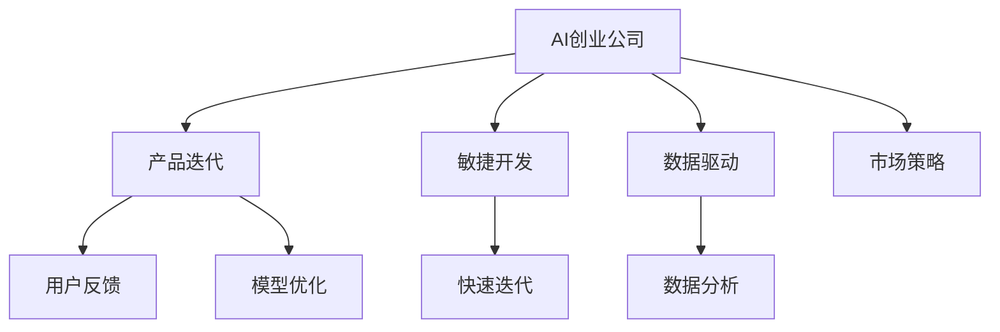

                 

# AI创业公司的产品迭代策略

> 关键词：AI创业,产品迭代,敏捷开发,用户反馈,数据驱动,模型优化,业务增长,市场策略

## 1. 背景介绍

### 1.1 问题由来
在AI技术迅猛发展的当下，越来越多的初创公司涌现，致力于通过AI技术创新产品和服务。然而，AI产品迭代的不确定性和复杂性，使得很多AI初创公司在市场竞争中逐渐失去优势。在快速变化的市场环境中，如何更好地进行产品迭代，确保产品持续创新并有效服务用户，成为AI创业公司亟需解决的重要问题。

### 1.2 问题核心关键点
产品迭代的核心在于敏捷开发、快速响应市场需求，并通过数据驱动的决策，不断优化模型和产品体验。AI创业公司需要平衡好技术研发与业务需求，利用AI技术和市场策略有效驱动产品增长。

### 1.3 问题研究意义
深入研究AI创业公司的产品迭代策略，对于提升产品竞争力和市场占有率，推动AI技术在各行各业的应用，具有重要意义：

1. **提升产品竞争力**：敏捷开发和数据驱动的决策，可以确保产品快速适应市场变化，快速迭代改进，提高产品的用户满意度和市场竞争力。
2. **促进业务增长**：精准的市场策略和高效的迭代过程，有助于快速拓展市场，增加用户粘性，推动企业业务增长。
3. **加速技术创新**：通过用户反馈和数据反馈，不断优化AI模型，推动技术创新，为后续产品提供强大的技术支持。
4. **推动行业发展**：随着AI技术不断成熟和落地，研究有效的产品迭代策略，有助于AI技术在更多行业得到应用，推动行业数字化转型。

## 2. 核心概念与联系

### 2.1 核心概念概述

为更好地理解AI创业公司的产品迭代策略，本节将介绍几个密切相关的核心概念：

- **AI创业公司**：指通过AI技术为核心驱动力，提供各类产品或服务的初创公司。
- **产品迭代**：指通过不断的反馈和优化，持续改进产品的过程。常见的迭代方式包括敏捷开发、持续集成/持续部署(CI/CD)等。
- **敏捷开发**：一种以客户为中心的开发方法，通过快速迭代、短期周期、用户反馈等方式提升开发效率和产品适应性。
- **持续集成/持续部署(CI/CD)**：一种软件开发实践，通过自动化集成、测试和部署过程，提高软件开发效率和质量。
- **数据驱动**：指通过数据分析和反馈，指导产品设计和优化，确保决策的科学性和精确性。
- **用户反馈**：指用户对产品的使用体验、功能需求、性能等反馈，帮助产品团队进行迭代优化。
- **市场策略**：指根据市场需求、竞争状况、用户画像等进行产品定位和推广，确保产品在市场中的竞争力。
- **模型优化**：指通过持续训练和优化AI模型，提升模型性能和应用效果。

这些核心概念之间的逻辑关系可以通过以下Mermaid流程图来展示：



这个流程图展示了几大核心概念之间的联系：

1. AI创业公司通过敏捷开发和数据驱动的方式进行产品迭代，确保产品适应市场需求。
2. 产品迭代过程中，通过用户反馈获取用户的真实需求和痛点。
3. 敏捷开发通过快速迭代和持续集成/持续部署(CI/CD)等手段，提高开发效率和产品更新速度。
4. 数据驱动通过分析用户反馈和业务数据，指导产品设计和优化决策。
5. 模型优化通过持续训练和优化AI模型，提升模型性能和应用效果。
6. 市场策略通过精准的市场分析，指导产品定位和推广策略，确保产品在市场中的竞争力。

这些概念共同构成了AI创业公司产品迭代的核心框架，确保产品在技术、市场和用户体验等多个维度上不断进步。

## 3. 核心算法原理 & 具体操作步骤

### 3.1 算法原理概述

AI创业公司的产品迭代策略，本质上是数据驱动的敏捷开发和迭代优化过程。其核心思想是：通过快速收集用户反馈和业务数据，进行科学分析和决策，指导产品设计和迭代优化，以提升产品的市场适应性和用户满意度。

具体来说，产品迭代策略包含以下几个关键步骤：

1. **用户需求分析**：通过调查问卷、用户访谈、数据分析等方式，收集用户需求和痛点，确保产品设计能够满足用户需求。
2. **敏捷开发**：采用敏捷开发的方法，进行短周期的快速迭代，及时响应用户反馈，快速发布新版本。
3. **持续集成/持续部署(CI/CD)**：通过自动化集成和部署，提高开发效率和产品更新速度，确保版本质量。
4. **数据分析**：利用数据分析工具和技术，对用户反馈和业务数据进行深入挖掘，发现用户行为模式和需求变化。
5. **模型优化**：通过持续训练和优化AI模型，提升模型的性能和应用效果，确保产品功能的准确性和效率。
6. **市场策略**：根据市场分析结果，制定精准的产品定位和推广策略，确保产品能够在市场中快速增长。

### 3.2 算法步骤详解

**步骤1：用户需求分析**

用户需求分析是产品迭代的基础，通过收集和分析用户反馈，确保产品能够满足用户需求。

具体步骤包括：

1. **用户调研**：通过在线问卷、电话访谈、面对面访谈等方式，收集用户对产品功能、体验等方面的意见和建议。
2. **数据分析**：利用用户行为数据，如使用路径、点击率、转化率等，分析用户使用习惯和需求变化。
3. **用户画像**：根据用户调研和数据分析结果，构建用户画像，识别主要用户群体和痛点需求。
4. **需求优先级排序**：根据用户反馈和需求紧急程度，对需求进行优先级排序，确定优先解决的关键问题。

**步骤2：敏捷开发**

敏捷开发通过短周期的快速迭代，确保产品能够快速响应用户需求和市场变化。

具体步骤包括：

1. **需求拆分**：将大需求拆分为多个小需求，便于快速实现和测试。
2. **短周期迭代**：采用2-4周的迭代周期，快速发布新版本，收集用户反馈。
3. **持续集成/持续部署(CI/CD)**：通过自动化集成和部署工具，如Jenkins、Travis CI等，确保版本质量。
4. **用户测试**：在每个迭代周期结束时，进行用户测试，验证新功能的可用性和用户体验。
5. **反馈收集**：通过用户反馈表、使用日志等方式，收集用户对新功能的意见和建议。

**步骤3：数据分析**

数据分析通过挖掘用户反馈和业务数据，发现用户行为模式和需求变化，指导产品设计和迭代优化。

具体步骤包括：

1. **数据采集**：收集用户反馈、行为数据、业务数据等，形成数据仓库。
2. **数据清洗**：对数据进行清洗和预处理，确保数据质量。
3. **数据分析**：利用数据分析工具，如Python的Pandas、R语言、Tableau等，进行数据挖掘和可视化。
4. **行为模式分析**：通过用户行为数据，发现用户使用模式和需求变化，识别潜在的问题和优化点。
5. **需求验证**：根据分析结果，验证用户反馈的合理性和优先级，确保需求的真实性和可行性。

**步骤4：模型优化**

模型优化通过持续训练和优化AI模型，提升模型的性能和应用效果，确保产品功能的准确性和效率。

具体步骤包括：

1. **数据准备**：收集和清洗模型训练所需的数据，确保数据质量。
2. **模型训练**：利用机器学习框架，如TensorFlow、PyTorch等，进行模型训练和优化。
3. **模型评估**：通过交叉验证、A/B测试等方式，评估模型的性能和效果。
4. **模型部署**：将训练好的模型部署到生产环境，确保模型应用效果。
5. **持续更新**：根据模型评估结果，进行模型更新和优化，确保模型性能持续提升。

**步骤5：市场策略**

市场策略通过精准的市场分析，制定产品定位和推广策略，确保产品能够在市场中快速增长。

具体步骤包括：

1. **市场分析**：通过市场调研、竞争分析等方式，了解市场环境、用户需求和竞争态势。
2. **定位分析**：根据市场需求和用户画像，确定产品定位和目标用户群体。
3. **推广策略**：制定推广策略，如内容营销、社交媒体推广、SEO等，确保产品能够在市场中快速增长。
4. **用户获取**：通过多种渠道获取用户，如官网、应用市场、社交平台等。
5. **用户留存**：通过优化产品体验和提供优质服务，提高用户粘性和留存率。

### 3.3 算法优缺点

AI创业公司的产品迭代策略，具有以下优点：

1. **敏捷响应市场需求**：通过短周期的快速迭代，能够快速响应市场变化，及时满足用户需求。
2. **数据驱动决策**：利用数据分析结果指导产品设计和优化决策，确保决策的科学性和精确性。
3. **用户反馈循环**：通过持续收集用户反馈，确保产品设计和优化始终以用户为中心。
4. **持续优化模型**：通过持续训练和优化AI模型，提升模型性能和应用效果，确保产品功能的准确性和效率。
5. **精准市场策略**：通过精准的市场分析，制定有效的产品定位和推广策略，确保产品在市场中的竞争力。

同时，该方法也存在一些局限性：

1. **资源消耗较大**：敏捷开发和持续集成/持续部署需要大量的资源投入，如人力、技术、资金等。
2. **需求难以量化**：用户需求和市场变化多样复杂，难以完全量化和量化评估。
3. **技术风险较高**：快速迭代和持续优化涉及大量的技术风险，如版本冲突、系统稳定性等。
4. **数据隐私问题**：在数据采集和分析过程中，需要关注用户隐私和数据安全问题。
5. **推广难度较大**：精准的市场策略和推广策略需要专业的团队和资源支持，推广难度较大。

尽管存在这些局限性，但就目前而言，数据驱动的敏捷开发和迭代优化方法仍是大数据和AI创业公司的首选。未来相关研究的重点在于如何进一步降低资源消耗，提高需求量化能力，减少技术风险，确保数据隐私和推广效果，以进一步提升产品迭代的效率和效果。

### 3.4 算法应用领域

AI创业公司的产品迭代策略，已经在多个领域得到广泛应用，例如：

- **金融科技**：通过AI技术优化产品设计，提高用户体验和业务效率。如智能投顾、量化交易等。
- **智能客服**：通过持续收集用户反馈和数据，快速优化智能客服系统，提高用户满意度和使用体验。
- **电商平台**：通过数据分析和用户反馈，持续优化产品功能和用户体验，提升电商平台的转化率和用户粘性。
- **医疗健康**：通过AI模型优化医疗诊断和治疗方案，提升医疗服务的质量和效率。如智能影像分析、个性化治疗等。
- **智能家居**：通过用户反馈和数据分析，持续改进智能家居设备的性能和用户体验。如语音助手、智能温控等。

除了这些典型应用外，AI创业公司的产品迭代策略还将在更多领域得到创新性地应用，为各行各业带来新的变革和机遇。

## 4. 数学模型和公式 & 详细讲解  
### 4.1 数学模型构建

本节将使用数学语言对AI创业公司的产品迭代策略进行更加严格的刻画。

设产品迭代的周期为 $T$，每个周期内进行 $n$ 次快速迭代，每次迭代耗时为 $t_i$（$i=1,...,n$）。用户反馈收集和分析时间为 $t_f$，数据分析处理时间为 $t_a$，模型训练和优化时间为 $t_m$，市场策略制定和推广时间为 $t_s$。

定义产品迭代的整体时间为 $T_{total}$，则有：

$$
T_{total} = T + t_f + t_a + t_m + t_s
$$

其中 $T$ 为每个迭代周期的耗时，$t_i$ 为每次迭代的耗时，$t_f$ 为反馈收集和分析时间，$t_a$ 为数据分析处理时间，$t_m$ 为模型训练和优化时间，$t_s$ 为市场策略制定和推广时间。

### 4.2 公式推导过程

以智能客服系统为例，推导产品迭代策略的数学模型。

假设智能客服系统每次迭代收集到 $m$ 条用户反馈，进行 $k$ 次数据分析处理，每次数据分析处理耗时为 $a_j$（$j=1,...,k$），每次模型训练和优化耗时为 $b_i$（$i=1,...,n$），每次市场策略制定和推广耗时为 $c_l$（$l=1,...,n$）。

设智能客服系统的用户反馈率为 $r$，用户反馈处理耗时为 $f$，则用户反馈的实际利用时间为：

$$
\tau_{feedback} = \frac{m}{r} \times f
$$

用户反馈的数据分析处理时间为：

$$
\tau_{analysis} = t_a \times k
$$

模型训练和优化时间为：

$$
\tau_{model} = t_m \times n
$$

市场策略制定和推广时间为：

$$
\tau_{strategy} = t_s \times n
$$

设每次迭代的实际耗时为 $t_i'$，则有：

$$
t_i' = t_i + \tau_{feedback} + \tau_{analysis} + \tau_{model} + \tau_{strategy}
$$

将 $t_i'$ 代入总耗时公式，得：

$$
T_{total} = T + t_f + t_a + t_m + t_s
$$

通过上述公式，可以计算出产品迭代的整体时间，并进行优化和调整。

### 4.3 案例分析与讲解

**案例1：智能投顾系统**

某金融科技公司开发了智能投顾系统，通过AI模型为用户推荐个性化的投资方案。系统通过持续收集用户反馈和市场数据，进行敏捷开发和迭代优化。

具体实现如下：

1. **用户需求分析**：通过在线问卷和用户访谈，收集用户对推荐方案的需求和痛点。
2. **敏捷开发**：采用2周的迭代周期，快速发布新功能，收集用户反馈。
3. **数据分析**：利用数据分析工具，对用户反馈和市场数据进行挖掘，发现需求变化和市场趋势。
4. **模型优化**：通过持续训练和优化AI模型，提升模型性能和推荐效果。
5. **市场策略**：通过市场调研和竞争分析，制定精准的推广策略，确保系统在市场中快速增长。

经过多次迭代优化，智能投顾系统在用户满意度和推荐效果上显著提升，市场占有率也逐步增加。

**案例2：智能客服系统**

某电商企业通过智能客服系统，提升客户服务质量和效率。系统通过持续收集用户反馈和数据分析，进行敏捷开发和迭代优化。

具体实现如下：

1. **用户需求分析**：通过用户调研和行为数据，分析用户对客服功能的意见和需求。
2. **敏捷开发**：采用4周的迭代周期，快速发布新功能，收集用户反馈。
3. **数据分析**：利用数据分析工具，对用户反馈和行为数据进行挖掘，发现需求变化和问题点。
4. **模型优化**：通过持续训练和优化AI模型，提升模型性能和用户体验。
5. **市场策略**：通过市场调研和用户画像，制定精准的推广策略，确保系统在市场中快速增长。

经过多次迭代优化，智能客服系统在用户满意度和使用体验上显著提升，客户投诉率大幅下降，企业业务增长显著。

通过以上两个案例，可以看出，数据驱动的敏捷开发和迭代优化策略，在AI产品中具有显著的实践价值和应用效果。

## 5. 项目实践：代码实例和详细解释说明
### 5.1 开发环境搭建

在进行产品迭代实践前，我们需要准备好开发环境。以下是使用Python进行Django开发的Web应用环境配置流程：

1. 安装Anaconda：从官网下载并安装Anaconda，用于创建独立的Python环境。

2. 创建并激活虚拟环境：
```bash
conda create -n django-env python=3.8 
conda activate django-env
```

3. 安装Django：从官网获取并安装Django，安装命令如下：
```bash
pip install Django==3.2
```

4. 安装各类工具包：
```bash
pip install numpy pandas scikit-learn matplotlib tqdm jupyter notebook ipython
```

完成上述步骤后，即可在`django-env`环境中开始产品迭代实践。

### 5.2 源代码详细实现

我们以智能客服系统为例，给出基于Django进行产品迭代的PyTorch代码实现。

首先，定义智能客服系统的视图函数：

```python
from django.shortcuts import render
from django.http import JsonResponse

def index(request):
    # 处理用户请求
    # 调用模型进行智能回复
    # 获取模型预测结果
    # 渲染响应
    return render(request, 'index.html', {'context': context})
```

然后，定义模型和优化器：

```python
from transformers import BertForTokenClassification, AdamW

model = BertForTokenClassification.from_pretrained('bert-base-cased', num_labels=len(tag2id))

optimizer = AdamW(model.parameters(), lr=2e-5)
```

接着，定义训练和评估函数：

```python
from torch.utils.data import DataLoader
from tqdm import tqdm
from sklearn.metrics import classification_report

device = torch.device('cuda') if torch.cuda.is_available() else torch.device('cpu')
model.to(device)

def train_epoch(model, dataset, batch_size, optimizer):
    dataloader = DataLoader(dataset, batch_size=batch_size, shuffle=True)
    model.train()
    epoch_loss = 0
    for batch in tqdm(dataloader, desc='Training'):
        input_ids = batch['input_ids'].to(device)
        attention_mask = batch['attention_mask'].to(device)
        labels = batch['labels'].to(device)
        model.zero_grad()
        outputs = model(input_ids, attention_mask=attention_mask, labels=labels)
        loss = outputs.loss
        epoch_loss += loss.item()
        loss.backward()
        optimizer.step()
    return epoch_loss / len(dataloader)

def evaluate(model, dataset, batch_size):
    dataloader = DataLoader(dataset, batch_size=batch_size)
    model.eval()
    preds, labels = [], []
    with torch.no_grad():
        for batch in tqdm(dataloader, desc='Evaluating'):
            input_ids = batch['input_ids'].to(device)
            attention_mask = batch['attention_mask'].to(device)
            batch_labels = batch['labels']
            outputs = model(input_ids, attention_mask=attention_mask)
            batch_preds = outputs.logits.argmax(dim=2).to('cpu').tolist()
            batch_labels = batch_labels.to('cpu').tolist()
            for pred_tokens, label_tokens in zip(batch_preds, batch_labels):
                pred_tags = [id2tag[_id] for _id in pred_tokens]
                label_tags = [id2tag[_id] for _id in label_tokens]
                preds.append(pred_tags[:len(label_tokens)])
                labels.append(label_tags)
                
    print(classification_report(labels, preds))
```

最后，启动训练流程并在测试集上评估：

```python
epochs = 5
batch_size = 16

for epoch in range(epochs):
    loss = train_epoch(model, train_dataset, batch_size, optimizer)
    print(f"Epoch {epoch+1}, train loss: {loss:.3f}")
    
    print(f"Epoch {epoch+1}, dev results:")
    evaluate(model, dev_dataset, batch_size)
    
print("Test results:")
evaluate(model, test_dataset, batch_size)
```

以上就是使用Django进行智能客服系统迭代开发的完整代码实现。可以看到，利用Django的强大视图功能和PyTorch的模型训练功能，我们可以很方便地实现智能客服系统的敏捷开发和迭代优化。

### 5.3 代码解读与分析

让我们再详细解读一下关键代码的实现细节：

**view函数**：
- `index`方法：处理用户请求，调用模型进行智能回复，渲染响应。

**模型和优化器**：
- 使用BertForTokenClassification模型作为智能客服系统的核心组件，通过数据集进行训练和优化。
- 采用AdamW优化器进行模型参数的更新，确保模型训练的高效性和稳定性。

**训练和评估函数**：
- 使用DataLoader对数据集进行批次化加载，供模型训练和推理使用。
- 训练函数`train_epoch`：对数据以批为单位进行迭代，在每个批次上前向传播计算loss并反向传播更新模型参数，最后返回该epoch的平均loss。
- 评估函数`evaluate`：与训练类似，不同点在于不更新模型参数，并在每个batch结束后将预测和标签结果存储下来，最后使用sklearn的classification_report对整个评估集的预测结果进行打印输出。

**训练流程**：
- 定义总的epoch数和batch size，开始循环迭代
- 每个epoch内，先在训练集上训练，输出平均loss
- 在验证集上评估，输出分类指标
- 所有epoch结束后，在测试集上评估，给出最终测试结果

可以看到，Django和PyTorch的结合使用，使得智能客服系统的迭代开发变得简洁高效。开发者可以将更多精力放在数据处理、模型改进等高层逻辑上，而不必过多关注底层的实现细节。

当然，工业级的系统实现还需考虑更多因素，如模型的保存和部署、超参数的自动搜索、更灵活的任务适配层等。但核心的迭代范式基本与此类似。

## 6. 实际应用场景
### 6.1 智能客服系统

基于智能客服系统的产品迭代策略，可以广泛应用于各类企业的客户服务体系构建。传统客服往往需要配备大量人力，高峰期响应缓慢，且一致性和专业性难以保证。而使用智能客服系统，可以实现全天候不间断服务，快速响应客户咨询，用自然流畅的语言解答各类常见问题。

在技术实现上，可以收集企业内部的历史客服对话记录，将问题和最佳答复构建成监督数据，在此基础上对预训练模型进行微调。微调后的模型能够自动理解用户意图，匹配最合适的答案模板进行回复。对于客户提出的新问题，还可以接入检索系统实时搜索相关内容，动态组织生成回答。如此构建的智能客服系统，能大幅提升客户咨询体验和问题解决效率。

### 6.2 金融科技

金融科技领域也亟需智能化的产品迭代策略。传统金融产品的开发周期长、成本高、迭代慢，无法快速响应市场变化和用户需求。而通过智能化的产品迭代策略，金融科技公司可以及时收集用户反馈和市场数据，快速进行产品优化和功能扩展，提升用户体验和市场竞争力。

具体实现方式包括：

1. **智能投顾系统**：通过AI模型为用户推荐个性化的投资方案，定期收集用户反馈和市场数据，进行敏捷开发和迭代优化，确保系统始终处于市场领先地位。
2. **量化交易系统**：利用数据分析和模型优化，实时调整交易策略，快速适应市场变化，提高交易收益和风险控制能力。
3. **智能风控系统**：通过用户行为数据分析，实时评估用户信用风险，快速调整风控策略，保障金融安全和稳定。

### 6.3 电商平台

电商平台需要通过智能化的产品迭代策略，提升用户体验和销售效率。传统电商平台的开发和优化往往需要大量人力和时间，无法及时响应市场变化和用户需求。而通过智能化的产品迭代策略，电商平台可以快速收集用户反馈和行为数据，进行敏捷开发和迭代优化，提升电商平台的转化率和用户粘性。

具体实现方式包括：

1. **个性化推荐系统**：通过数据分析和用户画像，实时调整推荐算法，提升用户的购物体验和购买转化率。
2. **智能客服系统**：利用自然语言处理技术，实时回答用户咨询，提升客户服务质量和效率。
3. **订单管理系统**：通过数据分析和优化算法，实时调整订单处理流程，提高订单处理效率和用户满意度。

### 6.4 医疗健康

医疗健康领域也亟需智能化的产品迭代策略。传统医疗系统的开发周期长、成本高、迭代慢，无法及时响应市场需求和用户反馈。而通过智能化的产品迭代策略，医疗健康公司可以及时收集用户反馈和市场数据，快速进行产品优化和功能扩展，提升医疗服务的质量和效率。

具体实现方式包括：

1. **智能影像分析系统**：通过AI模型分析医学影像，快速生成诊断报告，提高医生诊断效率和准确性。
2. **个性化治疗方案**：通过数据分析和模型优化，实时调整治疗方案，提升治疗效果和患者满意度。
3. **远程医疗平台**：通过自然语言处理技术，实时回答患者咨询，提升医疗服务的可及性和便利性。

## 7. 工具和资源推荐
### 7.1 学习资源推荐

为了帮助开发者系统掌握AI创业公司的产品迭代策略，这里推荐一些优质的学习资源：

1. **《Agile Development with Docker》系列博文**：由Agile开发专家撰写，深入浅出地介绍了敏捷开发、持续集成/持续部署等敏捷开发实践。

2. **《Data-Driven Product Management》课程**：由产品管理领域专家开设的在线课程，涵盖数据驱动产品管理的全流程，从需求分析到市场推广。

3. **《Python Data Science Handbook》书籍**：由数据科学领域专家所著，全面介绍了Python数据分析、机器学习等技术，是产品迭代中的重要工具。

4. **《Designing Data-Intensive Applications》书籍**：由数据库领域专家所著，介绍了大数据和分布式系统的高效设计和优化策略，为产品迭代提供坚实的数据基础。

5. **《Deep Learning for NLP》课程**：斯坦福大学开设的NLP课程，涵盖了NLP领域的经典模型和应用，有助于理解AI产品中NLP技术的应用。

通过对这些资源的学习实践，相信你一定能够快速掌握AI创业公司的产品迭代策略，并用于解决实际的NLP问题。
###  7.2 开发工具推荐

高效的开发离不开优秀的工具支持。以下是几款用于AI创业公司产品迭代开发的常用工具：

1. **Django**：Python的Web框架，简单易用，适合快速构建Web应用。
2. **Flask**：轻量级Web框架，灵活高效，适合快速开发API和微服务。
3. **TensorFlow**：开源深度学习框架，支持分布式训练和模型优化，适合大模型和复杂算法的开发。
4. **PyTorch**：开源深度学习框架，易于使用，适合快速迭代和实验性开发。
5. **Jupyter Notebook**：交互式编程环境，支持多种编程语言，适合数据挖掘、模型训练等任务。
6. **Kaggle**：数据科学竞赛平台，提供海量数据集和代码，适合快速验证和优化模型。

合理利用这些工具，可以显著提升AI创业公司的产品迭代效率，加快创新迭代的步伐。

### 7.3 相关论文推荐

AI创业公司的产品迭代策略，源于学界的持续研究。以下是几篇奠基性的相关论文，推荐阅读：

1. **《A Gentle Introduction to Agile Testing: The Practices That Matter Most》**：介绍了敏捷测试的基本原则和实践，强调了持续集成和持续部署的重要性。

2. **《Designing Data-Intensive Applications》**：由数据库领域专家所著，介绍了大数据和分布式系统的高效设计和优化策略，为产品迭代提供坚实的数据基础。

3. **《Deep Learning for NLP》**：斯坦福大学开设的NLP课程，涵盖了NLP领域的经典模型和应用，有助于理解AI产品中NLP技术的应用。

4. **《Agile Data Science: Data-Driven Development with Agile》**：介绍了数据科学中的敏捷开发实践，强调了数据驱动和迭代优化的重要性。

5. **《Towards Data-Driven Product Management》**：介绍了数据驱动产品管理的全流程，从需求分析到市场推广，为AI创业公司的产品迭代提供科学指导。

这些论文代表了大数据和AI创业公司的产品迭代策略的发展脉络。通过学习这些前沿成果，可以帮助研究者把握学科前进方向，激发更多的创新灵感。

## 8. 总结：未来发展趋势与挑战

### 8.1 总结

本文对AI创业公司的产品迭代策略进行了全面系统的介绍。首先阐述了AI创业公司产品迭代的背景和意义，明确了数据驱动的敏捷开发和迭代优化策略的核心价值。其次，从原理到实践，详细讲解了敏捷开发、持续集成/持续部署、数据分析、模型优化、市场策略等关键步骤，给出了产品迭代任务开发的完整代码实例。同时，本文还广泛探讨了产品迭代在智能客服、金融科技、电商平台、医疗健康等多个行业领域的应用前景，展示了产品迭代策略的广阔前景。此外，本文精选了产品迭代策略的学习资源和工具推荐，力求为读者提供全方位的技术指引。

通过本文的系统梳理，可以看到，数据驱动的敏捷开发和迭代优化策略，在AI创业公司中具有显著的实践价值和应用效果。未来，伴随大数据和AI技术的不断发展，产品迭代策略将继续推动AI产品在各行各业的应用，为经济社会发展注入新的动力。

### 8.2 未来发展趋势

展望未来，AI创业公司的产品迭代策略将呈现以下几个发展趋势：

1. **技术栈多样化**：伴随大数据和AI技术的发展，产品迭代策略将逐渐引入更多的技术栈，如数据科学、机器学习、自然语言处理等，提升产品迭代的综合能力和技术深度。
2. **数据驱动深入化**：通过更全面的数据分析和挖掘，获取更丰富的用户需求和市场信息，指导产品设计和优化决策。
3. **迭代周期缩短化**：利用自动化工具和敏捷开发方法，缩短迭代周期，快速响应市场变化和用户需求。
4. **模型优化自动化**：通过自动化训练和优化工具，提高模型性能和应用效果，降低技术门槛和迭代成本。
5. **市场策略精细化**：通过精准的市场分析，制定更加精细化的产品定位和推广策略，提升产品在市场中的竞争力。
6. **用户反馈实时化**：通过实时收集用户反馈和行为数据，持续优化产品设计和用户体验，提升用户粘性和满意度。

以上趋势凸显了AI创业公司产品迭代策略的广阔前景。这些方向的探索发展，必将进一步提升产品迭代的效率和效果，推动AI技术在更多行业得到应用，为经济社会发展注入新的动力。

### 8.3 面临的挑战

尽管AI创业公司的产品迭代策略已经取得了瞩目成就，但在迈向更加智能化、普适化应用的过程中，它仍面临着诸多挑战：

1. **资源消耗较大**：敏捷开发和持续集成/持续部署需要大量的资源投入，如人力、技术、资金等。
2. **需求难以量化**：用户需求和市场变化多样复杂，难以完全量化和量化评估。
3. **技术风险较高**：快速迭代和持续优化涉及大量的技术风险，如版本冲突、系统稳定性等。
4. **数据隐私问题**：在数据采集和分析过程中，需要关注用户隐私和数据安全问题。
5. **推广难度较大**：精准的市场策略和推广策略需要专业的团队和资源支持，推广难度较大。

尽管存在这些局限性，但就目前而言，数据驱动的敏捷开发和迭代优化方法仍是大数据和AI创业公司的首选。未来相关研究的重点在于如何进一步降低资源消耗，提高需求量化能力，减少技术风险，确保数据隐私和推广效果，以进一步提升产品迭代的效率和效果。

### 8.4 研究展望

面对产品迭代策略所面临的种种挑战，未来的研究需要在以下几个方面寻求新的突破：

1. **探索无监督和半监督产品迭代方法**：摆脱对大规模标注数据的依赖，利用自监督学习、主动学习等无监督和半监督范式，最大限度利用非结构化数据，实现更加灵活高效的产品迭代。
2. **研究参数高效和计算高效的产品迭代范式**：开发更加参数高效的迭代方法，在固定大部分预训练参数的同时，只更新极少量的任务相关参数。同时优化迭代模型的计算图，减少前向传播和反向传播的资源消耗，实现更加轻量级、实时性的部署。
3. **融合因果和对比学习范式**：通过引入因果推断和对比学习思想，增强产品迭代模型建立稳定因果关系的能力，学习更加普适、鲁棒的语言表征，从而提升模型泛化性和抗干扰能力。
4. **引入更多先验知识**：将符号化的先验知识，如知识图谱、逻辑规则等，与神经网络模型进行巧妙融合，引导迭代过程学习更准确、合理的语言模型。同时加强不同模态数据的整合，实现视觉、语音等多模态信息与文本信息的协同建模。
5. **结合因果分析和博弈论工具**：将因果分析方法引入迭代模型，识别出模型决策的关键特征，增强输出解释的因果性和逻辑性。借助博弈论工具刻画人机交互过程，主动探索并规避模型的脆弱点，提高系统稳定性。
6. **纳入伦理道德约束**：在产品迭代的目标中引入伦理导向的评估指标，过滤和惩罚有偏见、有害的输出倾向。同时加强人工干预和审核，建立模型行为的监管机制，确保输出符合人类价值观和伦理道德。

这些研究方向的探索，必将引领AI创业公司产品迭代策略迈向更高的台阶，为构建安全、可靠、可解释、可控的智能系统铺平道路。面向未来，产品迭代策略还需要与其他人工智能技术进行更深入的融合，如知识表示、因果推理、强化学习等，多路径协同发力，共同推动自然语言理解和智能交互系统的进步。只有勇于创新、敢于突破，才能不断拓展产品迭代的边界，让智能技术更好地造福人类社会。

## 9. 附录：常见问题与解答

**Q1：敏捷开发与传统开发有何不同？**

A: 敏捷开发是一种以客户为中心的开发方法，注重快速迭代和用户反馈。相比传统的瀑布式开发，敏捷开发更加灵活、高效，能够快速适应市场需求和用户变化。敏捷开发通过短周期的快速迭代，及时收集用户反馈，不断优化产品设计和用户体验。

**Q2：如何平衡敏捷开发和市场策略？**

A: 敏捷开发和市场策略需要紧密结合，才能确保产品在市场中快速增长。具体来说，可以采用以下策略：

1. **需求优先级排序**：根据市场分析结果，对用户需求进行优先级排序，确保重要需求优先解决。
2. **迭代周期短**：采用2-4周的迭代周期，快速发布新版本，收集用户反馈。
3. **用户测试**：在每个迭代周期结束时，进行用户测试，验证新功能的可用性和用户体验。
4. **反馈收集**：通过用户反馈表、使用日志等方式，收集用户对新功能的意见和建议。
5. **市场策略调整**：根据用户反馈和市场数据，及时调整市场策略，确保产品推广效果。

通过上述策略，可以平衡敏捷开发和市场策略，确保产品快速迭代并快速增长。

**Q3：数据分析在产品迭代中的作用是什么？**

A: 数据分析在产品迭代中起到至关重要的作用，它通过挖掘用户反馈和业务数据，发现用户行为模式和需求变化，指导产品设计和优化决策。具体来说，数据分析的作用包括：

1. **需求挖掘**：通过用户反馈和行为数据，挖掘用户对产品功能和性能的需求和痛点。
2. **用户画像**：根据数据分析结果，构建用户画像，识别主要用户群体和痛点需求。
3. **行为模式分析**：通过用户行为数据，发现用户使用模式和需求变化，识别潜在的问题和优化点。
4. **需求验证**：根据数据分析结果，验证用户反馈的合理性和优先级，确保需求的真实性和可行性。
5. **市场策略制定**：通过数据分析，制定精准的市场策略，确保产品在市场中快速增长。

通过数据分析，可以科学指导产品迭代过程，提升产品竞争力和市场占有率。

**Q4：如何选择适合的产品迭代模型？**

A: 选择适合的产品迭代模型需要考虑多个因素，包括产品类型、用户需求、市场环境等。以下是一些常见的迭代模型及其适用场景：

1. **瀑布式开发**：适用于需求明确、变化不大的产品开发，如传统软件开发。
2. **敏捷开发**：适用于需求变化频繁、市场竞争激烈的产品开发，如互联网应用开发。
3. **迭代式开发**：适用于大型系统开发，通过多次迭代逐步完善系统功能，如大型企业信息化系统开发。
4. **连续迭代**：适用于持续收集用户反馈和需求变化的产品开发，如智能客服系统开发。
5. **增量开发**：适用于每次迭代引入新功能的开发，如移动应用开发。

选择适合的迭代模型需要综合考虑项目需求和实际情况，确保迭代过程高效、科学。

**Q5：如何处理数据隐私问题？**

A: 在数据采集和分析过程中，需要关注用户隐私和数据安全问题。具体来说，可以采取以下措施：

1. **数据匿名化**：对用户数据进行匿名化处理，确保用户隐私不被泄露。
2. **数据加密**：对数据进行加密存储和传输，防止数据泄露和篡改。
3. **用户同意**：在数据采集前，获取用户的同意，确保数据采集过程透明和合法。
4. **隐私保护工具**：使用隐私保护工具，如差分隐私、联邦学习等，保护用户隐私。

通过以上措施，可以有效处理数据隐私问题，确保用户数据安全和隐私保护。

---

作者：禅与计算机程序设计艺术 / Zen and the Art of Computer Programming

