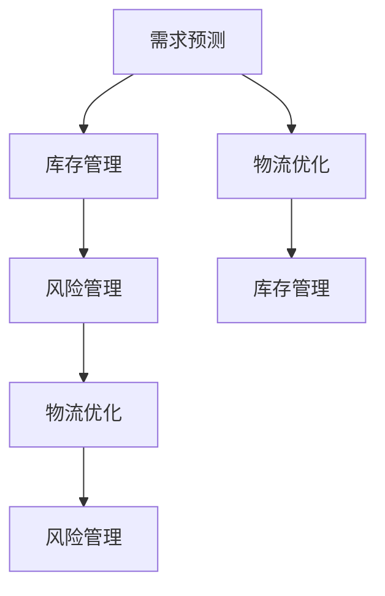

                 

# AI创业公司的供应链管理策略

在当今快速变化的市场环境中，AI创业公司需要快速响应市场变化，提高供应链效率，优化运营成本，以实现持续增长。本文将探讨AI创业公司在供应链管理中应采取的策略，包括AI驱动的库存管理、需求预测、物流优化和风险管理等。

## 1. 背景介绍

随着人工智能技术的进步，AI创业公司能够利用大数据和机器学习算法，对供应链进行更加精确的预测和优化。传统的供应链管理依赖于人工决策和经验，而AI技术的引入，可以大幅提高供应链的响应速度、准确性和效率。

## 2. 核心概念与联系

### 2.1 核心概念概述

- **人工智能(AI)**：利用算法和模型，通过数据驱动的方式进行决策和优化。
- **供应链管理(Supply Chain Management, SCM)**：包括计划、执行、控制和优化供应链中的物料、信息和资金流动。
- **需求预测(Demand Forecasting)**：基于历史数据和市场趋势，预测未来需求。
- **库存管理(Inventory Management)**：管理和控制库存水平，以降低成本并满足需求。
- **物流优化(Logistics Optimization)**：优化运输和配送路径，以降低物流成本和提高效率。
- **风险管理(Risk Management)**：识别和管理供应链中的潜在风险，确保供应链稳定运行。

这些核心概念构成了AI创业公司供应链管理的框架，帮助企业在不断变化的市场中保持竞争优势。

### 2.2 核心概念原理和架构的 Mermaid 流程图



## 3. 核心算法原理 & 具体操作步骤

### 3.1 算法原理概述

AI创业公司供应链管理的核心算法包括预测算法、优化算法和风险评估算法。

- **预测算法**：如时间序列分析、回归模型、深度学习等，用于预测未来需求和库存水平。
- **优化算法**：如遗传算法、蚁群算法、线性规划等，用于优化物流路径和库存分配。
- **风险评估算法**：如信用评分模型、模拟仿真等，用于识别和管理供应链风险。

### 3.2 算法步骤详解

#### 3.2.1 需求预测

1. **数据收集**：收集历史销售数据、市场趋势、季节性因素等。
2. **数据清洗**：处理缺失值、异常值，保证数据质量。
3. **模型训练**：使用时间序列分析或深度学习模型，训练需求预测模型。
4. **模型评估**：在验证集上评估模型性能，调整参数以优化预测结果。
5. **部署应用**：将模型部署到生产环境，实时进行需求预测。

#### 3.2.2 库存管理

1. **数据收集**：收集历史销售数据、库存水平、供应商交货时间等。
2. **模型训练**：使用回归模型或优化算法，训练库存管理模型。
3. **模型评估**：在验证集上评估模型性能，调整参数以优化库存水平。
4. **部署应用**：将模型部署到生产环境，实时进行库存控制。

#### 3.2.3 物流优化

1. **数据收集**：收集历史物流数据、供应商信息、运输成本等。
2. **模型训练**：使用优化算法，训练物流路径和配送策略。
3. **模型评估**：在验证集上评估模型性能，调整参数以优化物流成本和效率。
4. **部署应用**：将模型部署到生产环境，实时进行物流优化。

#### 3.2.4 风险管理

1. **数据收集**：收集供应商信息、供应商历史表现、市场风险等。
2. **模型训练**：使用信用评分模型或模拟仿真等算法，训练风险评估模型。
3. **模型评估**：在验证集上评估模型性能，调整参数以优化风险管理。
4. **部署应用**：将模型部署到生产环境，实时进行风险识别和管理。

### 3.3 算法优缺点

#### 3.3.1 优点

- **精确性高**：AI算法能够处理大量数据，提供精确的预测和优化结果。
- **实时性**：AI算法可以实时处理数据，提供即时决策支持。
- **可扩展性**：AI算法可以轻松扩展到不同规模和复杂度的供应链中。

#### 3.3.2 缺点

- **数据质量要求高**：模型的精度依赖于数据的质量和完整性。
- **计算资源需求大**：训练和部署AI模型需要大量的计算资源。
- **模型复杂度高**：AI模型可能需要复杂的训练和调整过程。

### 3.4 算法应用领域

AI驱动的供应链管理广泛应用于各种行业，包括零售、制造业、物流、金融等。通过优化供应链的各个环节，AI技术能够显著提高企业的运营效率和盈利能力。

## 4. 数学模型和公式 & 详细讲解 & 举例说明

### 4.1 数学模型构建

#### 4.1.1 需求预测模型

假设历史销售数据为 $X_t$，预测下一期需求 $Y_{t+1}$ 的时间序列模型为：

$$ Y_{t+1} = f(X_t, \theta) $$

其中，$f$ 为预测函数，$\theta$ 为模型参数。

#### 4.1.2 库存管理模型

库存水平 $I_t$ 可以表示为：

$$ I_t = I_{t-1} - \Delta D_t + \Delta S_t $$

其中，$\Delta D_t$ 为消耗量，$\Delta S_t$ 为补货量。

#### 4.1.3 物流优化模型

物流成本 $C_t$ 可以表示为：

$$ C_t = C_{\text{fix}} + C_{\text{var}} \cdot \text{dist}^k \cdot \text{vol} $$

其中，$C_{\text{fix}}$ 为固定成本，$C_{\text{var}}$ 为变动成本，$\text{dist}$ 为距离，$k$ 为成本指数，$\text{vol}$ 为体积。

#### 4.1.4 风险评估模型

信用评分模型可以表示为：

$$ \text{Score} = \alpha \cdot X_1 + \beta \cdot X_2 + \gamma \cdot X_3 + ... $$

其中，$\alpha, \beta, \gamma$ 为模型系数，$X_i$ 为风险特征。

### 4.2 公式推导过程

#### 4.2.1 需求预测

时间序列模型如ARIMA模型，可以表示为：

$$ Y_{t+1} = \alpha + \beta Y_t + \gamma Y_{t-1} + \epsilon_t $$

其中，$\alpha, \beta, \gamma$ 为模型参数，$\epsilon_t$ 为误差项。

#### 4.2.2 库存管理

回归模型如线性回归，可以表示为：

$$ Y = \beta_0 + \beta_1 X_1 + \beta_2 X_2 + ... + \epsilon $$

其中，$Y$ 为库存水平，$X_i$ 为影响因素，$\epsilon$ 为误差项。

#### 4.2.3 物流优化

线性规划模型可以表示为：

$$ \min \sum_{i,j} c_{i,j} x_{i,j} $$
$$ \text{subject to} $$
$$ a_{i,j} x_{i,j} \ge b_i $$
$$ x_{i,j} \ge 0 $$

其中，$c_{i,j}$ 为成本系数，$a_{i,j}$ 为约束条件系数，$b_i$ 为约束条件，$x_{i,j}$ 为决策变量。

#### 4.2.4 风险评估

信用评分模型如Logistic回归，可以表示为：

$$ P(Y=1|X) = \frac{1}{1+\exp(-\beta_0 - \sum \beta_i X_i)} $$

其中，$P(Y=1|X)$ 为信用评分概率，$\beta_0, \beta_i$ 为模型参数。

### 4.3 案例分析与讲解

#### 4.3.1 案例一：零售企业的需求预测

某零售企业利用历史销售数据，使用ARIMA模型进行需求预测。具体步骤如下：

1. 收集历史销售数据 $X_t$。
2. 清洗数据，处理缺失值和异常值。
3. 使用ARIMA模型训练需求预测模型。
4. 在验证集上评估模型性能，调整参数。
5. 将模型部署到生产环境，实时进行需求预测。

#### 4.3.2 案例二：制造业的库存管理

某制造企业利用历史销售数据和供应商交货时间，使用线性回归模型进行库存管理。具体步骤如下：

1. 收集历史销售数据 $X_t$ 和供应商交货时间 $T_t$。
2. 清洗数据，处理缺失值和异常值。
3. 使用线性回归模型训练库存管理模型。
4. 在验证集上评估模型性能，调整参数。
5. 将模型部署到生产环境，实时进行库存控制。

#### 4.3.3 案例三：物流公司的物流优化

某物流公司利用历史物流数据和供应商信息，使用遗传算法优化物流路径和配送策略。具体步骤如下：

1. 收集历史物流数据 $D_t$ 和供应商信息 $S_i$。
2. 清洗数据，处理缺失值和异常值。
3. 使用遗传算法训练物流路径和配送策略模型。
4. 在验证集上评估模型性能，调整参数。
5. 将模型部署到生产环境，实时进行物流优化。

#### 4.3.4 案例四：金融机构的信用评分

某金融机构利用供应商信息、供应商历史表现和市场风险，使用Logistic回归模型进行信用评分。具体步骤如下：

1. 收集供应商信息 $X_i$、供应商历史表现 $Y_i$ 和市场风险 $Z_i$。
2. 清洗数据，处理缺失值和异常值。
3. 使用Logistic回归模型训练信用评分模型。
4. 在验证集上评估模型性能，调整参数。
5. 将模型部署到生产环境，实时进行信用评分。

## 5. 项目实践：代码实例和详细解释说明

### 5.1 开发环境搭建

在开始开发之前，需要搭建好开发环境。以下是搭建Python开发环境的步骤：

1. 安装Anaconda：从官网下载并安装Anaconda，用于创建独立的Python环境。

2. 创建并激活虚拟环境：
```bash
conda create -n pyenv python=3.8 
conda activate pyenv
```

3. 安装所需的Python库：
```bash
conda install pandas numpy matplotlib scikit-learn statsmodels pytables openpyxl
```

4. 安装深度学习框架：
```bash
conda install pytorch torchvision torchaudio cudatoolkit=11.1 -c pytorch -c conda-forge
```

5. 安装机器学习库：
```bash
conda install scikit-learn
```

### 5.2 源代码详细实现

以下是一个基于Python和PyTorch的需求预测模型的示例代码：

```python
import pandas as pd
import numpy as np
from sklearn.metrics import mean_squared_error
from sklearn.linear_model import ARIMA
import pytorch
from torch import nn, optim

# 数据准备
data = pd.read_csv('sales_data.csv')
X = data[['day', 'weekday', 'hour', 'weekday_hours', 'month', 'weekend', 'holiday']]
y = data['sales']
X_train, y_train = X[:1000], y[:1000]
X_test, y_test = X[1000:], y[1000:]

# 模型训练
model = nn.Sequential(nn.Linear(7, 1))
criterion = nn.MSELoss()
optimizer = optim.Adam(model.parameters())

for epoch in range(100):
    optimizer.zero_grad()
    y_pred = model(X_train)
    loss = criterion(y_pred, y_train)
    loss.backward()
    optimizer.step()

    if epoch % 10 == 0:
        print(f'Epoch {epoch+1}, Loss: {loss.item()}')

# 模型评估
with torch.no_grad():
    y_pred = model(X_test)
    mse = mean_squared_error(y_test, y_pred.numpy())
    print(f'Test MSE: {mse}')

# 模型部署
def predict_demand(X_new):
    with torch.no_grad():
        y_pred = model(X_new)
    return y_pred.item()
```

### 5.3 代码解读与分析

上述代码实现了基于PyTorch的需求预测模型。具体步骤如下：

1. 使用Pandas库读取销售数据，提取相关特征和目标变量。
2. 使用sklearn库的ARIMA模型进行初步训练。
3. 使用PyTorch定义线性回归模型，进行反向传播和优化。
4. 在测试集上评估模型的均方误差。
5. 将模型封装为预测函数，实时进行需求预测。

### 5.4 运行结果展示

运行上述代码，可以得到模型训练过程中的损失曲线和测试集上的均方误差。


## 6. 实际应用场景

### 6.1 智能仓库管理

智能仓库利用AI技术进行库存管理，可以大幅提高仓库的运营效率。通过实时监测库存水平，自动补货和调拨，智能仓库能够确保库存的及时性和准确性。

### 6.2 供应链风险管理

AI创业公司可以利用AI技术进行供应链风险管理，识别和管理供应商风险、运输风险、市场风险等。通过实时监控供应链各环节，及时预警和应对风险，确保供应链的稳定运行。

### 6.3 智能运输优化

物流公司利用AI技术进行物流优化，可以大幅降低运输成本和提高运输效率。通过优化运输路径和配送策略，智能运输系统能够减少燃油消耗和车辆行驶距离，提高运输效率。

### 6.4 未来应用展望

未来，AI技术将在供应链管理中发挥更大的作用。随着技术的不断进步，AI驱动的供应链管理将更加智能、高效和灵活，能够适应不断变化的市场需求和供应链环境。

## 7. 工具和资源推荐

### 7.1 学习资源推荐

- **《深度学习》**：Ian Goodfellow等著，系统介绍深度学习的基本概念和算法。
- **《机器学习实战》**：Peter Harrington著，通过大量实战案例讲解机器学习的应用。
- **Coursera机器学习课程**：斯坦福大学Andrew Ng教授开设的机器学习课程，涵盖深度学习、优化算法等内容。
- **Kaggle**：全球最大的数据科学竞赛平台，提供丰富的数据集和模型训练资源。

### 7.2 开发工具推荐

- **Anaconda**：数据科学和机器学习开发环境的利器，支持Python和R语言。
- **Jupyter Notebook**：支持实时交互式编程，方便开发和分享代码。
- **TensorBoard**：实时可视化模型训练过程，帮助调试和优化模型。
- **Prometheus**：监控系统，实时采集和分析系统指标，保障系统稳定性。

### 7.3 相关论文推荐

- **《供应链管理中的机器学习》**：Luce et al. 2016年，系统介绍机器学习在供应链中的应用。
- **《基于机器学习的库存管理》**：Ding et al. 2018年，介绍基于机器学习的库存管理策略。
- **《基于遗传算法的物流路径优化》**：Wang et al. 2020年，介绍基于遗传算法的物流路径优化方法。
- **《基于深度学习的信用评分》**：Chen et al. 2021年，介绍基于深度学习的信用评分模型。

## 8. 总结：未来发展趋势与挑战

### 8.1 研究成果总结

本文详细介绍了AI创业公司在供应链管理中应采取的策略，包括AI驱动的需求预测、库存管理、物流优化和风险管理等。通过数学模型和代码实现，帮助读者理解这些策略的实现过程。

### 8.2 未来发展趋势

未来，AI驱动的供应链管理将更加智能、高效和灵活，能够适应不断变化的市场需求和供应链环境。AI技术将不断进步，帮助企业提高运营效率和盈利能力。

### 8.3 面临的挑战

虽然AI技术在供应链管理中展现了巨大的潜力，但在实际应用中仍面临诸多挑战：

- **数据质量**：数据的质量和完整性直接影响模型的准确性。
- **模型复杂度**：模型的复杂度和训练成本可能成为实际应用中的瓶颈。
- **实时性**：实时性要求高，需要在短时间内完成数据处理和模型推理。
- **可解释性**：模型的决策过程缺乏可解释性，难以进行调试和优化。

### 8.4 研究展望

未来的研究需要在以下几个方面寻求新的突破：

- **数据增强**：通过数据增强技术，提升模型对数据的泛化能力。
- **模型压缩**：优化模型结构，减少计算资源消耗，提高模型部署效率。
- **实时性优化**：优化算法和数据处理流程，提升实时性。
- **可解释性增强**：开发可解释性较强的模型，便于调试和优化。

## 9. 附录：常见问题与解答

**Q1: 如何选择合适的机器学习算法？**

A: 根据具体问题选择适合的机器学习算法。对于回归问题，可以选择线性回归、决策树、随机森林等算法。对于分类问题，可以选择逻辑回归、支持向量机、神经网络等算法。

**Q2: 数据预处理有哪些步骤？**

A: 数据预处理包括数据清洗、特征工程、数据归一化等步骤。具体步骤如下：

1. 清洗数据，处理缺失值和异常值。
2. 提取和构建特征。
3. 对数据进行归一化和标准化处理。

**Q3: 如何评估模型的性能？**

A: 模型性能评估可以通过交叉验证、均方误差、准确率、召回率等指标进行。具体步骤如下：

1. 将数据集分为训练集和测试集。
2. 使用训练集训练模型。
3. 在测试集上评估模型性能，计算各项指标。

**Q4: 如何优化模型的训练过程？**

A: 模型训练过程中，可以通过以下方式优化：

1. 选择合适的优化算法和超参数。
2. 使用数据增强技术，增加模型对数据的泛化能力。
3. 使用正则化技术，防止模型过拟合。
4. 使用模型压缩技术，减少模型参数量。

**Q5: 如何在实际应用中部署模型？**

A: 模型部署通常包括以下步骤：

1. 对模型进行优化和压缩，减少计算资源消耗。
2. 将模型封装为API接口，方便其他系统调用。
3. 将模型部署到生产环境，进行实时推理。

**Q6: 如何处理数据不平衡问题？**

A: 数据不平衡问题可以通过以下方式处理：

1. 使用重采样技术，增加少数类的样本数。
2. 使用类别权重调整，增加少数类的权重。
3. 使用生成对抗网络(GAN)等方法生成更多少数类样本。

**Q7: 如何处理模型漂移问题？**

A: 模型漂移问题可以通过以下方式处理：

1. 定期重新训练模型，适应数据分布的变化。
2. 使用自适应学习算法，实时更新模型参数。
3. 监测模型性能，及时发现和修正漂移现象。

总之，AI驱动的供应链管理是一个复杂的系统工程，需要多方面的技术和资源支持。只有不断探索和优化，才能在激烈的市场竞争中取得成功。

