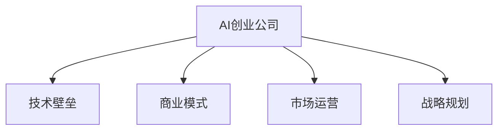

                 

# AI创业公司的发展方向

在过去的十年里，人工智能（AI）技术已经取得了飞速的进步，并开始广泛地应用于各种领域。从自动驾驶、医疗诊断、金融预测到智能客服、娱乐推荐，AI技术正在深刻地改变着我们的工作和生活方式。在这个过程中，AI创业公司扮演了重要的角色，它们是AI技术的推动者和创新者。然而，随着AI技术的不断发展和市场竞争的加剧，AI创业公司也面临着巨大的挑战和机遇。本文将从AI创业公司的背景、核心概念、算法原理、应用场景、未来发展趋势和面临的挑战等多个方面进行深入分析，以期为AI创业者提供一些有价值的参考。

## 1. 背景介绍

### 1.1 问题由来

AI创业公司的发展，源于两个关键因素：技术的进步和市场的成熟。一方面，深度学习、自然语言处理、计算机视觉等AI技术的突破，为创业公司提供了强大的技术支撑。另一方面，越来越多的企业和消费者开始接受并应用AI技术，为AI创业公司提供了广阔的市场空间。

然而，尽管AI创业公司数量众多，但真正成功的企业并不多。一个主要原因在于，AI创业公司不仅需要强大的技术能力，还需要具备良好的商业模式、市场运营能力和战略规划能力。许多AI创业公司在技术研发方面投入巨大，但最终由于市场响应不佳而陷入困境。

### 1.2 问题核心关键点

为了使AI创业公司能够更好地发展，需要从多个方面进行深入分析，包括：

- **技术能力**：AI创业公司需要掌握最新的AI技术，并能够将这些技术转化为具有市场竞争力的产品和服务。
- **商业模式**：AI创业公司需要找到适合自身技术特点和市场需求的商业模式，确保可持续发展。
- **市场运营**：AI创业公司需要具备良好的市场运营能力，能够有效地推广和销售产品。
- **战略规划**：AI创业公司需要制定科学的发展战略，根据市场变化和技术趋势不断调整策略。

## 2. 核心概念与联系

### 2.1 核心概念概述

为了更好地理解AI创业公司的发展方向，我们需要先了解几个核心概念：

- **AI创业公司**：指以AI技术为核心竞争力，提供产品或服务的初创企业。
- **技术壁垒**：指AI创业公司在特定技术领域的独有优势，如专利、算法或模型等。
- **商业模式**：指AI创业公司通过何种方式获取收入，如SaaS、B2B、B2C等。
- **市场运营**：指AI创业公司如何通过市场推广、销售渠道等手段，将产品推向市场。
- **战略规划**：指AI创业公司如何制定和实施发展战略，确保公司长期健康发展。

这些概念之间的关系可以通过以下Mermaid流程图来展示：



这个流程图展示了AI创业公司的主要构成部分及其相互关系。

## 3. 核心算法原理 & 具体操作步骤

### 3.1 算法原理概述

AI创业公司的发展，不仅依赖于技术能力，还需要具备良好的商业模式和市场运营能力。在技术层面，AI创业公司需要掌握最新的AI算法和模型，并能够进行有效的微调和优化。在商业模式和市场运营层面，AI创业公司需要具备良好的市场洞察力和运营能力，以确保产品能够被市场接受和认可。

### 3.2 算法步骤详解

#### 3.2.1 技术研发

- **算法选择**：根据市场需求和技术趋势，选择合适的AI算法和模型。
- **数据获取**：获取足够的数据进行模型训练和验证，确保模型的准确性和泛化能力。
- **模型训练**：在选定的数据集上进行模型训练，并根据需求进行微调和优化。
- **模型评估**：通过测试集对模型进行评估，确保模型在实际应用中表现良好。

#### 3.2.2 商业化

- **市场需求分析**：分析市场需求和用户痛点，确定产品定位和功能需求。
- **产品设计**：根据用户需求和市场反馈，设计具有竞争力的产品原型。
- **产品测试**：在实际环境中进行产品测试，收集用户反馈，进行优化调整。
- **产品发布**：选择合适的时间节点和推广策略，将产品推向市场。

#### 3.2.3 市场运营

- **市场推广**：制定市场推广策略，通过各种渠道宣传产品，吸引用户关注。
- **销售渠道**：建立稳定的销售渠道，确保产品能够顺畅地进入市场。
- **客户支持**：提供良好的客户支持服务，提升用户满意度和忠诚度。
- **市场反馈**：收集市场反馈，持续优化产品，提高市场竞争力。

### 3.3 算法优缺点

#### 3.3.1 技术研发的优点

- **技术优势明显**：AI创业公司能够快速掌握最新的AI技术，并在特定领域建立技术壁垒。
- **灵活性高**：可以根据市场需求和技术趋势进行快速调整和优化。
- **创新能力强**：具备较高的技术研发能力，能够推出具有创新性的产品和服务。

#### 3.3.2 技术研发的缺点

- **成本高**：技术研发需要大量的资金和人力资源投入，初期成本较高。
- **风险大**：技术研发过程中可能面临技术失败和市场接受度低的问题。
- **技术依赖强**：技术研发依赖于特定的算法和模型，存在技术壁垒。

#### 3.3.3 商业模式和市场运营的优点

- **市场响应快**：能够快速响应市场需求，推出符合用户需求的产品。
- **运营能力强**：具备良好的市场运营能力，能够有效地推广和销售产品。
- **盈利能力强**：商业模式和市场运营策略合理，能够实现稳定的收入来源。

#### 3.3.4 商业模式和市场运营的缺点

- **市场风险高**：市场变化复杂，产品推广和销售存在不确定性。
- **运营成本高**：市场运营需要大量的资源投入，运营成本较高。
- **用户需求变化快**：用户需求变化迅速，产品需要不断迭代和优化。

## 4. 数学模型和公式 & 详细讲解 & 举例说明

### 4.1 数学模型构建

在AI创业公司的技术研发中，数学模型构建是一个关键环节。通常情况下，AI创业公司会使用机器学习算法和深度学习模型，如卷积神经网络（CNN）、循环神经网络（RNN）和变换器（Transformer）等。以下是一个简单的CNN模型构建示例：

```python
import tensorflow as tf

model = tf.keras.Sequential([
    tf.keras.layers.Conv2D(32, (3, 3), activation='relu', input_shape=(28, 28, 1)),
    tf.keras.layers.MaxPooling2D((2, 2)),
    tf.keras.layers.Flatten(),
    tf.keras.layers.Dense(10, activation='softmax')
])
```

### 4.2 公式推导过程

以卷积神经网络（CNN）为例，其核心公式为：

$$ y = f(Wx + b) $$

其中，$W$ 为卷积核权重，$x$ 为输入特征，$b$ 为偏置项，$f$ 为激活函数。

通过以上公式，我们可以计算出卷积神经网络的输出。

### 4.3 案例分析与讲解

假设我们有一张28x28像素的灰度图像，将其输入到CNN中进行处理。首先，通过卷积层提取特征，然后进行池化操作，最后通过全连接层进行分类。假设模型输出10个类别的概率，则可以通过softmax函数计算出每个类别的概率分布。

## 5. 项目实践：代码实例和详细解释说明

### 5.1 开发环境搭建

#### 5.1.1 Python环境

- **安装Python**：从Python官网下载并安装Python 3.6以上版本。
- **安装TensorFlow**：通过pip安装TensorFlow版本。
- **安装Keras**：通过pip安装Keras版本。

#### 5.1.2 开发工具

- **Jupyter Notebook**：一种交互式编程环境，支持Python代码编写和执行。
- **Git**：版本控制工具，用于管理代码版本和协作开发。
- **Docker**：容器化工具，支持跨平台部署和环境管理。

### 5.2 源代码详细实现

#### 5.2.1 数据获取

- **MNIST数据集**：MNIST是一个手写数字识别数据集，包含60,000个训练样本和10,000个测试样本。
- **数据预处理**：将原始图像转换为标准化格式，并进行归一化处理。

```python
import numpy as np
import tensorflow as tf

(x_train, y_train), (x_test, y_test) = tf.keras.datasets.mnist.load_data()

x_train, x_test = x_train / 255.0, x_test / 255.0
```

#### 5.2.2 模型构建

- **定义模型结构**：使用卷积神经网络（CNN）进行图像分类。
- **编译模型**：设置损失函数、优化器和评价指标。
- **训练模型**：在训练集上进行模型训练，调整模型参数。

```python
model = tf.keras.Sequential([
    tf.keras.layers.Conv2D(32, (3, 3), activation='relu', input_shape=(28, 28, 1)),
    tf.keras.layers.MaxPooling2D((2, 2)),
    tf.keras.layers.Flatten(),
    tf.keras.layers.Dense(10, activation='softmax')
])

model.compile(optimizer='adam', loss='sparse_categorical_crossentropy', metrics=['accuracy'])

model.fit(x_train, y_train, epochs=5, validation_data=(x_test, y_test))
```

### 5.3 代码解读与分析

#### 5.3.1 数据预处理

- **归一化**：将像素值归一化到0-1之间，有助于模型更快地收敛。
- **标准化**：将图像转换为标准格式，方便模型处理。

#### 5.3.2 模型构建

- **卷积层**：使用卷积层提取特征，有助于捕捉图像中的局部特征。
- **池化层**：使用池化层进行降维，减少计算量。
- **全连接层**：使用全连接层进行分类，输出分类结果。

#### 5.3.3 模型编译

- **优化器**：选择Adam优化器，可以自适应调整学习率。
- **损失函数**：选择交叉熵损失函数，用于衡量模型预测结果与真实标签之间的差异。
- **评价指标**：选择准确率作为评价指标，用于评估模型性能。

#### 5.3.4 模型训练

- **训练集**：使用训练集进行模型训练，调整模型参数。
- **验证集**：使用验证集进行模型评估，避免过拟合。

### 5.4 运行结果展示

- **训练结果**：在训练集上进行模型训练，输出训练集和验证集的损失和准确率。
- **测试结果**：在测试集上进行模型测试，输出模型在测试集上的准确率。

```python
print('Train loss:', model.evaluate(x_train, y_train)[0])
print('Test loss:', model.evaluate(x_test, y_test)[0])
```

## 6. 实际应用场景

### 6.1 智能医疗

在智能医疗领域，AI创业公司可以开发出具有高度准确性的医疗诊断系统，帮助医生进行疾病诊断和个性化治疗。例如，AI创业公司可以利用深度学习技术，开发出基于医学影像分析的辅助诊断系统，帮助医生更快速、准确地进行影像诊断。此外，AI创业公司还可以利用自然语言处理技术，开发出智能问答系统，提供个性化的医疗咨询和健康建议。

### 6.2 智能客服

在智能客服领域，AI创业公司可以开发出具有高度智能化的客服系统，提高客户服务效率和满意度。例如，AI创业公司可以利用自然语言处理技术，开发出智能问答系统，自动回答客户咨询，解决常见问题。此外，AI创业公司还可以利用情感分析技术，提供个性化的客户服务，提升客户体验。

### 6.3 金融风控

在金融风控领域，AI创业公司可以开发出具有高度精确性的风险评估系统，帮助金融机构进行风险控制。例如，AI创业公司可以利用机器学习技术，开发出基于信用记录的风险评估系统，帮助金融机构评估客户的信用风险。此外，AI创业公司还可以利用情感分析技术，开发出智能客服系统，提升客户体验。

### 6.4 未来应用展望

随着AI技术的不断进步，AI创业公司的发展方向将更加多元化和智能化。未来，AI创业公司将进一步拓展应用领域，开发出更多具有创新性的产品和服务，推动AI技术在各个领域的广泛应用。

## 7. 工具和资源推荐

### 7.1 学习资源推荐

- **Google AI课程**：Google推出的AI课程，涵盖深度学习、计算机视觉、自然语言处理等多个领域。
- **Coursera**：Coursera提供的AI相关课程，涵盖AI基础、深度学习、机器学习等多个领域。
- **GitHub**：GitHub上的AI开源项目，提供丰富的学习资源和代码实现。

### 7.2 开发工具推荐

- **TensorFlow**：Google开源的深度学习框架，支持多种AI任务开发。
- **PyTorch**：Facebook开源的深度学习框架，支持动态图和静态图。
- **Jupyter Notebook**：交互式编程环境，支持Python代码编写和执行。

### 7.3 相关论文推荐

- **《深度学习》**：Ian Goodfellow等著，全面介绍深度学习的基本概念和算法。
- **《计算机视觉：算法与应用》**：Richard Szeliski等著，介绍计算机视觉的基本概念和算法。
- **《自然语言处理综论》**：Daniel Jurafsky等著，介绍自然语言处理的基本概念和算法。

## 8. 总结：未来发展趋势与挑战

### 8.1 研究成果总结

通过上述分析，我们可以看到AI创业公司在技术研发、商业模式、市场运营和战略规划等方面具备强大的竞争力。然而，AI创业公司也面临着技术风险、市场风险和运营风险等诸多挑战。未来，AI创业公司需要在技术创新、商业化和市场运营等方面不断提升自身能力，才能在激烈的市场竞争中脱颖而出。

### 8.2 未来发展趋势

- **技术创新**：随着AI技术的不断进步，AI创业公司将进一步拓展应用领域，开发出更多具有创新性的产品和服务。
- **商业化**：AI创业公司需要具备良好的商业化能力，能够快速将技术转化为具有市场竞争力的产品和服务。
- **市场运营**：AI创业公司需要具备良好的市场运营能力，能够有效地推广和销售产品。
- **战略规划**：AI创业公司需要制定科学的发展战略，根据市场变化和技术趋势不断调整策略。

### 8.3 面临的挑战

- **技术风险**：AI创业公司面临技术失败和市场接受度低的问题。
- **市场风险**：AI创业公司面临市场变化复杂，产品推广和销售存在不确定性的问题。
- **运营风险**：AI创业公司面临运营成本高，运营管理复杂的问题。

### 8.4 研究展望

未来，AI创业公司需要在技术创新、商业化和市场运营等方面不断提升自身能力，才能在激烈的市场竞争中脱颖而出。同时，AI创业公司还需要注重技术风险和市场风险的管理，制定科学的发展战略，确保公司长期健康发展。

## 9. 附录：常见问题与解答

### 9.1 问题一：AI创业公司如何平衡技术创新和商业化？

**解答**：AI创业公司需要在技术创新和商业化之间找到平衡点。在技术研发阶段，需要注重技术壁垒的建立和创新能力的提升。在商业化阶段，需要注重市场需求和用户痛点的分析，制定科学的市场策略。通过合理的平衡，AI创业公司可以既保持技术领先，又实现市场快速增长。

### 9.2 问题二：AI创业公司如何降低技术风险？

**解答**：AI创业公司可以通过多种方式降低技术风险，例如：
- **小步快跑**：采用小步快跑的策略，逐步验证技术可行性和市场需求，降低技术失败的风险。
- **多元化技术**：采用多元化的技术策略，降低对单一技术的依赖，增强技术的鲁棒性。
- **市场测试**：在推出产品前进行市场测试，收集用户反馈，优化产品设计。

### 9.3 问题三：AI创业公司如何提升市场运营能力？

**解答**：AI创业公司可以通过多种方式提升市场运营能力，例如：
- **多渠道推广**：通过多种渠道进行产品推广，提高市场曝光率。
- **用户体验优化**：注重用户体验，提升产品的易用性和功能完备性。
- **客户支持**：提供优质的客户支持服务，提升用户满意度和忠诚度。

---

作者：禅与计算机程序设计艺术 / Zen and the Art of Computer Programming

