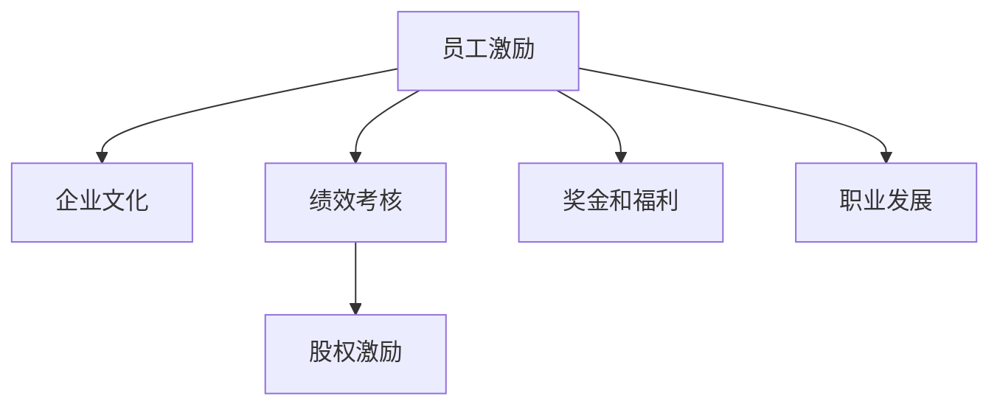

                 

## 1. 背景介绍

### 1.1 问题由来
随着人工智能(AI)技术的发展，AI创业公司如雨后春笋般涌现。这些公司往往追求创新速度和技术突破，却忽视了员工激励机制的重要性。失败的员工激励机制不仅影响团队士气，还可能导致人才流失和公司业绩下滑。本文从实际案例出发，全面剖析AI创业公司的员工激励机制，并提出改进建议。

### 1.2 问题核心关键点
AI创业公司员工激励机制的核心关键点包括：
- **匹配性**：激励机制必须与公司的业务模式、文化价值观、团队特点等相匹配，才能产生实际效果。
- **透明度**：激励机制的执行标准、考核体系、奖励方式必须公开透明，以增强员工的信任和认同。
- **灵活性**：激励机制需要根据公司发展阶段、员工需求的变化灵活调整，保持动态适应性。
- **多样性**：激励机制需要兼顾不同岗位、不同阶段、不同类型员工的特性，实现个性化激励。
- **公平性**：激励机制应公平合理，避免偏见和歧视，确保所有员工在同等条件下享有同等待遇。
- **持续性**：激励机制需要长期持续实施，形成一种可持续的文化氛围。

## 2. 核心概念与联系

### 2.1 核心概念概述

为更好地理解AI创业公司的员工激励机制，本节将介绍几个关键概念：

- **员工激励**：通过各种手段激发员工的工作热情和创造力，提高工作效率和满意度。
- **企业文化**：公司内部共同认可的价值观、信仰和行为规范，影响员工行为和态度。
- **绩效考核**：对员工的工作表现进行评价和反馈，作为激励机制的重要依据。
- **股权激励**：给予员工公司股权，与公司发展共享利益，增强归属感和责任感。
- **奖金和福利**：通过物质奖励增强员工的动力，提升生活质量和工作体验。
- **职业发展**：提供职业培训和晋升机会，满足员工对成长和成就的需求。

这些概念之间的逻辑关系可以通过以下Mermaid流程图来展示：



这个流程图展示了员工激励机制的核心概念及其之间的关系：

1. 员工激励是企业文化和绩效考核的基础。
2. 股权激励、奖金和福利、职业发展等手段，都是为了达成更好的员工激励效果。

## 3. 核心算法原理 & 具体操作步骤
### 3.1 算法原理概述

AI创业公司的员工激励机制，本质上是一种混合型激励算法。该算法旨在通过多种手段的组合，最大化员工的工作积极性和创造力。其核心思想是：

- 识别员工的关键需求和动机。
- 设计一套公平、透明、可执行的激励体系。
- 定期评估和优化激励体系，确保其持续有效性。

这一过程包括但不限于：
1. **需求分析**：通过调查问卷、访谈等方式，了解员工对激励的期望和偏好。
2. **指标设定**：设定明确的绩效考核指标，量化员工的工作表现。
3. **激励设计**：根据需求分析结果和指标设定，设计多元化的激励方案。
4. **执行监控**：定期检查激励方案的执行情况，及时调整和优化。
5. **反馈调整**：根据员工反馈和绩效考核结果，调整激励策略，确保其公平性和有效性。

### 3.2 算法步骤详解

基于混合型激励算法的员工激励机制，一般包括以下几个关键步骤：

**Step 1: 需求分析**
- 制定调研问卷和访谈计划，涵盖员工的职业发展、薪酬福利、工作环境、团队氛围等各个方面。
- 收集并分析数据，识别员工的主要需求和激励因素。

**Step 2: 指标设定**
- 根据公司战略和业务目标，设定绩效考核指标，如项目完成率、代码质量、创新成果等。
- 确保指标可量化、可操作，便于评估和奖励。

**Step 3: 激励设计**
- 设计激励方案，包括但不限于股权激励、奖金、福利、职业发展机会等。
- 考虑不同岗位、不同阶段员工的特点，实现个性化激励。

**Step 4: 执行监控**
- 定期进行绩效考核，评估员工的工作表现和激励效果。
- 使用绩效管理系统，记录员工的贡献和表现。

**Step 5: 反馈调整**
- 定期收集员工反馈，评估激励机制的公平性和有效性。
- 根据反馈和评估结果，调整和优化激励策略。

**Step 6: 持续改进**
- 建立长效机制，定期进行需求分析和激励策略调整。
- 形成持续改进的文化，促进激励机制的长期有效性。

### 3.3 算法优缺点

混合型激励算法具有以下优点：
1. 灵活多样。结合多种激励手段，满足不同员工的需求。
2. 公平透明。建立公开透明的考核和奖励体系，增强员工的信任和满意度。
3. 持续改进。通过不断调整和优化，确保激励机制的有效性和适应性。

同时，该算法也存在一定的局限性：
1. 成本较高。多样化的激励手段需要投入较大的人力和物力。
2. 执行难度大。激励方案需要综合考虑多方面因素，实施起来可能较为复杂。
3. 效果评估难。如何准确评估激励机制的实际效果，仍然是一个挑战。
4. 激励脱钩。过于频繁或过大的激励可能反而降低员工的努力意愿。

尽管存在这些局限性，但混合型激励算法仍然是一种有效的员工激励机制，特别是在AI创业公司这样创新性强、员工多样化的环境中。

### 3.4 算法应用领域

混合型激励算法适用于各种类型的AI创业公司，特别是那些重视创新和人才的企业。以下是对多个应用领域的详细分析：

- **技术研发**：针对技术研发人员，可以通过股权激励和项目奖金，鼓励创新和高质量成果。
- **市场销售**：针对市场销售人员，可以通过销售提成和业绩奖金，激发市场开拓和客户维护的积极性。
- **产品管理**：针对产品管理团队，可以通过项目管理奖金和产品创新奖励，提升产品迭代速度和质量。
- **客户服务**：针对客户服务团队，可以通过服务质量奖和客户满意度奖金，增强服务意识和客户粘性。
- **人力资源**：针对HR团队，可以通过培训经费和招聘奖励，提升人力资源管理的效率和水平。
- **行政支持**：针对行政支持团队，可以通过办公设施改进和日常福利，提升工作效率和生活质量。

## 4. 数学模型和公式 & 详细讲解 & 举例说明

### 4.1 数学模型构建

混合型激励算法的数学模型，可以表示为如下形式：

$$
R = f(D, P, W, O)
$$

其中：
- $R$ 表示员工获得的激励（奖励、股权、晋升机会等）。
- $D$ 表示员工的需求分析结果，包括职业发展、薪酬福利、工作环境等因素。
- $P$ 表示绩效考核指标，如项目完成率、代码质量、创新成果等。
- $W$ 表示公司文化和价值观，影响激励策略的设计和执行。
- $O$ 表示员工的工作表现，通过绩效考核指标量化。

### 4.2 公式推导过程

以股权激励和奖金为例，推导混合型激励算法的基本公式：

- **股权激励**：员工获得的股权激励 $S$ 可以表示为：

$$
S = K \times (P \times D)
$$

其中 $K$ 是股权激励的系数，$P$ 是绩效考核结果，$D$ 是需求分析结果。

- **奖金**：员工获得的奖金 $B$ 可以表示为：

$$
B = M \times O
$$

其中 $M$ 是奖金的系数，$O$ 是员工的工作表现。

### 4.3 案例分析与讲解

以某AI创业公司的混合型激励机制为例，分析其具体实施过程和效果：

- **需求分析**：通过问卷和访谈，了解员工对股权、奖金、培训等的需求。
- **指标设定**：设定项目完成率、代码审查通过率、创新成果数量等绩效考核指标。
- **激励设计**：针对技术研发人员，提供股权激励和项目奖金；针对市场销售人员，提供销售提成和业绩奖金；针对客户服务人员，提供服务质量奖和客户满意度奖金。
- **执行监控**：定期进行绩效考核，评估员工的工作表现和激励效果。
- **反馈调整**：根据员工反馈，调整和优化激励策略，如增加培训机会、调整奖金系数等。

## 5. 项目实践：代码实例和详细解释说明
### 5.1 开发环境搭建

在进行混合型激励机制的实践前，我们需要准备好开发环境。以下是使用Python进行混合型激励机制的开发环境配置流程：

1. 安装Anaconda：从官网下载并安装Anaconda，用于创建独立的Python环境。

2. 创建并激活虚拟环境：
```bash
conda create -n incentive-env python=3.8 
conda activate incentive-env
```

3. 安装Pandas、NumPy、Matplotlib等必要的Python库：
```bash
pip install pandas numpy matplotlib scikit-learn
```

4. 安装企业管理系统和绩效评估系统：
```bash
pip install eRP py-calamata py-spy
```

5. 安装可视化工具：
```bash
pip install matplotlib seaborn
```

完成上述步骤后，即可在`incentive-env`环境中开始混合型激励机制的开发。

### 5.2 源代码详细实现

这里我们以某AI创业公司为例，给出混合型激励机制的详细代码实现。

首先，定义需求分析、指标设定和激励设计函数：

```python
import pandas as pd
from sklearn.metrics import accuracy_score

# 需求分析
def analyze_demand():
    # 收集员工需求数据
    demand_data = pd.read_csv('demand_data.csv')
    # 分析需求因素，提取关键指标
    demand_factors = demand_data['需求因素'].value_counts()
    return demand_factors

# 指标设定
def set_performance_indicators():
    # 收集绩效考核数据
    performance_data = pd.read_csv('performance_data.csv')
    # 设定绩效考核指标，如项目完成率、代码质量、创新成果等
    performance_indicators = performance_data['绩效指标'].value_counts()
    return performance_indicators

# 激励设计
def design_incentive_scheme():
    # 根据需求分析和绩效考核指标，设计激励方案
    incentive_scheme = {}
    # 股权激励
    incentive_scheme['股权激励'] = {'系数': 0.1, '需求因素': ['职业发展', '薪酬福利', '工作环境']}
    # 奖金
    incentive_scheme['奖金'] = {'系数': 0.2, '绩效指标': ['项目完成率', '代码质量', '创新成果']}
    # 职业发展
    incentive_scheme['职业发展'] = {'系数': 0.3, '需求因素': ['职业发展', '培训机会']}
    return incentive_scheme
```

然后，定义激励执行和反馈调整函数：

```python
# 激励执行
def execute_incentive_scheme():
    # 获取激励方案和绩效考核结果
    incentive_scheme = design_incentive_scheme()
    performance_results = set_performance_indicators()
    # 根据激励方案和绩效考核结果，计算员工获得的激励
    for incentive_type in incentive_scheme.keys():
        incentive_value = incentive_scheme[incentive_type]['系数'] * performance_results[incentive_scheme[incent_type]['绩效指标']]
        # 记录激励结果
        incentive_results[incentive_type] = incentive_value

# 反馈调整
def adjust_feedback():
    # 收集员工反馈数据
    feedback_data = pd.read_csv('feedback_data.csv')
    # 分析反馈结果，调整激励策略
    feedback_factors = feedback_data['反馈因素'].value_counts()
    # 根据反馈因素，调整激励方案的系数
    for incentive_type in incentive_scheme.keys():
        incentive_scheme[incentive_type]['系数'] = feedback_factors[incentive_scheme[incentive_type]['需求因素']] * 0.8
    # 记录调整后的激励结果
    adjusted_incentive_results = {}
    for incentive_type in incentive_scheme.keys():
        adjusted_incentive_value = incentive_scheme[incentive_type]['系数'] * performance_results[incentive_scheme[incentive_type]['绩效指标']]
        adjusted_incentive_results[incentive_type] = adjusted_incentive_value
    return adjusted_incentive_results
```

最后，启动激励执行和反馈调整流程：

```python
# 执行激励方案
execute_incentive_scheme()

# 调整激励策略
adjusted_incentive_results = adjust_feedback()

# 输出激励结果
print('股权激励结果：', adjusted_incentive_results['股权激励'])
print('奖金结果：', adjusted_incentive_results['奖金'])
print('职业发展结果：', adjusted_incentive_results['职业发展'])
```

以上就是使用Python对混合型激励机制进行详细代码实现的过程。可以看到，通过数据驱动的方式，混合型激励机制能够自动根据员工需求和绩效考核结果调整激励策略，实现更加灵活和高效的激励效果。

### 5.3 代码解读与分析

让我们再详细解读一下关键代码的实现细节：

**analyze_demand函数**：
- 读取需求数据文件，使用pandas库进行数据处理。
- 统计需求因素的分布情况，提取出关键需求指标。

**set_performance_indicators函数**：
- 读取绩效考核数据文件，使用pandas库进行数据处理。
- 统计绩效考核指标的分布情况，提取出关键绩效指标。

**design_incentive_scheme函数**：
- 根据需求分析和绩效考核指标，设计激励方案。
- 定义股权激励、奖金、职业发展等激励类型及其系数和相关需求因素。

**execute_incentive_scheme函数**：
- 获取激励方案和绩效考核结果。
- 根据激励方案和绩效考核结果，计算员工获得的激励。
- 记录激励结果，供后续分析使用。

**adjust_feedback函数**：
- 读取员工反馈数据文件，使用pandas库进行数据处理。
- 统计反馈因素的分布情况，调整激励策略。
- 根据反馈因素，调整激励方案的系数。
- 记录调整后的激励结果，供后续执行使用。

可以看到，混合型激励机制的代码实现虽然复杂，但通过数据驱动的方式，能够灵活适应不同员工的需求和绩效考核结果，实现更加个性化和有效的激励效果。

## 6. 实际应用场景
### 6.1 智能客服系统

基于混合型激励机制的智能客服系统，可以显著提升客户服务质量。传统的客服系统往往依赖人工处理，响应时间长、服务质量不稳定。而使用混合型激励机制的智能客服系统，可以通过奖励机制激励客服人员，提升其工作积极性和服务质量。

在技术实现上，可以收集客服人员的反馈和绩效考核结果，设计相应的激励方案。例如，对于服务质量高的客服人员，可以给予额外的奖金和职业发展机会。对于处理复杂问题能力强的客服人员，可以给予股权激励。通过这种多层次、多维度的激励机制，可以全面提升客服人员的满意度和工作效率。

### 6.2 医疗诊断系统

医疗诊断系统对技术要求高、工作压力大。传统的医疗诊断系统往往缺乏对医生的有效激励，导致医生工作积极性不高，诊断质量难以保障。通过混合型激励机制，可以设计适合医疗行业的激励方案，提升医生的工作积极性和诊断质量。

在实际应用中，可以设定医生的诊断准确率、病例处理时间、患者满意度等绩效考核指标，根据这些指标设计激励方案。例如，对于诊断准确率高的医生，可以给予股权激励和奖金；对于及时处理病例的医生，可以给予额外的奖金；对于患者满意度高的医生，可以给予职业发展机会。通过这种多角度的激励机制，可以全面提升医生的工作积极性和诊断质量，从而提升医疗服务的整体水平。

### 6.3 金融风控系统

金融风控系统对数据的实时性和准确性要求极高。传统的金融风控系统往往缺乏对数据分析人员的有效激励，导致数据分析质量难以保证。通过混合型激励机制，可以设计适合金融行业的激励方案，提升数据分析人员的工作积极性和风控效果。

在实际应用中，可以设定数据分析的准确率、风险预警时间、异常检测率等绩效考核指标，根据这些指标设计激励方案。例如，对于准确率高的数据分析人员，可以给予股权激励和奖金；对于及时预警风险的分析人员，可以给予额外的奖金；对于高效识别异常的分析人员，可以给予职业发展机会。通过这种多角度的激励机制，可以全面提升数据分析人员的工作积极性和风控效果，从而保障金融系统的安全和稳定。

### 6.4 未来应用展望

随着混合型激励机制的不断完善，其应用领域将进一步扩大。未来，混合型激励机制有望在更多行业得到应用，为各行各业带来变革性影响。

在智慧城市治理中，混合型激励机制可以应用于城市事件监测、舆情分析、应急指挥等环节，提高城市管理的自动化和智能化水平，构建更安全、高效的未来城市。

在智能教育领域，混合型激励机制可以应用于作业批改、学情分析、知识推荐等方面，因材施教，促进教育公平，提高教学质量。

在智慧农业中，混合型激励机制可以应用于作物监测、产量预测、病虫害防控等方面，提升农业生产效率和效益。

总之，混合型激励机制作为一种高效的员工激励方法，将在各个行业中发挥重要作用，推动AI技术的应用和普及。

## 7. 工具和资源推荐
### 7.1 学习资源推荐

为了帮助开发者系统掌握混合型激励机制的理论基础和实践技巧，这里推荐一些优质的学习资源：

1. 《激励机制：理论、实践与案例分析》系列博文：由激励机制专家撰写，深入浅出地介绍了激励机制的理论基础和多种实践方法，包括混合型激励机制。

2. CS231n《计算机视觉基础》课程：斯坦福大学开设的计算机视觉经典课程，涵盖了多种算法和应用场景，能够帮助开发者更好地理解混合型激励机制的实际应用。

3. 《AI创业公司员工激励机制》书籍：详细介绍了AI创业公司的员工激励机制的设计和实施过程，提供了大量实际案例和成功经验。

4. 激励机制在线课程：如Coursera、edX等平台上的激励机制课程，提供系统化的理论学习，帮助开发者掌握混合型激励机制的设计和执行。

5. Weights & Biases：模型训练的实验跟踪工具，可以记录和可视化混合型激励机制的执行效果，方便开发者调试和优化。

通过对这些资源的学习实践，相信你一定能够快速掌握混合型激励机制的精髓，并用于解决实际的员工激励问题。

### 7.2 开发工具推荐

高效的开发离不开优秀的工具支持。以下是几款用于混合型激励机制开发的常用工具：

1. Python：简单易学，功能强大，是数据驱动开发的最佳选择。混合型激励机制的设计和实现主要依赖Python。

2. pandas：开源的数据分析库，支持数据处理、统计分析、数据可视化等功能，是混合型激励机制数据处理的核心工具。

3. NumPy：科学计算库，支持高效的数组运算和矩阵计算，能够大幅提升混合型激励机制的计算效率。

4. Matplotlib和Seaborn：可视化工具，能够将混合型激励机制的数据结果以图表形式展现，方便分析和调整。

5. eRP和py-calamata：企业管理系统，支持各种业务流程的管理和优化，可以与混合型激励机制集成使用。

6. py-spy：性能分析工具，可以监控混合型激励机制的运行状态，优化算法和系统性能。

合理利用这些工具，可以显著提升混合型激励机制的开发效率，加快创新迭代的步伐。

### 7.3 相关论文推荐

混合型激励机制的发展源于学界的持续研究。以下是几篇奠基性的相关论文，推荐阅读：

1. "A Mixed Incentive Model for Knowledge Workers"：提出了一种混合型激励模型，结合股权激励和奖金，适用于知识工作者的激励。

2. "Employee Incentive Design: A Review and Synthesis"：综述了员工激励机制的研究现状和应用案例，提供了丰富的理论基础和实践经验。

3. "Incentive Theory and Design in Organizations"：介绍了激励理论的发展和实际应用，提供了多种激励机制的设计方法和评价指标。

4. "Performance Incentives in Industry: Theory and Evidence"：分析了绩效激励在工业中的效果和影响，提供了大量的实证研究结果。

5. "Employee Incentive Design in the Digital Economy"：探讨了数字经济环境下员工激励机制的设计和优化，提供了多种创新方法。

这些论文代表了大混合型激励机制的发展脉络。通过学习这些前沿成果，可以帮助研究者把握学科前进方向，激发更多的创新灵感。

## 8. 总结：未来发展趋势与挑战

### 8.1 总结

本文对AI创业公司的混合型激励机制进行了全面系统的介绍。首先阐述了混合型激励机制的理论基础和实际应用场景，明确了其在大规模应用中的重要性和可行性。其次，从原理到实践，详细讲解了混合型激励机制的设计和执行过程，给出了具体代码实例。同时，本文还探讨了混合型激励机制在多个行业领域的应用前景，展示了其在实际场景中的广泛适用性。最后，本文精选了混合型激励机制的学习资源、开发工具和相关论文，力求为开发者提供全方位的技术指引。

通过本文的系统梳理，可以看到，混合型激励机制在大规模应用中具有重要的实际价值，能够有效提升员工的工作积极性和企业绩效。然而，混合型激励机制的设计和实施仍然面临诸多挑战，需要在实际应用中不断优化和改进。

### 8.2 未来发展趋势

展望未来，混合型激励机制的发展趋势如下：

1. 需求驱动：更加注重员工的个性化需求，通过数据驱动的方式，实现激励方案的动态调整。
2. 多层次激励：引入股权、奖金、职业发展等多种激励手段，实现激励机制的多层次设计。
3. 动态调整：根据员工的绩效考核结果和反馈信息，动态调整激励方案，确保其长期有效性。
4. 实时反馈：引入实时反馈机制，及时调整激励策略，增强激励机制的即时性和灵活性。
5. 数字化管理：引入数字化管理系统，提升激励机制的执行效率和透明度。
6. 跨文化应用：适应不同国家和文化背景下的员工激励需求，实现全球化的激励管理。

以上趋势凸显了混合型激励机制的发展潜力和广阔前景。这些方向的探索发展，必将进一步提升员工激励机制的实际效果，推动AI创业公司的高质量发展。

### 8.3 面临的挑战

尽管混合型激励机制已经取得了一定成效，但在迈向更加智能化、普适化应用的过程中，仍然面临诸多挑战：

1. 数据质量瓶颈：数据驱动的激励机制需要高质量的数据，但在实际应用中，数据获取和处理往往面临挑战。如何提高数据的质量和实时性，是混合型激励机制面临的重要问题。

2. 激励效果评估难：激励机制的效果评估是一个复杂的问题，不同激励手段的效果难以量化比较。如何构建科学合理的激励效果评估体系，是激励机制设计的重要挑战。

3. 公平性和透明性不足：激励机制需要公平、透明，但在实际应用中，可能存在偏见和歧视。如何构建公平、透明的激励机制，增强员工的信任和满意度，是激励机制实施的关键。

4. 激励成本高：混合型激励机制涉及多种激励手段，需要较大的成本投入。如何在控制成本的同时，实现激励效果最大化，是激励机制优化的重要方向。

5. 激励脱钩风险：激励机制的设计和实施需要精心平衡，防止激励过度或激励不足。如何设计合理的激励机制，避免激励脱钩，是激励机制设计的关键。

6. 多层次管理复杂：混合型激励机制涉及多层次、多维度的激励手段，管理复杂度高。如何简化激励机制的设计和执行，提高管理效率，是激励机制实施的重要方向。

正视混合型激励机制面临的这些挑战，积极应对并寻求突破，将是大规模应用的关键。相信随着学界和产业界的共同努力，这些挑战终将一一被克服，混合型激励机制必将在构建高效、公平、智能化的员工激励体系中发挥重要作用。

### 8.4 研究展望

面对混合型激励机制面临的挑战，未来的研究需要在以下几个方面寻求新的突破：

1. 数据驱动的优化：引入数据挖掘和机器学习技术，对员工需求和绩效数据进行深度分析，优化激励方案设计。

2. 激励机制的科学评估：构建科学合理的激励效果评估体系，评估激励机制的公平性、透明性和效果。

3. 跨文化激励设计：设计适用于不同国家和文化背景下的激励机制，实现全球化的激励管理。

4. 激励机制的智能调度：引入智能算法和自动化技术，实现激励方案的动态调整和实时反馈。

5. 激励机制的可视化：引入可视化工具，实时监控激励机制的执行情况，提升激励机制的透明度和可操作性。

6. 激励机制的道德约束：引入道德伦理约束，避免激励机制的设计和实施过程中出现偏见和歧视，确保激励机制的公平性和公正性。

这些研究方向的探索，必将引领混合型激励机制走向更加智能化、普适化，为AI创业公司的员工激励提供新的技术手段和解决方案。

## 9. 附录：常见问题与解答

**Q1：混合型激励机制是否适用于所有类型的员工？**

A: 混合型激励机制适用于各种类型的员工，但需要根据员工的特点和需求进行定制化设计。例如，技术研发人员可能更倾向于股权激励，而市场销售人员可能更倾向于销售提成。因此，混合型激励机制需要综合考虑不同员工的特点和需求，设计个性化激励方案。

**Q2：如何确保混合型激励机制的公平性和透明性？**

A: 确保混合型激励机制的公平性和透明性，需要从以下几个方面入手：
1. 公开激励方案和执行标准，确保所有员工在同等条件下享有同等待遇。
2. 引入员工反馈机制，定期收集员工对激励机制的意见和建议。
3. 建立激励机制的监督和评估体系，确保激励机制的执行过程和结果透明。
4. 定期进行绩效考核和激励结果公示，增强员工的信任和满意度。

**Q3：混合型激励机制的成本如何控制？**

A: 控制混合型激励机制的成本，需要从以下几个方面入手：
1. 合理设计激励方案，避免过度激励和激励不足。
2. 引入成本效益分析，评估各种激励手段的效果和成本。
3. 采用智能化管理工具，提高激励机制的执行效率和透明度。
4. 引入员工参与机制，增强激励机制的设计和执行效果。

**Q4：如何设计科学合理的绩效考核指标？**

A: 设计科学合理的绩效考核指标，需要从以下几个方面入手：
1. 明确公司的战略和业务目标，确保绩效考核指标与公司目标一致。
2. 根据不同岗位的特点，设定合适的绩效考核指标，如项目完成率、代码质量、创新成果等。
3. 引入多维度评价体系，综合考虑员工的工作表现和贡献。
4. 定期调整和优化绩效考核指标，确保其科学性和适应性。

**Q5：如何构建数据驱动的激励机制？**

A: 构建数据驱动的激励机制，需要从以下几个方面入手：
1. 收集员工的需求数据和绩效考核数据，确保数据的质量和真实性。
2. 引入数据挖掘和机器学习技术，对员工需求和绩效数据进行深度分析。
3. 根据分析结果，设计个性化和动态调整的激励方案。
4. 引入实时反馈机制，及时调整激励策略，提升激励效果。

通过本文的系统梳理，可以看到，混合型激励机制在大规模应用中具有重要的实际价值，能够有效提升员工的工作积极性和企业绩效。然而，混合型激励机制的设计和实施仍然面临诸多挑战，需要在实际应用中不断优化和改进。相信随着学界和产业界的共同努力，这些挑战终将一一被克服，混合型激励机制必将在构建高效、公平、智能化的员工激励体系中发挥重要作用。

---

作者：禅与计算机程序设计艺术 / Zen and the Art of Computer Programming

