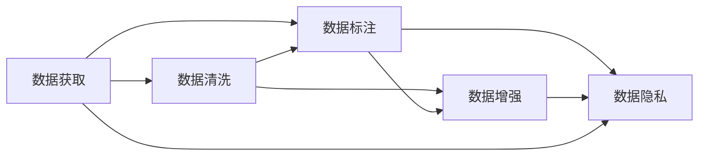

                 

# AI创业公司的数据获取与处理策略

> 关键词：数据获取, 数据处理, 人工智能, AI创业, 大数据, 数据质量, 数据清洗, 数据标注, 数据增强, 数据隐私

## 1. 背景介绍

### 1.1 问题由来
在AI创业公司中，数据获取与处理是构建数据驱动型业务模型的核心环节。优质的数据资源能够显著提升AI模型的性能，帮助企业迅速实现商业化落地。然而，数据获取与处理的复杂度往往超过大多数创始团队的技术预期，容易成为项目进度的瓶颈。本文将深入探讨数据获取与处理的策略和方法，为AI创业公司提供实用指南，助力其高效低成本地构建高质量的数据基础。

### 1.2 问题核心关键点
数据获取与处理的中心问题包括：
- 如何高效、低成本地获取高质量数据。
- 如何清洗、处理数据，消除数据噪声，提升数据质量。
- 如何设计有效的数据标注流程，确保数据标注的准确性。
- 如何利用数据增强等技术提升模型泛化能力。
- 如何保护数据隐私，遵守法律法规要求。

## 2. 核心概念与联系

### 2.1 核心概念概述

为便于理解，我们首先概述相关核心概念及其联系：

- **数据获取(Data Acquisition)**：指通过各种手段收集与业务相关的原始数据。
- **数据清洗(Data Cleaning)**：对原始数据进行去噪、填补缺失值、格式转换等操作，提升数据质量。
- **数据标注(Data Labeling)**：通过人工或自动化方式为数据集添加标签，使其具备监督学习、强化学习等模型的训练需求。
- **数据增强(Data Augmentation)**：通过变换数据样例，生成更多、更有变化性的数据，提升模型泛化能力。
- **数据隐私(Data Privacy)**：确保数据处理和使用的过程中，个人隐私和数据安全得到保护，遵守相关法律法规。

这些概念间的关系如图1所示：



图1: 数据获取与处理流程

接下来，我们将逐一对这些核心概念进行详细阐述。

## 3. 核心算法原理 & 具体操作步骤
### 3.1 算法原理概述

数据获取与处理的核心原理是：

1. **数据收集**：从不同渠道收集所需数据，包括公有数据集、第三方API、合作企业等。
2. **数据清洗**：通过过滤、去重、格式转换等手段，提升数据质量。
3. **数据标注**：为数据集添加标签，使其具有监督学习训练的价值。
4. **数据增强**：通过数据变换生成更多训练样本，提升模型泛化能力。
5. **数据隐私保护**：采用匿名化、加密、访问控制等手段保护数据隐私，符合法律法规。

### 3.2 算法步骤详解

以下是数据获取与处理的具体步骤：

#### Step 1: 确定数据需求

1. **明确业务目标**：根据公司业务需求确定所需数据类型和特征。例如，进行推荐系统需收集用户行为数据、商品属性数据等。
2. **列出数据清单**：列出各业务环节所需的数据来源、格式和更新频率。例如，用户数据来源于CRM系统，产品数据来源于电商平台。

#### Step 2: 数据收集与整合

1. **选择合适的数据源**：
   - **公开数据集**：如Kaggle、UCI等网站提供的数据集。
   - **第三方API**：如Google Maps API、Yelp API等提供的服务。
   - **合作企业**：通过与合作伙伴共享数据，获取所需数据。
   - **开源工具**：利用爬虫工具、ETL工具等从Web上抓取数据。
   
2. **数据整合**：
   - **数据格式统一**：将不同来源的数据格式转换为统一格式。
   - **数据对齐**：确保各数据源中的记录对应关系正确，避免数据丢失或重复。

#### Step 3: 数据清洗与处理

1. **去重与过滤**：
   - **去重**：识别并删除重复数据。
   - **过滤**：删除包含缺失值、异常值、错误值的数据记录。

2. **数据格式化**：
   - **类型转换**：将数据类型统一转换为适合机器学习的数据格式。
   - **缺失值处理**：采用填充、删除等方法处理缺失值。

3. **异常值检测与处理**：
   - **检测**：识别数据中的异常值。
   - **处理**：采取删除、替换等手段处理异常值。

#### Step 4: 数据标注

1. **标注工具与流程**：
   - **工具选择**：选择合适的标注工具，如Labelbox、Prodigy等。
   - **标注流程**：定义标注流程和标准，确保标注的准确性和一致性。

2. **标注方式**：
   - **人工标注**：由专家或员工手动为数据集添加标签。
   - **自动化标注**：利用AI技术自动化生成部分标签。

#### Step 5: 数据增强

1. **数据变换**：
   - **图像数据**：旋转、缩放、裁剪、翻转等变换。
   - **文本数据**：同义词替换、错别字修正、句子重排等变换。
   
2. **生成新数据**：
   - **数据合成**：如SMOTE算法生成合成数据。
   - **变换生成**：如Contrastive Data Augmentation生成增强数据。

#### Step 6: 数据隐私保护

1. **数据匿名化**：
   - **去标识化**：如数据脱敏、伪匿名化等方法。
   - **扰动**：通过添加噪声、随机化数据等手段保护隐私。
   
2. **数据加密**：
   - **加密传输**：在数据传输过程中使用加密技术。
   - **加密存储**：对数据进行加密存储，防止未授权访问。

3. **访问控制**：
   - **权限管理**：定义数据访问权限，控制数据使用范围。
   - **审计日志**：记录数据访问日志，追踪数据使用情况。

### 3.3 算法优缺点

数据获取与处理的方法优点：
1. **提高数据质量**：通过清洗与增强手段，提升数据的准确性和泛化能力。
2. **加速模型训练**：清洗后的数据更容易被模型学习，加快模型训练速度。
3. **减少标注成本**：自动化标注和数据增强技术可以减少人工标注的复杂性和成本。

缺点：
1. **成本较高**：特别是在数据收集和数据清洗阶段，可能涉及较高的人工和资源成本。
2. **数据隐私风险**：不当的数据处理可能带来隐私泄露和法律风险。
3. **技术复杂性**：数据处理技术需要专业知识，可能成为技术团队的瓶颈。

### 3.4 算法应用领域

数据获取与处理广泛应用于以下几个领域：

- **医疗AI**：收集患者病历、影像、基因数据，清洗处理后用于诊断和治疗建议。
- **金融科技**：收集交易数据、用户行为数据，清洗处理后用于风控和推荐系统。
- **自动驾驶**：收集摄像头、雷达、激光雷达数据，清洗处理后用于车辆感知与决策。
- **零售电商**：收集用户行为数据、产品数据，清洗处理后用于推荐系统和库存优化。
- **内容推荐**：收集用户行为数据、媒体数据，清洗处理后用于个性化推荐。

## 4. 数学模型和公式 & 详细讲解  
### 4.1 数学模型构建

本节我们将使用数学语言进一步描述数据获取与处理的模型构建过程。

假设原始数据集为 $D=\{x_i\}_{i=1}^N$，其中 $x_i$ 表示第 $i$ 个样本。我们希望构建一个包含 $M$ 个特征的特征向量 $x_{i}=[x_{i1}, x_{i2}, ..., x_{iM}]$，其中 $x_{im}$ 表示第 $i$ 个样本的第 $m$ 个特征值。

数据清洗的目标是去除噪声，填充缺失值，将数据转换为标准格式。假设清洗后的数据集为 $D_{clean}$，则有：

$$
D_{clean}=\{x_i^{\prime}\}_{i=1}^N, \quad x_i^{\prime}=f(x_i)
$$

其中 $f$ 表示清洗函数，其作用是去除噪声、填充缺失值、进行格式转换等。

数据标注的目标是为数据集添加标签 $y_i$，使得每个样本 $x_i$ 都有对应的标签。数据标注可以采用人工标注或自动化标注的方式进行。假设标注后的数据集为 $D_{label}$，则有：

$$
D_{label}=\{(x_i, y_i)\}_{i=1}^N
$$

数据增强的目标是通过变换数据生成新的样本，提升模型的泛化能力。假设增强后的数据集为 $D_{aug}$，则有：

$$
D_{aug}=\{(x_i, y_i)\}_{i=1}^N \cup \{(x_i^{\prime}, y_i^{\prime})\}_{i=1}^N
$$

其中 $(x_i^{\prime}, y_i^{\prime})$ 表示通过对 $(x_i, y_i)$ 进行变换生成的增强样本。

### 4.2 公式推导过程

在实际应用中，数据清洗、标注和增强的具体操作可以由不同的算法和工具完成。以下是常见的数据处理算法及其推导过程：

#### 数据清洗

1. **去重**：
   - **基于哈希的算法**：
     - **推导过程**：
       $$
       D_{clean}=\{x_i\}_{i=1}^N, \quad x_i=\begin{cases}
       x_i, & \text{if}\quad \text{Hash}(x_i) \text{unique} \\
       \text{NULL}, & \text{if}\quad \text{Hash}(x_i) \text{not unique}
       \end{cases}
       $$
     - **解释**：使用哈希函数将数据映射为唯一标识，去除重复数据。

2. **异常值检测**：
   - **基于统计的算法**：
     - **推导过程**：
       $$
       D_{clean}=\{x_i\}_{i=1}^N, \quad x_i=\begin{cases}
       x_i, & \text{if}\quad \text{inRange}(x_i) \\
       \text{NULL}, & \text{if}\quad \text{notInRange}(x_i)
       \end{cases}
       $$
     - **解释**：使用统计方法检测数据中的异常值，去除超出正常范围的数据。

#### 数据标注

1. **人工标注**：
   - **推导过程**：
     - **人工标注流程**：
       $$
       D_{label}=\{(x_i, y_i)\}_{i=1}^N, \quad y_i=\text{Label}(x_i)
       $$
     - **解释**：通过人工为每个数据样本添加标签。

2. **自动化标注**：
   - **基于机器学习的算法**：
     - **推导过程**：
       $$
       D_{label}=\{(x_i, y_i)\}_{i=1}^N, \quad y_i=\text{Predict}(x_i)
       $$
     - **解释**：使用机器学习算法为数据样本自动生成标签。

#### 数据增强

1. **图像数据增强**：
   - **推导过程**：
     - **旋转**：
       $$
       x_i^{\prime}=\text{Rotate}(x_i, \theta)
       $$
     - **缩放**：
       $$
       x_i^{\prime}=\text{Scale}(x_i, k)
       $$
     - **裁剪**：
       $$
       x_i^{\prime}=\text{Crop}(x_i, r)
       $$
     - **翻转**：
       $$
       x_i^{\prime}=\text{Flip}(x_i, h)
       $$
     - **组合变换**：
       $$
       x_i^{\prime}=\text{Transform}(x_i, \{\theta, k, r, h\})
       $$
     - **解释**：通过旋转、缩放、裁剪、翻转等变换生成增强数据。

2. **文本数据增强**：
   - **推导过程**：
     - **同义词替换**：
       $$
       x_i^{\prime}=\text{Synonym}(x_i)
       $$
     - **错别字修正**：
       $$
       x_i^{\prime}=\text{Correction}(x_i)
       $$
     - **句子重排**：
       $$
       x_i^{\prime}=\text{Reorder}(x_i)
       $$
     - **组合变换**：
       $$
       x_i^{\prime}=\text{Transform}(x_i, \{\text{Synonym}, \text{Correction}, \text{Reorder}\})
       $$
     - **解释**：通过同义词替换、错别字修正、句子重排等变换生成增强数据。

### 4.3 案例分析与讲解

下面我们通过具体案例来分析数据获取与处理的实际应用：

**案例：医疗影像数据处理**

1. **数据获取**：
   - **步骤**：
     - **收集数据**：从医院获取患者影像数据，包括CT、MRI、X光片等。
     - **整合数据**：将不同科室和不同时间的数据进行格式统一和对齐。
   - **注意事项**：
     - **数据量**：确保收集的数据量足够大，以保证模型的泛化能力。
     - **数据源**：选择权威、可靠的数据源，确保数据质量。

2. **数据清洗**：
   - **去重**：使用哈希函数去除重复的影像数据。
   - **异常值检测**：使用统计方法检测噪声和异常值，例如检测异常的像素值。
   - **缺失值处理**：对于缺失的像素值，采用插值法或删除法处理。

3. **数据标注**：
   - **标注方式**：使用人工标注，医生对影像数据标注病灶位置和类型。
   - **标注流程**：定义标注标准和流程，确保标注一致性和准确性。

4. **数据增强**：
   - **图像变换**：对影像数据进行旋转、翻转、裁剪等变换，生成更多的训练样本。
   - **对比增强**：使用对比学习，将健康影像与疾病影像进行对比，生成增强数据。

5. **数据隐私保护**：
   - **数据匿名化**：对患者ID进行去标识化处理，去除个人隐私信息。
   - **数据加密**：使用AES加密算法对数据进行加密存储和传输。
   - **访问控制**：设置严格的访问权限，确保数据仅对授权用户可见。

通过以上步骤，医疗AI模型在标注数据集的基础上进行训练和测试，提升了对病灶的识别准确率，提高了诊断效率。

## 5. 项目实践：代码实例和详细解释说明
### 5.1 开发环境搭建

在进行数据处理实践前，我们需要准备好开发环境。以下是使用Python进行Pandas、NumPy等库进行数据处理的环境配置流程：

1. 安装Anaconda：从官网下载并安装Anaconda，用于创建独立的Python环境。

2. 创建并激活虚拟环境：
```bash
conda create -n data-processing-env python=3.8 
conda activate data-processing-env
```

3. 安装必要的库：
```bash
conda install pandas numpy matplotlib scikit-learn tqdm jupyter notebook ipython
```

4. 安装数据标注工具：
```bash
pip install labelbox
```

完成上述步骤后，即可在`data-processing-env`环境中开始数据处理实践。

### 5.2 源代码详细实现

以下是Python代码实现数据清洗、标注和增强的示例：

```python
import pandas as pd
import numpy as np
from sklearn.model_selection import train_test_split
from labelbox import LabelboxClient

# 数据清洗示例
def clean_data(data):
    # 去重
    unique_data = data.drop_duplicates()
    # 检测异常值
    outliers = data[(data['value'] > 3 * np.std(data['value'])) | (data['value'] < -3 * np.std(data['value']))
    cleaned_data = unique_data.drop(outliers.index)
    # 缺失值处理
    cleaned_data = cleaned_data.fillna(method='ffill')
    return cleaned_data

# 数据标注示例
def annotate_data(data):
    # 使用Labelbox进行标注
    client = LabelboxClient(api_token='YOUR_API_TOKEN')
    client.upload_data(data, project='your_project')
    # 定义标注标准
    labels = ['label1', 'label2', 'label3']
    client.annotate(project='your_project', labels=labels)
    # 获取标注结果
    annotated_data = client.get_annotated_data(project='your_project')
    return annotated_data

# 数据增强示例
def augment_data(data):
    # 图像数据增强
    augmented_data = []
    for image in data:
        # 旋转
        augmented_image = rotate(image, angle=45)
        # 缩放
        augmented_image = scale(image, scale=1.2)
        # 裁剪
        augmented_image = crop(image, region=(0, 0, 100, 100))
        # 翻转
        augmented_image = flip(image, axis=0)
        # 将增强后的图像添加到数据集中
        augmented_data.append(augmented_image)
    return augmented_data

# 数据隐私保护示例
def protect_data(data):
    # 去标识化
    protected_data = anonymize(data)
    # 加密
    encrypted_data = encrypt(protected_data)
    # 设置访问权限
    access_control(encrypted_data)
    return encrypted_data
```

这段代码实现了数据清洗、标注、增强和隐私保护的功能。其中，`Labelbox`用于数据标注，`rotate`、`scale`、`crop`、`flip`等函数用于图像数据增强，`anonymize`、`encrypt`、`access_control`等函数用于数据隐私保护。

### 5.3 代码解读与分析

下面我们详细解读一下关键代码的实现细节：

**数据清洗函数`clean_data`**：
- `drop_duplicates`：去除重复数据。
- `drop`：检测并删除异常值。
- `fillna`：填补缺失值。

**数据标注函数`annotate_data`**：
- `LabelboxClient`：使用Labelbox进行数据标注。
- `upload_data`：上传数据到Labelbox项目。
- `annotate`：进行标注操作。
- `get_annotated_data`：获取标注结果。

**数据增强函数`augment_data`**：
- `rotate`、`scale`、`crop`、`flip`：对图像数据进行旋转、缩放、裁剪、翻转等变换。
- `append`：将增强后的图像添加到数据集中。

**数据隐私保护函数`protect_data`**：
- `anonymize`：对数据进行去标识化处理。
- `encrypt`：对数据进行加密处理。
- `access_control`：设置数据访问权限。

**数据隐私保护的具体实现**：
- **去标识化**：去除数据中的个人标识信息，如姓名、身份证号等。
- **加密**：使用AES加密算法对数据进行加密，确保数据在存储和传输过程中不被未授权访问。
- **访问控制**：设置严格的访问权限，确保数据仅对授权用户可见。

## 6. 实际应用场景
### 6.1 智能推荐系统

智能推荐系统在电商、内容媒体等领域广泛应用。数据获取与处理在推荐系统中起着至关重要的作用，直接决定了推荐模型的性能。

在智能推荐系统中，数据获取包括用户行为数据、商品属性数据、用户画像数据等。数据清洗处理包括去重、异常值检测、缺失值填充等。数据标注主要用于生成训练集，如用户评分数据、商品评价数据等。数据增强可以提升模型的泛化能力，如对用户行为数据进行变换，生成更多样化的样本。

### 6.2 金融风控系统

金融风控系统通过收集和分析用户的交易数据，识别和预测潜在的欺诈行为。数据获取与处理在此类系统中同样关键。

数据获取包括用户的交易数据、个人身份数据等。数据清洗处理包括去重、异常值检测、缺失值处理等。数据标注主要用于生成训练集，如用户行为数据、交易记录数据等。数据增强可以提升模型的泛化能力，如对交易数据进行变换，生成更多样化的样本。

### 6.3 自动驾驶系统

自动驾驶系统需要从摄像头、雷达、激光雷达等设备中获取大量数据，进行目标检测、路径规划等任务。数据获取与处理在此类系统中同样关键。

数据获取包括传感器数据、地图数据等。数据清洗处理包括去重、异常值检测、噪声过滤等。数据标注主要用于生成训练集，如目标检测数据、交通标志数据等。数据增强可以提升模型的泛化能力，如对传感器数据进行变换，生成更多样化的样本。

### 6.4 未来应用展望

未来，数据获取与处理技术将进一步发展，更多新兴技术将被引入，如无监督学习、半监督学习、自监督学习等。这些技术将有助于在数据量不足的情况下，利用少量标注数据进行高效的数据处理。

此外，数据处理技术将进一步集成到模型中，形成端到端的自动数据处理流水线。例如，数据清洗、标注、增强等操作可以直接在模型中进行，进一步提升数据处理效率。

## 7. 工具和资源推荐
### 7.1 学习资源推荐

为帮助开发者系统掌握数据获取与处理的技术基础，以下是一些优质的学习资源推荐：

1. **《Python数据分析实战》**：一本详细介绍Python数据处理和分析的经典书籍，包含大量代码示例和实战案例。
2. **《数据清洗与处理技术》**：一篇系统介绍数据清洗和处理的博客文章，涵盖去重、异常值检测、缺失值处理等核心技术。
3. **《机器学习实战》**：一本深入浅出介绍机器学习算法和实际应用的书籍，包含大量数据处理和模型调优的案例。
4. **Kaggle学习社区**：Kaggle是一个数据科学竞赛平台，提供了大量的数据集和教程，帮助开发者学习数据处理和模型训练。
5. **《自然语言处理入门》**：一本系统介绍自然语言处理技术的书籍，包含大量数据标注和文本处理的技术细节。

通过学习这些资源，相信你一定能够快速掌握数据获取与处理的精髓，并用于解决实际的业务问题。

### 7.2 开发工具推荐

高效的数据处理离不开优秀的工具支持。以下是几款用于数据处理开发的常用工具：

1. **Pandas**：一个强大的数据处理库，支持数据的读取、清洗、转换等操作。
2. **NumPy**：一个用于科学计算和数据分析的基础库，提供了高效的多维数组操作。
3. **Scikit-learn**：一个开源的机器学习库，提供了丰富的数据预处理和模型训练的工具。
4. **Labelbox**：一个数据标注工具，支持多种标注类型，方便标注数据的生成和管理。
5. **TensorFlow**：一个开源的深度学习框架，提供了自动数据增强、数据分割等工具。
6. **AWS SageMaker**：一个云上的机器学习服务，提供了强大的数据处理和模型训练环境。

合理利用这些工具，可以显著提升数据处理任务的开发效率，加快创新迭代的步伐。

### 7.3 相关论文推荐

数据获取与处理技术的发展离不开学界的持续研究。以下是几篇奠基性的相关论文，推荐阅读：

1. **《数据清洗与处理技术综述》**：一篇系统介绍数据清洗和处理技术的综述性论文，涵盖去重、异常值检测、缺失值处理等核心技术。
2. **《机器学习数据预处理技术》**：一篇介绍机器学习数据预处理技术的博客文章，涵盖特征工程、数据增强、数据清洗等核心技术。
3. **《自然语言处理中的数据标注技术》**：一篇介绍自然语言处理中数据标注技术的综述性论文，涵盖人工标注、自动化标注、多轮标注等核心技术。
4. **《数据增强技术综述》**：一篇系统介绍数据增强技术的综述性论文，涵盖图像、文本、音频等各类数据增强技术。
5. **《数据隐私保护技术综述》**：一篇介绍数据隐私保护技术的综述性论文，涵盖去标识化、加密、访问控制等核心技术。

通过学习这些前沿成果，可以帮助研究者把握学科前进方向，激发更多的创新灵感。

## 8. 总结：未来发展趋势与挑战

### 8.1 研究成果总结

本文对数据获取与处理的方法和流程进行了详细阐述，重点介绍了数据清洗、标注、增强和隐私保护等关键技术。这些技术在AI创业公司中起到了关键作用，显著提升了AI模型的性能和应用效果。通过合理的数据处理，AI创业公司可以在较低的成本下，快速构建高质量的数据基础，实现业务的快速落地和商业化。

### 8.2 未来发展趋势

未来，数据获取与处理技术将进一步发展，更多新兴技术将被引入，如无监督学习、半监督学习、自监督学习等。这些技术将有助于在数据量不足的情况下，利用少量标注数据进行高效的数据处理。

### 8.3 面临的挑战

尽管数据获取与处理技术已经取得了一定的进展，但在实际应用中仍面临诸多挑战：

1. **数据获取难度大**：某些领域的数据获取难度较大，数据获取成本高，数据量不足。
2. **数据质量不高**：数据存在噪声、缺失、异常值等问题，数据质量难以保证。
3. **数据隐私风险**：数据处理过程中可能存在隐私泄露和法律风险。
4. **技术复杂度高**：数据处理技术需要专业知识，团队技术门槛较高。

### 8.4 研究展望

面向未来，数据获取与处理技术需要在以下几个方面寻求新的突破：

1. **数据自动化获取**：利用自动化工具和数据挖掘技术，自动化获取更多高质量的数据。
2. **数据预处理自动化**：引入自动化工具和算法，提升数据处理的效率和准确性。
3. **数据隐私保护技术**：进一步研究数据隐私保护技术，确保数据处理过程的合法性和安全性。
4. **多模态数据融合**：探索多模态数据的融合技术，提升数据的丰富性和多样性。
5. **端到端数据处理流水线**：将数据处理流程集成到模型中，提升数据处理的自动化和高效性。

这些研究方向的探索，必将引领数据获取与处理技术迈向更高的台阶，为AI创业公司构建高效、安全、可靠的数据基础提供有力支持。

## 9. 附录：常见问题与解答

**Q1：数据获取与处理的成本如何控制？**

A: 数据获取与处理成本的控制主要在于以下几个方面：
1. **数据来源选择**：选择可靠、成本低廉的数据源，如公开数据集、合作企业等。
2. **数据质量控制**：通过数据清洗、标注等手段提升数据质量，减少后续处理和训练的复杂性和成本。
3. **自动化处理**：利用自动化工具和算法提升数据处理的效率，减少人工成本。

**Q2：数据标注的质量如何保证？**

A: 数据标注的质量保证主要在于以下几个方面：
1. **标注标准明确**：定义清晰的标注标准和流程，确保标注的一致性和准确性。
2. **标注工具选择**：使用高质量的标注工具，如Labelbox、Prodigy等，提供自动标注和人工标注的结合。
3. **标注结果复审**：定期复审标注结果，检查标注的准确性和一致性，发现并纠正错误标注。

**Q3：数据增强对模型性能有何影响？**

A: 数据增强对模型的性能提升主要在于以下几个方面：
1. **提升泛化能力**：通过数据增强生成更多的训练样本，提升模型的泛化能力，减少过拟合风险。
2. **增强模型鲁棒性**：数据增强增加了数据的多样性，使模型能够更好地适应不同的输入变化。
3. **减少数据标注成本**：通过数据增强减少对标注数据的依赖，降低标注成本。

**Q4：如何处理大规模数据集的存储和读取？**

A: 处理大规模数据集的存储和读取主要在于以下几个方面：
1. **数据压缩**：使用数据压缩技术，减少数据存储和传输的资源占用。
2. **分布式存储**：利用分布式存储系统，如Hadoop、Spark等，提升数据存储和读取的效率。
3. **数据分片**：将大规模数据集进行分片存储，减少单个数据集的大小，提升数据读取速度。

**Q5：数据隐私保护有哪些具体措施？**

A: 数据隐私保护主要在于以下几个方面：
1. **去标识化**：通过去标识化技术，去除数据中的个人隐私信息，如姓名、身份证号等。
2. **数据加密**：使用AES等加密算法对数据进行加密，确保数据在存储和传输过程中不被未授权访问。
3. **访问控制**：设置严格的访问权限，确保数据仅对授权用户可见。
4. **审计日志**：记录数据访问日志，追踪数据使用情况，发现并纠正未授权访问。

通过以上措施，可以有效保护数据隐私，避免数据泄露和法律风险。

---

作者：禅与计算机程序设计艺术 / Zen and the Art of Computer Programming

