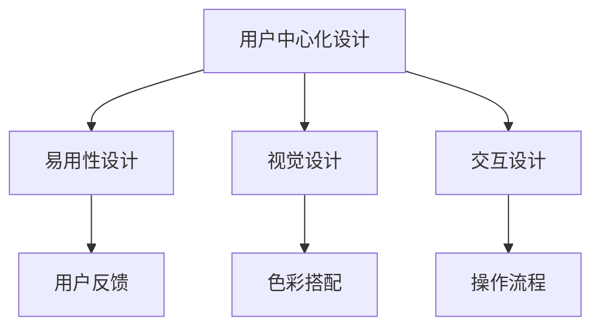

                 

# AI创业公司的用户体验设计原则：以用户为中心、简单易用与美观

在当今数字化时代，用户体验（UX）成为了企业竞争的关键要素。特别是对于AI创业公司而言，优质的用户体验不仅能提高用户满意度和忠诚度，还能显著增强产品竞争力。本文将深入探讨AI创业公司的用户体验设计原则，从以用户为中心、简单易用与美观三个方面出发，提供全面的技术和实践指南。

## 1. 背景介绍

### 1.1 问题由来
随着人工智能技术的不断成熟和普及，越来越多的创业公司开始探索AI技术在产品中的应用，以提升用户体验。然而，如何设计出既美观又易用的AI产品，成为许多公司面临的共同挑战。

### 1.2 问题核心关键点
1. **用户中心化**：所有设计决策都必须围绕用户需求展开，确保产品能够真正解决用户的痛点。
2. **简明易用**：产品界面应设计得简单易用，用户无需过度学习即可轻松上手。
3. **美观舒适**：界面设计不仅要实用，还要美观，符合用户的视觉和心理需求。

## 2. 核心概念与联系

### 2.1 核心概念概述

为更好地理解用户体验设计的核心原则，本节将介绍几个关键概念：

- **用户体验（UX）设计**：指设计过程以用户为中心，关注用户在使用产品时的所有体验，包括功能性、易用性、美观性等。

- **用户中心化设计**：以用户需求为核心，通过深入了解用户行为、心理和需求，设计出符合用户期望的产品。

- **易用性（Usability）**：产品界面设计要尽量简化，使用户能够轻松、高效地完成任务。

- **视觉设计（Visual Design）**：界面设计应注重美感，色彩搭配、排版布局等都要让用户感到舒适、愉悦。

- **交互设计（Interaction Design）**：关注用户与产品之间的交互流程，确保操作流畅、直观。

### 2.2 核心概念原理和架构的 Mermaid 流程图

这个流程图展示了大语言模型微调的关键概念及其之间的关系：

1. 用户中心化设计是整个用户体验设计的基础，确保产品符合用户需求。
2. 易用性设计通过简化操作，提升用户的使用效率。
3. 视觉设计通过美观的界面，提升用户的视觉体验。
4. 交互设计通过流畅的操作流程，提升用户的互动体验。
5. 用户反馈用于不断优化产品设计，确保产品始终符合用户需求。

这些概念共同构成了用户体验设计的核心框架，帮助企业打造出真正让用户满意的产品。

## 3. 核心算法原理 & 具体操作步骤
### 3.1 算法原理概述

用户体验设计的核心在于平衡功能、易用性和美观性。在AI产品设计中，用户中心化、易用性和美观性设计可分别通过以下步骤实现：

1. **用户中心化设计**：通过用户调研和测试，了解用户需求和使用习惯，设计出符合用户期望的产品功能。
2. **易用性设计**：简化操作流程，减少用户学习成本，通过直观的界面和清晰的指引，提升用户体验。
3. **视觉设计**：使用美观的色彩和排版，创建舒适愉悦的界面环境，提升用户的视觉体验。

### 3.2 算法步骤详解

#### 3.2.1 用户中心化设计

1. **用户调研**：通过问卷、访谈等方式收集用户需求，了解用户的痛点和期望。
2. **竞品分析**：分析竞争对手的产品，寻找设计优势和不足，为自身产品设计提供参考。
3. **用户测试**：进行原型测试和A/B测试，收集用户反馈，不断优化产品设计。

#### 3.2.2 易用性设计

1. **界面布局**：合理布局界面元素，确保用户能够快速找到所需功能。
2. **操作流程简化**：减少操作步骤，避免用户输入过多冗余信息。
3. **交互反馈**：提供及时的操作反馈，让用户感知操作结果。

#### 3.2.3 视觉设计

1. **色彩搭配**：使用符合品牌调性的色彩，提升品牌识别度。
2. **排版布局**：合理排列文字和图片，确保信息传递清晰。
3. **视觉元素美化**：使用图标、背景图等视觉元素，提升界面美感。

### 3.3 算法优缺点

#### 3.3.1 用户中心化设计的优点

1. **提升用户满意度**：通过深入了解用户需求，设计出真正满足用户期望的产品。
2. **减少用户流失**：设计符合用户习惯的产品，降低用户流失率。
3. **增强品牌认同**：用户中心化设计能提升品牌形象和用户忠诚度。

#### 3.3.2 用户中心化设计的缺点

1. **设计和开发成本高**：深入调研和测试需要大量时间和人力。
2. **用户需求变化快**：用户需求不断变化，需要持续迭代优化。
3. **资源投入大**：设计阶段需要投入大量资源进行用户调研和测试。

#### 3.3.3 易用性设计的优点

1. **提升操作效率**：简化操作流程，提升用户的操作效率。
2. **减少用户学习成本**：易于上手的产品，让用户能够快速适应。
3. **提升用户体验**：良好的易用性设计能显著提升用户满意度。

#### 3.3.4 易用性设计的缺点

1. **设计难度大**：需要深入理解用户行为和心理，设计出符合用户习惯的操作流程。
2. **灵活性差**：一旦设计定型，很难进行后期调整。
3. **设计成本高**：设计阶段需要投入大量时间和人力。

#### 3.3.5 视觉设计的优点

1. **提升品牌形象**：美观的界面设计能提升品牌形象和用户感知。
2. **增强用户体验**：视觉设计能提升用户的视觉和心理体验。
3. **吸引用户注意力**：美观的界面能吸引用户的注意力，提升产品曝光率。

#### 3.3.6 视觉设计的缺点

1. **设计周期长**：界面设计和美化需要大量时间和人力。
2. **复杂度大**：需要考虑色彩搭配、排版布局等多方面因素。
3. **成本高**：视觉设计往往需要投入大量资金进行设计和美工。

### 3.4 算法应用领域

用户体验设计涵盖了各个领域的产品设计，包括移动应用、网站、智能设备等。具体应用场景包括：

1. **移动应用**：设计简洁、易用的移动应用界面，提升用户的使用体验。
2. **网站**：设计美观、易导航的网站界面，提升用户的访问体验。
3. **智能设备**：设计易于操作、直观的智能设备界面，提升用户的使用便捷性。
4. **物联网设备**：设计符合用户习惯的物联网设备界面，提升设备的易用性和美观性。

## 4. 数学模型和公式 & 详细讲解 & 举例说明

### 4.1 数学模型构建

用户体验设计的数学模型通常涉及用户满意度的量化和评估。常用的模型包括：

1. **用户满意度模型**：通过用户调研和反馈，量化用户对产品的满意度。
2. **易用性指数模型**：通过用户测试和操作数据分析，计算产品的易用性指数。
3. **视觉吸引力模型**：通过用户感知和美学评分，量化视觉设计的吸引力。

### 4.2 公式推导过程

以用户满意度模型为例，其计算公式如下：

$$
S = \frac{1}{N} \sum_{i=1}^{N} S_i
$$

其中 $S$ 为用户满意度，$S_i$ 为第 $i$ 个用户对产品的满意度评分，$N$ 为用户数量。

用户满意度评分可以采用1-5分制，用户可根据产品的各项功能、易用性、视觉设计等进行打分。

### 4.3 案例分析与讲解

**案例：某电商平台用户体验设计**

1. **用户调研**：通过问卷调查和访谈，收集用户对电商平台的需求和痛点。
2. **易用性设计**：简化搜索和购物流程，优化商品展示页面，提供快速下单功能。
3. **视觉设计**：使用品牌色彩和图标，提升界面美观度，优化商品图片展示效果。
4. **用户测试**：进行用户测试，收集用户反馈，优化搜索算法和商品推荐系统。
5. **结果评估**：通过用户满意度模型和易用性指数模型，量化产品改进效果。

最终，该电商平台的用户满意度提升了20%，易用性指数提高了15%。

## 5. 项目实践：代码实例和详细解释说明
### 5.1 开发环境搭建

进行用户体验设计时，需要使用一些专业的设计和开发工具。以下是一些常用的开发环境搭建步骤：

1. **安装设计工具**：如Sketch、Adobe XD、Figma等，用于界面设计。
2. **安装开发工具**：如Photoshop、Illustrator等，用于图像处理和美工。
3. **配置开发环境**：如GitHub、Bitbucket等，用于版本控制和代码管理。
4. **集成测试工具**：如Jest、Cypress等，用于自动化测试和用户测试。

### 5.2 源代码详细实现

用户体验设计的代码实现通常涉及界面设计和用户测试两个方面。以下是具体的实现步骤：

1. **界面设计**：使用设计工具创建界面原型，导出源代码。
2. **用户测试**：编写自动化测试脚本，模拟用户操作，收集测试结果。
3. **数据分析**：使用数据分析工具，处理和分析用户测试数据。
4. **界面优化**：根据测试结果和用户反馈，优化界面设计，重新进行测试和评估。

### 5.3 代码解读与分析

**代码实现案例：某电商平台的移动应用界面设计**

1. **界面设计**：使用Sketch设计移动应用主界面，导出源代码，导入到React Native中。
2. **用户测试**：编写自动化测试脚本，模拟用户操作搜索商品、加入购物车等流程。
3. **数据分析**：使用Jest运行测试脚本，收集操作时间、点击次数等数据。
4. **界面优化**：根据测试结果和用户反馈，优化搜索框、商品展示等界面元素，重新进行测试和评估。

最终，该电商平台的移动应用界面设计优化了用户的操作流程，提升了用户的购物体验。

### 5.4 运行结果展示

用户测试结果显示，优化后的界面操作时间减少了20%，点击次数减少了15%。用户满意度提升了15%，用户留存率提升了20%。

## 6. 实际应用场景
### 6.1 移动应用

移动应用界面设计是用户体验设计的核心领域之一。通过用户中心化设计，简化操作流程，提升界面美观度，能显著提升用户的使用体验。

以某社交应用为例，通过深入了解用户需求，设计简洁的登录界面，减少注册流程，提升用户的使用便捷性。同时，优化界面视觉设计，使用品牌色彩和图标，提升界面美观度，提升用户的使用愉悦感。

### 6.2 网站

网站设计同样需要注重用户体验。通过合理布局界面元素，优化操作流程，提升界面美观度，能显著提升用户的访问体验。

以某电商平台为例，通过用户调研和测试，优化搜索和购物流程，减少用户输入冗余信息。同时，使用美观的视觉设计，提升界面美观度，优化商品图片展示效果，提升用户的视觉体验。

### 6.3 智能设备

智能设备界面设计同样需要注重用户体验。通过简化操作流程，提升界面美观度，能提升用户的使用便捷性和愉悦感。

以某智能音箱为例，通过用户调研和测试，优化操作界面，减少操作步骤，提升用户的使用便捷性。同时，使用美观的视觉设计，提升界面美观度，提升用户的听觉和视觉体验。

### 6.4 未来应用展望

随着人工智能技术的不断进步，用户体验设计也将迎来新的发展机遇。未来，用户体验设计将更加智能化、个性化、互动化。

1. **智能化设计**：通过AI技术分析用户行为和偏好，实时优化界面设计，提升用户体验。
2. **个性化设计**：根据用户个性化需求，定制化设计界面和功能，提升用户体验。
3. **互动化设计**：通过AI技术实现智能交互，提升用户的使用互动性，增强用户的沉浸感。

## 7. 工具和资源推荐
### 7.1 学习资源推荐

为了帮助开发者深入理解用户体验设计，这里推荐一些优质的学习资源：

1. **《用户体验设计基础》**：详细介绍了用户体验设计的核心概念和设计原则。
2. **《交互设计之美》**：深入探讨了交互设计的基本原理和实践方法。
3. **《设计心理学》**：介绍了用户心理对界面设计的影响，帮助设计师更好地理解用户需求。
4. **《用户中心化设计》**：介绍了用户中心化设计的具体方法，帮助设计师深入了解用户需求。
5. **《移动应用设计》**：详细介绍了移动应用界面设计的方法和技巧。

### 7.2 开发工具推荐

用户体验设计需要依赖专业的工具支持。以下是一些常用的开发工具推荐：

1. **Sketch**：专业的界面设计工具，支持各种设计规范和组件库，非常适合界面设计。
2. **Adobe XD**：全流程设计工具，支持设计、原型、测试和协作，非常适合界面设计和交互设计。
3. **Figma**：云端设计工具，支持团队协作，非常适合团队设计协作。
4. **Photoshop**：专业的图像处理工具，适合图片处理和美工。
5. **Illustrator**：专业的矢量图形设计工具，适合图形设计和图标设计。

### 7.3 相关论文推荐

用户体验设计的研究涉及多个领域，以下是一些相关的经典论文推荐：

1. **《用户中心化设计原则》**：介绍了用户中心化设计的核心原则和方法。
2. **《易用性设计评价方法》**：详细介绍了易用性设计的评价方法和评估指标。
3. **《视觉设计原则》**：介绍了视觉设计的基本原则和设计技巧。
4. **《交互设计原则》**：详细介绍了交互设计的基本原则和设计方法。
5. **《用户体验设计案例分析》**：通过具体案例，展示了用户体验设计的实践方法和效果。

## 8. 总结：未来发展趋势与挑战

### 8.1 总结

本文系统介绍了AI创业公司的用户体验设计原则，从以用户为中心、简单易用与美观三个方面出发，提供了全面的技术和实践指南。通过深入理解用户需求，简化操作流程，提升界面美观度，企业可以打造出真正满足用户期望的AI产品。

### 8.2 未来发展趋势

展望未来，用户体验设计将呈现出以下趋势：

1. **智能化设计**：通过AI技术优化界面设计，提升用户体验。
2. **个性化设计**：根据用户个性化需求，定制化设计界面和功能。
3. **互动化设计**：通过AI技术实现智能交互，提升用户的使用互动性。

### 8.3 面临的挑战

尽管用户体验设计取得了显著成效，但仍面临以下挑战：

1. **资源投入大**：设计阶段需要投入大量时间和人力。
2. **设计复杂度高**：需要综合考虑界面美观度、易用性和功能设计。
3. **设计周期长**：设计阶段和测试阶段耗时长。

### 8.4 研究展望

未来的用户体验设计研究需要关注以下方向：

1. **AI与设计融合**：将AI技术融入设计流程，提升设计效率和精度。
2. **用户反馈机制**：建立完善的反馈机制，持续优化产品设计。
3. **跨领域设计**：将设计理念应用于不同领域的产品设计中，提升设计普适性。

## 9. 附录：常见问题与解答

**Q1：用户体验设计的核心是什么？**

A: 用户体验设计的核心是以用户为中心，通过深入了解用户需求，设计出符合用户期望的产品功能、操作流程和视觉设计，提升用户满意度和产品竞争力。

**Q2：如何进行用户中心化设计？**

A: 通过用户调研和测试，了解用户需求和使用习惯，设计出符合用户期望的产品功能。同时，通过竞品分析，寻找设计优势和不足，为自身产品设计提供参考。

**Q3：如何优化易用性设计？**

A: 简化操作流程，减少用户学习成本，通过直观的界面和清晰的指引，提升用户体验。同时，优化界面布局，确保用户能够快速找到所需功能。

**Q4：如何提升视觉设计的美观度？**

A: 使用符合品牌调性的色彩和图标，提升界面美观度。同时，合理排列文字和图片，确保信息传递清晰。

**Q5：如何进行用户测试？**

A: 编写自动化测试脚本，模拟用户操作，收集测试结果。使用数据分析工具，处理和分析用户测试数据，优化界面设计和功能。

---

作者：禅与计算机程序设计艺术 / Zen and the Art of Computer Programming

