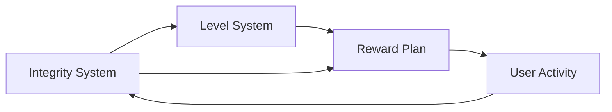

                 

# AI创业公司的用户激励与奖励机制：积分体系、等级体系与奖励计划

## 1. 背景介绍

随着AI技术的日益成熟，AI创业公司在商业应用中获得了广泛认可。用户激励与奖励机制成为这些公司获取用户、留住用户和提高用户粘性的重要手段。本文将深入探讨AI创业公司中用户激励与奖励机制的构建方法，并介绍积分体系、等级体系和奖励计划等常见实现方式，为AI创业公司设计有效的用户激励体系提供参考。

## 2. 核心概念与联系

### 2.1 核心概念概述

在AI创业公司中，用户激励与奖励机制是指通过设计一系列规则和奖励方案，激励用户进行特定的行为，如注册、活跃度提升、内容创造等，从而提高用户留存率和忠诚度。常见的激励方式包括积分体系、等级体系和奖励计划等。

- **积分体系**：用户通过完成特定行为获得积分，积分可以兑换奖励或特权。
- **等级体系**：用户根据行为积分累积情况被划分到不同等级，高等级享有更多特权和奖励。
- **奖励计划**：提供即时奖励，如优惠券、现金或实物奖励，以吸引和保留用户。

这些机制之间存在密切联系，通常会结合使用，共同构成一个完整的用户激励体系。

### 2.2 核心概念原理和架构的 Mermaid 流程图



## 3. 核心算法原理 & 具体操作步骤
### 3.1 算法原理概述

用户激励与奖励机制的算法原理主要包括以下几个方面：

1. **行为积分计算**：用户通过完成特定的行为（如注册、登录、购买等）获得积分。积分计算公式为：$积分 = 行为权重 \times 完成次数$。
2. **等级提升**：根据积分累积情况，用户可以提升到更高等级。等级提升公式为：$等级 = \max(当前等级 + 等级增长速度, 1)$。
3. **奖励分配**：用户达到一定等级或积分后，可以领取奖励。奖励分配公式为：$奖励 = 奖励数量 \times 奖励价值$。

### 3.2 算法步骤详解

1. **行为积分计算**：
   - 确定用户完成行为的权重，例如注册行为权重为10，购买行为权重为100。
   - 用户每次完成行为后，计算其获得积分的数量。例如，用户注册后获得10积分，购买后获得100积分。

2. **等级提升**：
   - 定义等级和积分的对应关系，例如初级用户为1级，积分要求为0-500。
   - 根据用户积分累积情况，提升其等级。例如，用户积分达到501-1000时，等级提升到中级。

3. **奖励分配**：
   - 定义不同等级的奖励，例如初级用户可领取优惠券，中级用户可领取现金红包。
   - 根据用户等级或积分，分配相应的奖励。例如，用户达到中级时，领取一张50元的现金红包。

### 3.3 算法优缺点

**优点**：
- **提升用户活跃度**：通过积分和等级机制，激励用户进行更多行为，提高用户活跃度。
- **增强用户粘性**：积分和等级可以逐步增加用户对平台的依赖和忠诚度。
- **精准用户画像**：通过积分和等级记录，可以构建精准的用户画像，便于个性化推荐和营销。

**缺点**：
- **复杂度较高**：设计复杂的积分和等级体系，容易让用户感到困惑，影响用户体验。
- **成本较高**：大量积分和奖励的生成和分发成本较高，可能影响公司盈利。
- **公平性问题**：积分和等级体系可能存在公平性问题，容易导致用户间的不平衡。

### 3.4 算法应用领域

用户激励与奖励机制广泛应用于各种类型的AI创业公司，如社交媒体、电子商务、在线教育、健康医疗等。

## 4. 数学模型和公式 & 详细讲解 & 举例说明

### 4.1 数学模型构建

设用户完成行为的权重为$w_i$，完成次数为$n_i$，积分计算公式为：

$$
积分 = \sum_{i=1}^m w_i \times n_i
$$

其中$m$为用户行为总数。

设等级与积分的对应关系为$f(\cdot)$，用户当前积分为$score$，等级提升公式为：

$$
等级 = f(\max(0, score - \sum_{i=1}^m w_i \times t_i))
$$

其中$t_i$为用户达到对应积分所需的次数。

设奖励数量为$r$，奖励价值为$v$，奖励分配公式为：

$$
奖励 = r \times v
$$

### 4.2 公式推导过程

以注册行为为例，计算用户积分和等级提升：

- 假设注册行为权重为10，用户完成一次注册行为获得10积分。
- 设用户当前积分为500，达到500积分时用户等级为初级。
- 设用户完成50次注册行为，用户总积分为500+50\*10=700。
- 设用户达到中级（积分要求为501-1000）时，等级提升到中级。

根据公式计算用户等级：

$$
等级 = f(\max(0, 700 - 50 \times 10)) = f(\max(0, 200))
$$

设中级用户可领取优惠券，领取一张50元的优惠券。

根据公式计算用户奖励：

$$
奖励 = 1 \times 50 = 50
$$

### 4.3 案例分析与讲解

**案例一：电商平台**

- **积分体系**：用户每消费一元获得10积分，积分可兑换折扣或礼品卡。
- **等级体系**：用户消费累计达到1000元时，升级为VIP，享受更多折扣和免费物流。
- **奖励计划**：购物满额用户可获得现金红包或优惠券，参加抽奖活动赢取精美礼品。

**案例二：健康管理平台**

- **积分体系**：用户每天完成健康数据记录获得10积分，积分可兑换健身器材或健康咨询服务。
- **等级体系**：用户积分累积达到500分时，升级为专业会员，享受个性化健康计划和专家咨询。
- **奖励计划**：平台举办健康挑战活动，完成挑战用户可获得免费体检机会和精美纪念品。

## 5. 项目实践：代码实例和详细解释说明

### 5.1 开发环境搭建

1. **选择编程语言和框架**：
   - 建议选择Python，并使用Django或Flask等Web框架。
   - 确保安装Flask、SQLAlchemy等库。

2. **设计数据库表**：
   - 创建用户表`users`，记录用户ID、积分、等级等。
   - 创建行为表`activities`，记录行为ID、权重、完成次数等。
   - 创建奖励表`rewards`，记录奖励ID、数量、价值等。

3. **部署Web应用**：
   - 搭建Web应用，提供积分查询、行为记录、等级提升、奖励领取等功能。

### 5.2 源代码详细实现

```python
from flask import Flask, request, jsonify
from sqlalchemy import Column, Integer, String, ForeignKey
from sqlalchemy.orm import relationship
from sqlalchemy.ext.declarative import declarative_base

Base = declarative_base()

class User(Base):
    __tablename__ = 'users'
    id = Column(Integer, primary_key=True)
    score = Column(Integer, default=0)
    level = Column(Integer, default=1)

class Activity(Base):
    __tablename__ = 'activities'
    id = Column(Integer, primary_key=True)
    name = Column(String)
    weight = Column(Integer)
    times = Column(Integer)

class Reward(Base):
    __tablename__ = 'rewards'
    id = Column(Integer, primary_key=True)
    name = Column(String)
    amount = Column(Integer)
    value = Column(Integer)

@app.route('/user/score', methods=['GET'])
def get_user_score():
    user_id = request.args.get('user_id')
    user = User.query.get(user_id)
    return jsonify({'score': user.score})

@app.route('/activity/record', methods=['POST'])
def record_activity():
    user_id = request.args.get('user_id')
    activity_id = request.args.get('activity_id')
    times = request.args.get('times')
    user = User.query.get(user_id)
    activity = Activity.query.get(activity_id)
    user.score += activity.weight * times
    user.level = max(user.level, 1)
    # 等级提升逻辑
    activity_name = activity.name
    activity_weight = activity.weight
    activity_times = activity.times
    score = user.score
    if score >= activity_name + activity_weight * activity_times:
        user.level += 1
    return jsonify({'score': user.score, 'level': user.level})

@app.route('/reward/get', methods=['GET'])
def get_reward():
    user_id = request.args.get('user_id')
    user = User.query.get(user_id)
    reward_id = request.args.get('reward_id')
    reward = Reward.query.get(reward_id)
    return jsonify({'amount': reward.amount, 'value': reward.value})

if __name__ == '__main__':
    app.run(debug=True)
```

### 5.3 代码解读与分析

**用户积分查询**：
- 查询用户ID对应的积分，返回JSON格式的积分值。

**行为记录**：
- 接收用户ID、活动ID和完成次数，记录用户完成行为获得积分，并判断是否需要提升等级。

**奖励领取**：
- 接收用户ID和奖励ID，查询奖励数量和价值，返回JSON格式的奖励信息。

### 5.4 运行结果展示

- 用户完成注册行为，积分和等级更新。
- 用户完成购物行为，积分和等级更新。
- 用户达到积分要求，领取奖励。

## 6. 实际应用场景

### 6.1 社交媒体平台

在社交媒体平台上，用户可以通过发布内容、互动评论等方式获得积分和等级，高等级用户享受更多特权，如优先推荐、专享活动等。

### 6.2 在线教育平台

在线教育平台可以设计积分体系，用户通过完成学习任务、参与讨论等方式获得积分，积分兑换学习优惠券或免费课程。

### 6.3 健康管理平台

健康管理平台可以通过记录运动数据、健康数据等方式获得积分，积分兑换健康设备或咨询服务。

### 6.4 未来应用展望

未来，用户激励与奖励机制将更加智能化和个性化，通过大数据和AI技术实现动态调整，提高用户满意度和粘性。例如：

- **动态调整积分和等级**：根据用户行为和偏好，动态调整积分和等级的生成规则。
- **个性化推荐奖励**：根据用户行为和需求，推荐个性化的奖励方案。
- **多维度积分体系**：除了行为积分，加入社交、内容创造等多维度的积分体系，提高用户参与度。

## 7. 工具和资源推荐

### 7.1 学习资源推荐

1. **《用户激励体系设计》**：一本系统讲解用户激励体系设计的书籍，包括积分、等级、奖励等常见机制。
2. **《数据分析与机器学习》**：深入浅出地介绍数据分析和机器学习技术，为设计复杂积分体系提供理论支持。
3. **《数据科学与用户行为分析》**：详细讲解用户行为分析的方法和工具，为设计个性化激励机制提供指导。

### 7.2 开发工具推荐

1. **Flask**：轻量级的Web框架，易于上手，适合快速搭建用户激励系统。
2. **SQLAlchemy**：Python的SQL工具库，支持多种数据库，方便数据管理和查询。
3. **Django**：功能全面的Web框架，适用于大型用户激励系统的开发。

### 7.3 相关论文推荐

1. **《用户行为分析与激励机制设计》**：介绍用户行为分析方法和激励机制设计思路，为实践提供理论支持。
2. **《在线平台用户留存率提升研究》**：通过数据分析和实验验证用户激励机制的效果，提供实际应用案例。
3. **《社交媒体平台用户粘性提升策略》**：详细探讨社交媒体平台的激励机制，为社交平台提供参考。

## 8. 总结：未来发展趋势与挑战

### 8.1 研究成果总结

用户激励与奖励机制在AI创业公司中发挥着重要作用，能够有效提升用户活跃度和忠诚度。通过积分体系、等级体系和奖励计划等机制，实现对用户的有效激励。

### 8.2 未来发展趋势

未来，用户激励与奖励机制将更加智能化和个性化，通过大数据和AI技术实现动态调整，提高用户满意度和粘性。同时，随着技术的发展，更多前沿技术将被引入，如区块链技术用于积分和奖励的生成和分发，隐私计算技术用于用户行为数据的保护等。

### 8.3 面临的挑战

用户激励与奖励机制的设计和实施仍面临诸多挑战，包括：

1. **用户参与度不足**：设计不合理的激励体系可能导致用户参与度低，影响系统效果。
2. **公平性问题**：激励体系可能存在不公平，导致用户间的不平衡。
3. **成本控制**：大量积分和奖励的生成和分发成本较高，可能影响公司盈利。

### 8.4 研究展望

未来，需要在激励体系设计中注重用户参与度的提升、公平性的保障和成本的控制，进一步提升用户激励与奖励机制的效果。

## 9. 附录：常见问题与解答

**Q1：用户激励与奖励机制的实现过程中，需要注意哪些问题？**

A: 用户激励与奖励机制的实现过程中，需要注意以下问题：
1. **激励机制设计**：设计合理、公平、透明的激励机制，避免用户产生不公平感。
2. **积分和等级计算**：确保积分和等级计算公式的准确性和公平性。
3. **奖励分配**：合理设计奖励类型和数量，避免奖励过度或不足。
4. **用户体验**：确保用户操作简便、界面友好，避免复杂度和混乱。

**Q2：如何设计合理的用户激励体系？**

A: 设计合理的用户激励体系需要考虑以下几点：
1. **明确激励目标**：确定激励体系的目标，如提升用户活跃度、增加用户留存率等。
2. **理解用户需求**：分析用户行为和需求，设计有针对性的激励措施。
3. **合理设置积分和等级**：设置合理的积分和等级体系，保证用户能够通过合理努力获得相应奖励。
4. **动态调整机制**：根据用户反馈和行为数据，动态调整积分和等级的生成规则，提高激励效果。

**Q3：如何优化用户激励体系的公平性？**

A: 优化用户激励体系的公平性需要考虑以下几点：
1. **透明规则**：确保激励体系规则透明，用户能够清晰了解积分和等级的获得方式。
2. **多样性奖励**：设计多样化的奖励类型，满足不同用户的需求。
3. **动态调整**：根据用户反馈和行为数据，动态调整激励体系，保持公平性。
4. **人工干预**：在必要时，进行人工干预，如补发奖励、调整积分规则等，确保公平性。

**Q4：用户激励与奖励机制的实现过程中，如何降低成本？**

A: 用户激励与奖励机制的实现过程中，可以采取以下措施降低成本：
1. **简化积分和等级计算**：设计简单、高效的积分和等级计算公式，减少计算资源消耗。
2. **使用智能算法**：利用智能算法自动生成奖励，减少人工干预。
3. **优化数据库设计**：优化数据库设计，提高数据查询和存储效率。
4. **采用区块链技术**：使用区块链技术生成和分发积分和奖励，减少成本和复杂度。

**Q5：如何实现动态调整用户激励体系？**

A: 实现动态调整用户激励体系需要考虑以下几点：
1. **实时数据分析**：实时收集和分析用户行为数据，及时发现问题。
2. **算法优化**：优化激励体系算法，动态调整积分和等级的生成规则。
3. **用户反馈**：收集用户反馈，了解用户需求和期望。
4. **模型训练**：通过机器学习模型预测用户行为，自动调整激励体系。

---

作者：禅与计算机程序设计艺术 / Zen and the Art of Computer Programming

