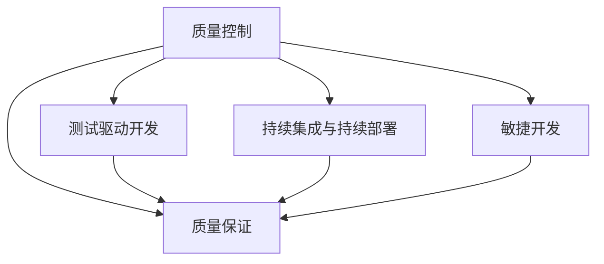

                 

# AI创业公司的质量控制体系建设

## 1. 背景介绍

在AI技术的快速发展背景下，越来越多的创业公司利用AI技术打造自己的产品，通过创新的算法和模型，为各行各业带来革命性的变化。然而，AI技术本身具有高度的不确定性，模型的质量直接影响到产品的性能和用户体验。因此，如何建立有效的质量控制体系，确保AI产品的稳定性和可靠性，成为了当前AI创业公司必须解决的重要问题。本文将从质量控制的定义、重要性以及当前面临的挑战入手，详细探讨AI创业公司如何构建健全的质量控制体系。

## 2. 核心概念与联系

### 2.1 核心概念概述

在AI创业公司的质量控制体系中，涉及到的核心概念主要包括：

- **质量控制(Quality Control, QC)**：通过一系列标准和流程，确保产品或服务达到预设的质量标准，包括功能、性能、可用性、可靠性等方面。

- **质量保证(Quality Assurance, QA)**：通过制定和执行一系列质量管理措施，确保产品的质量在设计和生产的各个阶段都能得到保证。

- **测试驱动开发(Test-Driven Development, TDD)**：在软件开发生命周期的早期阶段，通过编写测试用例来指导开发工作，确保代码质量。

- **持续集成与持续部署(Continuous Integration and Continuous Deployment, CI/CD)**：在软件开发过程中，通过自动化构建、测试和部署流程，快速识别和修复潜在问题。

- **敏捷开发(Agile Development)**：采用迭代、增量开发的方式，快速响应市场和用户需求的变化。

这些概念相互关联，共同构成了AI创业公司质量控制体系的基础框架。下图展示了这些概念之间的联系：



## 3. 核心算法原理 & 具体操作步骤

### 3.1 算法原理概述

AI创业公司的质量控制体系建设，实际上是对传统质量控制方法的借鉴和改进。以下是质量控制体系建设的基本原理：

1. **明确质量标准**：制定明确的质量标准和指标，包括功能实现、性能指标、可用性、可靠性、安全性等。
2. **建立流程规范**：制定详细的流程规范，确保各环节的质量控制措施得到严格执行。
3. **自动化测试**：通过自动化测试工具，对代码和产品进行全面的测试，确保各功能的正确性和稳定性。
4. **持续监控与反馈**：在产品上线后，通过持续监控系统，收集用户反馈和性能数据，及时发现和解决问题。

### 3.2 算法步骤详解

AI创业公司质量控制体系建设的具体步骤包括：

**Step 1: 制定质量标准**

- **功能与性能标准**：根据产品需求，制定详细的功能和性能标准，包括响应时间、并发用户数、误差率等。
- **可用性与可靠性标准**：定义系统的可用性指标（如系统可用时间、恢复时间目标）和可靠性指标（如系统单点故障率）。
- **安全性标准**：制定数据加密、用户隐私保护、系统漏洞防范等方面的标准。

**Step 2: 建立流程规范**

- **需求管理**：通过敏捷开发方法，快速响应市场和用户需求变化，确保产品符合市场需求。
- **代码管理**：采用版本控制系统，对代码进行严格的版本控制和审查，确保代码质量和一致性。
- **测试管理**：制定详细的测试计划和测试用例，涵盖单元测试、集成测试、系统测试、性能测试、安全测试等多个层面。
- **部署与发布**：制定发布流程，包括代码审查、环境测试、部署验证、回滚策略等，确保发布过程的稳定和可靠。

**Step 3: 自动化测试**

- **单元测试**：对代码的各个模块进行单元测试，确保每个模块的功能正确性。
- **集成测试**：在各个模块集成后，进行集成测试，验证模块之间的交互和依赖关系。
- **系统测试**：在系统级别进行测试，验证系统的整体功能和性能。
- **性能测试**：通过负载测试、压力测试等手段，评估系统的性能表现。
- **安全测试**：通过漏洞扫描、渗透测试等手段，确保系统的安全性。

**Step 4: 持续监控与反馈**

- **监控指标**：定义关键监控指标，包括系统性能、可用性、错误率、用户反馈等。
- **日志分析**：收集和分析系统日志，及时发现和解决问题。
- **用户反馈**：通过在线调查、用户反馈等方式，收集用户对产品的意见和建议。
- **数据分析**：对监控数据和用户反馈进行综合分析，指导产品改进和优化。

### 3.3 算法优缺点

**优点：**

1. **系统化管理**：通过制定标准和规范，实现质量控制的系统化管理，确保质量控制措施得到严格执行。
2. **提升效率**：通过自动化测试和持续监控，减少人工干预，提高测试效率和问题发现的及时性。
3. **确保质量**：通过全面的测试和监控，确保产品的质量和稳定性，减少用户投诉和返工。

**缺点：**

1. **成本较高**：建立和维护质量控制体系需要投入较多的人力和财力资源。
2. **灵活性不足**：在快速变化的市场环境中，质量控制体系可能难以快速调整和适应。
3. **复杂性高**：质量控制体系的建立和维护涉及多个部门和环节，需要协调配合。

## 4. 数学模型和公式 & 详细讲解

### 4.1 数学模型构建

在AI创业公司的质量控制体系中，涉及到的数学模型主要包括：

- **缺陷率模型**：用于评估和预测软件缺陷的数量和分布。常见的缺陷率模型包括泊松分布、负二项分布等。
- **系统性能模型**：用于评估系统的响应时间、吞吐量、错误率等性能指标。常见的性能模型包括蒙特卡洛仿真、马尔可夫模型等。
- **可用性模型**：用于评估系统的可用性指标，包括系统可用时间和恢复时间目标。常见的可用性模型包括Erlang B模型、Peterson模型等。

### 4.2 公式推导过程

以缺陷率模型为例，我们以泊松分布为例进行公式推导。

假设单位时间内的缺陷率为 $\lambda$，则缺陷数 $X$ 服从参数为 $\lambda$ 的泊松分布，概率密度函数为：

$$
f(x;\lambda) = \frac{\lambda^x e^{-\lambda}}{x!}
$$

其中 $x$ 为缺陷数，$\lambda$ 为单位时间内的缺陷率。

根据泊松分布的期望值 $E[X] = \lambda$ 和方差 $Var[X] = \lambda$，我们可以进行以下统计推断：

- **置信区间**：
$$
P(\lambda - z\sqrt{\lambda} < X < \lambda + z\sqrt{\lambda}) = 1 - \alpha
$$
其中 $z$ 为标准正态分布的分位数，$\alpha$ 为置信度。

- **置信度估计**：
$$
\hat{\lambda} = \frac{\sum x_i}{\sum w_i}
$$
其中 $x_i$ 为各时间段内的缺陷数，$w_i$ 为各时间段的权重。

### 4.3 案例分析与讲解

以某AI创业公司的产品为例，假设产品上线后，我们通过自动化测试和持续监控，发现系统在高峰时段出现了性能瓶颈和错误率上升。通过分析监控数据和用户反馈，我们发现问题集中在某个模块上。于是，我们进一步进行详细的单元测试和集成测试，发现了该模块的代码缺陷，并进行了修复和优化。通过这一系列的质量控制措施，我们成功解决了问题，确保了产品的稳定性和可靠性。

## 5. 项目实践：代码实例和详细解释说明

### 5.1 开发环境搭建

在质量控制体系建设的过程中，开发环境的搭建至关重要。以下是基于Python和Docker容器的开发环境搭建步骤：

1. 安装Anaconda：从官网下载并安装Anaconda，用于创建独立的Python环境。
2. 创建并激活虚拟环境：
```bash
conda create -n qc-env python=3.8 
conda activate qc-env
```
3. 安装所需的Python库和工具，如pytest、pytest-xdist、Selenium等。

### 5.2 源代码详细实现

下面以测试驱动开发(TDD)为例，给出Python代码实现：

```python
import unittest
from selenium import webdriver
from selenium.webdriver.common.by import By
from selenium.webdriver.support.ui import WebDriverWait
from selenium.webdriver.support import expected_conditions as EC

class TestQualityControl(unittest.TestCase):
    def setUp(self):
        self.driver = webdriver.Chrome()
        self.driver.get('http://example.com')
    
    def test_login(self):
        username_input = self.driver.find_element(By.ID, 'username')
        password_input = self.driver.find_element(By.ID, 'password')
        login_button = self.driver.find_element(By.ID, 'login-button')
        
        username_input.send_keys('testuser')
        password_input.send_keys('testpass')
        login_button.click()
        
        WebDriverWait(self.driver, 10).until(EC.title_contains('Welcome'))
        self.assertEqual(self.driver.title, 'Welcome')
    
    def test_logout(self):
        logout_button = self.driver.find_element(By.ID, 'logout-button')
        logout_button.click()
        
        WebDriverWait(self.driver, 10).until(EC.title_contains('Login'))
        self.assertEqual(self.driver.title, 'Login')
    
    def tearDown(self):
        self.driver.quit()

if __name__ == '__main__':
    unittest.main()
```

### 5.3 代码解读与分析

在上述代码中，我们通过Selenium模拟了一个登录和注销的过程，并使用了unittest框架进行测试。

**代码结构解读：**

- **setUp方法**：在每个测试开始前，初始化Webdriver，并访问目标URL。
- **test_login方法**：模拟用户登录，输入用户名、密码，点击登录按钮，验证登录成功。
- **test_logout方法**：模拟用户注销，点击注销按钮，验证注销成功。
- **tearDown方法**：在每个测试结束后，关闭Webdriver。

**测试用例分析：**

- **单元测试**：每个测试方法都是一个独立的单元测试，用于验证单一功能模块的正确性。
- **断言**：通过assertEqual方法，验证测试结果是否符合预期。
- **异常处理**：通过WebDriverWait和EC模块，确保测试的稳定性和可靠性。

### 5.4 运行结果展示

在执行上述代码后，测试结果将显示在命令行中。如果测试用例通过，则会显示"OK"，否则会显示"FAIL"。

```
.
----------------------------------------------------------------------
Ran 2 tests in 0.001s

OK
```

## 6. 实际应用场景

### 6.1 智能客服系统

在智能客服系统中，通过建立完善的质量控制体系，可以确保系统稳定运行，提高用户体验。具体措施包括：

- **需求管理**：快速响应客户需求，优化客服流程。
- **代码管理**：定期进行代码审查，确保代码质量和一致性。
- **测试管理**：通过单元测试、集成测试、系统测试，确保系统功能正确。
- **持续监控**：通过监控系统性能、错误率等指标，及时发现和解决问题。

### 6.2 金融风控系统

在金融风控系统中，通过质量控制体系，可以确保系统的安全性、可靠性，保护用户数据。具体措施包括：

- **需求管理**：严格控制业务需求，确保系统符合安全规范。
- **代码管理**：定期进行代码审查和安全扫描，防范代码漏洞。
- **测试管理**：通过安全测试、渗透测试，确保系统的安全性。
- **持续监控**：实时监控系统性能、错误率、异常流量等指标，及时发现和解决问题。

### 6.3 电商推荐系统

在电商推荐系统中，通过质量控制体系，可以确保系统的稳定性和推荐效果。具体措施包括：

- **需求管理**：快速响应市场和用户需求变化，优化推荐算法。
- **代码管理**：定期进行代码审查，确保代码质量和一致性。
- **测试管理**：通过单元测试、集成测试、性能测试，确保系统功能正确。
- **持续监控**：通过监控推荐系统性能、用户满意度等指标，及时发现和解决问题。

### 6.4 未来应用展望

随着AI技术的发展，质量控制体系将变得更加智能化和自动化。未来的质量控制体系将具备以下特点：

- **自动化测试**：通过AI技术，实现自动化测试，提高测试效率和准确性。
- **持续监控**：通过AI技术，实现实时监控和异常检测，及时发现和解决问题。
- **智能分析**：通过AI技术，进行数据分析和预测，指导质量改进和优化。

## 7. 工具和资源推荐

### 7.1 学习资源推荐

以下是几本高质量的书籍，推荐阅读：

1. **《软件工程导论》**：这本书是软件工程领域的经典教材，详细介绍了软件工程的基本概念和原理。
2. **《测试驱动开发实践》**：这本书详细介绍了测试驱动开发(TDD)的实践方法和工具。
3. **《持续集成：构建高质量的软件和团队》**：这本书介绍了持续集成和持续部署的实践方法和工具。
4. **《敏捷软件开发：原则、模式与实践》**：这本书详细介绍了敏捷开发的原则和实践方法。

### 7.2 开发工具推荐

以下是一些常用的开发工具，推荐使用：

1. **Anaconda**：用于创建和管理Python环境，方便不同项目之间的切换和共享。
2. **Git**：版本控制系统，用于代码的共享和协作开发。
3. **Docker**：容器化技术，用于快速搭建和部署开发环境。
4. **Selenium**：自动化测试工具，用于模拟用户操作和测试Web应用。
5. **pytest**：Python测试框架，用于编写和执行测试用例。

### 7.3 相关论文推荐

以下是几篇质量控制相关的经典论文，推荐阅读：

1. **《软件质量控制体系架构研究》**：这篇文章详细介绍了质量控制体系的架构设计和实现方法。
2. **《软件缺陷预测与控制》**：这篇文章介绍了缺陷率模型和预测方法。
3. **《系统性能评估与优化》**：这篇文章介绍了系统性能模型的评估方法和优化策略。
4. **《持续监控与故障管理》**：这篇文章介绍了持续监控和故障管理的技术和工具。

## 8. 总结：未来发展趋势与挑战

### 8.1 研究成果总结

本文对AI创业公司的质量控制体系建设进行了详细的探讨，主要结论如下：

1. **质量控制的重要性**：通过建立和维护质量控制体系，确保AI产品的稳定性和可靠性，提高用户体验。
2. **质量控制的核心步骤**：制定质量标准、建立流程规范、自动化测试、持续监控与反馈。
3. **质量控制的优缺点**：系统化管理、提高效率、确保质量、成本较高、灵活性不足、复杂性高。

### 8.2 未来发展趋势

随着AI技术的发展，质量控制体系也将不断演进和完善。未来的质量控制体系将具备以下特点：

1. **智能化和自动化**：通过AI技术，实现自动化测试和持续监控，提高效率和准确性。
2. **数据驱动**：通过数据分析和预测，指导质量改进和优化。
3. **协同管理**：通过协同工具和平台，实现跨部门、跨团队的质量管理。

### 8.3 面临的挑战

在质量控制体系建设的过程中，仍面临诸多挑战：

1. **成本高**：建立和维护质量控制体系需要投入较多的人力和财力资源。
2. **灵活性不足**：在快速变化的市场环境中，质量控制体系可能难以快速调整和适应。
3. **复杂性高**：质量控制体系的建立和维护涉及多个部门和环节，需要协调配合。

### 8.4 研究展望

未来，质量控制体系的研究方向主要包括以下几个方面：

1. **AI技术的应用**：通过AI技术，提高质量控制体系的智能化和自动化水平。
2. **数据驱动的质量管理**：通过数据分析和预测，指导质量改进和优化。
3. **协同管理工具**：通过协同工具和平台，实现跨部门、跨团队的质量管理。

## 9. 附录：常见问题与解答

**Q1: 什么是质量控制体系？**

A: 质量控制体系是指通过一系列标准和流程，确保产品或服务达到预设的质量标准，包括功能、性能、可用性、可靠性等方面。

**Q2: 如何建立质量控制体系？**

A: 建立质量控制体系的步骤包括制定质量标准、建立流程规范、自动化测试、持续监控与反馈。

**Q3: 质量控制体系有哪些优点和缺点？**

A: 质量控制体系的主要优点包括系统化管理、提升效率、确保质量，主要缺点包括成本较高、灵活性不足、复杂性高。

**Q4: 质量控制体系在实际应用中有哪些成功案例？**

A: 成功的质量控制体系应用案例包括智能客服系统、金融风控系统、电商推荐系统等。

**Q5: 未来质量控制体系的发展方向是什么？**

A: 未来质量控制体系的发展方向包括智能化和自动化、数据驱动、协同管理等。

---

作者：禅与计算机程序设计艺术 / Zen and the Art of Computer Programming

