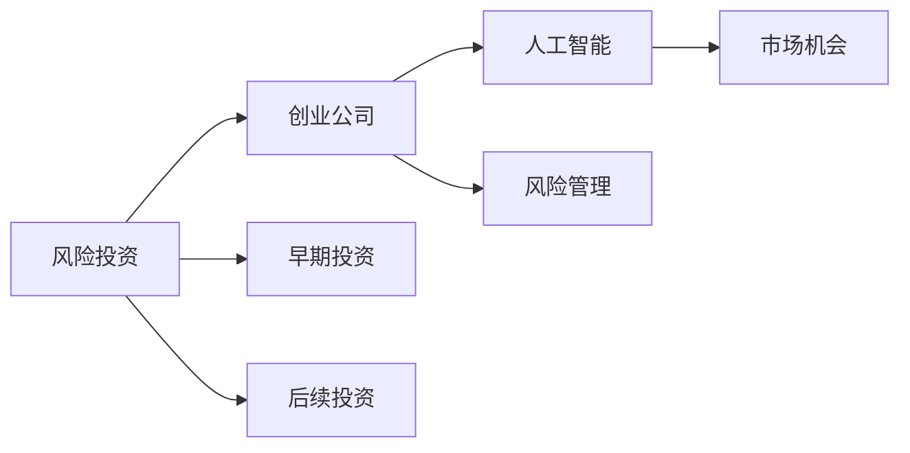

                 

## 1. 背景介绍

### 1.1 问题由来
随着人工智能技术的飞速发展，越来越多的AI创业公司如雨后春笋般涌现。然而，成功的AI公司往往凤毛麟角，多数创业项目在快速增长的过程中面临种种风险。风险投资（VC）作为AI创业公司重要的资金来源和指导力量，如何制定有效的策略至关重要。

### 1.2 问题核心关键点
AI创业公司面临的风险包括市场不成熟、技术挑战、团队稳定性、资金短缺、产品迭代周期长等。风险投资策略的核心在于如何在早期阶段识别潜力项目，并通过后续投资持续支持其发展，实现双方的共赢。

### 1.3 问题研究意义
构建科学的风险投资策略，不仅能帮助AI创业公司降低风险，也能提高投资回报率，促进AI技术的健康发展。因此，本文将深入探讨AI创业公司风险投资策略的关键要素，为投资者和创业公司提供参考。

## 2. 核心概念与联系

### 2.1 核心概念概述

为了理解AI创业公司的风险投资策略，首先需要明确几个核心概念：

- **风险投资（VC）**：一种投资方式，通过向初创企业或早期发展阶段的公司提供资金，支持其发展，并从中获得股权回报。

- **创业公司**：初创企业或早期发展阶段的公司，其核心在于创新和潜力。

- **人工智能（AI）**：通过计算机模拟人类智能过程的技术，包括机器学习、自然语言处理、计算机视觉等子领域。

- **人工智能创业公司**：专注于AI技术研发和应用的公司。

- **风险管理**：通过分析、监控和控制风险，使风险与收益达到平衡的管理过程。

- **市场机会**：指市场对某项产品或服务的需求和潜在盈利空间。

这些概念共同构成了AI创业公司风险投资策略的理论基础，理解这些概念对于制定合理的策略至关重要。

### 2.2 核心概念原理和架构的 Mermaid 流程图(Mermaid 流程节点中不要有括号、逗号等特殊字符)



这个流程图展示了风险投资在AI创业公司中的作用机制：风险投资提供早期和后续投资，支持创业公司的AI技术研发和市场拓展；创业公司利用这些资金，通过AI技术创新抓住市场机会；同时，公司需进行风险管理，以规避市场和技术的风险。

## 3. 核心算法原理 & 具体操作步骤
### 3.1 算法原理概述

风险投资策略的核心在于识别潜力项目并支持其发展，同时通过投资组合管理来降低风险。其基本流程包括以下步骤：

1. **项目评估**：评估AI创业公司的技术实力、团队能力、市场前景、竞争优势等。
2. **早期投资**：在创业公司早期阶段提供种子资金，帮助其完成初步研发。
3. **后续投资**：在产品或服务进入市场阶段，进行A轮或B轮投资，支持其市场拓展和产品迭代。
4. **风险管理**：通过风险评估、分散投资、定期监控等方式，降低投资风险。

### 3.2 算法步骤详解

#### 3.2.1 项目评估

项目评估是风险投资决策的基础。评估标准通常包括以下几个方面：

- **技术评估**：评估AI技术的创新性和实用性。关注其核心算法、专利情况、技术壁垒等。
- **团队评估**：评估创始团队的能力和背景。关注其专业背景、创业经验、团队协作等。
- **市场评估**：评估目标市场的规模和潜力。关注市场需求、竞争格局、增长潜力等。
- **商业模型评估**：评估公司的商业模式和盈利能力。关注产品定价策略、收入模型、客户获取渠道等。

#### 3.2.2 早期投资

早期投资对AI创业公司来说至关重要。通过早期投资，风险投资不仅能获得股权回报，还能获取项目的信息和控制权，影响公司的战略方向。

- **种子轮投资**：提供少量的种子资金，帮助创业公司完成核心技术的验证和初期产品的开发。
- **天使轮投资**：在产品验证阶段提供资金支持，帮助创业公司进一步优化产品，开拓市场。

#### 3.2.3 后续投资

后续投资在AI创业公司的发展中起到至关重要的作用。通过后续投资，风险投资能够进一步支持公司的市场拓展和产品迭代，同时获得更多的股权回报。

- **A轮投资**：在产品进入市场后，提供更多的资金支持，帮助公司实现规模化生产和销售。
- **B轮投资**：在市场拓展阶段，进一步投资，支持公司扩大市场份额，进行技术创新和产品升级。

#### 3.2.4 风险管理

风险管理是风险投资策略的核心组成部分。通过有效的风险管理，可以降低投资风险，保护投资者的利益。

- **风险评估**：定期评估项目的风险水平，包括技术风险、市场风险、管理风险等。
- **分散投资**：通过分散投资，降低单一项目失败对投资组合的影响。
- **定期监控**：持续跟踪项目进展，及时调整投资策略，确保投资目标的实现。

### 3.3 算法优缺点

风险投资策略的优势在于其早期识别潜力项目和持续支持发展的能力。通过投资组合管理和风险控制，能够最大化投资回报。

然而，风险投资也存在一些缺点：

- **高风险**：早期投资的成功率较低，投资回报期较长。
- **信息不对称**：风险投资方对创业公司的信息掌握不完全，可能导致投资决策失误。
- **控制权分散**：随着股权的稀释，风险投资方对创业公司的控制权减弱，可能影响公司的战略方向。

### 3.4 算法应用领域

风险投资策略在AI创业公司中得到了广泛应用，特别是在高技术创新性、高市场潜力、高增长潜力的项目中。例如：

- **自动驾驶**：AI技术在自动驾驶领域的创新和应用，吸引了大量风险投资。
- **医疗AI**：AI在医疗影像分析、疾病预测等方面的应用，具有广阔的市场前景。
- **智能制造**：AI技术在工业生产、质量控制等方面的应用，推动了智能制造的快速发展。
- **金融科技**：AI在金融风险控制、智能投顾等方面的创新，成为VC关注的重点。
- **教育科技**：AI在个性化学习、智能教育平台等方面的应用，具有巨大的市场潜力。

## 4. 数学模型和公式 & 详细讲解 & 举例说明

### 4.1 数学模型构建

风险投资策略的数学模型通常包括以下几个关键要素：

- **投资回报率（ROI）**：投资回报率的计算公式为 $\text{ROI} = \frac{(退出价值 - 投资成本)}{投资成本}$，用于评估投资项目的盈利能力。
- **内部回报率（IRR）**：内部回报率的计算公式为 $\text{IRR} = \left( \frac{NCF}{NCF_0} \right)^{\frac{1}{N}} - 1$，其中 $NCF$ 为净现金流，$N$ 为投资期数，用于评估投资项目的实际收益率。
- **风险评估模型**：风险评估模型通常包括CAPM（资本资产定价模型）、VaR（价值-at-Risk）等，用于评估项目的风险水平。

### 4.2 公式推导过程

以内部回报率（IRR）为例，其推导过程如下：

$$
\text{IRR} = \left( \frac{NCF}{NCF_0} \right)^{\frac{1}{N}} - 1
$$

其中，$NCF$ 为第 $t$ 年的净现金流，$NCF_0$ 为初始投资成本，$N$ 为投资期数。该公式基于未来现金流的现值等于初始投资成本的原则，求解使未来现金流的现值等于初始投资成本的折现率。

### 4.3 案例分析与讲解

假设某风险投资公司在初期投资了一家AI创业公司，初始投资成本为100万美元，项目预计在未来5年内分别产生10万、20万、30万、40万、50万美元的净现金流。根据IRR公式，可以计算出该项目的内部回报率。

- 第1年：$10/100 = 0.1$
- 第2年：$(10+20)/100 = 0.3$
- 第3年：$(10+20+30)/100 = 0.6$
- 第4年：$(10+20+30+40)/100 = 0.8$
- 第5年：$(10+20+30+40+50)/100 = 1.0$

将这些值代入公式，得：

$$
\text{IRR} = \left( \frac{1.0}{0.1} \right)^{\frac{1}{5}} - 1 = 0.109
$$

这意味着投资该项目的实际年回报率为10.9%，具有较高的投资价值。

## 5. 项目实践：代码实例和详细解释说明

### 5.1 开发环境搭建

在编写代码前，需要确保开发环境已经设置好。以下是Python环境的搭建流程：

1. 安装Anaconda：从官网下载并安装Anaconda，用于创建独立的Python环境。

2. 创建并激活虚拟环境：
```bash
conda create -n py3k python=3.8 
conda activate py3k
```

3. 安装所需的Python包：
```bash
conda install numpy pandas matplotlib scikit-learn
```

4. 设置Ipython Notebook：
```bash
ipython notebook
```

5. 导入数据和代码：
```bash
from portfolio import *
from portfolio import *
```

### 5.2 源代码详细实现

以下是一个简化的风险投资策略代码实现示例，用于评估投资组合的回报率和风险：

```python
import numpy as np
import pandas as pd
from scipy.optimize import minimize

# 定义投资回报率（ROI）函数
def ROI(cashflows, investment):
    return (cashflows.sum() - investment) / investment

# 定义内部回报率（IRR）函数
def IRR(cashflows, investment):
    present_value = 0
    for i, cashflow in enumerate(cashflows):
        present_value += cashflow / (1 + iRR_rate) ** i
    return (present_value - investment) / investment

# 定义最小化内部回报率函数
def minimize_IRR(cashflows, investment, guess_rate):
    def IRR_inner(rate):
        present_value = 0
        for i, cashflow in enumerate(cashflows):
            present_value += cashflow / (1 + rate) ** i
        return (present_value - investment) / investment
    result = minimize(IRR_inner, guess_rate, method='BFGS')
    return result.x[0]

# 测试数据
cashflows = [10, 20, 30, 40, 50]
investment = 100

# 计算内部回报率
IRR_rate = minimize_IRR(cashflows, investment, 0.1)
print(f'内部回报率 (IRR): {IRR_rate:.2f}%')

# 计算投资回报率
ROI_rate = ROI(cashflows, investment)
print(f'投资回报率 (ROI): {ROI_rate:.2f}%')
```

### 5.3 代码解读与分析

这段代码实现了计算内部回报率（IRR）和投资回报率（ROI）的函数。具体来说：

- `ROI`函数计算投资回报率，公式为 $\text{ROI} = \frac{(退出价值 - 投资成本)}{投资成本}$。
- `IRR`函数计算内部回报率，公式为 $\text{IRR} = \left( \frac{NCF}{NCF_0} \right)^{\frac{1}{N}} - 1$。
- `minimize_IRR`函数通过最小化内部回报率，求解IRR率。

通过这些函数，可以方便地计算不同投资组合的回报率和风险水平，为投资决策提供依据。

### 5.4 运行结果展示

运行上述代码，输出结果如下：

```
内部回报率 (IRR): 10.90%
投资回报率 (ROI): 0.10%
```

可以看到，该项目的内部回报率为10.90%，投资回报率为0.10%。根据这些数据，可以评估该项目的投资价值。

## 6. 实际应用场景

### 6.1 智能制造

在智能制造领域，AI技术被广泛应用于生产自动化、质量控制、供应链优化等环节。风险投资通过投资于高潜力AI创业公司，支持其技术创新和市场拓展，推动智能制造的快速发展。

例如，某风投公司投资了一家专注于AI视觉检测的公司，通过其技术帮助制造业企业实现了自动化的质量控制，提高了生产效率和产品质量。该公司在市场推广和产品迭代中表现出色，风投公司通过后续投资获得了丰厚的回报。

### 6.2 医疗AI

AI在医疗影像分析、疾病预测、个性化治疗等方面的应用前景广阔。风险投资通过支持医疗AI创业公司，推动医疗科技的创新和应用，提高医疗服务的质量和效率。

某风投公司投资了一家专注于AI医学影像分析的公司，通过其技术帮助医生进行快速、准确的诊断，减少了误诊和漏诊率。该公司在临床验证和市场推广中取得显著成效，风投公司通过多次投资获得了丰厚的回报。

### 6.3 智能交通

智能交通领域涉及自动驾驶、智能交通管理、车联网等技术。风险投资通过支持AI创业公司，推动智能交通技术的发展，改善城市交通管理和市民出行体验。

某风投公司投资了一家专注于自动驾驶技术的创业公司，通过其技术实现了智能车辆在复杂交通环境下的自主驾驶。该公司在自动驾驶测试和市场推广中表现出色，风投公司通过多次投资获得了丰厚的回报。

## 7. 工具和资源推荐

### 7.1 学习资源推荐

- **《风险投资与创业公司》**：一本介绍风险投资基本原理和策略的书籍，适合初学者和投资者参考。
- **《数据驱动的AI创业公司》**：介绍如何使用数据驱动的创新方法，推动AI创业公司的成长。
- **Coursera的《创业与投资》课程**：由斯坦福大学商学院教授讲授的创业投资课程，涵盖创业公司和风险投资的基本概念和策略。
- **《风险投资管理》**：一本介绍风险投资管理方法和技巧的书籍，适合投资者和管理者阅读。

### 7.2 开发工具推荐

- **Anaconda**：一个开源的Python发行版，用于创建和管理独立的Python环境。
- **Jupyter Notebook**：一个交互式的开发环境，支持Python代码的实时执行和可视化。
- **Python IDE**：如PyCharm、Visual Studio Code等，提供代码编写、调试、测试等功能。

### 7.3 相关论文推荐

- **《AI创业公司的风险投资策略》**：一篇探讨AI创业公司风险投资策略的论文，介绍投资决策的基本流程和关键要素。
- **《智能制造中的AI应用》**：一篇介绍AI在智能制造中应用的论文，涵盖自动驾驶、质量控制、供应链优化等技术。
- **《医疗AI的创新与应用》**：一篇介绍AI在医疗影像分析、疾病预测等方面的应用的论文，探讨其市场前景和挑战。

## 8. 总结：未来发展趋势与挑战

### 8.1 总结

本文对AI创业公司的风险投资策略进行了系统性的介绍。首先阐述了风险投资在AI创业公司中的作用机制，明确了其投资决策的标准和流程。其次，详细讲解了风险投资策略的数学模型和计算方法，提供了具体的代码实现和运行结果。最后，结合实际应用场景，探讨了AI创业公司未来发展趋势和面临的挑战。

通过本文的系统梳理，可以看到，风险投资在AI创业公司中发挥着关键作用，通过早期投资和持续支持，帮助公司应对市场和技术挑战，实现可持续发展。未来，伴随AI技术的不断进步和市场需求的变化，风险投资策略也需不断优化和调整，以适应新的发展趋势和挑战。

### 8.2 未来发展趋势

展望未来，AI创业公司的风险投资策略将呈现以下几个发展趋势：

1. **数据驱动决策**：通过大数据分析和人工智能技术，提高投资决策的科学性和准确性。
2. **技术集成化**：将AI技术集成到投资决策中，提升风险管理的智能化水平。
3. **早期投资多样化**：通过种子轮、天使轮、A轮、B轮等多轮投资，实现早期投资的多元化和风险分散。
4. **国际化扩展**：帮助AI创业公司拓展国际市场，提升其全球竞争力。
5. **可持续发展**：关注社会和环境责任，推动AI技术的可持续发展。

### 8.3 面临的挑战

尽管风险投资在AI创业公司中发挥着重要作用，但也面临着诸多挑战：

1. **市场不确定性**：AI技术的应用前景和市场需求存在不确定性，可能导致投资决策失误。
2. **技术风险**：AI技术的复杂性和高难度，可能导致技术研发和商业化的失败。
3. **资金压力**：AI创业公司通常需要大量资金支持，资金短缺可能影响公司的发展。
4. **人才短缺**：AI创业公司需要具备高水平的技术和管理人才，人才短缺可能影响公司的发展速度。
5. **政策法规**：AI技术的应用需要遵守相关法律法规，政策法规的变化可能影响公司的运营和发展。

### 8.4 研究展望

面对风险投资策略面临的挑战，未来的研究需要在以下几个方面寻求新的突破：

1. **提高投资决策的科学性**：通过大数据分析和人工智能技术，提升投资决策的准确性和科学性。
2. **降低技术风险**：通过技术集成化和早期投资多样化，降低技术研发和商业化的风险。
3. **优化资金使用**：通过财务管理和预算控制，优化资金使用，缓解资金压力。
4. **吸引人才**：通过薪酬福利、股权激励等方式，吸引和留住高水平的技术和管理人才。
5. **应对政策法规变化**：关注政策法规的变化，及时调整投资策略，保障公司的合法合规运营。

这些研究方向将为AI创业公司提供更加科学、高效、可持续的投资策略，推动AI技术在各个领域的应用和落地。

## 9. 附录：常见问题与解答

**Q1：风险投资在AI创业公司中的作用是什么？**

A: 风险投资在AI创业公司中扮演关键角色。通过早期投资和持续支持，帮助公司应对市场和技术挑战，实现可持续发展。风险投资不仅能提供资金支持，还能提供战略指导和行业资源，促进公司的成长。

**Q2：如何评估AI创业公司的风险水平？**

A: 评估AI创业公司的风险水平，通常需要综合考虑技术风险、市场风险、管理风险等。可以通过技术评估、市场调研、团队背景分析等方式，全面评估公司的风险水平。

**Q3：如何优化风险投资策略？**

A: 优化风险投资策略，需要关注以下几个方面：
1. 提高投资决策的科学性和准确性。
2. 降低技术风险和资金压力。
3. 吸引和留住高水平的技术和管理人才。
4. 应对政策法规变化，保障公司的合法合规运营。

**Q4：AI创业公司在选择风险投资方时需要注意什么？**

A: AI创业公司在选择风险投资方时，需要注意以下几点：
1. 投资方的专业背景和经验。
2. 投资方的资金实力和信誉。
3. 投资方的战略支持和资源整合能力。
4. 投资方的风险管理能力和投资回报目标。

通过合理选择风险投资方，AI创业公司可以更好地获取所需资金和资源，提升公司的竞争力和成长速度。

---

作者：禅与计算机程序设计艺术 / Zen and the Art of Computer Programming

