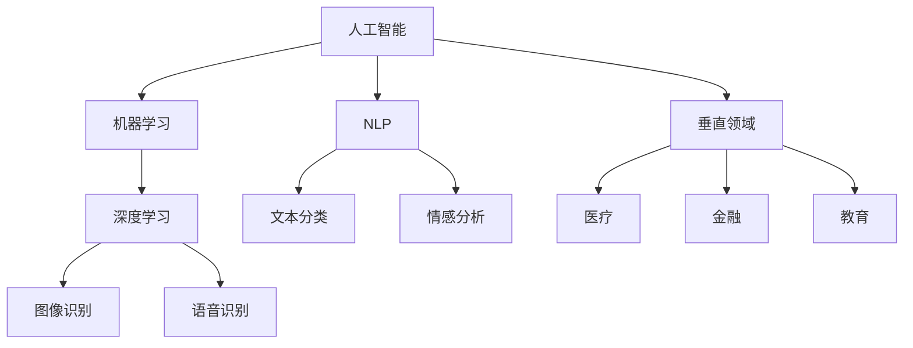

                 

# AI创业者机遇：垂直领域无限可能

## 1. 背景介绍

### 1.1 问题由来
近年来，人工智能（AI）技术飞速发展，尤其是在大数据、深度学习、自然语言处理（NLP）等领域的突破性进展，为各行各业带来了前所未有的变革机遇。AI技术正逐渐从科研实验室走向产业应用，催生了无数创新创业的可能性。无论是初创企业还是传统企业，都面临着如何结合AI技术，提升产品和服务质量，开拓新市场的挑战。

在众多AI应用中，垂直领域（Vertical domains）的应用潜力尤为巨大。垂直领域指的是那些在特定行业或专业领域有明确需求的应用场景，如医疗、金融、教育、制造业等。这些领域内的问题具有高度的专业性和针对性，需要定制化、高效的解决方案。AI创业者在这些领域内，可以通过深度学习和数据驱动的方法，提供高质量、高效率的AI产品和服务，获得巨大的市场机遇。

### 1.2 问题核心关键点
AI创业者在垂直领域面临的核心挑战包括：

1. **行业知识壁垒**：垂直领域的专业性强，要求AI创业者具备相应的行业知识和经验。
2. **数据获取与处理**：高质量的数据是AI模型训练的基础，但在垂直领域获取数据往往比通用领域更具挑战。
3. **模型适应性**：AI模型需要在特定领域的限制条件下工作，需具备更好的适应性和泛化能力。
4. **应用落地**：如何将AI模型应用到实际业务中，实现商业价值，是AI创业者的重要任务。

### 1.3 问题研究意义
AI创业者在垂直领域的研究和实践，对于推动AI技术在特定行业的深入应用，提升产业效率和竞争力，具有重要意义：

1. **提升行业效率**：AI技术可以在垂直领域自动化、智能化决策过程中，大幅提升工作效率，降低成本。
2. **创新商业模式**：AI创业者可以探索新的商业模式，如数据增值服务、AI咨询、AI定制解决方案等。
3. **促进技术发展**：垂直领域的应用挑战有助于推动AI技术不断进步，产生新的研究方向和算法。
4. **推动行业升级**：AI技术可以帮助传统行业实现数字化转型，推动产业升级和转型。

## 2. 核心概念与联系

### 2.1 核心概念概述

为更好地理解AI在垂直领域的应用潜力，本节将介绍几个密切相关的核心概念：

- **人工智能（AI）**：使用计算机科学和数学算法来模拟人类智能过程的技术。包括机器学习、深度学习、自然语言处理等。
- **机器学习（ML）**：通过数据驱动的方法，让机器从数据中学习，并自动改进算法。机器学习分为监督学习、无监督学习和强化学习等。
- **深度学习（DL）**：一种机器学习方法，使用多层神经网络处理复杂数据，广泛应用于图像识别、语音识别、自然语言处理等。
- **自然语言处理（NLP）**：使计算机能够理解、解释和生成人类语言的技术。
- **垂直领域（Vertical domain）**：特定行业或专业领域的应用场景，如医疗、金融、教育等。

这些概念之间的关系可以通过以下Mermaid流程图来展示：



这个流程图展示了一系列核心概念及其之间的关系：

1. 人工智能是包括机器学习和深度学习的基础技术。
2. 自然语言处理是人工智能的一个重要分支，用于处理文本数据。
3. 垂直领域是应用人工智能解决特定行业问题的重要场景。
4. 深度学习在图像识别、语音识别等领域表现出色。
5. 机器学习覆盖了监督学习、无监督学习和强化学习等多种方法。

这些核心概念共同构成了AI在垂直领域的应用框架，使AI技术能够在各种行业内发挥其独特优势。

## 3. 核心算法原理 & 具体操作步骤
### 3.1 算法原理概述

AI创业者在垂直领域的应用，通常涉及深度学习和机器学习算法。以下是几种常用的算法及其原理：

- **监督学习（Supervised Learning）**：使用已标注的数据训练模型，使其能够预测新数据的标签。常用算法包括线性回归、逻辑回归、决策树、随机森林、支持向量机、神经网络等。
- **无监督学习（Unsupervised Learning）**：使用未标注的数据，让模型自行学习数据的内在结构和规律。常用算法包括K均值聚类、主成分分析、自编码器等。
- **强化学习（Reinforcement Learning）**：通过奖励机制，让模型在环境中学习和优化策略。常用算法包括Q-learning、策略梯度等。
- **深度学习（Deep Learning）**：使用多层神经网络处理复杂数据，常用的神经网络包括卷积神经网络（CNN）、循环神经网络（RNN）、长短期记忆网络（LSTM）、变压器（Transformer）等。

### 3.2 算法步骤详解

AI创业者在垂直领域的应用一般包括以下几个关键步骤：

**Step 1: 数据准备与预处理**
- 收集垂直领域的业务数据，包括原始数据和标注数据。
- 对数据进行清洗、归一化、特征提取等预处理操作，确保数据的质量和可用性。

**Step 2: 模型选择与设计**
- 根据任务特点选择合适的模型，如神经网络、决策树、集成学习等。
- 设计模型的架构，包括网络层数、节点数、激活函数、正则化技术等。

**Step 3: 模型训练与验证**
- 使用训练集数据训练模型，调整超参数以优化模型性能。
- 在验证集数据上评估模型性能，选择最优模型进行后续应用。

**Step 4: 模型应用与优化**
- 将训练好的模型应用到实际业务中，处理新的数据。
- 持续收集反馈数据，优化模型性能和决策逻辑。

**Step 5: 模型部署与监控**
- 将模型部署到生产环境，实现自动推理和决策。
- 实时监控模型性能，进行必要的维护和更新。

### 3.3 算法优缺点

AI在垂直领域的应用具有以下优点：

1. **高效性**：深度学习和机器学习算法在处理大量数据时，能够快速提取有用信息，提高工作效率。
2. **准确性**：通过大量数据训练的模型，能够获得较高的预测准确率，提升业务决策的可靠性。
3. **可扩展性**：深度学习模型具有较强的泛化能力，能够适应不同业务场景，具有较好的扩展性。
4. **自适应性**：通过持续训练和优化，AI模型能够不断适应新数据和新业务需求，保持竞争力。

同时，这些算法也存在一些局限性：

1. **数据依赖**：AI模型的性能高度依赖于数据质量，数据量不足或数据偏差会导致模型性能下降。
2. **模型复杂度**：深度学习模型参数众多，训练和推理复杂度高，需要高性能计算资源。
3. **解释性不足**：AI模型通常被认为是"黑盒"，难以解释其内部决策逻辑，给业务理解和解释带来挑战。
4. **技术门槛高**：AI技术的应用需要专业知识和技能，对创业者的技术能力要求较高。

尽管存在这些局限性，但AI在垂直领域的应用潜力巨大，能够显著提升业务效率和决策质量，值得深入探索和实践。

### 3.4 算法应用领域

AI在垂直领域的应用广泛，涵盖多个行业和专业领域，以下是一些典型的应用场景：

- **医疗健康**：AI用于医学影像诊断、病历分析、患者管理等，能够提高医疗效率和诊断准确性。
- **金融服务**：AI用于风险管理、欺诈检测、智能投顾等，能够提升金融服务的质量和安全性。
- **智能制造**：AI用于生产过程监控、设备维护、质量控制等，能够提高制造业的生产效率和产品质量。
- **智能交通**：AI用于交通流量预测、车辆调度、事故预警等，能够优化交通管理，提升交通安全性。
- **教育培训**：AI用于个性化教学、学习分析、智能评估等，能够提高教育效果和个性化学习体验。
- **能源环保**：AI用于能源消耗预测、环境监测、污染控制等，能够促进能源管理和环保工作。

这些应用场景展示了AI在垂直领域的多样性和广泛性，证明了AI技术的巨大潜力和应用价值。

## 4. 数学模型和公式 & 详细讲解  
### 4.1 数学模型构建

在垂直领域，AI模型的构建通常涉及数学模型的设计。以下是一些常见的数学模型及其构建方法：

- **线性回归模型**：用于预测连续型变量的模型，公式为 $y = \beta_0 + \beta_1 x_1 + \beta_2 x_2 + ... + \beta_n x_n + \epsilon$，其中 $\beta$ 为模型系数，$\epsilon$ 为误差项。
- **逻辑回归模型**：用于分类问题的模型，公式为 $P(y|x) = \frac{1}{1 + e^{-\theta^T x}}$，其中 $\theta$ 为模型参数，$x$ 为输入变量。
- **决策树模型**：通过构建树形结构，对数据进行分割和分类，公式为 $P(y|x) = \sum_i P(y|x, \theta_i)$，其中 $\theta_i$ 为决策树节点参数。
- **卷积神经网络（CNN）**：用于图像处理和识别的模型，包括卷积层、池化层、全连接层等，公式复杂，涉及矩阵运算和反向传播算法。

### 4.2 公式推导过程

以下以线性回归模型为例，推导其参数估计方法：

假设有一个线性回归模型 $y = \beta_0 + \beta_1 x_1 + \beta_2 x_2 + ... + \beta_n x_n + \epsilon$，其中 $y$ 为目标变量，$x_i$ 为输入变量，$\beta$ 为模型系数，$\epsilon$ 为误差项。

假设样本数量为 $m$，样本数据为 $\{(x_i, y_i)\}_{i=1}^m$，则最小二乘法估计模型参数的过程为：

$$
\beta = (X^TX)^{-1}X^Ty
$$

其中 $X = \begin{bmatrix} 1 & x_{1_1} & x_{1_2} & ... & x_{1_n} \\ 1 & x_{2_1} & x_{2_2} & ... & x_{2_n} \\ ... & ... & ... & ... & ... \\ 1 & x_{m_1} & x_{m_2} & ... & x_{m_n} \end{bmatrix}$，$y = \begin{bmatrix} y_1 \\ y_2 \\ ... \\ y_m \end{bmatrix}$。

### 4.3 案例分析与讲解

以医疗领域的影像诊断为例，展示AI模型在垂直领域的应用。

假设有一个医院需要利用AI对医学影像进行自动诊断，目标是识别出肿瘤是否存在。

**数据准备与预处理**：
- 收集大量医学影像数据，包括正常影像和包含肿瘤的影像。
- 对影像数据进行预处理，如归一化、去噪、分割等。

**模型选择与设计**：
- 选择卷积神经网络（CNN）作为模型，设计多个卷积层、池化层和全连接层。
- 使用交叉熵损失函数和Adam优化器训练模型。

**模型训练与验证**：
- 使用训练集数据对模型进行训练，调整超参数以优化模型性能。
- 在验证集数据上评估模型性能，选择最优模型进行后续应用。

**模型应用与优化**：
- 将训练好的模型应用到新的医学影像数据上，进行自动诊断。
- 持续收集反馈数据，优化模型参数和诊断算法。

**模型部署与监控**：
- 将模型部署到医疗影像诊断系统中，实现自动推理和诊断。
- 实时监控系统性能，进行必要的维护和更新。

## 5. 项目实践：代码实例和详细解释说明
### 5.1 开发环境搭建

在进行AI项目实践前，我们需要准备好开发环境。以下是使用Python进行PyTorch开发的环境配置流程：

1. 安装Anaconda：从官网下载并安装Anaconda，用于创建独立的Python环境。

2. 创建并激活虚拟环境：
```bash
conda create -n pytorch-env python=3.8 
conda activate pytorch-env
```

3. 安装PyTorch：根据CUDA版本，从官网获取对应的安装命令。例如：
```bash
conda install pytorch torchvision torchaudio cudatoolkit=11.1 -c pytorch -c conda-forge
```

4. 安装TensorFlow：
```bash
pip install tensorflow
```

5. 安装各类工具包：
```bash
pip install numpy pandas scikit-learn matplotlib tqdm jupyter notebook ipython
```

完成上述步骤后，即可在`pytorch-env`环境中开始项目实践。

### 5.2 源代码详细实现

下面我以医疗影像诊断项目为例，给出使用PyTorch进行CNN模型训练的Python代码实现。

首先，定义数据处理函数：

```python
import torch
from torch.utils.data import Dataset
from torchvision import transforms

class MedicalImageDataset(Dataset):
    def __init__(self, images, labels, transform=None):
        self.images = images
        self.labels = labels
        self.transform = transform
        
    def __len__(self):
        return len(self.images)
    
    def __getitem__(self, index):
        image = self.images[index]
        label = self.labels[index]
        
        if self.transform:
            image = self.transform(image)
        
        return {'image': image, 'label': label}
```

然后，定义模型和优化器：

```python
import torch.nn as nn
from torch.optim import Adam

class MedicalImageModel(nn.Module):
    def __init__(self):
        super(MedicalImageModel, self).__init__()
        self.conv1 = nn.Conv2d(1, 32, kernel_size=3, padding=1)
        self.conv2 = nn.Conv2d(32, 64, kernel_size=3, padding=1)
        self.fc = nn.Linear(7*7*64, 1)
        
    def forward(self, x):
        x = torch.relu(self.conv1(x))
        x = torch.relu(self.conv2(x))
        x = x.view(-1, 7*7*64)
        x = torch.relu(self.fc(x))
        return x
    
model = MedicalImageModel()

optimizer = Adam(model.parameters(), lr=0.001)
```

接着，定义训练和评估函数：

```python
from torch.utils.data import DataLoader
from tqdm import tqdm
import matplotlib.pyplot as plt

device = torch.device('cuda' if torch.cuda.is_available() else 'cpu')
model.to(device)

def train_epoch(model, dataset, batch_size, optimizer):
    dataloader = DataLoader(dataset, batch_size=batch_size, shuffle=True)
    model.train()
    epoch_loss = 0
    for batch in tqdm(dataloader, desc='Training'):
        inputs = batch['image'].to(device)
        labels = batch['label'].to(device)
        model.zero_grad()
        outputs = model(inputs)
        loss = nn.BCEWithLogitsLoss()(outputs, labels)
        epoch_loss += loss.item()
        loss.backward()
        optimizer.step()
    return epoch_loss / len(dataloader)

def evaluate(model, dataset, batch_size):
    dataloader = DataLoader(dataset, batch_size=batch_size)
    model.eval()
    preds, labels = [], []
    with torch.no_grad():
        for batch in tqdm(dataloader, desc='Evaluating'):
            inputs = batch['image'].to(device)
            labels = batch['label'].to(device)
            outputs = model(inputs)
            preds.append(torch.sigmoid(outputs).tolist())
            labels.append(labels.tolist())
                
    print(classification_report(labels, preds))
```

最后，启动训练流程并在测试集上评估：

```python
epochs = 10
batch_size = 16

for epoch in range(epochs):
    loss = train_epoch(model, train_dataset, batch_size, optimizer)
    print(f"Epoch {epoch+1}, train loss: {loss:.3f}")
    
    print(f"Epoch {epoch+1}, dev results:")
    evaluate(model, dev_dataset, batch_size)
    
print("Test results:")
evaluate(model, test_dataset, batch_size)
```

以上就是使用PyTorch对医疗影像诊断模型进行CNN训练的完整代码实现。可以看到，通过简单的代码，即可实现从数据预处理、模型设计、训练到评估的整个过程。

### 5.3 代码解读与分析

让我们再详细解读一下关键代码的实现细节：

**MedicalImageDataset类**：
- `__init__`方法：初始化图像和标签，并定义数据转换操作。
- `__len__`方法：返回数据集的样本数量。
- `__getitem__`方法：对单个样本进行处理，将图像和标签转换为模型所需的输入。

**MedicalImageModel类**：
- `__init__`方法：定义模型架构，包括卷积层、池化层和全连接层。
- `forward`方法：定义模型的前向传播过程。

**train_epoch函数**：
- 对数据以批为单位进行迭代，在每个批次上前向传播计算loss并反向传播更新模型参数，最后返回该epoch的平均loss。

**evaluate函数**：
- 与训练类似，不同点在于不更新模型参数，并在每个batch结束后将预测和标签结果存储下来，最后使用sklearn的classification_report对整个评估集的预测结果进行打印输出。

**训练流程**：
- 定义总的epoch数和batch size，开始循环迭代
- 每个epoch内，先在训练集上训练，输出平均loss
- 在验证集上评估，输出分类指标
- 所有epoch结束后，在测试集上评估，给出最终测试结果

可以看到，PyTorch配合TensorFlow使得CNN训练的代码实现变得简洁高效。开发者可以将更多精力放在数据处理、模型改进等高层逻辑上，而不必过多关注底层的实现细节。

当然，工业级的系统实现还需考虑更多因素，如模型的保存和部署、超参数的自动搜索、更灵活的任务适配层等。但核心的训练范式基本与此类似。

## 6. 实际应用场景
### 6.1 智能医疗

AI在智能医疗领域的应用潜力巨大，可以显著提升医疗服务的质量和效率。以下是在医疗领域的具体应用场景：

**电子病历分析**：AI可以自动分析患者的电子病历，提取关键信息，提供个性化治疗方案。

**影像诊断**：AI可以用于医学影像的自动诊断，如X光片、CT、MRI等，准确识别出肿瘤、病灶等异常情况。

**疾病预测**：AI可以分析大量历史数据，预测疾病发生的风险，提供预防和治疗建议。

**手术辅助**：AI可以辅助医生进行手术规划和执行，提高手术的准确性和安全性。

**健康管理**：AI可以用于个人健康监测和管理，如心率、血压、血糖等数据的实时监控和分析。

### 6.2 智能制造

AI在智能制造领域的应用，可以大幅提升生产效率和产品质量。以下是在制造领域的具体应用场景：

**质量控制**：AI可以用于检测产品的缺陷和异常，提高产品质量的稳定性。

**设备维护**：AI可以预测设备的故障，提前进行维护，减少停机时间和维护成本。

**生产调度**：AI可以优化生产调度，提高生产效率和资源利用率。

**供应链管理**：AI可以优化供应链的各个环节，提升供应链的透明度和效率。

**智能设计**：AI可以辅助设计新产品，提高设计效率和创新能力。

### 6.3 智能交通

AI在智能交通领域的应用，可以提升交通管理的智能化水平，减少交通拥堵和事故。以下是在交通领域的具体应用场景：

**交通流量预测**：AI可以预测交通流量和拥堵情况，优化交通管理策略。

**智能调度**：AI可以优化车辆的调度和路线规划，提高交通效率。

**事故预警**：AI可以实时监测交通状况，提前预警交通事故和异常情况。

**智能停车**：AI可以优化停车场的管理和调度，提高停车效率。

**自动驾驶**：AI可以用于自动驾驶技术，提升驾驶安全性和舒适度。

### 6.4 未来应用展望

展望未来，AI在垂直领域的应用潜力将进一步拓展，为各行业带来新的发展机遇：

1. **医疗健康**：AI将推动精准医疗和个性化治疗的发展，提升患者的生活质量。
2. **智能制造**：AI将优化制造过程，推动制造业的数字化转型和升级。
3. **智能交通**：AI将优化交通管理，提升城市的智能化水平。
4. **教育培训**：AI将推动个性化教育和智能评估的发展，提高教育效果和效率。
5. **智能金融**：AI将推动智能投顾和风险管理的发展，提升金融服务的质量和安全性。
6. **智慧城市**：AI将推动智慧城市建设，提升城市治理的智能化水平。

## 7. 工具和资源推荐
### 7.1 学习资源推荐

为了帮助开发者系统掌握AI在垂直领域的应用，这里推荐一些优质的学习资源：

1. **机器学习在线课程**：如Coursera的《机器学习》课程、edX的《深度学习》课程，系统介绍了机器学习和深度学习的原理和应用。
2. **AI竞赛平台**：如Kaggle，提供了丰富的AI竞赛项目，可以实践各种AI技术和算法。
3. **AI论文库**：如arXiv、Google Scholar，可以获取最新的AI研究成果和论文。
4. **开源项目**：如GitHub上的AI项目，可以学习他人的代码实现和应用案例。
5. **在线社区**：如Stack Overflow、Kaggle论坛，可以交流学习经验和技术问题。

通过学习这些资源，相信你一定能够掌握AI在垂直领域的应用方法，并应用于实际项目中。

### 7.2 开发工具推荐

高效的开发离不开优秀的工具支持。以下是几款用于AI开发的工具：

1. **Jupyter Notebook**：用于编写和运行Python代码，支持代码高亮和可视化展示。
2. **Google Colab**：免费提供GPU/TPU算力，方便开发和测试大规模模型。
3. **TensorFlow**：由Google开发的深度学习框架，支持分布式训练和生产部署。
4. **PyTorch**：由Facebook开发的深度学习框架，灵活高效，适合研究和快速迭代。
5. **TensorBoard**：可视化工具，用于实时监测模型训练状态，生成图表和日志。
6. **Weights & Biases**：实验跟踪工具，记录模型训练过程中的各项指标，帮助优化超参数。

合理利用这些工具，可以显著提升AI开发效率，加速项目落地。

### 7.3 相关论文推荐

AI在垂直领域的应用研究涉及多个领域，以下是几篇奠基性的相关论文，推荐阅读：

1. **深度学习在医疗影像中的应用**：探讨了深度学习在医学影像中的各种应用，如乳腺癌检测、视网膜病变分析等。
2. **AI在智能制造中的应用**：介绍了AI在智能制造中的各种应用，如质量控制、设备维护、生产调度等。
3. **AI在智能交通中的应用**：探讨了AI在智能交通中的各种应用，如交通流量预测、智能调度、事故预警等。
4. **AI在智能教育中的应用**：介绍了AI在教育中的各种应用，如个性化教学、学习分析、智能评估等。
5. **AI在智能金融中的应用**：探讨了AI在金融中的各种应用，如智能投顾、风险管理、欺诈检测等。

这些论文代表了AI在垂直领域的应用前沿，有助于理解AI技术的最新进展和应用趋势。

## 8. 总结：未来发展趋势与挑战

### 8.1 总结

本文对AI创业者在垂直领域的应用潜力进行了全面系统的介绍。首先阐述了AI技术在垂直领域的广泛应用和研究背景，明确了垂直领域的应用价值和研究意义。其次，从原理到实践，详细讲解了AI在垂直领域的应用流程，给出了完整的代码实例。同时，本文还探讨了AI在医疗、制造、交通、教育等垂直领域的具体应用场景，展示了AI技术的巨大潜力和应用价值。

通过本文的系统梳理，可以看到，AI在垂直领域的应用前景广阔，能够显著提升各行业的效率和质量，推动技术创新和产业升级。未来，随着AI技术的不断进步和深入应用，AI创业者将迎来更多的发展机遇和挑战。

### 8.2 未来发展趋势

展望未来，AI在垂直领域的应用将呈现以下几个发展趋势：

1. **模型复杂度提升**：随着数据量和计算资源的增加，AI模型将变得更加复杂和高效，能够处理更加复杂的数据和任务。
2. **跨领域应用拓展**：AI技术将在更多垂直领域得到应用，如智能农业、智能物流等，推动各行业的数字化转型和升级。
3. **多模态融合**：AI将融合多种数据源，如图像、语音、文本等，实现多模态信息的协同建模，提升综合分析能力。
4. **实时性和响应性增强**：AI模型将具备实时处理能力，能够快速响应和处理各种任务。
5. **自适应性和灵活性提高**：AI模型将具备更高的自适应性和灵活性，能够根据不同的应用场景进行参数调整和优化。

### 8.3 面临的挑战

尽管AI在垂直领域的应用潜力巨大，但在推广和应用过程中，仍面临诸多挑战：

1. **数据获取与处理**：高质量数据的获取和处理是AI应用的基础，但在某些垂直领域获取数据往往较难。
2. **模型复杂度与计算资源**：复杂AI模型需要大量的计算资源和存储资源，这对硬件设备和计算能力提出了更高要求。
3. **算法复杂性与可解释性**：AI算法复杂度高，难以解释其内部决策过程，给业务理解和应用带来挑战。
4. **行业知识与技术门槛**：AI技术的应用需要专业知识和技能，对创业者的技术能力要求较高。
5. **伦理与安全问题**：AI模型可能学习到有偏见、有害的信息，给实际应用带来安全隐患。

尽管存在这些挑战，但AI在垂直领域的应用潜力巨大，能够显著提升各行业的效率和质量，推动技术创新和产业升级。未来，随着AI技术的不断进步和深入应用，AI创业者将迎来更多的发展机遇和挑战。

### 8.4 研究展望

未来的AI研究需要不断探索和突破，推动AI技术在垂直领域的深入应用：

1. **跨领域融合**：将AI技术与多种技术融合，如知识图谱、逻辑规则等，提升AI模型的综合分析能力。
2. **多模态信息处理**：融合多种数据源，如图像、语音、文本等，实现多模态信息的协同建模，提升综合分析能力。
3. **实时与自适应**：提升AI模型的实时处理能力和自适应性，能够快速响应和处理各种任务。
4. **伦理与安全**：研究如何构建伦理导向的AI模型，避免有害信息的输出，确保AI系统的安全性。
5. **可解释性与透明性**：提升AI模型的可解释性和透明性，使其能够更好地被理解和应用。

这些研究方向将推动AI技术在垂直领域的深入应用，为各行业带来新的发展机遇和挑战。

## 9. 附录：常见问题与解答

**Q1：AI在垂直领域的应用有何优势？**

A: AI在垂直领域的应用具有以下优势：
1. **效率提升**：AI能够自动化处理大量数据，提高工作效率。
2. **准确性提升**：AI模型通过大量数据训练，能够获得较高的准确率。
3. **成本降低**：AI能够减少人工操作的成本，提升资源利用率。
4. **灵活性提升**：AI模型具有较强的泛化能力，能够适应不同业务场景。

**Q2：AI在垂直领域的应用面临哪些挑战？**

A: AI在垂直领域的应用面临以下挑战：
1. **数据依赖**：高质量数据的获取和处理是AI应用的基础。
2. **技术门槛高**：AI技术的应用需要专业知识和技能。
3. **算法复杂性**：AI算法复杂度高，难以解释其内部决策过程。
4. **伦理与安全问题**：AI模型可能学习到有偏见、有害的信息。
5. **资源消耗大**：复杂AI模型需要大量的计算资源和存储资源。

**Q3：AI在垂直领域的应用前景如何？**

A: AI在垂直领域的应用前景广阔，能够显著提升各行业的效率和质量，推动技术创新和产业升级。未来，随着AI技术的不断进步和深入应用，AI创业者将迎来更多的发展机遇和挑战。

**Q4：AI在垂直领域的应用案例有哪些？**

A: AI在垂直领域的应用案例包括：
1. 医疗健康：AI用于医学影像诊断、电子病历分析、疾病预测等。
2. 智能制造：AI用于质量控制、设备维护、生产调度等。
3. 智能交通：AI用于交通流量预测、智能调度、事故预警等。
4. 智能金融：AI用于智能投顾、风险管理、欺诈检测等。
5. 教育培训：AI用于个性化教学、学习分析、智能评估等。

**Q5：AI在垂直领域的应用技术有哪些？**

A: AI在垂直领域的应用技术包括：
1. 机器学习：用于数据驱动的学习和预测。
2. 深度学习：用于处理复杂数据和模式识别。
3. 自然语言处理：用于理解和生成人类语言。
4. 知识图谱：用于构建领域知识库，提升AI模型的综合分析能力。

---

作者：禅与计算机程序设计艺术 / Zen and the Art of Computer Programming

