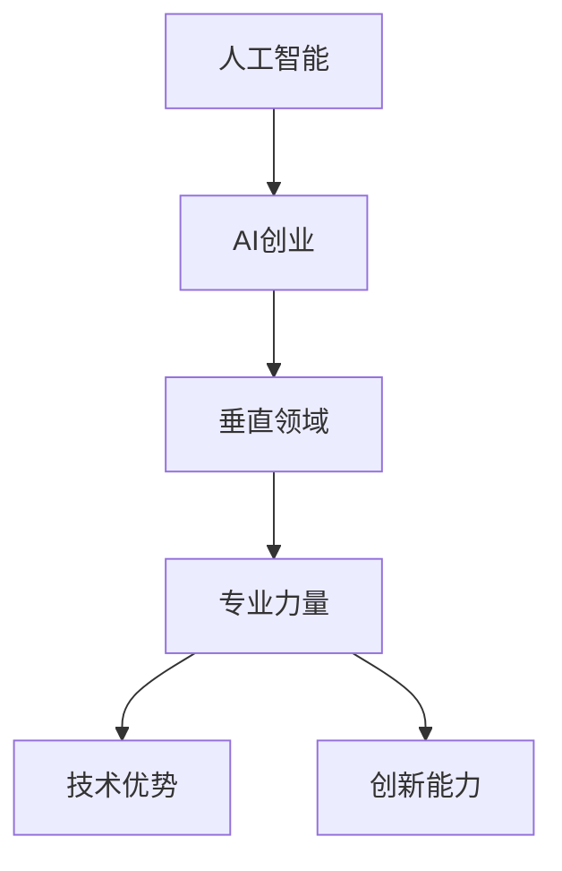

                 

# AI创业者的优势：垂直领域的专业力量

> 关键词：人工智能,创业,垂直领域,专业力量,技术优势,创新能力

## 1. 背景介绍

### 1.1 问题由来

近年来，人工智能（AI）技术迅猛发展，引领了新一轮的科技革命和产业变革。从语音识别到图像处理，从自然语言处理到自动驾驶，AI技术的广泛应用正在改变着人们的生活方式。然而，在AI创业的浪潮中，许多人面临着一个共同的问题：如何在庞大的AI市场中脱颖而出？

AI创业的竞争激烈，技术要求高，创新难度大。如何在激烈的市场竞争中站稳脚跟，实现可持续发展，成为每一位AI创业者都需要深入思考的问题。本文将从AI创业者的角度出发，探讨垂直领域的专业力量如何成为创业者的核心竞争力。

### 1.2 问题核心关键点

AI创业的关键在于垂直领域的专业力量。在当前AI市场竞争激烈的背景下，技术实力、市场敏锐度和团队协作能力是创业成功的三个关键要素。垂直领域的专业力量，即在某一特定领域内具备深入的技术积累和行业洞察，是AI创业者的优势所在。

专业力量不仅包括技术实力，还包括对行业需求、市场动态和用户心理的深刻理解。这种垂直领域的专业力量，使创业者能够在激烈的市场竞争中，迅速找到切入点，实现技术创新和产品迭代，最终取得商业成功。

## 2. 核心概念与联系

### 2.1 核心概念概述

为更好地理解垂直领域的专业力量，本节将介绍几个密切相关的核心概念：

- **人工智能**：通过计算机模拟人类智能行为的技术，涵盖机器学习、深度学习、自然语言处理、计算机视觉等多个领域。
- **AI创业**：利用AI技术进行产品创新和商业模式创新的创业活动。
- **垂直领域**：指某个具体的行业或技术方向，如医疗、教育、金融、自动驾驶等。
- **专业力量**：指在某一特定领域内具备深入的技术积累和行业洞察。
- **技术优势**：指在技术实现上的独特性、创新性和领先性。
- **创新能力**：指在产品创新和商业模式创新上的快速反应和灵活调整。

这些核心概念之间的逻辑关系可以通过以下Mermaid流程图来展示：



这个流程图展示出人工智能、AI创业、垂直领域、专业力量、技术优势和创新能力之间的逻辑关系：

1. AI创业是以人工智能技术为核心进行产品创新和商业模式创新的活动。
2. 垂直领域是指具体的行业或技术方向。
3. 专业力量是在某一垂直领域内具备深入的技术积累和行业洞察。
4. 技术优势是在技术实现上的独特性、创新性和领先性。
5. 创新能力是在产品创新和商业模式创新上的快速反应和灵活调整。

这些概念共同构成了AI创业的基础框架，使AI创业者能够在特定领域内实现技术突破和商业成功。

## 3. 核心算法原理 & 具体操作步骤

### 3.1 算法原理概述

垂直领域的专业力量，是指在某一特定领域内，具备深入的技术积累和行业洞察。这种专业力量的核心在于对领域内核心问题的深刻理解和解决能力。具体而言，AI创业者需要具备以下三个方面的专业力量：

1. **技术实力**：在特定领域内，具备对核心技术的深入理解和实现能力，能够解决领域内关键问题。
2. **行业洞察**：对领域内用户需求、市场动态和竞争态势有深刻的理解和预判能力，能够快速反应并调整产品策略。
3. **团队协作**：组建一支具有多元化背景、跨学科能力的团队，能够协同作战，实现技术创新和产品迭代。

### 3.2 算法步骤详解

基于垂直领域的专业力量，AI创业者的操作步骤可以分为以下几个关键环节：

**Step 1: 市场调研与需求分析**

- 通过深度访谈、问卷调查、市场分析等方式，深入了解目标用户的需求和痛点。
- 收集目标市场的竞争态势和行业趋势，分析市场机会与挑战。

**Step 2: 技术选型与方案设计**

- 根据市场需求和技术趋势，选择合适的AI技术方案，如机器学习、深度学习、自然语言处理等。
- 设计技术实现方案，考虑算法的可行性、效率和可扩展性。

**Step 3: 核心算法开发与模型训练**

- 开发核心算法，实现技术方案，如特征提取、模型训练、优化等。
- 使用大量标注数据进行模型训练，优化算法性能。

**Step 4: 产品迭代与用户验证**

- 将技术方案应用到产品原型中，进行初步测试和用户验证。
- 根据用户反馈和测试结果，进行产品迭代和优化，提升用户体验。

**Step 5: 市场推广与商业化**

- 通过市场推广活动，提升产品知名度和用户认知度。
- 制定商业化策略，实现产品商业价值，获取市场收益。

### 3.3 算法优缺点

垂直领域的专业力量在AI创业中具有以下优点：

1. **高效精准**：垂直领域的专业力量使创业者能够快速找到市场切入点，精准解决用户需求。
2. **技术创新**：具备专业实力的团队更容易实现技术突破，提升产品竞争力。
3. **市场敏锐**：深入了解行业动态，能够快速反应市场变化，灵活调整产品策略。

同时，这种专业力量也存在一定的局限性：

1. **资源投入大**：在特定领域内深入技术积累和行业洞察需要大量时间和资源投入。
2. **风险高**：市场变化迅速，对特定领域的深入理解和快速反应容易陷入误区。
3. **团队协作难**：跨学科团队合作需要协调和沟通，可能面临团队协作问题。

尽管存在这些局限性，但专业力量依然是AI创业者在特定领域内取得成功的关键所在。

### 3.4 算法应用领域

基于垂直领域的专业力量，AI创业者在多个领域中取得了显著的成果。以下列举几个典型的应用领域：

1. **医疗健康**：AI创业者利用医疗影像、电子病历等数据，开发出智能诊断、个性化治疗等创新产品。
2. **金融科技**：通过大数据分析和机器学习，实现智能风控、智能投顾等功能，提升金融服务效率。
3. **教育科技**：利用自然语言处理和机器学习，开发出智能推荐、智能答疑等教育产品，改善学习体验。
4. **自动驾驶**：通过计算机视觉和深度学习，实现自动驾驶技术，提升交通出行效率和安全性。
5. **智能制造**：利用AI技术优化生产流程，实现智能检测、智能调度等功能，提升制造业效率和质量。

这些领域中的AI创业者，通过在特定领域内深入积累技术实力和行业洞察，成功地开发出了一系列创新产品，并在市场中取得了显著的商业成功。

## 4. 数学模型和公式 & 详细讲解  
### 4.1 数学模型构建

在本节中，我们将通过一个具体的案例，展示AI创业者如何在垂直领域内利用专业力量实现技术突破。

假设我们要在医疗健康领域开发一款智能诊断系统。该系统的目标是利用医疗影像数据，实现疾病的精准诊断。我们需要构建一个深度学习模型，通过医疗影像数据进行训练，实现对疾病的准确预测。

我们设模型参数为 $\theta$，输入为医疗影像数据 $x$，输出为疾病预测结果 $y$。模型的损失函数为交叉熵损失函数：

$$
L(\theta) = -\frac{1}{N}\sum_{i=1}^N(y_i \log \hat{y}_i + (1-y_i)\log(1-\hat{y}_i))
$$

其中 $N$ 为样本数量，$y_i$ 为真实标签，$\hat{y}_i$ 为模型预测结果。

### 4.2 公式推导过程

接下来，我们将详细推导模型的训练过程。

1. **数据准备**：准备医疗影像数据集 $D=\{(x_i, y_i)\}_{i=1}^N$，划分为训练集、验证集和测试集。
2. **模型初始化**：将模型参数 $\theta$ 初始化为随机值。
3. **前向传播**：将输入数据 $x$ 输入模型，计算预测结果 $\hat{y}$。
4. **计算损失**：根据真实标签 $y$ 和预测结果 $\hat{y}$，计算交叉熵损失 $L(\theta)$。
5. **反向传播**：计算损失函数对模型参数的梯度 $\nabla_{\theta}L(\theta)$。
6. **参数更新**：根据梯度下降算法，更新模型参数 $\theta$：

$$
\theta \leftarrow \theta - \eta \nabla_{\theta}L(\theta)
$$

其中 $\eta$ 为学习率。

7. **迭代训练**：重复上述步骤，直到模型收敛。

### 4.3 案例分析与讲解

在这个案例中，AI创业者需要在医疗影像数据上进行模型训练，实现疾病的精准诊断。

**Step 1: 数据准备**
- 收集医疗影像数据集，进行预处理和标注，划分为训练集、验证集和测试集。
- 验证集用于模型调参和选择最优模型，测试集用于评估模型性能。

**Step 2: 模型初始化**
- 选择合适的深度学习模型，如卷积神经网络（CNN）。
- 将模型参数 $\theta$ 初始化为随机值，进行模型训练。

**Step 3: 前向传播**
- 将医疗影像数据 $x$ 输入模型，计算预测结果 $\hat{y}$。
- 前向传播过程可以采用TensorFlow或PyTorch等深度学习框架实现。

**Step 4: 计算损失**
- 根据真实标签 $y$ 和预测结果 $\hat{y}$，计算交叉熵损失 $L(\theta)$。
- 使用交叉熵损失函数可以最大化模型预测结果与真实标签的一致性。

**Step 5: 反向传播**
- 计算损失函数对模型参数的梯度 $\nabla_{\theta}L(\theta)$。
- 反向传播过程可以采用TensorFlow或PyTorch等深度学习框架实现。

**Step 6: 参数更新**
- 根据梯度下降算法，更新模型参数 $\theta$。
- 学习率 $\eta$ 的选择和调整是影响模型收敛速度和性能的重要因素。

**Step 7: 迭代训练**
- 重复上述步骤，直到模型收敛。
- 模型收敛的判断标准可以是交叉验证误差或验证集损失。

通过这个过程，AI创业者可以在医疗影像数据上进行模型训练，实现疾病的精准诊断。

## 5. 项目实践：代码实例和详细解释说明
### 5.1 开发环境搭建

在进行项目实践前，我们需要准备好开发环境。以下是使用Python进行PyTorch开发的环境配置流程：

1. 安装Anaconda：从官网下载并安装Anaconda，用于创建独立的Python环境。

2. 创建并激活虚拟环境：
```bash
conda create -n pytorch-env python=3.8 
conda activate pytorch-env
```

3. 安装PyTorch：根据CUDA版本，从官网获取对应的安装命令。例如：
```bash
conda install pytorch torchvision torchaudio cudatoolkit=11.1 -c pytorch -c conda-forge
```

4. 安装TensorFlow：
```bash
pip install tensorflow
```

5. 安装各类工具包：
```bash
pip install numpy pandas scikit-learn matplotlib tqdm jupyter notebook ipython
```

完成上述步骤后，即可在`pytorch-env`环境中开始项目实践。

### 5.2 源代码详细实现

这里我们以医疗影像数据集上的深度学习模型为例，给出使用PyTorch进行模型训练的代码实现。

首先，准备医疗影像数据集：

```python
import os
import numpy as np
import matplotlib.pyplot as plt
import torch
from torch.utils.data import Dataset, DataLoader
from torchvision import transforms

class MedicalImageDataset(Dataset):
    def __init__(self, root, transform=None):
        self.data = []
        for root_dir in os.listdir(root):
            dir_path = os.path.join(root, root_dir)
            for filename in os.listdir(dir_path):
                file_path = os.path.join(dir_path, filename)
                self.data.append(file_path)
        self.transform = transform
        
    def __len__(self):
        return len(self.data)
    
    def __getitem__(self, idx):
        img_path = self.data[idx]
        img = plt.imread(img_path)
        if self.transform:
            img = self.transform(img)
        return img
```

然后，定义模型和优化器：

```python
from torch.nn import Conv2d, MaxPool2d, Flatten, Linear, Softmax
from torch.optim import Adam

class MedicalImageModel(torch.nn.Module):
    def __init__(self):
        super().__init__()
        self.conv1 = Conv2d(3, 64, kernel_size=3, stride=1, padding=1)
        self.maxpool1 = MaxPool2d(kernel_size=2, stride=2)
        self.conv2 = Conv2d(64, 128, kernel_size=3, stride=1, padding=1)
        self.maxpool2 = MaxPool2d(kernel_size=2, stride=2)
        self.flatten = Flatten()
        self.fc1 = Linear(128*7*7, 512)
        self.fc2 = Linear(512, 10)
        self.softmax = Softmax(dim=1)
        
    def forward(self, x):
        x = self.conv1(x)
        x = self.maxpool1(x)
        x = self.conv2(x)
        x = self.maxpool2(x)
        x = self.flatten(x)
        x = self.fc1(x)
        x = self.fc2(x)
        x = self.softmax(x)
        return x

model = MedicalImageModel()

optimizer = Adam(model.parameters(), lr=0.001)
```

接着，定义训练和评估函数：

```python
from torch.utils.data import DataLoader
from sklearn.metrics import classification_report

device = torch.device('cuda') if torch.cuda.is_available() else torch.device('cpu')
model.to(device)

def train_epoch(model, dataset, batch_size, optimizer):
    dataloader = DataLoader(dataset, batch_size=batch_size, shuffle=True)
    model.train()
    epoch_loss = 0
    for batch in dataloader:
        img = batch[0].to(device)
        label = batch[1].to(device)
        model.zero_grad()
        outputs = model(img)
        loss = torch.nn.CrossEntropyLoss()(outputs, label)
        epoch_loss += loss.item()
        loss.backward()
        optimizer.step()
    return epoch_loss / len(dataloader)

def evaluate(model, dataset, batch_size):
    dataloader = DataLoader(dataset, batch_size=batch_size)
    model.eval()
    preds, labels = [], []
    with torch.no_grad():
        for batch in dataloader:
            img = batch[0].to(device)
            label = batch[1]
            outputs = model(img)
            batch_preds = torch.argmax(outputs, dim=1).to('cpu').tolist()
            batch_labels = label.to('cpu').tolist()
            for pred, label in zip(batch_preds, batch_labels):
                preds.append(pred)
                labels.append(label)
    print(classification_report(labels, preds))
```

最后，启动训练流程并在测试集上评估：

```python
epochs = 10
batch_size = 16

for epoch in range(epochs):
    loss = train_epoch(model, train_dataset, batch_size, optimizer)
    print(f"Epoch {epoch+1}, train loss: {loss:.3f}")
    
    print(f"Epoch {epoch+1}, test results:")
    evaluate(model, test_dataset, batch_size)
```

以上就是使用PyTorch进行医疗影像数据集上的深度学习模型训练的完整代码实现。可以看到，得益于PyTorch的强大封装，我们可以用相对简洁的代码完成模型的训练和评估。

### 5.3 代码解读与分析

让我们再详细解读一下关键代码的实现细节：

**MedicalImageDataset类**：
- `__init__`方法：初始化数据集，读取医疗影像文件路径，并使用transform进行预处理。
- `__len__`方法：返回数据集的样本数量。
- `__getitem__`方法：读取单个医疗影像文件，并使用transform进行预处理，返回处理后的图像。

**MedicalImageModel类**：
- `__init__`方法：定义模型的结构，包括卷积层、池化层、全连接层等。
- `forward`方法：定义前向传播过程，输入图像通过多层卷积、池化和全连接层，最终输出疾病预测结果。

**train_epoch函数**：
- 定义模型在训练集上的训练过程，包括前向传播、计算损失、反向传播和参数更新等步骤。

**evaluate函数**：
- 定义模型在测试集上的评估过程，计算分类指标并输出。

**训练流程**：
- 定义总的epoch数和batch size，开始循环迭代
- 每个epoch内，先在训练集上训练，输出平均loss
- 在测试集上评估，输出分类指标
- 所有epoch结束后，输出最终测试结果

可以看出，PyTorch使得深度学习模型的训练和评估过程变得非常简单高效，开发者可以快速迭代和优化模型。

## 6. 实际应用场景

### 6.1 智能健康管理

智能健康管理是一个典型的应用场景，利用AI技术提升健康管理的智能化水平。AI创业者可以通过医疗影像、电子病历等数据，开发智能诊断、个性化治疗等创新产品。

具体而言，可以构建智能诊断系统，利用深度学习模型对医疗影像进行分析和诊断，帮助医生快速做出准确判断。同时，可以开发个性化治疗方案，根据患者的病情和身体数据，提供个性化的治疗建议和治疗方案。

### 6.2 智能金融风控

金融风控是另一个重要的应用场景，利用AI技术提升金融风控的智能化水平。AI创业者可以通过大数据分析和机器学习，实现智能风控、智能投顾等功能，提升金融服务效率。

具体而言，可以构建智能风控系统，利用机器学习模型对客户的信用记录、消费行为等数据进行分析，评估客户的信用风险和违约概率，帮助金融机构进行风险控制。同时，可以开发智能投顾系统，利用机器学习模型对市场数据进行分析和预测，帮助客户做出明智的投资决策。

### 6.3 智能教育培训

智能教育培训是另一个重要的应用场景，利用AI技术提升教育培训的智能化水平。AI创业者可以利用自然语言处理和机器学习，开发智能推荐、智能答疑等教育产品，改善学习体验。

具体而言，可以构建智能推荐系统，根据学生的学习情况和兴趣，推荐个性化的学习内容和资源，提高学习效果。同时，可以开发智能答疑系统，利用自然语言处理技术，回答学生的提问，帮助学生解决学习中的问题。

### 6.4 未来应用展望

随着AI技术的不断发展，垂直领域的专业力量将在更多领域得到应用，为传统行业带来变革性影响。

在智慧医疗领域，基于AI的智能诊断、个性化治疗等应用将提升医疗服务的智能化水平，辅助医生诊疗，加速新药开发进程。在智慧金融领域，利用AI技术进行智能风控、智能投顾等功能，提升金融服务效率。在智慧教育领域，通过AI技术进行智能推荐、智能答疑等应用，改善学习体验。

此外，在智慧制造、智能交通、智能家居等领域，AI技术的应用也将不断涌现，为各行各业带来新的突破和创新。相信伴随着AI技术的持续演进，垂直领域的专业力量将进一步拓展应用边界，为各行各业带来更广阔的发展机遇。

## 7. 工具和资源推荐

### 7.1 学习资源推荐

为了帮助AI创业者系统掌握AI技术，提高市场敏锐度和创新能力，这里推荐一些优质的学习资源：

1. **《机器学习》 by 周志华**：经典机器学习教材，涵盖机器学习基础理论和算法实现。
2. **Coursera《深度学习专项课程》**：斯坦福大学开设的深度学习课程，涵盖深度学习基础和实践。
3. **Kaggle数据科学竞赛平台**：参加数据科学竞赛，提升数据分析和模型训练能力。
4. **GitHub开源项目**：参加开源项目，提升团队协作和代码实现能力。
5. **TED Talks《深度学习》**：了解深度学习前沿技术和应用，拓展思维视野。

通过对这些资源的学习实践，相信AI创业者能够系统掌握AI技术，提高市场敏锐度和创新能力，实现技术突破和商业成功。

### 7.2 开发工具推荐

高效的开发离不开优秀的工具支持。以下是几款用于AI开发的常用工具：

1. **PyTorch**：基于Python的开源深度学习框架，灵活的计算图和自动微分技术，适合快速迭代研究。
2. **TensorFlow**：由Google主导开发的深度学习框架，生产部署方便，适合大规模工程应用。
3. **Jupyter Notebook**：交互式的Python开发环境，支持实时运行代码和展示结果，适合数据处理和模型训练。
4. **Git**：版本控制工具，支持多人协作开发和代码版本管理，适合团队协作。
5. **Docker**：容器化技术，支持快速部署和运行模型，适合生产环境部署。

合理利用这些工具，可以显著提升AI创业者的开发效率，加快技术创新和产品迭代。

### 7.3 相关论文推荐

AI技术的发展离不开学界的持续研究。以下是几篇奠基性的相关论文，推荐阅读：

1. **《深度学习》 by Ian Goodfellow, Yoshua Bengio, Aaron Courville**：深度学习领域的经典教材，涵盖深度学习基础理论和应用。
2. **《机器学习：一种统一框架》 by Peter Flach**：机器学习领域的经典教材，涵盖机器学习基础理论和算法实现。
3. **《Google AI Blog》**：Google AI团队发布的研究论文和技术报告，涵盖深度学习、自然语言处理、计算机视觉等前沿话题。
4. **《Nature Machine Intelligence》**：Nature出版社出版的机器学习领域期刊，涵盖最新的研究成果和应用进展。
5. **《AAAI会议论文集》**：人工智能领域顶级会议，涵盖最新的研究成果和应用进展。

这些论文代表了大规模AI研究的前沿成果，通过学习这些前沿成果，可以帮助AI创业者把握学科前进方向，激发更多的创新灵感。

## 8. 总结：未来发展趋势与挑战

### 8.1 总结

本文对AI创业者的垂直领域专业力量进行了全面系统的介绍。首先阐述了AI创业者在特定领域内深入技术积累和行业洞察的重要性，明确了专业力量在AI创业中的核心竞争力。其次，从原理到实践，详细讲解了垂直领域的专业力量在AI创业中的应用，给出了具体的代码实例和详细解释说明。同时，本文还广泛探讨了专业力量在智能健康、智能金融、智能教育等多个行业领域的应用前景，展示了专业力量范式的广阔前景。此外，本文精选了学习资源、开发工具和相关论文，力求为AI创业者提供全方位的技术指引。

通过本文的系统梳理，可以看到，垂直领域的专业力量使AI创业者能够在特定领域内实现技术突破和商业成功。在激烈的市场竞争中，深入技术积累和行业洞察成为AI创业者的核心竞争力。未来，伴随着AI技术的不断发展，垂直领域的专业力量将在更多领域得到应用，为传统行业带来变革性影响。

### 8.2 未来发展趋势

展望未来，垂直领域的专业力量将在AI创业中呈现以下几个发展趋势：

1. **技术突破加速**：AI技术不断进步，AI创业者将在特定领域内实现更多技术突破，提升产品竞争力。
2. **行业应用拓展**：AI技术的应用范围将不断扩大，涵盖更多行业和应用场景。
3. **市场竞争激烈**：随着AI技术的发展，市场竞争将更加激烈，AI创业者需要不断提升市场敏锐度和创新能力。
4. **跨学科融合**：AI技术与其他学科的融合将更加深入，AI创业者需要具备跨学科的视角和能力。
5. **国际合作加强**：AI技术具有全球性，AI创业者需要加强国际合作，共同推动AI技术的发展。

这些趋势凸显了垂直领域的专业力量在AI创业中的重要性和发展潜力。在未来的AI创业中，深入技术积累和行业洞察将成为实现技术突破和商业成功的关键所在。

### 8.3 面临的挑战

尽管垂直领域的专业力量在AI创业中具有重要性和发展潜力，但在迈向成功的道路上，也面临着诸多挑战：

1. **技术实现难度高**：特定领域的深入技术积累需要大量时间和资源投入，技术实现难度大。
2. **市场变化快**：市场动态变化迅速，对特定领域的深入理解和快速反应容易陷入误区。
3. **资源投入大**：深入技术积累和行业洞察需要大量资源投入，创业成本高。
4. **跨学科协作难**：跨学科团队合作需要协调和沟通，可能面临团队协作问题。
5. **市场竞争激烈**：随着AI技术的不断发展，市场竞争将更加激烈，需要不断提升市场敏锐度和创新能力。

尽管存在这些挑战，但垂直领域的专业力量依然是AI创业者在特定领域内取得成功的关键所在。

### 8.4 研究展望

面对垂直领域的专业力量所面临的挑战，未来的研究需要在以下几个方面寻求新的突破：

1. **跨学科融合**：加强跨学科融合，提升AI创业者的跨学科视角和能力。
2. **数据驱动创新**：利用大数据和人工智能技术，实现基于数据的创新。
3. **国际合作加强**：加强国际合作，共同推动AI技术的发展。
4. **技术应用广泛**：将AI技术应用于更多行业和应用场景，拓展应用范围。
5. **伦理道德约束**：在技术应用中加强伦理道德约束，保障用户权益和数据安全。

这些研究方向的探索，必将引领垂直领域的专业力量迈向更高的台阶，为AI创业者提供更多技术突破和商业成功的机会。面向未来，垂直领域的专业力量将成为AI创业者的核心竞争力，推动AI技术在更多领域实现突破。

## 9. 附录：常见问题与解答

**Q1: AI创业者如何提升自己的市场敏锐度？**

A: AI创业者需要不断关注行业动态和市场需求，参加行业会议、技术论坛和创业峰会，拓展人脉和资源。同时，可以借助市场调研和用户反馈，了解用户需求和痛点，快速反应并调整产品策略。

**Q2: AI创业如何提升技术实力？**

A: AI创业者需要不断学习和掌握最新的AI技术和算法，参加专业培训和技术培训，提升技术实力。同时，可以借鉴优秀的开源项目和算法模型，结合自身需求进行优化和改进。

**Q3: AI创业如何组建高效的团队？**

A: AI创业者需要招聘具备多元化背景、跨学科能力的团队成员，组建多学科交叉的团队。同时，需要加强团队沟通和协作，设立明确的团队目标和任务，协调推进项目进展。

**Q4: AI创业如何应对市场变化？**

A: AI创业者需要持续关注市场动态和用户需求，及时调整产品策略和市场定位。同时，需要具备快速迭代和灵活调整的能力，快速响应市场变化。

**Q5: AI创业如何保障用户权益和数据安全？**

A: AI创业者需要在产品设计和开发中加强数据安全和隐私保护，遵守相关法律法规和行业标准。同时，需要建立透明的产品使用规则和隐私保护政策，保障用户权益。

这些问题的解答，可以帮助AI创业者在特定领域内实现技术突破和商业成功，提升市场敏锐度和创新能力。

---

作者：禅与计算机程序设计艺术 / Zen and the Art of Computer Programming

