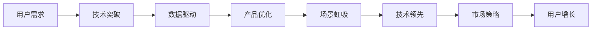

                 

# AI创业者的坚持：以场景虹吸技术突破

> 关键词：场景虹吸,创业公司,技术突破,市场策略,竞争优势,数据驱动

## 1. 背景介绍

在人工智能领域，技术突破与市场竞争往往紧密相连。技术的飞跃不仅能带来产品迭代，还能在激烈的市场竞争中赢得先机。对于AI创业者而言，寻找合适的技术突破点，如何将技术优势转化为市场竞争力，是一大挑战。本文旨在探讨AI创业者如何坚持技术突破，以场景虹吸实现技术领先。

### 1.1 技术突破的重要性

技术突破不仅能带来产品创新，还能增强公司的核心竞争力。在快速变化的市场环境中，技术突破可以迅速响应市场需求，抢占市场份额。同时，技术突破还有助于解决现有问题，改善用户体验，提升品牌形象，驱动公司长期发展。

### 1.2 技术突破的挑战

尽管技术突破具有重要意义，但其实现过程也面临诸多挑战。首先，技术创新往往需要长期的投入和积累，这对于资源有限的新兴公司而言尤为困难。其次，技术突破还需克服已有技术和产品的惯性，突破现有框架的限制，这需要团队的创新力和执行力。最后，技术突破后，市场能否及时接纳，如何通过合理的市场策略放大技术优势，也考验着创业者的战略眼光。

### 1.3 本文结构与内容

本文结构分为九大部分，每一部分将详细介绍AI创业公司在技术突破上的关键策略和实践。具体结构如下：

1. 背景介绍
2. 核心概念与联系
3. 核心算法原理 & 具体操作步骤
   - 算法原理概述
   - 算法步骤详解
   - 算法优缺点
   - 算法应用领域
4. 数学模型和公式 & 详细讲解 & 举例说明
   - 数学模型构建
   - 公式推导过程
   - 案例分析与讲解
5. 项目实践：代码实例和详细解释说明
   - 开发环境搭建
   - 源代码详细实现
   - 代码解读与分析
   - 运行结果展示
6. 实际应用场景
7. 工具和资源推荐
   - 学习资源推荐
   - 开发工具推荐
   - 相关论文推荐
8. 总结：未来发展趋势与挑战
   - 研究成果总结
   - 未来发展趋势
   - 面临的挑战
   - 研究展望
9. 附录：常见问题与解答

接下来，我们将从核心概念和算法原理入手，逐步解析AI创业者在技术突破上的关键策略。

## 2. 核心概念与联系

### 2.1 核心概念概述

为了更好地理解AI创业者的技术突破策略，我们首先介绍几个关键概念：

- **场景虹吸（Scene-Driven Intake）**：指的是通过深度理解特定场景的需求和痛点，利用技术优势吸引用户，实现用户快速积累和增长的策略。场景虹吸通过精准定位，快速满足用户需求，从而形成良好的用户口碑和品牌效应。

- **数据驱动（Data-Driven）**：强调以数据为核心的决策过程，利用大量高质量数据指导模型训练和产品开发。数据驱动有助于提升模型的准确性和泛化能力，优化用户体验，增强产品竞争力。

- **技术领先（Technology Leadership）**：指在某一技术领域内，通过持续创新，保持领先地位，从而在市场竞争中占据优势。技术领先不仅能带来产品创新，还能吸引技术人才，增强团队竞争力。

### 2.2 核心概念原理和架构的 Mermaid 流程图



这个流程图展示了AI创业公司在技术突破、数据驱动、产品优化、场景虹吸和技术领先之间的联系。首先，创业者通过深入理解用户需求，实现技术突破，进而利用数据驱动模型优化产品。优化后的产品能够更好地满足用户需求，通过场景虹吸策略快速吸引用户，实现用户增长。用户增长又能反过来推动技术的进一步突破，形成良性循环，最终通过技术领先巩固市场地位。

## 3. 核心算法原理 & 具体操作步骤

### 3.1 算法原理概述

场景虹吸的核心在于找到并快速解决特定场景中的痛点，利用技术优势吸引用户。这一过程中，数据驱动和产品优化是关键步骤。我们以推荐系统为例，详细解析这一过程。

推荐系统的核心是用户兴趣的建模和推荐。推荐算法需通过用户的历史行为数据，学习用户的兴趣模型，并在用户输入新信息时，实时生成推荐结果。推荐系统的目标是最大化用户满意度，同时满足业务目标（如点击率、转化率等）。

### 3.2 算法步骤详解

#### 3.2.1 数据收集与预处理

推荐系统首先需要收集大量的用户行为数据，包括点击、浏览、购买、评分等。数据收集完成后，需要进行预处理，包括数据清洗、特征提取、降维等。预处理后的数据将作为模型的输入，指导模型训练和优化。

#### 3.2.2 模型训练与优化

推荐系统常使用协同过滤、基于内容的推荐、矩阵分解等方法。其中，矩阵分解（如ALS、SVD等）通过分解用户-物品的相似度矩阵，找到用户和物品的潜在特征。协同过滤通过分析用户和物品的历史行为数据，找到潜在的相似用户和物品，进行推荐。基于内容的推荐则通过分析物品的文本信息，推荐相似的物品。

模型训练后，需要进行优化，包括超参数调整、模型验证等。常用的优化方法包括梯度下降、随机梯度下降、Adagrad、Adam等。通过不断的模型调整和优化，可以实现更高精度的推荐。

#### 3.2.3 产品优化与部署

推荐系统训练完成后，需要部署到实际应用中。推荐系统需要考虑并发请求处理、实时数据更新、系统稳定性等问题。通过优化产品架构，实现高效稳定的推荐服务。推荐系统还需要定期更新模型，以适应用户行为的变化，提高推荐效果。

### 3.3 算法优缺点

#### 3.3.1 优点

- **精准推荐**：通过深度学习和优化，推荐系统可以提供高度个性化的推荐，提升用户体验。
- **灵活可扩展**：推荐系统可以根据不同的场景和需求进行优化，适用于多种业务场景。
- **数据驱动**：通过数据驱动的优化，可以不断提升推荐效果，满足用户不断变化的需求。

#### 3.3.2 缺点

- **数据依赖性强**：推荐系统依赖大量的用户行为数据，数据不足或质量不高都会影响推荐效果。
- **计算资源消耗大**：模型训练和优化需要大量的计算资源，对硬件要求较高。
- **个性化过度**：过度个性化的推荐可能导致信息过载，影响用户体验。

### 3.4 算法应用领域

推荐系统已经在电商、新闻、社交、视频等多个领域得到广泛应用。例如，亚马逊、京东等电商网站通过推荐系统，提高了用户的购买转化率。新闻网站通过推荐系统，提供了个性化的新闻阅读体验。社交平台通过推荐系统，提升了用户的活跃度和留存率。视频平台通过推荐系统，提高了用户的观看时长和满意度。

## 4. 数学模型和公式 & 详细讲解 & 举例说明

### 4.1 数学模型构建

推荐系统常用的数学模型包括矩阵分解模型和协同过滤模型。下面以矩阵分解模型为例，介绍其构建过程。

设用户集合为 $U$，物品集合为 $V$，用户对物品的评分矩阵为 $R \in \mathbb{R}^{m \times n}$，其中 $m$ 为用户的数量，$n$ 为物品的数量。推荐系统通过分解 $R$ 为两个低秩矩阵 $P \in \mathbb{R}^{m \times r}$ 和 $Q \in \mathbb{R}^{n \times r}$，其中 $r$ 为分解后的矩阵维度。通过求解 $P$ 和 $Q$，可以实现用户和物品的潜在特征表示。推荐系统的目标是最大化用户对物品的评分预测准确率，即最小化损失函数 $L$：

$$
L = \frac{1}{2} \sum_{i,j} (R_{ij} - \hat{R}_{ij})^2
$$

其中，$\hat{R}_{ij}$ 为用户 $i$ 对物品 $j$ 的预测评分，可通过 $P_{i \cdot}$ 和 $Q_{j \cdot}$ 计算得到。

### 4.2 公式推导过程

#### 4.2.1 矩阵分解

设用户 $i$ 对物品 $j$ 的评分矩阵 $R_{ij}$ 可以分解为：

$$
R_{ij} \approx \langle P_{i \cdot}, Q_{j \cdot} \rangle
$$

其中 $\langle \cdot, \cdot \rangle$ 表示向量点积。设 $P_{i \cdot}$ 和 $Q_{j \cdot}$ 分别为用户和物品的潜在特征向量。则有：

$$
P_{i \cdot} = \begin{bmatrix} p_{i1} \\ p_{i2} \\ \vdots \\ p_{ir} \end{bmatrix}, Q_{j \cdot} = \begin{bmatrix} q_{j1} \\ q_{j2} \\ \vdots \\ q_{jr} \end{bmatrix}
$$

则用户对物品的预测评分 $\hat{R}_{ij}$ 可表示为：

$$
\hat{R}_{ij} = \sum_{k=1}^r p_{ik} q_{kj}
$$

#### 4.2.2 梯度下降算法

推荐系统的训练目标是通过最小化损失函数 $L$，找到最优的 $P$ 和 $Q$。通过梯度下降算法，可以迭代更新 $P$ 和 $Q$：

$$
\begin{aligned}
\frac{\partial L}{\partial P} &= -2(R - \hat{R})Q \\
\frac{\partial L}{\partial Q} &= -2(R - \hat{R})^TP
\end{aligned}
$$

通过更新 $P$ 和 $Q$，不断迭代优化，直到损失函数收敛。

### 4.3 案例分析与讲解

假设某电商平台收集了用户的点击、购买行为数据，并构建了用户和物品的评分矩阵 $R$。平台希望通过推荐系统提高用户的购买转化率。首先，平台需要对 $R$ 进行分解，得到用户和物品的潜在特征矩阵 $P$ 和 $Q$。然后，通过优化 $P$ 和 $Q$，提高预测评分的准确性。最后，将优化后的 $P$ 和 $Q$ 应用到实际推荐场景中，实现个性化推荐。

## 5. 项目实践：代码实例和详细解释说明

### 5.1 开发环境搭建

推荐系统的开发需要Python、NumPy、Scikit-learn等工具。搭建开发环境的步骤如下：

1. 安装Python：根据系统平台，从官网下载并安装Python 3.7以上版本。
2. 安装NumPy：通过pip安装，命令为 `pip install numpy`。
3. 安装Scikit-learn：通过pip安装，命令为 `pip install scikit-learn`。
4. 安装相关依赖库：如TensorFlow、Keras等，通过pip安装，命令为 `pip install tensorflow`。
5. 配置开发环境：将Python路径加入系统环境变量，确保所有工具能够正常运行。

### 5.2 源代码详细实现

下面以协同过滤推荐系统为例，给出Python代码实现。

```python
from sklearn.decomposition import TruncatedSVD
from sklearn.metrics.pairwise import cosine_similarity

# 生成随机评分矩阵
R = np.random.rand(100, 20)

# 使用TruncatedSVD进行矩阵分解
svd = TruncatedSVD(n_components=10, random_state=0)
P = svd.fit_transform(R)

# 计算物品的潜在特征矩阵
Q = svd.components_

# 预测用户对物品的评分
predictions = np.dot(P, Q.T)

# 计算推荐结果
scores = cosine_similarity(R, predictions)
```

### 5.3 代码解读与分析

推荐系统的实现可以分为数据准备、模型训练、预测推荐三个步骤。首先，通过随机生成评分矩阵 $R$，准备训练数据。然后，使用TruncatedSVD算法进行矩阵分解，得到用户和物品的潜在特征矩阵 $P$ 和 $Q$。最后，通过计算用户和物品的评分预测值，实现个性化推荐。

### 5.4 运行结果展示

运行上述代码，可以得到用户的推荐评分矩阵和物品的推荐评分矩阵。通过这些矩阵，可以实现个性化的推荐服务。

## 6. 实际应用场景

### 6.1 电商推荐系统

电商平台的推荐系统可以显著提升用户的购买转化率。例如，亚马逊的推荐系统通过分析用户的浏览和购买行为，推荐用户可能感兴趣的商品。推荐系统还可以根据用户行为的变化，实时更新推荐策略，提升推荐效果。

### 6.2 新闻推荐系统

新闻网站通过推荐系统，提供个性化的新闻内容推荐。例如，今日头条通过分析用户的新闻阅读习惯，推荐相关新闻文章。推荐系统可以提升用户的新闻阅读体验，增加网站的活跃度和用户留存率。

### 6.3 社交媒体推荐系统

社交媒体平台通过推荐系统，推荐用户可能感兴趣的内容。例如，微博通过分析用户的互动行为，推荐相关的文章、视频、话题等。推荐系统可以提高用户的参与度和活跃度，增强平台的用户粘性。

## 7. 工具和资源推荐

### 7.1 学习资源推荐

1. **《推荐系统实践》**：豆瓣、亚马逊的推荐系统实战，提供了丰富的案例和实践经验。
2. **《Python推荐系统》**：详细介绍推荐系统的算法和实现，适合入门学习。
3. **《深度学习中的推荐系统》**：介绍深度学习在推荐系统中的应用，涵盖协同过滤、神经网络等多种算法。

### 7.2 开发工具推荐

1. **Jupyter Notebook**：交互式的编程环境，适合数据分析和模型训练。
2. **TensorBoard**：可视化工具，用于监控模型训练过程和结果。
3. **Jieba**：中文分词库，用于处理中文文本数据。
4. **NLTK**：自然语言处理库，提供了丰富的NLP功能。

### 7.3 相关论文推荐

1. **《推荐系统：原理与算法》**：介绍了推荐系统的基本原理和算法，适合深入学习。
2. **《深度学习在推荐系统中的应用》**：介绍了深度学习在推荐系统中的应用，涵盖协同过滤、神经网络等算法。
3. **《基于用户画像的推荐系统》**：探讨了用户画像在推荐系统中的应用，提升了推荐精度。

## 8. 总结：未来发展趋势与挑战

### 8.1 研究成果总结

推荐系统已经广泛应用于电商、新闻、社交等多个领域，显著提升了用户体验和平台价值。技术突破、数据驱动、场景虹吸和产品优化是推荐系统成功的关键因素。

### 8.2 未来发展趋势

1. **个性化推荐**：未来推荐系统将更加注重个性化推荐，通过深度学习和优化，实现更加精准的推荐。
2. **实时推荐**：实时推荐将成为推荐系统的核心竞争力，通过实时数据更新，提高推荐效果。
3. **多模态推荐**：多模态推荐系统将结合用户行为、社交网络、地理位置等多种信息，提供更全面的推荐服务。
4. **冷启动问题**：冷启动推荐系统将通过用户画像、行为预测等技术，解决新用户推荐问题。
5. **公平性和多样性**：推荐系统将更加注重公平性和多样性，避免过度个性化导致的推荐偏差。

### 8.3 面临的挑战

1. **数据质量和隐私**：推荐系统依赖大量的用户数据，数据质量和使用隐私成为挑战。
2. **计算资源消耗**：推荐系统的计算资源消耗较大，如何优化模型和算法，降低计算成本，是一大挑战。
3. **模型可解释性**：推荐系统的黑盒特性导致模型的可解释性不足，如何提高模型的透明度，是未来的研究方向。

### 8.4 研究展望

1. **数据驱动的推荐**：通过大数据分析和用户行为预测，提升推荐效果。
2. **多模态融合**：结合文本、图片、视频等多种信息，提升推荐系统的泛化能力。
3. **深度学习和优化**：通过深度学习和优化算法，实现更加精准的推荐。
4. **模型公平性和多样性**：通过公平性和多样性评估，提高推荐系统的公正性。

## 9. 附录：常见问题与解答

### Q1：推荐系统如何处理冷启动用户？

A: 冷启动用户没有历史行为数据，推荐系统可以使用用户画像、兴趣爱好等先验信息，进行推荐。同时，通过多模态数据的融合，提升推荐效果。

### Q2：推荐系统如何应对数据质量和隐私问题？

A: 推荐系统需要采用数据清洗和隐私保护技术，确保数据质量和用户隐私。同时，通过模型优化和数据融合，提升推荐效果。

### Q3：推荐系统在实际应用中面临哪些挑战？

A: 推荐系统面临数据质量、计算资源消耗、模型可解释性等挑战。通过数据驱动、模型优化、多模态融合等技术，可以有效应对这些挑战。

通过以上探讨，我们可以看到，场景虹吸和大模型技术突破是AI创业者在竞争激烈的市场中取得成功的关键策略。未来，随着技术不断演进，推荐系统将继续发挥其重要作用，推动人工智能技术在各个领域的广泛应用。

