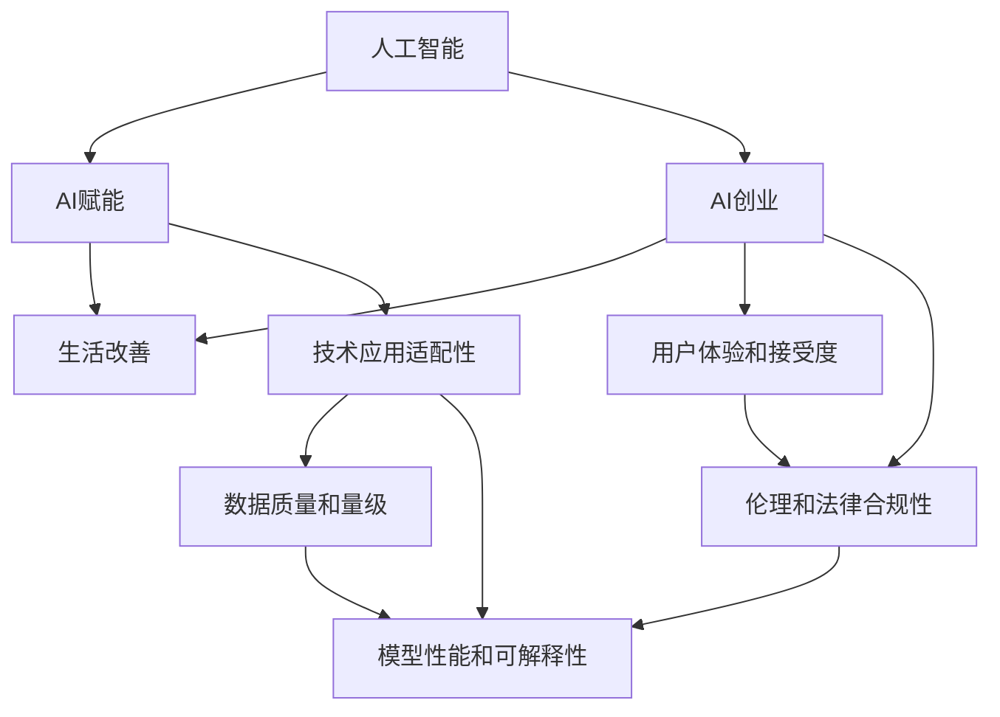

                 

# AI创业者的码头愿景：AI赋能，改善生活

> 关键词：人工智能，AI赋能，AI创业，生活改善，技术应用

## 1. 背景介绍

### 1.1 问题由来

随着人工智能技术的迅猛发展，AI创业已经成为了一个引人瞩目的领域。越来越多的创业者意识到，AI技术在改善人们生活方面具有巨大的潜力。从医疗、教育、交通到金融、零售、制造，AI技术正在改变我们生活的方方面面。然而，AI技术的广泛应用仍面临诸多挑战，如何在实际应用中发挥其最大效能，成为每一个AI创业者必须面对的重要课题。

### 1.2 问题核心关键点

在AI创业的征程中，如何利用AI技术赋能各行各业，改善人们生活，成为成功的关键。具体而言，需要重点关注以下关键点：

- **技术应用适配性**：AI技术能否有效适配各个行业的具体需求，解决实际问题。
- **数据质量和量级**：数据质量的高低和量的多少直接影响AI模型的训练和应用效果。
- **模型性能和可解释性**：AI模型的预测准确性和可解释性直接影响用户体验和信任度。
- **用户体验和接受度**：用户对AI系统的感知和接受程度，是推动AI应用落地的重要因素。
- **伦理和法律合规性**：AI系统的伦理和法律合规性，是确保其安全性和可持续性的基础。

## 2. 核心概念与联系

### 2.1 核心概念概述

为了更好地理解AI创业的愿景和实践，本节将介绍几个密切相关的核心概念：

- **人工智能（Artificial Intelligence, AI）**：一种模拟人类智能行为的技术，包括学习、推理、感知、决策等方面。AI技术可以通过机器学习、深度学习、自然语言处理等方法实现。

- **AI赋能（AI-empowerment）**：指利用AI技术，提升企业运营效率、优化决策支持、增强用户体验的过程。AI赋能可以实现产品创新、服务升级、流程优化等目标。

- **AI创业（AI venture）**：指基于AI技术的创业活动，包括技术研发、产品设计、市场推广、团队建设等多个环节。AI创业的核心是解决实际问题，创造价值。

- **生活改善（Living Improvement）**：指通过AI技术的应用，提升人们的生活质量、幸福感、安全感等。生活改善是AI创业的最终目标。

- **技术应用适配性（Technology Application Adaptability）**：指AI技术能否适应特定行业的需求，解决具体问题。

- **数据质量和量级（Data Quality and Quantity）**：高质量、大数据量的数据是AI模型训练的基础。

- **模型性能和可解释性（Model Performance and Interpretability）**：AI模型的预测准确性和可解释性，直接影响用户体验和信任度。

- **用户体验和接受度（User Experience and Acceptance）**：用户对AI系统的感知和接受程度，是推动AI应用落地的重要因素。

- **伦理和法律合规性（Ethics and Legal Compliance）**：AI系统的伦理和法律合规性，是确保其安全性和可持续性的基础。

这些核心概念之间的逻辑关系可以通过以下Mermaid流程图来展示：



这个流程图展示了一系列的AI创业实践与最终目标之间的逻辑关系：

1. 人工智能技术作为基础，为AI赋能提供动力。
2. AI赋能是连接AI技术与生活改善的桥梁，通过提升运营效率、优化决策支持、增强用户体验，实现价值创造。
3. AI创业是实现AI赋能和改善生活的具体实践，通过技术研发、产品设计、市场推广等环节，推动AI技术落地应用。
4. 技术应用适配性、数据质量、模型性能、用户体验、伦理合规等关键点，共同构成了AI创业的生态系统，支撑着AI系统的稳定运行和用户接受。

## 3. 核心算法原理 & 具体操作步骤
### 3.1 算法原理概述

AI创业的核心算法原理，是基于AI技术的优化和应用，实现生活改善的目标。在实践中，这通常包括以下几个关键步骤：

1. **需求分析和问题定义**：明确AI技术要解决的具体问题，如需求识别、问题定义等。
2. **数据采集和预处理**：收集与问题相关的数据，并进行清洗、归一化、标注等预处理工作。
3. **模型选择和训练**：选择合适的AI模型，利用训练数据对其进行训练，优化模型参数。
4. **模型评估和优化**：在测试集上评估模型性能，根据评估结果进行模型调优和改进。
5. **部署和应用**：将优化后的模型部署到实际应用场景中，进行用户测试和反馈收集。
6. **迭代和改进**：根据用户反馈和业务需求，不断迭代改进AI系统。

### 3.2 算法步骤详解

**Step 1: 需求分析和问题定义**

1. **用户调研**：通过问卷、访谈等方式，收集用户需求和痛点，明确问题的具体表现。
2. **问题定义**：根据用户调研结果，抽象出具体问题，如推荐系统、情感分析、图像识别等。
3. **场景模拟**：构建问题场景，模拟用户在不同情境下的行为和反应，为模型训练提供真实数据。

**Step 2: 数据采集和预处理**

1. **数据收集**：从不同渠道收集相关数据，如传感器数据、用户行为数据、公开数据集等。
2. **数据清洗**：去除噪声、异常值、重复数据等，确保数据质量。
3. **数据标注**：对数据进行标注，如标签化、分类、实体识别等，为模型训练提供有监督信号。
4. **数据增强**：通过数据扩增、数据合成等方法，丰富训练数据的多样性，提高模型泛化能力。

**Step 3: 模型选择和训练**

1. **模型选择**：根据问题类型和数据特点，选择适合的AI模型，如深度神经网络、卷积神经网络、循环神经网络等。
2. **模型训练**：利用训练数据对模型进行训练，优化模型参数。常见的优化算法包括随机梯度下降（SGD）、Adam、Adagrad等。
3. **超参数调优**：通过交叉验证等方法，对模型超参数进行调优，寻找最优参数组合。

**Step 4: 模型评估和优化**

1. **模型评估**：在测试集上评估模型性能，如准确率、召回率、F1值等指标。
2. **模型调优**：根据评估结果，对模型进行调优，如调整网络结构、增加正则化项、调整学习率等。
3. **模型验证**：在验证集上进一步验证模型性能，确保模型泛化能力强。

**Step 5: 部署和应用**

1. **模型部署**：将优化后的模型部署到实际应用场景中，如生产环境、移动应用、企业系统等。
2. **用户测试**：让真实用户使用AI系统，收集反馈和问题报告。
3. **系统优化**：根据用户反馈和业务需求，进行系统优化和改进。

**Step 6: 迭代和改进**

1. **数据更新**：定期更新数据集，确保数据的时效性和多样性。
2. **模型更新**：根据数据变化和新需求，更新和改进模型。
3. **用户回访**：定期回访用户，了解其对AI系统的使用体验和满意度。

### 3.3 算法优缺点

AI创业的算法具有以下优点：

- **高效性**：通过优化算法和模型结构，可以实现高效的数据处理和模型训练。
- **可扩展性**：AI技术具有高度的可扩展性，可以在不同的应用场景中灵活应用。
- **智能化**：AI算法具备强大的智能推理能力，能够自动学习数据特征，提高决策效率。
- **灵活性**：AI模型可以根据新数据和需求进行快速迭代和优化。

然而，AI算法也存在一些缺点：

- **数据依赖性高**：AI模型训练依赖高质量、大体积的数据，数据获取和标注成本高。
- **计算资源需求大**：大规模AI模型的训练和推理需要高性能的计算资源，如GPU、TPU等。
- **模型复杂度高**：复杂的AI模型需要大量的时间和资源进行训练和优化，优化难度大。
- **可解释性不足**：许多AI模型缺乏解释性，难以理解其决策过程和结果。
- **伦理和法律问题**：AI系统的伦理和法律合规性问题，如隐私保护、歧视性偏见等，需要严格处理。

### 3.4 算法应用领域

AI创业的算法在多个领域得到了广泛应用，具体包括：

- **医疗健康**：利用AI技术进行疾病预测、诊断、治疗方案推荐等。
- **金融保险**：利用AI技术进行风险评估、反欺诈、智能投顾等。
- **教育培训**：利用AI技术进行个性化学习推荐、智能辅导、学习效果评估等。
- **智慧城市**：利用AI技术进行交通管理、环境监测、安全预警等。
- **智能制造**：利用AI技术进行生产优化、质量控制、设备维护等。
- **零售电商**：利用AI技术进行商品推荐、库存管理、价格优化等。
- **能源环保**：利用AI技术进行能源消耗优化、环境监测、灾害预警等。

## 4. 数学模型和公式 & 详细讲解  
### 4.1 数学模型构建

AI创业的数学模型通常基于机器学习、深度学习等算法。以下是一个简单的线性回归模型的数学模型构建：

设$y$为输出变量，$x_1, x_2, ..., x_n$为输入变量，$\theta_1, \theta_2, ..., \theta_n$为模型参数，则线性回归模型的数学模型为：

$$y = \theta_1 x_1 + \theta_2 x_2 + ... + \theta_n x_n + \epsilon$$

其中$\epsilon$为误差项，服从均值为0、方差为$\sigma^2$的正态分布。

### 4.2 公式推导过程

线性回归模型的最小二乘法损失函数为：

$$\mathcal{L}(\theta) = \frac{1}{2m} \sum_{i=1}^m (y_i - \theta_1 x_{1,i} - \theta_2 x_{2,i} - ... - \theta_n x_{n,i})^2$$

其中$m$为样本数量。

求解最小化损失函数，得到最优参数$\theta$的解为：

$$\theta_j = \frac{1}{m} \sum_{i=1}^m x_{j,i} y_i - \frac{1}{m} \sum_{i=1}^m x_{j,i}^2 \cdot \frac{1}{m} \sum_{i=1}^m y_i^2 - \frac{1}{m} \sum_{i=1}^m x_{j,i} \cdot \frac{1}{m} \sum_{i=1}^m x_{j,i} y_i$$

利用矩阵形式表示，上述公式可简化为：

$$\theta = (X^T X)^{-1} X^T y$$

其中$X$为输入变量矩阵，$y$为输出变量向量。

### 4.3 案例分析与讲解

以图像分类为例，利用深度学习中的卷积神经网络（CNN）进行模型构建和训练：

1. **数据预处理**：将图像数据归一化、标准化，并将其转换为网络可处理的张量。
2. **网络构建**：设计卷积神经网络的结构，包括卷积层、池化层、全连接层等。
3. **模型训练**：利用训练数据对网络进行前向传播和反向传播，优化模型参数。
4. **模型评估**：在测试集上评估模型性能，如准确率、召回率等指标。
5. **模型应用**：将训练好的模型部署到实际应用中，进行图像分类任务。

## 5. 项目实践：代码实例和详细解释说明
### 5.1 开发环境搭建

在进行AI创业实践前，我们需要准备好开发环境。以下是使用Python进行TensorFlow开发的开发环境配置流程：

1. 安装Anaconda：从官网下载并安装Anaconda，用于创建独立的Python环境。

2. 创建并激活虚拟环境：
```bash
conda create -n tf-env python=3.8 
conda activate tf-env
```

3. 安装TensorFlow：根据CUDA版本，从官网获取对应的安装命令。例如：
```bash
conda install tensorflow -c tf -c conda-forge
```

4. 安装各类工具包：
```bash
pip install numpy pandas scikit-learn matplotlib tqdm jupyter notebook ipython
```

完成上述步骤后，即可在`tf-env`环境中开始AI创业实践。

### 5.2 源代码详细实现

下面我们以医疗健康领域中的疾病预测为例，给出使用TensorFlow进行深度学习的PyTorch代码实现。

首先，定义数据处理函数：

```python
import numpy as np
import pandas as pd
import tensorflow as tf

def load_data(filename):
    data = pd.read_csv(filename)
    X = data.drop(['label'], axis=1).values
    y = data['label'].values
    return X, y

def data_preprocess(X):
    X = (X - np.mean(X, axis=0)) / np.std(X, axis=0)
    return X

def train_test_split(X, y, test_size=0.2):
    shuffle_index = np.random.permutation(len(X))
    X_train, y_train = X[shuffle_index[:int(len(X) * (1-test_size))], :], y[shuffle_index[:int(len(X) * (1-test_size))]]
    X_test, y_test = X[shuffle_index[int(len(X) * (1-test_size)):], :], y[shuffle_index[int(len(X) * (1-test_size)):]]
    return X_train, y_train, X_test, y_test

# 加载数据
filename = 'data.csv'
X, y = load_data(filename)

# 数据预处理
X = data_preprocess(X)

# 划分训练集和测试集
X_train, y_train, X_test, y_test = train_test_split(X, y, test_size=0.2)
```

然后，定义模型和优化器：

```python
from tensorflow.keras.models import Sequential
from tensorflow.keras.layers import Dense, Dropout, Flatten
from tensorflow.keras.callbacks import EarlyStopping

model = Sequential()
model.add(Dense(64, activation='relu', input_shape=(X_train.shape[1],)))
model.add(Dropout(0.5))
model.add(Dense(32, activation='relu'))
model.add(Dropout(0.5))
model.add(Dense(1, activation='sigmoid'))

optimizer = tf.keras.optimizers.Adam(learning_rate=0.001)
early_stopping = EarlyStopping(monitor='val_loss', patience=10, restore_best_weights=True)
```

接着，定义训练和评估函数：

```python
from tensorflow.keras.metrics import Accuracy

def train_model(model, X_train, y_train, X_test, y_test, batch_size=64, epochs=100):
    model.compile(optimizer=optimizer, loss='binary_crossentropy', metrics=[Accuracy()])
    model.fit(X_train, y_train, validation_data=(X_test, y_test), batch_size=batch_size, epochs=epochs, callbacks=[early_stopping])
    eval_result = model.evaluate(X_test, y_test)
    return eval_result

def evaluate_model(model, X_test, y_test):
    eval_result = model.evaluate(X_test, y_test)
    return eval_result
```

最后，启动训练流程并在测试集上评估：

```python
# 训练模型
train_result = train_model(model, X_train, y_train, X_test, y_test)

# 评估模型
eval_result = evaluate_model(model, X_test, y_test)
print(f"训练结果: {train_result}")
print(f"评估结果: {eval_result}")
```

以上就是使用TensorFlow进行医疗健康领域疾病预测任务的完整代码实现。可以看到，TensorFlow提供了强大的API支持，可以方便地构建和训练深度学习模型。

### 5.3 代码解读与分析

让我们再详细解读一下关键代码的实现细节：

**load_data函数**：
- 用于加载和预处理数据集。
- 首先，使用Pandas库加载CSV格式的数据文件，并提取输入特征(X)和输出标签(y)。
- 然后，对输入特征进行标准化处理，确保数据在同一尺度下进行训练。

**train_test_split函数**：
- 用于将数据集划分为训练集和测试集。
- 通过随机打乱数据顺序，对数据进行分块划分，保证训练集和测试集的独立性。

**Sequential模型定义**：
- 使用Keras Sequential模型，依次添加输入层、隐藏层和输出层。
- 隐藏层使用ReLU激活函数，并进行Dropout正则化，防止过拟合。
- 输出层使用Sigmoid激活函数，预测二分类问题。

**train_model函数**：
- 对模型进行编译，指定优化器、损失函数和评估指标。
- 使用训练数据进行模型训练，并在验证集上进行Early Stopping，防止过拟合。
- 训练完毕后，返回测试集上的评估结果。

**evaluate_model函数**：
- 对模型进行评估，返回测试集上的评估结果。

可以看到，TensorFlow提供了简单易用的API，使得构建和训练深度学习模型变得非常方便。开发者可以根据实际需求，灵活调整模型结构和参数。

当然，工业级的系统实现还需考虑更多因素，如模型的保存和部署、超参数的自动搜索、更灵活的任务适配层等。但核心的AI创业实践流程基本与此类似。

## 6. 实际应用场景
### 6.1 智能客服系统

智能客服系统是AI创业的重要应用场景之一。传统的客服系统往往需要耗费大量人力物力，且响应速度和准确率难以保证。通过AI技术，可以实现7x24小时不间断服务，快速响应客户咨询，用自然流畅的语言解答各类常见问题。

在技术实现上，可以收集企业内部的历史客服对话记录，将问题和最佳答复构建成监督数据，在此基础上对预训练对话模型进行微调。微调后的对话模型能够自动理解用户意图，匹配最合适的答案模板进行回复。对于客户提出的新问题，还可以接入检索系统实时搜索相关内容，动态组织生成回答。如此构建的智能客服系统，能大幅提升客户咨询体验和问题解决效率。

### 6.2 金融舆情监测

金融机构需要实时监测市场舆论动向，以便及时应对负面信息传播，规避金融风险。传统的人工监测方式成本高、效率低，难以应对网络时代海量信息爆发的挑战。基于AI技术的文本分类和情感分析技术，为金融舆情监测提供了新的解决方案。

具体而言，可以收集金融领域相关的新闻、报道、评论等文本数据，并对其进行主题标注和情感标注。在此基础上对预训练语言模型进行微调，使其能够自动判断文本属于何种主题，情感倾向是正面、中性还是负面。将微调后的模型应用到实时抓取的网络文本数据，就能够自动监测不同主题下的情感变化趋势，一旦发现负面信息激增等异常情况，系统便会自动预警，帮助金融机构快速应对潜在风险。

### 6.3 个性化推荐系统

当前的推荐系统往往只依赖用户的历史行为数据进行物品推荐，无法深入理解用户的真实兴趣偏好。基于AI技术的个性化推荐系统，可以更好地挖掘用户行为背后的语义信息，从而提供更精准、多样的推荐内容。

在实践中，可以收集用户浏览、点击、评论、分享等行为数据，提取和用户交互的物品标题、描述、标签等文本内容。将文本内容作为模型输入，用户的后续行为（如是否点击、购买等）作为监督信号，在此基础上微调预训练语言模型。微调后的模型能够从文本内容中准确把握用户的兴趣点。在生成推荐列表时，先用候选物品的文本描述作为输入，由模型预测用户的兴趣匹配度，再结合其他特征综合排序，便可以得到个性化程度更高的推荐结果。

### 6.4 未来应用展望

随着AI技术的不断进步，AI创业的前景将更加广阔。未来，AI技术将在更多领域得到应用，为社会带来深刻变革：

1. **智慧医疗**：通过AI技术进行疾病预测、个性化诊疗、医疗影像分析等，提高医疗服务的智能化水平，降低医疗成本。
2. **智能制造**：利用AI技术进行生产优化、质量控制、设备维护等，提升制造业的自动化和智能化水平。
3. **智慧城市**：利用AI技术进行交通管理、环境监测、安全预警等，提高城市管理的自动化和智能化水平，构建更安全、高效、宜居的城市。
4. **智慧教育**：利用AI技术进行个性化学习推荐、智能辅导、学习效果评估等，提升教育资源的利用效率，实现教育公平。
5. **智能零售**：利用AI技术进行商品推荐、库存管理、价格优化等，提升零售行业的运营效率，改善用户体验。

## 7. 工具和资源推荐
### 7.1 学习资源推荐

为了帮助开发者系统掌握AI创业的理论基础和实践技巧，这里推荐一些优质的学习资源：

1. **《深度学习》课程**：由斯坦福大学开设的深度学习课程，涵盖了深度学习的基础理论和应用案例。
2. **《TensorFlow官方文档》**：TensorFlow的官方文档，提供了详细的API接口和示例代码，是学习TensorFlow的最佳入门资源。
3. **《TensorFlow实战》书籍**：介绍TensorFlow的实战应用，涵盖数据处理、模型构建、模型评估等多个环节。
4. **Kaggle平台**：提供丰富的数据集和比赛，帮助开发者练习机器学习、深度学习等技能，并结识业内同行。
5. **Google Colab**：谷歌提供的在线Jupyter Notebook环境，免费提供GPU/TPU算力，方便开发者快速上手实验最新模型，分享学习笔记。

通过对这些资源的学习实践，相信你一定能够快速掌握AI创业的精髓，并用于解决实际的AI应用问题。

### 7.2 开发工具推荐

高效的开发离不开优秀的工具支持。以下是几款用于AI创业开发的常用工具：

1. **TensorFlow**：由Google主导开发的开源深度学习框架，生产部署方便，适合大规模工程应用。
2. **PyTorch**：由Facebook开发的开源深度学习框架，灵活高效，适合研究和实验。
3. **Keras**：高层次的神经网络API，可以快速构建和训练深度学习模型。
4. **Jupyter Notebook**：互动式编程环境，方便开发者记录和分享代码、数据和实验结果。
5. **Git**：版本控制系统，方便开发者协作开发和管理代码。

合理利用这些工具，可以显著提升AI创业的开发效率，加快创新迭代的步伐。

### 7.3 相关论文推荐

AI创业的研究涉及多个领域，以下是几篇代表性的相关论文，推荐阅读：

1. **《神经网络与深度学习》**：深度学习领域的经典书籍，涵盖了神经网络的基础知识和应用案例。
2. **《深度学习实战》**：介绍深度学习技术的实战应用，涵盖数据处理、模型构建、模型评估等多个环节。
3. **《深度学习优化算法》**：介绍深度学习优化算法的理论和实践，涵盖梯度下降、Adam、Adagrad等算法。
4. **《AI伦理与安全》**：探讨AI技术的伦理和法律问题，如隐私保护、偏见歧视、安全性等。
5. **《机器学习实战》**：介绍机器学习技术的实战应用，涵盖分类、回归、聚类等多个算法。

这些论文代表了大规模AI创业的最新研究方向，可以帮助研究者把握学科前进方向，激发更多的创新灵感。

## 8. 总结：未来发展趋势与挑战
### 8.1 总结

本文对AI创业的愿景和实践进行了全面系统的介绍。首先，明确了AI技术在改善人们生活方面的巨大潜力，提出了技术应用适配性、数据质量、模型性能、用户体验、伦理合规等关键点。其次，从需求分析、数据采集、模型选择、模型训练、模型评估、模型部署等多个环节，详细讲解了AI创业的具体实践过程。最后，探讨了AI创业在医疗、金融、教育、智慧城市、智能制造等多个领域的应用前景，并推荐了相关的学习资源和开发工具。

通过本文的系统梳理，可以看到，AI创业技术正在改变各行各业，带来深远的社会变革。未来，随着AI技术的不断进步，AI创业的前景将更加广阔，将在更多领域得到应用，为社会带来更多的创新和进步。

### 8.2 未来发展趋势

展望未来，AI创业技术将呈现以下几个发展趋势：

1. **多模态融合**：AI技术将突破单一模态的限制，融合视觉、听觉、触觉等多种信息，构建更全面、更准确的应用场景。
2. **边缘计算**：AI模型将从云端迁移至边缘设备，提高计算效率和响应速度，支持实时应用。
3. **自动化应用**：AI技术将自动嵌入到各行各业的应用场景中，实现业务流程的自动化、智能化。
4. **个性化服务**：基于AI技术的个性化服务将更加普及，满足用户多样化、个性化的需求。
5. **数据治理**：数据治理技术将进一步发展，确保数据的安全性、隐私性和合规性。
6. **AI芯片**：随着AI技术的发展，专用AI芯片将逐步替代传统CPU，提高计算效率和能效比。

### 8.3 面临的挑战

尽管AI创业的前景广阔，但仍面临诸多挑战：

1. **数据隐私保护**：AI系统需要大量数据进行训练，如何保护用户隐私和数据安全，是一个重要挑战。
2. **模型透明性**：AI模型的决策过程缺乏透明性，难以解释其内部工作机制，导致用户不信任。
3. **伦理和法律合规**：AI系统可能存在偏见、歧视等问题，如何确保其伦理和法律合规性，是一个重要挑战。
4. **计算资源需求**：大规模AI模型的训练和推理需要高性能的计算资源，如何降低计算成本，是一个重要挑战。
5. **跨领域应用**：AI技术在不同领域的应用具有差异性，如何实现跨领域的知识迁移和模型适配，是一个重要挑战。

### 8.4 研究展望

为了应对未来AI创业的挑战，研究者需要在以下几个方面进行深入探索：

1. **隐私保护技术**：研发隐私保护技术，如差分隐私、联邦学习等，确保数据隐私和安全。
2. **模型可解释性**：开发可解释性AI模型，如LIME、SHAP等，提高模型的透明性和可解释性。
3. **伦理和法律合规**：制定AI伦理和法律规范，确保AI系统的公平性、公正性和合法性。
4. **计算资源优化**：研发高效计算资源管理技术，如分布式训练、模型压缩等，降低计算成本。
5. **跨领域应用**：开发跨领域的知识迁移和模型适配技术，实现AI技术在更多领域的应用。

这些研究方向的探索，必将引领AI创业技术迈向更高的台阶，为构建安全、可靠、可解释、可控的智能系统铺平道路。面向未来，AI创业技术还需要与其他人工智能技术进行更深入的融合，如知识表示、因果推理、强化学习等，多路径协同发力，共同推动自然语言理解和智能交互系统的进步。只有勇于创新、敢于突破，才能不断拓展AI创业的边界，让AI技术更好地造福人类社会。

## 9. 附录：常见问题与解答

**Q1：AI创业的核心竞争力是什么？**

A: AI创业的核心竞争力在于其能够利用AI技术，解决实际问题，创造价值。具体而言，核心竞争力包括技术应用适配性、数据质量、模型性能、用户体验、伦理合规等方面。只有具备这些核心竞争力，才能在激烈的市场竞争中脱颖而出。

**Q2：AI创业的团队应该具备哪些技能？**

A: AI创业团队应该具备以下技能：

1. **算法和模型开发**：熟悉深度学习、机器学习等算法和模型开发。
2. **数据处理和标注**：能够处理大规模数据，进行数据清洗、标注等工作。
3. **系统集成和部署**：具备系统集成和部署能力，能够将AI模型部署到生产环境中。
4. **用户体验设计**：具备用户体验设计能力，能够设计和优化用户界面，提升用户体验。
5. **伦理和法律合规**：具备伦理和法律合规意识，能够确保AI系统的公平性、公正性和合法性。

**Q3：AI创业的主要风险是什么？**

A: AI创业的主要风险包括：

1. **技术风险**：AI技术可能存在技术瓶颈，难以满足实际需求。
2. **市场风险**：AI技术可能无法获得市场认可，难以实现商业化。
3. **数据风险**：AI系统可能存在数据隐私和安全问题，导致用户不信任。
4. **伦理风险**：AI系统可能存在偏见、歧视等问题，导致社会负面影响。
5. **法规风险**：AI系统可能存在伦理和法律合规问题，导致法律诉讼。

**Q4：如何进行AI创业项目的评估和投资？**

A: 进行AI创业项目的评估和投资，需要考虑以下几个方面：

1. **技术可行性**：评估AI技术的技术可行性和成熟度。
2. **市场需求**：评估AI技术的应用需求和市场潜力。
3. **商业模式**：评估AI技术的商业模式和盈利方式。
4. **团队能力**：评估团队的技术能力、经验和管理能力。
5. **风险控制**：评估项目的技术风险、市场风险、数据风险、伦理风险和法规风险。

通过综合考虑以上因素，可以更全面地评估AI创业项目的潜力和价值，做出明智的投资决策。

**Q5：AI创业的下一步发展方向是什么？**

A: AI创业的下一步发展方向包括：

1. **多模态融合**：融合视觉、听觉、触觉等多种信息，构建更全面、更准确的应用场景。
2. **边缘计算**：将AI模型部署到边缘设备，提高计算效率和响应速度，支持实时应用。
3. **自动化应用**：自动嵌入AI技术到各行各业的应用场景中，实现业务流程的自动化、智能化。
4. **个性化服务**：基于AI技术的个性化服务将更加普及，满足用户多样化、个性化的需求。
5. **数据治理**：制定数据治理规范，确保数据的安全性、隐私性和合规性。
6. **AI芯片**：研发专用AI芯片，提高计算效率和能效比。

这些方向将推动AI创业技术不断进步，带来更广泛的应用和更深远的影响。

---

作者：禅与计算机程序设计艺术 / Zen and the Art of Computer Programming

