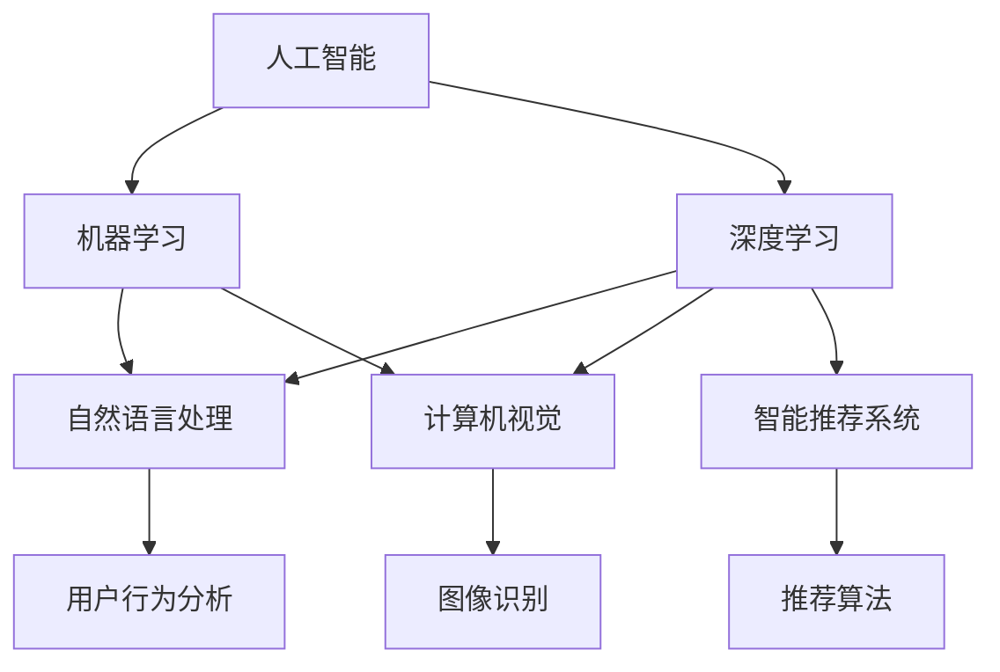

                 

# AI创业：不同项目的技术选择

> 关键词：人工智能,创业,技术选型,机器学习,深度学习,自然语言处理(NLP),计算机视觉(CV),智能推荐系统,产品开发,用户体验(UX)

## 1. 背景介绍

随着人工智能技术的不断进步，越来越多的创业项目开始将AI技术作为核心竞争力，希望通过创新和高效的技术手段实现商业模式的变革和用户价值的提升。然而，不同的AI技术在应用场景和商业模式上有着显著差异，如何在技术选择上做出明智的决策，是每一个AI创业者都必须面对的重要问题。本文将从背景、核心概念、算法原理、应用场景等多个角度，探讨AI创业中常见的技术选型问题，希望能为创业者和AI从业者提供一些有益的参考。

## 2. 核心概念与联系

### 2.1 核心概念概述

在探讨AI创业的技术选型时，首先需要理解几个核心概念：

- **人工智能(AI)：** 一种通过模拟人类智能活动，使计算机具备感知、理解、推理和学习能力的学科。
- **机器学习(ML)：** 使计算机能够通过数据和算法自主学习和优化的一类技术。
- **深度学习(Deep Learning)：** 一种基于多层神经网络架构的机器学习技术，具有强大的数据表示和建模能力。
- **自然语言处理(NLP)：** 使计算机能够理解和生成人类自然语言的学科。
- **计算机视觉(CV)：** 使计算机能够识别和理解图像、视频等视觉数据的学科。
- **智能推荐系统：** 根据用户行为和偏好，推荐符合其兴趣的产品的系统。

这些核心概念相互交织，构成了AI创业的技术基础。通过合理组合和应用这些技术，可以构建高效、智能、个性化的产品和服务，提升用户体验和商业价值。

### 2.2 核心概念原理和架构的 Mermaid 流程图



这个流程图展示了不同AI技术之间的联系和应用。人工智能是机器学习和深度学习的泛称，而自然语言处理、计算机视觉和智能推荐系统则是具体的技术应用。机器学习和深度学习提供了技术支持，而用户行为分析和推荐算法则是具体的业务实现。

## 3. 核心算法原理 & 具体操作步骤

### 3.1 算法原理概述

在AI创业的技术选型中，理解各种算法的原理是关键。以下是几种常见算法的概述：

- **机器学习算法：** 通过训练数据集，学习数据特征和规律，从而对未知数据进行预测或分类。常见的算法包括线性回归、逻辑回归、决策树、随机森林等。
- **深度学习算法：** 通过多层神经网络结构，对数据进行深度特征提取和表示，适用于复杂的图像识别、语音识别、自然语言处理等任务。常见的深度学习框架包括TensorFlow、PyTorch等。
- **自然语言处理算法：** 通过语言模型、序列标注、信息检索等方法，使计算机能够理解、生成和处理自然语言文本。常见的算法包括RNN、LSTM、Transformer等。
- **计算机视觉算法：** 通过图像处理、特征提取和深度学习模型，使计算机能够识别、分类和分析图像和视频数据。常见的算法包括卷积神经网络(CNN)、残差网络(ResNet)等。
- **智能推荐系统算法：** 通过协同过滤、内容推荐、深度学习等方法，根据用户的历史行为和偏好，推荐符合其兴趣的产品或内容。常见的算法包括协同过滤、矩阵分解、神经网络推荐等。

### 3.2 算法步骤详解

AI创业中，选择合适的算法通常涉及以下步骤：

1. **需求分析：** 明确产品的核心功能和用户需求，确定需要解决的具体问题。
2. **数据收集：** 收集和清洗相关的数据集，确保数据质量和量级。
3. **算法选择：** 根据问题类型和数据特点，选择适合的机器学习或深度学习算法。
4. **模型训练：** 使用收集的数据训练模型，优化超参数，提升模型效果。
5. **模型部署：** 将训练好的模型集成到产品或服务中，进行实际应用和测试。
6. **效果评估：** 对模型效果进行评估，根据用户反馈和业务需求进行调整和优化。

### 3.3 算法优缺点

不同的算法有不同的优缺点，需要根据具体场景进行权衡选择：

- **机器学习算法的优点：** 可解释性强，适用于小数据集，容易实现和调试。
- **机器学习算法的缺点：** 需要手动特征工程，对数据质量和分布敏感，容易过拟合。
- **深度学习算法的优点：** 强大的特征提取能力，适用于大数据集，具有较好的泛化能力。
- **深度学习算法的缺点：** 模型复杂度高，训练时间长，需要大量计算资源。
- **自然语言处理算法的优点：** 适用于文本数据处理，能够理解和生成自然语言。
- **自然语言处理算法的缺点：** 语言复杂度大，需要大量标注数据和专业知识。
- **计算机视觉算法的优点：** 适用于图像和视频处理，具有较高的准确性。
- **计算机视觉算法的缺点：** 对数据量和质量要求高，模型训练复杂。
- **智能推荐系统算法的优点：** 能够个性化推荐，提升用户体验和满意度。
- **智能推荐系统算法的缺点：** 需要大量用户数据，对数据冷启动问题敏感。

### 3.4 算法应用领域

不同的算法适用于不同的应用领域：

- **自然语言处理：** 适用于智能客服、智能助理、机器翻译、文本摘要等应用。
- **计算机视觉：** 适用于图像识别、人脸识别、视频分析、自动驾驶等应用。
- **智能推荐系统：** 适用于电商推荐、社交媒体内容推荐、新闻推荐等应用。
- **机器学习：** 适用于金融风控、医疗诊断、信用评分等应用。
- **深度学习：** 适用于语音识别、语音合成、图像生成等应用。

## 4. 数学模型和公式 & 详细讲解 & 举例说明

### 4.1 数学模型构建

在AI创业中，构建数学模型是技术选型的重要环节。以自然语言处理中的词向量模型为例，常见的数学模型包括Word2Vec、GloVe等。

### 4.2 公式推导过程

以Word2Vec中的CBOW模型为例，其公式推导如下：

$$
P(w_t|w_{t-1},w_{t+1})=\frac{e^{V(w_t)^T W_{u_t}+\sum_{i=1}^{n} V(w_{t-i})^T W_{u_t}+\sum_{i=1}^{n} V(w_{t+i})^T W_{u_t}}{\sum_{w\in V}e^{V(w)^T W_{u_t}+\sum_{i=1}^{n} V(w_{t-i})^T W_{u_t}+\sum_{i=1}^{n} V(w_{t+i})^T W_{u_t}}}
$$

其中，$V$ 表示词向量矩阵，$W_{u_t}$ 表示上下文词向量矩阵，$n$ 表示上下文窗口大小。该公式通过最大化条件概率，训练词向量矩阵，使其能够捕捉单词之间的语义关系。

### 4.3 案例分析与讲解

以智能推荐系统为例，假设有一个电商推荐平台，需要根据用户的历史浏览和购买记录，推荐符合其兴趣的商品。可以通过协同过滤算法和深度学习模型进行实现。

- **协同过滤算法：** 通过分析用户和商品的评分矩阵，找到相似用户和相似商品，推荐用户可能感兴趣的物品。算法步骤包括用户相似度计算、商品相似度计算、推荐列表生成等。
- **深度学习模型：** 通过用户的历史行为数据和商品特征，使用深度学习模型进行预测，生成推荐列表。模型可以使用多层感知器、循环神经网络、卷积神经网络等。

## 5. 项目实践：代码实例和详细解释说明

### 5.1 开发环境搭建

在进行项目实践前，需要搭建好开发环境。以下是一个Python项目的基本环境配置：

1. 安装Python：确保Python版本为3.7以上，并添加环境变量。
2. 安装Pip：使用pip安装依赖库，如TensorFlow、PyTorch、Pandas等。
3. 安装Jupyter Notebook：使用conda安装Jupyter Notebook，方便代码测试和文档编写。
4. 安装Git：使用Git进行版本控制，便于团队协作和代码管理。

### 5.2 源代码详细实现

以深度学习模型的实现为例，以下是一个使用TensorFlow的代码实例：

```python
import tensorflow as tf

# 定义模型结构
model = tf.keras.Sequential([
    tf.keras.layers.Dense(64, activation='relu', input_shape=[10]),
    tf.keras.layers.Dense(10, activation='softmax')
])

# 编译模型
model.compile(optimizer='adam', loss='categorical_crossentropy', metrics=['accuracy'])

# 训练模型
model.fit(x_train, y_train, epochs=10, validation_data=(x_val, y_val))
```

该代码实现了基本的神经网络模型，包括定义模型结构、编译模型、训练模型等步骤。

### 5.3 代码解读与分析

- `tf.keras.Sequential`：使用Keras的序列模型，方便构建多层神经网络。
- `Dense`层：定义全连接层，包括输入和输出维度、激活函数等。
- `compile`方法：编译模型，指定优化器、损失函数和评估指标。
- `fit`方法：训练模型，使用训练数据和验证数据进行迭代优化。

## 6. 实际应用场景

### 6.1 智能客服系统

智能客服系统是AI创业中的热门应用之一。通过自然语言处理和机器学习技术，可以构建高效的客服机器人，处理用户咨询，提供个性化服务。

### 6.2 金融风控系统

金融风控系统通过机器学习算法，分析和评估用户信用风险，实现贷款审批、信用评分等功能。

### 6.3 医疗影像分析

医疗影像分析系统通过计算机视觉技术，自动分析医学影像，提供疾病诊断和病情评估，提高医疗效率和准确性。

### 6.4 未来应用展望

未来，AI技术将更加普及和成熟，其在AI创业中的应用也将更加广泛和深入。

- **自动化流程：** 自动化的生产流程、办公流程将逐渐普及，提升效率和准确性。
- **个性化服务：** 个性化的推荐系统、推荐引擎将更加精准，提升用户体验。
- **智能交互：** 智能客服、语音助手等智能交互技术将更加普及，提升用户沟通效率。
- **智能安防：** 智能安防系统、智能监控等技术将更加普及，提高安全保障水平。
- **智能制造：** 智能制造、工业自动化等技术将更加普及，提高生产效率和质量。

## 7. 工具和资源推荐

### 7.1 学习资源推荐

1. **机器学习：** 《机器学习》（周志华著）、《Pattern Recognition and Machine Learning》（Christopher M. Bishop著）。
2. **深度学习：** 《深度学习》（Ian Goodfellow、Yoshua Bengio和Aaron Courville著）、《Deep Learning Specialization》（Andrew Ng）。
3. **自然语言处理：** 《Speech and Language Processing》（Daniel Jurafsky、James H. Martin著）、《Natural Language Processing with Python》（Steven Bird、Ewan Klein、Edward Loper著）。
4. **计算机视觉：** 《Computer Vision: Algorithms and Applications》（Richard Szeliski著）、《Learning Deep Architectures for AI》（Yoshua Bengio）。
5. **智能推荐系统：** 《推荐系统》（王斌、周志华著）、《Recommender Systems》（Ludepi Sainath、Vikas Bansal）。

### 7.2 开发工具推荐

1. **Python：** Python是AI开发的主流语言，具有丰富的库和工具支持。
2. **TensorFlow：** 由Google开发的深度学习框架，具有强大的计算能力和广泛的应用。
3. **PyTorch：** 由Facebook开发的深度学习框架，具有灵活的API和良好的社区支持。
4. **Jupyter Notebook：** 用于编写和分享代码，支持多种编程语言。
5. **Git：** 版本控制工具，便于团队协作和代码管理。

### 7.3 相关论文推荐

1. **机器学习：** 《A Survey of Machine Learning Techniques for Credit Risk Assessment》（Nevzat Canbolat、Leonhard Kurzweil）。
2. **深度学习：** 《ImageNet Classification with Deep Convolutional Neural Networks》（Alex Krizhevsky、Ilya Sutskever、Geoffrey Hinton）。
3. **自然语言处理：** 《Attention Is All You Need》（Ashish Vaswani等）。
4. **计算机视觉：** 《Single Image Haze Removal Using Dark Channel Prior》（Saideh Karimi、Hooman Sedghi）。
5. **智能推荐系统：** 《Personalized Top-K Recommendations with Implicit Feedback》（Junyi Wang、Han Xiao）。

## 8. 总结：未来发展趋势与挑战

### 8.1 研究成果总结

AI创业中的技术选型涉及多个维度，包括算法选择、数据准备、模型训练、模型部署等。通过合理选择和应用AI技术，可以构建高效、智能、个性化的产品和服务，提升用户体验和商业价值。

### 8.2 未来发展趋势

未来AI技术的发展将更加广泛和深入，包括自动化流程、个性化服务、智能交互、智能安防、智能制造等多个领域。

### 8.3 面临的挑战

AI创业中的技术选型面临诸多挑战，包括数据质量和量级、算法选择和优化、模型部署和维护、用户隐私和数据安全等。

### 8.4 研究展望

未来的AI研究需要关注以下几个方向：

1. **自动化流程：** 自动化生产流程和办公流程，提升效率和准确性。
2. **个性化服务：** 个性化推荐系统、推荐引擎，提升用户体验。
3. **智能交互：** 智能客服、语音助手等智能交互技术，提升用户沟通效率。
4. **智能安防：** 智能安防系统、智能监控等技术，提高安全保障水平。
5. **智能制造：** 智能制造、工业自动化等技术，提高生产效率和质量。

## 9. 附录：常见问题与解答

### Q1: 如何选择适合自己的AI技术？

**A1:** 首先需要明确产品的核心功能和使用场景，然后选择适合的技术。例如，如果产品需要处理自然语言，可以选择NLP技术；如果产品需要处理图像和视频，可以选择CV技术。

### Q2: 如何评估AI模型的效果？

**A2:** 可以通过多种指标评估模型的效果，包括准确率、召回率、F1分数、ROC曲线等。在实际应用中，还需要考虑模型的稳定性和可解释性。

### Q3: 如何优化AI模型的性能？

**A3:** 可以通过增加数据量、调整模型结构、优化超参数、引入正则化等方法优化模型性能。同时，还需要进行多轮实验和测试，确保模型在实际应用中的表现。

### Q4: 如何确保AI模型的安全性？

**A4:** 需要采取多种安全措施，包括数据加密、模型监控、异常检测等。同时，还需要对模型进行定期审查和更新，确保其安全性。

### Q5: 如何应对AI技术的快速变化？

**A5:** 需要建立持续学习和改进的机制，及时跟踪最新的AI技术进展，进行技术更新和优化。同时，还需要建立多团队协作机制，共同推进技术进步。

---

作者：禅与计算机程序设计艺术 / Zen and the Art of Computer Programming

