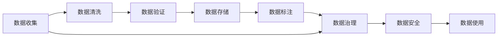

                 

## 1. 背景介绍

### 1.1 问题由来

随着人工智能技术的快速发展，数据已经成为推动AI应用的重要驱动力。无论是算法模型的训练、优化还是应用落地，都离不开对大规模、高质量数据的依赖。然而，数据管理却成为很多AI创业公司面临的一大挑战。数据收集、存储、清洗、标注等环节的繁琐和复杂，常常阻碍AI项目的发展。

因此，本文将基于多年AI项目实践，分享一些数据管理方面的实用经验。希望能帮助AI创业团队更好地应对数据管理问题，加速AI技术在各个垂直领域的落地应用。

### 1.2 问题核心关键点

数据管理涉及数据收集、存储、清洗、标注、模型训练等多个环节。如何高效、科学地进行数据管理，是AI创业成功的关键。具体而言，需要关注以下几个核心点：

- 数据质量：确保数据准确性、完整性和一致性，避免因数据错误带来的模型偏差。
- 数据量：保证数据规模足够大，覆盖多样的应用场景和用户行为。
- 数据来源：选择可靠的数据来源，确保数据真实、可信。
- 数据安全：保护用户隐私，确保数据不被滥用或泄露。
- 数据标注：保证标注结果的准确性和可解释性，为模型训练提供可靠的基础。

本文将围绕这些关键点，探讨数据管理的策略和实践经验。

## 2. 核心概念与联系

### 2.1 核心概念概述

在AI创业中，数据管理是至关重要的环节。它不仅影响模型的训练效果，还决定着AI技术的落地应用和商业价值。以下是几个核心概念及其关联：

- **数据质量管理**：通过数据清洗、数据验证等手段，确保数据的准确性和一致性。
- **数据标注管理**：设计科学的标注规范，使用高质量的标注工具，保证标注结果的可靠性和可解释性。
- **数据存储管理**：选择适合的数据存储技术，确保数据的快速读写和高效查询。
- **数据安全管理**：采用加密、权限控制等手段，保护用户隐私和数据安全。
- **数据治理**：通过数据标准、数据字典、数据治理平台等，实现数据的全生命周期管理。

这些核心概念构成了数据管理的整体框架，相互支撑，共同作用。

### 2.2 核心概念原理和架构的 Mermaid 流程图



这个流程图展示了数据管理各个环节之间的逻辑关系。数据从收集到使用，经过清洗、验证、标注、治理和保护等多个环节，最终形成可用于模型训练和应用的数据集。

## 3. 核心算法原理 & 具体操作步骤

### 3.1 算法原理概述

数据管理的核心是确保数据的质量、安全、治理和应用。以下是对这一过程进行概述：

#### 3.1.1 数据质量管理

数据质量管理的目的是通过一系列技术手段，确保数据的准确性、完整性和一致性。主要包括以下几个步骤：

- **数据清洗**：识别并修正数据中的错误、缺失值、异常值等问题。
- **数据验证**：使用统计方法和规则验证数据的一致性和准确性。
- **数据标准化**：通过统一数据格式和编码规则，提高数据一致性。

#### 3.1.2 数据标注管理

数据标注管理包括设计标注规范、选择标注工具、评估标注质量等环节。

- **标注规范设计**：制定详细、清晰的标注标准，确保标注结果的一致性和准确性。
- **标注工具选择**：选择合适的标注工具，确保标注过程高效、准确。
- **标注结果评估**：通过多轮验证和审核，确保标注结果的可靠性和可解释性。

#### 3.1.3 数据存储管理

数据存储管理包括选择合适的存储技术、设计合理的存储结构等环节。

- **存储技术选择**：根据数据类型和规模，选择合适的存储技术（如关系型数据库、NoSQL数据库、分布式文件系统等）。
- **存储结构设计**：设计合理的存储结构，确保数据的快速读写和高效查询。

#### 3.1.4 数据安全管理

数据安全管理的目的是保护数据不被滥用或泄露。主要包括以下几个步骤：

- **数据加密**：对数据进行加密存储和传输，确保数据安全。
- **权限控制**：通过权限控制，确保只有授权人员可以访问和使用数据。
- **审计和监控**：通过日志和监控系统，实时检测和防范数据安全威胁。

#### 3.1.5 数据治理

数据治理涉及数据标准、数据字典、数据治理平台等，实现数据的全生命周期管理。主要包括以下几个步骤：

- **数据标准制定**：制定统一的数据标准和规范，确保数据的一致性和可追溯性。
- **数据字典设计**：设计详细的数据字典，记录数据的元信息。
- **数据治理平台建设**：建设数据治理平台，实现数据的集中管理和统一管理。

### 3.2 算法步骤详解

#### 3.2.1 数据收集

数据收集是数据管理的第一步，需要关注以下几个关键点：

- **数据来源选择**：选择可靠的数据来源，确保数据的真实性和可信度。
- **数据采集技术**：根据数据类型和规模，选择合适的数据采集技术（如API接口、爬虫、传感器等）。
- **数据采集规范**：制定详细的数据采集规范，确保数据采集的准确性和一致性。

#### 3.2.2 数据清洗

数据清洗是保证数据质量的重要环节，主要包括以下几个步骤：

- **错误处理**：识别并修正数据中的错误、缺失值、异常值等问题。
- **格式统一**：通过数据转换，确保数据的格式和编码一致。
- **重复数据去重**：识别和删除重复数据，确保数据的不重复性。

#### 3.2.3 数据验证

数据验证是确保数据质量的重要手段，主要包括以下几个步骤：

- **数据一致性检查**：使用规则和算法检查数据的一致性和完整性。
- **数据准确性验证**：通过统计方法和规则验证数据的准确性。
- **数据异常检测**：使用机器学习算法检测数据中的异常点。

#### 3.2.4 数据标注

数据标注是确保模型训练效果的重要环节，主要包括以下几个步骤：

- **标注规范设计**：制定详细、清晰的标注标准，确保标注结果的一致性和准确性。
- **标注工具选择**：选择合适的标注工具，确保标注过程高效、准确。
- **标注结果评估**：通过多轮验证和审核，确保标注结果的可靠性和可解释性。

#### 3.2.5 数据存储

数据存储是确保数据安全、高效访问的重要环节，主要包括以下几个步骤：

- **存储技术选择**：根据数据类型和规模，选择合适的存储技术（如关系型数据库、NoSQL数据库、分布式文件系统等）。
- **存储结构设计**：设计合理的存储结构，确保数据的快速读写和高效查询。
- **数据备份和恢复**：定期备份数据，确保数据的安全和可恢复性。

#### 3.2.6 数据安全

数据安全是保护数据不被滥用或泄露的重要手段，主要包括以下几个步骤：

- **数据加密**：对数据进行加密存储和传输，确保数据安全。
- **权限控制**：通过权限控制，确保只有授权人员可以访问和使用数据。
- **审计和监控**：通过日志和监控系统，实时检测和防范数据安全威胁。

#### 3.2.7 数据治理

数据治理是确保数据全生命周期管理的有效手段，主要包括以下几个步骤：

- **数据标准制定**：制定统一的数据标准和规范，确保数据的一致性和可追溯性。
- **数据字典设计**：设计详细的数据字典，记录数据的元信息。
- **数据治理平台建设**：建设数据治理平台，实现数据的集中管理和统一管理。

### 3.3 算法优缺点

#### 3.3.1 数据质量管理

**优点**：
- 通过数据清洗和验证，确保数据的准确性和一致性。
- 通过数据标准化，提高数据一致性。

**缺点**：
- 数据清洗和验证过程繁琐，耗时耗力。
- 数据标准化需要制定详细规范，过程复杂。

#### 3.3.2 数据标注管理

**优点**：
- 通过标注规范和工具，确保标注结果的可靠性和可解释性。
- 通过多轮验证和审核，提高标注结果的准确性。

**缺点**：
- 标注过程需要人力参与，成本较高。
- 标注结果的准确性依赖于标注人员的素质和经验。

#### 3.3.3 数据存储管理

**优点**：
- 选择合适的存储技术，确保数据的快速读写和高效查询。
- 设计合理的存储结构，提高数据存储效率。

**缺点**：
- 存储技术选择和结构设计需要专业知识。
- 存储和备份过程耗时耗力。

#### 3.3.4 数据安全管理

**优点**：
- 通过数据加密和权限控制，确保数据的安全。
- 通过审计和监控，实时检测和防范数据安全威胁。

**缺点**：
- 数据加密和权限控制需要较高成本和技术要求。
- 审计和监控系统需要持续维护和更新。

#### 3.3.5 数据治理

**优点**：
- 通过数据标准和治理平台，实现数据的全生命周期管理。
- 提高数据的可追溯性和可管理性。

**缺点**：
- 数据标准制定和治理平台建设需要较高的技术和管理要求。
- 数据治理需要持续维护和更新。

### 3.4 算法应用领域

数据管理技术在AI创业中广泛应用，以下列举几个典型应用领域：

- **金融领域**：用于风控模型训练、信用评估、欺诈检测等任务。
- **医疗领域**：用于病历分析、疾病预测、治疗方案推荐等任务。
- **电商领域**：用于用户行为分析、个性化推荐、广告投放优化等任务。
- **智能制造**：用于生产过程监控、设备故障预测、质量控制等任务。
- **智能交通**：用于交通流量预测、交通事件识别、路径优化等任务。

## 4. 数学模型和公式 & 详细讲解 & 举例说明

### 4.1 数学模型构建

在数据管理中，数学模型可以用于数据质量的评估、数据的清洗和验证等环节。以下构建一个简单的数学模型：

设数据集为 $D=\{(x_i,y_i)\}_{i=1}^N$，其中 $x_i$ 为输入特征，$y_i$ 为输出标签。数据质量管理的目标是找到一个评估函数 $f(x_i)$，用于评估数据质量。

定义数据质量评估函数为 $f(x_i)=\sum_{j=1}^Mw_j\cdot g(x_i,j)$，其中 $w_j$ 为特征 $x_i$ 的重要性权重，$g(x_i,j)$ 为特征 $x_i$ 的评估函数。

数据清洗的目标是修正数据中的错误、缺失值和异常值。设修正后的数据为 $\hat{x_i}$，则数据清洗的数学模型为：

$$
\hat{x_i} = \min_{x_i} \sum_{j=1}^Mw_j\cdot g(x_i,j)
$$

### 4.2 公式推导过程

#### 4.2.1 数据质量评估函数

数据质量评估函数 $f(x_i)$ 的推导基于以下几个假设：

1. 每个特征 $x_i$ 对数据质量的影响程度不同，通过权重 $w_j$ 进行加权。
2. 每个特征 $x_i$ 对数据质量的评估可以通过函数 $g(x_i,j)$ 实现。
3. 数据质量评估函数 $f(x_i)$ 为所有特征的加权和。

通过以上假设，可以得出数据质量评估函数的推导公式：

$$
f(x_i)=\sum_{j=1}^Mw_j\cdot g(x_i,j)
$$

#### 4.2.2 数据清洗数学模型

数据清洗的数学模型基于以下假设：

1. 数据清洗的目标是找到最优的数据 $\hat{x_i}$，使其质量评估函数 $f(\hat{x_i})$ 最小化。
2. 数据清洗的过程是通过修正数据 $x_i$ 的某个特征 $x_j$ 来实现的。
3. 数据修正后，其质量评估函数变为 $f(x_i)+\Delta g(x_i,j)$，其中 $\Delta g(x_i,j)$ 为修正带来的质量提升。

通过以上假设，可以得出数据清洗数学模型的推导公式：

$$
\hat{x_i} = \arg\min_{x_i} \sum_{j=1}^Mw_j\cdot g(x_i,j)
$$

### 4.3 案例分析与讲解

#### 4.3.1 金融领域数据质量管理

在金融领域，数据质量管理尤为重要。以下以信用评估为例，展示数据质量管理的流程：

1. **数据收集**：收集用户的信用评分、收入、职业、贷款记录等数据。
2. **数据清洗**：识别并修正数据中的错误、缺失值、异常值等问题。
3. **数据验证**：使用统计方法和规则验证数据的一致性和准确性。
4. **数据标准化**：通过统一数据格式和编码规则，提高数据一致性。
5. **数据标注**：通过标注规范和工具，确保标注结果的可靠性和可解释性。

#### 4.3.2 医疗领域数据标注管理

在医疗领域，数据标注管理是确保模型训练效果的关键。以下以病历分析为例，展示数据标注管理的流程：

1. **标注规范设计**：制定详细、清晰的标注标准，确保标注结果的一致性和准确性。
2. **标注工具选择**：选择合适的标注工具，确保标注过程高效、准确。
3. **标注结果评估**：通过多轮验证和审核，确保标注结果的可靠性和可解释性。

## 5. 项目实践：代码实例和详细解释说明

### 5.1 开发环境搭建

#### 5.1.1 Python环境安装

安装Python 3.7以上版本，推荐使用Anaconda或Miniconda进行环境管理。

#### 5.1.2 依赖包安装

安装数据处理相关的依赖包，如pandas、numpy、scikit-learn、matplotlib等：

```bash
pip install pandas numpy scikit-learn matplotlib tqdm
```

#### 5.1.3 数据存储管理

选择合适的数据存储技术，如关系型数据库MySQL、NoSQL数据库MongoDB、分布式文件系统HDFS等。以下以MySQL为例，安装和配置MySQL数据库：

```bash
sudo apt-get install mysql-server
sudo systemctl start mysql
sudo systemctl enable mysql
```

### 5.2 源代码详细实现

#### 5.2.1 数据清洗

以下是一个简单的数据清洗示例，使用Python的pandas库实现：

```python
import pandas as pd

# 读取数据集
data = pd.read_csv('data.csv')

# 数据清洗
data = data.dropna()  # 删除缺失值
data = data[data['age'] > 0]  # 删除不合理值
data = data.drop_duplicates()  # 删除重复值

# 数据标准化
data['income'] = (data['income'] - data['income'].mean()) / data['income'].std()  # 标准化

# 数据保存
data.to_csv('cleaned_data.csv', index=False)
```

#### 5.2.2 数据标注

以下是一个简单的数据标注示例，使用Python的pandas库实现：

```python
import pandas as pd

# 读取数据集
data = pd.read_csv('data.csv')

# 数据标注
data['label'] = 0  # 初始标注为0
data.loc[data['income'] > 50000, 'label'] = 1  # 标注为1

# 数据保存
data.to_csv('annotated_data.csv', index=False)
```

#### 5.2.3 数据存储

以下是一个简单的数据存储示例，使用Python的pandas库和MySQL数据库实现：

```python
import pandas as pd
import mysql.connector

# 读取数据集
data = pd.read_csv('data.csv')

# 连接MySQL数据库
db = mysql.connector.connect(
    host='localhost',
    user='root',
    password='password',
    database='mydatabase'
)

# 数据存储
cursor = db.cursor()
cursor.execute("CREATE TABLE IF NOT EXISTS data (id INT AUTO_INCREMENT PRIMARY KEY, income FLOAT, label INT)")
for i, row in data.iterrows():
    cursor.execute("INSERT INTO data (income, label) VALUES (%s, %s)", (row['income'], row['label']))
db.commit()
```

### 5.3 代码解读与分析

#### 5.3.1 数据清洗

数据清洗的目标是修正数据中的错误、缺失值和异常值。以下代码示例展示了如何删除缺失值、不合理值和重复值：

- `dropna()`：删除缺失值。
- `drop_duplicates()`：删除重复值。
- `drop()`：删除不合理值。

#### 5.3.2 数据标注

数据标注的目标是给数据打上标签。以下代码示例展示了如何初始化标签并根据条件进行标注：

- `loc[]`：根据条件进行选择。
- `assign()`：给数据赋值标签。

#### 5.3.3 数据存储

数据存储的目标是将数据保存到数据库中。以下代码示例展示了如何连接MySQL数据库并插入数据：

- `connect()`：连接MySQL数据库。
- `cursor.execute()`：执行SQL语句。
- `commit()`：提交事务。

### 5.4 运行结果展示

#### 5.4.1 数据清洗结果

```python
import pandas as pd

# 读取清洗后的数据集
cleaned_data = pd.read_csv('cleaned_data.csv')

# 显示前5行
cleaned_data.head()
```

#### 5.4.2 数据标注结果

```python
import pandas as pd

# 读取标注后的数据集
annotated_data = pd.read_csv('annotated_data.csv')

# 显示前5行
annotated_data.head()
```

#### 5.4.3 数据存储结果

```python
import pandas as pd
import mysql.connector

# 读取数据集
data = pd.read_csv('data.csv')

# 连接MySQL数据库
db = mysql.connector.connect(
    host='localhost',
    user='root',
    password='password',
    database='mydatabase'
)

# 数据存储
cursor = db.cursor()
cursor.execute("CREATE TABLE IF NOT EXISTS data (id INT AUTO_INCREMENT PRIMARY KEY, income FLOAT, label INT)")
for i, row in data.iterrows():
    cursor.execute("INSERT INTO data (income, label) VALUES (%s, %s)", (row['income'], row['label']))
db.commit()
```

## 6. 实际应用场景

### 6.1 金融领域

在金融领域，数据管理尤为重要。以下以信用评估为例，展示数据管理的应用场景：

1. **数据收集**：收集用户的信用评分、收入、职业、贷款记录等数据。
2. **数据清洗**：识别并修正数据中的错误、缺失值、异常值等问题。
3. **数据验证**：使用统计方法和规则验证数据的一致性和准确性。
4. **数据标准化**：通过统一数据格式和编码规则，提高数据一致性。
5. **数据标注**：通过标注规范和工具，确保标注结果的可靠性和可解释性。
6. **数据存储**：选择合适的数据存储技术，确保数据的快速读写和高效查询。
7. **数据治理**：制定统一的数据标准和规范，实现数据的全生命周期管理。

### 6.2 医疗领域

在医疗领域，数据管理同样是关键。以下以病历分析为例，展示数据管理的应用场景：

1. **数据收集**：收集患者的病历数据，包括症状、检查结果、诊断等。
2. **数据清洗**：识别并修正数据中的错误、缺失值、异常值等问题。
3. **数据验证**：使用统计方法和规则验证数据的一致性和准确性。
4. **数据标准化**：通过统一数据格式和编码规则，提高数据一致性。
5. **数据标注**：通过标注规范和工具，确保标注结果的可靠性和可解释性。
6. **数据存储**：选择合适的数据存储技术，确保数据的快速读写和高效查询。
7. **数据治理**：制定统一的数据标准和规范，实现数据的全生命周期管理。

## 7. 工具和资源推荐

### 7.1 学习资源推荐

1. 《Python数据科学手册》：一本全面的Python数据科学学习指南，涵盖数据处理、数据可视化、机器学习等内容。
2. 《数据科学基础》课程：由Coursera开设，涵盖数据清洗、数据可视化、数据处理等内容。
3. 《机器学习实战》：一本实用的机器学习教程，涵盖数据预处理、模型训练、模型评估等内容。
4. 《数据治理基础》课程：由Udacity开设，涵盖数据治理、数据标准化、数据治理平台等内容。
5. 《数据标注规范设计》课程：由Kaggle开设，涵盖标注规范设计、标注工具选择、标注结果评估等内容。

### 7.2 开发工具推荐

1. Python：一款通用的编程语言，广泛用于数据处理和机器学习开发。
2. pandas：一个强大的数据处理库，支持数据清洗、数据标准化、数据标注等功能。
3. numpy：一个高性能的科学计算库，支持数组操作和数学计算。
4. scikit-learn：一个开源的机器学习库，支持模型训练、模型评估、数据处理等功能。
5. matplotlib：一个绘图库，支持数据可视化。

### 7.3 相关论文推荐

1. "Data Preprocessing Techniques in Machine Learning"：一篇综述性论文，详细介绍了数据预处理技术。
2. "A Survey on Data Quality Management"：一篇综述性论文，详细介绍了数据质量管理技术。
3. "Data Annotating and Annotation Management"：一篇综述性论文，详细介绍了数据标注技术和管理方法。
4. "Data Governance: A Survey"：一篇综述性论文，详细介绍了数据治理技术。
5. "Data Privacy and Security: A Survey"：一篇综述性论文，详细介绍了数据隐私和安全技术。

## 8. 总结：未来发展趋势与挑战

### 8.1 研究成果总结

数据管理是大规模AI项目的重要基础，通过有效的数据质量管理、数据标注管理、数据存储管理和数据治理，可以实现数据的准确性、完整性和一致性，为AI模型的训练和应用提供可靠的基础。本文基于多年AI项目实践，分享了数据管理的实用经验，希望能为AI创业团队提供有价值的参考。

### 8.2 未来发展趋势

未来的数据管理将更加智能化和自动化。随着人工智能技术的不断进步，数据清洗、数据标注和数据治理等环节将逐渐实现自动化和智能化。通过引入机器学习和自然语言处理技术，数据管理过程将更加高效、准确和灵活。

### 8.3 面临的挑战

虽然数据管理技术不断进步，但仍面临以下挑战：

1. 数据质量和数据隐私：如何在保证数据质量的同时，保护用户隐私和数据安全。
2. 数据标注和数据治理：如何提高数据标注和数据治理的效率和准确性。
3. 数据标准化和数据规范：如何制定统一的数据标准和规范，实现数据的一致性和可追溯性。
4. 数据存储和管理：如何选择合适的数据存储技术，实现数据的快速读写和高效查询。
5. 数据治理平台：如何建设高效、易用的数据治理平台，实现数据的集中管理和统一管理。

### 8.4 研究展望

未来的数据管理技术将进一步提升智能化和自动化水平，推动AI技术的广泛应用。以下展望未来发展趋势：

1. 数据清洗自动化：引入机器学习和自然语言处理技术，实现数据清洗的自动化和智能化。
2. 数据标注智能化：引入模型生成式、交互式标注工具，提高数据标注的效率和准确性。
3. 数据治理平台化：建设高效、易用的数据治理平台，实现数据的集中管理和统一管理。
4. 数据隐私保护：引入隐私保护技术，如数据加密、隐私计算等，保护用户隐私和数据安全。
5. 数据标准化规范：制定统一的数据标准和规范，实现数据的一致性和可追溯性。

总之，数据管理是大规模AI项目的重要基础，通过有效的数据质量管理、数据标注管理、数据存储管理和数据治理，可以实现数据的准确性、完整性和一致性，为AI模型的训练和应用提供可靠的基础。面对未来的挑战，需要持续探索和创新，推动数据管理技术的发展和进步。

## 9. 附录：常见问题与解答

**Q1：如何提高数据标注的效率和准确性？**

A: 提高数据标注的效率和准确性需要综合考虑以下几个方面：

1. **标注规范设计**：制定详细、清晰的标注标准，确保标注结果的一致性和准确性。
2. **标注工具选择**：选择合适的标注工具，确保标注过程高效、准确。
3. **多轮验证和审核**：通过多轮验证和审核，确保标注结果的可靠性和可解释性。
4. **自动标注辅助**：引入自动标注工具，如基于规则的标注、基于模型的标注等，提高标注效率。

**Q2：如何保护数据隐私和数据安全？**

A: 保护数据隐私和数据安全需要采取以下措施：

1. **数据加密**：对数据进行加密存储和传输，确保数据安全。
2. **权限控制**：通过权限控制，确保只有授权人员可以访问和使用数据。
3. **审计和监控**：通过日志和监控系统，实时检测和防范数据安全威胁。
4. **隐私保护技术**：引入隐私保护技术，如差分隐私、联邦学习等，保护用户隐私。

**Q3：如何选择适合的数据存储技术？**

A: 选择适合的数据存储技术需要考虑以下因素：

1. **数据类型**：根据数据类型选择适合的数据存储技术，如关系型数据库、NoSQL数据库、分布式文件系统等。
2. **数据规模**：根据数据规模选择合适的存储技术，如小规模数据可以选择文件系统，大规模数据可以选择分布式文件系统或分布式数据库。
3. **读写频率**：根据数据读写频率选择合适的存储技术，如频繁读写可以选择内存数据库，不频繁读写可以选择磁盘存储。

**Q4：如何进行数据治理？**

A: 进行数据治理需要采取以下措施：

1. **数据标准制定**：制定统一的数据标准和规范，确保数据的一致性和可追溯性。
2. **数据字典设计**：设计详细的数据字典，记录数据的元信息。
3. **数据治理平台建设**：建设数据治理平台，实现数据的集中管理和统一管理。
4. **数据质量监控**：通过数据质量监控系统，实时检测和防范数据质量问题。

**Q5：如何进行数据清洗？**

A: 进行数据清洗需要采取以下措施：

1. **错误处理**：识别并修正数据中的错误、缺失值、异常值等问题。
2. **格式统一**：通过数据转换，确保数据的格式和编码一致。
3. **重复数据去重**：识别和删除重复数据，确保数据的不重复性。
4. **数据标准化**：通过统一数据格式和编码规则，提高数据一致性。

作者：禅与计算机程序设计艺术 / Zen and the Art of Computer Programming

