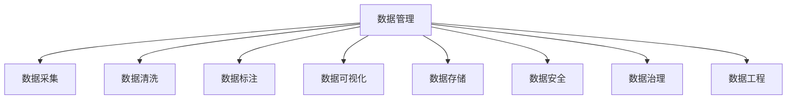

                 

# AI创业：数据管理的标准流程

> 关键词：数据管理，AI创业，标准流程，数据质量，数据安全，数据治理，数据工程

## 1. 背景介绍

随着人工智能(AI)技术日益成熟，越来越多的创业公司在各行各业寻求AI赋能，以期提升业务效率、优化用户体验和拓展市场竞争力。然而，AI系统的高效运行离不开高质量的数据支持。数据管理已成为AI创业的重要基础和核心环节。本文将系统介绍AI创业中数据管理的标准流程，帮助创业者理清数据管理的脉络，确保AI项目顺利推进。

## 2. 核心概念与联系

### 2.1 核心概念概述

为更好地理解AI创业中的数据管理，本节将介绍几个关键概念：

- **数据管理(Data Management)**：涉及数据的采集、存储、清洗、标注、分析和可视化等环节，旨在确保数据的高质量、完整性和可用性。

- **AI创业(AI Startup)**：指利用AI技术为特定行业或用户需求提供创新性解决方案的创业活动。

- **数据质量(Data Quality)**：指数据集在准确性、完整性、一致性、及时性等方面的品质，是衡量数据管理成效的重要指标。

- **数据安全(Data Security)**：涉及数据加密、访问控制、审计追踪等，保障数据在传输、存储和使用过程中的安全性。

- **数据治理(Data Governance)**：定义数据管理流程、职责和度量标准，确保数据管理过程的规范化和透明化。

- **数据工程(Data Engineering)**：采用工程化方法处理数据，涉及数据集成、数据清洗、数据流优化等，提升数据处理的效率和可靠性。

这些概念之间的逻辑关系可以通过以下Mermaid流程图来展示：



这个流程图展示了这个过程的逻辑关系：

1. 数据管理过程涉及数据的全面管理，包括从数据采集到存储、清洗、标注、可视化等多个环节。
2. 数据采集是数据管理的起点，确保数据的全面性和多样性。
3. 数据清洗和标注是提升数据质量的关键步骤，确保数据的准确性和完整性。
4. 数据存储保障数据的安全性和可用性，为后续分析和应用提供支持。
5. 数据可视化使数据更直观、易于理解，辅助决策和业务分析。
6. 数据安全保护数据不被非法访问、篡改或泄露。
7. 数据治理确保数据管理的标准化和规范化。
8. 数据工程提升数据处理效率，优化数据流。

## 3. 核心算法原理 & 具体操作步骤

### 3.1 算法原理概述

AI创业中数据管理的核心在于确保数据的高质量和可靠性，通过系统化的流程控制和管理策略，保证数据采集、清洗、存储和分析的每一个环节都符合业务需求和标准。

主要算法原理包括：

- **数据清洗(Data Cleaning)**：通过算法自动或人工清洗掉噪声数据、重复数据和错误数据，提升数据质量。
- **数据标注(Data Annotation)**：为数据添加标签或注释，帮助模型学习正确的语义和关系。
- **数据可视化(Data Visualization)**：通过图表展示数据特征和趋势，帮助理解和分析数据。
- **数据安全(Data Security)**：采用加密、权限控制等技术，保护数据免受非法访问和攻击。
- **数据工程(Data Engineering)**：设计数据流和处理管道，提升数据处理效率和自动化水平。

### 3.2 算法步骤详解

基于上述算法原理，AI创业中数据管理的标准流程通常包括以下几个步骤：

**Step 1: 数据采集**

1. **明确需求**：确定数据采集的具体需求，包括数据类型、来源、格式和数量等。
2. **选择合适的数据源**：根据需求，选择公有数据源、爬虫抓取或API接口获取数据。
3. **采集数据**：采用技术手段（如Web抓取、API请求）获取数据，存储在临时数据仓库中。

**Step 2: 数据清洗**

1. **初步清洗**：通过自动化工具（如Pandas、Apache Spark）去除重复数据、无效数据和格式不一致的数据。
2. **处理异常值**：使用统计方法和算法（如均值插补、聚类分析）处理异常值和缺失值。
3. **数据标准化**：统一数据格式和单位，确保数据的可比较性和一致性。

**Step 3: 数据标注**

1. **定义标注规则**：制定清晰的标注规范，包括标签种类、注释格式和标准。
2. **人工标注**：对于需要人工参与的标注任务，选择合适的标注人员，进行标注和审核。
3. **自动标注**：使用预训练的模型（如BERT、GAN）自动为数据生成标签和注释。

**Step 4: 数据存储**

1. **选择合适的存储方式**：根据数据类型和规模，选择合适的存储方式（如关系型数据库、NoSQL数据库、数据湖）。
2. **数据备份和冗余**：确保数据的备份和冗余，防止数据丢失。
3. **数据访问控制**：采用身份认证、访问权限等措施，控制数据的访问和使用权限。

**Step 5: 数据可视化**

1. **选择合适的可视化工具**：根据需求选择可视化工具（如Tableau、Power BI、Grafana）。
2. **设计可视化报表**：定义数据展示的维度、指标和格式，设计可视化报表。
3. **数据交互和探索**：增加交互功能（如滑块、钻取、动态图），提升数据探索和分析效率。

**Step 6: 数据安全**

1. **数据加密**：对敏感数据进行加密处理，防止数据泄露。
2. **访问控制**：使用身份验证和权限管理，限制数据访问权限。
3. **审计和监控**：记录数据访问日志，监控数据使用情况，及时发现异常行为。

**Step 7: 数据治理**

1. **定义治理框架**：制定数据治理的流程和规范，包括数据收集、处理、存储和使用的全生命周期管理。
2. **数据质量监控**：建立数据质量监控指标体系，持续跟踪和评估数据质量。
3. **合规性管理**：确保数据管理符合法律法规和行业标准，避免法律风险。

**Step 8: 数据工程**

1. **数据流设计**：设计数据流的架构，确保数据处理的连贯性和高效性。
2. **数据清洗和转换**：采用ETL（Extract, Transform, Load）技术，清洗和转换数据。
3. **数据管道构建**：搭建自动化数据处理管道，实现数据的自动抽取、清洗和加载。

通过以上步骤，AI创业中的数据管理将形成一个全面、系统化的流程，保障数据的高质量和安全性，提升数据管理和分析的效率和可靠性。

### 3.3 算法优缺点

**优点**：

1. **系统化流程**：采用标准化的流程和规范，确保数据管理的规范化和透明化。
2. **高可靠性**：通过清洗、标注和可视化等环节提升数据质量，保证数据的一致性和可用性。
3. **高效性**：使用自动化工具和数据工程方法，提升数据处理和分析的效率。
4. **安全性**：通过加密和访问控制等措施，保障数据的安全性。

**缺点**：

1. **初始成本高**：数据管理和清洗过程需要大量人力和技术投入，初期成本较高。
2. **技术复杂**：需要综合运用多种技术和工具，对技术团队要求较高。
3. **数据一致性问题**：数据清洗和标注可能存在不一致性，需要进行多次校验和验证。
4. **数据质量依赖**：数据采集和清洗效果依赖于数据源的质量和数量。

## 4. 数学模型和公式 & 详细讲解 & 举例说明

### 4.1 数学模型构建

本节将使用数学语言对数据管理的标准流程进行更加严格的刻画。

假设数据管理任务中涉及 $N$ 条数据记录，每条记录包含 $M$ 个特征值。数据管理的数学模型可以表示为：

$$
\min_{x} \sum_{i=1}^N \ell(x, d_i)
$$

其中 $d_i$ 表示第 $i$ 条数据记录，$x$ 表示数据管理的操作（如清洗、标注、存储等），$\ell$ 表示损失函数，用于衡量操作 $x$ 对数据 $d_i$ 的影响。

### 4.2 公式推导过程

以下我们以数据清洗为例，推导一个简单的损失函数。

假设数据集中存在异常值 $d_i$，其处理方式有三种：保留、修改、删除。我们可以定义一个二元特征向量 $y_i$ 表示 $d_i$ 的处理方式，其中 $y_i=1$ 表示保留，$y_i=0$ 表示删除。

则数据清洗的损失函数可以表示为：

$$
\ell(x, d_i) = \left\{
\begin{aligned}
&0, &\text{if } y_i=1 \\
&\alpha, &\text{if } y_i=0 \text{ and } d_i \text{ is modified} \\
&\beta \times \max(d_i), &\text{if } y_i=0 \text{ and } d_i \text{ is deleted}
\end{aligned}
\right.
$$

其中 $\alpha$ 和 $\beta$ 为惩罚系数，用于控制修改和删除的成本。

将损失函数代入数据管理的数学模型，得：

$$
\min_{x} \sum_{i=1}^N \ell(x, d_i) = \min_{x} \sum_{i=1}^N \left\{
\begin{aligned}
&0, &\text{if } y_i=1 \\
&\alpha, &\text{if } y_i=0 \text{ and } d_i \text{ is modified} \\
&\beta \times \max(d_i), &\text{if } y_i=0 \text{ and } d_i \text{ is deleted}
\end{aligned}
\right.
$$

### 4.3 案例分析与讲解

以金融风控为例，介绍数据管理在实际应用中的流程和案例。

1. **数据采集**：从银行系统中采集客户的交易记录，包括交易金额、时间、地点等信息。
2. **数据清洗**：去除重复记录、格式不一致的数据，处理缺失值和异常值。
3. **数据标注**：标记交易记录为正常或异常，基于规则或专家知识进行标注。
4. **数据存储**：将处理后的数据存储到数据库中，设定访问权限和备份策略。
5. **数据可视化**：设计仪表盘，展示客户交易的趋势和异常情况。
6. **数据安全**：对敏感数据进行加密，限制系统访问权限，记录访问日志。
7. **数据治理**：制定数据管理流程和规范，定期评估数据质量，确保合规性。
8. **数据工程**：搭建数据处理管道，实现自动化数据抽取和清洗。

通过以上步骤，金融机构可以构建一个高效、可靠的数据管理流程，提升风险识别和控制能力。

## 5. 项目实践：代码实例和详细解释说明

### 5.1 开发环境搭建

在进行数据管理实践前，我们需要准备好开发环境。以下是使用Python进行PyTorch开发的环境配置流程：

1. 安装Anaconda：从官网下载并安装Anaconda，用于创建独立的Python环境。

2. 创建并激活虚拟环境：
```bash
conda create -n data-management python=3.8 
conda activate data-management
```

3. 安装PyTorch：根据CUDA版本，从官网获取对应的安装命令。例如：
```bash
conda install pytorch torchvision torchaudio cudatoolkit=11.1 -c pytorch -c conda-forge
```

4. 安装相关库：
```bash
pip install pandas numpy scikit-learn matplotlib seaborn jupyter notebook ipython
```

完成上述步骤后，即可在`data-management`环境中开始数据管理实践。

### 5.2 源代码详细实现

下面我们以金融风控为例，给出使用PyTorch进行数据清洗的PyTorch代码实现。

首先，定义数据清洗函数：

```python
import pandas as pd
import numpy as np
from sklearn.preprocessing import StandardScaler

def clean_data(data_path):
    # 读取数据文件
    df = pd.read_csv(data_path)
    
    # 删除重复记录
    df = df.drop_duplicates()
    
    # 处理缺失值
    df = df.fillna(df.mean())
    
    # 数据标准化
    scaler = StandardScaler()
    df = scaler.fit_transform(df)
    
    # 异常值处理
    df = df[(df.abs() < 3).all(axis=1)]
    
    return df
```

然后，定义数据标注函数：

```python
from sklearn.metrics import precision_recall_curve

def annotate_data(data_path):
    # 读取数据文件
    df = pd.read_csv(data_path)
    
    # 标记异常值
    df['label'] = df['amount'] > df['amount'].mean()
    
    # 绘制ROC曲线
    precision, recall, _ = precision_recall_curve(df['label'], df['amount'])
    
    # 计算精确率和召回率
    f1_score = 2 * precision * recall / (precision + recall)
    
    return df, f1_score
```

最后，启动数据管理流程并在测试集上评估：

```python
data_path = 'financial_data.csv'
cleaned_data = clean_data(data_path)
annotated_data, f1_score = annotate_data(cleaned_data)

print(f'F1 Score: {f1_score:.2f}')
```

以上就是使用PyTorch进行金融风控数据清洗的完整代码实现。可以看到，PyTorch提供了强大的数据处理工具和机器学习库，可以高效地完成数据清洗和标注任务。

### 5.3 代码解读与分析

让我们再详细解读一下关键代码的实现细节：

**clean_data函数**：
- 读取数据文件，删除重复记录，处理缺失值，数据标准化，去除异常值，最后返回处理后的数据。
- 使用Pandas库进行数据处理，Pandas提供了便捷的缺失值处理、数据标准化等函数。

**annotate_data函数**：
- 读取数据文件，标记异常值，计算精确率和召回率，最后返回标注后的数据和F1 Score指标。
- 使用Scikit-learn库计算精确率和召回率，Scikit-learn提供了丰富的机器学习工具和评估指标。

**数据管理流程**：
- 数据清洗和标注通常需要多次迭代，不断调整清洗和标注规则，以达到最佳效果。
- 数据清洗和标注完成后，进行数据存储、可视化、安全防护和治理，确保数据的高质量和安全。

通过上述流程，我们可以高效地完成数据管理的全生命周期管理，确保AI系统的数据质量和安全性。

## 6. 实际应用场景

### 6.1 智能医疗

在智能医疗领域，数据管理对诊断和治疗具有重要意义。医疗数据包括患者病历、检查结果、诊断报告等，这些数据的高质量直接影响医疗决策和疗效。

通过系统化的数据管理流程，医疗机构可以确保数据的完整性、准确性和一致性。例如，清洗和标注患者的病历数据，存储和保护敏感信息，提供可视化的病历报告，监测数据质量，确保符合医疗规范和伦理标准。

### 6.2 智能零售

智能零售领域涉及大量的客户交易数据和产品信息，数据管理对推荐系统和库存管理至关重要。通过清洗和标注交易数据，存储和保护客户信息，提供可视化的销售分析报表，确保数据的可靠性和安全性。

智能零售系统可以根据客户的历史交易记录和偏好，生成个性化的推荐商品，提升用户体验和销售额。同时，通过数据治理和工程，优化库存管理，降低库存成本。

### 6.3 智能交通

智能交通系统中涉及大量的交通流量数据和车辆信息，数据管理对路况分析和交通控制至关重要。通过清洗和标注交通数据，存储和保护车辆信息，提供可视化的交通流量分析，监测数据质量，确保符合交通规范和安全标准。

智能交通系统可以根据交通流量数据，预测路况，调整交通信号，提升交通效率和安全性。同时，通过数据治理和工程，优化城市交通管理，减少交通拥堵。

### 6.4 未来应用展望

未来，随着AI技术的不断进步，数据管理将面临更多挑战和机遇：

1. **自动化数据管理**：通过自动化工具和算法，减少人工干预，提升数据处理的效率和准确性。
2. **多源数据融合**：将不同来源的数据进行融合和整合，提升数据的全面性和多样性。
3. **大数据分析**：采用大数据技术，处理和分析海量数据，提升数据管理的规模和深度。
4. **跨领域应用**：将数据管理技术应用于更多行业领域，提升数据管理的通用性和灵活性。

## 7. 工具和资源推荐

### 7.1 学习资源推荐

为了帮助开发者系统掌握数据管理的理论基础和实践技巧，这里推荐一些优质的学习资源：

1. **《Data Management: Concepts, Models, and Methods》书籍**：全面介绍了数据管理的基本概念、模型和方法，适合初学者入门。
2. **《Data Science and Machine Learning Bootcamp with Python》课程**：通过Python实践，学习数据清洗、标注、可视化等技能。
3. **《Data Engineering: Practices and Design》书籍**：详细介绍了数据工程的基本实践和设计原则，适合有经验的数据工程师。
4. **Kaggle平台**：提供大量的数据集和竞赛项目，适合实战练习。
5. **Data Science Central社区**：提供丰富的学习资源和经验分享，适合交流讨论。

通过对这些资源的学习实践，相信你一定能够快速掌握数据管理的精髓，并用于解决实际的数据问题。

### 7.2 开发工具推荐

高效的开发离不开优秀的工具支持。以下是几款用于数据管理开发的常用工具：

1. **Pandas**：Python数据处理库，支持高效的数据清洗和分析。
2. **NumPy**：Python科学计算库，支持高效的矩阵运算和数据处理。
3. **Scikit-learn**：Python机器学习库，支持数据标注、特征工程和模型评估。
4. **Dask**：分布式数据处理库，支持大规模数据处理和分析。
5. **TensorBoard**：TensorFlow可视化工具，支持实时监测和调试。
6. **Apache Airflow**：分布式数据管道工具，支持任务调度和管理。

合理利用这些工具，可以显著提升数据管理任务的开发效率，加快创新迭代的步伐。

### 7.3 相关论文推荐

数据管理的发展源于学界的持续研究。以下是几篇奠基性的相关论文，推荐阅读：

1. **《Data Mining and Statistical Learning: Concepts and Techniques》书籍**：详细介绍了数据挖掘和统计学习的基本概念和技术，适合理论研究。
2. **《Big Data: Principles and Best Practices of Scalable Realtime Data Systems》书籍**：介绍了大数据处理的基本原则和最佳实践，适合工程实践。
3. **《An Introduction to Data Engineering》书籍**：全面介绍了数据工程的基本概念和实践，适合入门学习。
4. **《The Data Warehousing and Data Mining Handbook》书籍**：介绍了数据仓库和数据挖掘的基本概念和技术，适合应用实践。
5. **《Data Management and Statistical Learning》论文**：介绍了数据管理和统计学习的结合，适合理论研究。

这些论文代表了大数据管理的发展脉络。通过学习这些前沿成果，可以帮助研究者把握学科前进方向，激发更多的创新灵感。

## 8. 总结：未来发展趋势与挑战

### 8.1 研究成果总结

本文对AI创业中数据管理的标准流程进行了全面系统的介绍。首先阐述了数据管理在AI创业中的重要性，明确了数据管理对AI系统高效运行的基础作用。其次，从原理到实践，详细讲解了数据管理的标准流程和关键步骤，给出了数据管理任务开发的完整代码实例。同时，本文还广泛探讨了数据管理在智能医疗、智能零售、智能交通等多个行业领域的应用前景，展示了数据管理范式的广阔前景。此外，本文精选了数据管理的各类学习资源，力求为读者提供全方位的技术指引。

通过本文的系统梳理，可以看到，数据管理已成为AI创业中的重要环节，确保了数据的高质量和可靠性，为AI系统的高效运行提供了坚实的基础。未来，伴随数据管理技术的不断演进，AI创业的发展将更加稳健，数据驱动的智能系统将覆盖更多领域，为人类社会带来深远的影响。

### 8.2 未来发展趋势

展望未来，数据管理将呈现以下几个发展趋势：

1. **自动化数据管理**：通过自动化工具和算法，减少人工干预，提升数据处理的效率和准确性。
2. **多源数据融合**：将不同来源的数据进行融合和整合，提升数据的全面性和多样性。
3. **大数据分析**：采用大数据技术，处理和分析海量数据，提升数据管理的规模和深度。
4. **跨领域应用**：将数据管理技术应用于更多行业领域，提升数据管理的通用性和灵活性。

### 8.3 面临的挑战

尽管数据管理技术已经取得了显著进展，但在迈向更加智能化、普适化应用的过程中，它仍面临诸多挑战：

1. **数据质量瓶颈**：数据采集、清洗和标注过程需要大量人力和技术投入，初期成本较高。如何提高数据处理效率和自动化水平，降低人力成本，是一个重要挑战。
2. **数据隐私和安全**：数据管理过程中涉及大量的敏感信息，数据泄露和隐私问题可能带来法律和伦理风险。如何保障数据安全，是一个重要挑战。
3. **数据治理复杂性**：数据治理需要制定全面的规范和流程，确保数据管理的标准化和透明化。如何构建高效的数据治理框架，是一个重要挑战。
4. **数据工程效率**：数据工程需要设计高效的数据流和管道，提升数据处理的效率和自动化水平。如何优化数据工程流程，提高数据处理效率，是一个重要挑战。

### 8.4 研究展望

面对数据管理面临的这些挑战，未来的研究需要在以下几个方面寻求新的突破：

1. **自动化数据管理**：开发自动化数据清洗、标注和治理工具，提升数据处理的效率和准确性。
2. **数据隐私和安全**：采用数据加密、匿名化等技术，保护数据隐私和安全。
3. **数据治理框架**：设计高效的数据治理框架，确保数据管理的标准化和透明化。
4. **数据工程优化**：优化数据流和管道设计，提升数据处理的效率和自动化水平。
5. **数据质量提升**：引入数据质量评估和监控机制，持续提升数据质量。

这些研究方向的探索，必将引领数据管理技术迈向更高的台阶，为构建高效、可靠的数据管理系统铺平道路。面向未来，数据管理技术还需要与其他人工智能技术进行更深入的融合，如知识表示、因果推理、强化学习等，多路径协同发力，共同推动数据驱动的智能系统进步。只有勇于创新、敢于突破，才能不断拓展数据管理的边界，让智能技术更好地造福人类社会。

## 9. 附录：常见问题与解答

**Q1：数据管理对AI创业有多重要？**

A: 数据管理是AI创业中的重要基础，直接影响AI系统的性能和可靠性。高质量的数据是AI算法训练和调优的前提，数据的准确性和完整性决定了AI系统的决策能力和预测能力。

**Q2：数据管理需要哪些关键步骤？**

A: 数据管理的关键步骤包括数据采集、清洗、标注、存储、可视化、安全防护和治理等。每个环节都需要精心设计和实施，才能确保数据的高质量和可用性。

**Q3：数据管理的自动化有哪些方法？**

A: 数据管理的自动化可以通过自动化工具、算法和流程来实现。例如，使用Pandas、NumPy等工具自动化数据清洗和处理，使用Scikit-learn等库自动化数据标注和特征工程，使用Dask等库实现分布式数据处理，使用Airflow等工具实现自动化任务调度和管理。

**Q4：数据管理的未来发展趋势是什么？**

A: 数据管理的未来发展趋势包括自动化、多源数据融合、大数据分析和跨领域应用等。通过自动化工具和算法，减少人工干预，提升数据处理的效率和准确性。融合不同来源的数据，提升数据的全面性和多样性。采用大数据技术，处理和分析海量数据，提升数据管理的规模和深度。将数据管理技术应用于更多行业领域，提升数据管理的通用性和灵活性。

通过上述问题的解答，可以看到，数据管理在AI创业中的重要性不可忽视，未来的发展将更加智能化、普适化和自动化。只有不断优化数据管理流程，提升数据处理效率和自动化水平，才能确保AI系统的稳定和高效运行。

