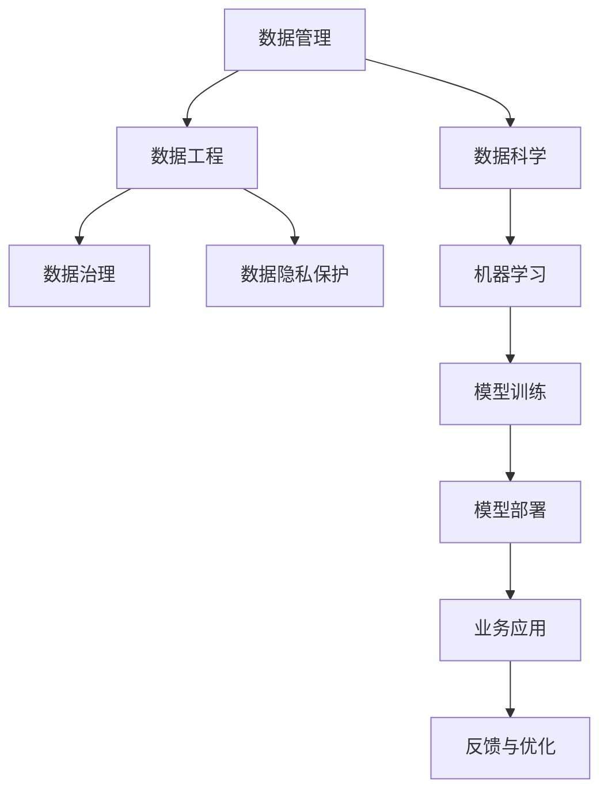

                 

# AI创业：数据管理的策略与应用

> 关键词：数据管理,策略,应用,AI创业,机器学习,数据工程,数据科学

## 1. 背景介绍

### 1.1 问题由来
在AI创业领域，数据管理是一个关键环节。高质量、大规模、多样化的数据，是推动AI模型发展、提升业务性能的重要基础。然而，面对海量复杂的数据，如何在AI创业初期高效、准确地进行数据管理，成为许多初创公司面临的重大挑战。本文将深入探讨数据管理在AI创业中的策略与应用，为企业提供实用建议和工具，帮助他们顺利实现从数据收集到模型构建的全流程管理。

### 1.2 问题核心关键点
数据管理的核心关键点包括以下几点：
1. **数据质量控制**：保证数据集的准确性、完整性和一致性，是AI模型训练的基础。
2. **数据治理与标准化**：建立统一的数据治理框架，规范数据处理流程，确保数据一致性。
3. **数据存储与管理**：选择合适的存储技术，构建高效的数据管理系统，支持快速数据访问与处理。
4. **数据安全与隐私保护**：确保数据使用的合规性，保护用户隐私，避免数据泄露风险。
5. **数据融合与整合**：从多个数据源中抽取、清洗并融合数据，形成统一的数据视图，提升数据利用率。
6. **数据监控与自动化**：实时监控数据质量与使用情况，自动化数据处理流程，提升数据管理效率。

## 2. 核心概念与联系

### 2.1 核心概念概述

为更好地理解数据管理在AI创业中的策略与应用，本节将介绍几个密切相关的核心概念：

- **数据管理**：指对企业内部及外部的数据进行规划、控制、维护和应用的过程，目的是提高数据质量和利用率，支持业务决策。
- **数据工程**：涵盖数据收集、清洗、处理、存储、分析等全流程的管理工作，以支持数据科学和机器学习模型的开发与部署。
- **数据科学**：利用数据科学方法和技术，从数据中提取知识、发现规律，以指导决策和优化业务。
- **数据治理**：通过制定数据标准、流程和策略，确保数据质量、安全性和合规性，支持数据的有效使用。
- **数据隐私保护**：遵循法律法规和行业标准，保护用户隐私数据，防止数据滥用和泄露。

这些核心概念之间的逻辑关系可以通过以下Mermaid流程图来展示：



这个流程图展示了一系列关键概念及其之间的关系：

1. **数据管理**：作为数据处理的起点，确保数据源的多样性和质量。
2. **数据工程**：对数据进行系统性处理，构建数据流，支持机器学习模型的训练与部署。
3. **数据科学**：基于数据工程处理后的数据，进行建模与分析，驱动业务决策。
4. **数据治理**：规范数据管理流程，确保数据质量与安全。
5. **数据隐私保护**：在数据使用过程中，遵守法律法规和标准，保护用户隐私。
6. **机器学习**：将数据科学成果应用到模型训练中，构建智能化决策工具。
7. **模型训练与部署**：从训练到应用，模型不断优化提升性能。
8. **业务应用**：将模型应用到实际业务中，提供智能化服务。
9. **反馈与优化**：根据业务反馈，持续优化数据管理与模型性能。

这些概念共同构成了数据管理在AI创业中的完整框架，为企业提供了从数据收集到业务应用的全流程管理指导。

## 3. 核心算法原理 & 具体操作步骤
### 3.1 算法原理概述

数据管理在AI创业中的策略与应用，本质上是一个多层次、多步骤的管理过程。其核心思想是通过系统性的数据管理策略，确保数据的高质量、高可用性和高安全性，同时充分利用数据科学和机器学习技术，驱动业务增长和创新。

### 3.2 算法步骤详解

以下是数据管理在AI创业中的主要步骤：

**Step 1: 数据收集与预处理**
- 确定业务需求和目标，明确需要哪些数据。
- 收集数据源，包括内部系统和外部第三方数据。
- 对数据进行预处理，包括去重、清洗、填充缺失值等，保证数据质量。

**Step 2: 数据存储与管理系统**
- 选择合适的数据存储技术，如关系型数据库、NoSQL数据库、云存储等。
- 建立数据管理体系，包括数据仓库、数据湖等，支持数据访问和处理。
- 设计数据生命周期管理策略，包括数据备份、迁移、保留等。

**Step 3: 数据治理与标准化**
- 制定数据治理框架，包括数据质量管理、数据元数据管理等。
- 建立数据标准，规范数据格式、命名规则等。
- 使用数据质量工具，如数据校验、清洗工具，确保数据一致性。

**Step 4: 数据融合与整合**
- 设计数据融合策略，从多个数据源抽取数据。
- 进行数据清洗和整合，形成统一的数据视图。
- 建立数据管道，自动化数据融合与处理流程。

**Step 5: 数据安全与隐私保护**
- 制定数据安全策略，包括访问控制、加密、审计等。
- 遵循数据隐私法规，如GDPR、CCPA等，保护用户隐私。
- 使用隐私保护技术，如差分隐私、联邦学习等，保障数据使用安全。

**Step 6: 数据监控与自动化**
- 设计数据监控体系，实时监控数据质量和使用情况。
- 引入自动化工具，如ETL工具、自动测试工具，提升数据管理效率。
- 建立反馈与优化机制，持续改进数据管理策略。

### 3.3 算法优缺点

数据管理在AI创业中的策略与应用，具有以下优点：
1. **提高数据质量**：通过系统性数据管理，确保数据源的多样性和高质量，为AI模型训练提供坚实基础。
2. **提升数据利用率**：通过数据融合与整合，形成统一的数据视图，提升数据利用效率。
3. **保障数据安全与隐私**：通过数据治理与标准化，遵循法规和标准，保护数据安全与隐私。
4. **支持业务决策**：通过数据科学和机器学习，提供智能化决策支持，驱动业务增长和创新。
5. **提升管理效率**：通过数据监控与自动化，减少人工操作，提高数据管理效率。

同时，该方法也存在一定的局限性：
1. **复杂度高**：数据管理的复杂度较高，需要系统化的规划和执行。
2. **成本高**：数据收集、存储和治理需要投入大量资源。
3. **技术要求高**：对数据科学和机器学习技术要求较高，需要专业人员支持。
4. **灵活性差**：标准化管理可能会限制数据处理的灵活性。

尽管存在这些局限性，但就目前而言，系统化的数据管理策略与应用，仍是AI创业中不可或缺的组成部分。

### 3.4 算法应用领域

数据管理在AI创业中的应用领域广泛，主要包括：

- **电商推荐系统**：通过用户行为数据和商品数据，构建个性化推荐模型，提升用户体验和转化率。
- **金融风控系统**：利用交易数据、用户数据，构建风险评估模型，预防金融欺诈和信用风险。
- **智能客服系统**：收集用户交互数据，构建对话模型，提升客户服务质量。
- **医疗健康系统**：整合患者数据、医院数据，构建疾病预测和诊断模型，提高医疗服务质量。
- **智能制造系统**：收集生产数据、设备数据，构建优化模型，提高生产效率和质量。
- **智慧城市系统**：整合城市运行数据，构建城市管理模型，提升城市治理效率和居民生活质量。

## 4. 数学模型和公式 & 详细讲解 & 举例说明
### 4.1 数学模型构建

数据管理在AI创业中的数学模型构建，主要涉及数据质量控制、数据融合与整合、数据隐私保护等方面。以下是一些关键模型的构建方法：

**数据质量控制模型**：
- 使用数据质量评估指标，如准确性、完整性、一致性、唯一性等，对数据集进行评估。
- 构建数据清洗模型，自动识别并修正数据中的错误和异常。

**数据融合与整合模型**：
- 使用数据融合算法，如聚类、匹配、合并等，将不同来源的数据合并成一个统一的数据集。
- 构建数据标准化模型，确保数据格式和命名规则一致。

**数据隐私保护模型**：
- 使用差分隐私技术，通过引入噪声干扰，保护数据隐私。
- 使用联邦学习技术，在不共享原始数据的情况下，训练模型。

### 4.2 公式推导过程

以下以差分隐私模型为例，详细推导其在数据隐私保护中的应用：

假设原始数据集为 $D=\{(x_i, y_i)\}_{i=1}^N$，其中 $x_i \in \mathcal{X}, y_i \in \mathcal{Y}$，$y_i$ 为真实标签。差分隐私的目标是在保留部分隐私信息的同时，最大化模型的预测能力。

定义 $z=\epsilon$ 为隐私预算，表示模型输出与真实标签之间的最大差异。差分隐私模型引入噪声 $\epsilon$，对数据进行扰动，得到扰动后的数据集 $\tilde{D}$。模型的预测函数为 $M: \mathcal{X} \rightarrow \mathcal{Y}$。

差分隐私模型的目标是最大化以下目标函数：

$$
\max_{M} \frac{1}{N}\sum_{i=1}^N \ell(y_i, M(x_i))
$$

其中 $\ell(y_i, M(x_i))$ 为损失函数。

差分隐私模型的约束条件为：

$$
\Pr(M(\tilde{x}_i) = M(x_i)) \leq \exp(\epsilon)
$$

表示模型在扰动后的数据上输出的概率与原始数据上的输出概率之间的最大差异不超过 $\exp(\epsilon)$。

通过引入拉普拉斯分布的噪声，差分隐私模型的预测函数可以表示为：

$$
M(x_i) = \arg\min_y \ell(y, M(x_i))
$$

其中 $M(x_i) \sim \text{Lap}(\frac{\epsilon}{\Delta})$，$\Delta$ 为模型预测的最大变化范围。

该模型通过在输出函数中引入噪声，实现了对数据隐私的保护。差分隐私模型可以应用于数据发布、数据分析等场景，保护用户隐私的同时，提供高质量的预测结果。

### 4.3 案例分析与讲解

**案例一：电商推荐系统**

电商推荐系统依赖大量的用户行为数据和商品数据，数据管理在其中的作用至关重要。

1. **数据收集**：通过用户在网站上的点击、浏览、购买等行为数据，收集用户画像和商品特征。
2. **数据清洗**：去除重复和异常数据，填补缺失值。
3. **数据融合**：将用户数据和商品数据合并，形成统一的数据视图。
4. **数据治理**：制定数据标准，规范数据格式和命名规则。
5. **数据隐私保护**：保护用户隐私，遵守GDPR等法规。
6. **数据监控**：实时监控数据质量和使用情况。

构建好的电商推荐系统，通过深度学习和模型优化，能够提供个性化的商品推荐，提升用户满意度和转化率。

**案例二：金融风控系统**

金融风控系统需要对大量的交易数据和用户数据进行高效管理，以确保金融安全。

1. **数据收集**：收集用户的交易记录、个人信息等数据。
2. **数据清洗**：去重、清洗、填充缺失值，保证数据质量。
3. **数据融合**：将不同来源的数据合并，形成统一的数据视图。
4. **数据治理**：制定数据标准，确保数据一致性和安全性。
5. **数据隐私保护**：保护用户隐私，遵守CCPA等法规。
6. **数据监控**：实时监控交易异常，预防金融欺诈。

构建好的金融风控系统，通过机器学习和模型优化，能够有效识别和防范金融风险，保护用户资产安全。

## 5. 项目实践：代码实例和详细解释说明
### 5.1 开发环境搭建

在进行数据管理项目实践前，我们需要准备好开发环境。以下是使用Python进行PyTorch开发的环境配置流程：

1. 安装Anaconda：从官网下载并安装Anaconda，用于创建独立的Python环境。

2. 创建并激活虚拟环境：
```bash
conda create -n pytorch-env python=3.8 
conda activate pytorch-env
```

3. 安装PyTorch：根据CUDA版本，从官网获取对应的安装命令。例如：
```bash
conda install pytorch torchvision torchaudio cudatoolkit=11.1 -c pytorch -c conda-forge
```

4. 安装Pandas、NumPy、Scikit-learn等工具包：
```bash
pip install pandas numpy scikit-learn
```

5. 安装ETL工具，如Apache NiFi、Talend等：
```bash
pip install apache-nifi talend
```

完成上述步骤后，即可在`pytorch-env`环境中开始数据管理项目实践。

### 5.2 源代码详细实现

下面以电商推荐系统为例，给出使用Pandas进行数据清洗和处理的PyTorch代码实现。

首先，定义数据集类：

```python
import pandas as pd
from sklearn.model_selection import train_test_split

class Dataset:
    def __init__(self, data_path):
        self.data = pd.read_csv(data_path)
        
    def clean_data(self):
        self.data = self.data.drop_duplicates()
        self.data = self.data.dropna()
        
    def split_data(self, test_size=0.2, random_state=42):
        X = self.data.drop('label', axis=1)
        y = self.data['label']
        X_train, X_test, y_train, y_test = train_test_split(X, y, test_size=test_size, random_state=random_state)
        return X_train, X_test, y_train, y_test
```

然后，实现数据清洗函数：

```python
def clean_data(dataset):
    dataset.clean_data()
    X_train, X_test, y_train, y_test = dataset.split_data()
    return X_train, X_test, y_train, y_test
```

最后，启动数据清洗流程：

```python
X_train, X_test, y_train, y_test = clean_data(Dataset('data.csv'))
```

以上就是使用Pandas对电商推荐系统数据进行清洗和处理的完整代码实现。可以看到，通过使用Pandas的强大数据处理能力，我们能够高效地进行数据预处理，确保数据集的高质量。

### 5.3 代码解读与分析

让我们再详细解读一下关键代码的实现细节：

**Dataset类**：
- `__init__`方法：初始化数据集，使用Pandas读取CSV文件。
- `clean_data`方法：对数据进行去重、清洗和填充缺失值。
- `split_data`方法：对数据进行划分，形成训练集和测试集。

**clean_data函数**：
- 使用Pandas的`drop_duplicates`方法去重。
- 使用`dropna`方法删除缺失值。
- 使用`train_test_split`方法划分数据集。

通过以上代码，我们可以快速高效地对电商推荐系统数据进行预处理，为后续的模型训练和优化打下坚实基础。

## 6. 实际应用场景
### 6.1 电商推荐系统

电商推荐系统依赖大量的用户行为数据和商品数据，数据管理在其中的作用至关重要。

1. **数据收集**：通过用户在网站上的点击、浏览、购买等行为数据，收集用户画像和商品特征。
2. **数据清洗**：去除重复和异常数据，填补缺失值。
3. **数据融合**：将用户数据和商品数据合并，形成统一的数据视图。
4. **数据治理**：制定数据标准，规范数据格式和命名规则。
5. **数据隐私保护**：保护用户隐私，遵守GDPR等法规。
6. **数据监控**：实时监控数据质量和使用情况。

构建好的电商推荐系统，通过深度学习和模型优化，能够提供个性化的商品推荐，提升用户满意度和转化率。

### 6.2 金融风控系统

金融风控系统需要对大量的交易数据和用户数据进行高效管理，以确保金融安全。

1. **数据收集**：收集用户的交易记录、个人信息等数据。
2. **数据清洗**：去重、清洗、填充缺失值，保证数据质量。
3. **数据融合**：将不同来源的数据合并，形成统一的数据视图。
4. **数据治理**：制定数据标准，确保数据一致性和安全性。
5. **数据隐私保护**：保护用户隐私，遵守CCPA等法规。
6. **数据监控**：实时监控交易异常，预防金融欺诈。

构建好的金融风控系统，通过机器学习和模型优化，能够有效识别和防范金融风险，保护用户资产安全。

## 7. 工具和资源推荐
### 7.1 学习资源推荐

为了帮助开发者系统掌握数据管理在AI创业中的理论基础和实践技巧，这里推荐一些优质的学习资源：

1. 《数据科学与工程实践》系列博文：由数据管理领域专家撰写，深入浅出地介绍了数据科学、数据工程、数据治理等前沿话题。

2. CS229《机器学习》课程：斯坦福大学开设的经典机器学习课程，涵盖数据预处理、特征工程、模型训练等基本概念和经典模型。

3. 《数据治理与质量管理》书籍：全面介绍了数据治理、数据质量管理、数据标准化等理论和方法，是数据管理领域的权威之作。

4. Apache NiFi官方文档：Apache NiFi的官方文档，提供了完整的ETL工具使用指南和最佳实践，是数据工程实践的必备资料。

5. Talend官方文档：Talend的官方文档，提供了全面的ETL工具介绍和详细的使用教程，支持快速搭建数据处理和治理系统。

通过对这些资源的学习实践，相信你一定能够快速掌握数据管理在AI创业中的精髓，并用于解决实际的AI问题。
###  7.2 开发工具推荐

高效的开发离不开优秀的工具支持。以下是几款用于数据管理项目开发的常用工具：

1. Apache NiFi：Apache基金会开源的ETL工具，支持大数据流处理、数据清洗、数据转换等功能。
2. Talend：全球领先的ETL和数据治理工具，支持从数据收集到数据清洗的完整数据处理流程。
3. Apache Hadoop：Apache基金会开源的大数据处理框架，支持大规模数据存储与处理。
4. Apache Spark：Apache基金会开源的大数据处理框架，支持大数据流处理和批处理。
5. Python Pandas库：Pandas是Python中广泛使用的数据处理库，支持数据清洗、数据转换、数据可视化等功能。
6. Python Scikit-learn库：Scikit-learn是Python中广泛使用的机器学习库，支持模型训练、模型评估等功能。
7. TensorBoard：TensorFlow配套的可视化工具，支持数据监控、模型评估、故障诊断等功能。

合理利用这些工具，可以显著提升数据管理项目的开发效率，加快创新迭代的步伐。

### 7.3 相关论文推荐

数据管理在AI创业中的应用源于学界的持续研究。以下是几篇奠基性的相关论文，推荐阅读：

1. "Data Quality Management: A Survey" by Machanavajjhakam et al.：全面综述了数据质量管理的理论和方法，为数据管理提供了重要的理论指导。
2. "Data Governance: An Overview" by Pippo et al.：综述了数据治理的理论和实践，为数据管理提供了全面的指导。
3. "Privacy-Preserving Data Mining" by Wang et al.：讨论了差分隐私和联邦学习等隐私保护技术，为数据隐私保护提供了新的思路。
4. "Apache NiFi: A Data Integration System" by Hyman et al.：介绍了Apache NiFi的设计理念和使用场景，为数据流处理提供了重要的实践经验。
5. "Talend ETL Solutions" by Talend Inc.：介绍了Talend的数据处理和治理工具，为数据管理提供了全面的解决方案。

这些论文代表了大数据管理领域的研究进展，通过学习这些前沿成果，可以帮助研究者把握学科前进方向，激发更多的创新灵感。

## 8. 总结：未来发展趋势与挑战
### 8.1 总结

本文对数据管理在AI创业中的策略与应用进行了全面系统的介绍。首先阐述了数据管理在AI创业中的重要性，明确了数据管理在AI模型训练、业务决策和数据治理中的关键作用。其次，从原理到实践，详细讲解了数据管理的关键步骤和算法模型，给出了数据管理项目开发的完整代码实例。同时，本文还广泛探讨了数据管理方法在电商推荐系统、金融风控系统等实际应用场景中的应用前景，展示了数据管理范式的广泛适用性。此外，本文精选了数据管理领域的各类学习资源，力求为读者提供全方位的技术指引。

通过本文的系统梳理，可以看到，数据管理在AI创业中的策略与应用，为AI模型和业务提供了坚实的数据基础，是实现AI技术商业化落地不可或缺的一部分。未来，伴随数据管理和AI技术的不断融合，相信数据管理将成为AI创业中的核心竞争力，进一步推动AI技术的广泛应用和创新发展。

### 8.2 未来发展趋势

展望未来，数据管理在AI创业中的发展趋势如下：

1. **智能化数据管理**：引入人工智能技术，实现数据清洗、数据标注、数据治理的智能化，提升数据管理效率和精度。
2. **自动化数据管理**：开发自动化的数据管理工具，自动化数据收集、清洗、治理流程，减少人工干预。
3. **实时数据管理**：构建实时数据管理平台，支持数据流的实时处理和分析，提升数据利用率。
4. **多源数据融合**：从多个数据源中抽取、清洗并融合数据，形成统一的数据视图，提升数据利用率。
5. **数据隐私保护**：引入差分隐私、联邦学习等隐私保护技术，确保数据使用的安全性。
6. **数据监控与优化**：实时监控数据质量与使用情况，自动化数据处理流程，提升数据管理效率。

以上趋势凸显了数据管理在AI创业中的重要地位，未来的数据管理技术将更加智能化、自动化、实时化，为AI技术的应用提供更坚实的数据基础。

### 8.3 面临的挑战

尽管数据管理在AI创业中已经取得了显著进展，但在迈向更加智能化、自动化应用的过程中，仍面临诸多挑战：

1. **数据质量与完整性**：大规模数据的处理和治理需要复杂的技术手段，如何确保数据的高质量和高完整性，仍是数据管理的难点。
2. **数据隐私与安全**：在数据管理过程中，如何保护用户隐私，遵循法律法规，防止数据泄露，是数据管理的重要挑战。
3. **数据治理与标准化**：数据治理和标准化是一个复杂的过程，需要建立系统的治理框架和标准，确保数据的一致性和可用性。
4. **数据处理与融合**：从多个数据源中抽取、清洗并融合数据，形成统一的数据视图，需要高效的自动化工具支持。
5. **数据监控与自动化**：实时监控数据质量和使用情况，需要高效的自动化工具和算法支持。

解决这些挑战，需要业界共同努力，持续探索新的技术和方法，提升数据管理的效率和精度。

### 8.4 研究展望

未来的研究需要在以下几个方面寻求新的突破：

1. **引入AI技术**：将AI技术引入数据管理，实现数据清洗、标注、治理的智能化，提升数据管理效率和精度。
2. **自动化工具开发**：开发自动化的数据管理工具，自动化数据收集、清洗、治理流程，减少人工干预。
3. **实时数据管理**：构建实时数据管理平台，支持数据流的实时处理和分析，提升数据利用率。
4. **多源数据融合**：引入自动化和智能化技术，从多个数据源中抽取、清洗并融合数据，形成统一的数据视图。
5. **数据隐私保护**：引入差分隐私、联邦学习等隐私保护技术，确保数据使用的安全性。
6. **数据监控与优化**：引入自动化和智能化技术，实时监控数据质量和使用情况，提升数据管理效率。

这些研究方向的探索，将推动数据管理技术迈向新的高度，为AI技术的应用提供更坚实的数据基础，推动AI技术的广泛应用和创新发展。面向未来，数据管理技术需要与其他AI技术进行更深入的融合，协同发力，共同推动AI技术的进步。

## 9. 附录：常见问题与解答

**Q1：数据管理在AI创业中起什么作用？**

A: 数据管理在AI创业中起基础和核心的作用。高质量、大规模、多样化的数据是推动AI模型发展、提升业务性能的重要基础。数据管理通过规范数据收集、清洗、存储、治理等流程，确保数据的高质量和高可用性，为AI模型训练和业务决策提供坚实的数据基础。

**Q2：数据管理的主要步骤有哪些？**

A: 数据管理的主要步骤包括：
1. 数据收集与预处理
2. 数据存储与管理系统
3. 数据治理与标准化
4. 数据融合与整合
5. 数据安全与隐私保护
6. 数据监控与自动化

**Q3：数据管理在电商推荐系统中的应用有哪些？**

A: 数据管理在电商推荐系统中的应用包括：
1. 数据收集：收集用户行为数据和商品数据。
2. 数据清洗：去重、清洗、填充缺失值。
3. 数据融合：将用户数据和商品数据合并，形成统一的数据视图。
4. 数据治理：制定数据标准，规范数据格式和命名规则。
5. 数据隐私保护：保护用户隐私，遵守GDPR等法规。
6. 数据监控：实时监控数据质量和使用情况。

**Q4：如何提高数据管理效率？**

A: 提高数据管理效率可以从以下几个方面入手：
1. 引入自动化工具：自动化数据收集、清洗、治理流程，减少人工干预。
2. 引入AI技术：利用AI技术实现数据清洗、标注、治理的智能化，提升数据管理效率和精度。
3. 设计高效的算法：优化数据处理算法，提升数据管理效率。
4. 引入实时数据管理平台：支持数据流的实时处理和分析，提升数据利用率。

**Q5：数据管理的未来发展方向有哪些？**

A: 数据管理的未来发展方向包括：
1. 引入AI技术：实现数据清洗、标注、治理的智能化。
2. 自动化工具开发：自动化数据收集、清洗、治理流程。
3. 实时数据管理：支持数据流的实时处理和分析。
4. 多源数据融合：从多个数据源中抽取、清洗并融合数据，形成统一的数据视图。
5. 数据隐私保护：引入差分隐私、联邦学习等隐私保护技术。
6. 数据监控与优化：实时监控数据质量和使用情况，提升数据管理效率。

这些发展方向将推动数据管理技术迈向新的高度，为AI技术的应用提供更坚实的数据基础。

---

作者：禅与计算机程序设计艺术 / Zen and the Art of Computer Programming

