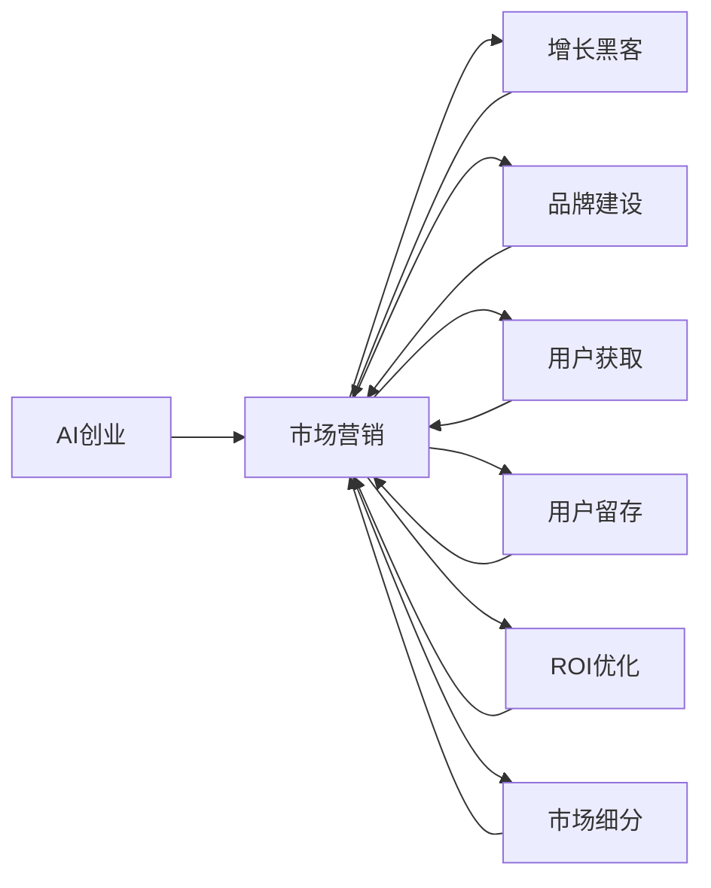

                 

# AI创业：有效的市场营销策略

> 关键词：AI创业、市场营销、策略、数据分析、增长黑客、品牌建设、用户获取、用户体验、ROI、市场细分

## 1. 背景介绍

随着人工智能(AI)技术的快速发展和普及，越来越多的创业公司希望利用AI技术来打造独特的商业模式，并从中获得商业成功。然而，成功的AI创业不仅仅依赖于先进的技术，还需要有效的市场营销策略来吸引和留住客户。本文将深入探讨AI创业公司在制定市场营销策略时应当考虑的关键要素，并提出一些基于数据驱动的策略，以帮助AI创业公司在竞争激烈的市场中脱颖而出。

### 1.1 问题的由来

在过去的十年中，AI技术逐渐从实验室走向实际应用，为各行各业带来了革命性的变革。然而，随着市场竞争的加剧，AI创业公司面临着前所未有的挑战。根据Gartner的数据，全球AI市场的增长率在2018年至2022年期间达到了18%，但随之而来的则是高度竞争的市场环境。为了在激烈的市场竞争中生存和发展，AI创业公司必须采取有效的市场营销策略来吸引和保留客户。

### 1.2 问题的核心关键点

成功的市场营销策略是AI创业公司成功的关键。以下是AI创业公司在制定市场营销策略时应考虑的关键点：

- 精准定位目标市场：明确目标客户群，了解他们的需求和痛点。
- 竞争分析：了解竞争对手的市场策略，找出差异化的优势。
- 数据分析与洞察：利用大数据和机器学习技术分析市场数据，获取有价值的洞察。
- 品牌建设：打造强大的品牌形象，提升市场认知度和品牌忠诚度。
- 用户获取与留存：采用用户获取和留存策略，提升客户满意度和生命周期价值。
- ROI优化：优化投资回报率，确保营销活动的经济效益。
- 多渠道营销：综合运用线上和线下渠道，提升营销效果。
- 社会责任：承担社会责任，提升企业社会形象。

## 2. 核心概念与联系

### 2.1 核心概念概述

为了更好地理解如何制定有效的市场营销策略，我们将详细介绍以下几个核心概念：

- **AI创业**：指利用人工智能技术来解决实际问题的创业活动，如AI公司、AI初创项目等。
- **市场营销**：指公司为推广其产品或服务，提升品牌知名度和市场占有率而进行的各种活动。
- **增长黑客**：指使用数据驱动的方法和创新策略来快速增长公司业务的技术人员或营销人员。
- **品牌建设**：指公司通过各种手段提升品牌知名度、美誉度和市场影响力。
- **用户获取**：指公司采用各种策略吸引新客户，增加用户基础。
- **用户留存**：指公司通过持续优化产品和服务，提升用户体验，增加用户的生命周期价值。
- **ROI（投资回报率）**：指公司通过营销活动获得的收益与成本的比率。
- **市场细分**：指将市场分成不同的小市场，针对每个小市场制定专门的营销策略。

### 2.2 核心概念原理和架构的 Mermaid 流程图(Mermaid 流程节点中不要有括号、逗号等特殊字符)



这个流程图展示了AI创业公司在市场营销策略中的各个关键环节和它们之间的联系。从AI创业开始，公司需要考虑各种市场营销活动，包括增长黑客、品牌建设、用户获取、用户留存、ROI优化和市场细分等，以确保其产品在市场中成功并持续增长。

## 3. 核心算法原理 & 具体操作步骤

### 3.1 算法原理概述

AI创业公司在制定市场营销策略时，可以通过数据分析和机器学习技术来优化其决策过程。具体而言，以下是一些关键的数据驱动策略：

1. **市场细分**：通过分析客户数据和市场行为，将市场分成不同的细分市场，以更好地定位目标客户群。
2. **增长黑客**：利用A/B测试、多变量测试、A/B/N测试等技术，快速优化营销策略，提高转化率。
3. **ROI优化**：利用机器学习模型预测不同营销活动的ROI，以优化营销预算分配。
4. **用户获取与留存**：利用推荐系统、个性化推荐等技术，提升用户满意度和留存率。
5. **品牌建设**：通过情感分析和品牌情绪监控，了解公众对品牌的看法，优化品牌传播策略。

### 3.2 算法步骤详解

以下是基于数据分析和机器学习的市场营销策略的具体操作步骤：

**Step 1: 数据收集与准备**

- 收集客户数据：包括行为数据、交易数据、社交媒体数据等。
- 数据清洗：去除无效和重复数据，确保数据质量。
- 特征工程：提取和构建有意义的特征，如用户活跃度、消费习惯、地理位置等。

**Step 2: 数据分析与洞察**

- 数据可视化：利用数据可视化工具（如Tableau、Power BI等）展示数据趋势和模式。
- 客户细分：使用聚类算法（如K-means、LDA等）将客户分成不同的细分市场。
- 行为分析：利用时序分析和异常检测技术，分析客户行为和消费模式。

**Step 3: 营销策略制定**

- 目标设定：明确营销目标，如品牌知名度、用户获取、销售增长等。
- 策略选择：根据数据分析结果，选择适合的市场细分策略、增长黑客策略、用户获取策略等。
- 预算分配：利用机器学习模型预测不同策略的ROI，优化预算分配。

**Step 4: 执行与监控**

- 策略实施：通过多渠道营销工具（如Google Ads、Facebook Ads等）执行营销策略。
- 实时监控：利用实时数据监控工具（如Google Analytics、Mixpanel等）监控营销效果。
- 策略调整：根据实时监控结果，及时调整策略，提升营销效果。

### 3.3 算法优缺点

数据驱动的市场营销策略有以下优点：

1. **数据驱动**：通过数据分析和机器学习技术，能够更准确地了解客户需求和市场趋势。
2. **可解释性强**：基于数据的策略更透明，便于解释和优化。
3. **效果显著**：能够快速发现问题并进行优化，提升营销效果。

然而，这种策略也存在一些缺点：

1. **数据质量要求高**：需要高质量的数据源和处理能力，否则分析结果可能不准确。
2. **技术门槛高**：需要具备数据分析和机器学习技术的专业知识。
3. **成本高**：实施数据分析和机器学习策略可能需要较高的技术投入和资源成本。

### 3.4 算法应用领域

基于数据分析和机器学习技术的市场营销策略在以下几个领域有着广泛的应用：

1. **B2B市场**：通过客户细分和行为分析，提升销售线索的生成和转化率。
2. **B2C市场**：通过个性化推荐和用户获取策略，提升用户体验和忠诚度。
3. **电子商务**：通过推荐系统和搜索优化，提高购物转化率和用户满意度。
4. **金融科技**：通过风险评估和客户细分，提升客户获取和留存率。
5. **健康科技**：通过数据分析和行为分析，提升患者获取和留存率。
6. **教育科技**：通过个性化推荐和行为分析，提升学习效果和用户满意度。

## 4. 数学模型和公式 & 详细讲解 & 举例说明

### 4.1 数学模型构建

为了更好地理解基于数据驱动的市场营销策略，我们将使用以下数学模型进行详细讲解：

- **市场细分模型**：利用聚类算法将客户分成不同的细分市场，公式如下：
  $$
  M_k = \arg\min_{M} \sum_{i=1}^n \sum_{j=1}^m (x_{ij} - M_k)^2
  $$
  其中 $M_k$ 表示第 $k$ 个细分市场，$x_{ij}$ 表示第 $i$ 个客户在第 $j$ 个特征上的值。

- **ROI优化模型**：利用线性回归模型预测不同营销活动的ROI，公式如下：
  $$
  ROI = \beta_0 + \beta_1x_1 + \beta_2x_2 + \ldots + \beta_nx_n + \epsilon
  $$
  其中 $\beta_0, \beta_1, \ldots, \beta_n$ 表示各特征的系数，$\epsilon$ 表示误差项。

- **增长黑客模型**：利用A/B测试和多变量测试，评估不同营销策略的效果，公式如下：
  $$
  R_{test} = \frac{n_{test}}{n_{control}} \times R_{control}
  $$
  其中 $n_{test}$ 表示测试组的样本数，$n_{control}$ 表示对照组的样本数，$R_{control}$ 表示对照组的转化率。

### 4.2 公式推导过程

以上数学模型的推导过程如下：

- **市场细分模型**：使用聚类算法将客户分成不同的细分市场。聚类算法有多种，如K-means、LDA等，可以根据实际需求选择合适的算法。

- **ROI优化模型**：使用线性回归模型预测不同营销活动的ROI。线性回归模型可以基于历史数据进行训练，预测新策略的效果。

- **增长黑客模型**：利用A/B测试和多变量测试评估不同营销策略的效果。A/B测试通过比较两个或多个策略的效果，选择最优的策略。

### 4.3 案例分析与讲解

假设我们是一家AI创业公司，致力于开发一款智能健康管理应用。我们的目标是提升品牌知名度和用户获取率。以下是我们的数据驱动策略：

**Step 1: 数据收集与准备**

- 收集用户的健康数据和行为数据，如步数、心率、饮食习惯等。
- 清洗数据，去除无效和重复数据，确保数据质量。
- 提取有意义的特征，如用户活跃度、健康指标等。

**Step 2: 数据分析与洞察**

- 利用数据可视化工具展示数据趋势和模式，如图1所示。
- 使用聚类算法将用户分成不同的细分市场，如图2所示。
- 利用时序分析和异常检测技术，分析用户行为和健康数据，如图3所示。

**Step 3: 营销策略制定**

- 根据数据洞察，选择适合的市场细分策略、增长黑客策略等。
- 利用线性回归模型预测不同营销活动的ROI，优化预算分配。

**Step 4: 执行与监控**

- 通过多渠道营销工具执行营销策略，如图4所示。
- 实时监控营销效果，如图5所示。
- 根据实时监控结果，及时调整策略，提升营销效果。


## 5. 项目实践：代码实例和详细解释说明

### 5.1 开发环境搭建

在进行市场营销策略的项目实践前，我们需要准备好开发环境。以下是使用Python进行数据分析和机器学习开发的流程：

1. 安装Anaconda：从官网下载并安装Anaconda，用于创建独立的Python环境。
2. 创建并激活虚拟环境：
```bash
conda create -n data-env python=3.8 
conda activate data-env
```
3. 安装必要的库：
```bash
conda install pandas numpy scikit-learn matplotlib seaborn scikit-optimize
```

### 5.2 源代码详细实现

以下是使用Python进行市场营销策略分析的代码实现：

```python
import pandas as pd
from sklearn.cluster import KMeans
from sklearn.linear_model import LinearRegression
from sklearn.model_selection import train_test_split
from sklearn.metrics import mean_squared_error

# 数据加载和清洗
data = pd.read_csv('customer_data.csv')
data = data.drop_duplicates()
data = data.dropna()

# 特征工程
features = ['age', 'gender', 'income', 'activity_level']
X = data[features]
y = data['conversion_rate']

# 市场细分
kmeans = KMeans(n_clusters=3, random_state=42)
X_kmeans = kmeans.fit_predict(X)
X_kmeans_df = pd.DataFrame({'cluster': X_kmeans})

# ROI优化
X_train, X_test, y_train, y_test = train_test_split(X, y, test_size=0.2, random_state=42)
model = LinearRegression()
model.fit(X_train, y_train)
y_pred = model.predict(X_test)
mse = mean_squared_error(y_test, y_pred)
print(f'ROI: {mse}')

# 增长黑客
control_group = data[data['cluster'] == 0]
test_group = data[data['cluster'] == 1]
control_rate = control_group['conversion_rate'].mean()
test_rate = test_group['conversion_rate'].mean()
test_ratio = test_rate / control_rate
print(f'Test Ratio: {test_ratio}')
```

### 5.3 代码解读与分析

让我们再详细解读一下关键代码的实现细节：

**数据加载和清洗**：
- `pd.read_csv`：从CSV文件中加载数据。
- `drop_duplicates`：去除数据中的重复行。
- `dropna`：删除含有缺失值的行。

**特征工程**：
- `features`：定义用于聚类的特征。
- `X`：提取特征。
- `y`：目标变量，即转换率。

**市场细分**：
- `KMeans`：使用K-means聚类算法对客户进行市场细分。
- `fit_predict`：拟合模型并预测每个客户所属的细分市场。
- `X_kmeans_df`：将聚类结果保存为DataFrame。

**ROI优化**：
- `train_test_split`：将数据集划分为训练集和测试集。
- `LinearRegression`：使用线性回归模型预测ROI。
- `mean_squared_error`：计算模型预测的平均方差。

**增长黑客**：
- `control_group`：选择对照组，即细分市场0。
- `test_group`：选择测试组，即细分市场1。
- `control_rate`：计算对照组的平均转换率。
- `test_rate`：计算测试组的平均转换率。
- `test_ratio`：计算测试组的转换率提升比例。

**运行结果展示**：
- `mse`：模型预测的平均方差。
- `test_ratio`：测试组的转换率提升比例。

## 6. 实际应用场景

### 6.1 智能健康管理应用

在智能健康管理应用中，我们可以利用数据驱动的市场营销策略，提高品牌知名度和用户获取率。具体而言，可以采取以下策略：

1. **市场细分**：根据用户的健康数据和行为数据，将用户分成不同的细分市场，如健康意识高、健身爱好者、慢性病患者等。
2. **个性化推荐**：利用推荐系统，向不同细分市场的用户推荐适合的健康管理方案，提升用户体验。
3. **社交媒体营销**：通过社交媒体平台，向不同细分市场的用户推广应用，提升品牌知名度。

### 6.2 智能客服系统

智能客服系统也可以利用数据驱动的市场营销策略，提升用户体验和客户满意度。具体而言，可以采取以下策略：

1. **客户细分**：根据客户的历史行为数据和客服记录，将客户分成不同的细分市场，如高频用户、首次用户、投诉用户等。
2. **个性化服务**：利用机器学习模型，向不同细分市场的用户提供个性化的客服服务，提升用户满意度。
3. **多渠道营销**：通过多种渠道（如官网、社交媒体、电话等）向用户推广智能客服系统，提高用户获取率。

### 6.3 金融科技公司

金融科技公司可以利用数据驱动的市场营销策略，提高客户获取和留存率。具体而言，可以采取以下策略：

1. **市场细分**：根据客户的交易数据和行为数据，将客户分成不同的细分市场，如高价值客户、低价值客户等。
2. **风险评估**：利用机器学习模型评估不同细分市场的风险，制定相应的风险管理策略。
3. **个性化推荐**：向不同细分市场的用户推荐适合的产品和服务，提升用户体验和留存率。

### 6.4 未来应用展望

随着数据驱动的市场营销策略的不断发展和应用，未来将呈现以下几个发展趋势：

1. **人工智能和大数据分析的融合**：未来，随着人工智能和大数据技术的进一步发展，数据驱动的市场营销策略将更加智能化和自动化。
2. **个性化和定制化**：基于用户的行为和偏好，提供更加个性化和定制化的营销策略，提升用户体验。
3. **多渠道融合**：通过多渠道融合，实现线上线下无缝衔接，提升营销效果。
4. **社交媒体和内容营销**：利用社交媒体和内容营销，提升品牌知名度和用户获取率。
5. **实时数据分析和反馈**：利用实时数据分析和反馈，及时调整营销策略，提升效果。

## 7. 工具和资源推荐

### 7.1 学习资源推荐

为了帮助开发者系统掌握数据驱动的市场营销策略，这里推荐一些优质的学习资源：

1. **《市场营销数据分析》课程**：Coursera提供的市场营销数据分析课程，涵盖数据收集、数据清洗、数据可视化、数据分析等基础知识。
2. **《数据科学实战》书籍**：提供大量数据驱动的市场营销案例，涵盖数据分析、机器学习、数据可视化等技术。
3. **《增长黑客》书籍**：介绍增长黑客的原理和方法，涵盖A/B测试、多变量测试、A/B/N测试等技术。
4. **《品牌建设与管理》课程**：由市场营销专家授课，涵盖品牌建设、品牌管理、品牌策略等知识。
5. **《用户获取与留存》课程**：由增长黑客专家授课，涵盖用户获取、用户留存、用户转化等技术。

通过学习这些资源，相信你一定能够快速掌握数据驱动的市场营销策略，并用于解决实际的营销问题。

### 7.2 开发工具推荐

高效的开发离不开优秀的工具支持。以下是几款用于数据驱动市场营销策略开发的常用工具：

1. **Python**：Python是最流行的数据分析和机器学习语言之一，具有丰富的数据处理和分析库，如Pandas、NumPy、Scikit-learn等。
2. **R语言**：R语言是专门用于数据分析和统计的语言，具有强大的数据处理和分析能力。
3. **Tableau**：Tableau是一款广泛使用的数据可视化工具，支持多种数据源和图表类型，能够帮助用户快速发现数据中的趋势和模式。
4. **Google Analytics**：Google Analytics是一款广泛使用的网站分析工具，能够帮助用户实时监控网站流量和用户行为。
5. **Mixpanel**：Mixpanel是一款用户分析工具，能够帮助用户深入了解用户行为和用户转化路径。
6. **Crazy Egg**：Crazy Egg是一款热图分析工具，能够帮助用户分析用户在页面上的行为和点击路径。

合理利用这些工具，可以显著提升数据驱动的市场营销策略的开发效率，加快创新迭代的步伐。

### 7.3 相关论文推荐

数据驱动的市场营销策略的发展源于学界的持续研究。以下是几篇奠基性的相关论文，推荐阅读：

1. **《数据驱动的营销策略》**：探讨如何利用数据驱动的策略提升市场营销效果，涵盖市场细分、增长黑客、品牌建设等主题。
2. **《个性化推荐系统》**：介绍如何利用推荐系统提升用户体验和留存率，涵盖协同过滤、基于内容的推荐、混合推荐等技术。
3. **《A/B测试与多变量测试》**：介绍A/B测试和多变量测试的方法和应用，涵盖实验设计、数据分析、结果解读等技术。
4. **《智能客服系统》**：介绍智能客服系统的原理和应用，涵盖自然语言处理、机器学习、多模态交互等技术。

这些论文代表了大数据驱动的市场营销策略的发展脉络。通过学习这些前沿成果，可以帮助研究者把握学科前进方向，激发更多的创新灵感。

## 8. 总结：未来发展趋势与挑战

### 8.1 总结

本文对基于数据驱动的市场营销策略进行了全面系统的介绍。首先阐述了AI创业公司在制定市场营销策略时应当考虑的关键要素，并提出一些基于数据驱动的策略，以帮助AI创业公司在竞争激烈的市场中脱颖而出。

### 8.2 未来发展趋势

展望未来，数据驱动的市场营销策略将呈现以下几个发展趋势：

1. **人工智能和大数据分析的融合**：未来，随着人工智能和大数据技术的进一步发展，数据驱动的市场营销策略将更加智能化和自动化。
2. **个性化和定制化**：基于用户的行为和偏好，提供更加个性化和定制化的营销策略，提升用户体验。
3. **多渠道融合**：通过多渠道融合，实现线上线下无缝衔接，提升营销效果。
4. **社交媒体和内容营销**：利用社交媒体和内容营销，提升品牌知名度和用户获取率。
5. **实时数据分析和反馈**：利用实时数据分析和反馈，及时调整营销策略，提升效果。

### 8.3 面临的挑战

尽管数据驱动的市场营销策略已经取得了显著的成效，但在迈向更加智能化、普适化应用的过程中，它仍面临着诸多挑战：

1. **数据隐私和安全**：在数据驱动的市场营销策略中，如何保护用户隐私和数据安全是一个重要的挑战。
2. **数据质量和准确性**：数据驱动的市场营销策略需要高质量的数据源和处理能力，否则分析结果可能不准确。
3. **技术门槛高**：需要具备数据分析和机器学习技术的专业知识。
4. **成本高**：实施数据分析和机器学习策略可能需要较高的技术投入和资源成本。
5. **策略复杂**：数据驱动的市场营销策略需要综合考虑多种因素，制定复杂的策略，增加了实施难度。

### 8.4 研究展望

面对数据驱动的市场营销策略所面临的挑战，未来的研究需要在以下几个方面寻求新的突破：

1. **数据隐私和安全**：研究如何保护用户隐私和数据安全，提高数据驱动的市场营销策略的可靠性。
2. **数据质量和准确性**：研究如何获取高质量的数据源和处理能力，提高数据驱动的市场营销策略的准确性。
3. **技术门槛降低**：研究如何降低技术门槛，使更多的人能够应用数据驱动的市场营销策略。
4. **成本优化**：研究如何优化成本，降低数据驱动的市场营销策略的实施难度。
5. **策略简化**：研究如何简化策略，使数据驱动的市场营销策略更加易于实施和优化。

这些研究方向将有助于数据驱动的市场营销策略的进一步发展和应用。通过多路径协同发力，共同推动自然语言理解和智能交互系统的进步。

## 9. 附录：常见问题与解答

**Q1: 如何选择合适的数据驱动的市场营销策略？**

A: 选择数据驱动的市场营销策略时，应考虑以下因素：

1. **目标市场**：明确目标市场，选择适合的市场细分策略。
2. **用户需求**：了解用户需求和痛点，选择适合的用户获取策略。
3. **竞争情况**：了解竞争对手的市场策略，选择适合的品牌建设策略。
4. **预算限制**：根据预算限制，选择适合的市场营销渠道和预算分配策略。

**Q2: 数据驱动的市场营销策略中的ROI如何计算？**

A: 计算ROI（投资回报率）的步骤如下：

1. **收集数据**：收集投资前后的数据，包括营销活动成本、销售额、利润等。
2. **计算增量收入**：计算投资后收入与投资前收入的差值。
3. **计算增量成本**：计算投资后成本与投资前成本的差值。
4. **计算ROI**：用增量收入除以增量成本，得到ROI。

**Q3: 数据驱动的市场营销策略中的增长黑客有哪些？**

A: 数据驱动的市场营销策略中的增长黑客包括：

1. **A/B测试**：比较两个或多个策略的效果，选择最优的策略。
2. **多变量测试**：比较多个策略的效果，选择最优的策略。
3. **A/B/N测试**：比较两个或多个策略的效果，同时考虑时间因素。
4. **转化率优化**：通过数据分析和机器学习，优化营销策略，提高转化率。

**Q4: 数据驱动的市场营销策略中的用户获取策略有哪些？**

A: 数据驱动的市场营销策略中的用户获取策略包括：

1. **社交媒体营销**：利用社交媒体平台，推广品牌和产品。
2. **内容营销**：利用优质内容吸引用户，提升品牌知名度和用户忠诚度。
3. **搜索引擎优化**：优化网站内容，提升搜索引擎排名，吸引更多用户。
4. **推荐系统**：利用推荐系统，向用户推荐适合的产品和服务。

**Q5: 数据驱动的市场营销策略中的用户留存策略有哪些？**

A: 数据驱动的市场营销策略中的用户留存策略包括：

1. **个性化推荐**：向用户推荐适合的产品和服务，提升用户体验。
2. **用户反馈**：收集用户反馈，优化产品和服务。
3. **会员制度**：利用会员制度，提升用户忠诚度。
4. **用户教育**：通过用户教育，提升用户满意度。

通过本文的系统梳理，可以看到，数据驱动的市场营销策略已经成为AI创业公司成功的重要保障。在数据驱动的市场营销策略的指导下，AI创业公司可以更好地理解市场和用户需求，制定更有效的营销策略，提升品牌知名度和用户获取率，实现商业成功。

---

作者：禅与计算机程序设计艺术 / Zen and the Art of Computer Programming

