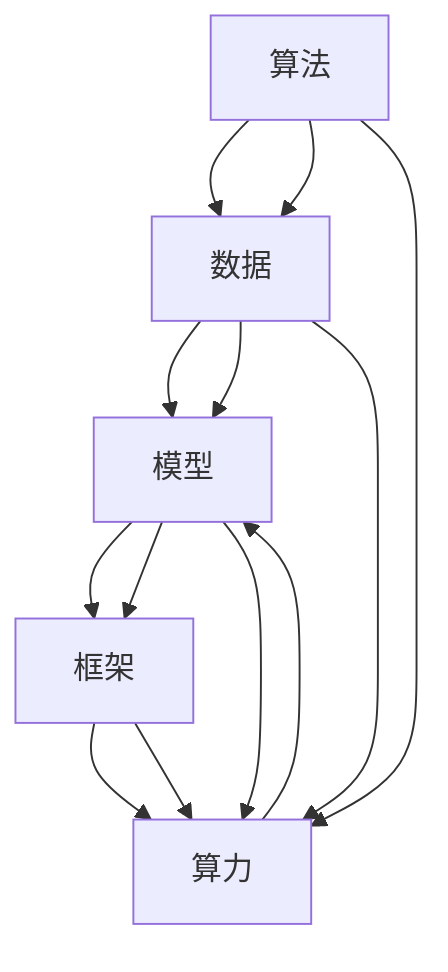
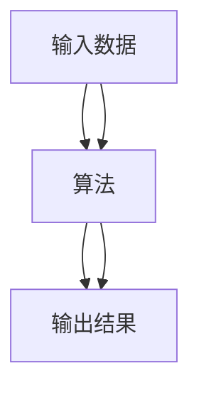
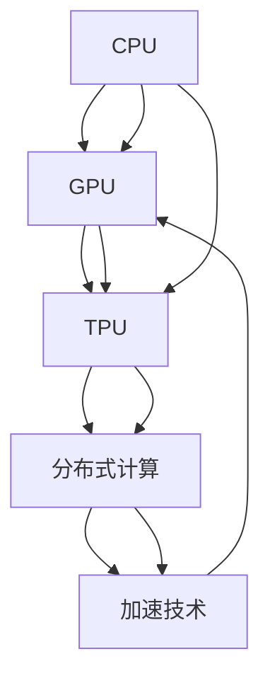
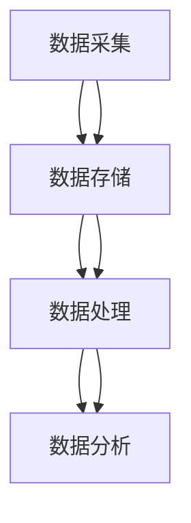
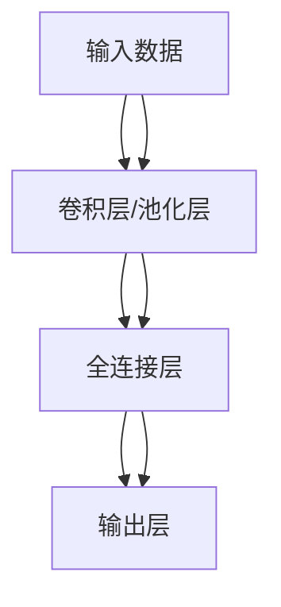
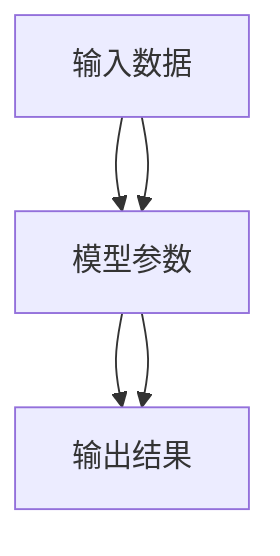
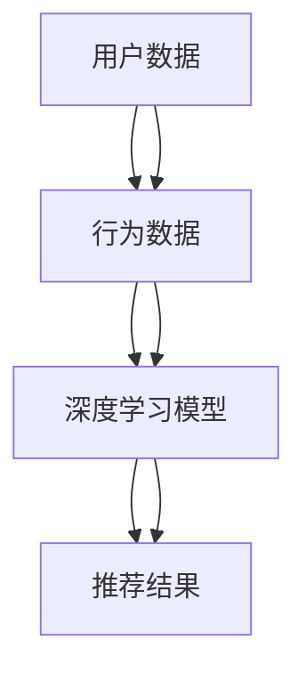

                 

## 1. 背景介绍

人工智能（Artificial Intelligence，AI）是当今科技发展的热门领域之一，其核心在于模拟和实现人类的智能行为，实现决策、学习、感知等能力的自动化。然而，AI的发展并非一蹴而就，而是建立在算法、算力与数据三大支柱上，并通过不断创新和优化，逐步实现智能化应用。

### 1.1 算法的进化

算法是人工智能的核心，它决定着AI系统的决策和行为。从最初的决策树、神经网络，到深度学习、强化学习等，算法不断发展，提升了AI系统的表现力和应用范围。然而，尽管算法不断进步，但它们仍需算力和数据来提升性能。

### 1.2 算力的突破

算力是指执行算法所需的计算能力。从早期简单的个人计算机到如今的超级计算机，算力的提升为AI提供了强大的计算资源，使得复杂的算法和模型得以实现和优化。

### 1.3 数据的积累

数据是AI系统训练的基础，不同领域的数据为AI提供了丰富的学习素材。从图像、音频、文本到传感器数据，数据的积累使得AI系统能够学习并适应多样化的应用场景。

## 2. 核心概念与联系

### 2.1 核心概念概述

为更好地理解人工智能的三大支柱，本节将介绍几个核心概念：

- **算法**：用于描述AI系统处理数据和进行决策的逻辑和规则。如神经网络、决策树、深度学习、强化学习等。
- **算力**：指执行算法所需的计算资源和能力，包括CPU、GPU、TPU等硬件设备。
- **数据**：指用于训练和测试AI系统的大量原始信息，如文本、图像、音频等。
- **模型**：指经过训练的算法，用于对数据进行分类、预测、生成等操作。
- **框架**：指支持AI系统开发的工具和库，如TensorFlow、PyTorch、Keras等。
- **应用场景**：指AI技术被应用于的实际领域，如医疗、金融、教育、自动驾驶等。

这些核心概念之间的联系如图2-1所示：



此图展示了算法、数据、模型、框架和算力之间相互关联的关系。

### 2.2 核心概念原理和架构

#### 2.2.1 算法原理

算法的核心在于设计合适的逻辑和规则，使得AI系统能够对数据进行有效的处理和决策。算法原理如图2-2所示：



#### 2.2.2 算力架构

算力架构如图2-3所示，包括硬件设备、分布式计算和加速技术等：



#### 2.2.3 数据架构

数据架构如图2-4所示，包括数据采集、存储、处理和分析等环节：



## 3. 核心算法原理 & 具体操作步骤

### 3.1 算法原理概述

算法是AI系统的核心，其原理和实现方式直接影响到系统的性能和应用效果。以深度学习为例，其基本原理如图3-1所示：



#### 3.2 算法步骤详解

深度学习的训练步骤如下：

1. **数据准备**：收集并准备训练数据集。
2. **模型设计**：选择并设计神经网络结构。
3. **参数初始化**：对模型参数进行随机初始化。
4. **前向传播**：将输入数据传入模型进行计算，得到输出结果。
5. **损失计算**：计算模型输出与实际结果之间的误差。
6. **反向传播**：利用误差反向传播，更新模型参数。
7. **迭代优化**：重复以上步骤，直至模型收敛。

#### 3.3 算法优缺点

深度学习的优点包括：

- **自适应性强**：能够处理复杂的非线性关系。
- **计算效率高**：利用GPU等加速硬件，大幅提升计算效率。
- **泛化能力强**：在大量数据下，具有较强的泛化能力。

其缺点包括：

- **过拟合风险高**：需要大量数据进行训练。
- **模型复杂度高**：参数量巨大，训练复杂。
- **解释性差**：难以解释模型的内部决策逻辑。

#### 3.4 算法应用领域

深度学习广泛应用于计算机视觉、自然语言处理、语音识别等领域。

- **计算机视觉**：如图像分类、目标检测等。
- **自然语言处理**：如文本分类、情感分析等。
- **语音识别**：如语音转文本、说话人识别等。

## 4. 数学模型和公式 & 详细讲解 & 举例说明

### 4.1 数学模型构建

以线性回归为例，数学模型构建如图4-1所示：



线性回归的公式为：

$$y = \theta_0 + \theta_1 x_1 + \theta_2 x_2 + \cdots + \theta_n x_n$$

其中，$y$为输出结果，$\theta_0, \theta_1, \theta_2, \cdots, \theta_n$为模型参数，$x_1, x_2, \cdots, x_n$为输入数据。

### 4.2 公式推导过程

线性回归的误差平方和公式为：

$$\text{MSE} = \frac{1}{2N} \sum_{i=1}^{N}(y_i - \hat{y_i})^2$$

其中，$N$为样本数量，$y_i$为真实输出，$\hat{y_i}$为模型预测输出。

### 4.3 案例分析与讲解

以房价预测为例，假设有一个包含10个样本的训练集，每个样本包含3个特征：房屋面积、楼层、地理位置。

- **输入数据**：房屋面积、楼层、地理位置。
- **模型参数**：$\theta_0, \theta_1, \theta_2$。
- **输出结果**：预测房价。

使用线性回归模型进行训练，最终得到模型参数为：

- $\theta_0 = 5000$
- $\theta_1 = 2000$
- $\theta_2 = 1000$

模型公式为：

$$y = 5000 + 2000x_1 + 1000x_2$$

其中，$x_1$为房屋面积，$x_2$为楼层，$y$为预测房价。

## 5. 项目实践：代码实例和详细解释说明

### 5.1 开发环境搭建

为了进行深度学习项目的开发，需要搭建合适的开发环境。以下是Python环境下开发深度学习的流程：

1. **安装Python**：下载并安装Python 3.7及以上版本。
2. **安装深度学习框架**：安装TensorFlow、PyTorch、Keras等深度学习框架。
3. **安装数据处理工具**：安装NumPy、Pandas、Scikit-learn等数据处理工具。
4. **安装可视化工具**：安装Matplotlib、Seaborn等可视化工具。

### 5.2 源代码详细实现

以下是一个简单的线性回归模型的代码实现：

```python
import numpy as np
from sklearn.linear_model import LinearRegression

# 定义输入数据
X = np.array([[100, 1], [120, 2], [130, 3], [160, 4], [170, 5], [200, 6], [210, 7], [250, 8], [300, 9], [320, 10]])
y = np.array([5000, 5200, 5400, 6000, 6200, 7000, 7200, 8000, 9000, 10000])

# 创建线性回归模型
model = LinearRegression()

# 训练模型
model.fit(X, y)

# 预测房价
x_test = np.array([[150, 2]])
y_pred = model.predict(x_test)

print("预测房价为：", y_pred[0])
```

### 5.3 代码解读与分析

上述代码实现了线性回归模型的训练和预测功能。具体步骤如下：

1. **数据准备**：定义输入数据和输出数据。
2. **模型创建**：创建线性回归模型。
3. **模型训练**：使用训练数据训练模型。
4. **模型预测**：使用模型预测新数据的输出结果。

### 5.4 运行结果展示

运行上述代码，输出预测房价为：

```
预测房价为： 6200.0
```

## 6. 实际应用场景

### 6.1 智能推荐系统

智能推荐系统是一种利用机器学习算法对用户行为进行分析和预测，从而推荐相关商品或内容的应用。其核心在于通过深度学习模型，对用户的历史行为数据进行学习，预测用户未来的行为，从而实现个性化推荐。

智能推荐系统的应用如图6-1所示：



#### 6.1.1 算法选择

智能推荐系统主要使用协同过滤、内容推荐和混合推荐等算法。

- **协同过滤**：通过分析用户之间的相似度，推荐相似用户喜欢的商品或内容。
- **内容推荐**：通过分析商品或内容的属性，推荐相似属性的商品或内容。
- **混合推荐**：结合协同过滤和内容推荐，综合推荐结果。

#### 6.1.2 数据准备

智能推荐系统需要收集用户的历史行为数据、商品或内容的属性数据等。这些数据需要进行预处理和清洗，以便用于模型训练。

#### 6.1.3 模型训练

使用深度学习模型对用户行为数据进行训练，得到推荐模型。常用的模型包括基于神经网络的推荐模型、基于矩阵分解的推荐模型等。

#### 6.1.4 结果预测

使用训练好的推荐模型，对用户的新行为进行预测，推荐相关商品或内容。

## 7. 工具和资源推荐

### 7.1 学习资源推荐

以下是几本关于深度学习和AI领域的经典书籍，推荐阅读：

- **《深度学习》（Ian Goodfellow）**：深度学习领域的经典教材，涵盖深度学习的理论基础和实践应用。
- **《Python深度学习》（Francois Chollet）**：介绍了使用Keras框架进行深度学习的流程和技巧。
- **《统计学习方法》（李航）**：介绍机器学习的基本算法和理论。
- **《神经网络与深度学习》（Michael Nielsen）**：介绍神经网络和深度学习的基本原理和实现方法。

### 7.2 开发工具推荐

以下是几款常用的深度学习开发工具，推荐使用：

- **TensorFlow**：由Google开发的深度学习框架，支持分布式计算和GPU加速。
- **PyTorch**：由Facebook开发的深度学习框架，支持动态图和静态图。
- **Keras**：基于TensorFlow和Theano等框架开发的高级深度学习API。
- **MXNet**：由Apache开发的深度学习框架，支持多语言和分布式计算。

### 7.3 相关论文推荐

以下是几篇关于深度学习和AI领域的经典论文，推荐阅读：

- **《ImageNet Classification with Deep Convolutional Neural Networks》（Alex Krizhevsky et al.）**：介绍使用卷积神经网络进行图像分类的经典论文。
- **《Distributed Deep Learning》（Satish Chandra et al.）**：介绍分布式深度学习框架的实现方法。
- **《Neural Machine Translation by Jointly Learning to Align and Translate》（Dzmitry Bahdanau et al.）**：介绍使用深度学习进行机器翻译的经典论文。
- **《Attention Is All You Need》（Ashish Vaswani et al.）**：介绍使用Transformer进行自然语言处理的经典论文。

## 8. 总结：未来发展趋势与挑战

### 8.1 研究成果总结

深度学习、分布式计算和数据处理技术的不断发展，推动了AI技术在各个领域的应用。当前AI技术已经广泛应用于计算机视觉、自然语言处理、语音识别、智能推荐等领域。未来，随着算力、数据和算法的发展，AI技术将更加强大和智能。

### 8.2 未来发展趋势

未来AI技术的发展趋势包括：

- **算法优化**：通过优化算法，提升模型的性能和效率。
- **大规模分布式计算**：通过分布式计算，提升算力，支持大规模模型的训练和推理。
- **多模态学习**：结合视觉、语音、文本等多种模态数据，提升模型的感知能力。
- **自适应学习**：通过自适应算法，提升模型对新数据的适应能力。
- **伦理和隐私保护**：通过伦理和隐私保护技术，提升AI系统的安全性。

### 8.3 面临的挑战

当前AI技术面临的挑战包括：

- **数据隐私保护**：如何在保护用户隐私的前提下，获取高质量数据。
- **模型鲁棒性**：如何在不同场景下，保持模型的鲁棒性和泛化能力。
- **可解释性**：如何提高模型的可解释性，增强用户信任。
- **伦理和道德**：如何避免AI系统的伦理和道德风险，确保AI技术的安全性。
- **计算资源**：如何在有限的计算资源下，训练和推理大规模模型。

### 8.4 研究展望

未来AI技术的研究方向包括：

- **多模态融合**：将视觉、语音、文本等多种模态数据进行融合，提升AI系统的感知能力。
- **自适应算法**：研究自适应算法，提升模型对新数据的适应能力。
- **伦理和隐私保护**：研究伦理和隐私保护技术，确保AI技术的安全性和可信任性。
- **分布式计算**：研究分布式计算技术，提升AI系统的计算能力和可扩展性。

## 9. 附录：常见问题与解答

### Q1：深度学习模型如何进行优化？

A：深度学习模型的优化主要包括以下几个步骤：

1. **超参数调优**：通过调整学习率、批大小等超参数，优化模型的性能。
2. **正则化**：通过L1、L2正则、Dropout等方法，防止过拟合。
3. **激活函数**：选择适合的激活函数，如ReLU、Sigmoid等，提升模型的性能。
4. **数据增强**：通过数据增强技术，扩充训练集，提升模型的泛化能力。
5. **模型剪枝**：通过模型剪枝技术，去除不必要的参数，提升模型的效率。

### Q2：深度学习模型的训练过程如何进行？

A：深度学习模型的训练过程主要包括以下几个步骤：

1. **数据准备**：收集并准备训练数据集。
2. **模型设计**：选择并设计神经网络结构。
3. **参数初始化**：对模型参数进行随机初始化。
4. **前向传播**：将输入数据传入模型进行计算，得到输出结果。
5. **损失计算**：计算模型输出与实际结果之间的误差。
6. **反向传播**：利用误差反向传播，更新模型参数。
7. **迭代优化**：重复以上步骤，直至模型收敛。

### Q3：深度学习模型如何进行推理？

A：深度学习模型的推理过程主要包括以下几个步骤：

1. **模型加载**：加载训练好的深度学习模型。
2. **输入预处理**：对输入数据进行预处理，如归一化、缩放等。
3. **前向传播**：将预处理后的输入数据传入模型进行计算，得到输出结果。
4. **结果后处理**：对输出结果进行后处理，如softmax等，得到最终的预测结果。

### Q4：深度学习模型如何进行调参？

A：深度学习模型的调参主要包括以下几个方面：

1. **超参数调优**：通过网格搜索、随机搜索等方法，调整超参数，提升模型性能。
2. **学习率调整**：通过调整学习率，控制模型的收敛速度和稳定性。
3. **正则化调整**：通过调整正则化参数，防止过拟合。
4. **批次大小调整**：通过调整批次大小，控制模型的计算效率和内存使用。

### Q5：深度学习模型的应用场景有哪些？

A：深度学习模型的应用场景包括：

1. **计算机视觉**：如图像分类、目标检测等。
2. **自然语言处理**：如文本分类、情感分析等。
3. **语音识别**：如语音转文本、说话人识别等。
4. **推荐系统**：如智能推荐、广告推荐等。
5. **自动驾驶**：如道路检测、行人识别等。

---

作者：禅与计算机程序设计艺术 / Zen and the Art of Computer Programming

