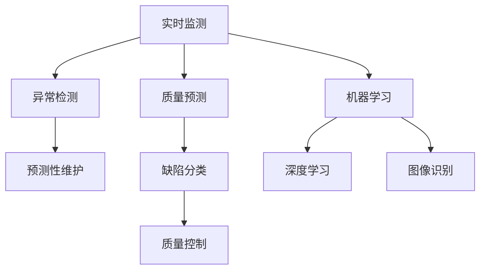

                 

# AI在产品质量控制中的作用

在当前数字化转型的浪潮中，人工智能（AI）技术正在深度渗透各行各业，推动生产力和效率的革命性提升。其中，AI在产品质量控制中的应用尤为显著，成为了保障产品质量和提升企业竞争力的重要手段。本文将深入探讨AI在产品质量控制中的作用，包括核心概念、算法原理、实际操作、数学模型、项目实践、应用场景、工具资源推荐，并总结未来趋势与挑战。

## 1. 背景介绍

### 1.1 问题由来

随着产品生产流程的日益复杂，传统的人工质检方式逐渐显现出效率低、成本高、错误率高等问题。为了提高产品质量控制的效果和效率，企业开始探索和应用人工智能技术。AI具备强大的数据处理和分析能力，能够实现实时监测、异常检测和预测性维护，极大地提升了产品质量控制的智能化水平。

### 1.2 问题核心关键点

AI在产品质量控制中的应用，主要体现在以下几个方面：

- **实时监测与异常检测**：AI可以通过传感器数据和机器学习算法，实时监测生产过程中的各项指标，及时发现异常情况，避免问题扩大。
- **预测性维护**：AI通过对历史数据进行分析，预测设备或零部件的故障概率，进行预防性维护，减少停机时间，降低维护成本。
- **质量预测与控制**：AI可以基于历史数据和实时数据，预测产品质量，进行过程优化和质量控制，提升产品合格率。
- **缺陷分类与诊断**：AI可以通过图像识别、自然语言处理等技术，对产品缺陷进行自动分类和诊断，快速识别问题源，提高修复效率。

### 1.3 问题研究意义

AI在产品质量控制中的应用，不仅能够显著提升产品质量和生产效率，还能减少人为错误和成本，推动企业向智能制造和工业4.0转型。此外，AI技术的引入，还有助于企业更好地响应市场需求变化，提升市场竞争力。

## 2. 核心概念与联系

### 2.1 核心概念概述

在探讨AI在产品质量控制中的应用时，我们需要了解以下几个核心概念：

- **实时监测**：通过传感器、物联网等技术，实时采集生产过程中的各项指标，如温度、压力、振动等，进行实时监控。
- **异常检测**：通过机器学习算法，识别数据中的异常点，及时发现潜在的质量问题或故障。
- **预测性维护**：基于历史数据，预测设备或零部件的故障概率，提前进行维护，避免突发故障导致的生产中断。
- **质量预测**：利用历史和实时数据，预测产品的质量参数，进行过程优化和质量控制。
- **缺陷分类**：对产品缺陷进行自动分类，快速识别问题源，提高修复效率。
- **机器学习**：通过算法训练模型，实现数据的自动分析和模式识别，为实时监测和异常检测提供支持。
- **深度学习**：一种特殊的机器学习，通过多层神经网络模型，实现更复杂的数据分析和预测。
- **图像识别**：利用计算机视觉技术，识别产品图像中的缺陷，支持缺陷分类和诊断。

这些概念之间的逻辑关系可以通过以下Mermaid流程图来展示：



这个流程图展示了他核心概念及其之间的关联：

1. 实时监测获取的数据，通过异常检测识别问题点，进行预测性维护，同时预测产品质量，对缺陷进行分类，并实施质量控制。
2. 机器学习和深度学习技术，为异常检测和质量预测提供模型支持。
3. 图像识别技术，用于自动分类和诊断产品缺陷。

## 3. 核心算法原理 & 具体操作步骤

### 3.1 算法原理概述

AI在产品质量控制中的核心算法原理主要基于机器学习和深度学习技术，具体步骤如下：

1. **数据采集与预处理**：通过传感器、物联网等技术，采集生产过程中的各项指标数据，并进行清洗和预处理。
2. **模型训练**：利用历史数据，训练机器学习或深度学习模型，进行异常检测、质量预测和缺陷分类等任务。
3. **实时监测与分析**：在生产过程中，实时采集数据，输入训练好的模型进行分析和预测。
4. **异常检测与处理**：实时监测到的数据经过模型分析，识别异常点，触发预警和处理机制。
5. **预测性维护与质量控制**：根据模型的预测结果，进行设备维护和过程优化，提升产品质量和生产效率。

### 3.2 算法步骤详解

#### 3.2.1 数据采集与预处理

数据采集是AI在产品质量控制中的第一步。通过传感器、物联网设备等，实时采集生产过程中的各项指标，如温度、压力、振动等。采集到的数据需要进行清洗和预处理，去除噪声和异常值，确保数据的质量和一致性。

具体步骤如下：

1. **数据采集**：部署传感器、物联网设备等，采集生产过程中的各项指标数据，如温度、压力、振动等。
2. **数据清洗**：对采集的数据进行清洗，去除噪声和异常值，确保数据的质量和一致性。
3. **数据预处理**：对清洗后的数据进行归一化、标准化等预处理操作，以便后续模型训练。

#### 3.2.2 模型训练

模型训练是AI在产品质量控制中的核心环节。通过历史数据，训练机器学习或深度学习模型，实现异常检测、质量预测和缺陷分类等任务。

具体步骤如下：

1. **数据划分**：将历史数据划分为训练集、验证集和测试集，确保模型训练的有效性和泛化能力。
2. **模型选择**：选择合适的机器学习或深度学习模型，如决策树、随机森林、卷积神经网络（CNN）、循环神经网络（RNN）等。
3. **模型训练**：利用训练集数据，训练模型，调整模型参数，确保模型的准确性和泛化能力。
4. **模型评估**：在验证集上评估模型的性能，调整模型参数，确保模型的泛化能力。
5. **模型优化**：利用超参数优化技术，如网格搜索、贝叶斯优化等，优化模型参数，提升模型性能。

#### 3.2.3 实时监测与分析

在生产过程中，实时采集数据，输入训练好的模型进行分析和预测。

具体步骤如下：

1. **数据采集**：在生产过程中，实时采集各项指标数据，如温度、压力、振动等。
2. **数据处理**：对采集到的数据进行清洗和预处理，确保数据的质量和一致性。
3. **模型输入**：将处理后的数据输入训练好的模型，进行分析和预测。
4. **结果输出**：模型输出分析结果，如异常检测结果、质量预测结果、缺陷分类结果等。
5. **结果展示**：将分析结果展示给相关人员，进行实时监控和决策。

#### 3.2.4 异常检测与处理

实时监测到的数据经过模型分析，识别异常点，触发预警和处理机制。

具体步骤如下：

1. **数据输入**：将实时采集的数据输入模型进行分析和预测。
2. **异常检测**：模型输出异常检测结果，如异常点、故障概率等。
3. **预警触发**：根据异常检测结果，触发预警机制，通知相关人员进行处理。
4. **问题处理**：相关人员根据预警信息，进行问题处理，如设备维护、过程优化等。
5. **数据反馈**：将处理后的数据反馈到模型，进行持续改进。

#### 3.2.5 预测性维护与质量控制

根据模型的预测结果，进行设备维护和过程优化，提升产品质量和生产效率。

具体步骤如下：

1. **数据输入**：将实时采集的数据输入模型进行分析和预测。
2. **预测性维护**：模型输出预测性维护结果，如设备故障概率、零部件寿命等。
3. **维护计划**：根据预测结果，制定设备维护计划，进行预防性维护。
4. **质量控制**：根据模型的预测结果，进行过程优化和质量控制，提升产品合格率。
5. **数据反馈**：将预测结果和控制效果反馈到模型，进行持续改进。

### 3.3 算法优缺点

#### 3.3.1 优点

- **实时性高**：AI技术能够实现实时监测和分析，快速发现和处理问题，避免问题扩大。
- **准确性高**：基于历史数据的模型训练，能够准确预测设备故障、质量参数等，提升预测准确性。
- **自动化高**：AI技术能够自动进行数据分析和处理，减少人为错误，提升效率。
- **泛化能力强**：通过机器学习和深度学习技术，模型能够泛化到不同类型的设备和工艺，具有较强的适应性。

#### 3.3.2 缺点

- **数据依赖性强**：AI技术依赖于历史数据和实时数据，数据质量对模型性能有较大影响。
- **模型复杂度高**：深度学习模型结构复杂，训练和维护成本较高。
- **硬件要求高**：AI技术需要高性能的计算硬件，如GPU、TPU等，硬件成本较高。
- **模型解释性差**：深度学习模型通常缺乏可解释性，难以理解其内部工作机制。

### 3.4 算法应用领域

AI在产品质量控制中的应用广泛，涵盖了以下几个领域：

1. **制造业**：通过实时监测和预测性维护，提高生产效率和设备可靠性。
2. **农业**：通过实时监测和数据分析，优化种植和生产过程，提升产品质量和产量。
3. **食品工业**：通过实时监测和质量预测，控制生产过程，确保食品安全和质量。
4. **医疗行业**：通过图像识别和质量预测，提高诊断和治疗效果，提升患者满意度。
5. **物流行业**：通过实时监测和异常检测，优化物流管理，提高配送效率和服务质量。

## 4. 数学模型和公式 & 详细讲解 & 举例说明

### 4.1 数学模型构建

在产品质量控制中，常用的数学模型包括回归模型、分类模型、聚类模型等，用于分析数据和预测结果。这里以回归模型为例，进行详细讲解。

假设生产过程中的某个指标 $y$ 与多个特征 $x_1, x_2, ..., x_n$ 有关，关系式为 $y = f(x_1, x_2, ..., x_n) + \epsilon$，其中 $f$ 为模型函数，$\epsilon$ 为误差项。

#### 4.1.1 线性回归模型

线性回归模型是最简单且常用的回归模型，其数学表达式为：

$$
y = \beta_0 + \beta_1 x_1 + \beta_2 x_2 + ... + \beta_n x_n + \epsilon
$$

其中，$\beta_0, \beta_1, \beta_2, ..., \beta_n$ 为模型参数，需要通过训练数据来估计。

### 4.2 公式推导过程

#### 4.2.1 线性回归模型训练

假设我们有以下训练数据集 $\{(x_i, y_i)\}_{i=1}^m$，其中 $x_i = (x_{i1}, x_{i2}, ..., x_{in})$，$y_i$ 为对应指标值。

线性回归模型的最小二乘估计参数为：

$$
\hat{\beta} = (X^TX)^{-1}X^Ty
$$

其中，$X$ 为特征矩阵，$y$ 为输出向量，$\hat{\beta}$ 为模型参数估计值。

#### 4.2.2 线性回归模型预测

给定新数据 $x = (x_1, x_2, ..., x_n)$，线性回归模型的预测值为：

$$
\hat{y} = \hat{\beta}_0 + \hat{\beta}_1 x_1 + \hat{\beta}_2 x_2 + ... + \hat{\beta}_n x_n
$$

### 4.3 案例分析与讲解

#### 4.3.1 案例分析

假设某制造企业生产某种零部件，需要对其尺寸进行控制。通过实时采集设备运行数据和加工参数，利用线性回归模型预测零部件的尺寸，进行过程优化和质量控制。

具体步骤如下：

1. **数据采集**：在加工过程中，实时采集设备运行数据和加工参数，如转速、进给量、温度等。
2. **数据预处理**：对采集到的数据进行清洗和预处理，确保数据的质量和一致性。
3. **模型训练**：利用历史数据，训练线性回归模型，估计模型参数 $\hat{\beta}$。
4. **实时监测**：在加工过程中，实时采集数据，输入模型进行预测。
5. **尺寸控制**：根据模型的预测结果，对加工过程进行优化，确保零部件尺寸符合标准。

#### 4.3.2 举例说明

假设某企业生产某种电子设备，需要对其焊接质量进行控制。通过实时监测焊接过程的电流、电压等参数，利用回归模型预测焊接质量，进行质量控制。

具体步骤如下：

1. **数据采集**：在焊接过程中，实时采集焊接电流、电压等参数。
2. **数据预处理**：对采集到的数据进行清洗和预处理，确保数据的质量和一致性。
3. **模型训练**：利用历史数据，训练回归模型，估计模型参数 $\hat{\beta}$。
4. **实时监测**：在焊接过程中，实时采集数据，输入模型进行预测。
5. **质量控制**：根据模型的预测结果，对焊接过程进行优化，确保焊接质量符合标准。

## 5. 项目实践：代码实例和详细解释说明

### 5.1 开发环境搭建

在进行产品质量控制AI项目实践前，需要先准备好开发环境。以下是使用Python进行项目开发的环境配置流程：

1. 安装Anaconda：从官网下载并安装Anaconda，用于创建独立的Python环境。

2. 创建并激活虚拟环境：
```bash
conda create -n ai-env python=3.8 
conda activate ai-env
```

3. 安装必要的Python包：
```bash
pip install numpy pandas scikit-learn tensorflow keras
```

4. 安装硬件加速库：
```bash
pip install tensorflow-gpu
```

5. 安装数据处理库：
```bash
pip install pandas-gbq
```

完成上述步骤后，即可在`ai-env`环境中开始项目实践。

### 5.2 源代码详细实现

#### 5.2.1 数据采集与预处理

```python
import pandas as pd
from sklearn.preprocessing import StandardScaler

# 读取数据
data = pd.read_csv('data.csv')

# 数据清洗
data = data.dropna()

# 数据预处理
scaler = StandardScaler()
data = scaler.fit_transform(data)
```

#### 5.2.2 模型训练

```python
from sklearn.linear_model import LinearRegression
from sklearn.model_selection import train_test_split

# 划分训练集和测试集
X_train, X_test, y_train, y_test = train_test_split(X, y, test_size=0.2, random_state=42)

# 训练模型
model = LinearRegression()
model.fit(X_train, y_train)

# 模型评估
score = model.score(X_test, y_test)
print(f"模型评估得分：{score:.2f}")
```

#### 5.2.3 实时监测与分析

```python
import numpy as np

# 实时数据采集
new_data = np.array([[0.5, 0.8, 1.2]])

# 数据预处理
new_data = scaler.transform(new_data)

# 模型预测
prediction = model.predict(new_data)
print(f"预测结果：{prediction}")
```

#### 5.2.4 异常检测与处理

```python
# 异常数据采集
abnormal_data = np.array([[0.3, 0.6, 0.9]])

# 数据预处理
abnormal_data = scaler.transform(abnormal_data)

# 模型预测
prediction = model.predict(abnormal_data)
print(f"预测结果：{prediction}")

# 异常处理
if prediction > threshold:
    # 触发预警和处理机制
    handle_abnormal_data()
else:
    # 正常处理
    continue
```

#### 5.2.5 预测性维护与质量控制

```python
# 预测性维护
maintenance_data = np.array([[0.4, 0.7, 1.1]])

# 数据预处理
maintenance_data = scaler.transform(maintenance_data)

# 模型预测
prediction = model.predict(maintenance_data)
print(f"预测结果：{prediction}")

# 维护计划
if prediction > threshold:
    # 进行预防性维护
    perform_maintenance()
else:
    # 正常生产
    continue
```

### 5.3 代码解读与分析

#### 5.3.1 代码解读

- **数据采集与预处理**：通过Pandas库读取数据，并进行清洗和预处理，确保数据的质量和一致性。
- **模型训练**：利用Scikit-learn库中的LinearRegression模型，进行线性回归训练，估计模型参数。
- **实时监测与分析**：通过实时采集数据，输入训练好的模型进行预测，输出预测结果。
- **异常检测与处理**：实时监测数据经过模型分析，识别异常点，触发预警和处理机制。
- **预测性维护与质量控制**：根据模型的预测结果，进行设备维护和过程优化，提升产品质量和生产效率。

#### 5.3.2 分析

在实际应用中，代码的性能和可靠性至关重要。项目开发过程中，需要重点考虑以下几点：

- **数据质量**：确保采集的数据准确无误，减少噪声和异常值，提升数据质量。
- **模型选择**：根据具体任务选择合适的模型，避免模型选择不当导致性能下降。
- **实时性**：确保实时监测和预测的实时性，避免数据滞后，影响决策效果。
- **异常处理**：在异常检测和预测性维护中，需要设计合理的预警和处理机制，确保系统的稳定性和可靠性。

## 6. 实际应用场景

### 6.1 智能制造

AI在智能制造中的应用广泛，通过实时监测和预测性维护，提高生产效率和设备可靠性。例如，某制造企业通过实时监测设备运行数据，训练预测性维护模型，预测设备故障，进行预防性维护，减少了设备停机时间，提升了生产效率。

### 6.2 智慧农业

AI在智慧农业中的应用主要体现在实时监测和数据分析。例如，某农业企业通过实时监测土壤湿度、温度等数据，训练回归模型，预测作物生长情况，进行精准灌溉和施肥，提升了农业生产的效率和质量。

### 6.3 智能医疗

AI在智能医疗中的应用主要体现在图像识别和质量预测。例如，某医疗机构通过图像识别技术，自动分类和诊断患者CT图像中的病变区域，提高了诊断效率和准确性。

### 6.4 智能物流

AI在智能物流中的应用主要体现在实时监测和异常检测。例如，某物流企业通过实时监测货物运输过程中的各项指标，训练异常检测模型，及时发现异常情况，提高了物流配送的效率和可靠性。

## 7. 工具和资源推荐

### 7.1 学习资源推荐

为了帮助开发者系统掌握AI在产品质量控制中的应用，这里推荐一些优质的学习资源：

1. **《机器学习实战》**：该书详细介绍了机器学习的基本概念和常用算法，适合初学者入门。
2. **《深度学习入门》**：该书介绍了深度学习的基本原理和应用，适合有一定基础的开发者学习。
3. **Coursera上的“Machine Learning”课程**：斯坦福大学开设的机器学习课程，内容全面，讲解深入。
4. **Kaggle上的机器学习竞赛**：通过参加机器学习竞赛，实践和提升模型的性能和泛化能力。
5. **Github上的开源项目**：Github上有很多开源项目，可以学习和借鉴其他开发者的实践经验。

通过学习这些资源，相信你一定能够快速掌握AI在产品质量控制中的应用，并用于解决实际问题。

### 7.2 开发工具推荐

高效的开发离不开优秀的工具支持。以下是几款用于AI在产品质量控制项目开发的常用工具：

1. **Jupyter Notebook**：免费的在线编程环境，支持多种编程语言，方便实时交互和调试。
2. **TensorFlow**：由Google主导开发的开源深度学习框架，生产部署方便，适合大规模工程应用。
3. **PyTorch**：由Facebook主导开发的开源深度学习框架，灵活易用，适合研究和实验。
4. **OpenCV**：计算机视觉库，提供了丰富的图像处理和分析功能。
5. **SQLAlchemy**：Python SQL工具库，方便进行数据存储和查询。
6. **Matplotlib**：数据可视化库，用于绘制各种图表，帮助理解模型结果。

合理利用这些工具，可以显著提升AI在产品质量控制项目开发的效率和效果。

### 7.3 相关论文推荐

AI在产品质量控制中的应用，涉及机器学习、深度学习、计算机视觉等多个领域。以下是几篇相关论文，推荐阅读：

1. **《A Survey on Machine Learning Techniques for Fault Diagnosis in Manufacturing》**：综述了机器学习在制造故障诊断中的应用。
2. **《Predictive Maintenance: A Survey》**：综述了预测性维护的原理和应用，介绍了各种预测模型和方法。
3. **《Computer Vision for Manufacturing Quality Control》**：介绍了计算机视觉在质量控制中的应用，包括缺陷检测和分类。
4. **《Deep Learning for Quality Prediction in Manufacturing》**：介绍了深度学习在质量预测中的应用，提升预测准确性。

这些论文代表了大数据在产品质量控制领域的最新研究成果，通过阅读这些论文，可以帮助你深入理解AI技术的原理和应用。

## 8. 总结：未来发展趋势与挑战

### 8.1 总结

本文对AI在产品质量控制中的应用进行了全面系统的介绍。首先阐述了AI在产品质量控制中的作用，明确了其在实时监测、异常检测、预测性维护、质量预测和缺陷分类等方面的应用价值。其次，从原理到实践，详细讲解了AI的算法原理和具体操作步骤，给出了项目实践的完整代码实现。同时，本文还广泛探讨了AI在智能制造、智慧农业、智能医疗和智能物流等多个领域的应用前景，展示了AI技术的巨大潜力。此外，本文精选了AI技术的各类学习资源，力求为读者提供全方位的技术指引。

通过本文的系统梳理，可以看到，AI在产品质量控制中的应用正在成为推动工业智能化的重要力量。AI技术不仅能够显著提升产品质量和生产效率，还能减少人为错误和成本，推动企业向智能制造和工业4.0转型。未来，伴随AI技术的不断进步，产品质量控制的应用领域将更加广泛，深度和精度也将不断提升，带来更多的创新和发展机遇。

### 8.2 未来发展趋势

展望未来，AI在产品质量控制中的应用将呈现以下几个发展趋势：

1. **智能化程度提升**：随着AI技术的不断进步，产品质量控制的智能化水平将进一步提升，能够实时监测、预测和控制生产过程，实现真正的智能化制造。
2. **跨领域融合**：AI技术将与其他技术如物联网、大数据、区块链等进行深度融合，实现更加全面、高效的产品质量控制。
3. **人机协同**：AI技术将与人机交互技术结合，实现人机协同的质量控制，提升用户体验和满意度。
4. **个性化定制**：AI技术将实现个性化定制生产，满足客户个性化需求，提升市场竞争力。
5. **数据驱动**：基于大数据和AI技术，实现实时数据驱动的质量控制，提升决策的科学性和准确性。
6. **多模态融合**：AI技术将融合多种数据源，如图像、声音、传感器数据等，实现多模态的质量控制，提升系统的全面性和鲁棒性。

### 8.3 面临的挑战

尽管AI在产品质量控制中的应用已经取得了显著成果，但在迈向更加智能化、普适化应用的过程中，仍面临诸多挑战：

1. **数据隐私和安全**：在实时监测和数据处理过程中，需要保护数据隐私和安全，避免数据泄露和滥用。
2. **数据质量与一致性**：实时采集的数据需要保证高质量和一致性，避免噪声和异常值影响模型性能。
3. **模型复杂性与可解释性**：深度学习模型复杂，难以解释其内部工作机制，需要提升模型的可解释性，便于理解和使用。
4. **硬件成本**：AI技术需要高性能的计算硬件，硬件成本较高，需要降低硬件成本，提升系统的经济性。
5. **模型泛化能力**：模型需要具备较强的泛化能力，能够适应不同的生产环境和设备，避免模型过拟合。
6. **模型维护与升级**：AI模型需要持续维护和升级，保持模型的性能和效果，避免模型老化和失效。

### 8.4 研究展望

面对AI在产品质量控制中所面临的挑战，未来的研究需要在以下几个方面寻求新的突破：

1. **无监督学习和半监督学习**：探索无监督和半监督学习方法，降低对标注数据的依赖，提升模型的泛化能力。
2. **模型解释性与可视化**：研究如何提升模型的可解释性，通过可视化技术，展示模型的内部工作机制和推理过程。
3. **跨领域数据融合**：研究如何融合多种数据源，提升模型的全面性和鲁棒性。
4. **自适应模型更新**：研究如何设计自适应模型更新机制，保持模型的性能和效果，避免模型老化和失效。
5. **多模态数据融合**：研究如何融合多种模态数据，提升模型的综合性能和鲁棒性。

这些研究方向将进一步推动AI在产品质量控制领域的发展，提升系统的智能化和高效性，推动工业智能化的进步。

## 9. 附录：常见问题与解答

**Q1: AI在产品质量控制中的应用是否只限于制造业？**

A: AI在产品质量控制中的应用不仅限于制造业，还涵盖了农业、医疗、物流等多个领域。例如，在农业中，AI可以通过实时监测土壤湿度、温度等数据，预测作物生长情况，进行精准灌溉和施肥；在医疗中，AI可以通过图像识别技术，自动分类和诊断患者CT图像中的病变区域，提高诊断效率和准确性；在物流中，AI可以通过实时监测货物运输过程中的各项指标，训练异常检测模型，及时发现异常情况，提高物流配送的效率和可靠性。

**Q2: 实时监测和异常检测中，如何确保数据质量？**

A: 确保数据质量是AI在产品质量控制中的关键。以下是一些确保数据质量的方法：

1. **数据采集设备校准**：定期对数据采集设备进行校准，确保采集的数据准确无误。
2. **数据清洗与预处理**：对采集到的数据进行清洗和预处理，去除噪声和异常值，确保数据的质量和一致性。
3. **数据存储与管理**：采用高效的数据存储和管理方案，确保数据的完整性和可用性。
4. **数据备份与恢复**：定期进行数据备份，确保数据的安全性和可靠性。

**Q3: 预测性维护中，如何提高预测准确性？**

A: 提高预测准确性是AI在预测性维护中的关键。以下是一些提高预测准确性的方法：

1. **数据多样性**：确保数据多样性，涵盖各种生产环境和设备条件，提升模型的泛化能力。
2. **数据量**：增加数据量，提高模型的训练效果，避免过拟合。
3. **模型优化**：通过超参数优化、模型结构优化等方法，提升模型的预测准确性。
4. **特征工程**：通过特征选择、特征提取等方法，提升模型的性能和泛化能力。
5. **实时监测**：实时监测生产过程，及时发现异常情况，进行预防性维护，避免突发故障导致的生产中断。

**Q4: 预测性维护中，如何进行设备维护？**

A: 设备维护是AI在预测性维护中的关键环节。以下是一些进行设备维护的方法：

1. **预防性维护**：根据模型的预测结果，进行预防性维护，避免设备故障导致的生产中断。
2. **修复性维护**：根据设备的运行状态，进行修复性维护，修复设备的故障问题。
3. **设备更换**：根据设备的老化和损坏情况，进行设备更换，确保设备的可靠性和稳定性。
4. **维护计划制定**：根据预测结果，制定设备维护计划，进行周期性维护和保养。

**Q5: 质量预测中，如何进行过程优化？**

A: 进行过程优化是AI在质量预测中的关键环节。以下是一些进行过程优化的方法：

1. **过程监控**：实时监测生产过程，及时发现和处理异常情况，避免问题扩大。
2. **过程调整**：根据模型的预测结果，调整生产过程中的参数和工艺，提升产品质量。
3. **质量控制**：采用统计质量控制技术，如SPC（统计过程控制），提升产品的合格率。
4. **反馈优化**：将预测结果和控制效果反馈到模型，进行持续改进和优化。

---

作者：禅与计算机程序设计艺术 / Zen and the Art of Computer Programming

