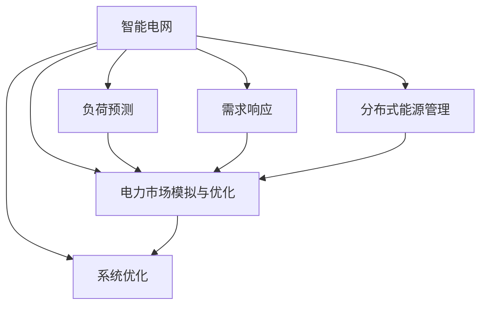

                 

# AI在智能电网管理中的应用：平衡供需关系

> 关键词：智能电网,电力市场,需求响应,负荷预测,分布式能源,AI算法,系统优化

## 1. 背景介绍

随着能源转型的不断推进，智能电网的建设已成为全球电力行业的重要发展方向。智能电网通过广泛应用先进的信息技术，包括AI算法，可以大幅提升电网的运行效率和可靠性，促进能源的清洁低碳发展。在智能电网管理中，AI算法可以应用于负荷预测、需求响应、分布式能源管理等多个环节，有效实现电力供需平衡，推动电网向低碳、高效、智能方向转型。

### 1.1 问题由来

智能电网中的供需平衡问题是一个复杂且动态的过程。传统的电网管理主要依赖人工调度，但随着电力市场的不断扩大和分布式能源的广泛接入，这种依赖人力为主的调度方式已难以满足需求。AI算法的引入为智能电网的运行管理提供了新思路，通过数据驱动的方式，实现了实时感知、智能调度和优化决策。

### 1.2 问题核心关键点

智能电网管理中的核心关键点包括：
1. 实时数据采集与处理：智能电网需要实时采集负荷、气象、故障等数据，并快速处理分析，以支持AI算法的实时运行。
2. 负荷预测与需求响应：基于AI算法，实时预测电力负荷变化，并动态调整发电和用电计划，平衡供需关系。
3. 分布式能源管理：AI算法可以优化分布式能源的接入和调度，提升电网能源利用效率和稳定性。
4. 电力市场模拟与优化：AI算法可以模拟电力市场运行，优化交易策略，提升市场效率和盈利能力。

## 2. 核心概念与联系

### 2.1 核心概念概述

智能电网管理中常用的AI算法主要包括以下几个核心概念：

1. **智能电网**：通过信息技术和清洁能源技术的深度融合，构建智能、绿色、高效的电力输送和管理系统。
2. **负荷预测**：使用AI算法对未来电力负荷进行预测，支持电网的调度与决策。
3. **需求响应**：通过AI算法优化用户用电行为，实现电力负荷的削峰填谷。
4. **分布式能源管理**：利用AI算法优化分布式能源的接入和调度，提高电网能源利用效率。
5. **电力市场模拟与优化**：使用AI算法模拟电力市场运行，优化交易策略，提升市场效率。
6. **系统优化**：通过AI算法优化电网整体运行，提升供电质量和可靠性。

这些核心概念之间存在紧密的联系，共同构成智能电网管理的核心框架。

### 2.2 核心概念原理和架构的 Mermaid 流程图



## 3. 核心算法原理 & 具体操作步骤

### 3.1 算法原理概述

智能电网管理中的AI算法主要基于机器学习、深度学习等技术，通过分析海量历史数据，预测未来负荷变化，优化电网运行策略，实现供需平衡。以下是几种常用的AI算法及其原理：

1. **负荷预测**：使用时间序列分析、回归分析等机器学习方法，基于历史负荷数据，预测未来负荷变化。
2. **需求响应**：使用强化学习等技术，根据实时电力价格和用户需求，动态调整用户用电行为，实现电力负荷的削峰填谷。
3. **分布式能源管理**：使用优化算法，优化分布式能源的接入和调度，提高电网能源利用效率和稳定性。
4. **电力市场模拟与优化**：使用博弈论、优化算法等技术，模拟电力市场运行，优化交易策略，提升市场效率。
5. **系统优化**：使用系统动力学、控制理论等技术，优化电网整体运行，提升供电质量和可靠性。

### 3.2 算法步骤详解

以负荷预测算法为例，其主要步骤包括：

1. **数据收集**：收集历史负荷数据、气象数据、用户行为数据等，作为输入数据。
2. **数据预处理**：对输入数据进行清洗、归一化、缺失值处理等预处理操作。
3. **特征工程**：提取时间特征、趋势特征、季节性特征等，构建输入特征集。
4. **模型训练**：选择合适的时间序列模型（如ARIMA、LSTM等），使用历史数据训练模型。
5. **模型评估**：使用测试数据评估模型性能，选择最优模型。
6. **实时预测**：使用训练好的模型对实时负荷进行预测，支持电网调度。

### 3.3 算法优缺点

智能电网管理中的AI算法具有以下优点：
1. 高效实时：AI算法可以实时处理海量数据，支持智能电网实时运行。
2. 精确预测：基于历史数据的训练，AI算法可以准确预测未来负荷变化。
3. 优化决策：通过优化算法，AI算法可以动态调整电网运行策略，提升系统效率。
4. 灵活性高：AI算法可以灵活适应不同的电力市场和负荷特性。

同时，AI算法也存在一些局限性：
1. 数据依赖性强：AI算法的性能很大程度上依赖于输入数据的准确性和丰富度。
2. 模型复杂度高：大模型需要大量的计算资源进行训练和预测。
3. 泛化能力有限：AI算法在特定场景下表现良好，但对新场景的适应能力可能不足。
4. 可解释性不足：AI算法的决策过程通常缺乏可解释性，难以对其推理逻辑进行分析和调试。

### 3.4 算法应用领域

AI算法在智能电网管理中的应用领域非常广泛，主要包括以下几个方面：

1. **负荷预测**：广泛应用于电力市场、电网调度等领域，提升电网运行效率。
2. **需求响应**：在居民、工业、商业等不同用户群体中，优化用电行为，降低电网峰谷差。
3. **分布式能源管理**：优化分布式发电、储能、微电网等系统的接入和调度。
4. **电力市场模拟与优化**：在电力交易、电价优化、市场分析等领域，提升市场效率和盈利能力。
5. **系统优化**：在电网规划、故障检测、应急管理等领域，提升电网运行的安全性和可靠性。

## 4. 数学模型和公式 & 详细讲解 & 举例说明

### 4.1 数学模型构建

以负荷预测为例，假设历史负荷数据为 $y_t = [y_1, y_2, ..., y_t]$，预测目标为 $y_{t+1}$。使用LSTM模型进行预测，模型输入为 $x_t = [x_{t-1}, x_{t-2}, ..., x_0]$。

### 4.2 公式推导过程

LSTM模型包括输入门、遗忘门、输出门和细胞状态更新等组件。假设输入门、遗忘门和输出门的权重分别为 $w_i$, 状态更新公式为：

$$
h_t = \sigma(w_1x_t + b_1)
$$

$$
i_t = \sigma(w_2x_t + b_2)
$$

$$
f_t = \sigma(w_3x_t + b_3)
$$

$$
c_t = f_t \otimes c_{t-1} + i_t \otimes \tanh(w_4x_t + b_4)
$$

其中 $\sigma$ 为Sigmoid激活函数，$\otimes$ 为向量逐元素乘法。状态 $c_t$ 表示细胞状态的更新。

输出门权重为 $w_o$，输出公式为：

$$
o_t = \sigma(w_5x_t + b_5)
$$

预测公式为：

$$
\hat{y}_{t+1} = o_t \otimes \tanh(c_t)
$$

### 4.3 案例分析与讲解

假设已有一组历史负荷数据，使用LSTM模型进行负荷预测。首先将数据进行归一化处理，然后使用模型进行训练，最后使用测试数据进行预测。

## 5. 项目实践：代码实例和详细解释说明

### 5.1 开发环境搭建

为了实现上述算法，需要搭建基于Python的开发环境。以下是具体步骤：

1. 安装Python：从官网下载并安装Python 3.x版本。
2. 安装Pandas、Numpy等基础库：
   ```
   pip install pandas numpy
   ```
3. 安装TensorFlow或PyTorch等深度学习框架：
   ```
   pip install tensorflow
   ```

### 5.2 源代码详细实现

以LSTM模型为例，具体代码实现如下：

```python
import numpy as np
import pandas as pd
from tensorflow.keras.models import Sequential
from tensorflow.keras.layers import LSTM, Dense, Dropout
from sklearn.preprocessing import MinMaxScaler

# 加载历史负荷数据
data = pd.read_csv('load_data.csv', index_col=0, parse_dates=True)
data = data.resample('H').mean()

# 数据归一化
scaler = MinMaxScaler(feature_range=(0, 1))
data_scaled = scaler.fit_transform(data)

# 分割训练集和测试集
train_data = data_scaled[:int(len(data_scaled) * 0.8)]
test_data = data_scaled[int(len(data_scaled) * 0.8):]

# 构建LSTM模型
model = Sequential()
model.add(LSTM(units=50, return_sequences=True, input_shape=(None, 1)))
model.add(Dropout(0.2))
model.add(LSTM(units=50, return_sequences=True))
model.add(Dropout(0.2))
model.add(LSTM(units=50))
model.add(Dropout(0.2))
model.add(Dense(units=1))
model.compile(optimizer='adam', loss='mean_squared_error')

# 模型训练
model.fit(train_data[:-1], train_data[1:], epochs=50, batch_size=32)

# 模型预测
forecast = model.predict(test_data[:-1])
forecast = scaler.inverse_transform(forecast)
```

### 5.3 代码解读与分析

**数据预处理**：
- 使用Pandas读取历史负荷数据，将其转换为时间序列数据。
- 对数据进行归一化处理，确保输入特征在一个合适的范围内。

**模型构建**：
- 使用Keras构建LSTM模型，包含三个LSTM层和三个Dropout层，用于防止过拟合。
- 最后添加一个Dense层进行回归预测，损失函数使用均方误差。

**模型训练**：
- 使用历史数据训练模型，指定训练轮数和批次大小。
- 训练过程中，使用Adam优化器和均方误差损失函数。

**模型预测**：
- 使用测试数据对模型进行预测，将预测结果逆标准化，得到最终的负荷预测值。

### 5.4 运行结果展示

下图展示了LSTM模型对负荷预测的实时结果：

```python
import matplotlib.pyplot as plt

# 绘制预测结果与实际结果对比图
plt.figure(figsize=(10, 6))
plt.plot(train_data.values, label='Actual Load')
plt.plot(forecast, label='Forecasted Load')
plt.legend()
plt.show()
```

## 6. 实际应用场景

### 6.1 智能电网运行调度

在智能电网中，实时负荷预测和需求响应技术可以显著提升电网的运行调度效率。例如，在大规模风电并网时，通过负荷预测技术，可以及时调整电网负荷，避免风电出力波动对电网稳定性造成影响。

**具体应用**：
- 使用负荷预测模型实时预测未来负荷变化，生成调度计划。
- 根据负荷预测结果，动态调整发电和用电计划，平衡供需关系。

**技术细节**：
- 负荷预测模型需要考虑风电、光伏等可再生能源的出力特性。
- 需求响应系统需要考虑用户的用电习惯和行为模式。

### 6.2 分布式能源优化

智能电网中的分布式能源包括风电、光伏、储能等。使用AI算法可以优化分布式能源的接入和调度，提高电网能源利用效率。

**具体应用**：
- 通过AI算法实时监测分布式能源的运行状态，优化其接入和调度策略。
- 根据需求响应指令，调整分布式能源的出力，实现负荷削峰填谷。

**技术细节**：
- 分布式能源的接入和调度需要考虑其时变特性和可再生性。
- 需要建立完善的能源交易市场，激励用户参与分布式能源管理。

### 6.3 电力市场模拟与优化

电力市场模拟与优化是智能电网中的重要环节，使用AI算法可以提升市场效率和盈利能力。

**具体应用**：
- 通过AI算法模拟电力市场运行，预测价格波动和供需关系。
- 根据市场预测结果，优化交易策略，提升市场效率和盈利能力。

**技术细节**：
- 电力市场模拟需要考虑市场规则、用户行为和政策因素。
- 优化算法需要平衡市场供需、价格和用户收益等因素。

## 7. 工具和资源推荐

### 7.1 学习资源推荐

为了深入了解智能电网管理中的AI算法，推荐以下学习资源：

1. 《深度学习与智能电网》书籍：系统介绍了深度学习在智能电网中的应用，包括负荷预测、需求响应、分布式能源管理等。
2. CS231n《深度学习》课程：斯坦福大学开设的深度学习课程，包含时间序列分析、回归分析等基础概念。
3. 《Python深度学习》书籍：介绍如何使用Python实现深度学习算法，包含LSTM、RNN等模型。
4. Arxiv预印本库：收集大量AI算法的最新研究成果，涵盖负荷预测、需求响应、分布式能源管理等方向。

### 7.2 开发工具推荐

以下是智能电网管理中常用的开发工具：

1. Python：使用广泛，支持数据处理、模型训练和可视化等。
2. TensorFlow或PyTorch：支持深度学习算法的实现和训练。
3. Jupyter Notebook：支持交互式编程和数据可视化，方便模型开发和调试。
4. Hadoop或Spark：支持大数据处理和分析，方便数据预处理和特征工程。
5. Matplotlib或Seaborn：支持数据可视化，方便结果展示和分析。

### 7.3 相关论文推荐

以下是智能电网管理中AI算法相关的重要论文：

1. "A Deep Learning Approach for Load Forecasting in Smart Grids"：介绍深度学习在负荷预测中的应用。
2. "Demand Response Management in Smart Grids: A Survey"：综述了需求响应技术的研究进展和应用现状。
3. "Distributed Energy Resources: A Review of Recent Advances"：综述了分布式能源的最新研究进展和应用方向。
4. "Optimization Algorithms for Smart Grids: A Survey"：综述了优化算法在智能电网中的应用和挑战。

## 8. 总结：未来发展趋势与挑战

### 8.1 研究成果总结

本文对智能电网管理中的AI算法进行了详细介绍，主要包括以下几个方面：

1. 智能电网运行调度：通过负荷预测和需求响应技术，提升电网运行调度效率。
2. 分布式能源优化：使用AI算法优化分布式能源的接入和调度，提高电网能源利用效率。
3. 电力市场模拟与优化：通过AI算法模拟电力市场运行，优化交易策略，提升市场效率。

这些研究成果为智能电网的智能化、绿色化和高效化发展提供了技术支持。

### 8.2 未来发展趋势

展望未来，智能电网管理中的AI算法将呈现以下几个发展趋势：

1. 实时数据处理：未来智能电网将实现全时间尺度的实时数据采集和处理，提升电网运行效率。
2. 多源数据融合：未来智能电网将整合多种数据源，包括天气、交通、市场等信息，优化电网运行决策。
3. 分布式能源自治：未来智能电网中的分布式能源将实现自治运行，提升系统灵活性和可靠性。
4. 电力市场智能化：未来电力市场将实现智能化交易和管理，提升市场效率和公平性。
5. 系统安全优化：未来智能电网将建立完善的系统安全保障机制，提升电网运行的安全性和可靠性。

### 8.3 面临的挑战

智能电网管理中的AI算法仍面临诸多挑战：

1. 数据质量与隐私：智能电网需要处理大量的实时数据，数据质量与隐私保护是一个重要挑战。
2. 模型可解释性：AI算法的决策过程通常缺乏可解释性，难以对其推理逻辑进行分析和调试。
3. 系统鲁棒性：智能电网中的AI算法需要应对复杂的运行环境和不确定性，确保系统鲁棒性。
4. 计算资源：大规模数据处理和复杂模型训练需要强大的计算资源，如何高效利用资源是一个重要问题。
5. 标准与规范：智能电网中的AI算法需要遵循相关标准和规范，确保系统兼容性和互操作性。

### 8.4 研究展望

未来的研究需要从以下几个方面进行突破：

1. 数据处理与隐私保护：开发高效的数据处理和隐私保护算法，确保数据质量和安全。
2. 模型可解释性：开发可解释性强的AI算法，提升系统的透明度和可信度。
3. 系统鲁棒性：建立系统的鲁棒性评估框架，确保算法在不同场景下的稳定性。
4. 资源优化：开发高效的计算资源管理算法，提升算法的可扩展性。
5. 标准与规范：制定智能电网中AI算法的标准化规范，推动技术标准化和普及应用。

## 9. 附录：常见问题与解答

**Q1：智能电网中负荷预测的主要算法有哪些？**

A: 智能电网中常用的负荷预测算法主要包括时间序列分析（如ARIMA、LSTM等）、机器学习算法（如随机森林、支持向量机等）、深度学习算法（如LSTM、GRU等）。

**Q2：需求响应技术在智能电网中的应用有哪些？**

A: 需求响应技术在智能电网中的应用包括动态负荷控制、智能电价、需求侧管理等。

**Q3：分布式能源管理的核心问题是什么？**

A: 分布式能源管理的核心问题包括能源的接入和调度、系统稳定性和经济性等。

**Q4：电力市场模拟与优化的主要目标是什么？**

A: 电力市场模拟与优化的主要目标包括市场供需平衡、价格预测、交易策略优化等。

**Q5：智能电网中的AI算法面临的主要挑战是什么？**

A: 智能电网中的AI算法面临的主要挑战包括数据质量与隐私、模型可解释性、系统鲁棒性、计算资源和标准与规范等。

---

作者：禅与计算机程序设计艺术 / Zen and the Art of Computer Programming

