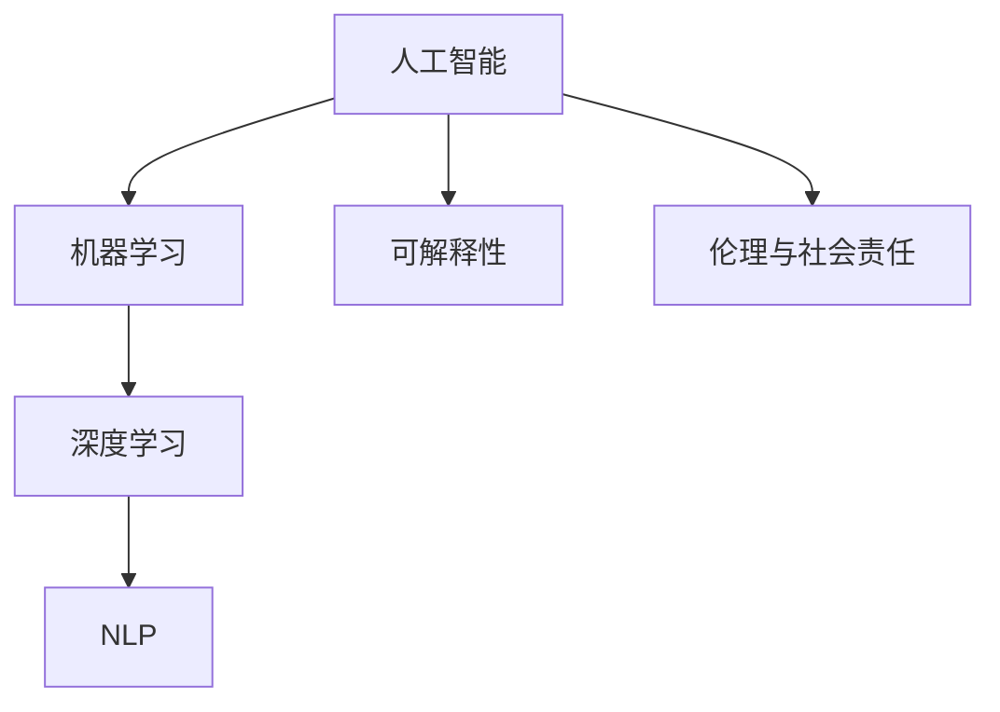

                 

# AI在特定领域的局限性

## 1. 背景介绍

### 1.1 问题由来
人工智能（AI）技术在多个领域取得了显著的进展，但在某些特定领域的应用仍存在显著的局限性。例如，尽管AI在图像识别、语音识别、自然语言处理（NLP）等任务上表现出色，但在医学、伦理、社会责任等方面，AI仍面临着诸多挑战。本文将探讨AI在这些特定领域的局限性，并分析其背后的原因，为未来AI技术的改进和应用提供参考。

### 1.2 问题核心关键点
AI技术在特定领域的局限性主要体现在以下几个方面：
- 数据质量问题：AI模型通常需要大量的高质量数据进行训练，但在某些领域（如医学、伦理等），数据获取和标注成本高，数据质量难以保证。
- 模型可解释性不足：许多AI模型，尤其是深度学习模型，被视为"黑盒"，难以解释其决策过程，这在涉及人类健康和伦理的问题上尤为突出。
- 伦理和社会责任：AI模型可能带有偏见，加剧社会不平等，对伦理和公平问题带来挑战。
- 技术瓶颈：AI模型在某些任务上存在技术瓶颈，如情感理解和推理能力，尚未达到人类水平。

### 1.3 问题研究意义
探讨AI在特定领域的局限性，有助于揭示AI技术的实际应用潜力，识别技术不足，推动相关领域的AI技术改进和应用推广。通过分析AI在这些领域面临的挑战，可以为研究人员和实践者提供指导，推动AI技术的可持续发展。

## 2. 核心概念与联系

### 2.1 核心概念概述

为了更好地理解AI在特定领域的应用局限性，首先需要明确几个核心概念：

- **人工智能（AI）**：利用计算机技术模拟人类智能的过程，包括感知、学习、推理、规划等能力。
- **机器学习（ML）**：通过数据驱动的算法，使计算机系统能够从数据中学习并做出预测或决策。
- **深度学习（DL）**：一种特殊的机器学习方法，通过多层神经网络结构进行复杂模式识别和预测。
- **自然语言处理（NLP）**：使计算机能够理解、处理和生成人类语言的技术。
- **可解释性**：AI模型能够清晰、透明地解释其决策过程和依据的能力。
- **伦理与社会责任**：在AI应用中考虑人类价值观、社会公平和道德原则的必要性。

这些概念之间的逻辑关系可以通过以下Mermaid流程图来展示：



这个流程图展示了AI在特定领域面临的局限性，从机器学习、深度学习到自然语言处理，再到可解释性和伦理责任，各个概念之间的联系和相互作用。

## 3. 核心算法原理 & 具体操作步骤
### 3.1 算法原理概述

AI在特定领域的局限性主要源于算法原理和数据应用的双重原因。

AI模型通常依赖大量的数据进行训练，以学习通用的规律和模式。然而，在某些领域，数据获取和标注成本高昂，且数据质量难以保证，导致模型训练效果不理想。此外，AI模型的决策过程往往缺乏可解释性，尤其在涉及人类健康和伦理的问题上，这一问题尤为突出。最后，AI模型的伦理和社会责任问题也需要得到重视，以确保其应用符合人类的价值观和道德原则。

### 3.2 算法步骤详解

AI在特定领域的应用一般包括以下几个关键步骤：

**Step 1: 数据收集与预处理**
- 收集相关领域的高质量数据。
- 对数据进行清洗、标注和处理，确保数据质量。

**Step 2: 模型选择与训练**
- 选择合适的AI模型进行训练，如卷积神经网络（CNN）、循环神经网络（RNN）、Transformer等。
- 使用适当的训练策略和算法，如随机梯度下降（SGD）、Adam等，进行模型训练。

**Step 3: 模型评估与验证**
- 使用交叉验证等方法评估模型性能。
- 在验证集上测试模型，确保其在新数据上的泛化能力。

**Step 4: 模型部署与应用**
- 将训练好的模型部署到实际应用中。
- 持续收集反馈，不断优化模型。

### 3.3 算法优缺点

AI在特定领域的优势：
- **自动化**：自动化数据处理、模型训练和推理，提高效率。
- **准确性**：在大数据和高质量数据的支持下，AI模型可以取得很高的准确性。

AI在特定领域的局限性：
- **数据依赖**：模型性能依赖高质量数据，数据获取和标注成本高昂。
- **可解释性不足**：深度学习等黑盒模型难以解释其决策过程。
- **伦理与社会责任**：模型可能带有偏见，导致伦理和社会责任问题。
- **技术瓶颈**：某些任务上，AI模型的性能尚未达到人类水平。

### 3.4 算法应用领域

AI在特定领域的应用范围非常广泛，包括但不限于：

- **医学**：AI在医学影像分析、疾病诊断、个性化治疗等方面展现了巨大潜力，但也面临着数据隐私、模型解释性等问题。
- **伦理**：AI在伦理决策、公平性评估等方面存在挑战，需要引入伦理和社会责任机制。
- **法律**：AI在法律分析、合同审查、法律咨询等方面得到应用，但也需注意隐私保护和决策透明。
- **金融**：AI在风险管理、欺诈检测、投资分析等方面表现出色，但也需关注数据隐私和模型公正性。
- **教育**：AI在个性化学习、智能辅导、内容推荐等方面应用广泛，但也需关注学生隐私和教育公平。

## 4. 数学模型和公式 & 详细讲解 & 举例说明

### 4.1 数学模型构建

AI在特定领域的应用通常基于数学模型进行建模和优化。以下是几个典型的数学模型：

- **线性回归模型**：用于预测连续型变量，模型形式为 $y = \beta_0 + \beta_1 x_1 + \cdots + \beta_n x_n + \epsilon$，其中 $\beta_0, \beta_1, \cdots, \beta_n$ 为模型系数，$\epsilon$ 为误差项。
- **决策树模型**：用于分类和回归任务，模型形式为 $y = T(x)$，其中 $T$ 为决策树结构，$x$ 为输入特征。
- **卷积神经网络（CNN）**：用于图像识别任务，模型形式为 $y = F(A \cdot H(\sigma(B \cdot X + C)))$，其中 $A, B, C$ 为卷积核，$X$ 为输入图像，$H$ 为激活函数，$F$ 为池化操作。
- **长短时记忆网络（LSTM）**：用于序列数据处理，模型形式为 $h_t = \tanh(W \cdot h_{t-1} + U \cdot x_t + b)$，其中 $W, U$ 为权重矩阵，$b$ 为偏置向量。

### 4.2 公式推导过程

以线性回归模型为例，其最小二乘法优化目标函数为：

$$
\min_{\beta_0, \beta_1, \cdots, \beta_n} \sum_{i=1}^n (y_i - (\beta_0 + \beta_1 x_{i1} + \cdots + \beta_n x_{in}))^2
$$

对目标函数求导，得：

$$
\frac{\partial}{\partial \beta_j} \sum_{i=1}^n (y_i - (\beta_0 + \beta_1 x_{i1} + \cdots + \beta_n x_{in}))^2 = -2\sum_{i=1}^n (y_i - (\beta_0 + \beta_1 x_{i1} + \cdots + \beta_n x_{in})) x_{ij}
$$

令上式为0，得：

$$
\beta_j = \frac{\sum_{i=1}^n (y_i - \hat{y}_i) x_{ij}}{\sum_{i=1}^n x_{ij}^2}
$$

其中 $\hat{y}_i$ 为预测值。

### 4.3 案例分析与讲解

以医学影像分析为例，AI模型通过对大量标注好的医学影像数据进行学习，可以自动识别和分类不同的病变区域。然而，该模型依赖高质量的标注数据，且其决策过程难以解释，可能带有医疗专家的偏见。因此，在实际应用中，需要特别关注数据质量、模型可解释性和伦理问题。

## 5. 项目实践：代码实例和详细解释说明

### 5.1 开发环境搭建

在进行AI项目实践前，我们需要准备好开发环境。以下是使用Python进行TensorFlow开发的环境配置流程：

1. 安装Anaconda：从官网下载并安装Anaconda，用于创建独立的Python环境。

2. 创建并激活虚拟环境：
```bash
conda create -n tf-env python=3.8 
conda activate tf-env
```

3. 安装TensorFlow：根据CUDA版本，从官网获取对应的安装命令。例如：
```bash
conda install tensorflow tensorflow-gpu -c conda-forge
```

4. 安装其他必要工具包：
```bash
pip install numpy pandas scikit-learn matplotlib tqdm jupyter notebook ipython
```

完成上述步骤后，即可在`tf-env`环境中开始AI项目实践。

### 5.2 源代码详细实现

以下是使用TensorFlow进行医学影像分析的代码实现。

```python
import tensorflow as tf
import numpy as np
import matplotlib.pyplot as plt
from tensorflow.keras.layers import Conv2D, MaxPooling2D, Flatten, Dense
from tensorflow.keras.models import Sequential

# 加载数据
(x_train, y_train), (x_test, y_test) = tf.keras.datasets.mnist.load_data()
x_train = x_train.reshape((x_train.shape[0], 28, 28, 1))
x_test = x_test.reshape((x_test.shape[0], 28, 28, 1))
x_train = x_train / 255.0
x_test = x_test / 255.0

# 定义模型
model = Sequential()
model.add(Conv2D(32, (3, 3), activation='relu', input_shape=(28, 28, 1)))
model.add(MaxPooling2D((2, 2)))
model.add(Conv2D(64, (3, 3), activation='relu'))
model.add(MaxPooling2D((2, 2)))
model.add(Flatten())
model.add(Dense(64, activation='relu'))
model.add(Dense(10, activation='softmax'))

# 编译模型
model.compile(optimizer='adam',
              loss=tf.keras.losses.SparseCategoricalCrossentropy(from_logits=True),
              metrics=['accuracy'])

# 训练模型
model.fit(x_train, y_train, epochs=5, validation_data=(x_test, y_test))
```

### 5.3 代码解读与分析

让我们再详细解读一下关键代码的实现细节：

**数据加载**：使用TensorFlow内置的MNIST数据集，将数据加载到模型中进行训练和测试。

**模型定义**：使用Sequential模型定义多层神经网络，包含卷积层、池化层和全连接层，用于图像识别。

**模型编译**：使用Adam优化器，交叉熵损失函数，以及准确率作为评估指标。

**模型训练**：使用fit方法进行模型训练，通过交叉验证等方法评估模型性能。

## 6. 实际应用场景

### 6.1 医疗影像分析

AI在医疗影像分析中的应用，如癌症检测、病变区域识别等，已经取得了显著进展。然而，该领域的数据获取和标注成本高昂，且模型性能依赖高质量的数据，因此存在较大的局限性。此外，模型的决策过程缺乏可解释性，难以在医疗领域进行推广应用。

### 6.2 法律文本分析

AI在法律文本分析中的应用，如合同审查、法律咨询等，能够显著提高法律服务的效率和准确性。然而，法律文本数据的复杂性和多样性，使得模型在实际应用中面临较大的挑战，尤其是在处理法律语言中的复杂逻辑和语义时，模型的解释性和公正性问题尤为突出。

### 6.3 金融风险管理

AI在金融风险管理中的应用，如信用评估、欺诈检测等，能够帮助金融机构降低风险。然而，金融数据的隐私保护问题、模型的公正性问题以及伦理问题，都需要在实际应用中加以考虑。

### 6.4 未来应用展望

尽管AI在特定领域存在诸多局限性，但其应用前景依然广阔。未来，AI技术的发展将进一步推动其在医学、法律、金融等领域的应用，为相关行业带来新的变革。同时，随着对数据质量和模型解释性的重视，AI技术的改进也将更加注重解决这些实际问题。

## 7. 工具和资源推荐

### 7.1 学习资源推荐

为了帮助开发者系统掌握AI在特定领域的应用和局限性，这里推荐一些优质的学习资源：

1. 《深度学习》系列书籍：涵盖深度学习理论基础、模型构建和优化等方面内容，是理解AI技术的基石。
2. 《机器学习实战》系列书籍：通过实际项目案例，介绍机器学习算法的应用，适合实战练习。
3. 《自然语言处理综述》论文：综述了自然语言处理领域的研究进展，涵盖多种NLP任务和模型。
4. 《AI伦理与法律》课程：介绍AI技术的伦理和法律问题，帮助开发者理解AI应用中的社会责任。
5. Kaggle竞赛平台：提供大量实际应用中的数据集和竞赛任务，实践AI技术。

通过对这些资源的学习实践，相信你一定能够全面理解AI在特定领域的应用和局限性，为未来的技术创新和应用推广提供指导。

### 7.2 开发工具推荐

高效的开发离不开优秀的工具支持。以下是几款用于AI开发和实践的常用工具：

1. TensorFlow：基于数据流图的深度学习框架，易于调试和优化。
2. PyTorch：灵活的深度学习框架，适合快速迭代研究。
3. Jupyter Notebook：交互式编程环境，便于实验记录和分享。
4. Weights & Biases：模型训练的实验跟踪工具，记录和可视化实验结果。
5. TensorBoard：TensorFlow配套的可视化工具，监测模型训练状态。

合理利用这些工具，可以显著提升AI项目的开发效率，加快创新迭代的步伐。

### 7.3 相关论文推荐

AI在特定领域的研究源于学界的持续探索。以下是几篇奠基性的相关论文，推荐阅读：

1. Deep Neural Networks for Natural Language Processing（NLP）：介绍深度学习在NLP中的应用，展示其优越性。
2. Explainable AI：探讨AI模型的可解释性问题，提出多种方法提升模型解释性。
3. Fairness in Machine Learning：分析机器学习中的公平性问题，提出改进方法。
4. Ethical AI：探讨AI技术的伦理问题，提出伦理准则和解决方案。
5. AI for Good：介绍AI在社会责任和公益方面的应用，推动AI技术的可持续发展。

这些论文代表了大AI在特定领域的研究脉络，通过学习这些前沿成果，可以帮助研究者把握学科前进方向，激发更多的创新灵感。

## 8. 总结：未来发展趋势与挑战

### 8.1 总结

本文对AI在特定领域的应用和局限性进行了全面系统的介绍。首先阐述了AI技术在特定领域面临的数据质量、可解释性、伦理和社会责任等方面的问题。其次，从原理到实践，详细讲解了AI在特定领域的应用步骤，提供了完整的代码实例和解释分析。最后，本文探讨了AI在特定领域的发展趋势和面临的挑战，为未来的研究提供指导。

通过本文的系统梳理，可以看到，AI在特定领域的应用前景广阔，但同时也面临着诸多挑战。这些挑战包括数据获取和标注的难度、模型解释性和公正性问题、伦理和社会责任等。未来，AI技术的发展将需要多方面的努力，包括数据质量提升、模型解释性增强、伦理和公平性问题的解决等，以推动AI技术的可持续发展。

### 8.2 未来发展趋势

展望未来，AI在特定领域的应用将呈现以下几个发展趋势：

1. **数据质量的提升**：随着数据获取和标注技术的进步，AI模型将依赖更高质量的数据进行训练，提升模型性能。
2. **模型解释性的增强**：AI模型的解释性将逐步增强，便于人类理解和信任。
3. **伦理和社会责任的重视**：AI技术的伦理和社会责任问题将得到更多重视，确保其应用符合人类价值观。
4. **跨学科融合**：AI技术将与法律、医学、金融等领域进行深入融合，提升各领域的智能化水平。
5. **多模态信息融合**：AI技术将结合视觉、语音、文本等多种信息源，提升其综合理解和决策能力。

以上趋势凸显了AI技术在特定领域的应用前景，为相关领域的研究者和实践者提供了方向指导。

### 8.3 面临的挑战

尽管AI在特定领域的应用前景广阔，但在迈向更加智能化、普适化应用的过程中，仍面临诸多挑战：

1. **数据获取和标注的难度**：在特定领域，数据获取和标注成本高昂，数据质量难以保证。
2. **模型的解释性和公正性**：AI模型的解释性和公正性问题，尤其在有伦理和社会责任要求的领域，难以满足人类需求。
3. **伦理和社会责任问题**：AI技术可能带有偏见，加剧社会不平等，对伦理和公平问题带来挑战。
4. **技术瓶颈**：AI模型在某些任务上存在技术瓶颈，难以达到人类水平。
5. **模型的可扩展性**：AI模型在大规模数据和复杂任务上的可扩展性问题，需进一步解决。

这些挑战需要学界和产业界共同努力，推动AI技术的改进和应用推广。只有从数据、算法、伦理等多个维度进行全面优化，才能更好地发挥AI技术在特定领域的应用潜力。

### 8.4 研究展望

未来，AI技术在特定领域的研究方向将主要集中在以下几个方面：

1. **数据质量的提升**：开发更加高效的数据获取和标注技术，提升数据质量。
2. **模型解释性的增强**：探索多种方法提升AI模型的可解释性，增强其可信度。
3. **伦理和社会责任的解决**：研究和应用AI技术的伦理准则，确保其应用符合人类价值观。
4. **跨学科融合**：推动AI技术与法律、医学、金融等领域进行深入融合，提升各领域的智能化水平。
5. **多模态信息融合**：结合视觉、语音、文本等多种信息源，提升AI模型的综合理解和决策能力。

这些研究方向将推动AI技术在特定领域的进一步发展，为相关领域的研究者和实践者提供指导。通过不断探索和改进，AI技术将在医疗、法律、金融等领域发挥更大的作用，为人类社会的进步和繁荣带来新的机遇。

## 9. 附录：常见问题与解答

**Q1：AI在特定领域的应用有哪些局限性？**

A: AI在特定领域的应用存在以下局限性：
1. 数据质量问题：数据获取和标注成本高昂，数据质量难以保证。
2. 模型可解释性不足：深度学习等黑盒模型难以解释其决策过程。
3. 伦理与社会责任：AI模型可能带有偏见，导致伦理和社会责任问题。
4. 技术瓶颈：某些任务上，AI模型的性能尚未达到人类水平。

**Q2：如何提升AI模型在特定领域的应用效果？**

A: 提升AI模型在特定领域的应用效果，可以从以下几个方面进行：
1. 数据质量提升：采用高效的数据获取和标注技术，提升数据质量。
2. 模型解释性增强：采用可解释性方法，如LIME、SHAP等，增强模型解释性。
3. 伦理和社会责任：引入伦理和社会责任机制，确保模型应用符合人类价值观。
4. 跨学科融合：推动AI技术与法律、医学、金融等领域进行深入融合，提升各领域的智能化水平。
5. 多模态信息融合：结合视觉、语音、文本等多种信息源，提升AI模型的综合理解和决策能力。

**Q3：AI在特定领域面临的技术瓶颈是什么？**

A: AI在特定领域面临的技术瓶颈主要体现在以下几个方面：
1. 数据获取和标注成本高昂，数据质量难以保证。
2. AI模型的解释性和公正性问题，尤其在有伦理和社会责任要求的领域，难以满足人类需求。
3. AI技术可能带有偏见，加剧社会不平等，对伦理和公平问题带来挑战。
4. 某些任务上，AI模型的性能尚未达到人类水平。

**Q4：AI在特定领域的未来发展趋势是什么？**

A: AI在特定领域的未来发展趋势主要体现在以下几个方面：
1. 数据质量的提升：随着数据获取和标注技术的进步，AI模型将依赖更高质量的数据进行训练，提升模型性能。
2. 模型解释性的增强：AI模型的解释性将逐步增强，便于人类理解和信任。
3. 伦理和社会责任的重视：AI技术的伦理和社会责任问题将得到更多重视，确保其应用符合人类价值观。
4. 跨学科融合：AI技术将与法律、医学、金融等领域进行深入融合，提升各领域的智能化水平。
5. 多模态信息融合：AI技术将结合视觉、语音、文本等多种信息源，提升其综合理解和决策能力。

**Q5：AI在特定领域面临的主要挑战是什么？**

A: AI在特定领域面临的主要挑战包括：
1. 数据获取和标注的难度：在特定领域，数据获取和标注成本高昂，数据质量难以保证。
2. 模型的解释性和公正性：AI模型的解释性和公正性问题，尤其在有伦理和社会责任要求的领域，难以满足人类需求。
3. 伦理和社会责任问题：AI技术可能带有偏见，加剧社会不平等，对伦理和公平问题带来挑战。
4. 技术瓶颈：AI模型在某些任务上存在技术瓶颈，难以达到人类水平。
5. 模型的可扩展性：AI模型在大规模数据和复杂任务上的可扩展性问题，需进一步解决。

这些挑战需要学界和产业界共同努力，推动AI技术的改进和应用推广。只有从数据、算法、伦理等多个维度进行全面优化，才能更好地发挥AI技术在特定领域的应用潜力。

