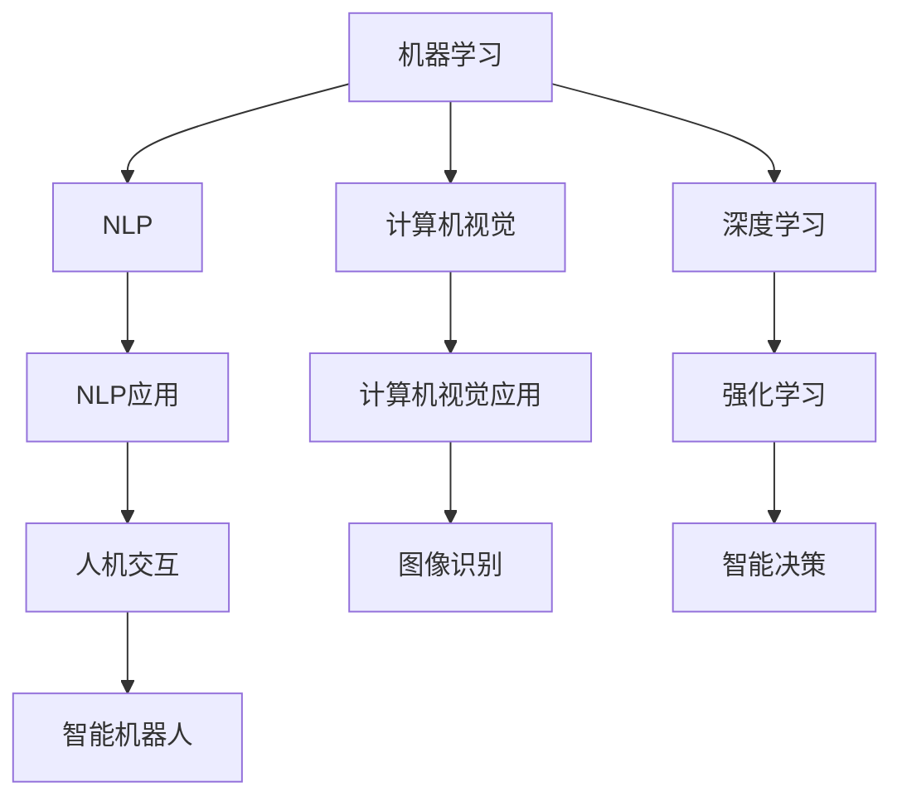

                 

# AI在现实中的应用场景

> 关键词：人工智能, AI技术, 机器学习, 深度学习, 自然语言处理, 计算机视觉, 机器人技术, 智能制造

## 1. 背景介绍

人工智能（Artificial Intelligence, AI）自20世纪50年代以来，经过数十年的发展，已经成为推动现代社会进步的重要力量。随着深度学习、自然语言处理、计算机视觉、机器人技术等关键技术的突破，AI技术正在不断突破现有应用边界，深刻改变人们的生活和工作方式。本文将围绕AI技术在现实中的应用场景，系统梳理其发展脉络、核心概念及应用实例，并展望未来发展趋势与挑战。

## 2. 核心概念与联系

### 2.1 核心概念概述

AI技术的核心在于其能够模拟人类的智能行为，实现信息的自动化处理和智能化决策。这一过程涉及多个关键技术领域的协同发展，包括但不限于：

- **机器学习（Machine Learning, ML）**：通过数据驱动的方法，使机器能够自动学习和优化决策模型。
- **深度学习（Deep Learning, DL）**：一种基于神经网络结构的多层前向传播算法，能够处理大规模非线性数据。
- **自然语言处理（Natural Language Processing, NLP）**：使计算机能够理解、解释和生成人类语言，实现人机交互。
- **计算机视觉（Computer Vision, CV）**：使计算机能够“看”懂图像和视频，进行目标检测、图像识别等任务。
- **机器人技术（Robotics）**：结合AI与机械设计，实现机器的自主感知、决策和动作。
- **智能制造（Smart Manufacturing）**：将AI技术与工业自动化相结合，提升生产效率和产品质量。

这些核心技术之间的联系，可以通过以下Mermaid流程图来展示：



这个流程图展示了不同AI技术之间的相互依赖和融合：

1. 机器学习是AI技术的基石，通过数据驱动实现模型训练。
2. 深度学习基于神经网络，实现对复杂数据的建模和处理。
3. NLP和CV作为感知层，分别处理文本和图像数据。
4. 强化学习用于智能决策，优化策略模型。
5. AI技术通过NLP和CV实现人机交互，利用深度学习进行多模态数据融合，通过机器人技术实现智能决策和动作执行。

## 3. 核心算法原理 & 具体操作步骤
### 3.1 算法原理概述

AI技术在现实中的应用，通常涉及从数据采集、模型训练到模型部署的多个步骤。这些步骤可以分为数据处理、模型构建、训练优化、应用部署等环节。

- **数据处理**：从真实世界中采集数据，进行清洗、标注和预处理，以便于模型训练。
- **模型构建**：选择合适的算法和架构，构建模型。常用的算法包括监督学习、无监督学习、强化学习等。
- **训练优化**：通过大量的数据和计算资源，训练模型，并优化模型的性能。
- **应用部署**：将训练好的模型部署到实际应用场景中，实现智能化决策和处理。

### 3.2 算法步骤详解

以下是AI技术在现实中的应用步骤，以一个典型的智能推荐系统为例：

**Step 1: 数据采集与预处理**
- 从电商、社交媒体、在线平台等渠道收集用户行为数据，如浏览历史、点击记录、评分反馈等。
- 清洗数据，去除噪声和不相关记录，确保数据质量。
- 对数据进行标注，生成监督学习所需的训练样本和测试样本。

**Step 2: 模型构建**
- 选择合适的算法和架构，如协同过滤、深度学习模型等。
- 设计模型输入输出格式，构建数据流图。
- 选择适当的损失函数和优化器，如交叉熵、AdamW等。

**Step 3: 模型训练**
- 将数据集划分为训练集、验证集和测试集。
- 使用训练集进行模型训练，最小化损失函数。
- 在验证集上评估模型性能，调整模型参数，避免过拟合。
- 使用测试集进行最终评估，确保模型泛化性能。

**Step 4: 模型部署与优化**
- 将训练好的模型部署到推荐引擎中。
- 实时处理用户请求，预测并推荐商品或内容。
- 根据用户反馈，动态调整模型参数，持续优化推荐效果。

### 3.3 算法优缺点

AI技术在现实应用中，具有以下优点：

- **高效性**：AI技术能够自动处理大规模数据，快速完成复杂计算任务，显著提高工作效率。
- **精准性**：通过深度学习和强化学习，AI模型能够在海量数据中发现规律，进行精确预测和决策。
- **自适应性**：AI模型能够根据反馈信息进行自我调整，不断优化性能，适应环境变化。

但同时也存在一些挑战：

- **数据依赖**：AI模型的性能很大程度上依赖于数据质量，数据缺失或不完整会影响模型效果。
- **计算资源消耗**：模型训练和部署需要大量的计算资源，对硬件设施提出了高要求。
- **模型解释性**：深度学习模型通常“黑盒”运作，难以解释其决策过程，影响应用可信任度。
- **伦理与隐私**：AI技术在应用中可能涉及个人隐私保护，伦理道德问题需慎重对待。

### 3.4 算法应用领域

AI技术的应用领域极其广泛，涵盖医疗、金融、教育、交通、制造等多个行业。以下是几个典型的应用实例：

**医疗领域**：
- **智能诊断**：通过图像识别技术，辅助医生进行疾病诊断。
- **药物研发**：利用深度学习优化药物分子结构设计，加速新药开发。
- **健康监测**：通过可穿戴设备采集生理数据，实时监控健康状况。

**金融领域**：
- **风险评估**：利用机器学习算法，预测金融风险，辅助投资决策。
- **欺诈检测**：通过异常检测模型，识别并防范金融欺诈行为。
- **个性化推荐**：基于用户行为数据，推荐个性化金融产品。

**教育领域**：
- **智能辅导**：通过自然语言处理技术，提供个性化学习辅导。
- **智能评估**：利用机器学习分析学生成绩，生成个性化评估报告。
- **资源推荐**：根据学生兴趣，推荐适合的在线课程和资料。

**交通领域**：
- **自动驾驶**：通过计算机视觉和深度学习技术，实现自动驾驶。
- **智能交通管理**：利用数据驱动的方法，优化交通流量和信号灯控制。
- **灾害预警**：通过图像识别和数据分析，预测自然灾害，提前预警。

**制造领域**：
- **智能制造**：通过AI技术优化生产流程，提高生产效率和产品质量。
- **质量检测**：利用计算机视觉进行产品缺陷检测，提升检测精度。
- **供应链管理**：通过预测分析，优化供应链管理，降低库存成本。

## 4. 数学模型和公式 & 详细讲解  
### 4.1 数学模型构建

AI技术中的数学模型通常涉及以下核心组件：

- **线性回归**：用于处理连续型数据，建立输入和输出之间的关系。
- **逻辑回归**：用于分类问题，通过sigmoid函数将输出映射到[0,1]区间。
- **卷积神经网络（CNN）**：用于图像处理，通过卷积层和池化层提取图像特征。
- **循环神经网络（RNN）**：用于序列数据处理，通过时间步递归更新隐藏状态。
- **注意力机制**：用于多模态数据融合，通过权重机制选择重要信息。

这些模型可以通过数学公式进行描述，例如：

**线性回归模型**：
$$
y = \theta^T x + b
$$
其中，$y$表示输出，$x$表示输入特征，$\theta$表示模型参数，$b$表示偏置项。

**逻辑回归模型**：
$$
P(y=1|x) = \frac{1}{1+e^{-\theta^T x}} = \sigma(\theta^T x)
$$
其中，$P(y=1|x)$表示输出为1的概率，$\sigma$表示sigmoid函数。

**卷积神经网络（CNN）**：
$$
h(x) = \max(0, W * x + b)
$$
其中，$h(x)$表示卷积层的输出，$W$表示卷积核，$b$表示偏置项，$*$表示卷积运算。

**循环神经网络（RNN）**：
$$
h_t = f(h_{t-1}, x_t)
$$
其中，$h_t$表示时间步$t$的隐藏状态，$f$表示时间步递归函数，$x_t$表示时间步$t$的输入。

**注意力机制**：
$$
\alpha_{ij} = \frac{e^{e^{\theta_{ij}^T x_i x_j}}}{\sum_{k=1}^K e^{e^{\theta_{ik}^T x_i x_k}}}
$$
其中，$\alpha_{ij}$表示输入$x_i$和输出$x_j$之间的注意力权重，$\theta_{ij}$表示注意力模型的参数。

### 4.2 公式推导过程

以一个简单的二分类问题为例，推导逻辑回归模型的损失函数和梯度公式：

**损失函数**：
$$
L = -\frac{1}{N} \sum_{i=1}^N [y_i \log P(y_i|x_i) + (1-y_i) \log (1-P(y_i|x_i))]
$$
其中，$L$表示损失函数，$N$表示样本数量，$y_i$表示真实标签，$P(y_i|x_i)$表示模型预测概率。

**梯度公式**：
$$
\frac{\partial L}{\partial \theta} = -\frac{1}{N} \sum_{i=1}^N [(y_i - P(y_i|x_i))x_i]
$$
其中，$\frac{\partial L}{\partial \theta}$表示损失函数对模型参数$\theta$的梯度，$x_i$表示输入特征。

### 4.3 案例分析与讲解

以智能推荐系统为例，分析其数学模型构建和应用：

**模型构建**：
- 输入特征：用户历史行为数据、商品属性数据。
- 输出标签：推荐商品ID。
- 模型结构：深度神经网络（DNN）、协同过滤算法等。

**训练优化**：
- 使用交叉熵损失函数。
- 优化器：Adam、SGD等。
- 超参数调优：学习率、批大小等。

**应用部署**：
- 实时处理用户请求，预测推荐商品ID。
- 根据用户反馈，动态调整模型参数。
- 使用缓存和负载均衡技术，提升系统响应速度。

## 5. 项目实践：代码实例和详细解释说明
### 5.1 开发环境搭建

进行AI项目开发，通常需要搭建以下开发环境：

1. **编程语言**：Python是最常用的AI开发语言，拥有丰富的科学计算库和框架。
2. **计算框架**：TensorFlow、PyTorch等深度学习框架，支持GPU/TPU计算，提升模型训练效率。
3. **科学计算库**：NumPy、Pandas、Scikit-learn等，用于数据处理和模型评估。
4. **开发工具**：Jupyter Notebook、VSCode等，方便调试和交互。
5. **数据管理**：Hadoop、Spark等大数据平台，用于数据存储和管理。

### 5.2 源代码详细实现

以下是一个简单的智能推荐系统的代码实现，包括数据预处理、模型训练和应用部署：

**数据预处理**：
```python
import pandas as pd
from sklearn.preprocessing import StandardScaler

# 读取数据
data = pd.read_csv('user_behavior.csv')

# 数据清洗
data = data.dropna()

# 数据标准化
scaler = StandardScaler()
data[['特征1', '特征2']] = scaler.fit_transform(data[['特征1', '特征2']])

# 特征工程
X = data[['特征1', '特征2']]
y = data['推荐商品ID']
```

**模型训练**：
```python
from tensorflow.keras.models import Sequential
from tensorflow.keras.layers import Dense

# 构建模型
model = Sequential([
    Dense(64, input_shape=(2,), activation='relu'),
    Dense(32, activation='relu'),
    Dense(1, activation='sigmoid')
])

# 编译模型
model.compile(optimizer='adam', loss='binary_crossentropy', metrics=['accuracy'])

# 训练模型
model.fit(X, y, epochs=10, batch_size=32, validation_split=0.2)
```

**应用部署**：
```python
from tensorflow.keras.models import load_model
from tensorflow.keras.preprocessing import sequence

# 加载模型
model = load_model('recommender_model.h5')

# 预测推荐商品ID
def predict_recommender(user_features):
    user_features = sequence.pad_sequences([user_features], maxlen=2)
    prediction = model.predict(user_features)
    return prediction[0][0]

# 实时处理用户请求
def handle_request(user_id, user_behavior):
    user_features = [user_behavior[user_id]['特征1'], user_behavior[user_id]['特征2']]
    recommendation = predict_recommender(user_features)
    return recommendation
```

### 5.3 代码解读与分析

**数据预处理**：
- 读取原始用户行为数据，并进行清洗和标准化处理。
- 特征工程：选择与推荐相关的特征，并进行归一化处理。

**模型训练**：
- 构建深度神经网络模型，包括输入层、隐藏层和输出层。
- 使用二分类交叉熵损失函数，Adam优化器进行模型训练。
- 设置训练轮数和批大小，并在验证集上监控模型性能。

**应用部署**：
- 加载训练好的模型，定义预测函数。
- 实时处理用户请求，获取用户特征并进行预测。
- 返回推荐商品ID，供业务系统调用。

## 6. 实际应用场景
### 6.1 智能推荐系统

智能推荐系统是AI技术在电商、社交媒体等平台的重要应用。通过分析用户行为数据，推荐系统能够预测用户兴趣，实现个性化推荐，提升用户满意度和平台转化率。

**实际应用**：
- **电商推荐**：根据用户浏览和购买历史，推荐相关商品。
- **内容推荐**：基于用户阅读和观看历史，推荐相关文章和视频。
- **广告推荐**：分析用户行为数据，精准投放广告。

**技术实现**：
- 数据采集：从日志、点击流等渠道采集用户行为数据。
- 特征提取：选择用户行为特征，如浏览时间、点击次数、收藏状态等。
- 模型训练：使用协同过滤、深度学习等模型，预测用户兴趣。
- 推荐展示：根据用户兴趣，生成推荐列表，并在平台展示。

### 6.2 智能客服系统

智能客服系统通过自然语言处理技术，实现自动解答用户咨询，提升客户服务效率和满意度。

**实际应用**：
- **自动应答**：根据用户输入，自动生成并返回回答。
- **语音交互**：通过语音识别和合成技术，实现语音客服。
- **情感分析**：识别用户情绪，提供个性化服务。

**技术实现**：
- 语音识别：将用户语音转换为文本，提取语音特征。
- 自然语言处理：使用BERT、GPT等模型，理解用户意图。
- 自动回复：根据意图生成回复，并进行情感分析。
- 语音合成：将文本转换为语音，播放给用户。

### 6.3 医疗影像分析

医疗影像分析通过计算机视觉技术，辅助医生进行疾病诊断和治疗方案设计。

**实际应用**：
- **图像识别**：自动检测和标记病变区域。
- **病理分析**：分析病理切片，辅助诊断。
- **手术辅助**：通过增强现实技术，辅助手术操作。

**技术实现**：
- 数据采集：从CT、MRI等设备采集影像数据。
- 数据预处理：进行图像清洗和增强处理。
- 模型训练：使用卷积神经网络等模型，进行病变检测和分类。
- 结果输出：生成标注结果，辅助医生诊断和治疗。

### 6.4 智能交通系统

智能交通系统通过AI技术，优化交通流量管理，提升道路通行效率和安全。

**实际应用**：
- **交通信号控制**：根据实时交通数据，优化信号灯控制。
- **自动驾驶**：通过计算机视觉和深度学习技术，实现自动驾驶。
- **交通预警**：利用图像识别技术，预测和预防交通事故。

**技术实现**：
- 数据采集：通过摄像头、传感器等设备，采集实时交通数据。
- 数据预处理：进行图像和数据清洗。
- 模型训练：使用深度学习模型，进行交通流量预测和信号控制。
- 系统部署：将模型部署到交通管理系统，进行实时决策和控制。

## 7. 工具和资源推荐
### 7.1 学习资源推荐

为了帮助开发者掌握AI技术的核心概念和实现细节，推荐以下学习资源：

1. **机器学习课程**：Coursera的“机器学习”课程，由斯坦福大学Andrew Ng教授主讲，涵盖机器学习的基础理论和实践应用。
2. **深度学习框架**：TensorFlow官方文档和教程，详细介绍了TensorFlow的各项功能和使用方法。
3. **自然语言处理工具**：NLTK和SpaCy，提供了丰富的NLP工具和库，支持文本预处理和模型训练。
4. **计算机视觉库**：OpenCV和PyTorch Vision，提供了高效的图像处理和模型训练工具。
5. **AI研究论文**：arXiv.org，最新的AI研究成果和论文，涵盖多个领域和技术方向。

### 7.2 开发工具推荐

AI技术的开发离不开高效的工具支持，推荐以下工具：

1. **编程语言**：Python是最常用的AI开发语言，拥有丰富的科学计算库和框架。
2. **计算框架**：TensorFlow、PyTorch等深度学习框架，支持GPU/TPU计算，提升模型训练效率。
3. **数据管理**：Hadoop、Spark等大数据平台，用于数据存储和管理。
4. **可视化工具**：TensorBoard、Visdom等，实时监测模型训练状态和性能。
5. **代码管理**：Git和GitHub，支持版本控制和代码协作。

### 7.3 相关论文推荐

AI技术的研究和应用离不开前沿的学术论文，推荐以下经典论文：

1. **深度学习**：Geoffrey Hinton的“A Neural Network for Machine Learning”，介绍了深度神经网络的基本原理和应用。
2. **自然语言处理**：Yoshua Bengio的“Learning Phrases, Words, and Sentences from Parallel Corpus”，介绍了神经机器翻译和文本生成技术。
3. **计算机视觉**：Leonid K. Shilkrot的“Learning Multiple Layers of Features from Tiny Images”，介绍了卷积神经网络在图像识别中的应用。
4. **强化学习**：Richard S. Sutton的“Reinforcement Learning: An Introduction”，介绍了强化学习的理论基础和算法实现。
5. **AI伦理与安全**：Marie-Line Sepulchre的“The Ethical Landscape of AI”，讨论了AI技术的伦理问题和应用安全。

## 8. 总结：未来发展趋势与挑战

### 8.1 研究成果总结

AI技术在现实中的应用场景已经涉及多个领域，推动了各行各业的数字化转型。通过深度学习、自然语言处理、计算机视觉等技术，AI技术在自动驾驶、智能推荐、医疗诊断等方面取得了显著成果。

### 8.2 未来发展趋势

未来，AI技术将进一步拓展其应用边界，实现更加智能化和普适化的发展。以下是几个可能的发展趋势：

1. **多模态融合**：AI技术将更加注重多模态数据的融合，实现视觉、语音、文本等多种信息的高效处理和交互。
2. **联邦学习**：通过分布式计算和隐私保护技术，实现模型在多个设备上的协同训练，提升模型性能。
3. **自监督学习**：利用自监督学习方法，从大量非标注数据中学习丰富的语言知识和视觉特征，提升模型泛化能力。
4. **弱监督学习**：在数据标注成本高昂的情况下，通过弱监督学习方法，利用少样本数据进行模型训练，提升数据利用效率。
5. **模型解释性**：通过模型可解释性和透明性技术，提升AI系统的可信度和安全性。

### 8.3 面临的挑战

尽管AI技术在现实应用中取得了显著进展，但仍面临诸多挑战：

1. **数据隐私和安全**：AI系统在处理大量数据时，涉及用户隐私保护和数据安全问题，需严格遵循法律法规。
2. **模型公平性和偏见**：AI模型在训练和应用过程中，可能存在数据偏见和算法歧视，需进行严格评估和改进。
3. **计算资源消耗**：AI模型的训练和推理需要大量计算资源，需优化算法和硬件配置。
4. **模型泛化能力**：AI模型在面对新数据时，可能出现泛化能力不足的问题，需进一步提升模型鲁棒性。
5. **伦理道德问题**：AI技术在应用过程中，需关注伦理道德问题，确保系统行为符合人类价值观和道德标准。

### 8.4 研究展望

未来，AI技术的研究将更加注重伦理性、公平性和安全性，同时也将更加注重多模态融合和跨领域协同。通过理论与实践的结合，AI技术将不断突破应用边界，实现更加智能和普适化的发展。

## 9. 附录：常见问题与解答

**Q1: AI技术是否能够完全替代人类？**

A: AI技术在许多领域已经取得了显著进展，但完全替代人类仍需时日。AI技术能够处理大量重复性和结构化任务，但在复杂情感理解和道德判断等方面，仍需要人类的参与和指导。

**Q2: AI技术的未来发展方向是什么？**

A: AI技术的未来发展方向将更加注重多模态融合、联邦学习、自监督学习等新兴技术，提升模型泛化能力和数据利用效率。同时，也将更加注重AI系统的伦理性、公平性和安全性。

**Q3: 如何评估AI模型的性能？**

A: AI模型的性能评估通常通过准确率、召回率、F1分数等指标进行衡量。同时，也需要关注模型的可解释性、鲁棒性和公平性。

**Q4: AI技术在医疗领域的应用有哪些？**

A: AI技术在医疗领域的应用包括智能诊断、药物研发、健康监测等。通过图像识别和自然语言处理技术，AI系统能够辅助医生进行疾病诊断和治疗方案设计。

**Q5: AI技术的伦理问题有哪些？**

A: AI技术的伦理问题主要包括数据隐私、模型偏见、算法歧视等。需通过严格的数据管理和模型训练，确保AI系统符合伦理道德标准，避免造成社会风险。

---

作者：禅与计算机程序设计艺术 / Zen and the Art of Computer Programming

