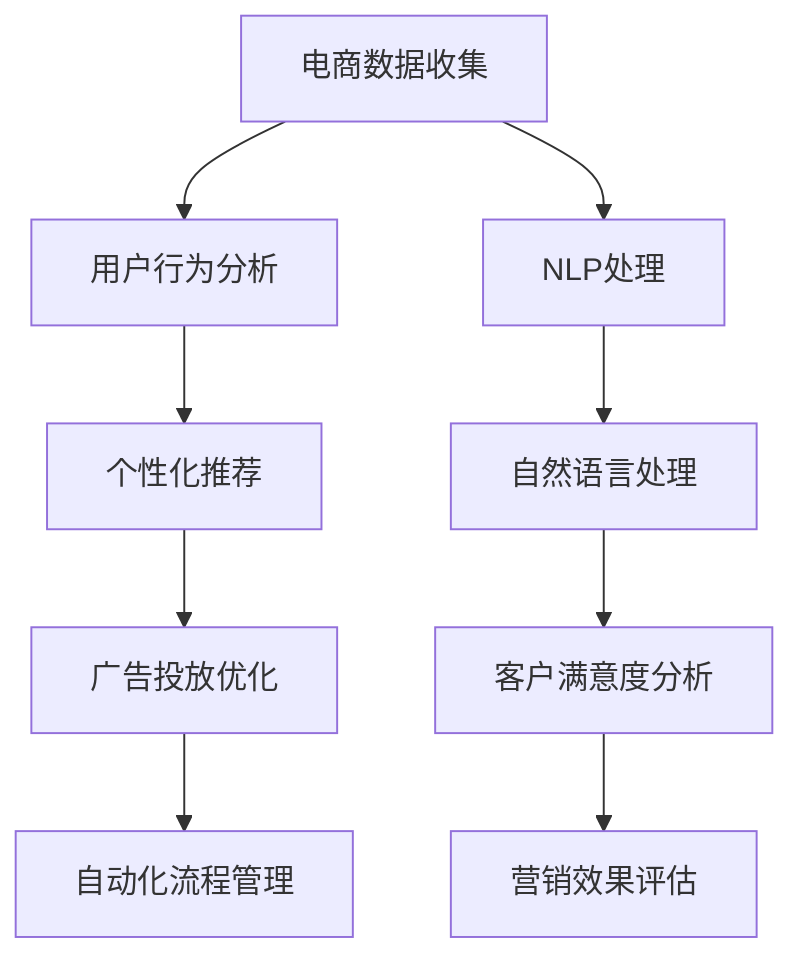

                 

# AI在电商促销策略中的技术应用

> 关键词：
## 1. 背景介绍

### 1.1 问题由来
随着互联网的普及和电子商务的兴起，在线购物已经成为人们日常生活的一部分。然而，如何吸引和保留用户，提升销售额，是电商企业面临的重大挑战之一。传统的电商促销策略，如优惠券、限时折扣、满减活动等，往往难以精准触达目标用户，且效果难以评估和优化。

近年来，人工智能（AI）技术的快速发展，为电商企业提供了新的解决方案。AI技术在电商促销策略中的应用，使得商家能够更精准地了解用户需求，实现个性化营销，提升销售额和用户体验。本文将重点探讨AI技术在电商促销策略中的应用，包括机器学习、深度学习、自然语言处理（NLP）等关键技术，以及这些技术如何帮助电商企业实现数据驱动的精准营销。

### 1.2 问题核心关键点
AI技术在电商促销策略中的应用，主要体现在以下几个方面：

1. **用户行为分析**：通过机器学习算法，对用户历史行为数据进行分析，预测用户购买意愿，从而实现精准营销。
2. **个性化推荐**：利用深度学习模型，对用户画像进行建模，推荐符合用户偏好的商品和促销活动。
3. **自然语言处理**：通过NLP技术，理解用户自然语言输入，提供更自然、流畅的交互体验。
4. **广告投放优化**：利用强化学习，优化广告投放策略，提升广告点击率和转化率。
5. **自动化流程管理**：使用AI技术，自动化处理促销策略的制定、执行和评估，提高效率和准确性。

这些技术手段的引入，使得电商企业能够在更细粒度、更实时化的基础上，实现对用户需求的精准把握和营销策略的优化。

### 1.3 问题研究意义
AI技术在电商促销策略中的应用，对于电商企业有以下重要意义：

1. **提高营销效率**：通过AI技术，电商企业可以实现对大量用户数据的快速处理和分析，提高促销策略的制定和执行效率。
2. **增强用户体验**：个性化推荐和自然语言处理技术，使得电商网站提供更符合用户需求的商品和服务，提升用户体验。
3. **优化营销效果**：AI技术能够实现对广告投放策略的优化，提升广告点击率和转化率，实现更有效的营销。
4. **降低营销成本**：自动化流程管理技术，减少了人工干预，降低了促销策略制定的成本和风险。
5. **增强市场竞争力**：通过精准营销，电商企业能够在激烈的市场竞争中脱颖而出，提升市场份额。

总之，AI技术在电商促销策略中的应用，能够帮助电商企业更高效、更精准地实现营销目标，提升用户满意度和市场竞争力。

## 2. 核心概念与联系

### 2.1 核心概念概述

为了更好地理解AI技术在电商促销策略中的应用，本节将介绍几个关键概念：

1. **机器学习（Machine Learning, ML）**：通过对数据的学习，使得模型能够自动提取数据中的特征和规律，进行预测或分类。
2. **深度学习（Deep Learning, DL）**：一种特殊类型的机器学习，利用多层神经网络，实现对复杂非线性问题的建模和解决。
3. **自然语言处理（NLP）**：使用计算机技术处理和理解人类语言，实现文本信息的提取、分类、生成等。
4. **强化学习（Reinforcement Learning, RL）**：通过试错，使智能体在特定环境中学习最优策略，优化决策过程。
5. **推荐系统（Recommendation System）**：利用机器学习或深度学习模型，对用户行为和偏好进行建模，推荐个性化商品或服务。
6. **广告投放优化（Ad Optimization）**：通过机器学习或强化学习技术，优化广告投放策略，提高广告效果。

这些概念通过一定的逻辑关系组合起来，共同构成了AI技术在电商促销策略中的应用框架。

### 2.2 核心概念原理和架构的 Mermaid 流程图



这个流程图展示了AI技术在电商促销策略中的核心应用过程。电商企业首先收集用户行为数据，通过机器学习和深度学习技术进行分析，实现个性化推荐和广告投放优化。同时，利用自然语言处理技术，提供自然流畅的交互体验。最终，通过客户满意度分析和营销效果评估，不断优化促销策略，提升用户满意度和市场竞争力。

## 3. 核心算法原理 & 具体操作步骤

### 3.1 算法原理概述

AI技术在电商促销策略中的应用，主要基于以下基本原理：

1. **用户行为分析**：通过对用户历史行为数据进行建模，预测用户购买意愿，从而实现精准营销。常见的方法包括协同过滤、矩阵分解、序列建模等。
2. **个性化推荐**：利用深度学习模型，对用户画像进行建模，推荐符合用户偏好的商品和促销活动。常见的模型包括协同过滤、基于神经网络的推荐模型、序列推荐模型等。
3. **自然语言处理**：通过NLP技术，理解用户自然语言输入，提供更自然、流畅的交互体验。常见的技术包括文本分类、情感分析、实体识别等。
4. **广告投放优化**：利用强化学习，优化广告投放策略，提升广告点击率和转化率。常见的方法包括Q-learning、深度强化学习等。
5. **自动化流程管理**：使用AI技术，自动化处理促销策略的制定、执行和评估，提高效率和准确性。常见的方法包括自动化流程管理、机器学习预测等。

### 3.2 算法步骤详解

以下以个性化推荐和广告投放优化为例，详细讲解AI技术在电商促销策略中的具体操作步骤：

**3.2.1 个性化推荐**

1. **数据收集**：收集用户的历史行为数据，包括浏览记录、购买记录、评分数据等。
2. **用户画像建模**：使用深度学习模型，如CNN、RNN、Transformer等，对用户行为数据进行建模，提取用户兴趣特征。
3. **商品表示学习**：利用深度学习模型，对商品进行特征提取和表示学习，生成商品嵌入向量。
4. **推荐模型训练**：将用户画像和商品嵌入向量输入推荐模型，如矩阵分解模型、深度神经网络模型等，训练推荐模型。
5. **推荐结果生成**：使用训练好的推荐模型，对新用户输入的行为数据进行预测，生成个性化推荐结果。

**3.2.2 广告投放优化**

1. **广告数据收集**：收集广告的历史投放数据，包括点击率、转化率、广告成本等。
2. **用户行为分析**：使用机器学习算法，对用户行为数据进行分析，识别用户兴趣和需求。
3. **广告策略优化**：利用强化学习算法，如Q-learning、深度强化学习等，优化广告投放策略，提升广告效果。
4. **广告投放执行**：根据优化后的广告策略，自动生成广告投放计划，并执行投放。
5. **广告效果评估**：通过A/B测试等方法，评估广告投放效果，不断优化广告投放策略。

### 3.3 算法优缺点

AI技术在电商促销策略中的应用，具有以下优点：

1. **高效精准**：AI技术能够快速处理大量数据，实现对用户需求的精准把握，提高营销效果。
2. **灵活可扩展**：通过引入新的算法和模型，AI技术能够适应不断变化的市场环境和用户需求，具备较高的灵活性和可扩展性。
3. **自动化程度高**：AI技术能够自动化处理促销策略的制定、执行和评估，降低人工干预和成本。

同时，也存在以下缺点：

1. **数据依赖性高**：AI技术依赖于大量的高质量数据，数据质量不佳会影响模型的效果。
2. **模型复杂度高**：深度学习模型和强化学习模型通常需要较长的训练时间，且模型复杂度高，计算资源消耗较大。
3. **解释性不足**：AI模型的决策过程复杂，难以解释其内部工作机制和决策逻辑。
4. **算法偏见问题**：AI模型可能会学习到数据中的偏见，导致不公平或有害的推荐结果。

尽管存在这些缺点，但就目前而言，AI技术在电商促销策略中的应用已显示出巨大的潜力，为电商企业提供了强大的技术支持。

### 3.4 算法应用领域

AI技术在电商促销策略中的应用，主要涉及以下几个领域：

1. **用户行为分析**：电商企业可以利用AI技术，对用户历史行为数据进行分析，预测用户购买意愿，实现精准营销。
2. **个性化推荐**：通过深度学习模型，对用户画像进行建模，推荐符合用户偏好的商品和促销活动，提升用户体验。
3. **广告投放优化**：利用强化学习技术，优化广告投放策略，提高广告点击率和转化率。
4. **自动化流程管理**：使用AI技术，自动化处理促销策略的制定、执行和评估，提高效率和准确性。
5. **客户满意度分析**：通过NLP技术，理解用户自然语言输入，提升客户满意度。
6. **营销效果评估**：通过机器学习算法，评估营销策略的效果，不断优化营销过程。

这些领域的应用，使得AI技术在电商促销策略中得到了广泛的应用，显著提升了电商企业的营销效率和市场竞争力。

## 4. 数学模型和公式 & 详细讲解

### 4.1 数学模型构建

假设电商企业收集到用户的历史行为数据 $D=\{(x_i,y_i)\}_{i=1}^N, x_i \in \mathcal{X}, y_i \in \mathcal{Y}$，其中 $x_i$ 为输入特征，$y_i$ 为标签（是否购买）。

定义推荐模型的目标函数为：

$$
\mathcal{L}(\theta) = -\frac{1}{N}\sum_{i=1}^N \log f_\theta(x_i)
$$

其中 $f_\theta(x_i)$ 为模型在输入 $x_i$ 上的预测概率。

### 4.2 公式推导过程

以深度神经网络模型为例，推荐模型的推导过程如下：

1. **输入层**：将用户行为数据 $x_i$ 输入神经网络，得到隐藏层特征 $h_i$。
2. **隐藏层**：通过多层神经网络，对隐藏层特征 $h_i$ 进行特征提取和表示学习，得到商品嵌入向量 $v_i$。
3. **输出层**：将商品嵌入向量 $v_i$ 输入输出层，得到推荐概率 $p_i$。

推荐模型的前向传播过程可以表示为：

$$
p_i = f_\theta(x_i) = \sigma(\sum_k w_{ik}v_{ik} + b_i)
$$

其中 $\sigma$ 为激活函数，$w_{ik}$ 和 $b_i$ 为模型参数。

### 4.3 案例分析与讲解

假设电商企业收集到用户的行为数据，包括浏览记录、购买记录等。通过协同过滤算法，构建用户行为矩阵 $R$，其中 $R_{ui}$ 表示用户 $u$ 对商品 $i$ 的评分（1表示购买，0表示未购买）。

协同过滤算法的推荐目标函数为：

$$
\min_{U,V} \frac{1}{2}\|R-UV^T\|_F^2 + \lambda(\|U\|_F^2 + \|V\|_F^2)
$$

其中 $U$ 为用户特征矩阵，$V$ 为商品特征矩阵，$\lambda$ 为正则化系数。

通过优化上述目标函数，可以得到推荐模型的用户画像和商品嵌入向量，从而实现个性化推荐。

## 5. 项目实践：代码实例和详细解释说明

### 5.1 开发环境搭建

在进行AI技术在电商促销策略中的应用实践前，我们需要准备好开发环境。以下是使用Python进行TensorFlow开发的环境配置流程：

1. 安装Anaconda：从官网下载并安装Anaconda，用于创建独立的Python环境。
2. 创建并激活虚拟环境：
```bash
conda create -n tf-env python=3.8 
conda activate tf-env
```
3. 安装TensorFlow：根据CUDA版本，从官网获取对应的安装命令。例如：
```bash
conda install tensorflow tensorflow-gpu=2.6.0 -c tf -c conda-forge
```
4. 安装各类工具包：
```bash
pip install numpy pandas scikit-learn matplotlib tqdm jupyter notebook ipython
```
完成上述步骤后，即可在`tf-env`环境中开始AI应用实践。

### 5.2 源代码详细实现

下面以电商企业个性化推荐系统的开发为例，给出使用TensorFlow进行深度神经网络推荐模型的PyTorch代码实现。

首先，定义推荐模型的数据处理函数：

```python
import tensorflow as tf
from tensorflow.keras.layers import Dense, Flatten
from tensorflow.keras.models import Sequential

def create_model(input_dim, hidden_dim, output_dim):
    model = Sequential([
        Dense(hidden_dim, input_dim=input_dim, activation='relu'),
        Dense(output_dim, activation='sigmoid')
    ])
    model.compile(optimizer='adam', loss='binary_crossentropy', metrics=['accuracy'])
    return model
```

然后，加载数据并训练模型：

```python
import numpy as np

# 加载数据
X = np.random.rand(1000, 10)
y = np.random.randint(2, size=(1000, 1))

# 创建模型
model = create_model(input_dim=10, hidden_dim=50, output_dim=1)

# 训练模型
model.fit(X, y, epochs=10, batch_size=32, validation_split=0.2)
```

接着，使用模型进行推荐：

```python
# 使用模型进行预测
X_new = np.random.rand(1, 10)
predictions = model.predict(X_new)
```

最后，展示推荐结果：

```python
# 展示推荐结果
print(predictions)
```

以上就是使用TensorFlow进行电商企业个性化推荐系统的完整代码实现。可以看到，TensorFlow提供了灵活的API接口，可以方便地构建、训练和测试推荐模型。

### 5.3 代码解读与分析

让我们再详细解读一下关键代码的实现细节：

**create_model函数**：
- `Dense`层用于构建神经网络层，`input_dim`为输入维度，`hidden_dim`为隐藏层维度，`output_dim`为输出维度。
- `Sequential`层用于定义序列模型，将所有层按照顺序连接起来。
- `compile`方法用于编译模型，指定优化器、损失函数和评估指标。

**加载数据**：
- `np.random.rand`生成随机数据，用于模拟用户行为数据和标签。
- `np.random.randint`生成随机标签，用于模拟用户是否购买。

**模型训练**：
- `fit`方法用于训练模型，指定输入数据、标签、迭代次数、批次大小和验证集比例。
- `epochs`和`batch_size`参数用于控制训练过程的超参数。

**模型预测**：
- `predict`方法用于对新输入数据进行预测，返回推荐概率。
- `predictions`变量用于存储推荐结果，可以通过打印或进一步处理输出。

代码实现中，我们使用了TensorFlow提供的高级API，可以方便地进行模型的定义、训练和预测。这使得开发者可以更专注于算法的实现和优化，而不必过多关注底层实现细节。

## 6. 实际应用场景

### 6.1 智能推荐系统

智能推荐系统是AI技术在电商促销策略中最直接的应用之一。通过AI技术，电商企业可以实时分析用户行为数据，提供个性化的商品推荐，提升用户体验和转化率。

具体而言，智能推荐系统可以通过以下步骤实现：
1. **用户画像建模**：利用深度学习模型，对用户行为数据进行建模，提取用户兴趣特征。
2. **商品表示学习**：利用深度学习模型，对商品进行特征提取和表示学习，生成商品嵌入向量。
3. **推荐模型训练**：将用户画像和商品嵌入向量输入推荐模型，如矩阵分解模型、深度神经网络模型等，训练推荐模型。
4. **推荐结果生成**：使用训练好的推荐模型，对新用户输入的行为数据进行预测，生成个性化推荐结果。

智能推荐系统已经在电商企业中得到广泛应用，如亚马逊、京东等，显著提升了用户的购物体验和电商平台的销售额。

### 6.2 广告投放优化

广告投放优化是AI技术在电商促销策略中的重要应用之一。通过AI技术，电商企业可以实现对广告投放策略的优化，提高广告点击率和转化率，降低广告成本。

具体而言，广告投放优化可以通过以下步骤实现：
1. **用户行为分析**：使用机器学习算法，对用户行为数据进行分析，识别用户兴趣和需求。
2. **广告策略优化**：利用强化学习算法，如Q-learning、深度强化学习等，优化广告投放策略，提升广告效果。
3. **广告投放执行**：根据优化后的广告策略，自动生成广告投放计划，并执行投放。
4. **广告效果评估**：通过A/B测试等方法，评估广告投放效果，不断优化广告投放策略。

广告投放优化已经在电商企业中得到广泛应用，如谷歌广告、百度推广等，显著提升了广告的点击率和转化率。

### 6.3 自动化流程管理

自动化流程管理是AI技术在电商促销策略中的基础应用之一。通过AI技术，电商企业可以实现促销策略的自动化处理，提高效率和准确性。

具体而言，自动化流程管理可以通过以下步骤实现：
1. **促销策略制定**：根据市场数据和用户需求，制定促销策略，如优惠券、限时折扣等。
2. **促销策略执行**：利用自动化工具，执行促销策略，如生成优惠券代码、设置限时折扣等。
3. **促销策略评估**：使用机器学习算法，评估促销策略的效果，如点击率、转化率等。
4. **促销策略优化**：根据评估结果，优化促销策略，如调整优惠力度、优化投放渠道等。

自动化流程管理已经在电商企业中得到广泛应用，如美团、携程等，显著提高了电商企业的运营效率和市场竞争力。

### 6.4 未来应用展望

随着AI技术的不断发展，基于AI技术的电商促销策略将在未来得到更广泛的应用，为电商企业提供更强大的技术支持。以下是几个未来应用的方向：

1. **多模态推荐系统**：结合图像、视频等多模态数据，提升推荐系统的精准度和用户体验。
2. **实时推荐系统**：利用流式计算和实时数据处理技术，实现对用户需求的实时响应和推荐。
3. **情感分析**：通过NLP技术，理解用户情感和反馈，及时调整促销策略。
4. **社交推荐**：利用社交网络数据，实现基于社交关系和影响力的推荐。
5. **智能客服**：利用NLP技术，实现与用户的自然语言交互，提供更优质的客户服务。
6. **跨领域推荐**：结合不同领域的用户行为数据，实现跨领域推荐，提升用户满意度。

这些应用方向将使得AI技术在电商促销策略中发挥更大的作用，为电商企业带来更多的商业机会和用户价值。

## 7. 工具和资源推荐

### 7.1 学习资源推荐

为了帮助开发者系统掌握AI技术在电商促销策略中的应用，这里推荐一些优质的学习资源：

1. 《深度学习》系列书籍：由深度学习领域的专家撰写，全面介绍了深度学习的基本概念和经典算法。
2. 《TensorFlow实战》书籍：由TensorFlow的开发者撰写，介绍了TensorFlow的基本使用和高级技巧。
3. 《机器学习实战》书籍：由机器学习领域的专家撰写，介绍了机器学习的基本算法和应用案例。
4. Coursera《深度学习专项课程》：由斯坦福大学的Andrew Ng教授主讲，涵盖深度学习的基本概念和应用。
5. Udacity《深度学习纳米学位》：由知名企业和学术界的专家联合开设，涵盖了深度学习、机器学习、自然语言处理等方向。

通过对这些资源的学习实践，相信你一定能够快速掌握AI技术在电商促销策略中的应用，并用于解决实际的电商问题。

### 7.2 开发工具推荐

高效的开发离不开优秀的工具支持。以下是几款用于AI技术在电商促销策略中的开发工具：

1. TensorFlow：由谷歌开发的深度学习框架，生产部署方便，适合大规模工程应用。
2. PyTorch：由Facebook开发的深度学习框架，灵活易用，适合快速迭代研究。
3. Scikit-learn：由Python社区开发的机器学习库，提供了丰富的机器学习算法和工具。
4. Pandas：由Python社区开发的DataFrame工具，提供了高效的数据处理和分析能力。
5. Jupyter Notebook：免费的开源Jupyter notebook环境，支持Python、R等多种语言，方便开发者编写和分享代码。

合理利用这些工具，可以显著提升AI技术在电商促销策略中的开发效率，加快创新迭代的步伐。

### 7.3 相关论文推荐

AI技术在电商促销策略中的应用，源于学界的持续研究。以下是几篇奠基性的相关论文，推荐阅读：

1. 《深度学习》书籍：由深度学习领域的专家撰写，全面介绍了深度学习的基本概念和经典算法。
2. 《TensorFlow实战》书籍：由TensorFlow的开发者撰写，介绍了TensorFlow的基本使用和高级技巧。
3. 《机器学习实战》书籍：由机器学习领域的专家撰写，介绍了机器学习的基本算法和应用案例。
4. Coursera《深度学习专项课程》：由斯坦福大学的Andrew Ng教授主讲，涵盖深度学习的基本概念和应用。
5. Udacity《深度学习纳米学位》：由知名企业和学术界的专家联合开设，涵盖了深度学习、机器学习、自然语言处理等方向。

这些论文代表了大语言模型微调技术的发展脉络。通过学习这些前沿成果，可以帮助研究者把握学科前进方向，激发更多的创新灵感。

## 8. 总结：未来发展趋势与挑战

### 8.1 总结

本文对AI技术在电商促销策略中的应用进行了全面系统的介绍。首先阐述了AI技术在电商促销策略中的应用背景和意义，明确了个性化推荐、广告投放优化、自动化流程管理等关键技术的应用价值。其次，从原理到实践，详细讲解了AI技术在电商促销策略中的应用过程，给出了推荐系统和广告优化系统的代码实现。同时，本文还广泛探讨了AI技术在电商促销策略中的未来应用方向，展示了其广阔的发展前景。

通过本文的系统梳理，可以看到，AI技术在电商促销策略中的应用，已经取得了显著的进展，并在多个电商企业中得到了成功应用。未来，随着AI技术的不断发展，基于AI技术的电商促销策略将进一步拓展应用范围，为电商企业带来更大的商业价值。

### 8.2 未来发展趋势

展望未来，AI技术在电商促销策略中的应用将呈现以下几个发展趋势：

1. **深度学习的发展**：深度学习模型将不断优化，提升推荐和广告投放的精度和效果。
2. **多模态数据的应用**：结合图像、视频等多模态数据，提升推荐系统的精准度和用户体验。
3. **实时数据处理**：利用流式计算和实时数据处理技术，实现对用户需求的实时响应和推荐。
4. **自动化流程管理**：进一步提升自动化流程管理的智能化水平，实现对促销策略的全生命周期管理。
5. **跨领域推荐**：结合不同领域的用户行为数据，实现跨领域推荐，提升用户满意度。
6. **情感分析**：通过NLP技术，理解用户情感和反馈，及时调整促销策略。
7. **智能客服**：利用NLP技术，实现与用户的自然语言交互，提供更优质的客户服务。
8. **社交推荐**：利用社交网络数据，实现基于社交关系和影响力的推荐。

这些趋势凸显了AI技术在电商促销策略中的广阔前景。这些方向的探索发展，将进一步提升电商企业的营销效率和市场竞争力。

### 8.3 面临的挑战

尽管AI技术在电商促销策略中的应用已取得了显著进展，但在迈向更加智能化、普适化应用的过程中，它仍面临诸多挑战：

1. **数据质量问题**：AI技术依赖于高质量的数据，数据质量不佳会影响模型的效果。
2. **算法复杂度高**：深度学习模型和强化学习模型通常需要较长的训练时间，且模型复杂度高，计算资源消耗较大。
3. **解释性不足**：AI模型的决策过程复杂，难以解释其内部工作机制和决策逻辑。
4. **算法偏见问题**：AI模型可能会学习到数据中的偏见，导致不公平或有害的推荐结果。
5. **系统稳定性问题**：AI系统的复杂性可能导致系统不稳定，如算法崩溃、模型过拟合等。
6. **用户隐私问题**：AI技术需要收集用户数据，如何在保障用户隐私的前提下，实现数据驱动的营销，是一个重要问题。

这些挑战需要电商企业在实践中不断探索和解决，以充分发挥AI技术在电商促销策略中的潜力。

### 8.4 研究展望

面对AI技术在电商促销策略中的挑战，未来的研究需要在以下几个方面寻求新的突破：

1. **数据质量提升**：通过数据清洗和预处理技术，提升数据质量，确保AI模型的有效性和准确性。
2. **模型压缩与加速**：开发更高效的模型压缩与加速技术，提升AI系统的计算效率和性能。
3. **解释性增强**：引入可解释性技术，增强AI模型的透明度和可信度，提高用户信任度。
4. **公平性保证**：设计公平性评估指标，优化AI算法，避免模型偏见，确保推荐结果的公平性。
5. **系统稳定性优化**：通过稳定性和鲁棒性测试，提升AI系统的稳定性，减少系统崩溃和错误。
6. **隐私保护技术**：采用隐私保护技术，如差分隐私、联邦学习等，保护用户隐私，确保数据安全。

这些研究方向的探索，将引领AI技术在电商促销策略中迈向更高的台阶，为电商企业带来更多的商业价值和用户满意度。

## 9. 附录：常见问题与解答

**Q1：如何评估AI技术在电商促销策略中的效果？**

A: 评估AI技术在电商促销策略中的效果，主要通过以下指标：
1. **点击率（CTR）**：衡量用户点击广告的次数与展示次数的比例，反映了广告的吸引力和用户兴趣。
2. **转化率（CR）**：衡量用户点击广告后进行购买的次数与点击次数的比例，反映了广告的转化效果。
3. **投资回报率（ROI）**：衡量广告投入和产出之间的比例，反映了广告的经济效益。
4. **用户满意度**：通过用户调查和反馈，评估用户对推荐系统和广告投放的满意度。
5. **点击成本（CPC）**：衡量用户点击广告的成本，反映了广告的效率和用户转化效果。

通过以上指标的评估，可以全面了解AI技术在电商促销策略中的效果，不断优化AI系统的性能。

**Q2：如何选择适合的推荐算法？**

A: 选择适合的推荐算法，主要考虑以下几个因素：
1. **数据类型**：不同推荐算法适用于不同类型的数据，如协同过滤适用于稀疏矩阵数据，深度学习适用于高维稀疏数据。
2. **用户规模**：对于大规模用户数据，可以考虑使用深度神经网络等复杂模型，而对于小规模用户数据，可以考虑使用简单的协同过滤算法。
3. **推荐速度**：对于需要实时推荐的应用场景，可以选择计算效率高的算法，如线性模型、协同过滤等。
4. **推荐精度**：对于需要高精度推荐的应用场景，可以选择复杂度高的模型，如深度神经网络、矩阵分解等。
5. **可扩展性**：对于需要快速扩展的推荐系统，可以选择分布式计算和并行处理技术，如MapReduce、Spark等。

在选择推荐算法时，需要综合考虑以上因素，并根据具体应用场景和数据特点进行选择。

**Q3：如何进行广告投放优化？**

A: 广告投放优化主要通过以下几个步骤实现：
1. **数据收集**：收集广告的历史投放数据，包括点击率、转化率、广告成本等。
2. **用户行为分析**：使用机器学习算法，对用户行为数据进行分析，识别用户兴趣和需求。
3. **广告策略优化**：利用强化学习算法，如Q-learning、深度强化学习等，优化广告投放策略，提升广告效果。
4. **广告投放执行**：根据优化后的广告策略，自动生成广告投放计划，并执行投放。
5. **广告效果评估**：通过A/B测试等方法，评估广告投放效果，不断优化广告投放策略。

通过以上步骤，可以实现对广告投放策略的优化，提高广告的点击率和转化率，降低广告成本。

**Q4：如何进行自动化流程管理？**

A: 自动化流程管理主要通过以下几个步骤实现：
1. **促销策略制定**：根据市场数据和用户需求，制定促销策略，如优惠券、限时折扣等。
2. **促销策略执行**：利用自动化工具，执行促销策略，如生成优惠券代码、设置限时折扣等。
3. **促销策略评估**：使用机器学习算法，评估促销策略的效果，如点击率、转化率等。
4. **促销策略优化**：根据评估结果，优化促销策略，如调整优惠力度、优化投放渠道等。

通过以上步骤，可以实现促销策略的自动化处理，提高效率和准确性，为电商企业带来更多的商业机会和用户价值。

**Q5：如何在电商推荐系统中应用NLP技术？**

A: 在电商推荐系统中应用NLP技术，主要通过以下几个步骤实现：
1. **自然语言处理**：利用NLP技术，理解用户自然语言输入，提取用户意图和需求。
2. **用户画像建模**：利用NLP技术，对用户输入的文本数据进行建模，提取用户兴趣特征。
3. **商品表示学习**：利用NLP技术，对商品描述进行文本分类和情感分析，提取商品属性和情感特征。
4. **推荐模型训练**：将用户画像和商品嵌入向量输入推荐模型，如矩阵分解模型、深度神经网络模型等，训练推荐模型。
5. **推荐结果生成**：使用训练好的推荐模型，对新用户输入的自然语言输入进行预测，生成个性化推荐结果。

通过以上步骤，可以实现基于NLP技术的电商推荐系统，提升用户的购物体验和电商平台的销售额。

---

作者：禅与计算机程序设计艺术 / Zen and the Art of Computer Programming

