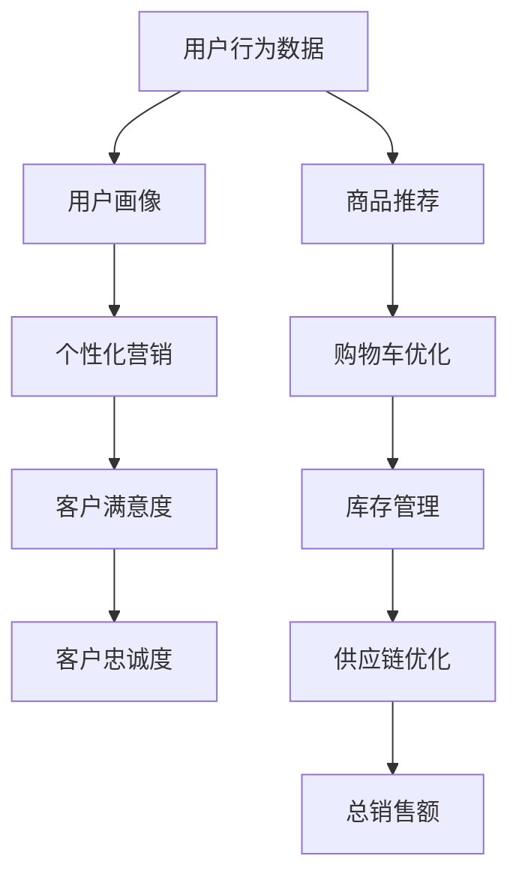

                 

## 1. 背景介绍

随着电商市场的不断成熟，各大电商平台之间的竞争日益激烈。如何通过技术手段提升电商平台的销售额，成为了行业内关注的热点问题。人工智能（AI）技术的快速发展，为电商行业带来了新的机遇。AI技术不仅能够优化用户体验，还能通过精准营销、智能推荐、库存管理等手段，全面提升电商平台的运营效率和盈利能力。本文将探讨AI在电商销售额提升中的作用，并从多个角度分析其实现机制和应用效果。

## 2. 核心概念与联系

### 2.1 核心概念概述

在本节中，我们将介绍一些与AI在电商销售额提升中作用相关的核心概念，包括但不限于：

- **机器学习（Machine Learning, ML）**：通过数据驱动的方法，训练模型进行预测或决策的算法。
- **深度学习（Deep Learning, DL）**：基于神经网络的机器学习技术，能够处理复杂的数据结构和模式。
- **自然语言处理（Natural Language Processing, NLP）**：使计算机能够理解和生成人类语言的技术。
- **推荐系统（Recommendation Systems）**：根据用户的历史行为和偏好，推荐相关产品或内容的技术。
- **供应链管理（Supply Chain Management, SCM）**：通过优化物流、库存等环节，提高供应链效率和响应速度的技术。
- **智能客服（Chatbots, Virtual Assistants）**：使用AI技术提供24/7的客户服务，提升用户体验和满意度。

### 2.2 核心概念原理和架构的 Mermaid 流程图



此图展示了AI在电商销售额提升中的作用机制：通过用户行为数据的分析和利用，AI技术能够生成用户画像，并进行个性化推荐、营销、购物车优化、库存管理和供应链优化，最终提升总销售额。

## 3. 核心算法原理 & 具体操作步骤

### 3.1 算法原理概述

AI在电商销售额提升中的核心算法原理主要基于以下几个方面：

- **用户行为分析**：通过收集和分析用户的浏览、点击、购买等行为数据，了解用户偏好和行为模式。
- **个性化推荐**：根据用户画像，使用协同过滤、基于内容的推荐、深度学习等技术，推荐用户可能感兴趣的商品或内容。
- **自然语言处理**：通过NLP技术，处理用户评论、反馈、客服对话等文本数据，提取有用信息，提升客户体验。
- **预测分析**：使用机器学习模型，预测用户行为和市场趋势，优化库存管理和商品定价策略。

### 3.2 算法步骤详解

以下是AI在电商销售额提升中的具体算法步骤：

1. **数据收集与预处理**：
   - 收集用户行为数据，包括浏览记录、购买记录、评分反馈等。
   - 对数据进行清洗、归一化、特征提取等预处理操作，提高数据质量。

2. **用户画像构建**：
   - 使用机器学习算法，如K-Means、LDA等，从行为数据中提取用户特征。
   - 根据用户特征，生成用户画像，描述用户的基本属性、兴趣偏好等。

3. **推荐系统设计**：
   - 设计推荐模型，如基于矩阵分解的协同过滤、基于深度学习的CTR（Click-Through Rate）模型等。
   - 训练推荐模型，优化推荐效果，并上线运行。

4. **个性化营销**：
   - 根据用户画像，设计个性化广告和优惠券等营销策略。
   - 使用AI技术，如自然语言生成（NLG）、情感分析等，优化营销文案。

5. **购物车优化**：
   - 分析购物车数据，识别用户放弃购物车的原因。
   - 设计优化策略，如购物车提醒、折扣促销等，提高转化率。

6. **库存管理与供应链优化**：
   - 使用预测模型，预测产品需求和库存水平。
   - 优化库存和物流策略，提高供应链效率和响应速度。

7. **客户满意度提升**：
   - 分析用户反馈和客服对话数据，提取常见问题和改进点。
   - 使用NLP技术，如实体识别、意图识别等，提升客服系统效率和效果。

### 3.3 算法优缺点

AI在电商销售额提升中的算法具有以下优点：

- **精准度**：通过分析用户数据和行为，能够提供精准的个性化推荐和营销策略。
- **效率**：使用自动化技术，提高运营效率和决策速度。
- **可扩展性**：AI模型可以轻松部署在云端或边缘计算环境中，支持大规模数据处理。

同时，也存在一些缺点：

- **数据隐私**：收集和处理用户数据时，需注意数据隐私和安全问题。
- **模型复杂度**：构建和维护AI模型需要大量计算资源和时间。
- **技术门槛**：AI技术的开发和应用需要具备一定的技术背景和经验。

### 3.4 算法应用领域

AI在电商销售额提升中的应用领域非常广泛，包括但不限于以下几个方面：

- **推荐系统**：通过个性化推荐，提升用户购买转化率和平均订单价值（Average Order Value, AOV）。
- **智能客服**：使用聊天机器人提高客户服务效率，提升客户满意度。
- **库存管理**：优化库存水平，减少库存成本，提高库存周转率。
- **物流管理**：通过预测和优化，提高物流效率和客户满意度。
- **市场分析**：利用数据挖掘和机器学习，分析市场趋势和用户需求，优化产品线和营销策略。

## 4. 数学模型和公式 & 详细讲解 & 举例说明

### 4.1 数学模型构建

在AI在电商销售额提升中的应用中，常用的数学模型包括：

- **协同过滤（Collaborative Filtering）**：
  - 模型公式：
    $$
    \hat{r}_{ui} = \sum_{j=1}^{n} a_{uj} \cdot r_{ij}
    $$
    其中 $r_{ij}$ 为用户的评分，$a_{uj}$ 为用户和商品的相似度。
  - 解释：通过计算用户和商品之间的相似度，预测用户对商品的评分。

- **深度神经网络（DNN）**：
  - 模型公式：
    $$
    \mathcal{L} = -\frac{1}{N} \sum_{i=1}^N \sum_{j=1}^M \log (1 + \exp(-y_{ij} \cdot \hat{y}_{ij}))
    $$
    其中 $y_{ij}$ 为实际评分，$\hat{y}_{ij}$ 为预测评分。
  - 解释：使用深度神经网络，通过多层非线性变换，提高预测精度。

### 4.2 公式推导过程

以协同过滤为例，推导其预测公式。

1. 设 $U$ 为用户集合，$I$ 为商品集合，$R$ 为评分矩阵。
2. 设 $a_{uj}$ 为第 $u$ 个用户和第 $j$ 个商品的相似度，$\hat{r}_{ui}$ 为预测的评分。
3. 根据用户和商品的评分，通过加权求和计算预测评分。

### 4.3 案例分析与讲解

假设某电商平台收集到以下数据：

| 用户ID | 商品ID | 评分 |
| ------ | ------ | ---- |
| 1      | 1      | 4    |
| 2      | 2      | 3    |
| 2      | 3      | 5    |

使用协同过滤算法，设用户1和商品1的相似度为 $a_{11} = 0.8$，用户2和商品2的相似度为 $a_{22} = 0.9$，用户2和商品3的相似度为 $a_{23} = 0.5$。

- 预测用户1对商品2的评分：
  $$
  \hat{r}_{12} = a_{11} \cdot r_{12} + a_{21} \cdot r_{21} = 0.8 \cdot 0 + 0.9 \cdot 3 = 2.7
  $$

## 5. 项目实践：代码实例和详细解释说明

### 5.1 开发环境搭建

以下是在Python环境下搭建AI电商应用开发环境的步骤：

1. **安装Python**：
   - 从官网下载并安装最新版本的Python，建议选择3.x版本。
   - 在Linux环境下，使用以下命令安装：
     ```bash
     sudo apt-get install python3 python3-pip
     ```
   - 在Windows环境下，使用Anaconda安装Python和相关依赖。

2. **安装相关库**：
   - 使用pip安装必要的库，如TensorFlow、Keras、Pandas、Scikit-learn等。
   - 以下命令安装TensorFlow和Keras：
     ```bash
     pip install tensorflow==2.0.0
     pip install keras
     ```

### 5.2 源代码详细实现

以下是使用TensorFlow和Keras实现推荐系统的代码示例：

```python
import tensorflow as tf
from tensorflow.keras.models import Sequential
from tensorflow.keras.layers import Embedding, Dense, Input, Flatten
from tensorflow.keras.preprocessing import sequence

# 准备数据
users, items = load_data()
ratings = load_ratings()

# 构建模型
model = Sequential([
    Input(shape=(1,)),
    Embedding(10, 64, input_length=1),
    Flatten(),
    Dense(64, activation='relu'),
    Dense(1, activation='sigmoid')
])

# 编译模型
model.compile(optimizer='adam', loss='binary_crossentropy', metrics=['accuracy'])

# 训练模型
model.fit(ratings, epochs=10, batch_size=32)
```

### 5.3 代码解读与分析

以上代码展示了使用TensorFlow和Keras实现协同过滤推荐系统的过程。关键步骤如下：

1. **数据准备**：
   - `load_data()` 函数用于加载用户和商品数据。
   - `load_ratings()` 函数用于加载评分数据。

2. **模型构建**：
   - 使用 `Sequential` 模型，定义神经网络结构。
   - 使用 `Embedding` 层，将用户ID和商品ID转换为向量表示。
   - 使用 `Flatten` 层，将向量展平。
   - 使用 `Dense` 层，进行非线性变换。
   - 使用 `Dense` 层，输出预测评分。

3. **模型编译**：
   - 使用 `compile()` 方法，定义优化器、损失函数和评估指标。

4. **模型训练**：
   - 使用 `fit()` 方法，训练模型并输出训练结果。

### 5.4 运行结果展示

训练完成后，可以使用以下代码进行预测：

```python
import numpy as np

# 预测新用户对新商品的评分
user_id = 100
item_id = 500
new_user = np.zeros((1, 1))
new_item = np.zeros((1, 1))
new_user[0, 0] = user_id
new_item[0, 0] = item_id

# 预测评分
prediction = model.predict([new_user, new_item])[0][0]
print(f"预测评分：{prediction}")
```

以上代码展示了如何预测新用户对新商品的评分。

## 6. 实际应用场景

### 6.1 智能客服

智能客服是AI在电商销售额提升中的重要应用之一。通过聊天机器人，电商企业可以提供24/7的客户服务，提升用户满意度和购买转化率。

1. **用户咨询处理**：
   - 收集用户与客服的对话数据，使用NLP技术提取常见问题和解决方案。
   - 使用预训练的NLP模型，如BERT、GPT-3等，生成自动回复。

2. **情感分析**：
   - 分析用户对话中的情感倾向，识别负面情绪和问题。
   - 及时介入人工客服，解决问题并提供个性化推荐。

### 6.2 个性化推荐

个性化推荐系统是提升电商销售额的重要手段。通过推荐相关商品，提高用户购买转化率和平均订单价值。

1. **协同过滤推荐**：
   - 收集用户浏览和购买数据，构建评分矩阵。
   - 使用协同过滤算法，推荐用户可能感兴趣的商品。

2. **基于内容的推荐**：
   - 分析商品描述、图片、标签等信息，提取特征。
   - 使用机器学习模型，如决策树、随机森林等，推荐相关商品。

### 6.3 智能定价

智能定价系统通过预测用户对商品的支付意愿，优化商品定价策略，提高销售额和利润。

1. **价格预测**：
   - 收集用户历史购买数据和市场价格信息。
   - 使用机器学习模型，如线性回归、支持向量机等，预测用户对商品的价格敏感度。

2. **动态定价**：
   - 根据预测结果，动态调整商品价格。
   - 实时监测价格变化和用户反应，优化价格策略。

### 6.4 库存管理

库存管理是电商运营的重要环节，通过优化库存水平，提高运营效率和响应速度。

1. **库存预测**：
   - 收集历史销售数据和市场趋势数据。
   - 使用机器学习模型，如时间序列分析、ARIMA等，预测商品需求。

2. **智能补货**：
   - 根据预测结果，自动生成补货计划。
   - 实时监测库存水平和销售情况，动态调整补货策略。

## 7. 工具和资源推荐

### 7.1 学习资源推荐

以下资源可以帮助开发者掌握AI在电商销售额提升中的应用：

1. **《深度学习入门》**：李沐著，详细介绍了深度学习基础和常用算法。
2. **Coursera上的《机器学习》课程**：由斯坦福大学教授Andrew Ng主讲，涵盖了机器学习基础和应用。
3. **Kaggle竞赛**：通过参加电商相关的数据竞赛，实战练习AI技能。
4. **TensorFlow官方文档**：提供详细的API文档和示例代码，帮助开发者掌握TensorFlow的使用。

### 7.2 开发工具推荐

以下是一些常用的开发工具，可以用于AI在电商销售额提升中的应用：

1. **Jupyter Notebook**：轻量级的交互式编程环境，支持代码调试和结果展示。
2. **TensorFlow和Keras**：用于构建和训练深度学习模型。
3. **PyTorch**：另一个常用的深度学习框架，支持动态计算图。
4. **Pandas和NumPy**：用于数据处理和分析。
5. **Scikit-learn**：用于机器学习算法的实现和优化。

### 7.3 相关论文推荐

以下是一些相关领域的经典论文，值得一读：

1. **"Collaborative Filtering for Implicit Feedback Datasets"**：Wang等人，介绍了协同过滤算法的理论基础和实现方法。
2. **"Deep Learning with Python"**：Francois Chollet著，详细介绍了深度学习模型和框架。
3. **"Customer Reviews and Sentiment Analysis for Digital Marketing"**：McClure等人，探讨了情感分析在电商营销中的应用。
4. **"Supply Chain Management"**：M Article, 提供供应链管理的理论基础和实践方法。

## 8. 总结：未来发展趋势与挑战

### 8.1 研究成果总结

AI在电商销售额提升中的应用，已经在多个方面取得了显著效果。通过用户行为分析、个性化推荐、智能客服等手段，电商平台的运营效率和用户满意度得到了显著提升。然而，AI技术的应用也面临数据隐私、模型复杂度和技术门槛等挑战。

### 8.2 未来发展趋势

未来，AI在电商销售额提升中的应用将呈现以下几个发展趋势：

1. **模型集成**：通过多种算法的组合，提高推荐系统的精准度和效率。
2. **实时化**：通过流式计算和边缘计算，实现实时推荐和决策。
3. **跨领域融合**：将AI技术与其他技术（如物联网、区块链等）融合，提升整体运营效率。
4. **个性化增强**：通过多模态数据（如视频、语音等）的融合，提供更全面的个性化服务。
5. **智能定价**：结合市场动态和用户行为，实现动态定价策略。

### 8.3 面临的挑战

尽管AI在电商销售额提升中的应用前景广阔，但仍需克服以下挑战：

1. **数据隐私**：保护用户隐私和数据安全，避免数据泄露和滥用。
2. **模型复杂度**：构建和维护复杂模型需要高昂的计算资源和时间成本。
3. **技术门槛**：AI技术的开发和应用需要具备较高的技术背景和经验。
4. **用户信任**：提升用户对AI技术的信任度，避免对AI系统的误解和抵触。

### 8.4 研究展望

未来的研究需要在以下几个方面进行深入探索：

1. **自动化数据处理**：通过自动化数据清洗和预处理，提高数据质量。
2. **跨领域知识融合**：将多领域知识与AI技术结合，提升系统的综合能力。
3. **可解释性和透明性**：提升AI系统的可解释性和透明性，提高用户信任度。
4. **多模态数据融合**：将视觉、语音等数据与文本数据结合，提供更全面的个性化服务。
5. **公平性和伦理**：确保AI系统公平、公正，避免歧视和偏见。

## 9. 附录：常见问题与解答

**Q1: 什么是协同过滤推荐算法？**

A: 协同过滤算法是一种基于用户行为数据的推荐算法，通过计算用户和商品之间的相似度，预测用户对商品的评分，从而推荐相关商品。

**Q2: 如何保护用户隐私？**

A: 在数据收集和处理过程中，需要遵循GDPR等法律法规，保护用户隐私。可以采用匿名化处理、差分隐私等技术，避免数据泄露和滥用。

**Q3: 什么是多模态数据融合？**

A: 多模态数据融合是指将多种数据形式（如文本、图像、语音等）结合，提供更全面的个性化服务。通过多模态数据的融合，可以更全面地理解用户需求，提供更精准的推荐和营销策略。

**Q4: 什么是自动化数据处理？**

A: 自动化数据处理是指通过脚本和工具，自动完成数据清洗、特征提取、数据转换等任务，提高数据处理效率和准确性。

**Q5: 什么是可解释性和透明性？**

A: 可解释性和透明性是指AI系统的决策过程可以被清晰地理解和解释，避免“黑盒”问题。通过可解释性和透明性，可以提升用户对AI系统的信任度，避免误解和抵触。

---

作者：禅与计算机程序设计艺术 / Zen and the Art of Computer Programming

