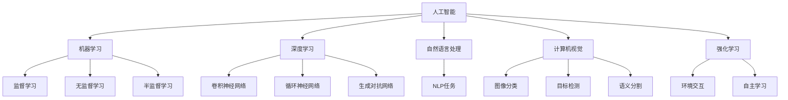

                 

# AI在社会中的作用与应用

> 关键词：人工智能, 社会影响, 自动化, 机器学习, 深度学习, 人工智能伦理, 智能决策

## 1. 背景介绍

### 1.1 问题由来
随着人工智能（AI）技术的飞速发展，AI在各个领域的渗透与应用变得日益广泛和深入。人工智能在提升效率、改善质量、创造价值方面展现了巨大的潜力。然而，AI的发展也带来了新的挑战和问题，如就业变迁、隐私安全、伦理道德等。本文旨在全面探讨AI在社会中的作用与应用，为更好地理解和应对这些挑战提供思路与建议。

### 1.2 问题核心关键点
AI对社会的作用与应用主要集中在以下几个方面：
- 自动化与效率提升：通过算法优化和智能设备的应用，AI可以大幅提升生产力和效率。
- 大数据与智能决策：AI在处理海量数据和进行复杂决策方面具有独特优势，可以应用于金融、医疗、交通等诸多领域。
- 人机交互与智能体验：AI在自然语言处理、计算机视觉、语音识别等技术上的突破，显著提升了人机交互的智能体验。
- 伦理道德与社会责任：AI应用过程中涉及的隐私、安全、公平等伦理问题，需要引起高度关注。

## 2. 核心概念与联系

### 2.1 核心概念概述

为更好地理解AI在社会中的作用与应用，本节将介绍几个密切相关的核心概念：

- 人工智能（Artificial Intelligence, AI）：指由计算机模拟人类智能行为的技术，包括感知、学习、推理、决策等方面。

- 机器学习（Machine Learning, ML）：是AI的一个分支，通过数据驱动的方法，使机器能够从经验中学习规律，并应用到实际问题中。

- 深度学习（Deep Learning, DL）：是机器学习的一个子领域，通过多层次神经网络模型，可以处理复杂的非线性关系和特征表示，广泛应用于图像、语音、文本等领域的任务。

- 自然语言处理（Natural Language Processing, NLP）：是AI的一个重要分支，专注于使计算机能够理解、生成和处理人类语言。

- 计算机视觉（Computer Vision, CV）：是AI的另一个重要分支，致力于让计算机能够“看”懂图像和视频。

- 强化学习（Reinforcement Learning, RL）：通过试错和奖励机制，使机器能够自主学习最优策略。

- 人工智能伦理（Artificial Intelligence Ethics）：研究AI在社会、经济、法律、伦理等方面的应用和影响，确保AI技术的健康发展。

这些核心概念之间的逻辑关系可以通过以下Mermaid流程图来展示：



这个流程图展示了一个简单的AI知识框架，强调了AI的不同分支及其关联性。

## 3. 核心算法原理 & 具体操作步骤

### 3.1 算法原理概述

AI在社会中的应用主要依赖于机器学习和深度学习算法。以监督学习为例，其核心思想是通过标记数据集训练模型，使得模型能够在无标记数据上进行预测和决策。算法流程大致如下：

1. 数据预处理：对原始数据进行清洗、归一化、特征提取等预处理操作。
2. 模型训练：使用标记数据集训练模型，不断调整模型参数以最小化预测误差。
3. 模型评估：使用独立测试集评估模型性能，确保模型泛化能力。
4. 模型部署：将训练好的模型应用于实际问题，进行预测、分类、决策等任务。

### 3.2 算法步骤详解

**Step 1: 数据预处理**
- 数据清洗：去除噪声、缺失值、异常值等。
- 数据归一化：将数据缩放到统一的范围，如[0,1]或[-1,1]。
- 特征提取：将原始数据转化为可供模型处理的特征向量。

**Step 2: 模型训练**
- 选择合适的算法模型，如线性回归、决策树、神经网络等。
- 划分训练集和测试集，确保模型泛化能力。
- 设置超参数，如学习率、正则化系数、迭代次数等。
- 使用随机梯度下降等优化算法进行模型训练，更新参数。

**Step 3: 模型评估**
- 在测试集上评估模型性能，如准确率、精确率、召回率等指标。
- 绘制ROC曲线、混淆矩阵等可视化图表，帮助理解模型表现。

**Step 4: 模型部署**
- 将训练好的模型集成到实际应用系统中，进行预测、分类、决策等任务。
- 实时监测模型性能，根据反馈进行调优。

### 3.3 算法优缺点

AI在社会中的应用具有以下优点：
1. 提高效率：自动化处理大量重复性任务，节省时间和人力成本。
2. 提升决策质量：利用大数据和算法优化，提高决策的科学性和准确性。
3. 创造新价值：通过智能产品和服务的创新，创造新的经济增长点。
4. 改善用户体验：提供个性化、智能化的交互体验，提升用户满意度。

同时，AI的应用也存在一些缺点：
1. 就业变迁：自动化可能替代部分传统岗位，带来就业结构变化。
2. 数据隐私：大规模数据收集和分析可能涉及隐私泄露问题。
3. 伦理道德：AI在决策过程中可能存在偏见和不公平现象。
4. 技术复杂性：AI系统的构建和维护需要高水平技术，可能面临人才短缺问题。
5. 依赖性：过度依赖AI可能导致对技术的依赖性和决策失控。

### 3.4 算法应用领域

AI在社会中的应用非常广泛，涵盖各个领域，例如：

- 医疗健康：AI在疾病诊断、药物研发、健康管理等方面展现出巨大潜力，如AlphaFold在蛋白质结构预测中的突破。
- 金融服务：AI在信用评分、风险评估、智能投顾等方面具有独特优势，如量化交易、信用评级等。
- 智能制造：AI通过优化生产流程、预测设备故障、智能调度等，提升制造业的效率和质量。
- 零售电商：AI在推荐系统、库存管理、客户服务等方面改善用户体验，提升电商运营效率。
- 交通出行：AI在自动驾驶、智能调度、流量预测等方面提升交通系统的安全性、效率和舒适性。
- 教育培训：AI在个性化学习、智能评估、自动化阅卷等方面助力教育公平和质量提升。
- 娱乐媒体：AI在内容推荐、图像识别、语音识别等方面提升用户体验，创造新的娱乐体验。

## 4. 数学模型和公式 & 详细讲解 & 举例说明

### 4.1 数学模型构建

以监督学习为例，假设训练集为 $D=\{(x_i,y_i)\}_{i=1}^N$，其中 $x_i \in \mathbb{R}^d$ 为输入特征向量，$y_i \in \{0,1\}$ 为标签。目标是通过训练一个线性分类器 $f(x)=\theta^Tx+b$ 来最小化预测误差，其中 $\theta$ 为模型参数，$b$ 为偏置项。

最小化均方误差（Mean Squared Error, MSE）的目标函数为：

$$
\min_{\theta} \frac{1}{N} \sum_{i=1}^N (y_i - f(x_i))^2
$$

对应的梯度下降优化公式为：

$$
\theta \leftarrow \theta - \eta \nabla_{\theta} \mathcal{L}(\theta)
$$

其中 $\eta$ 为学习率，$\nabla_{\theta} \mathcal{L}(\theta)$ 为损失函数对参数 $\theta$ 的梯度。

### 4.2 公式推导过程

以线性回归为例，推导目标函数和梯度公式：

假设目标函数为均方误差（MSE），其梯度公式为：

$$
\nabla_{\theta} \mathcal{L}(\theta) = -\frac{2}{N} \sum_{i=1}^N (y_i - f(x_i)) \cdot x_i
$$

通过链式法则，得到梯度下降的更新公式为：

$$
\theta \leftarrow \theta - \eta \cdot \frac{2}{N} \sum_{i=1}^N (y_i - f(x_i)) \cdot x_i
$$

通过上述公式，我们可以对任意的监督学习问题进行求解，确保模型预测的准确性。

### 4.3 案例分析与讲解

以信用评分模型为例，展示机器学习在金融服务中的应用：

**数据预处理**
- 收集历史贷款数据，进行数据清洗和归一化处理。
- 提取特征向量，如借款金额、利率、还款记录等。

**模型训练**
- 使用随机梯度下降（SGD）算法，选择逻辑回归模型。
- 划分训练集和测试集，设置学习率为0.01，迭代次数为1000。
- 训练模型，记录每轮损失函数和准确率的变化。

**模型评估**
- 在测试集上评估模型性能，绘制ROC曲线和混淆矩阵。
- 输出模型预测结果，验证模型的泛化能力。

## 5. 项目实践：代码实例和详细解释说明

### 5.1 开发环境搭建

在进行AI项目实践前，我们需要准备好开发环境。以下是使用Python进行Scikit-learn开发的环境配置流程：

1. 安装Anaconda：从官网下载并安装Anaconda，用于创建独立的Python环境。

2. 创建并激活虚拟环境：
```bash
conda create -n sklearn-env python=3.8 
conda activate sklearn-env
```

3. 安装Scikit-learn：
```bash
pip install scikit-learn
```

4. 安装各类工具包：
```bash
pip install numpy pandas matplotlib seaborn scikit-learn
```

完成上述步骤后，即可在`sklearn-env`环境中开始AI项目的开发。

### 5.2 源代码详细实现

这里我们以信用评分模型为例，给出使用Scikit-learn进行机器学习的PyTorch代码实现。

```python
import pandas as pd
import numpy as np
from sklearn.model_selection import train_test_split
from sklearn.linear_model import LogisticRegression
from sklearn.metrics import roc_curve, auc
from sklearn.preprocessing import StandardScaler
from sklearn.linear_model import LogisticRegression
from sklearn.pipeline import Pipeline

# 加载数据
data = pd.read_csv('credit_data.csv')

# 数据预处理
X = data.drop('default', axis=1)
y = data['default']

# 特征缩放
scaler = StandardScaler()
X = scaler.fit_transform(X)

# 划分训练集和测试集
X_train, X_test, y_train, y_test = train_test_split(X, y, test_size=0.2, random_state=42)

# 定义模型和优化器
model = LogisticRegression(solver='liblinear', C=1.0)
optimizer = SGD(model.parameters(), lr=0.01, momentum=0.9)

# 训练模型
for epoch in range(1000):
    optimizer.zero_grad()
    y_pred = model(X_train)
    loss = F.binary_cross_entropy(y_pred, y_train)
    loss.backward()
    optimizer.step()

# 评估模型
y_pred = model(X_test)
fpr, tpr, thresholds = roc_curve(y_test, y_pred)
roc_auc = auc(fpr, tpr)

# 绘制ROC曲线
plt.plot(fpr, tpr, 'b', label='AUC = %0.2f' % roc_auc)
plt.legend(loc='lower right')
plt.plot([0, 1], [0, 1], 'r--')
plt.xlim([0, 1])
plt.ylim([0, 1])
plt.ylabel('True Positive Rate')
plt.xlabel('False Positive Rate')
plt.show()
```

以上就是使用Scikit-learn对信用评分模型进行机器学习的完整代码实现。可以看到，Scikit-learn的API设计非常简洁高效，可以显著提升模型开发效率。

### 5.3 代码解读与分析

让我们再详细解读一下关键代码的实现细节：

**数据加载与预处理**
- 使用Pandas库加载CSV格式的数据集，并进行基本的清洗和处理。
- 使用Scikit-learn的StandardScaler对特征进行归一化处理。

**模型训练与评估**
- 使用Scikit-learn的LogisticRegression模型进行二分类任务训练。
- 使用Scikit-learn的SGD优化器，设置学习率为0.01，动量为0.9。
- 在训练集上迭代训练1000轮，计算每轮的损失函数。
- 使用Scikit-learn的roc_curve和auc函数评估模型性能，并绘制ROC曲线。

**可视化**
- 使用Matplotlib库绘制ROC曲线，展示模型的分类性能。

可以看出，Scikit-learn提供了一套非常完整的机器学习工具库，可以覆盖从数据预处理到模型评估的各个环节，极大地简化了模型开发流程。

## 6. 实际应用场景

### 6.1 智能医疗
AI在医疗领域的应用前景广阔，可以辅助医生进行疾病诊断、治疗方案推荐、药物研发等工作。例如，IBM的Watson系统可以通过分析医疗数据，提供个性化的治疗方案和疾病预测。

**案例分析**
- 某医院使用AI系统对大量患者数据进行分析，识别出高风险患者，提前进行干预，显著降低了疾病的发病率和死亡率。
- 某制药公司使用AI系统对化合物库进行筛选，加速了新药的研发进程，缩短了研发周期，降低了研发成本。

### 6.2 智慧城市
AI在智慧城市中的应用包括智能交通、智慧安防、智能电网等。例如，智能交通系统可以通过实时数据分析，优化交通流量，减少拥堵，提升出行效率。

**案例分析**
- 某城市采用AI系统进行交通流量预测和信号灯控制，减少了车辆等待时间，提高了道路通行效率。
- 某城市利用AI系统进行城市安防监控，提高了公共安全事件的处理速度和准确性。

### 6.3 金融风控
AI在金融领域的应用主要集中在信用评分、风险评估、欺诈检测等方面。例如，AI系统可以分析客户的交易数据，预测其还款能力和风险水平。

**案例分析**
- 某银行使用AI系统进行信用评分，提高了贷款审批的效率和准确性，降低了坏账率。
- 某保险公司使用AI系统进行欺诈检测，减少了欺诈行为的发生，保护了客户的财产安全。

### 6.4 未来应用展望

随着AI技术的不断进步，AI在社会中的应用前景更加广阔。未来，AI将深入到更多领域，带来更加深刻的变革：

1. **智能制造**：AI在智能制造中的应用包括预测性维护、智能调度、质量控制等，将大大提升制造业的自动化水平和效率。
2. **教育培训**：AI在个性化学习、智能评估、自动化阅卷等方面的应用，将极大地提升教育公平和质量。
3. **娱乐媒体**：AI在内容推荐、图像识别、语音识别等方面的应用，将带来全新的娱乐体验。
4. **智能农业**：AI在农作物监测、智能灌溉、精准施肥等方面的应用，将提升农业生产效率和产品质量。
5. **智能物流**：AI在路线规划、货物跟踪、仓储管理等方面的应用，将提升物流系统的效率和可靠性。

## 7. 工具和资源推荐

### 7.1 学习资源推荐

为了帮助开发者系统掌握AI技术的基本原理和应用方法，这里推荐一些优质的学习资源：

1. **《深度学习》课程（Coursera）**：由斯坦福大学Andrew Ng教授主讲，系统介绍了深度学习的基本概念和算法。
2. **《Python机器学习》书籍（O'Reilly）**：由Peter Harrington撰写，详细讲解了使用Python进行机器学习的实践技巧。
3. **《TensorFlow实战》书籍（人民邮电出版社）**：由王晋东撰写，介绍了TensorFlow的基本使用和实践案例。
4. **Kaggle竞赛平台**：提供了大量的数据集和竞赛任务，适合实战练习和经验积累。
5. **GitHub开源项目**：GitHub上有大量的AI项目和代码示例，可以从中学习和借鉴。

通过这些资源的学习和实践，相信你一定能够快速掌握AI技术的基本原理和应用方法。

### 7.2 开发工具推荐

高效的开发离不开优秀的工具支持。以下是几款用于AI开发常用的工具：

1. **Python**：Python语言简洁高效，是AI开发的主流语言之一。
2. **Scikit-learn**：提供了丰富的机器学习算法和工具，适合快速原型设计和实验验证。
3. **TensorFlow**：由Google主导的深度学习框架，支持大规模分布式计算，适合生产环境部署。
4. **PyTorch**：由Facebook开发，提供了灵活的动态计算图，适合科研和实验。
5. **Jupyter Notebook**：提供了交互式编程环境，适合数据探索和模型调试。
6. **Keras**：提供了高级API，适合快速搭建和调试深度学习模型。

合理利用这些工具，可以显著提升AI开发效率，加速创新迭代的步伐。

### 7.3 相关论文推荐

AI领域的研究非常活跃，以下是几篇奠基性的相关论文，推荐阅读：

1. **《ImageNet Classification with Deep Convolutional Neural Networks》**：提出AlexNet模型，开启了深度学习在计算机视觉领域的革命。
2. **《Deep Neural Networks for Acoustic Modeling in Speech Recognition》**：提出RNN和LSTM模型，提高了语音识别的准确率。
3. **《Attention is All You Need》**：提出Transformer模型，奠定了现代深度学习的基础。
4. **《Natural Language Processing (almost) from Scratch》**：介绍了从零开始构建自然语言处理模型的基本思路和方法。
5. **《AlphaGo Zero》**：提出自我博弈训练方法，解决了AlphaGo在对抗游戏中的自我对弈问题，取得了突破性的胜利。

这些论文代表了大规模AI研究的发展脉络。通过学习这些前沿成果，可以帮助研究者把握学科前进方向，激发更多的创新灵感。

## 8. 总结：未来发展趋势与挑战

### 8.1 研究成果总结

AI技术在各个领域的应用已经取得了显著成效，推动了社会的进步和发展。未来，AI将在更广泛的领域发挥更大的作用，带来更多新的机遇和挑战。

### 8.2 未来发展趋势

1. **自动化与智能化**：AI将进一步提升自动化水平，涵盖更多领域和任务。
2. **大数据与智能决策**：AI将更好地利用大数据和复杂算法，提供更智能的决策支持。
3. **人机交互与智能体验**：AI将带来更加个性化和智能的人机交互体验。
4. **伦理道德与社会责任**：AI伦理和道德问题将受到更多关注，需要建立更完善的法律法规和伦理框架。
5. **跨领域融合**：AI与其他技术的融合将带来更多的创新突破，如AI+物联网、AI+区块链等。

### 8.3 面临的挑战

AI在社会中的应用也面临诸多挑战：

1. **就业变迁**：AI自动化可能导致部分职业消失，引发就业结构变化。
2. **数据隐私**：大规模数据收集和分析可能涉及隐私泄露问题。
3. **伦理道德**：AI在决策过程中可能存在偏见和不公平现象。
4. **技术复杂性**：AI系统的构建和维护需要高水平技术，可能面临人才短缺问题。
5. **依赖性**：过度依赖AI可能导致对技术的依赖性和决策失控。

### 8.4 研究展望

为了应对这些挑战，未来的AI研究需要在以下几个方面寻求新的突破：

1. **伦理与道德**：建立更完善的AI伦理和道德框架，确保AI系统的公平和透明。
2. **隐私保护**：研究数据隐私保护技术，确保用户数据的安全性和匿名性。
3. **可解释性**：开发可解释的AI模型，提高模型的透明性和可解释性。
4. **跨领域应用**：推动AI与其他技术的融合，拓展AI应用的范围和深度。
5. **安全性**：研究AI系统的安全性和鲁棒性，确保系统的稳定性和可靠性。

## 9. 附录：常见问题与解答

**Q1: 什么是人工智能（AI）？**

A: 人工智能（AI）是模拟人类智能行为的技术，包括感知、学习、推理、决策等方面。其目标是让机器能够像人一样理解、生成和处理信息。

**Q2: 机器学习和深度学习有什么区别？**

A: 机器学习（ML）和深度学习（DL）都是AI的分支，区别在于DL使用多层次神经网络模型处理复杂的数据结构和关系，而ML通常使用传统机器学习算法处理线性数据。

**Q3: 如何选择合适的机器学习算法？**

A: 选择机器学习算法需要考虑数据类型、任务类型、数据规模等因素。例如，线性回归适用于处理线性数据，决策树适用于分类任务，神经网络适用于处理非线性数据。

**Q4: 数据预处理有哪些步骤？**

A: 数据预处理包括数据清洗、归一化、特征提取等步骤。数据清洗可以去除噪声、缺失值等；数据归一化可以将数据缩放到统一的范围；特征提取可以将原始数据转化为可供模型处理的特征向量。

**Q5: 机器学习模型的评估指标有哪些？**

A: 机器学习模型的评估指标包括准确率、精确率、召回率、F1分数等。这些指标可以帮助评估模型的预测性能和泛化能力。

---

作者：禅与计算机程序设计艺术 / Zen and the Art of Computer Programming

