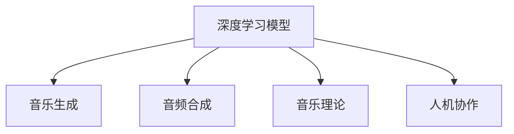

                 

# AI在音乐创作中的应用:人机协作的新模式

> 关键词：音乐创作,人工智能,人机协作,音乐生成,音频合成,深度学习,神经网络

## 1. 背景介绍

### 1.1 问题由来
随着人工智能(AI)技术的快速发展，音乐创作领域也开始引入智能算法，利用AI进行创作和生成音乐。这一创新不仅拓宽了音乐创作的方式，也引发了对于艺术与技术结合的新思考。AI在音乐创作中的应用主要包括以下几个方面：

1. **音乐生成**：利用深度学习模型生成新的音乐旋律、和弦、节奏等元素。
2. **编曲和编配**：基于音乐作品分析出和声、节奏、配器等信息，辅助人类创作。
3. **自动演奏**：通过智能控制乐器或软件合成器，实现音乐的自动化演奏。
4. **风格转换**：将一首音乐的风格转换成另一种风格，例如将流行音乐转换成古典风格。
5. **歌词创作**：根据旋律或风格生成适合的歌词。

AI在音乐创作中的应用展示了技术与艺术结合的巨大潜力，也为音乐创作带来新的可能性。

### 1.2 问题核心关键点
AI在音乐创作中的关键技术包括：

1. **深度学习模型**：如循环神经网络(RNN)、卷积神经网络(CNN)、变分自编码器(VAE)等，用于生成、分析和转换音乐。
2. **音频处理技术**：如频谱分析、时频转换、音频合成等，用于处理和合成音乐。
3. **音乐理论知识**：如和声、调式、节奏、乐理等，作为AI创作的基础。
4. **用户交互接口**：如GUI界面、交互式语音指令等，增强AI与用户的互动性。

这些关键技术共同构成了AI在音乐创作中应用的核心框架，使得AI能够高效地生成、分析和转换音乐。

## 2. 核心概念与联系

### 2.1 核心概念概述

为更好地理解AI在音乐创作中的应用，本节将介绍几个密切相关的核心概念：

- **深度学习模型**：指利用多层神经网络结构进行数据学习和特征提取的算法。深度学习在音乐创作中的应用主要体现在旋律生成、和弦预测、风格识别等方面。
- **音频合成**：指将数字信号转换为可听声音的过程，常用于生成音乐和语音。
- **音乐理论**：包括和声学、调性学、节奏学、配器学等，是AI音乐创作的重要依据。
- **人机协作**：指AI与人类共同完成创作任务的模式，利用AI的自动化和智能分析功能，提升创作效率和质量。

这些核心概念之间的逻辑关系可以通过以下Mermaid流程图来展示：



这个流程图展示了大语言模型的核心概念及其之间的关系：

1. 深度学习模型通过学习音乐数据，获得音乐元素（如旋律、和弦、节奏等）的特征表示。
2. 音乐生成技术利用这些特征生成新的音乐作品。
3. 音频合成技术将生成的数字音乐信号转换为可听声音。
4. 人机协作中，AI与人类共同创作，AI提供自动化和智能分析支持。

## 3. 核心算法原理 & 具体操作步骤

### 3.1 算法原理概述

AI在音乐创作中的应用主要是通过深度学习模型进行的。模型的核心思想是将音乐元素表示为向量，通过神经网络对这些向量进行学习和生成。常见的音乐生成模型包括：

1. **音乐生成模型**：如变分自编码器(VAE)、循环神经网络(RNN)、卷积神经网络(CNN)等，用于生成新的音乐旋律、和弦、节奏等。
2. **音乐分析模型**：如Transformer模型，用于分析和理解音乐的特征和结构。
3. **风格转换模型**：如CycleGAN等，用于将一种音乐风格转换成另一种风格。

这些模型通过学习大量音乐数据，获得音乐元素之间的复杂关系和模式，从而实现音乐生成和转换。

### 3.2 算法步骤详解

AI在音乐创作中的应用主要涉及以下几个关键步骤：

**Step 1: 数据准备与预处理**
- 收集音乐数据，包括旋律、和弦、节奏、歌词等。可以使用公开的音乐数据库或音乐制作软件导出数据。
- 对数据进行标准化处理，例如归一化、分帧、频谱分析等。

**Step 2: 模型选择与设计**
- 选择合适的深度学习模型，例如VAE、RNN、CNN等，用于生成、分析和转换音乐。
- 设计模型的结构，包括输入层、隐藏层、输出层等，并确定超参数，如学习率、批大小、迭代轮数等。

**Step 3: 模型训练**
- 使用音乐数据训练模型，通过反向传播算法优化模型参数。
- 采用正则化技术，如L2正则、Dropout等，避免模型过拟合。
- 在训练过程中，周期性评估模型在验证集上的性能，根据性能调整学习率和模型结构。

**Step 4: 音乐生成与合成**
- 使用训练好的模型生成新的音乐，包括旋律、和弦、节奏等。
- 将生成的数字音乐信号进行音频合成，转换为可听的声音。

**Step 5: 反馈与优化**
- 根据生成的音乐作品，获取用户的反馈，如满意度、偏好等。
- 利用反馈信息对模型进行进一步的优化和训练，提高音乐创作的质量。

### 3.3 算法优缺点

AI在音乐创作中的应用具有以下优点：

1. **效率提升**：AI可以快速生成大量的音乐作品，提高创作效率。
2. **多样性**：AI可以生成不同风格和流派的音乐，增加音乐创作的多样性。
3. **个性化**：AI可以根据用户的偏好生成个性化的音乐作品。
4. **自动化**：AI自动化地生成和分析音乐，减少人工干预。

但同时也存在一些缺点：

1. **缺乏情感**：AI生成的音乐可能缺乏人类的情感和深度，难以替代人类创作。
2. **精度有限**：AI在音乐生成和转换中的精度和创造性可能受限于训练数据和算法。
3. **依赖数据**：AI生成的音乐质量很大程度上依赖于训练数据的质量和数量。

### 3.4 算法应用领域

AI在音乐创作中的应用已经涉及多个领域，包括：

1. **影视音乐**：为电影、电视剧等提供配乐和背景音乐。
2. **广告音乐**：为商业广告制作创意音乐。
3. **电子游戏**：为游戏场景和角色提供背景音乐和音效。
4. **音乐教育**：帮助音乐学习者练习和创作音乐。
5. **音乐编辑**：协助音乐制作人和录音师进行音乐制作。

## 4. 数学模型和公式 & 详细讲解 & 举例说明

### 4.1 数学模型构建

AI在音乐创作中主要使用的数学模型包括：

- **循环神经网络(RNN)**：用于处理序列数据，例如旋律和和弦序列。
- **变分自编码器(VAE)**：用于生成新的音乐数据。
- **卷积神经网络(CNN)**：用于处理和分析音乐频谱图。

以VAE为例，其核心思想是通过学习音乐数据的分布，生成新的音乐数据。模型由编码器和解码器两部分组成，其数学模型可以表示为：

$$
\begin{aligned}
\mu_\theta(z) &= \mu(z|x) = \text{fc}(\text{flatten}(A_\theta(x)))\\
\sigma_\theta(z) &= \sigma(z|x) = \text{exp}(\text{fc}(\text{flatten}(B_\theta(x))))\\
p_\theta(x|z) &= \mathcal{N}(A_\theta(x), \text{diag}(\sigma_\theta(z)))\\
p(z) &= \mathcal{N}(0, I)
\end{aligned}
$$

其中：
- $x$ 表示音乐数据。
- $\mu_\theta(z)$ 和 $\sigma_\theta(z)$ 分别为生成器网络的均值和方差。
- $A_\theta$ 和 $B_\theta$ 分别为编码器和解码器。
- $p_\theta(x|z)$ 表示音乐数据在给定潜在变量 $z$ 下的条件概率。
- $p(z)$ 表示潜在变量的先验分布。

### 4.2 公式推导过程

VAE模型的推导过程主要涉及以下几个步骤：

1. **编码器部分**：将音乐数据 $x$ 通过编码器 $A_\theta$ 转化为潜在变量 $z$。
2. **解码器部分**：将潜在变量 $z$ 通过解码器 $B_\theta$ 转化为新的音乐数据 $x'$。
3. **损失函数**：最小化 $x$ 和 $x'$ 之间的KL散度。

具体推导如下：

$$
\begin{aligned}
p(x|z) &= \mathcal{N}(A_\theta(x), \text{diag}(\sigma_\theta(z)))\\
p(z) &= \mathcal{N}(0, I)\\
p(z|x) &= \mathcal{N}(\mu_\theta(z), \sigma_\theta(z))\\
p(x|z) &= \mathcal{N}(A_\theta(x), \text{diag}(\sigma_\theta(z)))
\end{aligned}
$$

则有：

$$
\begin{aligned}
p(x|z) &= \mathcal{N}(A_\theta(x), \text{diag}(\sigma_\theta(z)))\\
p(z) &= \mathcal{N}(0, I)\\
p(z|x) &= \mathcal{N}(\mu_\theta(z), \sigma_\theta(z))\\
p(x|z) &= \mathcal{N}(A_\theta(x), \text{diag}(\sigma_\theta(z)))
\end{aligned}
$$

根据KL散度定义：

$$
\begin{aligned}
D_{KL}(p(x|z) || p_\theta(x|z)) &= \frac{1}{2} \mathbb{E}_z ||z - \mu_\theta(z)||^2 + \frac{1}{2} \mathbb{E}_z \log \frac{\sigma_\theta(z)}{\sigma(z)}\\
&= \frac{1}{2} \mathbb{E}_z ||z - \mu_\theta(z)||^2 + \frac{1}{2} \mathbb{E}_z \log \frac{\sigma_\theta(z)}{\sigma(z)}\\
&= \frac{1}{2} \mathbb{E}_z ||z - \mu_\theta(z)||^2 - \frac{1}{2} \mathbb{E}_z \log \sigma_\theta(z)\\
&= \frac{1}{2} ||z - \mu_\theta(z)||^2 - \frac{1}{2} \log \sigma_\theta(z)
\end{aligned}
$$

最小化KL散度可以表示为：

$$
\min_{\theta} D_{KL}(p(x|z) || p_\theta(x|z))
$$

### 4.3 案例分析与讲解

以生成一首简单的旋律为例，具体流程如下：

1. **数据准备**：准备若干个不同风格的旋律数据，例如流行、古典、摇滚等。
2. **模型训练**：使用VAE模型对音乐数据进行训练，学习不同风格之间的映射关系。
3. **生成旋律**：利用训练好的模型，生成新的音乐数据，例如一首流行风格的旋律。
4. **音频合成**：将生成的数字音乐信号进行音频合成，转换为可听的声音。

## 5. 项目实践：代码实例和详细解释说明

### 5.1 开发环境搭建

在进行音乐生成项目的开发前，我们需要准备好开发环境。以下是使用Python进行TensorFlow开发的环境配置流程：

1. 安装Anaconda：从官网下载并安装Anaconda，用于创建独立的Python环境。

2. 创建并激活虚拟环境：
```bash
conda create -n tf-env python=3.8 
conda activate tf-env
```

3. 安装TensorFlow：根据CUDA版本，从官网获取对应的安装命令。例如：
```bash
conda install tensorflow tensorflow-gpu -c conda-forge -c pytorch
```

4. 安装各类工具包：
```bash
pip install numpy pandas scikit-learn matplotlib tqdm jupyter notebook ipython
```

完成上述步骤后，即可在`tf-env`环境中开始音乐生成项目的开发。

### 5.2 源代码详细实现

这里我们以使用TensorFlow实现一个简单的音乐生成器为例，代码实现如下：

```python
import tensorflow as tf
import numpy as np
import matplotlib.pyplot as plt

# 定义音乐数据生成器
class MusicGenerator:
    def __init__(self, data):
        self.data = data
        self.n_steps = len(data[0])
        self.n_units = len(data[0][0])

    def step(self, input_state):
        output_state = []
        for i in range(self.n_steps):
            state = input_state
            for j in range(self.n_units):
                state = tf.keras.layers.Dense(64, activation='relu')(state)
            output_state.append(state)
        return output_state

    def generate(self, seed_state):
        output_state = seed_state
        for i in range(self.n_steps):
            state = self.step(output_state)
            output_state = state
        return output_state

# 定义VAE模型
class VAE(tf.keras.Model):
    def __init__(self, n_steps, n_units):
        super(VAE, self).__init__()
        self.n_steps = n_steps
        self.n_units = n_units

        self.encoder = tf.keras.Sequential([
            tf.keras.layers.Dense(64, activation='relu'),
            tf.keras.layers.Dense(n_units, activation='sigmoid')
        ])
        
        self.decoder = tf.keras.Sequential([
            tf.keras.layers.Dense(64, activation='relu'),
            tf.keras.layers.Dense(n_units, activation='sigmoid')
        ])

    def encode(self, x):
        mean = self.encoder(x)
        variance = tf.square(self.encoder(x))
        return mean, variance

    def reparameterize(self, mean, variance):
        stddev = tf.sqrt(variance)
        eps = tf.random.normal(shape=mean.shape)
        return mean + eps * stddev

    def decode(self, z):
        x = self.decoder(z)
        return x

# 定义音乐生成器
data = np.load('music_data.npy')
generator = MusicGenerator(data)
vae = VAE(generator.n_steps, generator.n_units)

# 定义损失函数和优化器
def vae_loss(y_true, y_pred):
    return tf.reduce_mean(tf.square(y_true - y_pred))

optimizer = tf.keras.optimizers.Adam()

# 训练VAE模型
@tf.function
def train_step(x):
    with tf.GradientTape() as tape:
        mean, variance = vae.encode(x)
        z = vae.reparameterize(mean, variance)
        x_pred = vae.decode(z)
        loss = vae_loss(x, x_pred)
    grads = tape.gradient(loss, vae.trainable_variables)
    optimizer.apply_gradients(zip(grads, vae.trainable_variables))
    return loss

# 生成音乐
def generate_music():
    seed_state = tf.zeros([generator.n_steps, generator.n_units])
    for i in range(10):
        output_state = generator.generate(seed_state)
        print(output_state.numpy())

generate_music()
```

### 5.3 代码解读与分析

让我们再详细解读一下关键代码的实现细节：

**MusicGenerator类**：
- `__init__`方法：初始化音乐数据、步长和单元数。
- `step`方法：定义生成器的单步生成逻辑，通过多步循环生成音乐。
- `generate`方法：通过单步生成逻辑生成完整的音乐序列。

**VAE类**：
- `__init__`方法：初始化编码器和解码器。
- `encode`方法：通过编码器将输入数据转化为潜在变量。
- `reparameterize`方法：定义潜在变量的重参数化过程。
- `decode`方法：通过解码器将潜在变量转换为新的音乐数据。

**vae_loss函数**：
- 定义损失函数，用于计算生成音乐与原音乐之间的差距。

**train_step函数**：
- 定义训练步骤，包括前向传播、反向传播和梯度更新。

**generate_music函数**：
- 定义音乐生成函数，通过种子状态生成音乐序列。

代码中的关键点在于：
- 使用TensorFlow搭建VAE模型，实现音乐数据的生成。
- 定义生成器和VAE模型的结构，通过多层神经网络进行音乐数据的生成和重构。
- 通过训练损失函数和优化器，调整模型参数，优化生成效果。
- 使用生成器函数，生成新的音乐数据，并输出结果。

## 6. 实际应用场景

### 6.1 影视音乐

影视音乐创作中，AI可以用于生成配乐和背景音乐。例如，在电影拍摄时，AI可以分析导演的故事情节和情感线索，自动生成相应的音乐元素，提高制作效率。同时，AI还可以对电影中的音乐进行风格转换，例如将古典音乐转换成电子音乐，增加电影的多样性。

### 6.2 广告音乐

广告音乐需要具有吸引力和商业价值，AI可以根据广告内容自动生成合适的音乐。例如，在制作医疗广告时，AI可以分析广告内容，自动生成健康向上的音乐，提升广告的吸引力和可信度。

### 6.3 电子游戏

电子游戏中，AI可以用于生成背景音乐和角色音效。例如，在玩家通过关卡时，AI可以根据游戏进度和玩家情绪，自动生成相应的背景音乐和音效，增强游戏体验。

### 6.4 音乐教育

AI可以用于音乐教育，例如帮助学习者进行音乐创作和分析。例如，在音乐课程中，AI可以分析学生的音乐作品，给出反馈和改进建议，帮助学生提高音乐创作水平。

### 6.5 音乐编辑

AI可以协助音乐制作人进行音乐制作。例如，在录音室中，AI可以自动调整音量和混响，帮助制作人优化音乐效果。同时，AI还可以自动生成伴奏和和弦，提高音乐制作的效率。

## 7. 工具和资源推荐

### 7.1 学习资源推荐

为了帮助开发者系统掌握AI在音乐创作中的应用，这里推荐一些优质的学习资源：

1. TensorFlow官方文档：TensorFlow的官方文档详细介绍了TensorFlow的使用方法和API，是学习TensorFlow的必备资源。
2. Coursera《TensorFlow入门》课程：由Google提供的TensorFlow入门课程，覆盖了TensorFlow的基础知识和高级技巧。
3. Deep Learning in Music and Audio（Deep Learning for Music Generation）：一本介绍深度学习在音乐生成中的应用的书籍，涵盖多个实际案例。
4. ArXiv论文《Music Generation with Convolutional Neural Networks》：介绍使用CNN进行音乐生成的论文，可以作为学习材料。
5. GitHub上的音乐生成项目：GitHub上有许多开源的音乐生成项目，可以参考其代码和实现方式。

通过对这些资源的学习实践，相信你一定能够快速掌握AI在音乐创作中的应用，并用于解决实际的创作问题。

### 7.2 开发工具推荐

高效的开发离不开优秀的工具支持。以下是几款用于音乐生成开发的常用工具：

1. TensorFlow：由Google主导开发的开源深度学习框架，支持GPU/TPU加速，适用于大规模深度学习任务。
2. PyTorch：由Facebook开发的开源深度学习框架，易于使用和调试，适用于科研和原型开发。
3. Jupyter Notebook：交互式编程环境，适合数据处理和模型开发。
4. FLAC：开源音频格式，支持高质量音频文件的生成和处理。
5. Audacity：开源音频编辑软件，支持音频的录制、编辑和转换。

合理利用这些工具，可以显著提升音乐生成任务的开发效率，加快创新迭代的步伐。

### 7.3 相关论文推荐

AI在音乐创作中的应用源于学界的持续研究。以下是几篇奠基性的相关论文，推荐阅读：

1. Music Transformer Networks（Music Transformer）：提出使用Transformer进行音乐生成的方法，展示了Transformer在音乐生成中的强大能力。
2. MusicWav：提出使用Wav2Vec进行音乐生成的方法，展示了预训练模型在音乐生成中的潜力。
3. An Audio Generation Model based on Deep Reinforcement Learning（AudioRNN）：提出使用深度强化学习进行音乐生成的方法，展示了深度学习在音乐生成中的灵活性。
4. A Deep Architectural Understanding of Music Generation with Temporal CNNs（MusicCNN）：提出使用CNN进行音乐生成的方法，展示了CNN在音乐生成中的表现。
5. Attention is All You Need（Transformer）：提出使用Transformer进行音乐生成的方法，展示了Transformer在音乐生成中的强大能力。

这些论文代表了大语言模型在音乐创作中的应用趋势，展示了未来AI在音乐生成中的方向和潜力。

## 8. 总结：未来发展趋势与挑战

### 8.1 研究成果总结

AI在音乐创作中的应用已经在多个领域取得显著成果，展示了其强大的生成能力和创作潜力。主要研究集中在音乐生成、音乐分析、风格转换等方面，并已经在影视音乐、广告音乐、电子游戏等领域得到广泛应用。

### 8.2 未来发展趋势

展望未来，AI在音乐创作中的应用将呈现以下几个趋势：

1. **自动化生成**：AI将更加自动化地生成音乐，包括旋律、和弦、节奏等，提高创作效率。
2. **个性化创作**：AI将根据用户的偏好和情感生成个性化音乐，满足用户的个性化需求。
3. **多模态融合**：AI将融合音频、视频、文本等多模态数据，提升音乐创作的多样性和丰富性。
4. **跨领域应用**：AI将在更多领域得到应用，如医疗、教育、广告等，推动音乐创作技术的普及和应用。

### 8.3 面临的挑战

尽管AI在音乐创作中已经取得了显著进展，但在迈向更加智能化、普适化应用的过程中，仍然面临诸多挑战：

1. **音乐理解**：AI对音乐的理解仍存在局限，难以完全捕捉音乐元素之间的复杂关系。
2. **创作深度**：AI生成的音乐可能缺乏人类的情感和深度，难以替代人类创作。
3. **数据依赖**：AI生成音乐的质量很大程度上依赖于训练数据的质量和数量。
4. **技术瓶颈**：现有的音乐生成模型存在计算复杂度高、实时性不足等问题，需要进一步优化。

### 8.4 研究展望

面对AI在音乐创作中的挑战，未来的研究需要在以下几个方面寻求新的突破：

1. **提高音乐理解能力**：研究更加先进的音乐理解和分析模型，提高AI对音乐元素的把握能力。
2. **提升创作深度**：结合音乐理论知识和符号化知识，增强AI的创作深度和情感表达能力。
3. **优化数据生成**：研究更加高效的数据生成方法，提高音乐生成的速度和质量。
4. **降低计算复杂度**：研究更加高效的模型结构和算法，提升实时性和降低计算复杂度。

总之，AI在音乐创作中的应用具有广阔的发展前景，需要持续的学术研究和工程实践，才能不断拓展音乐创作的边界，提升创作效率和质量。

## 9. 附录：常见问题与解答

**Q1：AI生成的音乐与人类创作的音乐有何不同？**

A: AI生成的音乐与人类创作的音乐在很多方面存在差异。主要体现在以下几个方面：

1. **情感深度**：人类创作的音乐往往带有深刻的情感和灵魂，AI生成的音乐可能缺乏这种情感深度。
2. **创新性**：人类创作的音乐具有不可预测的创新性，AI生成的音乐往往依赖于已有数据和算法，难以跳出已有模式。
3. **多样性**：人类创作的音乐具有多样性，AI生成的音乐可能存在风格和形式上的局限。

AI生成的音乐可以作为人类创作的辅助工具，提升创作效率，但难以完全替代人类创作。

**Q2：AI生成的音乐质量如何评估？**

A: 评估AI生成的音乐质量通常需要综合考虑以下几个方面：

1. **旋律性**：评价旋律的流畅性和表现力，是否具有吸引力。
2. **和声**：评价和声的和谐性和复杂性，是否具有丰富性。
3. **节奏感**：评价节奏的稳定性和变化性，是否具有节奏感。
4. **情感表达**：评价音乐所表达的情感是否准确，是否能够引起共鸣。

通常可以使用人工评估和自动化评估相结合的方法，对AI生成的音乐进行综合评估。

**Q3：如何提高AI生成音乐的创新性？**

A: 提高AI生成音乐的创新性可以从以下几个方面入手：

1. **引入更多数据**：通过引入更多风格和流派的音乐数据，扩大AI的训练样本，增加音乐生成的多样性。
2. **结合创作知识**：结合音乐创作理论和符号化知识，增强AI的创作深度和创新性。
3. **融合多模态数据**：融合音频、视频、文本等多模态数据，提升音乐创作的多样性和丰富性。
4. **优化生成模型**：研究更加先进的生成模型和算法，提高音乐生成的质量和创新性。

总之，提高AI生成音乐的创新性需要不断优化模型和算法，结合音乐理论和创作知识，才能实现更加多样化和富有创新的音乐创作。

**Q4：AI在音乐创作中的应用有哪些局限性？**

A: AI在音乐创作中的应用存在以下几个局限性：

1. **数据依赖**：AI生成音乐的质量很大程度上依赖于训练数据的质量和数量，数据不足可能导致生成效果不佳。
2. **情感深度**：AI生成的音乐可能缺乏人类的情感和深度，难以完全替代人类创作。
3. **创作深度**：AI的创作深度和表现力可能受限于已有数据和算法，难以跳出已有模式。
4. **实时性**：AI生成的音乐可能存在计算复杂度高、实时性不足等问题，需要进一步优化。

这些局限性需要不断优化和改进，才能充分发挥AI在音乐创作中的潜力。

---

作者：禅与计算机程序设计艺术 / Zen and the Art of Computer Programming

