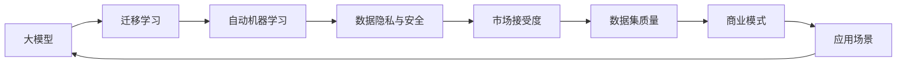

                 

# AI大模型创业：如何应对未来市场挑战？

## 1. 背景介绍

随着人工智能技术的飞速发展，大模型（Large Models）成为市场关注的焦点。在自动驾驶、医疗健康、智能客服、金融风控、游戏推荐、自然语言处理（NLP）等多个领域，大模型都在发挥着重要作用。然而，在商业化应用的过程中，大模型也面临着诸多挑战。本文将围绕大模型的创业机会与市场挑战，提出一些值得探讨的思考与建议。

## 2. 核心概念与联系

### 2.1 核心概念概述

1. **大模型**：指具有数十亿参数规模的深度神经网络模型，能够处理和理解复杂的数据，包括自然语言处理（NLP）、图像识别、语音识别等领域。
2. **迁移学习**：利用已有的知识，在新的领域或任务中进行微调或改写，以实现更高效的训练和应用。
3. **自动机器学习（AutoML）**：通过自动化技术，减少或消除繁琐的手工调参过程，提高模型训练和调优的效率。
4. **数据隐私与安全**：在商业化应用中，确保用户数据不被滥用，保护用户隐私。
5. **市场接受度**：衡量用户对AI大模型的接受和认可程度，影响商业模式的成功与否。
6. **数据集质量**：高质量的数据集是训练高质量模型的基础，直接影响模型性能。

### 2.2 核心概念原理和架构的 Mermaid 流程图



这个流程图展示了大模型从构建到应用的整体过程，其中每个环节都相互依赖且影响最终结果。

## 3. 核心算法原理 & 具体操作步骤

### 3.1 算法原理概述

大模型通过在大规模数据集上进行自监督预训练，学习到丰富的语言知识或图像特征。这些模型在迁移学习过程中，可以通过微调（Fine-Tuning）或改写（Prompt Tuning）等方式，适应新的特定任务。

在迁移学习中，原始大模型被用于初始化参数，并通过有限标注数据进行微调。自动机器学习（AutoML）则利用自动化调参技术，减少人工干预，提升模型性能。

### 3.2 算法步骤详解

1. **数据准备**：收集并准备数据集，确保数据集的质量和多样性。
2. **模型选择**：选择适合任务的预训练模型，并进行微调或改写。
3. **自动调参**：利用AutoML工具进行超参数调优，提升模型性能。
4. **模型评估**：在验证集上评估模型性能，确保模型效果。
5. **部署应用**：将模型部署到实际应用场景中，并不断收集反馈进行调整优化。

### 3.3 算法优缺点

**优点**：
- **高效性**：利用大模型的知识库，可在少量标注数据下取得优异性能。
- **普适性**：模型可以适应不同领域和任务，具有较强的泛化能力。
- **自动化调参**：自动机器学习减少手动调参工作，提高效率。

**缺点**：
- **资源消耗大**：大模型需要大量的计算资源，初期投入高。
- **风险不确定性**：模型在未知领域或复杂任务中，可能表现不佳。
- **数据隐私问题**：模型训练依赖大量数据，可能存在数据隐私风险。

### 3.4 算法应用领域

1. **自动驾驶**：使用大模型进行环境感知与决策，提高行车安全与效率。
2. **医疗诊断**：大模型用于病历分析、病理诊断等，辅助医生诊断。
3. **金融风控**：大模型用于信用评估、欺诈检测、情感分析等。
4. **智能客服**：大模型用于客户情感分析、问题回答、意图识别等。
5. **游戏推荐**：大模型用于个性化推荐，提升用户体验。
6. **自然语言处理**：大模型用于文本生成、翻译、语义理解等。

## 4. 数学模型和公式 & 详细讲解 & 举例说明

### 4.1 数学模型构建

假设有一个大模型，其参数为 $\theta$。原始大模型在预训练数据上进行了监督学习，得到了一个损失函数 $\mathcal{L}_1(\theta)$。在迁移学习过程中，模型需要进行微调，通过微调数据集 $D$，得到损失函数 $\mathcal{L}_2(\theta)$。最终损失函数为 $\mathcal{L}(\theta) = \mathcal{L}_1(\theta) + \mathcal{L}_2(\theta)$。

### 4.2 公式推导过程

假设微调数据集中有 $n$ 个样本，每个样本的损失为 $l_i$，则微调损失函数为：

$$
\mathcal{L}_2(\theta) = \frac{1}{n} \sum_{i=1}^{n} l_i
$$

将微调损失函数代入最终损失函数，得到：

$$
\mathcal{L}(\theta) = \mathcal{L}_1(\theta) + \frac{1}{n} \sum_{i=1}^{n} l_i
$$

### 4.3 案例分析与讲解

以金融风控为例，假设有一个大模型用于预测贷款违约，首先在大量历史贷款数据上进行预训练，得到一个预训练损失函数 $\mathcal{L}_1(\theta)$。然后在小规模的真实违约数据集上进行微调，得到一个微调损失函数 $\mathcal{L}_2(\theta)$。最后，通过组合预训练损失和微调损失，得到一个最终损失函数 $\mathcal{L}(\theta)$。通过最小化 $\mathcal{L}(\theta)$，可以提高模型在真实贷款数据上的预测准确性。

## 5. 项目实践：代码实例和详细解释说明

### 5.1 开发环境搭建

首先需要安装相关依赖库，例如TensorFlow、PyTorch、Keras等。然后搭建GPU环境，确保能够进行大规模计算。

### 5.2 源代码详细实现

以下是一个简单的代码实例，假设使用TensorFlow进行微调：

```python
import tensorflow as tf
from transformers import TFAutoModelForSequenceClassification, Trainer

# 加载预训练模型
model = TFAutoModelForSequenceClassification.from_pretrained('bert-base-uncased', num_labels=2)

# 加载微调数据集
train_dataset = ...
val_dataset = ...

# 定义微调模型
trainer = Trainer(
    model=model,
    train_dataset=train_dataset,
    eval_dataset=val_dataset,
    # 其他参数...
)

# 训练模型
trainer.train()
```

### 5.3 代码解读与分析

上述代码实例中，我们使用 `TFAutoModelForSequenceClassification` 加载了预训练的BERT模型。然后通过 `Trainer` 类，配置微调数据集并进行训练。在训练过程中，TensorFlow会自动进行优化，调整模型参数，以最小化损失函数。

### 5.4 运行结果展示

训练完成后，可以通过以下代码进行模型评估：

```python
results = trainer.evaluate()
print(results)
```

这将输出模型在验证集上的性能，如准确率、精确率、召回率等指标。

## 6. 实际应用场景

### 6.1 自动驾驶

自动驾驶技术在大模型辅助下，通过感知周围环境，做出智能决策。在训练过程中，大模型进行图像识别与定位，然后通过迁移学习进行微调，优化决策模型。

### 6.2 医疗诊断

医疗诊断模型需要处理大量的医疗影像数据。大模型用于初步图像识别，然后通过微调对特定疾病进行诊断，提高诊断准确率。

### 6.3 金融风控

金融风控模型对信用评分、欺诈检测等任务进行微调，利用大模型的复杂表征能力，提升风险评估的准确性。

### 6.4 智能客服

智能客服系统通过大模型进行意图识别和情感分析，然后通过微调优化回答模型，提供更准确、更个性化的回答。

### 6.5 游戏推荐

游戏推荐系统利用大模型进行用户画像与兴趣分析，然后通过微调优化推荐模型，提升用户满意度。

### 6.6 自然语言处理

自然语言处理模型使用大模型进行预训练，然后通过微调处理特定任务，如文本分类、情感分析等，提升处理效率和准确性。

## 7. 工具和资源推荐

### 7.1 学习资源推荐

1. 《深度学习》一书：Ian Goodfellow等人著，涵盖深度学习原理与实践。
2. 《AutoML实战》一书：Boris Markovic著，讲解AutoML技术与实践。
3. 《TensorFlow实战》一书：Tom Hope著，讲解TensorFlow使用方法。
4. 《深度学习框架教程》：Aurélien Géron著，涵盖多个深度学习框架的使用。
5. Google AI博文系列：讲解最新AI技术、实践与应用。

### 7.2 开发工具推荐

1. TensorFlow：Google推出的深度学习框架，支持分布式训练。
2. PyTorch：Facebook开发的深度学习框架，灵活高效。
3. Keras：基于TensorFlow和Theano的高层API，简单易用。
4. AutoML Tools：如Auto-Keras、H2O，自动进行超参数调优。
5. Weights & Biases：用于记录和可视化模型训练过程，评估模型性能。

### 7.3 相关论文推荐

1. "Large-Scale Neural Network Models for Understanding, Generating, and Translating Text" 论文：Lukasz Kaiser等人，介绍大模型的预训练与微调。
2. "AutoML in Practice: Methods, Meta-Analyses, and Insights from over 1,000 Machine Learning Competitions" 论文：Sanjay Chawla等人，研究AutoML技术与实践。
3. "AlphaGo Zero" 论文：David Silver等人，展示AlphaGo Zero的自我对弈学习。
4. "End-to-End Deep Learning for Speech Recognition" 论文：Geoffrey Hinton等人，介绍端到端深度学习在语音识别中的应用。
5. "Scalable Deep Learning on Multi-GPU and Distributed Systems" 论文：Norouzi等人，介绍分布式深度学习训练方法。

## 8. 总结：未来发展趋势与挑战

### 8.1 研究成果总结

大模型在各个领域展示了其强大的应用潜力，但也面临着诸多挑战，包括资源消耗大、风险不确定性、数据隐私问题等。

### 8.2 未来发展趋势

1. **模型规模持续增大**：未来大模型将继续扩展参数规模，提升模型性能。
2. **自动化程度提升**：自动机器学习（AutoML）技术将进一步优化模型训练过程。
3. **数据隐私保护加强**：隐私保护技术将逐渐普及，保障用户数据安全。
4. **跨领域应用扩展**：大模型将在更多领域得到应用，推动各行业智能化转型。

### 8.3 面临的挑战

1. **资源消耗大**：大规模模型训练与部署需要大量计算资源，初期投入高。
2. **风险不确定性**：模型在未知领域或复杂任务中，可能表现不佳。
3. **数据隐私问题**：模型训练依赖大量数据，可能存在数据隐私风险。
4. **伦理与法规问题**：大模型的应用需要考虑伦理与法规问题，确保模型公平透明。

### 8.4 研究展望

未来大模型创业将重点关注以下几个方面：
1. **算法优化**：提升模型训练与推理效率，降低计算资源消耗。
2. **数据隐私保护**：研发隐私保护技术，确保用户数据安全。
3. **模型公平性**：确保模型输出公正、透明，符合伦理标准。
4. **跨领域应用**：拓展大模型在更多领域的应用，推动行业智能化转型。

## 9. 附录：常见问题与解答

**Q1：如何选择合适的预训练模型？**

A: 根据任务需求选择合适的预训练模型。例如，对于NLP任务，可以选择BERT、GPT等预训练模型。

**Q2：微调模型时如何设置学习率？**

A: 设置初始学习率为0.001，然后根据实验效果逐步调整。一般来说，小模型初始学习率可以稍大，大模型应设置较小学习率。

**Q3：微调模型时如何避免过拟合？**

A: 使用数据增强技术，增加数据集多样性。引入正则化技术，如L2正则、Dropout等。采用早停法，根据验证集性能调整训练周期。

**Q4：如何确保大模型的安全性和可靠性？**

A: 使用安全与隐私保护技术，确保模型输出公平、透明。进行模型评估与测试，确保模型性能稳定。

**Q5：未来大模型创业需要关注哪些新兴技术？**

A: 关注自然语言生成、多模态学习、知识图谱等新兴技术，提升模型表现与灵活性。

作者：禅与计算机程序设计艺术 / Zen and the Art of Computer Programming

