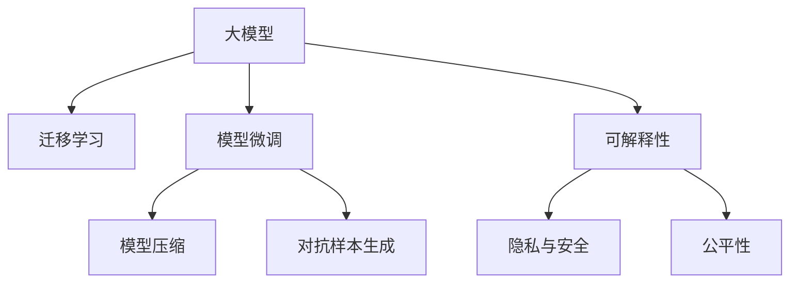

                 

# AI大模型创业：如何应对未来技术挑战？

> 关键词：人工智能创业,大模型,技术挑战,创业指南,人工智能应用

## 1. 背景介绍

### 1.1 问题由来

近年来，人工智能(AI)技术在各行业的广泛应用中显现出巨大的价值潜力。大模型如GPT-3、BERT等，通过大规模数据预训练，具备了强大的语言理解和生成能力，极大地推动了自然语言处理(NLP)等领域的创新发展。然而，随着技术的不断进步，AI创业公司面临着一系列新的技术挑战，如何应对这些挑战，实现AI技术在更多领域的落地应用，成为了创业者必须面对的问题。

### 1.2 问题核心关键点

大模型及其应用的核心挑战主要包括以下几个方面：

- **数据标注成本**：大规模标注数据的高成本是AI应用中的一大难题。
- **模型训练与优化**：模型规模巨大，训练和优化过程中需要高性能计算资源。
- **模型性能与鲁棒性**：模型在大规模、高噪声数据上的泛化能力，以及对抗攻击的鲁棒性。
- **模型的可解释性**：如何解释AI模型在特定场景下的决策过程，确保应用的透明性。
- **模型隐私与安全**：用户数据隐私保护和AI系统安全性问题。
- **模型的公平性与偏见**：如何确保AI模型在不同人群中的公平性，避免引入偏见。

### 1.3 问题研究意义

面对这些挑战，AI创业公司需要具备深厚的技术背景和敏锐的市场洞察力，在技术研发和商业模式上找到平衡点，以确保技术优势和市场竞争力的同步提升。对于AI领域的长期发展而言，有效应对这些挑战，不仅有助于实现技术的商业化应用，还将为AI技术的进一步发展奠定坚实基础。

## 2. 核心概念与联系

### 2.1 核心概念概述

为更好地理解AI大模型的创业挑战及其应对策略，本节将介绍几个密切相关的核心概念：

- **大模型(Large Model)**：指通过大规模数据预训练得到的深度神经网络模型，如GPT-3、BERT等，具备强大的语言理解与生成能力。
- **迁移学习(Transfer Learning)**：利用预训练模型在特定任务上的微调，实现知识迁移，提升模型性能。
- **模型微调(Fine-tuning)**：在大模型基础上，针对特定任务进行有监督学习优化，提升模型在特定任务上的表现。
- **模型压缩与优化(Compression and Optimization)**：通过剪枝、量化、蒸馏等技术，减小模型规模，提高推理速度。
- **对抗样本生成(Adversarial Examples)**：生成具有特定攻击意图的输入样本，评估模型鲁棒性。
- **可解释性(Explainability)**：解释模型决策的依据，确保模型透明性和可信度。
- **隐私与安全(Privacy and Security)**：保护用户数据隐私，抵御攻击，确保模型安全。
- **公平性(Fairness)**：确保模型在不同人群上的公平性，避免引入偏见。

这些核心概念之间的逻辑关系可以通过以下Mermaid流程图来展示：



这个流程图展示了大模型的核心概念及其之间的关系：

1. 大模型通过大规模数据预训练获得基础能力。
2. 迁移学习利用预训练模型在特定任务上的微调，提升模型性能。
3. 模型微调在大模型基础上针对特定任务进行有监督学习优化。
4. 模型压缩通过剪枝、量化、蒸馏等技术，减小模型规模，提高推理速度。
5. 对抗样本生成评估模型鲁棒性。
6. 可解释性解释模型决策依据，确保模型透明性和可信度。
7. 隐私与安全保护用户数据隐私，确保模型安全。
8. 公平性确保模型在不同人群上的公平性，避免引入偏见。

这些概念共同构成了大模型创业的技术框架，帮助AI创业公司全面应对技术挑战，实现应用的稳定可靠。

## 3. 核心算法原理 & 具体操作步骤
### 3.1 算法原理概述

AI大模型的创业挑战，本质上是如何在实际应用中，高效、安全、公平地使用大模型，提升其性能和可靠性。其中，模型的迁移学习与微调是应对这些挑战的核心方法。

- **迁移学习**：在大规模无标签数据上进行预训练，然后在特定任务上进行微调，通过知识迁移提升模型性能。
- **模型微调**：在预训练模型的基础上，针对特定任务进行有监督学习优化，提升模型在特定任务上的表现。

形式化地，假设预训练模型为 $M_{\theta}$，其中 $\theta$ 为预训练得到的模型参数。给定下游任务 $T$ 的标注数据集 $D=\{(x_i, y_i)\}_{i=1}^N$，微调的目标是找到新的模型参数 $\hat{\theta}$，使得：

$$
\hat{\theta}=\mathop{\arg\min}_{\theta} \mathcal{L}(M_{\theta},D)
$$

其中 $\mathcal{L}$ 为针对任务 $T$ 设计的损失函数，用于衡量模型预测输出与真实标签之间的差异。

### 3.2 算法步骤详解

基于迁移学习和模型微调的AI大模型创业，一般包括以下几个关键步骤：

**Step 1: 准备预训练模型和数据集**
- 选择合适的预训练模型 $M_{\theta}$ 作为初始化参数，如 BERT、GPT 等。
- 准备下游任务 $T$ 的标注数据集 $D$，划分为训练集、验证集和测试集。

**Step 2: 模型微调**
- 添加任务适配层：根据任务类型，在预训练模型顶层设计合适的输出层和损失函数。
- 设置微调超参数：选择合适的优化算法及其参数，如 AdamW、SGD 等，设置学习率、批大小、迭代轮数等。
- 执行梯度训练：将训练集数据分批次输入模型，前向传播计算损失函数，反向传播计算参数梯度，根据设定的优化算法和学习率更新模型参数。

**Step 3: 模型压缩与优化**
- 剪枝：去除不重要的参数和层，减小模型规模。
- 量化：将模型参数从浮点数转换为定点数，压缩存储空间。
- 蒸馏：通过教师模型和学生模型之间的知识传递，提升学生模型的性能。

**Step 4: 对抗样本生成**
- 生成对抗样本：使用对抗样本生成算法，评估模型鲁棒性。
- 对抗训练：在对抗样本上训练模型，提升模型的鲁棒性。

**Step 5: 模型可解释性**
- 可解释性模型：使用可解释性模型（如LIME、SHAP等）解释模型决策过程。
- 模型可视化：使用模型可视化工具（如TensorBoard、Modelcope等）展示模型行为。

**Step 6: 隐私与安全**
- 数据加密：对用户数据进行加密，确保数据安全。
- 隐私保护：使用差分隐私等技术，保护用户隐私。
- 安全检测：定期进行安全漏洞检测，保障系统安全。

**Step 7: 模型公平性**
- 数据平衡：确保训练数据集在各人群中的平衡分布。
- 公平性算法：使用公平性算法（如反偏见损失函数），避免模型偏见。

通过这些步骤，AI创业公司可以系统性地解决大模型应用中的各项技术挑战，提升模型性能和可靠性，确保应用的稳定性和安全性。

### 3.3 算法优缺点

迁移学习和模型微调的方法具有以下优点：
1. **高效性**：通过迁移学习，可以在少量标注数据上快速提升模型性能。
2. **泛化能力**：通过微调，模型可以在特定任务上获得优异的泛化性能。
3. **参数高效**：通过剪枝、量化等技术，可以显著减小模型规模，提高推理效率。
4. **鲁棒性**：通过对抗训练等技术，可以提高模型对噪声和攻击的鲁棒性。

同时，该方法也存在以下局限性：
1. **数据依赖**：依赖标注数据，获取高质量标注数据成本较高。
2. **模型复杂度**：模型规模较大，需要高性能计算资源。
3. **过拟合风险**：微调过程中可能出现过拟合，需要采取正则化等策略。
4. **解释性不足**：模型决策过程复杂，难以解释。
5. **安全风险**：对抗样本和攻击可能影响模型安全。
6. **公平性问题**：模型可能在不同人群上表现出偏见。

尽管存在这些局限性，基于迁移学习和微调的AI大模型方法仍然是大规模应用的重要手段。未来研究需进一步降低数据依赖，提升模型效率和解释性，确保模型公平性和安全性。

### 3.4 算法应用领域

基于迁移学习和模型微调的AI大模型方法，在众多领域得到了广泛应用，例如：

- **自然语言处理(NLP)**：文本分类、情感分析、机器翻译、对话系统等。
- **计算机视觉(CV)**：图像识别、目标检测、图像生成等。
- **智能推荐**：个性化推荐、电商推荐、广告推荐等。
- **金融科技**：信用评分、情感分析、风险控制等。
- **医疗健康**：疾病诊断、药物研发、患者互动等。
- **智能制造**：生产优化、设备维护、质量控制等。
- **智能交通**：智能导航、交通预测、安全监控等。
- **智慧城市**：城市管理、智能安防、公共服务等。

## 4. 数学模型和公式 & 详细讲解  
### 4.1 数学模型构建

本节将使用数学语言对AI大模型的创业挑战及其应对方法进行更加严格的刻画。

记预训练模型为 $M_{\theta}$，其中 $\theta$ 为预训练得到的模型参数。假设下游任务 $T$ 的训练集为 $D=\{(x_i,y_i)\}_{i=1}^N, x_i \in \mathcal{X}, y_i \in \mathcal{Y}$。

定义模型 $M_{\theta}$ 在数据样本 $(x,y)$ 上的损失函数为 $\ell(M_{\theta}(x),y)$，则在数据集 $D$ 上的经验风险为：

$$
\mathcal{L}(\theta) = \frac{1}{N} \sum_{i=1}^N \ell(M_{\theta}(x_i),y_i)
$$

微调的优化目标是最小化经验风险，即找到最优参数：

$$
\theta^* = \mathop{\arg\min}_{\theta} \mathcal{L}(\theta)
$$

在实践中，我们通常使用基于梯度的优化算法（如SGD、Adam等）来近似求解上述最优化问题。设 $\eta$ 为学习率，$\lambda$ 为正则化系数，则参数的更新公式为：

$$
\theta \leftarrow \theta - \eta \nabla_{\theta}\mathcal{L}(\theta) - \eta\lambda\theta
$$

其中 $\nabla_{\theta}\mathcal{L}(\theta)$ 为损失函数对参数 $\theta$ 的梯度，可通过反向传播算法高效计算。

### 4.2 公式推导过程

以下我们以二分类任务为例，推导交叉熵损失函数及其梯度的计算公式。

假设模型 $M_{\theta}$ 在输入 $x$ 上的输出为 $\hat{y}=M_{\theta}(x) \in [0,1]$，表示样本属于正类的概率。真实标签 $y \in \{0,1\}$。则二分类交叉熵损失函数定义为：

$$
\ell(M_{\theta}(x),y) = -[y\log \hat{y} + (1-y)\log (1-\hat{y})]
$$

将其代入经验风险公式，得：

$$
\mathcal{L}(\theta) = -\frac{1}{N}\sum_{i=1}^N [y_i\log M_{\theta}(x_i)+(1-y_i)\log(1-M_{\theta}(x_i))]
$$

根据链式法则，损失函数对参数 $\theta_k$ 的梯度为：

$$
\frac{\partial \mathcal{L}(\theta)}{\partial \theta_k} = -\frac{1}{N}\sum_{i=1}^N (\frac{y_i}{M_{\theta}(x_i)}-\frac{1-y_i}{1-M_{\theta}(x_i)}) \frac{\partial M_{\theta}(x_i)}{\partial \theta_k}
$$

其中 $\frac{\partial M_{\theta}(x_i)}{\partial \theta_k}$ 可进一步递归展开，利用自动微分技术完成计算。

在得到损失函数的梯度后，即可带入参数更新公式，完成模型的迭代优化。重复上述过程直至收敛，最终得到适应下游任务的最优模型参数 $\theta^*$。

## 5. 项目实践：代码实例和详细解释说明
### 5.1 开发环境搭建

在进行AI大模型的创业实践前，我们需要准备好开发环境。以下是使用Python进行PyTorch开发的环境配置流程：

1. 安装Anaconda：从官网下载并安装Anaconda，用于创建独立的Python环境。

2. 创建并激活虚拟环境：
```bash
conda create -n pytorch-env python=3.8 
conda activate pytorch-env
```

3. 安装PyTorch：根据CUDA版本，从官网获取对应的安装命令。例如：
```bash
conda install pytorch torchvision torchaudio cudatoolkit=11.1 -c pytorch -c conda-forge
```

4. 安装TensorBoard：
```bash
pip install tensorboard
```

5. 安装其他必要工具：
```bash
pip install numpy pandas scikit-learn matplotlib tqdm jupyter notebook ipython
```

完成上述步骤后，即可在`pytorch-env`环境中开始创业实践。

### 5.2 源代码详细实现

这里我们以一个简单的图像分类任务为例，展示如何使用PyTorch实现AI大模型的创业实践。

首先，定义图像分类任务的数据处理函数：

```python
import torch
import torchvision.transforms as transforms
from torch.utils.data import Dataset, DataLoader
from torchvision import datasets, transforms

class ImageDataset(Dataset):
    def __init__(self, root, transform=None):
        self.root = root
        self.transform = transform
        self.train = datasets.MNIST(root=self.root, train=True, download=True)
        self.test = datasets.MNIST(root=self.root, train=False, download=True)

    def __len__(self):
        return len(self.train) + len(self.test)

    def __getitem__(self, idx):
        if idx < len(self.train):
            img, target = self.train[idx]
        else:
            img, target = self.test[idx]
        img = transforms.ToTensor()(img)
        if self.transform:
            img = self.transform(img)
        return img, target
```

然后，定义模型和优化器：

```python
from transformers import BertTokenizer
from torchvision.models import resnet50
import torch.nn as nn
import torch.optim as optim

model = resnet50(pretrained=True)
tokenizer = BertTokenizer.from_pretrained('bert-base-cased')
criterion = nn.CrossEntropyLoss()
optimizer = optim.Adam(model.parameters(), lr=0.001)

```

接着，定义训练和评估函数：

```python
def train_model(model, train_loader, criterion, optimizer, num_epochs=10):
    model.train()
    for epoch in range(num_epochs):
        running_loss = 0.0
        for i, data in enumerate(train_loader, 0):
            inputs, labels = data
            optimizer.zero_grad()
            outputs = model(inputs)
            loss = criterion(outputs, labels)
            loss.backward()
            optimizer.step()
            running_loss += loss.item()
            if i % 100 == 99:    # 每训练100张图片输出一次loss值
                print('[%d, %5d] loss: %.3f' % (epoch + 1, i + 1, running_loss / 100))
                running_loss = 0.0

def evaluate_model(model, test_loader):
    model.eval()
    correct = 0
    total = 0
    with torch.no_grad():
        for data in test_loader:
            inputs, labels = data
            outputs = model(inputs)
            _, predicted = torch.max(outputs.data, 1)
            total += labels.size(0)
            correct += (predicted == labels).sum().item()

    print('Accuracy of the network on the 10000 test images: %d %%' % (100 * correct / total))
```

最后，启动训练流程并在测试集上评估：

```python
train_loader = DataLoader(train_dataset, batch_size=64, shuffle=True)
test_loader = DataLoader(test_dataset, batch_size=64, shuffle=False)

train_model(model, train_loader, criterion, optimizer)

evaluate_model(model, test_loader)
```

以上就是使用PyTorch对图像分类任务进行AI大模型创业的完整代码实现。可以看到，使用深度学习框架进行模型训练和评估非常方便，可以大幅降低开发成本。

### 5.3 代码解读与分析

让我们再详细解读一下关键代码的实现细节：

**ImageDataset类**：
- `__init__`方法：初始化数据集路径、数据转换等关键组件。
- `__len__`方法：返回数据集的样本数量。
- `__getitem__`方法：对单个样本进行处理，返回模型所需的输入和标签。

**train_model和evaluate_model函数**：
- 训练函数 `train_model`：对模型进行前向传播计算损失函数，反向传播更新模型参数，并在每个epoch输出损失值。
- 评估函数 `evaluate_model`：在测试集上评估模型性能，输出准确率。

**训练流程**：
- 定义总的epoch数和批次大小，开始循环迭代
- 每个epoch内，先在训练集上训练，输出损失值
- 在测试集上评估，输出准确率

可以看到，PyTorch框架提供了高效的模型训练和评估工具，使得AI大模型的创业实践变得简便快捷。

当然，工业级的系统实现还需考虑更多因素，如模型的保存和部署、超参数的自动搜索、更灵活的任务适配层等。但核心的创业流程基本与此类似。

## 6. 实际应用场景
### 6.1 智能客服系统

AI大模型在智能客服系统中的应用，可以显著提升客户咨询体验和问题解决效率。传统客服往往需要配备大量人力，高峰期响应缓慢，且一致性和专业性难以保证。而使用AI大模型进行微调，可以7x24小时不间断服务，快速响应客户咨询，用自然流畅的语言解答各类常见问题。

在技术实现上，可以收集企业内部的历史客服对话记录，将问题和最佳答复构建成监督数据，在此基础上对预训练对话模型进行微调。微调后的对话模型能够自动理解用户意图，匹配最合适的答案模板进行回复。对于客户提出的新问题，还可以接入检索系统实时搜索相关内容，动态组织生成回答。如此构建的智能客服系统，能大幅提升客户咨询体验和问题解决效率。

### 6.2 金融舆情监测

金融机构需要实时监测市场舆论动向，以便及时应对负面信息传播，规避金融风险。传统的人工监测方式成本高、效率低，难以应对网络时代海量信息爆发的挑战。基于AI大模型的文本分类和情感分析技术，为金融舆情监测提供了新的解决方案。

具体而言，可以收集金融领域相关的新闻、报道、评论等文本数据，并对其进行主题标注和情感标注。在此基础上对预训练语言模型进行微调，使其能够自动判断文本属于何种主题，情感倾向是正面、中性还是负面。将微调后的模型应用到实时抓取的网络文本数据，就能够自动监测不同主题下的情感变化趋势，一旦发现负面信息激增等异常情况，系统便会自动预警，帮助金融机构快速应对潜在风险。

### 6.3 个性化推荐系统

当前的推荐系统往往只依赖用户的历史行为数据进行物品推荐，无法深入理解用户的真实兴趣偏好。基于AI大模型的个性化推荐系统可以更好地挖掘用户行为背后的语义信息，从而提供更精准、多样的推荐内容。

在实践中，可以收集用户浏览、点击、评论、分享等行为数据，提取和用户交互的物品标题、描述、标签等文本内容。将文本内容作为模型输入，用户的后续行为（如是否点击、购买等）作为监督信号，在此基础上微调预训练语言模型。微调后的模型能够从文本内容中准确把握用户的兴趣点。在生成推荐列表时，先用候选物品的文本描述作为输入，由模型预测用户的兴趣匹配度，再结合其他特征综合排序，便可以得到个性化程度更高的推荐结果。

### 6.4 未来应用展望

随着AI大模型的不断发展，其在更多领域的落地应用前景广阔。未来，AI大模型有望在智慧医疗、智能教育、智能交通、智慧城市等多个领域发挥重要作用。

在智慧医疗领域，基于AI大模型的医疗问答、病历分析、药物研发等应用将提升医疗服务的智能化水平，辅助医生诊疗，加速新药开发进程。

在智能教育领域，AI大模型可应用于作业批改、学情分析、知识推荐等方面，因材施教，促进教育公平，提高教学质量。

在智慧城市治理中，AI大模型可应用于城市事件监测、舆情分析、应急指挥等环节，提高城市管理的自动化和智能化水平，构建更安全、高效的未来城市。

此外，在企业生产、社会治理、文娱传媒等众多领域，基于AI大模型的应用也将不断涌现，为经济社会发展注入新的动力。相信随着技术的日益成熟，AI大模型必将在构建人机协同的智能时代中扮演越来越重要的角色。

## 7. 工具和资源推荐
### 7.1 学习资源推荐

为了帮助AI创业公司系统掌握AI大模型的创业挑战及其应对策略，这里推荐一些优质的学习资源：

1. 《深度学习》课程：斯坦福大学Andrew Ng教授的深度学习课程，讲解深度学习基础理论和实践技能，是AI创业者的必备课程。

2. 《Python深度学习》书籍：Francois Chollet著，介绍使用Keras进行深度学习模型开发的全面内容，适合动手实践。

3. Coursera《AI for Everyone》课程：适合非技术背景人士了解AI基础知识和应用场景。

4. Udacity《深度学习纳米学位》：提供系统的深度学习课程体系，从基础到高级全面覆盖，适合系统学习。

5. HuggingFace官方文档：提供丰富的预训练模型和微调样例代码，是AI大模型创业者的重要参考资料。

通过对这些资源的学习实践，相信你能更好地理解和应用AI大模型，在创业实践中取得成功。

### 7.2 开发工具推荐

高效的开发离不开优秀的工具支持。以下是几款用于AI大模型创业开发的常用工具：

1. PyTorch：基于Python的开源深度学习框架，灵活的计算图，适合快速迭代研究。大部分预训练语言模型都有PyTorch版本的实现。

2. TensorFlow：由Google主导开发的开源深度学习框架，生产部署方便，适合大规模工程应用。同样有丰富的预训练语言模型资源。

3. Weights & Biases：模型训练的实验跟踪工具，可以记录和可视化模型训练过程中的各项指标，方便对比和调优。

4. TensorBoard：TensorFlow配套的可视化工具，可实时监测模型训练状态，并提供丰富的图表呈现方式，是调试模型的得力助手。

5. Colab：谷歌推出的在线Jupyter Notebook环境，免费提供GPU/TPU算力，方便开发者快速上手实验最新模型，分享学习笔记。

合理利用这些工具，可以显著提升AI大模型创业的开发效率，加快创新迭代的步伐。

### 7.3 相关论文推荐

AI大模型的创业挑战源于学界的持续研究。以下是几篇奠基性的相关论文，推荐阅读：

1. Attention is All You Need：提出Transformer结构，开启了NLP领域的预训练大模型时代。

2. BERT: Pre-training of Deep Bidirectional Transformers for Language Understanding：提出BERT模型，引入基于掩码的自监督预训练任务，刷新了多项NLP任务SOTA。

3. Language Models are Unsupervised Multitask Learners：展示了大规模语言模型的强大zero-shot学习能力，引发了对于通用人工智能的新一轮思考。

4. GPT-3：展示了GPT-3在自然语言生成、理解等任务上的强大表现，推动了预训练大模型的应用边界。

5. Scaling Language Models to 100 Billion Parameters：提出训练超大参数模型的方法，推动了超大规模语言模型的发展。

这些论文代表了大模型创业的技术发展脉络。通过学习这些前沿成果，可以帮助AI创业公司把握学科前进方向，激发更多的创新灵感。

## 8. 总结：未来发展趋势与挑战
### 8.1 总结

本文对AI大模型的创业挑战及其应对策略进行了全面系统的介绍。首先阐述了AI大模型在创业应用中面临的主要技术挑战，明确了微调、模型压缩、对抗训练等核心方法。其次，从原理到实践，详细讲解了迁移学习和模型微调的基本步骤，给出了具体的代码实现。同时，本文还广泛探讨了AI大模型在多个领域的应用前景，展示了其广阔的落地潜力。此外，本文精选了创业相关的学习资源，力求为AI创业公司提供全方位的技术指引。

通过本文的系统梳理，可以看到，AI大模型的创业实践需要在技术研发和商业模式上找到平衡点，确保技术优势和市场竞争力的同步提升。只有在数据、模型、训练、推理等各环节进行全面优化，才能最大限度地发挥AI大模型的商业价值，实现应用的稳定可靠。未来，AI大模型必将引领人工智能技术向更广阔的领域加速渗透，为经济社会发展注入新的动力。

### 8.2 未来发展趋势

展望未来，AI大模型的创业实践将呈现以下几个发展趋势：

1. **模型规模持续增大**：随着算力成本的下降和数据规模的扩张，预训练语言模型的参数量还将持续增长。超大规模语言模型蕴含的丰富语言知识，有望支撑更加复杂多变的下游任务微调。

2. **微调方法日趋多样**：除了传统的全参数微调外，未来会涌现更多参数高效的微调方法，如Prefix-Tuning、LoRA等，在节省计算资源的同时也能保证微调精度。

3. **持续学习成为常态**：随着数据分布的不断变化，微调模型也需要持续学习新知识以保持性能。如何在不遗忘原有知识的同时，高效吸收新样本信息，将成为重要的研究课题。

4. **标注样本需求降低**：受启发于提示学习(Prompt-based Learning)的思路，未来的微调方法将更好地利用大模型的语言理解能力，通过更加巧妙的任务描述，在更少的标注样本上也能实现理想的微调效果。

5. **多模态微调崛起**：当前的微调主要聚焦于纯文本数据，未来会进一步拓展到图像、视频、语音等多模态数据微调。多模态信息的融合，将显著提升语言模型对现实世界的理解和建模能力。

6. **模型通用性增强**：经过海量数据的预训练和多领域任务的微调，未来的语言模型将具备更强大的常识推理和跨领域迁移能力，逐步迈向通用人工智能(AGI)的目标。

以上趋势凸显了AI大模型创业的广阔前景。这些方向的探索发展，必将进一步提升AI技术在更多领域的落地应用，为经济社会发展注入新的动力。

### 8.3 面临的挑战

尽管AI大模型创业已经取得了瞩目成就，但在迈向更加智能化、普适化应用的过程中，它仍面临着诸多挑战：

1. **数据标注成本瓶颈**：尽管微调方法可以在少量标注数据上取得较好效果，但对于长尾应用场景，仍需大量高质量标注数据，成本较高。如何降低标注成本，仍是重要挑战。

2. **模型鲁棒性不足**：模型在大规模、高噪声数据上的泛化能力，以及对抗攻击的鲁棒性，仍需进一步提升。对抗样本和攻击可能影响模型安全。

3. **模型复杂度较高**：AI大模型往往参数量巨大，训练和推理过程中需要高性能计算资源。如何提升模型效率，降低计算成本，仍是重要课题。

4. **可解释性不足**：当前AI大模型的决策过程复杂，难以解释。对于医疗、金融等高风险应用，模型的可解释性尤为重要。

5. **安全风险**：预训练模型可能学习到有偏见、有害的信息，通过微调传递到下游任务，产生误导性、歧视性的输出，给实际应用带来安全隐患。

6. **公平性问题**：模型可能在不同人群上表现出偏见。如何确保模型在不同人群上的公平性，避免引入偏见，仍需进一步研究。

### 8.4 研究展望

面对AI大模型创业所面临的各项挑战，未来的研究需要在以下几个方面寻求新的突破：

1. **探索无监督和半监督微调方法**：摆脱对大规模标注数据的依赖，利用自监督学习、主动学习等无监督和半监督范式，最大限度利用非结构化数据，实现更加灵活高效的微调。

2. **研究参数高效和计算高效的微调范式**：开发更加参数高效的微调方法，在固定大部分预训练参数的情况下，只更新极少量的任务相关参数。同时优化微调模型的计算图，减少前向传播和反向传播的资源消耗，实现更加轻量级、实时性的部署。

3. **引入因果分析和博弈论工具**：将因果分析方法引入微调模型，识别出模型决策的关键特征，增强输出解释的因果性和逻辑性。借助博弈论工具刻画人机交互过程，主动探索并规避模型的脆弱点，提高系统稳定性。

4. **纳入伦理道德约束**：在模型训练目标中引入伦理导向的评估指标，过滤和惩罚有偏见、有害的输出倾向。同时加强人工干预和审核，建立模型行为的监管机制，确保输出符合人类价值观和伦理道德。

5. **知识整合能力提升**：将符号化的先验知识，如知识图谱、逻辑规则等，与神经网络模型进行巧妙融合，引导微调过程学习更准确、合理的语言模型。同时加强不同模态数据的整合，实现视觉、语音等多模态信息与文本信息的协同建模。

这些研究方向的探索，必将引领AI大模型创业技术迈向更高的台阶，为构建安全、可靠、可解释、可控的智能系统铺平道路。面向未来，AI大模型创业公司需要不断创新、持续优化，才能真正实现技术的商业化应用，推动人工智能技术的全面普及。

## 9. 附录：常见问题与解答

**Q1：AI大模型创业如何平衡技术研发和商业模式？**

A: AI大模型创业需要在技术研发和商业模式上找到平衡点，确保技术优势和市场竞争力的同步提升。具体的平衡策略如下：

1. **选择高潜力的应用场景**：选择市场潜力大、技术壁垒高、用户需求强烈的领域，进行深入研究。

2. **加速技术迭代与产品开发**：采用敏捷开发和快速迭代的方法，快速推出原型产品，收集用户反馈，不断优化。

3. **引入外部资源**：寻找战略合作伙伴和风险投资，加速技术研发和商业落地。

4. **用户需求驱动**：深入理解目标用户需求，进行定制化开发，提升产品用户体验。

5. **多元化商业模式**：采用订阅模式、按需付费模式、免费增值模式等多种方式，降低用户使用门槛，提升市场渗透率。

**Q2：AI大模型创业在数据标注方面有哪些策略？**

A: 数据标注是AI大模型创业中的重要环节，成本较高且对数据质量要求高。以下是一些有效的数据标注策略：

1. **数据增强**：通过对现有数据进行裁剪、旋转、变形等操作，生成新的数据样本，降低标注成本。

2. **主动学习**：利用模型的预测结果，主动选择未标注样本进行标注，减少标注工作量。

3. **无监督学习**：利用自监督学习方法，从无标签数据中挖掘有用的特征，辅助标注过程。

4. **半监督学习**：结合少量标注数据和大量无标签数据，提升模型性能。

5. **众包标注**：利用众包平台，如Amazon Mechanical Turk，降低标注成本，同时确保数据多样性。

**Q3：AI大模型创业在模型优化方面有哪些策略？**

A: 模型优化是AI大模型创业中的关键环节，需要兼顾模型性能和计算效率。以下是一些有效的模型优化策略：

1. **剪枝**：去除不重要的参数和层，减小模型规模。

2. **量化**：将模型参数从浮点数转换为定点数，压缩存储空间。

3. **蒸馏**：通过教师模型和学生模型之间的知识传递，提升学生模型的性能。

4. **梯度累积**：采用梯度累积技术，减少每次前向传播的计算量，提升推理速度。

5. **混合精度训练**：采用混合精度训练技术，降低内存占用，提升训练速度。

6. **分布式训练**：采用分布式训练技术，加快模型训练速度。

**Q4：AI大模型创业在模型鲁棒性方面有哪些策略？**

A: 模型鲁棒性是AI大模型创业中的重要环节，需要确保模型在各种数据分布和攻击场景下的表现。以下是一些有效的模型鲁棒性策略：

1. **对抗样本生成**：使用对抗样本生成算法，评估模型鲁棒性。

2. **对抗训练**：在对抗样本上训练模型，提升模型的鲁棒性。

3. **正则化**：引入L2正则、Dropout等正则化技术，防止模型过拟合。

4. **模型蒸馏**：通过教师模型和学生模型之间的知识传递，提升学生模型的鲁棒性。

5. **数据增强**：通过对训练样本进行各种变换，提升模型的泛化能力。

**Q5：AI大模型创业在模型公平性方面有哪些策略？**

A: 模型公平性是AI大模型创业中的重要环节，需要确保模型在不同人群上的表现公平。以下是一些有效的模型公平性策略：

1. **数据平衡**：确保训练数据集在各人群中的平衡分布，避免模型偏向某一特定人群。

2. **公平性算法**：使用公平性算法，如反偏见损失函数，避免模型偏见。

3. **数据再采样**：对不平衡的数据集进行再采样，提升模型公平性。

4. **多样性评估**：定期评估模型在不同人群上的表现，及时发现并纠正偏见。

5. **用户反馈机制**：建立用户反馈机制，及时收集用户意见，优化模型性能。

这些策略可以帮助AI大模型创业公司在技术研发和商业模式上找到平衡点，确保技术的商业化应用，推动人工智能技术的全面普及。

---

作者：禅与计算机程序设计艺术 / Zen and the Art of Computer Programming

