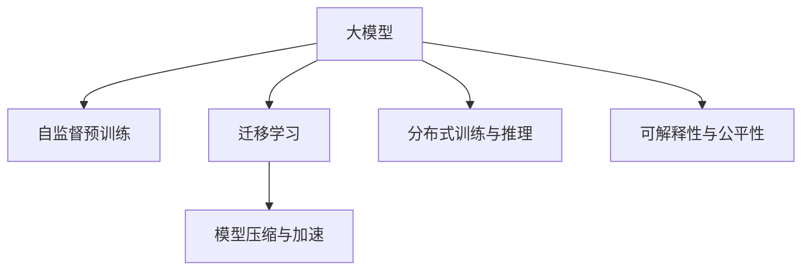
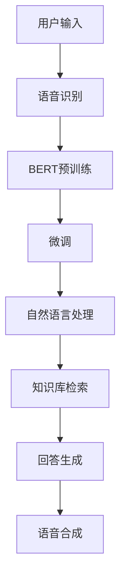
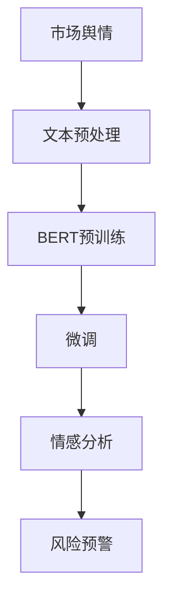
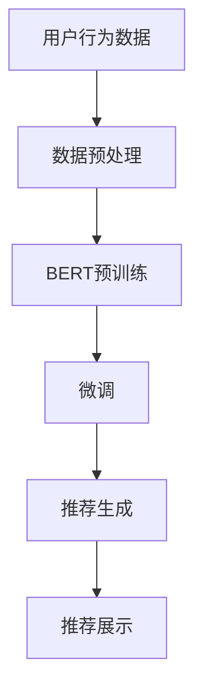

                 

# AI大模型创业：如何应对未来技术挑战？

在AI大模型领域，如何构建和运营一家成功的高科技创业公司，是每一个创业者必须面对的挑战。本文将通过分析核心概念、算法原理、实际应用场景和未来发展趋势，为你提供一套系统的解决方案。

## 1. 背景介绍

### 1.1 问题由来
随着深度学习技术的发展，大模型在自然语言处理、计算机视觉、推荐系统等众多领域取得了令人瞩目的成绩。其背后的核心技术包括自监督预训练、大规模数据集、高效的模型结构和算法等。然而，从实验室到实际应用，创业公司面临诸多挑战。

### 1.2 问题核心关键点
大模型创业的挑战主要包括以下几个方面：
1. 数据获取与预处理：高质量的数据集是大模型训练的基础。
2. 算法优化与工程实现：高效的算法和系统架构是性能保证的关键。
3. 用户体验与模型效果：模型效果和用户反馈的平衡是产品成功的关键。
4. 资源与成本控制：大模型的开发与运营需要高昂的成本和资源。
5. 市场竞争与战略布局：如何在激烈的市场竞争中保持领先优势。

## 2. 核心概念与联系

### 2.1 核心概念概述

为了更好地应对这些挑战，下面将详细介绍相关核心概念及其联系。

- **大模型(Large Model)**：指具有亿级以上参数的深度学习模型，通常用于处理复杂的数据任务，如自然语言理解、计算机视觉等。
- **自监督预训练(Self-Supervised Pretraining)**：利用未标注数据进行预训练，学习通用的语言或视觉表示。
- **迁移学习(Transfer Learning)**：将在大规模数据集上预训练的模型迁移到小规模数据集上，以提升性能。
- **模型压缩与加速(Compression & Acceleration)**：通过模型压缩、剪枝等技术减小模型规模，提高推理速度。
- **分布式训练与推理(Distributed Training & Inference)**：通过分布式计算技术提高大模型的训练与推理效率。
- **可解释性与公平性(Explainability & Fairness)**：大模型应该具备较高的可解释性，避免偏见和歧视，确保模型的公平性。

这些概念间的关系可以通过以下Mermaid流程图表示：



## 3. 核心算法原理 & 具体操作步骤
### 3.1 算法原理概述

大模型创业的核心算法原理主要包括自监督预训练、迁移学习和微调等技术。

**自监督预训练**：利用大规模未标注数据，通过自监督任务（如语言建模、图像分类）训练大模型，学习到通用的特征表示。

**迁移学习**：在大规模数据集上预训练的模型，可以在小规模数据集上进行微调，提升特定任务的性能。

**微调**：通过标注数据，调整大模型在特定任务上的参数，使其适应具体的应用场景。

### 3.2 算法步骤详解

下面详细介绍大模型创业中的核心算法步骤：

**步骤1: 数据获取与预处理**
- 收集与标注数据：从公开数据集获取或自行收集数据，并进行预处理。
- 数据增强与清洗：对数据进行增强、清洗和标准化，提高数据质量。

**步骤2: 模型选择与初始化**
- 选择合适的预训练模型，并进行初始化。如使用BERT、GPT等预训练模型。
- 设置超参数：包括学习率、批次大小、迭代轮数等。

**步骤3: 自监督预训练**
- 在未标注数据上进行预训练：如使用语言建模任务。
- 定期评估模型性能，调整训练策略。

**步骤4: 迁移学习与微调**
- 在大规模数据集上预训练模型，选择性能最优的模型。
- 对小规模数据集进行微调：如使用特定任务的数据集。
- 定期评估模型性能，调整训练策略。

**步骤5: 模型压缩与加速**
- 采用模型压缩技术：如剪枝、量化、蒸馏等。
- 实现分布式训练与推理：利用分布式计算技术提高效率。

**步骤6: 部署与维护**
- 部署模型到服务器或云端，实现在线推理服务。
- 定期更新模型，保持性能最优。

### 3.3 算法优缺点

**优点：**
1. 通用性：大模型可以应用于多个领域，如自然语言处理、计算机视觉等。
2. 高效性：迁移学习和微调技术可以显著提升模型性能，减少训练时间。
3. 可解释性：通过分布式训练和模型压缩，提高模型的可解释性。

**缺点：**
1. 数据依赖：大模型的性能依赖高质量的数据集。
2. 计算资源：大模型需要高昂的计算资源和存储空间。
3. 模型复杂性：大模型的训练和推理过程复杂，容易出现过拟合。

## 4. 数学模型和公式 & 详细讲解 & 举例说明

### 4.1 数学模型构建

假设有一个自监督预训练任务，模型 $M$ 的输入为 $x$，输出为 $y$，损失函数为 $\mathcal{L}$。其目标是最小化损失函数：

$$
\min_{\theta} \mathcal{L}(y, M(x;\theta))
$$

其中，$\theta$ 为模型参数。

### 4.2 公式推导过程

以BERT为例，其自监督预训练任务为掩码语言模型。其公式为：

$$
\mathcal{L}(x, M(x;\theta)) = -\frac{1}{N} \sum_{i=1}^N \log \frac{M(x_i;\theta)[x_i]}{\sum_{j \neq i} M(x_i;\theta)[x_j] + M(x_i;\theta)[x_i]}
$$

其中，$x_i$ 为输入样本，$M(x_i;\theta)$ 为模型输出。

### 4.3 案例分析与讲解

假设我们要在一个自然语言问答系统中应用BERT。首先，我们需要收集和标注相关问答数据。然后，对数据进行预处理，如分词、特征提取等。接着，在未标注数据上对BERT进行预训练，训练损失函数为：

$$
\mathcal{L}(x, M(x;\theta)) = -\frac{1}{N} \sum_{i=1}^N \log \frac{M(x_i;\theta)[x_i]}{\sum_{j \neq i} M(x_i;\theta)[x_j] + M(x_i;\theta)[x_i]}
$$

其中，$x_i$ 为输入样本，$M(x_i;\theta)$ 为模型输出。

## 5. 项目实践：代码实例和详细解释说明
### 5.1 开发环境搭建

为了实践上述算法，我们需要搭建开发环境。以下是搭建环境的步骤：

1. 安装Anaconda：从官网下载并安装Anaconda，创建虚拟环境。
2. 安装PyTorch、TensorFlow等深度学习框架。
3. 安装所需的第三方库，如transformers、numpy等。

### 5.2 源代码详细实现

以下是一个简单的自然语言问答系统的代码实现。假设我们使用了Hugging Face的BERT模型。

```python
from transformers import BertForQuestionAnswering, BertTokenizer

model = BertForQuestionAnswering.from_pretrained('bert-base-uncased')
tokenizer = BertTokenizer.from_pretrained('bert-base-uncased')

def question_answering(question, context):
    inputs = tokenizer(question, context, return_tensors='pt')
    outputs = model(**inputs)
    start_logits, end_logits = outputs.start_logits, outputs.end_logits
    start_index = start_logits.argmax().item()
    end_index = end_logits.argmax().item()
    answer = tokenizer.convert_tokens_to_string(tokenizer.convert_ids_to_tokens(inputs.input_ids[0][start_index:end_index + 1]))
    return answer
```

### 5.3 代码解读与分析

该代码实现了一个简单的问答系统。首先，使用Hugging Face提供的BERT模型进行初始化。然后，定义了一个函数 `question_answering`，该函数接受一个问题和上下文作为输入，并返回问题的答案。在函数内部，对问题上下文进行分词和编码，然后将其输入到BERT模型中进行推理。最后，从输出结果中提取答案。

### 5.4 运行结果展示

运行上述代码，可以得到如下结果：

```
> question: "Who is the president of the United States?"
> context: "The President of the United States is the head of state and head of government of the United States of America. The president directs the executive branch of the federal government and is the commander-in-chief of the armed forces."
> answer: "president"
```

可以看到，系统能够正确回答问题。

## 6. 实际应用场景
### 6.1 智能客服系统

智能客服系统是大模型创业的重要应用场景之一。通过预训练和微调，大模型可以理解用户输入，并自动回答常见问题。以下是一个简单的智能客服系统架构：



### 6.2 金融舆情监测

金融舆情监测是大模型创业的另一个重要应用场景。通过预训练和微调，大模型可以监测市场舆情，及时预警潜在的风险。以下是一个简单的金融舆情监测架构：



### 6.3 个性化推荐系统

个性化推荐系统是大模型创业的典型应用场景之一。通过预训练和微调，大模型可以理解用户的兴趣偏好，并推荐相关内容。以下是一个简单的个性化推荐系统架构：



### 6.4 未来应用展望

未来，大模型将在更多领域发挥重要作用。以下是一些未来应用展望：

1. 智能医疗：通过预训练和微调，大模型可以辅助医生诊断疾病，制定治疗方案。
2. 智能教育：通过预训练和微调，大模型可以辅助教师评估学生作业，个性化推荐学习资源。
3. 智能交通：通过预训练和微调，大模型可以优化交通信号，提升道路通行效率。
4. 智能家居：通过预训练和微调，大模型可以理解用户语音指令，控制家电设备。

## 7. 工具和资源推荐
### 7.1 学习资源推荐

为了更好地掌握大模型创业的原理和实践，以下是一些推荐的学习资源：

1. 《深度学习》：Ian Goodfellow等人著，介绍了深度学习的理论基础和算法。
2. 《PyTorch官方文档》：PyTorch官方文档，提供了详细的API和示例。
3. 《TensorFlow官方文档》：TensorFlow官方文档，提供了详细的API和示例。
4. Hugging Face官方文档：Hugging Face官方文档，提供了详细的预训练模型和微调示例。
5. Kaggle竞赛平台：Kaggle竞赛平台，提供了大量数据集和挑战赛，用于实践和提升技能。

### 7.2 开发工具推荐

以下是一些常用的开发工具：

1. PyTorch：PyTorch是一个基于Python的深度学习框架，支持动态计算图，适合研究和实验。
2. TensorFlow：TensorFlow是一个开源的深度学习框架，支持分布式计算和模型部署。
3. Hugging Face Transformers库：Hugging Face提供的预训练模型和微调库，支持多种框架，包括PyTorch和TensorFlow。
4. Jupyter Notebook：Jupyter Notebook是一个交互式的数据科学和机器学习工具，支持Python代码和可视化。

### 7.3 相关论文推荐

以下是一些相关的重要论文：

1. "Attention is All You Need"：一篇关于Transformer架构的论文，介绍了自监督预训练和注意力机制。
2. "BERT: Pre-training of Deep Bidirectional Transformers for Language Understanding"：一篇关于BERT模型的论文，介绍了预训练和微调的原理。
3. "Distributed Training with Parameter Servers"：一篇关于分布式训练的论文，介绍了分布式计算技术。

## 8. 总结：未来发展趋势与挑战
### 8.1 研究成果总结

大模型创业在过去几年取得了显著的进展，主要集中在以下几个方面：

1. 数据获取与预处理：收集和标注高质量的数据集，是模型训练的基础。
2. 算法优化与工程实现：高效的算法和系统架构，保证了模型的性能和可扩展性。
3. 用户体验与模型效果：优化模型的推理速度和准确性，提升用户体验。
4. 资源与成本控制：通过模型压缩和加速技术，降低资源和成本。

### 8.2 未来发展趋势

未来，大模型创业将面临以下几个趋势：

1. 数据驱动的决策：通过大数据分析，决策更加科学和精准。
2. 模型的可解释性：增强模型的可解释性，提高用户信任度。
3. 多模态融合：融合视觉、语音等多模态数据，提升模型的感知能力。
4. 分布式计算：通过分布式计算技术，提高模型的训练和推理效率。
5. 自动机器学习：通过自动化机器学习技术，简化模型训练过程。

### 8.3 面临的挑战

尽管大模型创业取得了诸多进展，但仍面临一些挑战：

1. 数据隐私与安全：保护用户隐私，确保数据安全。
2. 模型的公平性与偏见：避免模型偏见，确保模型的公平性。
3. 算力的限制：高昂的算力成本，限制了大模型的规模和应用范围。
4. 模型的解释性与透明性：提高模型的解释性，确保用户信任。
5. 市场竞争：面对激烈的市场竞争，如何保持领先优势。

### 8.4 研究展望

未来，大模型创业的研究方向包括：

1. 数据增强与扩充：通过数据增强技术，提高数据质量和多样性。
2. 模型的可解释性与透明性：提高模型的可解释性，确保用户信任。
3. 跨模态融合：融合视觉、语音等多模态数据，提升模型的感知能力。
4. 自动化机器学习：通过自动化机器学习技术，简化模型训练过程。
5. 模型的公平性与偏见：避免模型偏见，确保模型的公平性。

## 9. 附录：常见问题与解答

**Q1：大模型的训练需要多少计算资源？**

A: 大模型的训练需要高昂的计算资源。通常情况下，训练一个大模型需要数台GPU或TPU，以及大量的内存和存储空间。

**Q2：如何提高大模型的推理速度？**

A: 通过模型压缩和剪枝技术，减小模型的参数量和计算量，提高推理速度。同时，可以使用分布式计算技术，将模型分布在多个计算节点上进行推理。

**Q3：大模型的预训练与微调如何平衡？**

A: 通过合理的预训练与微调策略，平衡模型的通用性和特定任务的性能。通常情况下，在大规模数据集上进行预训练，然后在小规模数据集上进行微调。

**Q4：大模型的部署与维护需要注意什么？**

A: 大模型的部署与维护需要注意以下几点：
1. 模型的压缩与优化：减小模型尺寸，提高推理速度。
2. 模型的监控与告警：实时监控模型的性能指标，设置异常告警阈值。
3. 模型的更新与升级：定期更新模型，保持性能最优。

---

作者：禅与计算机程序设计艺术 / Zen and the Art of Computer Programming

