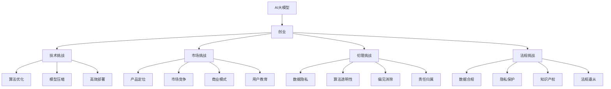

                 

# AI大模型创业：如何应对未来挑战？

> 关键词：AI大模型,创业,挑战,策略,创新

## 1. 背景介绍

### 1.1 问题由来

近年来，人工智能(AI)大模型的发展速度惊人，已经在多个领域展现了强大的应用潜力，包括自然语言处理(NLP)、计算机视觉、医疗健康、金融科技等。在NLP领域，基于深度学习的大语言模型如BERT、GPT系列等，已经在多项任务上取得了接近或超越人类的表现，甚至在某些特定任务上已展现出超越人的能力。

然而，AI大模型在走向实际应用的过程中，也面临着种种挑战。这些挑战主要来自于技术、市场、伦理、法规等多个方面。如何应对这些挑战，确保AI大模型能够安全、有效、可控地落地，成为创业者和AI公司需要重点关注的问题。本文将从技术、市场、伦理等多个角度，探讨AI大模型创业过程中可能遇到的挑战，并提出一些应对策略。

### 1.2 问题核心关键点

AI大模型的创业挑战主要包括以下几个方面：

- **技术挑战**：包括算法优化、模型压缩、硬件资源、高效部署等技术难题。
- **市场挑战**：涉及产品定位、市场竞争、商业模式、用户教育等市场策略问题。
- **伦理挑战**：数据隐私、算法透明性、偏见消除、责任归属等伦理难题。
- **法规挑战**：数据合规、隐私保护、知识产权、法规遵从等法律风险。

这些挑战彼此交织，需要创业团队具备全面的能力与技术储备。本文将围绕这些关键点，深入剖析AI大模型的创业挑战，并提出相应的策略与解决方案。

## 2. 核心概念与联系

### 2.1 核心概念概述

为了更好地理解AI大模型创业面临的挑战，本节将介绍几个密切相关的核心概念：

- **AI大模型**：指通过大规模数据训练获得的深度神经网络模型，具有强大的泛化能力和表示学习能力。
- **创业**：指创业者或团队从零开始，探索新的商业机会，开发新产品或服务，并以此获取市场认可和商业回报的过程。
- **挑战**：指在AI大模型创业过程中，创业者可能遇到的各类难题和障碍。
- **策略**：指针对特定挑战，创业者制定的解决思路和行动计划。
- **创新**：指在解决挑战的过程中，创业者所采取的独特方法或理念，用以提升产品竞争力。

这些概念之间的逻辑关系可以通过以下Mermaid流程图来展示：



这个流程图展示了大模型创业的核心概念及其之间的关系：

1. AI大模型通过技术手段不断优化和演进，是创业的基础。
2. 创业过程涉及技术、市场、伦理和法规等多方面的挑战。
3. 针对不同挑战，需采取对应的技术优化、市场策略、伦理思考和法规遵循等策略。
4. 创新是贯穿于各个策略中的关键元素，推动着创业的持续进步和市场竞争力的提升。

## 3. 核心算法原理 & 具体操作步骤

### 3.1 算法原理概述

AI大模型的核心算法包括深度学习模型（如卷积神经网络、循环神经网络、Transformer等）和优化算法（如梯度下降、Adam等）。这些算法原理和技术架构的合理运用，是创业过程中不可或缺的。

1. **深度学习模型**：通过多层神经网络结构，利用大量数据进行训练，学习到复杂的模式和规律。
2. **优化算法**：用于调整模型参数，使得模型输出能够最小化损失函数，达到最佳性能。

### 3.2 算法步骤详解

AI大模型的创业过程中，算法步骤主要包括以下几个关键环节：

1. **数据收集与预处理**：
   - 收集与任务相关的数据集，并进行数据清洗、标注等预处理。
   - 对数据进行分布式存储和计算，优化数据读取和处理效率。

2. **模型架构设计**：
   - 选择合适的深度学习模型架构，如卷积神经网络、循环神经网络、Transformer等。
   - 设计合适的模型超参数，如学习率、批大小、层数等。

3. **模型训练与优化**：
   - 使用优化算法对模型进行训练，最小化损失函数。
   - 应用正则化技术（如L2正则、Dropout），防止过拟合。
   - 使用梯度积累、混合精度训练等技术优化训练效率。

4. **模型评估与调整**：
   - 使用验证集对模型进行评估，选择合适的性能指标。
   - 根据评估结果调整模型架构和超参数，提升模型性能。

5. **模型部署与优化**：
   - 将训练好的模型部署到生产环境中，如服务器、云平台等。
   - 使用模型压缩、量化加速等技术，提升模型推理速度和资源利用率。

### 3.3 算法优缺点

AI大模型的算法在创业过程中，存在以下优缺点：

**优点**：
- **强大的泛化能力**：深度学习模型在大量数据上训练后，能够学习到复杂的模式和规律，适用于多种场景。
- **高效的模型压缩和部署**：通过模型压缩、量化等技术，可以有效降低模型资源占用，提升推理速度。
- **丰富的优化算法**：优化算法不断演进，提供了多种选择，适用于不同场景和需求。

**缺点**：
- **数据依赖性强**：深度学习模型的性能高度依赖于数据的质量和多样性，获取高质量数据成本高。
- **计算资源需求大**：深度学习模型通常需要强大的计算资源进行训练和推理，硬件成本高。
- **模型可解释性差**：深度学习模型往往被视为"黑盒"系统，难以解释其内部工作机制和决策逻辑。

### 3.4 算法应用领域

AI大模型的算法原理和技术架构，在多个领域得到了广泛应用，如：

- **自然语言处理**：包括文本分类、情感分析、机器翻译、问答系统等。
- **计算机视觉**：包括图像分类、目标检测、图像生成等。
- **医疗健康**：包括疾病诊断、基因分析、影像识别等。
- **金融科技**：包括信用评分、欺诈检测、投资分析等。
- **智能制造**：包括质量检测、工艺优化、供应链管理等。

## 4. 数学模型和公式 & 详细讲解 & 举例说明

### 4.1 数学模型构建

为了更好地理解AI大模型的算法原理，本节将介绍几个核心数学模型：

- **神经网络模型**：通过多层神经网络结构，将输入数据映射到输出数据。
- **损失函数**：用于衡量模型预测输出与真实标签之间的差异，如均方误差、交叉熵等。
- **优化算法**：如梯度下降、Adam等，用于调整模型参数，最小化损失函数。

### 4.2 公式推导过程

以下是几个核心数学公式的推导过程：

1. **神经网络模型**：
   - **输入层**：$x_1, x_2, \ldots, x_n$
   - **隐藏层**：$h_1, h_2, \ldots, h_m$
   - **输出层**：$y_1, y_2, \ldots, y_k$
   - 其中，$h_i = \sigma(W_ix_i + b_i)$，$\sigma$为激活函数，$W_i$为权重矩阵，$b_i$为偏置向量。
   - 输出层：$y_j = \tilde{W}_jh_i + \tilde{b}_j$

2. **均方误差损失函数**：
   $$
   L_{mse} = \frac{1}{N}\sum_{i=1}^N (y_i - \hat{y}_i)^2
   $$

3. **交叉熵损失函数**：
   $$
   L_{ce} = -\frac{1}{N}\sum_{i=1}^N(y_i\log\hat{y}_i + (1-y_i)\log(1-\hat{y}_i))
   $$

### 4.3 案例分析与讲解

以图像分类为例，分析使用深度学习模型进行图像分类的过程：

1. **数据准备**：
   - 收集包含不同类别的图像数据集，并进行预处理，如归一化、扩充样本等。

2. **模型构建**：
   - 选择卷积神经网络（CNN）作为深度学习模型架构。
   - 设计多层次卷积、池化、激活等操作。
   - 设定合适的超参数，如学习率、批大小、迭代次数等。

3. **模型训练**：
   - 使用均方误差或交叉熵损失函数，对模型进行训练。
   - 使用优化算法（如Adam）调整模型参数，最小化损失函数。

4. **模型评估**：
   - 在验证集上评估模型性能，如准确率、召回率、F1值等。
   - 根据评估结果调整模型架构和超参数，提升模型性能。

## 5. 项目实践：代码实例和详细解释说明

### 5.1 开发环境搭建

在进行AI大模型创业实践前，我们需要准备好开发环境。以下是使用Python进行PyTorch开发的环境配置流程：

1. 安装Anaconda：从官网下载并安装Anaconda，用于创建独立的Python环境。

2. 创建并激活虚拟环境：
   ```bash
   conda create -n pytorch-env python=3.8 
   conda activate pytorch-env
   ```

3. 安装PyTorch：根据CUDA版本，从官网获取对应的安装命令。例如：
   ```bash
   conda install pytorch torchvision torchaudio cudatoolkit=11.1 -c pytorch -c conda-forge
   ```

4. 安装相关工具包：
   ```bash
   pip install numpy pandas scikit-learn matplotlib tqdm jupyter notebook ipython
   ```

完成上述步骤后，即可在`pytorch-env`环境中开始创业实践。

### 5.2 源代码详细实现

以下是一个简单的图像分类项目的PyTorch代码实现：

```python
import torch
import torch.nn as nn
import torchvision
import torchvision.transforms as transforms
from torch.utils.data import DataLoader
from torchvision.datasets import CIFAR10

# 定义数据预处理函数
transform = transforms.Compose([
    transforms.ToTensor(),
    transforms.Normalize((0.5, 0.5, 0.5), (0.5, 0.5, 0.5))
])

# 加载CIFAR10数据集
train_dataset = CIFAR10(root='data', train=True, download=True, transform=transform)
test_dataset = CIFAR10(root='data', train=False, download=True, transform=transform)

# 定义模型
model = nn.Sequential(
    nn.Conv2d(3, 6, 5),
    nn.ReLU(),
    nn.MaxPool2d(2),
    nn.Conv2d(6, 16, 5),
    nn.ReLU(),
    nn.MaxPool2d(2),
    nn.Linear(16*5*5, 120),
    nn.ReLU(),
    nn.Linear(120, 84),
    nn.ReLU(),
    nn.Linear(84, 10)
)

# 定义损失函数和优化器
criterion = nn.CrossEntropyLoss()
optimizer = torch.optim.Adam(model.parameters(), lr=0.001)

# 训练模型
for epoch in range(10):
    train_loss = 0.0
    train_correct = 0
    for inputs, labels in DataLoader(train_dataset, batch_size=32, shuffle=True):
        optimizer.zero_grad()
        outputs = model(inputs)
        loss = criterion(outputs, labels)
        loss.backward()
        optimizer.step()
        train_loss += loss.item()
        train_correct += (outputs.argmax(1) == labels).sum().item()
    print(f'Epoch {epoch+1}, train loss: {train_loss/len(train_dataset)}, train acc: {train_correct/len(train_dataset)}')

# 测试模型
correct = 0
total = 0
with torch.no_grad():
    for inputs, labels in DataLoader(test_dataset, batch_size=32):
        outputs = model(inputs)
        _, predicted = torch.max(outputs.data, 1)
        total += labels.size(0)
        correct += (predicted == labels).sum().item()
print(f'Test acc: {correct/total}')
```

### 5.3 代码解读与分析

让我们再详细解读一下关键代码的实现细节：

**transform函数**：
- 定义数据预处理函数，包括将图像转换为Tensor格式，并进行归一化处理。

**CIFAR10数据集**：
- 使用PyTorch的CIFAR10数据集，加载训练集和测试集。
- 数据集下载和预处理通过预定义的transform函数完成。

**模型定义**：
- 使用Sequential模型定义卷积神经网络，包含多个卷积、池化、激活等操作。
- 输出层为线性层，用于分类预测。

**损失函数和优化器**：
- 定义交叉熵损失函数和Adam优化器。

**模型训练**：
- 在训练集上循环迭代，每次迭代中前向传播计算损失函数，反向传播更新模型参数。
- 记录每个epoch的损失和准确率。

**模型测试**：
- 在测试集上计算模型的准确率。

## 6. 实际应用场景

### 6.1 医疗健康

在医疗健康领域，AI大模型可以应用于疾病诊断、基因分析、影像识别等多个方面。例如，利用深度学习模型对医学影像进行分类和标注，可以显著提高诊断效率和准确性。通过大模型微调，可以快速适应新的疾病特征和影像数据，提升模型的诊断性能。

**案例**：
- **影像识别**：使用卷积神经网络对CT、MRI等医学影像进行分类，如识别肿瘤、骨折等疾病。通过在大量医学影像上预训练和微调模型，可以提升影像识别的准确率。

### 6.2 智能制造

在智能制造领域，AI大模型可以应用于质量检测、工艺优化、供应链管理等环节。通过深度学习模型对生产数据进行分析，可以发现潜在的生产问题，优化生产工艺，提高产品质量和生产效率。

**案例**：
- **质量检测**：使用卷积神经网络对生产过程中的图像数据进行分析，如检测产品表面缺陷、检测设备运行状态等。通过在大量生产数据上预训练和微调模型，可以提升质量检测的准确率和效率。

### 6.3 智能客服

在智能客服领域，AI大模型可以应用于智能问答、语音识别、情感分析等多个方面。通过深度学习模型对客户咨询进行自然语言处理和理解，可以提供更准确、快速的客户服务。

**案例**：
- **智能问答**：使用Transformer模型对客户问题进行理解和分类，匹配最合适的答案模板进行回复。通过在大量客户咨询数据上预训练和微调模型，可以提升智能问答的准确率和客户满意度。

### 6.4 未来应用展望

随着AI大模型的不断发展和应用，未来的AI创业将面临更多的机遇和挑战。

- **智能家居**：AI大模型可以应用于智能家居设备的语音控制、场景识别等，提升用户的生活便利性和舒适度。
- **智能交通**：AI大模型可以应用于自动驾驶、交通流量预测、智能停车等领域，提升交通管理的智能化水平。
- **智慧城市**：AI大模型可以应用于城市事件监测、舆情分析、应急指挥等领域，提高城市管理的自动化和智能化水平。

## 7. 工具和资源推荐

### 7.1 学习资源推荐

为了帮助创业者掌握AI大模型的相关技术和应用，这里推荐一些优质的学习资源：

1. **深度学习课程**：斯坦福大学的CS231n《深度学习在计算机视觉中的应用》课程，涵盖了深度学习的基本概念和经典模型。
2. **自然语言处理课程**：斯坦福大学的CS224N《深度学习自然语言处理》课程，详细介绍了NLP领域的基本概念和经典模型。
3. **开源项目和框架**：GitHub上的开源项目，如TensorFlow、PyTorch等，提供了丰富的资源和样例代码。
4. **书籍**：《深度学习》（Goodfellow等著）、《Python深度学习》（Francois等著）等经典书籍，详细介绍了深度学习的基本原理和实践技巧。

### 7.2 开发工具推荐

高效的开发离不开优秀的工具支持。以下是几款用于AI大模型创业开发的常用工具：

1. **PyTorch**：基于Python的开源深度学习框架，灵活动态的计算图，适合快速迭代研究。
2. **TensorFlow**：由Google主导开发的开源深度学习框架，生产部署方便，适合大规模工程应用。
3. **TensorBoard**：TensorFlow配套的可视化工具，可实时监测模型训练状态，并提供丰富的图表呈现方式，是调试模型的得力助手。
4. **Weights & Biases**：模型训练的实验跟踪工具，可以记录和可视化模型训练过程中的各项指标，方便对比和调优。
5. **Jupyter Notebook**：免费的交互式开发环境，支持Python、R等多种语言，方便快速迭代实验。

### 7.3 相关论文推荐

AI大模型的发展和创业，离不开学界的持续研究。以下是几篇奠基性的相关论文，推荐阅读：

1. **ImageNet Classification with Deep Convolutional Neural Networks**：AlexNet论文，标志着深度学习在图像识别领域的应用。
2. **Neural Machine Translation by Jointly Learning to Align and Translate**：Seq2Seq模型的经典论文，提出了基于神经网络的机器翻译方法。
3. **Attention is All You Need**：Transformer论文，提出了基于自注意力机制的Transformer模型，开启了NLP领域的预训练大模型时代。

## 8. 总结：未来发展趋势与挑战

### 8.1 总结

本文对AI大模型创业过程中可能遇到的挑战进行了全面系统的介绍，并提出了一系列应对策略。通过深入剖析技术、市场、伦理、法规等多个方面的挑战，我们明确了AI大模型创业的复杂性和多维度性。同时，本文详细讲解了AI大模型的算法原理和技术架构，提供了代码实现和解释分析，旨在为创业者提供全面的技术指导。

通过本文的系统梳理，可以看到，AI大模型创业涉及的技术和应用领域广泛，挑战复杂多样。创业者需要具备全面的技术储备和市场洞察能力，才能在竞争激烈的AI行业中脱颖而出。相信随着技术的不断发展和应用，AI大模型将进一步拓展其应用边界，为创业者和AI公司提供更多机遇和挑战。

### 8.2 未来发展趋势

展望未来，AI大模型的创业将呈现以下几个发展趋势：

1. **技术演进**：AI大模型将不断优化和演进，提升算法的效率和性能，降低硬件成本，提升模型的可解释性和可靠性。
2. **市场拓展**：AI大模型将进一步拓展应用场景，覆盖更多垂直行业，形成跨行业、跨领域的广泛应用。
3. **伦理规范**：AI大模型将进一步加强伦理规范，确保数据隐私、算法透明性和公平性，提升社会信任度。
4. **法规遵从**：AI大模型将进一步强化法规遵从，确保数据合规、知识产权保护，避免法律风险。

### 8.3 面临的挑战

尽管AI大模型在创业过程中展现了巨大的潜力和优势，但在发展过程中也面临诸多挑战：

1. **技术挑战**：算法优化、模型压缩、硬件资源、高效部署等技术难题仍需不断攻克。
2. **市场挑战**：产品定位、市场竞争、商业模式、用户教育等市场策略问题需要深入思考。
3. **伦理挑战**：数据隐私、算法透明性、偏见消除、责任归属等伦理难题需要全面考虑。
4. **法规挑战**：数据合规、隐私保护、知识产权、法规遵从等法律风险需要充分准备。

### 8.4 研究展望

未来，AI大模型创业需要在技术、市场、伦理、法规等多个方面进行深入研究，具体包括：

1. **技术创新**：不断探索新的算法和模型架构，提升模型的效率和性能，降低硬件成本，提高可解释性和可靠性。
2. **市场开拓**：深入研究不同行业和应用场景，形成有竞争力的产品定位和商业模式，推动市场开拓。
3. **伦理建设**：加强数据隐私保护、算法透明性、偏见消除、责任归属等方面的研究，提升伦理规范水平。
4. **法规遵从**：加强数据合规、隐私保护、知识产权、法规遵从等方面的研究，确保业务合法合规。

只有全面应对这些挑战，AI大模型创业才能走向成熟，实现可持续发展，为人类社会带来更多福祉。

## 9. 附录：常见问题与解答

**Q1：如何选择合适的预训练模型？**

A: 选择合适的预训练模型需要考虑任务类型、数据量、计算资源等因素。例如，对于图像识别任务，可以选择VGG、ResNet等预训练模型；对于自然语言处理任务，可以选择BERT、GPT系列等预训练模型。同时，可以考虑模型大小和计算资源，选择合适的模型架构和参数。

**Q2：如何进行模型微调？**

A: 模型微调通常包括数据准备、模型定义、损失函数和优化器设计、训练和测试等步骤。需要根据具体任务和数据特点进行优化，如使用学习率调度、正则化技术、数据增强等方法。

**Q3：如何提升模型性能？**

A: 提升模型性能可以从多个方面入手，如改进模型架构、调整超参数、优化算法、数据增强、对抗训练等。需要根据具体任务和模型性能进行综合优化。

**Q4：如何评估模型性能？**

A: 模型性能评估通常包括精度、召回率、F1值、ROC曲线等指标。需要根据具体任务和数据特点选择合适的评估指标，并进行模型验证和测试。

**Q5：如何应对模型泛化能力不足的问题？**

A: 可以通过数据增强、对抗训练、迁移学习等方法提升模型的泛化能力。需要根据具体任务和数据特点进行综合优化，确保模型在不同场景下表现稳定。

---

作者：禅与计算机程序设计艺术 / Zen and the Art of Computer Programming

