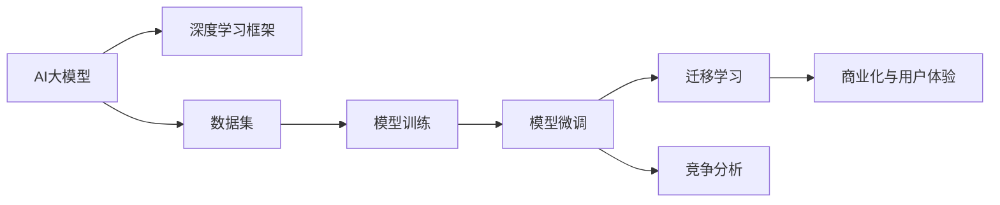

                 

# AI大模型创业：如何应对未来竞争对手？

> 关键词：AI创业,大模型,技术竞争,商业策略,竞争分析

## 1. 背景介绍

在人工智能快速发展的当下，大模型（如GPT-3、BERT等）成为了各大科技公司竞相追逐的焦点。这些模型凭借强大的计算能力和知识储备，在文本生成、语言理解、问答系统等诸多领域展现了惊人的潜力，并已开始逐步应用于商业化产品中。AI大模型的创业机会无疑吸引了众多科技公司和创业团队的关注，但如何在竞争中脱颖而出，构建竞争优势，是每个AI创业者必须深思熟虑的问题。本文将围绕大模型创业的核心概念与联系、核心算法原理、实际应用场景等方面，从技术、商业和战略的多个角度，提出全面的竞争应对策略。

## 2. 核心概念与联系

### 2.1 核心概念概述

- **AI大模型**：指使用大规模数据集训练而成的深度学习模型，具有强大的通用语言理解和生成能力。大模型如GPT-3、BERT等，通常具有数十亿甚至上百亿的参数，广泛应用于文本生成、语言理解、情感分析等NLP任务中。

- **深度学习与大模型**：深度学习框架如TensorFlow、PyTorch等，提供了高效训练大模型的工具和算法，使大模型的训练和微调成为可能。

- **模型微调与迁移学习**：微调是指在大模型的基础上，使用下游任务的少量标注数据进行有监督学习，以提升模型在特定任务上的性能。迁移学习则是指通过在大模型上进行预训练，然后在下游任务上进行微调，以利用大模型学到的通用知识。

- **竞争分析**：分析竞争对手的优势和劣势，明确自身的市场定位和竞争策略，指导AI大模型创业的战略规划。

- **商业化与用户体验**：在大模型技术成熟的基础上，将其转化为商业应用，提升用户体验，实现商业价值的最大化。

### 2.2 核心概念原理和架构的 Mermaid 流程图



此流程图展示了AI大模型从数据集训练到商业化应用的完整流程，并涉及模型微调和竞争分析等关键环节。

## 3. 核心算法原理 & 具体操作步骤

### 3.1 算法原理概述

AI大模型的核心算法原理包括深度学习算法、自监督预训练和有监督微调。具体来说：

- **深度学习算法**：利用多层神经网络对数据进行建模，学习数据的复杂非线性关系，以提取数据的高级特征。
- **自监督预训练**：使用大规模无标签数据对模型进行预训练，使其自学习到语言的通用表示。
- **有监督微调**：在特定任务上，使用少量的标注数据进行有监督学习，进一步优化模型性能，使其适应新任务。

### 3.2 算法步骤详解

#### 3.2.1 数据准备

- **收集数据**：根据目标任务收集足够量的数据，确保数据的多样性和代表性。
- **数据预处理**：清洗、标记、分词等处理，以便后续模型的训练。
- **数据划分**：将数据集划分为训练集、验证集和测试集。

#### 3.2.2 模型构建

- **选择模型**：根据任务类型选择合适的预训练模型，如BERT、GPT等。
- **构建微调层**：设计适合目标任务的微调层，如分类层、解码器等。
- **定义损失函数**：选择合适的损失函数，如交叉熵损失、均方误差损失等。

#### 3.2.3 模型训练

- **优化器选择**：选择合适的优化器，如Adam、SGD等，并设置学习率、批大小等超参数。
- **模型训练**：使用训练集数据进行模型训练，通过前向传播和反向传播更新模型参数。
- **模型评估**：在验证集上评估模型性能，确保模型未出现过拟合。

#### 3.2.4 模型微调

- **微调数据集**：根据目标任务，收集并标注相应的数据集。
- **微调模型**：在预训练模型上进行微调，调整模型参数以适应新任务。
- **模型测试**：在测试集上测试微调后的模型，评估模型性能。

### 3.3 算法优缺点

#### 3.3.1 优点

- **高效性**：在少量标注数据下，即可快速提升模型性能。
- **通用性**：适用于多种NLP任务，如分类、生成、匹配等。
- **参数高效**：通过参数高效微调（PEFT）技术，可以在固定大部分预训练参数的情况下，实现微调，避免过拟合。

#### 3.3.2 缺点

- **数据依赖**：微调的效果依赖于标注数据的质量和数量，高质量标注数据的获取成本较高。
- **迁移能力有限**：当目标任务与预训练数据的分布差异较大时，微调的性能提升有限。
- **可解释性不足**：微调模型的决策过程通常缺乏可解释性，难以对其推理逻辑进行分析和调试。

### 3.4 算法应用领域

AI大模型已经在文本生成、语言理解、情感分析、问答系统等多个领域展现出强大潜力，被广泛应用于商业化产品中。例如：

- **智能客服**：使用大模型进行自动问答，提升客户咨询体验。
- **金融分析**：使用大模型进行新闻和报告分析，辅助投资决策。
- **医疗诊断**：使用大模型进行医学文本分析，辅助医生诊断。
- **内容生成**：使用大模型生成新闻报道、广告文案等高质量内容。

## 4. 数学模型和公式 & 详细讲解 & 举例说明

### 4.1 数学模型构建

假设预训练模型为 $M_{\theta}$，其输入为 $x$，输出为 $y$。下游任务 $T$ 的目标是最小化损失函数 $\mathcal{L}(M_{\theta}, T)$。常见的损失函数包括交叉熵损失 $\ell(x, y) = -\log \hat{y}_i$，其中 $\hat{y}_i$ 为模型对输入 $x$ 预测为 $y$ 的概率。

### 4.2 公式推导过程

对于二分类任务，假设模型输出为 $\hat{y} = \sigma(W^Tx + b)$，其中 $W$ 为权重矩阵，$b$ 为偏置项，$\sigma$ 为激活函数。损失函数为交叉熵损失：

$$
\mathcal{L}(\theta) = -\frac{1}{N} \sum_{i=1}^N [y_i\log \hat{y}_i + (1-y_i)\log (1-\hat{y}_i)]
$$

梯度更新公式为：

$$
\theta \leftarrow \theta - \eta \nabla_{\theta}\mathcal{L}(\theta)
$$

其中 $\eta$ 为学习率。

### 4.3 案例分析与讲解

以文本分类任务为例，假设模型 $M_{\theta}$ 的输出为 $\hat{y} = \sigma(W^Tx + b)$，其中 $x$ 为输入文本，$y$ 为分类标签。

- **损失函数**：使用交叉熵损失 $\ell(x, y) = -\log \hat{y}_i$，其中 $y_i$ 为真实标签，$\hat{y}_i$ 为模型预测的概率。
- **模型训练**：在训练集上，使用随机梯度下降（SGD）等优化算法，更新模型参数 $\theta$。
- **模型微调**：在目标任务上，使用少量标注数据进行微调，调整模型参数以适应新任务。

## 5. 项目实践：代码实例和详细解释说明

### 5.1 开发环境搭建

- **Python环境**：安装Anaconda，创建虚拟环境。
- **深度学习框架**：安装TensorFlow或PyTorch，选择适合的大模型如BERT。
- **数据处理工具**：安装Pandas、NumPy、Scikit-learn等数据处理工具。

### 5.2 源代码详细实现

```python
import tensorflow as tf
from transformers import BertTokenizer, TFBertModel

# 加载数据集
train_data, valid_data, test_data = load_data()

# 定义模型
tokenizer = BertTokenizer.from_pretrained('bert-base-uncased')
model = TFBertModel.from_pretrained('bert-base-uncased', num_labels=2)

# 定义损失函数
def loss_fn(logits, labels):
    return tf.keras.losses.sparse_categorical_crossentropy(labels, logits)

# 定义优化器
optimizer = tf.keras.optimizers.Adam()

# 模型训练
for epoch in range(num_epochs):
    for batch in train_data:
        inputs = tokenizer(batch, padding=True, truncation=True, return_tensors='tf')
        with tf.GradientTape() as tape:
            logits = model(inputs['input_ids'], attention_mask=inputs['attention_mask'])
            loss = loss_fn(logits, inputs['label'])
        gradients = tape.gradient(loss, model.trainable_variables)
        optimizer.apply_gradients(zip(gradients, model.trainable_variables))

# 模型微调
train_data = load_train_data()
valid_data = load_valid_data()
test_data = load_test_data()

tokenizer = BertTokenizer.from_pretrained('bert-base-uncased')
model = TFBertModel.from_pretrained('bert-base-uncased', num_labels=2)

# 定义损失函数
def loss_fn(logits, labels):
    return tf.keras.losses.sparse_categorical_crossentropy(labels, logits)

# 定义优化器
optimizer = tf.keras.optimizers.Adam()

# 模型微调
for epoch in range(num_epochs):
    for batch in train_data:
        inputs = tokenizer(batch, padding=True, truncation=True, return_tensors='tf')
        with tf.GradientTape() as tape:
            logits = model(inputs['input_ids'], attention_mask=inputs['attention_mask'])
            loss = loss_fn(logits, inputs['label'])
        gradients = tape.gradient(loss, model.trainable_variables)
        optimizer.apply_gradients(zip(gradients, model.trainable_variables))

# 模型测试
test_data = load_test_data()
tokenizer = BertTokenizer.from_pretrained('bert-base-uncased')
model = TFBertModel.from_pretrained('bert-base-uncased', num_labels=2)

# 定义损失函数
def loss_fn(logits, labels):
    return tf.keras.losses.sparse_categorical_crossentropy(labels, logits)

# 模型测试
for batch in test_data:
    inputs = tokenizer(batch, padding=True, truncation=True, return_tensors='tf')
    logits = model(inputs['input_ids'], attention_mask=inputs['attention_mask'])
    predictions = tf.argmax(logits, axis=1)
```

### 5.3 代码解读与分析

- **数据加载**：使用Pandas等工具加载和预处理数据。
- **模型定义**：使用Transformer库加载预训练模型，并定义模型层和损失函数。
- **模型训练**：使用TensorFlow框架，定义训练循环，使用随机梯度下降更新模型参数。
- **模型微调**：加载微调数据集，重复训练过程，调整模型参数以适应新任务。
- **模型测试**：在测试集上测试微调后的模型，评估模型性能。

## 6. 实际应用场景

### 6.1 智能客服

智能客服系统利用大模型进行自动问答，提升客户咨询体验。通过预训练模型进行自然语言理解和生成，再通过少量标注数据微调，构建知识图谱，实现多轮对话和复杂问题的解答。

### 6.2 金融分析

金融分析系统使用大模型进行新闻和报告分析，辅助投资决策。通过预训练模型进行文本分析和情感分析，再通过微调学习行业特定知识，提升分析精度。

### 6.3 医疗诊断

医疗诊断系统使用大模型进行医学文本分析，辅助医生诊断。通过预训练模型进行文本分类和实体抽取，再通过微调学习医学知识，提升诊断准确性。

### 6.4 内容生成

内容生成系统使用大模型生成新闻报道、广告文案等高质量内容。通过预训练模型进行文本生成和风格转换，再通过微调学习特定领域的语言风格，生成符合要求的内容。

## 7. 工具和资源推荐

### 7.1 学习资源推荐

- **深度学习框架**：TensorFlow、PyTorch等，提供高效训练深度学习模型的工具和算法。
- **预训练模型**：HuggingFace、Google AI等，提供多种预训练大模型和微调样例代码。
- **自然语言处理**：NLTK、SpaCy等，提供文本处理和语言分析工具。

### 7.2 开发工具推荐

- **深度学习框架**：TensorFlow、PyTorch等，提供高效训练深度学习模型的工具和算法。
- **数据处理工具**：Pandas、NumPy、Scikit-learn等，提供数据处理和分析工具。
- **模型可视化工具**：TensorBoard、Weights & Biases等，提供模型训练和推理过程的可视化工具。

### 7.3 相关论文推荐

- **深度学习模型**：Yann LeCun等，《深度学习》，详细介绍了深度学习模型的原理和应用。
- **自然语言处理**：Christopher D. Manning等，《自然语言处理综论》，介绍了NLP领域的关键技术和应用。
- **大模型微调**：Jonathan Raiman，《Parameter-Efficient Transfer Learning for NLP》，介绍了参数高效微调技术。

## 8. 总结：未来发展趋势与挑战

### 8.1 研究成果总结

AI大模型在文本生成、语言理解、情感分析等领域展现出强大的潜力，被广泛应用于商业化产品中。未来，大模型的应用场景将进一步拓展，涵盖更多垂直行业，如医疗、金融、教育等。

### 8.2 未来发展趋势

- **模型规模增大**：随着算力成本的下降和数据规模的扩张，预训练语言模型的参数量将进一步增大，提升模型的通用性和鲁棒性。
- **参数高效微调**：开发更多参数高效微调方法，避免过拟合，提高微调效率和模型效果。
- **多模态融合**：融合视觉、语音等多模态信息，提升模型的感知能力和理解力。
- **自监督学习**：利用无监督学习技术，进一步提升模型的泛化能力和迁移能力。

### 8.3 面临的挑战

- **数据获取和标注成本**：高质量标注数据的获取成本较高，数据稀缺性仍是技术瓶颈。
- **模型泛化能力**：当目标任务与预训练数据的分布差异较大时，模型的泛化能力有限。
- **模型鲁棒性和安全性**：模型可能存在偏见和有害信息，如何提升模型的鲁棒性和安全性仍需研究。
- **模型可解释性**：微调模型的决策过程缺乏可解释性，难以对其推理逻辑进行分析和调试。

### 8.4 研究展望

- **自监督学习**：利用无监督学习技术，进一步提升模型的泛化能力和迁移能力。
- **参数高效微调**：开发更多参数高效微调方法，避免过拟合，提高微调效率和模型效果。
- **多模态融合**：融合视觉、语音等多模态信息，提升模型的感知能力和理解力。
- **知识图谱和外部知识**：构建知识图谱，引入外部知识，提升模型的准确性和可靠性。

## 9. 附录：常见问题与解答

### Q1: AI大模型的优势和劣势是什么？

A: AI大模型的优势在于强大的通用语言理解和生成能力，能够在多种NLP任务上取得优异的性能。但劣势在于数据依赖性高，需要大量的标注数据，且模型较大，资源消耗高。

### Q2: 如何选择合适的预训练模型？

A: 根据目标任务选择合适的预训练模型，如BERT适用于分类任务，GPT适用于生成任务。如果目标任务与预训练模型的分布差异较大，需要进一步在特定领域语料上预训练。

### Q3: 如何进行参数高效微调？

A: 使用参数高效微调（PEFT）技术，只调整少量参数，以减小过拟合风险，提高微调效率。

### Q4: 如何缓解模型过拟合问题？

A: 数据增强、正则化、对抗训练、多模型集成等方法，可以缓解模型过拟合问题，提升模型泛化能力。

### Q5: 如何提高模型的鲁棒性和安全性？

A: 引入对抗样本训练、正则化、参数高效微调等方法，提高模型的鲁棒性。引入伦理导向的评估指标，避免模型输出有害信息，确保模型安全性。

---

作者：禅与计算机程序设计艺术 / Zen and the Art of Computer Programming

