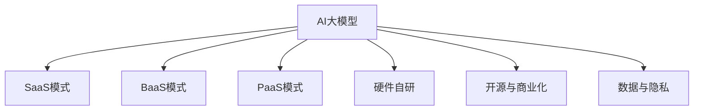
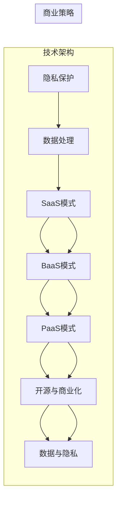

                 

## 1. 背景介绍

在人工智能迅速发展的背景下，AI大模型技术正成为各大科技公司、创业团队争相布局的核心赛道。从GPT-3到PaLM，从DALL·E到DALL·E 2，大模型技术在自然语言处理、计算机视觉、生成模型等领域已展现出了强大的能力。然而，构建AI大模型创业公司不仅仅是技术积累，更是商业模式、运营管理等多维度协同的结果。本文将从商业模式构建的视角，深入探讨如何打造一家可持续发展的AI大模型创业公司。

## 2. 核心概念与联系

### 2.1 核心概念概述

在探讨商业模式构建之前，我们先明确几个核心概念：

1. **AI大模型**：指利用大规模神经网络进行预训练，用于特定任务的高性能语言模型或视觉模型，例如GPT-3、DALL·E系列。
2. **SaaS模式**：软件即服务模式，通过提供API接口，用户可按需调用模型功能，按使用量付费。
3. **BaaS模式**：基于API的服务模式，提供模型训练、推理、模型优化等全方位服务，按服务时间收费。
4. **PaaS模式**：平台即服务模式，提供模型开发、部署、管理等一站式的服务，适合大型企业或团队。
5. **硬件自研**：自主研发或定制硬件，以优化模型性能，降低模型部署成本。
6. **开源与商业化**：开放源代码，吸引开发者社区贡献，同时提供商业版服务以获得收益。
7. **数据与隐私**：数据的收集与处理，隐私保护策略，与用户之间的隐私协议等。

这些概念之间相互关联，构成了AI大模型创业公司的核心商业模式框架。下图为这些核心概念之间的关系示意图：



### 2.2 核心概念原理和架构

核心概念之间通过一系列技术架构和商业逻辑相联系，形成了完整的AI大模型商业模式生态。以下对各核心概念进行详细解释：

1. **AI大模型**：基于大规模深度学习神经网络，通过自监督或监督预训练，获得通用的语言或视觉表示。大模型具有强大的泛化能力和应用潜力，能够处理各类自然语言处理、计算机视觉任务。

2. **SaaS模式**：用户无需购买或安装软件，通过API接口获取模型功能，按需调用。SaaS模式降低了使用门槛，提高了灵活性和可扩展性。

3. **BaaS模式**：提供完整的模型开发、训练、部署、优化等服务，适合需要深度定制和优化的大型企业或科研团队。BaaS模式强调服务深度和定制化。

4. **PaaS模式**：一站式模型开发、部署和管理平台，提供完整的模型生命周期管理。PaaS模式适合需要集成到已有系统中的企业。

5. **硬件自研**：自主研发专用硬件，如TPU、ASIC等，优化模型推理速度和内存使用，降低成本。硬件自研能够显著提升模型性能和部署效率。

6. **开源与商业化**：开放源代码以吸引开发者社区贡献，同时提供商业版服务以实现商业化运营。开源与商业化相结合，能够实现生态扩展和商业模式创新。

7. **数据与隐私**：确保数据合法合规处理，同时保护用户隐私。数据与隐私处理是大模型商业化过程中必须面对的重要问题。

这些核心概念之间的联系是通过一系列技术架构和商业策略实现的，如图：



## 3. 核心算法原理 & 具体操作步骤

### 3.1 算法原理概述

AI大模型的商业模式构建，涉及技术架构和商业策略两个方面。以下将详细阐述这些原理和操作步骤：

1. **技术架构**：包括模型训练与优化、推理引擎、API接口、管理平台、硬件加速、数据处理、隐私保护等技术实现。
2. **商业策略**：包括SaaS模式、BaaS模式、PaaS模式、开源与商业化、数据与隐私等商业策略选择与实施。

### 3.2 算法步骤详解

1. **模型训练与优化**：选择合适的神经网络架构和训练策略，在大量无标注数据上进行预训练，使用监督数据进行微调。优化目标包括模型精度、推理速度、内存使用等。

2. **推理引擎**：开发高效的推理引擎，实现模型的在线预测和推理。推理引擎应具备高吞吐量、低延迟、高精度等特点。

3. **API接口**：设计易用、高效的API接口，使用户能够方便地调用模型服务。API接口应具备良好的文档支持、错误处理机制。

4. **管理平台**：搭建一站式的管理平台，提供模型开发、部署、监控、优化等功能。管理平台应具备可视化界面、自动化运维、弹性伸缩等特性。

5. **硬件加速**：研发或定制硬件设备，优化模型推理性能。硬件加速设备包括TPU、ASIC、FPGA等。

6. **数据处理**：确保数据的合法合规处理，保护用户隐私。数据处理应包括数据收集、存储、清洗、匿名化等环节。

7. **商业策略选择与实施**：根据企业目标和用户需求，选择适合的商业策略，并制定详细的实施计划。

### 3.3 算法优缺点

AI大模型商业模式构建的优点包括：

- **灵活性与可扩展性**：通过SaaS模式，用户能够灵活选择服务，按需调用，减少了前期投入和维护成本。
- **服务深度与定制化**：BaaS模式提供全面的模型开发、训练、部署等服务，满足大型企业或科研团队的深度定制需求。
- **生态扩展与商业模式创新**：开源与商业化相结合，吸引开发者社区贡献，同时实现商业化运营，形成良性循环。

其缺点包括：

- **技术门槛高**：大模型的构建、训练、优化等环节需要高水平的科研团队，技术门槛较高。
- **成本投入大**：硬件自研、数据处理、隐私保护等环节需要大量的资金投入。
- **用户依赖性**：用户对API接口的依赖性强，服务中断或故障会影响用户体验。

### 3.4 算法应用领域

AI大模型商业模式构建广泛应用于以下领域：

1. **自然语言处理**：提供文本分类、情感分析、问答系统、摘要生成等服务，广泛应用于智能客服、舆情监测、智能推荐等场景。

2. **计算机视觉**：提供图像分类、目标检测、图像生成等服务，广泛应用于安防监控、智能驾驶、医疗影像分析等场景。

3. **语音识别与处理**：提供语音识别、语音合成、语义理解等服务，广泛应用于智能家居、智能语音助手等场景。

## 4. 数学模型和公式 & 详细讲解 & 举例说明

### 4.1 数学模型构建

AI大模型的数学模型构建涉及模型训练、推理、优化等多个环节。以下对各环节进行详细解释：

1. **模型训练**：基于大规模无标注数据进行预训练，使用监督数据进行微调。数学模型构建包括选择神经网络架构、设计损失函数、选择优化器等环节。

2. **推理引擎**：实现模型的在线预测和推理。推理引擎的数学模型构建包括设计高效的前向传播算法、选择合适的后向传播算法等。

3. **优化算法**：选择梯度下降、Adam等优化算法，设计学习率、批量大小等超参数。

### 4.2 公式推导过程

以Bert模型为例，其预训练和微调过程如下：

1. **预训练目标函数**：
   $$
   \mathcal{L}_{pretrain} = \frac{1}{2N}\sum_{i=1}^N \sum_{j=1}^N L_{KL}(x_i, x_j)
   $$
   其中 $L_{KL}$ 为KL散度损失函数，$x_i$ 和 $x_j$ 为从大规模无标注数据中随机抽取的样本。

2. **微调目标函数**：
   $$
   \mathcal{L}_{fine-tune} = \frac{1}{N}\sum_{i=1}^N \ell(M_{\theta}(x_i),y_i)
   $$
   其中 $\ell$ 为任务特定损失函数，$y_i$ 为标注数据中的标签。

3. **梯度计算**：
   $$
   \frac{\partial \mathcal{L}}{\partial \theta} = \frac{\partial \mathcal{L}_{pretrain}}{\partial \theta} + \frac{\partial \mathcal{L}_{fine-tune}}{\partial \theta}
   $$

### 4.3 案例分析与讲解

以文本分类为例，其数学模型构建和公式推导如下：

1. **数据准备**：将文本数据转化为模型输入序列，将标签转化为one-hot编码。
2. **模型输入**：将文本序列和标签向量输入模型。
3. **模型输出**：模型输出文本分类的概率分布，选择概率最大的类别作为预测结果。
4. **损失函数**：交叉熵损失函数。
5. **梯度计算**：使用反向传播算法计算梯度，更新模型参数。

## 5. 项目实践：代码实例和详细解释说明

### 5.1 开发环境搭建

以下是使用Python和PyTorch搭建AI大模型开发环境的详细步骤：

1. **安装Anaconda**：从官网下载并安装Anaconda，创建独立的Python环境。
2. **配置虚拟环境**：
   ```bash
   conda create -n env-name python=3.8
   conda activate env-name
   ```
3. **安装依赖包**：
   ```bash
   pip install torch torchvision torchaudio transformers
   ```

### 5.2 源代码详细实现

以下是使用PyTorch和Transformers库实现文本分类的代码示例：

1. **数据准备**：
   ```python
   from transformers import BertTokenizer
   from torch.utils.data import Dataset, DataLoader

   class TextDataset(Dataset):
       def __init__(self, texts, labels, tokenizer):
           self.texts = texts
           self.labels = labels
           self.tokenizer = tokenizer
           self.max_len = 128
       
       def __len__(self):
           return len(self.texts)
       
       def __getitem__(self, idx):
           idx = idx
           text = self.texts[idx]
           label = self.labels[idx]
   
           encoding = self.tokenizer(text, return_tensors='pt', max_length=self.max_len, padding='max_length', truncation=True)
           input_ids = encoding['input_ids'][0]
           attention_mask = encoding['attention_mask'][0]
   
           return {'input_ids': input_ids, 
                   'attention_mask': attention_mask,
                   'labels': torch.tensor(label, dtype=torch.long)}
   ```

2. **模型定义**：
   ```python
   from transformers import BertForSequenceClassification
   
   model = BertForSequenceClassification.from_pretrained('bert-base-cased', num_labels=2)
   ```

3. **训练与评估**：
   ```python
   from transformers import AdamW
   
   optimizer = AdamW(model.parameters(), lr=2e-5)
   
   device = torch.device('cuda') if torch.cuda.is_available() else torch.device('cpu')
   model.to(device)
   
   def train_epoch(model, dataset, batch_size, optimizer):
       dataloader = DataLoader(dataset, batch_size=batch_size, shuffle=True)
       model.train()
       epoch_loss = 0
       for batch in dataloader:
           input_ids = batch['input_ids'].to(device)
           attention_mask = batch['attention_mask'].to(device)
           labels = batch['labels'].to(device)
           model.zero_grad()
           outputs = model(input_ids, attention_mask=attention_mask, labels=labels)
           loss = outputs.loss
           epoch_loss += loss.item()
           loss.backward()
           optimizer.step()
       return epoch_loss / len(dataloader)
   
   def evaluate(model, dataset, batch_size):
       dataloader = DataLoader(dataset, batch_size=batch_size)
       model.eval()
       preds, labels = [], []
       with torch.no_grad():
           for batch in dataloader:
               input_ids = batch['input_ids'].to(device)
               attention_mask = batch['attention_mask'].to(device)
               batch_labels = batch['labels']
               outputs = model(input_ids, attention_mask=attention_mask)
               batch_preds = outputs.logits.argmax(dim=2).to('cpu').tolist()
               batch_labels = batch_labels.to('cpu').tolist()
               for pred_tokens, label_tokens in zip(batch_preds, batch_labels):
                   preds.append(pred_tokens[:len(label_tokens)])
                   labels.append(label_tokens)
               
       print(classification_report(labels, preds))
   ```

### 5.3 代码解读与分析

1. **数据处理**：通过`TextDataset`类，将文本和标签转化为模型输入。
2. **模型定义**：使用`BertForSequenceClassification`类定义文本分类模型。
3. **训练与评估**：定义训练和评估函数，使用`AdamW`优化器进行训练，并在验证集上评估模型性能。

## 6. 实际应用场景

### 6.1 智能客服系统

智能客服系统通过AI大模型提供自然语言处理能力，可7x24小时不间断服务，快速响应客户咨询，提供自然流畅的语言解答。系统构建流程如下：

1. **数据收集**：收集企业内部的历史客服对话记录，将问题和最佳答复构建成监督数据。
2. **模型微调**：使用上述监督数据对预训练模型进行微调，使其能够自动理解用户意图，匹配最合适的答案模板进行回复。
3. **系统集成**：将微调后的模型集成到智能客服系统中，实时处理用户咨询。

### 6.2 金融舆情监测

金融机构需要实时监测市场舆论动向，以快速应对负面信息传播。系统构建流程如下：

1. **数据收集**：收集金融领域相关的新闻、报道、评论等文本数据，并进行主题标注和情感标注。
2. **模型微调**：使用标注数据对预训练模型进行微调，使其能够自动判断文本属于何种主题，情感倾向是正面、中性还是负面。
3. **实时监测**：将微调后的模型应用到实时抓取的网络文本数据，自动监测不同主题下的情感变化趋势，并自动预警。

### 6.3 个性化推荐系统

个性化推荐系统通过AI大模型提供深度语义理解能力，能从文本内容中准确把握用户的兴趣点。系统构建流程如下：

1. **数据收集**：收集用户浏览、点击、评论、分享等行为数据，提取和用户交互的物品标题、描述、标签等文本内容。
2. **模型微调**：使用行为数据对预训练模型进行微调，使其能够从文本内容中准确把握用户的兴趣点。
3. **推荐生成**：将文本内容作为模型输入，由模型预测用户的兴趣匹配度，生成推荐列表。

## 7. 工具和资源推荐

### 7.1 学习资源推荐

以下是几本有助于掌握AI大模型商业模式的书籍，建议阅读：

1. **《深度学习》**：Ian Goodfellow著，深入浅出地介绍了深度学习的基本概念和应用。
2. **《机器学习实战》**：Peter Harrington著，结合实际项目，介绍了机器学习的基本流程和应用。
3. **《算法导论》**：Thomas H. Cormen等著，介绍了算法设计和分析的基本原理和应用。
4. **《人工智能：一种现代方法》**：Stuart Russell和Peter Norvig著，介绍了人工智能的基本概念和应用。

### 7.2 开发工具推荐

以下是几款用于AI大模型开发和运营的常用工具：

1. **PyTorch**：基于Python的开源深度学习框架，适合快速迭代研究。
2. **TensorFlow**：由Google主导开发的开源深度学习框架，适合大规模工程应用。
3. **Transformers**：HuggingFace开发的NLP工具库，支持多种预训练语言模型，适合快速开发和部署。
4. **Weights & Biases**：模型训练的实验跟踪工具，实时监测模型训练状态，提供丰富的图表呈现方式。
5. **TensorBoard**：TensorFlow配套的可视化工具，可实时监测模型训练状态，提供详细的图表和分析。

### 7.3 相关论文推荐

以下是几篇经典论文，建议阅读：

1. **《Attention is All You Need》**： Vaswani等著，提出了Transformer结构，开启了预训练大模型时代。
2. **《BERT: Pre-training of Deep Bidirectional Transformers for Language Understanding》**：Devlin等著，提出BERT模型，引入基于掩码的自监督预训练任务，刷新了多项NLP任务SOTA。
3. **《Language Models are Unsupervised Multitask Learners》**：Radford等著，展示了大规模语言模型的强大zero-shot学习能力。

## 8. 总结：未来发展趋势与挑战

### 8.1 研究成果总结

本文从商业模式构建的视角，深入探讨了AI大模型的构建与应用。以下对核心内容进行总结：

1. **技术架构**：包括模型训练与优化、推理引擎、API接口、管理平台、硬件加速、数据处理、隐私保护等技术实现。
2. **商业策略**：包括SaaS模式、BaaS模式、PaaS模式、开源与商业化、数据与隐私等商业策略选择与实施。

### 8.2 未来发展趋势

1. **技术创新**：AI大模型的训练与优化技术将不断进步，如参数高效微调、自适应学习等，提高模型性能和效率。
2. **应用场景拓展**：AI大模型将在更多垂直行业得到应用，如智慧医疗、智慧教育、智慧城市等。
3. **商业模式的创新**：AI大模型的商业模式将不断演进，如按使用量计费、按服务时间收费等新模式。
4. **生态系统的构建**：通过开源与商业化相结合，吸引开发者社区贡献，形成良性循环的生态系统。
5. **隐私保护的重视**：AI大模型将更加注重用户隐私保护，建立完善的隐私保护机制。

### 8.3 面临的挑战

1. **技术门槛高**：AI大模型的构建、训练、优化等环节需要高水平的科研团队，技术门槛较高。
2. **成本投入大**：硬件自研、数据处理、隐私保护等环节需要大量的资金投入。
3. **用户依赖性**：用户对API接口的依赖性强，服务中断或故障会影响用户体验。

### 8.4 研究展望

未来的研究需要在以下几个方面寻求新的突破：

1. **技术优化的提升**：优化模型训练与优化算法，提高模型精度和效率。
2. **应用场景的拓展**：探索更多垂直行业的AI大模型应用，提升应用价值。
3. **商业模式的创新**：探索新的商业合作模式，提升商业化运营效率。
4. **隐私保护的加强**：建立完善的隐私保护机制，确保用户隐私安全。
5. **生态系统的构建**：通过开源与商业化相结合，吸引开发者社区贡献，形成良性循环的生态系统。

## 9. 附录：常见问题与解答

### Q1：AI大模型的构建与运营需要哪些资源？

A: AI大模型的构建与运营需要以下资源：

1. **数据资源**：大规模无标注数据和有标注数据，用于模型预训练和微调。
2. **计算资源**：高性能GPU/TPU等硬件设备，用于模型训练和推理。
3. **人才资源**：高水平的科研团队，涵盖模型构建、训练、优化、部署等多个环节。
4. **资金资源**：高额的资金投入，用于模型开发、硬件购置、数据处理、隐私保护等环节。

### Q2：如何降低AI大模型的运营成本？

A: 降低AI大模型的运营成本可以从以下几个方面入手：

1. **模型优化**：优化模型架构，减少模型参数和计算量，降低硬件成本。
2. **软件优化**：优化软件代码，提高模型推理效率，降低时间和空间开销。
3. **云计算**：利用云计算资源，按需弹性扩展，降低硬件投入。
4. **开源与商业化**：开源模型代码，吸引开发者社区贡献，降低开发成本。

### Q3：AI大模型的商业化过程中需要注意哪些问题？

A: AI大模型的商业化过程中需要注意以下几个问题：

1. **数据合规**：确保数据的合法合规处理，遵守相关法律法规。
2. **用户隐私**：保护用户隐私，建立完善的隐私保护机制。
3. **模型安全性**：确保模型的安全性，避免恶意用途和攻击。
4. **生态系统**：构建完善的生态系统，吸引开发者社区贡献，提高用户黏性。
5. **商业化策略**：选择适合的商业化策略，如SaaS、BaaS、PaaS等，制定详细的实施计划。

作者：禅与计算机程序设计艺术 / Zen and the Art of Computer Programming

