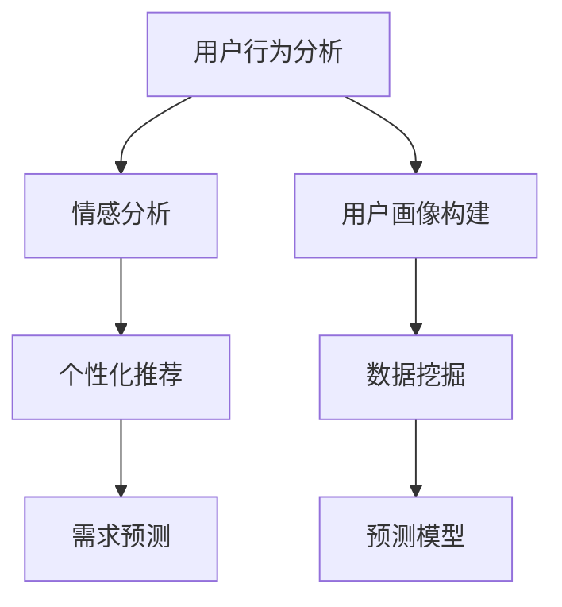

                 

# AI如何帮助电商企业更好地理解用户需求

> 关键词：用户需求理解, 人工智能, 数据分析, 自然语言处理(NLP), 推荐系统, 数据挖掘, 预测模型

## 1. 背景介绍

### 1.1 问题由来

随着电商行业的飞速发展，越来越多的企业投入到竞争激烈的市场中。为了获得用户青睐，企业需要深入了解和把握用户需求，以提供精准的商品推荐、个性化服务和更好的用户体验。然而，用户需求的多样性和复杂性，使得电商企业面临巨大的挑战。传统的调研和反馈机制往往耗时费力、成本高昂，且难以实时捕捉用户的即时反馈。

在技术进步的推动下，人工智能(AI)尤其是机器学习、自然语言处理(NLP)等技术为电商企业理解用户需求提供了新的方法和工具。AI技术能够快速处理海量数据，从用户的点击、浏览、评论等多个维度提取有价值的信息，帮助企业深入了解用户，优化运营决策，提高用户满意度和购买转化率。

### 1.2 问题核心关键点

电商企业面临的用户需求理解问题，可以通过以下几个核心关键点进行探讨：

- **用户行为分析**：通过追踪用户的点击、浏览、购买、评价等行为数据，了解用户的购买意向和偏好。
- **情感分析**：分析用户的评论和反馈，了解用户对商品、服务的满意度和情感倾向。
- **个性化推荐**：根据用户的浏览历史和行为数据，推荐符合用户偏好的商品和服务。
- **需求预测**：利用历史数据和AI模型，预测用户的未来需求和购买行为。
- **用户画像构建**：通过多维度数据融合，构建详尽的用户画像，以了解用户的特征和需求。

## 2. 核心概念与联系

### 2.1 核心概念概述

为更好地理解AI在电商企业用户需求理解中的应用，本节将介绍几个密切相关的核心概念：

- **人工智能(AI)**：利用计算机技术模拟人类智能，包括机器学习、深度学习、自然语言处理等技术，实现自动化决策、信息检索、语音识别等任务。
- **自然语言处理(NLP)**：使计算机理解、处理和生成自然语言的技术，包括文本分类、实体识别、情感分析、机器翻译等。
- **推荐系统**：通过分析用户行为和偏好，推荐符合用户兴趣的商品、内容和服务，提高用户满意度和转化率。
- **数据挖掘**：从大规模数据集中发现潜在的模式、规律和关联，用于市场分析、客户画像、需求预测等。
- **预测模型**：利用历史数据训练模型，预测未来事件的概率和趋势，包括时间序列预测、分类预测等。

这些核心概念之间的逻辑关系可以通过以下Mermaid流程图来展示：



这个流程图展示了一系列核心概念及其之间的关系：

1. 通过用户行为分析获取用户数据。
2. 情感分析从评论、反馈中提取用户的情感倾向。
3. 个性化推荐基于用户数据和情感分析结果，推荐符合用户偏好的商品。
4. 需求预测利用历史数据和预测模型，预测用户未来需求。
5. 用户画像构建通过数据挖掘技术，综合多维度数据，形成详尽的用户画像。

## 3. 核心算法原理 & 具体操作步骤

### 3.1 算法原理概述

AI在电商企业用户需求理解中的应用，主要通过以下几个核心算法实现：

- **自然语言处理(NLP)**：利用文本分类、情感分析等技术，从用户评论、反馈中提取情感信息。
- **推荐系统**：通过协同过滤、基于内容的推荐、矩阵分解等方法，推荐符合用户偏好的商品。
- **数据挖掘**：利用聚类、关联规则、时间序列分析等算法，从用户行为数据中发现潜在的规律和趋势。
- **预测模型**：利用回归、分类、时序预测等模型，预测用户未来行为和需求。

### 3.2 算法步骤详解

#### 3.2.1 用户行为分析

用户行为分析通常涉及以下几个步骤：

1. **数据收集**：通过用户行为跟踪、交易记录、网站访问日志等手段，收集用户数据。
2. **数据清洗**：对收集到的数据进行去重、过滤、归一化等处理，去除噪音和异常值。
3. **特征工程**：选择和构造关键特征，如用户ID、访问时长、点击次数、浏览路径等。
4. **模型训练**：利用机器学习模型（如决策树、随机森林、深度神经网络等）对用户行为进行建模。
5. **结果评估**：通过AUC、PR、F1-score等指标评估模型性能。

#### 3.2.2 情感分析

情感分析的目的是从用户评论、反馈中提取出情感信息。具体步骤如下：

1. **数据预处理**：对评论文本进行分词、去除停用词、词干提取等预处理。
2. **特征提取**：使用词袋模型、TF-IDF、词嵌入等方法提取特征。
3. **情感分类**：利用情感分类模型（如朴素贝叶斯、支持向量机、深度学习等）对评论情感进行分类。
4. **结果处理**：将分类结果转化为情感倾向（如正面、负面、中性）。

#### 3.2.3 个性化推荐

个性化推荐的核心在于构建用户和商品的关联矩阵，通过协同过滤、基于内容的推荐等算法实现。具体操作步骤如下：

1. **数据准备**：收集用户行为数据和商品信息。
2. **特征提取**：提取用户和商品的特征，如用户ID、商品ID、评分、评论等。
3. **模型训练**：利用协同过滤、基于内容的推荐、矩阵分解等算法训练推荐模型。
4. **结果生成**：基于用户特征和商品特征生成推荐列表。

#### 3.2.4 需求预测

需求预测的目标是通过历史数据和预测模型，预测用户未来的需求和行为。具体操作步骤如下：

1. **数据收集**：收集历史用户行为数据和事件记录。
2. **特征工程**：提取和构造关键特征，如时间戳、用户ID、事件类型等。
3. **模型训练**：利用回归、分类、时序预测等模型对用户需求进行预测。
4. **结果评估**：通过MAE、RMSE、准确率等指标评估预测性能。

#### 3.2.5 用户画像构建

用户画像构建需要从多个维度数据中提取和融合信息，形成详尽的用户画像。具体操作步骤如下：

1. **数据融合**：收集和整合来自不同渠道的数据，如用户行为数据、社交媒体数据、用户调查数据等。
2. **特征提取**：从融合后的数据中提取关键特征，如年龄、性别、地理位置、兴趣爱好等。
3. **画像生成**：利用聚类、降维等技术生成用户画像。
4. **结果验证**：通过A/B测试等方法验证用户画像的有效性。

### 3.3 算法优缺点

#### 3.3.1 用户行为分析

- **优点**：
  - 能实时捕捉用户行为变化，获取用户即时反馈。
  - 通过模型训练，可以发现用户行为中的隐含规律和趋势。
  - 可以用于优化商品布局、页面设计、用户体验等。

- **缺点**：
  - 数据收集和清洗需要耗费大量人力和成本。
  - 用户行为数据容易被篡改或伪装，影响分析结果的准确性。
  - 模型训练需要大量数据，存在过拟合的风险。

#### 3.3.2 情感分析

- **优点**：
  - 能快速获取用户情感倾向，帮助企业了解用户对商品和服务的满意度。
  - 可以通过情感分析改进商品质量和用户体验，提升用户满意度。

- **缺点**：
  - 情感分析结果容易受到用户主观情绪和表达风格的影响。
  - 需要处理海量文本数据，计算复杂度较高。
  - 需要高质量的标注数据，标注成本较高。

#### 3.3.3 个性化推荐

- **优点**：
  - 根据用户行为和偏好，提供个性化的商品推荐，提高用户购买转化率。
  - 可以大幅提升用户体验和满意度，增加用户粘性。

- **缺点**：
  - 推荐系统需要处理大量用户和商品数据，计算复杂度较高。
  - 需要平衡推荐准确性和多样性，避免推荐过度。
  - 冷启动问题难以解决，新用户没有足够行为数据时，难以进行有效推荐。

#### 3.3.4 需求预测

- **优点**：
  - 通过预测用户需求，优化库存管理、商品备货，提升运营效率。
  - 可以预测市场趋势，提前做好准备，降低风险。

- **缺点**：
  - 需求预测模型存在不确定性，预测结果可能与实际需求有偏差。
  - 需要处理时间序列数据，存在时序效应。
  - 模型训练和预测需要消耗大量计算资源。

#### 3.3.5 用户画像构建

- **优点**：
  - 通过用户画像，全面了解用户特征和需求，制定针对性的营销策略。
  - 可以用于细分市场、个性化推荐、广告投放等。

- **缺点**：
  - 数据融合和特征提取需要大量时间和资源。
  - 用户画像需要不断更新，动态维护成本较高。
  - 用户画像存在隐私风险，需要严格保护用户数据。

### 3.4 算法应用领域

#### 3.4.1 用户行为分析

用户行为分析在电商企业中应用广泛，主要包括：

- **商品推荐**：通过用户行为数据，推荐符合用户兴趣的商品。
- **页面优化**：优化商品页面设计，提升用户体验。
- **用户流失预警**：识别高流失风险用户，及时采取措施。

#### 3.4.2 情感分析

情感分析在电商企业中的应用包括：

- **用户满意度监测**：通过情感分析了解用户对商品和服务的满意度，及时改进。
- **品牌形象塑造**：利用情感分析，识别品牌口碑和负面评论，优化品牌形象。
- **舆情监控**：监控社交媒体和论坛上的用户反馈，及时回应负面舆情。

#### 3.4.3 个性化推荐

个性化推荐在电商企业中具有重要应用价值，包括：

- **商品推荐**：推荐符合用户偏好的商品，提升用户购买转化率。
- **内容推荐**：推荐符合用户兴趣的文章、视频等。
- **活动推荐**：推荐符合用户偏好的促销活动。

#### 3.4.4 需求预测

需求预测在电商企业中的应用包括：

- **库存管理**：预测商品需求，优化库存水平，降低库存成本。
- **市场预测**：预测市场需求变化，制定市场策略。
- **价格优化**：预测市场需求，制定动态定价策略。

#### 3.4.5 用户画像构建

用户画像构建在电商企业中的应用包括：

- **用户细分**：根据用户画像，细分市场，制定针对性的营销策略。
- **个性化服务**：提供个性化的商品推荐、广告投放等。
- **客户管理**：构建详尽的客户画像，提升客户满意度。

## 4. 数学模型和公式 & 详细讲解 & 举例说明

### 4.1 数学模型构建

为更好地理解AI在电商企业中的应用，本节将使用数学语言对相关模型进行更加严格的刻画。

假设电商企业有用户行为数据 $D=\{(x_i,y_i)\}_{i=1}^N, x_i \in \mathbb{R}^d, y_i \in \mathbb{R}$，其中 $x_i$ 为用户的输入特征，$y_i$ 为用户的输出标签。我们希望建立一个预测模型 $M_{\theta}(x_i) \in \mathbb{R}$，其中 $\theta$ 为模型的参数。

我们的目标是找到最优参数 $\theta^*$，使得模型在训练集 $D$ 上的损失函数 $\mathcal{L}(\theta)$ 最小化。常见的损失函数包括均方误差损失、交叉熵损失等。

形式化地，我们希望最小化如下经验风险：

$$
\theta^* = \mathop{\arg\min}_{\theta} \mathcal{L}(\theta) = \frac{1}{N} \sum_{i=1}^N (y_i - M_{\theta}(x_i))^2
$$

### 4.2 公式推导过程

以下我们以回归模型为例，推导均方误差损失函数及其梯度计算公式。

假设模型 $M_{\theta}(x_i)$ 在输入 $x_i$ 上的输出为 $\hat{y}_i$，真实标签为 $y_i$。则均方误差损失函数定义为：

$$
\ell(M_{\theta}(x_i),y_i) = \frac{1}{2}(y_i - \hat{y}_i)^2
$$

将其代入经验风险公式，得：

$$
\mathcal{L}(\theta) = \frac{1}{N} \sum_{i=1}^N (y_i - M_{\theta}(x_i))^2
$$

根据链式法则，损失函数对参数 $\theta$ 的梯度为：

$$
\frac{\partial \mathcal{L}(\theta)}{\partial \theta_k} = \frac{1}{N} \sum_{i=1}^N (y_i - M_{\theta}(x_i)) (-M_{\theta}(x_i)) \frac{\partial M_{\theta}(x_i)}{\partial \theta_k}
$$

其中 $\frac{\partial M_{\theta}(x_i)}{\partial \theta_k}$ 可进一步递归展开，利用自动微分技术完成计算。

### 4.3 案例分析与讲解

在电商企业中，用户行为数据通常包括用户ID、浏览次数、点击次数、浏览时长等特征。我们可以将这些特征作为输入 $x_i$，通过回归模型 $M_{\theta}(x_i)$ 预测用户是否购买某商品 $y_i$。

具体来说，我们可以将用户ID、浏览次数、点击次数、浏览时长等特征作为输入，通过回归模型 $M_{\theta}(x_i)$ 预测用户是否购买某商品 $y_i$。使用均方误差损失函数，可以最小化预测误差。

在训练过程中，通过梯度下降算法不断更新模型参数 $\theta$，使得预测结果与真实标签尽可能接近。在实际应用中，我们可以通过AUC、PR、F1-score等指标评估模型的性能，选择合适的超参数，优化模型训练过程。

## 5. 项目实践：代码实例和详细解释说明

### 5.1 开发环境搭建

在进行AI实践前，我们需要准备好开发环境。以下是使用Python进行TensorFlow开发的环境配置流程：

1. 安装Anaconda：从官网下载并安装Anaconda，用于创建独立的Python环境。

2. 创建并激活虚拟环境：
```bash
conda create -n ai-env python=3.8 
conda activate ai-env
```

3. 安装TensorFlow：根据CUDA版本，从官网获取对应的安装命令。例如：
```bash
conda install tensorflow
```

4. 安装TensorFlow Addons：可选，用于安装一些TensorFlow的扩展库。
```bash
conda install tensorflow-io
```

5. 安装其他必要的工具包：
```bash
pip install pandas numpy scikit-learn matplotlib tqdm jupyter notebook ipython
```

完成上述步骤后，即可在`ai-env`环境中开始AI实践。

### 5.2 源代码详细实现

下面是使用TensorFlow构建用户行为分析模型的代码实现：

```python
import tensorflow as tf
from tensorflow.keras import layers

# 定义模型
model = tf.keras.Sequential([
    layers.Dense(64, activation='relu', input_shape=(d features,)),
    layers.Dense(1, activation='sigmoid')
])

# 编译模型
model.compile(loss='binary_crossentropy', optimizer='adam', metrics=['accuracy'])

# 训练模型
model.fit(x_train, y_train, epochs=10, batch_size=32)

# 评估模型
model.evaluate(x_test, y_test)
```

其中，`d features`为输入特征的维度。我们使用两个全连接层构建模型，第一层64个神经元，激活函数为ReLU，输出层1个神经元，激活函数为Sigmoid，用于二分类问题。

### 5.3 代码解读与分析

让我们再详细解读一下关键代码的实现细节：

- `Sequential`模型：使用TensorFlow的Sequential模型，通过添加层的方式构建神经网络。
- `Dense`层：定义全连接层，通过指定神经元个数和激活函数，构建网络结构。
- `compile`方法：编译模型，指定损失函数、优化器和评估指标。
- `fit`方法：训练模型，指定训练数据和参数，如epoch数、batch size等。
- `evaluate`方法：评估模型，在测试集上计算模型性能指标。

## 6. 实际应用场景

### 6.1 智能推荐系统

智能推荐系统是AI在电商企业中应用最广泛的技术之一。通过分析用户行为数据，推荐系统可以实时提供符合用户偏好的商品，提升用户购买转化率。

在具体实现中，推荐系统可以基于协同过滤、基于内容的推荐、矩阵分解等算法，对用户行为数据进行建模和预测。通过将用户行为数据输入推荐模型，输出推荐的商品列表。

### 6.2 用户情感分析

用户情感分析是电商企业了解用户满意度、品牌形象、舆情等的重要手段。通过分析用户评论和反馈，企业可以及时改进产品和服务，提升用户满意度。

在具体实现中，情感分析可以使用朴素贝叶斯、支持向量机、深度学习等算法，对用户评论进行情感分类。将分类结果转化为情感倾向，如正面、负面、中性，辅助企业制定市场策略和改进产品。

### 6.3 需求预测

需求预测是电商企业优化库存管理、商品备货、市场策略的重要手段。通过预测用户未来的需求，企业可以提前做好准备，降低库存成本，提升市场响应速度。

在具体实现中，需求预测可以使用回归、分类、时序预测等算法，对用户需求进行预测。将历史数据输入预测模型，输出未来需求的预测值。

### 6.4 用户画像构建

用户画像构建是电商企业细分市场、个性化推荐、广告投放等的重要工具。通过多维度数据的融合和特征提取，企业可以构建详尽的用户画像，提升客户满意度和营销效果。

在具体实现中，用户画像构建可以使用聚类、降维等算法，对用户数据进行分析和建模。将分析结果转化为用户画像，用于市场细分、个性化推荐等。

## 7. 工具和资源推荐

### 7.1 学习资源推荐

为了帮助开发者系统掌握AI在电商企业中的应用，这里推荐一些优质的学习资源：

1. 《深度学习》系列书籍：深入介绍深度学习的基础知识和应用场景。
2. 《自然语言处理综论》：全面讲解NLP技术的基本概念和实现方法。
3. 《推荐系统实战》：详细探讨推荐系统的算法和应用案例。
4. 《机器学习实战》：实战型机器学习项目开发指南。
5. Kaggle：数据科学和机器学习竞赛平台，提供丰富的学习资源和实战项目。

通过对这些资源的学习实践，相信你一定能够快速掌握AI在电商企业中的应用，并用于解决实际的电商问题。

### 7.2 开发工具推荐

高效的开发离不开优秀的工具支持。以下是几款用于AI在电商企业中应用开发的常用工具：

1. TensorFlow：基于Python的开源深度学习框架，支持分布式计算和GPU加速，适合大规模模型训练。
2. PyTorch：灵活高效的深度学习框架，支持动态计算图，适合快速迭代和研究。
3. Jupyter Notebook：交互式的Python开发环境，方便调试和展示代码。
4. Keras：简单易用的深度学习框架，提供高级API，适合快速原型开发。
5. Scikit-learn：Python数据挖掘和机器学习库，提供丰富的算法和工具。

合理利用这些工具，可以显著提升AI在电商企业中的应用开发效率，加快创新迭代的步伐。

### 7.3 相关论文推荐

AI在电商企业中的应用涉及多个研究方向，以下是几篇奠基性的相关论文，推荐阅读：

1. 《User Behavior Modeling for E-commerce Recommendation Systems》：介绍用户行为建模和推荐系统的基本方法。
2. 《Sentiment Analysis for E-commerce User Reviews: A Survey》：综述了电商领域用户评论情感分析的技术和方法。
3. 《Predictive Modeling for E-commerce Demand Forecasting》：探讨了电商需求预测的基本算法和技术。
4. 《Customer Segmentation for E-commerce Personalization》：介绍了用户画像构建和市场细分的方法。

这些论文代表了大语言模型微调技术的发展脉络。通过学习这些前沿成果，可以帮助研究者把握学科前进方向，激发更多的创新灵感。

## 8. 总结：未来发展趋势与挑战

### 8.1 总结

本文对AI在电商企业中的应用进行了全面系统的介绍。首先阐述了电商企业面临的用户需求理解问题，明确了AI技术在该问题中的独特价值。其次，从原理到实践，详细讲解了用户行为分析、情感分析、个性化推荐、需求预测、用户画像构建等核心算法的实现过程，给出了AI在电商企业中的应用实例。同时，本文还广泛探讨了AI技术在电商企业中的应用场景，展示了AI技术在电商领域的重要价值。

通过本文的系统梳理，可以看到，AI技术在电商企业中的应用已经成为电商企业运营的重要手段，极大地提升了电商企业的运营效率和用户体验。未来，伴随AI技术的不断发展，基于AI的电商应用将进一步深化，带来更多创新的商业模型和业务流程。

### 8.2 未来发展趋势

展望未来，AI在电商企业中的应用将呈现以下几个发展趋势：

1. 更加智能化的推荐系统：通过引入深度学习、强化学习等技术，推荐系统将更加智能化，能够动态调整推荐策略，提升推荐精度。
2. 更加全面的情感分析：通过引入多模态数据融合、情感计算等技术，情感分析将更加全面，能够更好地理解用户情感。
3. 更加精准的需求预测：通过引入时序分析、预测模型等技术，需求预测将更加精准，能够更好地指导库存管理、市场策略。
4. 更加个性化的用户画像：通过引入多维度数据融合、深度学习等技术，用户画像将更加个性化，能够更好地指导市场细分、个性化推荐等。
5. 更加安全的数据保护：通过引入隐私保护技术、联邦学习等技术，数据保护将更加安全，能够更好地保护用户隐私和数据安全。

以上趋势凸显了AI在电商企业中的广阔前景。这些方向的探索发展，必将进一步提升电商企业的运营效率和用户体验，推动电商行业迈向更高的智能化水平。

### 8.3 面临的挑战

尽管AI在电商企业中的应用已经取得了瞩目成就，但在迈向更加智能化、普适化应用的过程中，它仍面临诸多挑战：

1. 数据质量和多样性：电商企业的用户数据质量参差不齐，数据多样性不足，难以构建高质量的模型。如何获取和处理高价值的数据，仍是电商企业面临的重要挑战。
2. 模型复杂度与计算资源：复杂的推荐系统、情感分析、需求预测模型需要大量的计算资源，如何平衡模型复杂度和计算资源，是电商企业需要解决的问题。
3. 用户隐私保护：电商企业的用户数据涉及大量隐私信息，如何保护用户隐私，同时提供个性化服务，是电商企业需要解决的重要问题。
4. 模型可解释性和透明性：复杂的AI模型难以解释，缺乏透明性，难以获得用户的信任。如何提高模型的可解释性和透明性，是电商企业需要解决的问题。
5. 模型泛化性与鲁棒性：复杂的AI模型容易过拟合，泛化能力不足。如何提高模型的泛化性和鲁棒性，是电商企业需要解决的问题。

正视AI在电商企业中的应用面临的这些挑战，积极应对并寻求突破，将是大语言模型微调技术迈向成熟的必由之路。相信随着学界和产业界的共同努力，这些挑战终将一一被克服，AI技术必将在电商领域实现更大的应用价值。

### 8.4 研究展望

面对AI在电商企业中的应用所面临的挑战，未来的研究需要在以下几个方面寻求新的突破：

1. 数据质量提升：通过数据清洗、数据增强等技术，提升电商企业用户数据的质量和多样性。
2. 计算资源优化：通过模型压缩、模型剪枝等技术，优化模型复杂度和计算资源消耗，提升AI应用效率。
3. 隐私保护技术：通过差分隐私、联邦学习等技术，保护用户隐私，同时提供个性化服务。
4. 模型可解释性：通过可解释AI技术，提高模型的可解释性和透明性，获得用户的信任。
5. 模型泛化性与鲁棒性：通过对抗训练、迁移学习等技术，提高模型的泛化性和鲁棒性，提升模型效果。

这些研究方向的研究成果，必将进一步推动AI在电商企业中的应用，提升电商企业的运营效率和用户体验。面向未来，AI技术在电商企业中的应用还需与其他AI技术进行更深入的融合，如知识图谱、因果推理、强化学习等，多路径协同发力，共同推动电商行业的进步。

## 9. 附录：常见问题与解答

**Q1：电商企业如何收集和处理用户数据？**

A: 电商企业可以通过以下方式收集用户数据：

1. **用户行为数据**：通过网站和应用记录用户的浏览、点击、购买等行为数据，收集用户的历史行为数据。
2. **用户反馈数据**：通过用户评论、评分、反馈等收集用户的直接反馈数据。
3. **社交媒体数据**：通过社交媒体平台收集用户的社交行为数据。
4. **第三方数据**：通过第三方合作获取更多数据，如支付数据、物流数据等。

在数据处理方面，电商企业需要进行数据清洗、数据增强等操作，去除噪音和异常值，提升数据质量。同时，需要注意用户隐私保护，确保数据采集和处理的合法性和透明性。

**Q2：电商企业如何构建推荐系统？**

A: 电商企业可以采用以下步骤构建推荐系统：

1. **数据准备**：收集用户行为数据和商品信息。
2. **特征提取**：提取用户和商品的特征，如用户ID、商品ID、评分、评论等。
3. **模型训练**：利用协同过滤、基于内容的推荐、矩阵分解等算法训练推荐模型。
4. **结果生成**：基于用户特征和商品特征生成推荐列表。

在实际应用中，电商企业还需要根据具体场景进行优化，如采用时序预测模型提高推荐精度，采用多臂乐队算法平衡探索和利用，采用强化学习优化推荐策略等。

**Q3：电商企业如何进行用户画像构建？**

A: 电商企业可以采用以下步骤进行用户画像构建：

1. **数据融合**：收集和整合来自不同渠道的数据，如用户行为数据、社交媒体数据、用户调查数据等。
2. **特征提取**：从融合后的数据中提取关键特征，如年龄、性别、地理位置、兴趣爱好等。
3. **画像生成**：利用聚类、降维等技术生成用户画像。
4. **结果验证**：通过A/B测试等方法验证用户画像的有效性。

在实际应用中，电商企业还需要定期更新用户画像，保持画像的时效性。同时，需要注意用户隐私保护，确保画像数据的安全和合法使用。

**Q4：电商企业如何进行需求预测？**

A: 电商企业可以采用以下步骤进行需求预测：

1. **数据收集**：收集历史用户行为数据和事件记录。
2. **特征工程**：提取和构造关键特征，如时间戳、用户ID、事件类型等。
3. **模型训练**：利用回归、分类、时序预测等模型对用户需求进行预测。
4. **结果评估**：通过MAE、RMSE、准确率等指标评估预测性能。

在实际应用中，电商企业还需要根据具体场景进行优化，如采用时序分析技术提高预测精度，采用集成学习技术提高模型鲁棒性等。

**Q5：电商企业如何进行情感分析？**

A: 电商企业可以采用以下步骤进行情感分析：

1. **数据预处理**：对评论文本进行分词、去除停用词、词干提取等预处理。
2. **特征提取**：使用词袋模型、TF-IDF、词嵌入等方法提取特征。
3. **情感分类**：利用情感分类模型（如朴素贝叶斯、支持向量机、深度学习等）对评论情感进行分类。
4. **结果处理**：将分类结果转化为情感倾向，如正面、负面、中性。

在实际应用中，电商企业还需要根据具体场景进行优化，如采用情感计算技术提高情感分析准确性，采用多模态数据融合提高情感分析效果等。

---

作者：禅与计算机程序设计艺术 / Zen and the Art of Computer Programming

