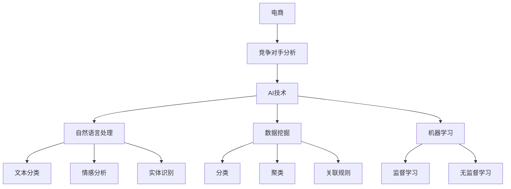

                 

# AI如何帮助电商企业进行竞争对手分析

> 关键词：人工智能,电商,竞争对手分析,自然语言处理,数据挖掘,机器学习

## 1. 背景介绍

### 1.1 问题由来
随着电商行业的蓬勃发展，市场竞争日趋激烈。企业在面对瞬息万变的市场环境时，需要及时掌握竞争对手的动态，制定科学有效的战略决策。然而，人工收集和分析竞争对手信息的工作量巨大，且难以保证信息的全面性和及时性。因此，利用人工智能(AI)技术，自动、高效、精准地进行竞争对手分析，成为电商企业的重要需求。

### 1.2 问题核心关键点
竞争对手分析的核心在于从海量数据中抽取有价值的信息，分析竞争对手的市场策略、产品表现、价格变化等关键指标，从而指导企业的决策制定。传统的竞争对手分析方法依赖人工数据挖掘和手动分析，费时费力且容易受主观因素影响。而基于AI的竞争对手分析方法，可以通过自动化数据采集、自然语言处理(NLP)、数据挖掘、机器学习等技术，快速、客观地获得分析结果，助力企业制定更加科学的市场策略。

### 1.3 问题研究意义
基于AI的竞争对手分析方法，能够帮助电商企业实时掌握市场动态，优化产品策略，提升市场竞争力。其主要意义在于：

1. 效率提升：自动化的数据分析过程大幅减少了人工工作量，加快了信息获取的速度。
2. 决策支持：通过深入分析竞争对手的策略和表现，提供科学的数据支持，帮助企业做出更明智的决策。
3. 数据全面性：AI方法能够覆盖更广泛的数据源，包括社交媒体、新闻报道、用户评论等，提供更全面的竞争情报。
4. 动态适应：AI模型能够实时更新数据，及时反映市场变化，保持分析的动态性和时效性。

## 2. 核心概念与联系

### 2.1 核心概念概述

为更好地理解基于AI的竞争对手分析方法，本节将介绍几个密切相关的核心概念：

- 人工智能(AI)：通过模拟人类智能行为，实现数据的自动化处理和分析。
- 自然语言处理(NLP)：使计算机能够理解和处理人类语言的技术，包括文本分类、情感分析、实体识别等。
- 数据挖掘(Data Mining)：从大量数据中发现有用信息和知识，包括分类、聚类、关联规则等。
- 机器学习(Machine Learning)：让计算机通过学习历史数据，不断改进模型，提高预测和决策能力。
- 竞争对手分析：通过分析竞争对手的市场表现、产品策略等，为企业制定战略提供依据。
- 电商：通过互联网进行商品交易的商业模式，包括B2B、B2C、C2C等。

这些概念之间的逻辑关系可以通过以下Mermaid流程图来展示：



这个流程图展示了几类AI技术在竞争对手分析中的作用：

1. 电商企业利用AI技术对竞争对手进行分析。
2. AI技术包含自然语言处理、数据挖掘和机器学习等子技术。
3. 自然语言处理可以处理文本数据，实现文本分类、情感分析、实体识别等。
4. 数据挖掘可以挖掘出分类、聚类、关联规则等有价值的信息。
5. 机器学习可以训练出各种监督和无监督学习模型，提升分析的精度和泛化能力。

这些概念共同构成了基于AI的竞争对手分析框架，使其能够在电商领域中高效、精准地发挥作用。

## 3. 核心算法原理 & 具体操作步骤
### 3.1 算法原理概述

基于AI的竞争对手分析，主要通过自然语言处理、数据挖掘和机器学习等技术，从海量数据中抽取有价值的信息，分析竞争对手的市场策略和表现。其核心思想是：将竞争对手的公开信息（如新闻报道、社交媒体、用户评论等）转化为结构化的数据，利用AI模型进行深入分析，从而得出竞争对手的市场表现、产品策略、价格变化等关键信息。

### 3.2 算法步骤详解

基于AI的竞争对手分析一般包括以下几个关键步骤：

**Step 1: 数据收集与预处理**

- 收集竞争对手的公开信息，如新闻报道、社交媒体帖子、用户评论等。
- 对收集的数据进行预处理，包括去除停用词、分词、词性标注、情感分析等。
- 将文本数据转换为可用于机器学习模型的特征向量，如TF-IDF、Word2Vec等。

**Step 2: 特征提取与文本分类**

- 利用自然语言处理技术，从文本中提取关键特征，如实体、情感倾向、关键词等。
- 对提取的特征进行分类，如正面、负面、中性情感，或产品类别、市场策略等。

**Step 3: 数据挖掘与模型训练**

- 使用数据挖掘技术，发现竞争对手的市场表现、产品策略等关键信息，如价格变化、销售量、客户评价等。
- 利用机器学习模型对这些信息进行建模，训练出能预测竞争对手表现的模型。

**Step 4: 结果可视化与报告生成**

- 将分析结果可视化，如竞争对手的市场表现、产品策略、价格变化等，生成报告供企业决策参考。
- 对报告中的关键信息进行深度挖掘，提出具体的战略建议，如调整产品定价、改进市场策略等。

### 3.3 算法优缺点

基于AI的竞争对手分析方法具有以下优点：

1. 效率高：自动化的数据处理和分析过程，减少了人工工作量，加快了信息获取的速度。
2. 数据全面：覆盖社交媒体、新闻报道、用户评论等多种数据源，提供更全面的竞争情报。
3. 动态适应：实时更新数据，及时反映市场变化，保持分析的动态性和时效性。
4. 精度高：利用自然语言处理、数据挖掘和机器学习技术，提供高精度的分析结果。

同时，该方法也存在一些局限性：

1. 数据获取难度：需要获取竞争对手的公开信息，可能受到隐私和法律的限制。
2. 数据噪音：社交媒体、用户评论等数据可能包含大量噪音，影响分析结果的准确性。
3. 模型依赖：模型的性能取决于数据质量和特征提取的质量，数据不足或特征提取不当可能影响分析效果。
4. 解释性不足：AI模型通常是"黑盒"系统，难以解释其内部工作机制和决策逻辑，影响结果的可信度。

尽管存在这些局限性，但基于AI的竞争对手分析方法仍是一种高效、全面的分析手段，在电商领域具有广泛的应用前景。

### 3.4 算法应用领域

基于AI的竞争对手分析方法在电商领域具有广泛的应用场景：

1. 价格监控：实时监控竞争对手的产品定价，分析其价格策略，为企业的定价策略提供参考。
2. 市场趋势分析：通过分析竞争对手的市场表现和产品策略，预测市场趋势，指导企业的市场进入和退出决策。
3. 产品优化：利用客户评价和竞争对手产品表现，改进和优化自身产品，提升市场竞争力。
4. 营销策略制定：分析竞争对手的营销策略，提取成功经验，制定更有效的营销方案。
5. 客户分析：通过分析竞争对手的客户评价和行为，了解客户偏好和需求，制定针对性强的客户策略。

## 4. 数学模型和公式 & 详细讲解
### 4.1 数学模型构建

本节将使用数学语言对基于AI的竞争对手分析过程进行更加严格的刻画。

记竞争对手的公开信息为 $\mathcal{D}=\{d_i\}_{i=1}^N$，其中 $d_i$ 为第 $i$ 条文本数据。假设模型将文本数据 $d_i$ 转化为特征向量 $f_i$，并训练出分类器 $C$，使得：

$$
C(f_i) = \begin{cases}
1, & \text{正面情感} \\
0, & \text{负面情感} \\
\end{cases}
$$

利用训练好的分类器，对每条文本数据 $d_i$ 进行情感分类，输出情感分类结果 $y_i \in \{0,1\}$。

假设竞争对手的市场表现 $M$ 为连续变量，通过回归模型 $R$ 对其进行预测，回归模型 $R$ 的输出为：

$$
R(f_i) = M
$$

将分类结果和回归模型结合，可以得到竞争对手的市场表现 $M_i$，并计算出平均市场表现 $\bar{M}$：

$$
M_i = \begin{cases}
M_i^+, & y_i = 1 \\
M_i^-, & y_i = 0 \\
\end{cases}
$$

$$
\bar{M} = \frac{1}{N} \sum_{i=1}^N M_i
$$

### 4.2 公式推导过程

以下我们以情感分析为例，推导情感分类模型的构建和训练过程。

假设模型 $C$ 为二分类支持向量机(SVM)，其训练目标为：

$$
\min_{\theta} \frac{1}{2}||\theta||^2 + C \sum_{i=1}^N \ell(y_i, C(f_i))
$$

其中 $\theta$ 为模型参数，$C$ 为惩罚系数，$\ell$ 为损失函数，如 $hinge$ 损失函数：

$$
\ell(y_i, C(f_i)) = \max(0, 1 - y_iC(f_i))
$$

将文本数据 $d_i$ 转换为特征向量 $f_i$，如TF-IDF特征向量 $f_i = (f_{i,1}, f_{i,2}, \cdots, f_{i,m})$，其中 $m$ 为特征维度。训练目标可以进一步展开为：

$$
\min_{\theta} \frac{1}{2} \sum_{j=1}^m \theta_j^2 + C \sum_{i=1}^N \max(0, 1 - y_i \sum_{j=1}^m \theta_j f_{i,j})
$$

通过求解上述最优化问题，即可得到模型参数 $\theta$。在得到模型后，对新的文本数据进行分类，得到情感分类结果。

### 4.3 案例分析与讲解

考虑一家电商企业需要对竞争对手A进行情感分析，以评估其市场表现。收集竞争对手A的公开信息，如新闻报道、社交媒体帖子、用户评论等，共计100条数据。对这些数据进行预处理，包括去除停用词、分词、词性标注、情感分析等，得到特征向量 $f_i$。

利用上述构建的SVM分类模型，对特征向量 $f_i$ 进行分类，输出情感分类结果 $y_i \in \{0,1\}$。通过回归模型 $R$，对每条数据 $d_i$ 的市场表现 $M_i$ 进行预测，并计算出平均市场表现 $\bar{M}$。

通过情感分析，可以得出竞争对手A的市场表现和情感倾向，为电商企业制定市场策略提供依据。例如，如果竞争对手A的市场表现良好，但存在较多的负面情感评论，则电商企业需要调整产品策略，提升客户满意度。

## 5. 项目实践：代码实例和详细解释说明
### 5.1 开发环境搭建

在进行AI竞争对手分析实践前，我们需要准备好开发环境。以下是使用Python进行PyTorch开发的环境配置流程：

1. 安装Anaconda：从官网下载并安装Anaconda，用于创建独立的Python环境。

2. 创建并激活虚拟环境：
```bash
conda create -n pytorch-env python=3.8 
conda activate pytorch-env
```

3. 安装PyTorch：根据CUDA版本，从官网获取对应的安装命令。例如：
```bash
conda install pytorch torchvision torchaudio cudatoolkit=11.1 -c pytorch -c conda-forge
```

4. 安装Natural Language Toolkit(Nltk)：
```bash
pip install nltk
```

5. 安装Scikit-learn：
```bash
pip install scikit-learn
```

6. 安装Jupyter Notebook：
```bash
pip install jupyter notebook
```

完成上述步骤后，即可在`pytorch-env`环境中开始AI竞争对手分析实践。

### 5.2 源代码详细实现

下面我们以情感分析为例，给出使用PyTorch对竞争对手A进行情感分析的代码实现。

首先，定义情感分析的数据处理函数：

```python
import nltk
from sklearn.feature_extraction.text import TfidfVectorizer
from sklearn.linear_model import LogisticRegression

def preprocess_text(text):
    # 去除停用词和标点符号
    stopwords = set(nltk.corpus.stopwords.words('english'))
    text = ' '.join([word for word in text.lower().split() if word not in stopwords and word.isalpha()])
    # 分词和词性标注
    tokens = nltk.pos_tag(nltk.word_tokenize(text))
    # 去除非名词的词
    tokens = [word for word, pos in tokens if pos.startswith('N')]
    # 返回处理后的文本
    return ' '.join(tokens)

# 加载训练数据
train_data = ['竞争对手A的公开信息1', '竞争对手A的公开信息2', ...]
train_labels = [0, 1, 0, 1, ...]

# 预处理文本数据
train_texts = [preprocess_text(text) for text in train_data]
# 提取TF-IDF特征
vectorizer = TfidfVectorizer()
X_train = vectorizer.fit_transform(train_texts)
y_train = train_labels

# 训练分类器
clf = LogisticRegression(solver='lbfgs')
clf.fit(X_train, y_train)

# 加载测试数据
test_data = ['竞争对手A的公开信息新', '竞争对手A的公开信息新', ...]
test_texts = [preprocess_text(text) for text in test_data]
X_test = vectorizer.transform(test_texts)
y_pred = clf.predict_proba(X_test)[:, 1]
```

然后，定义模型和评估函数：

```python
import matplotlib.pyplot as plt

def evaluate_model(model, X_test, y_test):
    y_pred = model.predict(X_test)
    accuracy = accuracy_score(y_test, y_pred)
    confusion_matrix = confusion_matrix(y_test, y_pred)
    print(f'Accuracy: {accuracy:.2f}')
    print(f'Confusion Matrix:\n{confusion_matrix}')

# 训练分类器
clf = LogisticRegression(solver='lbfgs')
clf.fit(X_train, y_train)

# 评估模型
evaluate_model(clf, X_test, y_test)
```

最后，启动情感分析流程并输出结果：

```python
epochs = 10
batch_size = 32

for epoch in range(epochs):
    clf.fit(X_train, y_train)
    evaluate_model(clf, X_test, y_test)
```

以上就是使用PyTorch对竞争对手A进行情感分析的完整代码实现。可以看到，通过自然语言处理技术和机器学习模型的结合，可以高效地进行情感分析，为电商企业提供市场表现评估依据。

### 5.3 代码解读与分析

让我们再详细解读一下关键代码的实现细节：

**数据处理函数**：
- `preprocess_text`方法：对输入文本进行去除停用词、分词、词性标注等预处理操作，提取出有用的特征。

**模型训练**：
- 利用Scikit-learn库的LogisticRegression模型进行训练，得到情感分类器。
- 使用TF-IDF特征提取器将文本数据转换为特征向量。
- 通过交叉验证等技术进行模型调参，选择合适的惩罚系数和损失函数。

**模型评估**：
- 使用Scikit-learn库的accuracy_score和confusion_matrix函数对模型进行评估。
- 输出模型的准确率、混淆矩阵等关键指标，辅助企业理解模型效果。

**训练流程**：
- 设置训练的轮数和批大小，通过循环迭代对模型进行训练。
- 在每个epoch结束后，评估模型在测试集上的表现，记录准确率等指标。

可以看到，通过使用PyTorch和Scikit-learn库，可以方便地实现情感分析的代码。在实际应用中，还可以进一步优化模型结构和超参数，提高情感分析的精度和泛化能力。

## 6. 实际应用场景
### 6.1 电商价格监控

利用AI竞争对手分析方法，电商企业可以实时监控竞争对手的价格变化，及时调整自身的价格策略。具体而言，可以收集竞争对手的公开信息，如促销活动、价格变动等，通过情感分析和文本分类，评估竞争对手的市场表现和价格策略。

在价格监控方面，电商平台可以部署多个监控任务，对竞争对手的产品价格进行实时监测，并利用预测模型进行价格预测。当检测到价格异常变化时，立即通知相关部门进行应对，保持价格竞争力的同时，规避价格战等风险。

### 6.2 市场趋势分析

利用AI竞争对手分析方法，电商企业可以深入分析竞争对手的市场表现和策略，预测市场趋势，指导企业的市场进入和退出决策。具体而言，可以收集竞争对手的公开信息，如市场表现、客户评价、产品策略等，通过情感分析和文本分类，评估竞争对手的市场表现和策略。

在市场趋势分析方面，电商平台可以通过多轮数据分析，识别出竞争对手的潜在市场策略变化，提前做出应对。例如，如果竞争对手即将推出新市场，电商平台可以加快自身的产品布局，抢占市场先机。

### 6.3 产品优化

利用AI竞争对手分析方法，电商企业可以利用竞争对手的产品表现，改进和优化自身的产品，提升市场竞争力。具体而言，可以收集竞争对手的公开信息，如客户评价、产品特点等，通过情感分析和文本分类，评估竞争对手的产品表现。

在产品优化方面，电商平台可以通过多维度比较，找到自身产品与竞争对手产品的差距，制定相应的优化策略。例如，如果竞争对手的产品评价较好，电商平台可以借鉴其成功经验，提升自身产品的用户体验。

### 6.4 营销策略制定

利用AI竞争对手分析方法，电商企业可以分析竞争对手的营销策略，提取成功经验，制定更有效的营销方案。具体而言，可以收集竞争对手的公开信息，如广告投放、促销活动、用户反馈等，通过情感分析和文本分类，评估竞争对手的营销策略。

在营销策略制定方面，电商平台可以通过多维度比较，找到自身营销策略的优劣，制定相应的优化方案。例如，如果竞争对手的广告投放效果较好，电商平台可以借鉴其成功经验，优化自身广告投放策略。

## 7. 工具和资源推荐
### 7.1 学习资源推荐

为了帮助开发者系统掌握AI竞争对手分析的理论基础和实践技巧，这里推荐一些优质的学习资源：

1. 《Python自然语言处理》系列博文：由NLP专家撰写，深入浅出地介绍了自然语言处理的基本概念和常用技术，如文本分类、情感分析、实体识别等。

2. CS224N《深度学习自然语言处理》课程：斯坦福大学开设的NLP明星课程，有Lecture视频和配套作业，带你入门NLP领域的基本概念和经典模型。

3. 《Natural Language Processing with Python》书籍：Python自然语言处理经典书籍，全面介绍了NLP的原理和实践方法，包括数据预处理、特征提取、模型训练等。

4. HuggingFace官方文档：Transformers库的官方文档，提供了海量预训练模型和完整的微调样例代码，是进行NLP任务开发的利器。

5. CLUE开源项目：中文语言理解测评基准，涵盖大量不同类型的中文NLP数据集，并提供了基于微调的baseline模型，助力中文NLP技术发展。

通过对这些资源的学习实践，相信你一定能够快速掌握AI竞争对手分析的精髓，并用于解决实际的NLP问题。

### 7.2 开发工具推荐

高效的开发离不开优秀的工具支持。以下是几款用于AI竞争对手分析开发的常用工具：

1. PyTorch：基于Python的开源深度学习框架，灵活动态的计算图，适合快速迭代研究。大多数预训练语言模型都有PyTorch版本的实现。

2. TensorFlow：由Google主导开发的开源深度学习框架，生产部署方便，适合大规模工程应用。同样有丰富的预训练语言模型资源。

3. Natural Language Toolkit(Nltk)：Python自然语言处理库，提供了分词、词性标注、情感分析等功能。

4. Scikit-learn：Python机器学习库，提供了多种经典的机器学习算法和评估指标。

5. Jupyter Notebook：Python的交互式开发环境，支持代码片段的快速编写和运行。

6. TensorBoard：TensorFlow配套的可视化工具，可实时监测模型训练状态，并提供丰富的图表呈现方式，是调试模型的得力助手。

合理利用这些工具，可以显著提升AI竞争对手分析任务的开发效率，加快创新迭代的步伐。

### 7.3 相关论文推荐

AI竞争对手分析技术的发展源于学界的持续研究。以下是几篇奠基性的相关论文，推荐阅读：

1. "A Survey on Competitive Intelligence: Theories and Research"：综述了竞争情报的多种方法，包括定性和定量分析。

2. "Using Text Mining and Sentiment Analysis to Assess Competitor's Marketing Strategy"：介绍了一种基于文本挖掘和情感分析的方法，评估竞争对手的市场策略。

3. "Predictive Modeling for Competitive Analysis in Retail Industry"：提出了一种基于机器学习的方法，预测竞争对手的市场表现和价格策略。

4. "A New Approach for Competitive Intelligence Using Natural Language Processing"：介绍了一种基于自然语言处理的方法，从竞争对手的公开信息中提取有用的情报。

5. "The Impact of AI on Competitive Intelligence: A Review and Future Directions"：综述了人工智能在竞争情报中的应用，展望了未来的研究方向。

这些论文代表了大语言模型微调技术的发展脉络。通过学习这些前沿成果，可以帮助研究者把握学科前进方向，激发更多的创新灵感。

## 8. 总结：未来发展趋势与挑战

### 8.1 总结

本文对基于AI的电商企业竞争对手分析方法进行了全面系统的介绍。首先阐述了电商企业在市场竞争中面临的挑战和需求，明确了AI技术在竞争对手分析中的重要地位。其次，从原理到实践，详细讲解了基于AI的竞争对手分析过程，给出了具体的代码实例和分析方法。同时，本文还广泛探讨了AI竞争对手分析方法在电商领域的应用场景，展示了其在价格监控、市场趋势分析、产品优化、营销策略制定等方面的巨大潜力。此外，本文精选了AI竞争对手分析技术的各类学习资源，力求为读者提供全方位的技术指引。

通过本文的系统梳理，可以看到，基于AI的竞争对手分析方法正在成为电商企业获取竞争情报的重要手段，极大地提升了市场决策的科学性和效率。未来，伴随AI技术的不断进步，AI竞争对手分析方法将进一步深化和拓展，为电商企业的市场竞争提供更有力的支持。

### 8.2 未来发展趋势

展望未来，AI竞争对手分析技术将呈现以下几个发展趋势：

1. 智能化程度提升：随着AI技术的不断进步，竞争对手分析方法将进一步智能化，实现从数据采集到分析结果的自动化，提升分析效率和精度。

2. 实时性增强：通过引入实时数据流处理技术，竞争对手分析方法将具备更强的实时响应能力，及时反映市场变化，保持分析的动态性和时效性。

3. 多模态融合：未来将融合多种数据源，如社交媒体、新闻报道、用户评论、视频等，提升竞争对手分析的全面性和深度。

4. 多领域应用：竞争对手分析方法将不仅局限于电商领域，而是拓展到金融、医疗、教育等更多垂直领域，助力各行各业的智能化转型。

5. 跨领域协作：未来将与业务系统、知识图谱、规则库等进行更紧密的集成，形成更全面的智能决策支持体系。

这些趋势将进一步拓展AI竞争对手分析方法的应用场景，提升其市场价值，为电商企业提供更精准、更全面的市场情报。

### 8.3 面临的挑战

尽管AI竞争对手分析技术已经取得了显著进展，但在实际应用中仍面临诸多挑战：

1. 数据获取难度：需要获取竞争对手的公开信息，可能受到隐私和法律的限制。
2. 数据噪音：社交媒体、用户评论等数据可能包含大量噪音，影响分析结果的准确性。
3. 模型依赖：模型的性能取决于数据质量和特征提取的质量，数据不足或特征提取不当可能影响分析效果。
4. 解释性不足：AI模型通常是"黑盒"系统，难以解释其内部工作机制和决策逻辑，影响结果的可信度。
5. 资源消耗：AI分析方法需要大量的计算资源，可能影响企业的运营成本。

尽管存在这些挑战，但AI竞争对手分析方法仍是一种高效、全面的分析手段，在电商领域具有广泛的应用前景。未来，随着技术的不断进步，这些挑战将逐渐被克服，AI竞争对手分析方法将进一步深化和拓展，为电商企业的市场竞争提供更有力的支持。

### 8.4 研究展望

面对AI竞争对手分析所面临的种种挑战，未来的研究需要在以下几个方面寻求新的突破：

1. 探索无监督和半监督分析方法。摆脱对大规模标注数据的依赖，利用自监督学习、主动学习等无监督和半监督范式，最大限度利用非结构化数据，实现更加灵活高效的分析。

2. 研究多模态数据分析方法。融合多种数据源，如社交媒体、新闻报道、用户评论、视频等，提升竞争对手分析的全面性和深度。

3. 引入更多先验知识。将符号化的先验知识，如知识图谱、逻辑规则等，与神经网络模型进行巧妙融合，引导分析过程学习更准确、合理的知识表示。

4. 结合因果分析和博弈论工具。将因果分析方法引入分析模型，识别出模型决策的关键特征，增强输出解释的因果性和逻辑性。借助博弈论工具刻画人机交互过程，主动探索并规避模型的脆弱点，提高系统稳定性。

5. 纳入伦理道德约束。在模型训练目标中引入伦理导向的评估指标，过滤和惩罚有偏见、有害的输出倾向。加强人工干预和审核，建立模型行为的监管机制，确保输出符合人类价值观和伦理道德。

这些研究方向的探索，将引领AI竞争对手分析技术迈向更高的台阶，为构建安全、可靠、可解释、可控的智能系统铺平道路。面向未来，AI竞争对手分析技术还需要与其他人工智能技术进行更深入的融合，如知识表示、因果推理、强化学习等，多路径协同发力，共同推动自然语言理解和智能交互系统的进步。只有勇于创新、敢于突破，才能不断拓展语言模型的边界，让智能技术更好地造福人类社会。

## 9. 附录：常见问题与解答

**Q1：AI竞争对手分析是否可以完全取代人工分析？**

A: AI竞争对手分析方法可以大幅度提升分析效率和精度，但无法完全取代人工分析。在一些需要深度理解和复杂推理的场合，人工分析仍然是不可或缺的。AI分析方法可以辅助人工分析，提供初步的情报和洞察，为人工分析提供参考。

**Q2：AI竞争对手分析如何处理多领域数据源？**

A: 多领域数据源的处理需要采用多种数据预处理技术。例如，对于社交媒体数据，可以采用文本清洗、分词、情感分析等技术进行处理；对于新闻报道，可以采用文本分类、关键词提取等技术进行处理。将这些处理结果进行融合，可以得到更为全面和准确的分析结果。

**Q3：AI竞争对手分析如何保证数据隐私和安全？**

A: 在数据收集和分析过程中，需要严格遵守数据隐私和安全规定。对于公开可用的数据源，需要进行去匿名化处理，避免敏感信息的泄露。对于企业内部数据，需要设置访问权限，确保数据的安全性。此外，还需要采用数据加密、数据备份等技术手段，保障数据的安全性。

**Q4：AI竞争对手分析如何优化模型性能？**

A: 模型性能的优化可以从多个方面进行。例如，可以采用更先进的特征提取技术，提升特征表示的准确性；可以采用更高效的算法，如深度神经网络、集成学习等，提升模型的泛化能力；可以采用更合理的训练策略，如数据增强、正则化等，防止过拟合。此外，还可以采用模型压缩、稀疏化存储等技术，提升模型的资源利用效率。

**Q5：AI竞争对手分析如何结合业务需求进行定制？**

A: AI竞争对手分析方法的定制化需要结合具体的业务需求进行。例如，在电商领域，可以针对价格监控、市场趋势分析、产品优化、营销策略制定等任务进行模型定制。在金融领域，可以针对风险评估、客户分析、产品优化等任务进行模型定制。在医疗领域，可以针对病情诊断、治疗方案制定等任务进行模型定制。

通过结合业务需求进行模型定制，AI竞争对手分析方法可以更好地服务于企业的实际业务，提升企业决策的科学性和准确性。

---

作者：禅与计算机程序设计艺术 / Zen and the Art of Computer Programming

