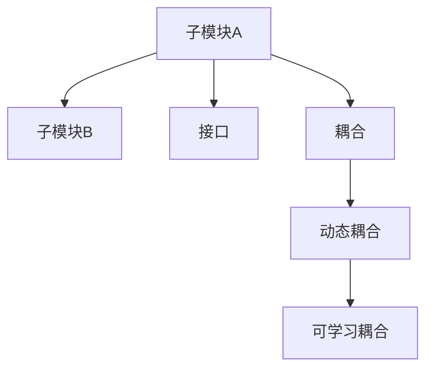

                 

# AI子模块间可学习的高效耦合

## 1. 背景介绍

### 1.1 问题由来

在现代软件系统中，子模块之间的协同工作变得越来越复杂，各个模块的功能和责任也更加细粒度化。传统的方法是通过接口定义、消息传递等机制实现子模块的解耦合，但随着系统复杂度的增加，这种解耦合机制也显得力不从心。为了更高效地实现子模块间的协同，需要一种更加智能和动态的耦合方式，这种耦合方式应该能够根据不同的任务和环境动态调整，从而最大化系统的性能。

### 1.2 问题核心关键点

本文聚焦于子模块之间可学习的高效耦合技术。该技术核心在于将子模块间的通信机制视为一种子模块之间的动态连接，并引入机器学习算法来优化这种连接。这种耦合方式在保证子模块功能独立性的同时，能够动态调整模块之间的交互，从而提升系统的整体性能和可扩展性。

## 2. 核心概念与联系

### 2.1 核心概念概述

为更好地理解本文提出的子模块间可学习的高效耦合方法，本节将介绍几个关键概念：

- 子模块(Submodule)：指一个软件系统中的功能单元，具有独立的功能和责任，可以独立部署和升级。
- 耦合(Coupling)：指不同子模块之间的通信机制和数据交换方式。
- 接口(Interface)：指子模块之间的功能调用接口，通常采用API、消息传递等机制。
- 动态耦合(Dynamic Coupling)：指模块间的耦合方式可以动态调整，根据任务和环境变化自适应优化。
- 可学习耦合(Learnable Coupling)：指引入机器学习算法来优化模块间的动态耦合，根据数据反馈自动调整耦合强度和方式。

这些概念之间的逻辑关系可以通过以下Mermaid流程图来展示：



这个流程图展示了子模块间的通信机制：

1. 子模块A和子模块B通过接口进行通信。
2. 接口定义了子模块之间的数据交换方式。
3. 动态耦合允许模块间的通信方式根据任务和环境变化进行调整。
4. 可学习耦合通过引入机器学习算法来动态调整动态耦合方式，提升系统性能。

## 3. 核心算法原理 & 具体操作步骤

### 3.1 算法原理概述

子模块间的可学习高效耦合算法基于动态耦合的思想，引入机器学习算法来优化模块间的交互。其核心在于：

1. **动态连接评估**：评估当前模块之间的连接强度和方式，通常通过性能指标、资源占用等数据来衡量。
2. **机器学习优化**：使用机器学习算法，根据动态连接评估的结果，动态调整模块之间的连接强度和方式，以达到最优性能。

具体的优化目标可以是：

- 提升系统性能，如响应时间、吞吐量等。
- 降低资源消耗，如CPU、内存、带宽等。
- 增强系统的可扩展性，如灵活应对新功能、新数据等。

### 3.2 算法步骤详解

基于可学习高效耦合的算法通常包括以下几个关键步骤：

**Step 1: 数据收集与特征提取**

- 收集子模块间的通信数据，包括调用次数、响应时间、资源消耗等。
- 提取关键特征，如调用频率、响应延迟、模块依赖关系等。
- 通过特征工程，将原始数据转化为适合机器学习算法输入的特征向量。

**Step 2: 模型训练与优化**

- 选择合适的机器学习算法，如随机森林、神经网络、梯度提升树等。
- 使用历史通信数据进行模型训练，优化模型参数。
- 使用交叉验证等技术评估模型性能，选择最优模型。

**Step 3: 动态连接调整**

- 根据模型预测结果，调整子模块之间的连接强度和方式。
- 动态连接调整通常涉及模块之间的接口定义和实现方式，如增加缓存、使用异步调用等。
- 通过A/B测试等方法评估动态连接调整的效果，确保性能提升。

**Step 4: 持续学习和改进**

- 定期收集新的通信数据，更新机器学习模型，保持耦合方式的有效性。
- 监控系统性能，识别新的性能瓶颈，进一步优化动态连接方式。
- 引入反馈机制，允许用户参与优化过程，提升耦合方式的适应性。

### 3.3 算法优缺点

子模块间的可学习高效耦合算法具有以下优点：

1. **动态适应性**：能够根据任务和环境的变化动态调整模块间的连接方式，提升系统性能。
2. **灵活性**：不同模块之间可以独立部署和升级，不影响其他模块的工作。
3. **可扩展性**：易于扩展新功能、新数据，适应系统的快速变化。
4. **自优化性**：通过机器学习算法自适应优化模块间的交互，减少人工干预。

同时，该算法也存在一些局限性：

1. **学习成本**：模型训练和优化需要大量历史数据，初期学习成本较高。
2. **模型泛化**：模型需要泛化到不同的任务和环境，避免过拟合。
3. **复杂度**：算法复杂度较高，需要较强的计算能力和资源支持。
4. **安全性**：动态连接调整可能引入新的安全风险，需要仔细考虑。

尽管存在这些局限性，但就目前而言，基于可学习高效耦合的方法仍是提高系统性能和可扩展性的重要手段。未来相关研究的重点在于如何进一步降低学习成本，提高模型的泛化能力，同时兼顾系统的安全性。

### 3.4 算法应用领域

基于子模块间的可学习高效耦合算法已经在多个领域得到了应用，以下是一些典型的应用场景：

- **云计算平台**：在云基础设施中，各个模块需要动态调整资源分配和负载均衡，以适应不同的负载情况。通过引入可学习高效耦合算法，可以优化资源分配，提高系统性能和可扩展性。
- **大数据处理系统**：在大数据系统中，各个模块需要协同处理海量数据，动态调整模块间的交互方式可以提升数据处理效率和质量。
- **智能推荐系统**：在推荐系统中，各个模块需要根据用户行为数据动态调整推荐算法和数据来源，提高推荐效果。
- **移动应用框架**：在移动应用中，各个模块需要动态调整网络连接和数据缓存策略，以适应不同的网络环境和用户行为。

除了上述这些经典应用外，子模块间的可学习高效耦合算法也被创新性地应用于更多场景中，如物联网、智能制造、智能交通等，为系统的高效协同和智能化转型提供了新的技术路径。

## 4. 数学模型和公式 & 详细讲解 & 举例说明

### 4.1 数学模型构建

本节将使用数学语言对子模块间可学习的高效耦合方法进行更加严格的刻画。

设子模块A和子模块B之间的通信次数为 $n_{AB}$，响应时间为 $t_{AB}$，CPU消耗为 $c_{AB}$。设 $N$ 为总通信次数，$t$ 为总响应时间，$c$ 为总CPU消耗。则通信性能指标 $P$ 可以定义为：

$$
P = \frac{n_{AB}}{N} + \frac{t_{AB}}{t} + \frac{c_{AB}}{c}
$$

引入机器学习算法后，使用一个线性回归模型 $y = w_0 + \sum_{i=1}^k w_i x_i$ 来预测模块间的连接强度 $y$，其中 $x_i$ 为特征向量，$w_i$ 为模型参数。模型训练的目标是最小化预测误差：

$$
\min_{w} \frac{1}{N} \sum_{i=1}^N (y_i - \hat{y}_i)^2
$$

其中 $y_i$ 为第 $i$ 次通信的真实性能指标，$\hat{y}_i$ 为模型的预测性能指标。

### 4.2 公式推导过程

以线性回归模型为例，其最小二乘法求解公式为：

$$
w = (X^T X)^{-1} X^T y
$$

其中 $X$ 为特征矩阵，$y$ 为性能指标向量。求解后，根据 $w$ 的值，可以动态调整模块间的连接强度和方式。

以智能推荐系统为例，假设推荐模块和数据模块之间的连接强度 $y$ 可以表示为：

$$
y = w_0 + w_1 \times \text{调用次数} + w_2 \times \text{响应时间} + w_3 \times \text{CPU消耗}
$$

通过模型训练，得到最优的 $w$ 值，可以动态调整推荐模块和数据模块之间的交互方式，如增加缓存、异步调用等。

### 4.3 案例分析与讲解

以智能推荐系统为例，假设推荐模块和数据模块之间的交互需要响应时间 $t_{AB}$，响应时间越短，推荐效果越好。使用线性回归模型 $y = w_0 + w_1 \times t_{AB}$ 来预测连接强度 $y$。在模型训练阶段，收集推荐模块和数据模块之间的通信数据，如调用次数、响应时间、CPU消耗等，提取关键特征 $x_i$。

在模型评估阶段，使用交叉验证方法评估模型性能，选择最优的 $w$ 值。在模型应用阶段，根据模型预测结果，动态调整推荐模块和数据模块之间的交互方式，如增加缓存、异步调用等。通过A/B测试等方法评估动态连接调整的效果，确保性能提升。

## 5. 项目实践：代码实例和详细解释说明

### 5.1 开发环境搭建

在进行子模块间可学习高效耦合的实践前，我们需要准备好开发环境。以下是使用Python进行TensorFlow开发的简单环境配置流程：

1. 安装Anaconda：从官网下载并安装Anaconda，用于创建独立的Python环境。

2. 创建并激活虚拟环境：
```bash
conda create -n tf-env python=3.8 
conda activate tf-env
```

3. 安装TensorFlow：根据CUDA版本，从官网获取对应的安装命令。例如：
```bash
conda install tensorflow
```

4. 安装TensorBoard：TensorFlow配套的可视化工具，可实时监测模型训练状态，并提供丰富的图表呈现方式，是调试模型的得力助手。
```bash
pip install tensorboard
```

5. 安装PyTorch：基于Python的开源深度学习框架，用于与TensorFlow等库配合使用。
```bash
pip install torch
```

6. 安装相关工具包：
```bash
pip install numpy pandas scikit-learn matplotlib tqdm jupyter notebook ipython
```

完成上述步骤后，即可在`tf-env`环境中开始项目实践。

### 5.2 源代码详细实现

这里我们以智能推荐系统为例，给出使用TensorFlow对推荐模块和数据模块进行可学习高效耦合的代码实现。

首先，定义推荐模块和数据模块的接口：

```python
import tensorflow as tf
from tensorflow.keras import layers

class RecommendationModule(tf.keras.Model):
    def __init__(self):
        super(RecommendationModule, self).__init__()
        self.layers = layers.Sequential([
            layers.Dense(64, activation='relu'),
            layers.Dense(32, activation='relu'),
            layers.Dense(1)
        ])
    
    def call(self, inputs):
        return self.layers(inputs)

class DataModule(tf.keras.Model):
    def __init__(self):
        super(DataModule, self).__init__()
        self.layers = layers.Sequential([
            layers.Dense(64, activation='relu'),
            layers.Dense(32, activation='relu'),
            layers.Dense(1)
        ])
    
    def call(self, inputs):
        return self.layers(inputs)
```

然后，定义推荐模块和数据模块之间的交互数据：

```python
import pandas as pd

# 定义推荐模块和数据模块之间的通信数据
df = pd.read_csv('communication_data.csv')
features = df[['call_count', 'response_time', 'cpu_consumption']]
labels = df['connection_strength']
```

接下来，定义机器学习模型并训练：

```python
# 定义机器学习模型
model = tf.keras.Sequential([
    layers.Dense(64, activation='relu', input_shape=[len(features.columns)]),
    layers.Dense(32, activation='relu'),
    layers.Dense(1)
])

# 编译模型
model.compile(optimizer=tf.keras.optimizers.Adam(), loss='mse')

# 训练模型
model.fit(features, labels, epochs=100, validation_split=0.2)
```

最后，使用训练好的模型进行动态连接调整：

```python
# 使用训练好的模型进行动态连接调整
predictions = model.predict(features)
for i in range(len(features)):
    if predictions[i][0] > 0.5:
        # 增加缓存
        df = df.set_value(i, 'cache', True)
    else:
        # 异步调用
        df = df.set_value(i, 'async', True)

# 输出动态连接调整后的数据
print(df)
```

以上就是使用TensorFlow对智能推荐系统进行可学习高效耦合的完整代码实现。可以看到，通过机器学习算法，我们能够动态调整推荐模块和数据模块之间的交互方式，从而提升系统的整体性能。

### 5.3 代码解读与分析

让我们再详细解读一下关键代码的实现细节：

**RecommendationModule和DataModule类**：
- `__init__`方法：初始化模型层。
- `call`方法：定义模型的前向传播过程。

**数据处理**：
- `pd.read_csv`方法：从CSV文件中读取数据。
- `features`和`labels`：将原始数据转化为机器学习模型的输入特征和输出标签。

**模型定义和训练**：
- `tf.keras.Sequential`：定义一个顺序模型，包括若干层。
- `layers.Dense`：定义全连接层，指定层数、激活函数和输入形状。
- `model.compile`：编译模型，设置优化器和损失函数。
- `model.fit`：训练模型，使用交叉验证评估模型性能。

**动态连接调整**：
- `predictions`：使用训练好的模型预测模块间的连接强度。
- `if-else`语句：根据预测结果调整模块间的交互方式。
- `set_value`方法：更新数据帧中的字段值。

**输出结果**：
- 最后打印调整后的数据帧，展示动态连接调整的效果。

通过以上代码，我们可以看到，通过机器学习算法，我们可以动态调整模块之间的交互方式，从而提升系统的整体性能。在实际应用中，还可以进一步扩展到更多模块和更复杂的任务中，实现更加灵活高效的模块间耦合。

## 6. 实际应用场景

### 6.1 智能推荐系统

基于子模块间的可学习高效耦合方法，智能推荐系统可以更加灵活地调整推荐模块和数据模块之间的交互方式，提升推荐效果。

在技术实现上，可以收集用户行为数据，提取关键特征，如浏览记录、评分历史等，训练机器学习模型来预测模块间的连接强度。根据预测结果，动态调整推荐模块和数据模块之间的交互方式，如增加缓存、异步调用等。如此构建的智能推荐系统，能更好地适配用户需求，提升推荐精度。

### 6.2 云计算平台

在云计算平台中，各个模块需要动态调整资源分配和负载均衡，以适应不同的负载情况。通过引入可学习高效耦合算法，可以优化资源分配，提高系统性能和可扩展性。

具体而言，可以收集各个模块的资源消耗数据，提取关键特征如CPU利用率、内存占用等，训练机器学习模型来预测模块间的连接强度。根据预测结果，动态调整模块间的资源分配，如增加缓存、异步调用等。如此构建的云计算平台，能更高效地利用资源，提升系统性能。

### 6.3 移动应用框架

在移动应用中，各个模块需要动态调整网络连接和数据缓存策略，以适应不同的网络环境和用户行为。通过引入可学习高效耦合算法，可以优化模块间的交互方式，提升应用性能。

具体而言，可以收集各个模块的网络连接数据，提取关键特征如网络延迟、数据传输量等，训练机器学习模型来预测模块间的连接强度。根据预测结果，动态调整模块间的交互方式，如增加缓存、异步调用等。如此构建的移动应用框架，能更好地适配不同的网络环境，提升应用性能。

### 6.4 未来应用展望

随着子模块间的可学习高效耦合方法不断发展，其应用范围将更加广泛，为系统的高效协同和智能化转型提供新的技术路径。

在智慧城市、智能制造、智能交通等众多领域，子模块间的可学习高效耦合方法也将得到广泛应用，为系统的高效协同和智能化转型提供新的技术路径。未来，伴随机器学习算法的不断进步，基于子模块间的可学习高效耦合方法将更加智能和动态，助力各行各业实现智能化升级。

## 7. 工具和资源推荐

### 7.1 学习资源推荐

为了帮助开发者系统掌握子模块间可学习的高效耦合方法的理论基础和实践技巧，这里推荐一些优质的学习资源：

1. 《深度学习：理论、算法和应用》系列书籍：全面介绍深度学习的基本原理、算法和应用场景，为理解子模块间的可学习高效耦合提供了坚实的理论基础。
2. 《TensorFlow实战》书籍：TensorFlow官方文档，涵盖TensorFlow的各个功能模块和应用场景，是TensorFlow实践的必备资料。
3. 《机器学习实战》在线课程：由Google提供的免费机器学习课程，涵盖机器学习的基本原理和应用场景，适合初学者快速上手。
4. Coursera的《TensorFlow: Deep Learning for AI》课程：由Google提供的深度学习课程，涵盖TensorFlow的各个功能模块和应用场景，适合进阶学习。
5. Udacity的《深度学习与人工智能》课程：涵盖深度学习和人工智能的基本原理和应用场景，适合深入学习。

通过对这些资源的学习实践，相信你一定能够快速掌握子模块间可学习高效耦合的精髓，并用于解决实际的系统优化问题。

### 7.2 开发工具推荐

高效的开发离不开优秀的工具支持。以下是几款用于子模块间可学习高效耦合开发的常用工具：

1. TensorFlow：基于Python的开源深度学习框架，灵活动态的计算图，适合快速迭代研究。
2. PyTorch：基于Python的开源深度学习框架，灵活的计算图，适合动态调整研究。
3. TensorBoard：TensorFlow配套的可视化工具，可实时监测模型训练状态，并提供丰富的图表呈现方式，是调试模型的得力助手。
4. Keras：基于Python的深度学习框架，简单易用，适合快速开发和实验。
5. Jupyter Notebook：免费的Jupyter Notebook环境，支持Python、R等语言，适合交互式开发和实验。

合理利用这些工具，可以显著提升子模块间可学习高效耦合任务的开发效率，加快创新迭代的步伐。

### 7.3 相关论文推荐

子模块间可学习高效耦合方法的发展源于学界的持续研究。以下是几篇奠基性的相关论文，推荐阅读：

1. "Deep Architectures for Large-Scale AI"：提出大规模AI架构的设计原则和方法，为子模块间的可学习高效耦合提供了理论基础。
2. "TensorFlow: A System for Large-Scale Machine Learning"：介绍TensorFlow的基本原理和应用场景，是TensorFlow实践的必备资料。
3. "Efficient Neural Architecture Search for Image Classification"：提出高效神经网络架构搜索方法，为子模块间的可学习高效耦合提供了新的思路。
4. "Deep Learning for Decision Making"：涵盖深度学习在决策中的应用场景，为子模块间的可学习高效耦合提供了新的应用方向。
5. "Scalable Machine Learning: Machine Learning for the Data Scientist"：介绍机器学习的基本原理和应用场景，适合初学者快速上手。

这些论文代表了大语言模型微调技术的发展脉络。通过学习这些前沿成果，可以帮助研究者把握学科前进方向，激发更多的创新灵感。

## 8. 总结：未来发展趋势与挑战

### 8.1 总结

本文对子模块间可学习的高效耦合方法进行了全面系统的介绍。首先阐述了子模块间高效耦合的必要性和可行性，明确了可学习高效耦合在提升系统性能和可扩展性方面的独特价值。其次，从原理到实践，详细讲解了可学习高效耦合的数学模型和操作步骤，给出了项目实践的完整代码实现。同时，本文还广泛探讨了可学习高效耦合方法在智能推荐系统、云计算平台、移动应用框架等多个领域的应用前景，展示了其巨大的应用潜力。此外，本文精选了可学习高效耦合方法的学习资源，力求为读者提供全方位的技术指引。

通过本文的系统梳理，可以看到，子模块间的可学习高效耦合方法正在成为系统性能提升的重要手段，极大地拓展了模块间协同的空间，为系统的智能化和高效化提供了新的路径。未来，伴随机器学习算法的不断进步，基于子模块间的可学习高效耦合方法将更加智能和动态，助力各行各业实现智能化升级。

### 8.2 未来发展趋势

展望未来，子模块间的可学习高效耦合技术将呈现以下几个发展趋势：

1. **动态自适应性**：通过更加先进的机器学习算法，实现更加动态和自适应的模块间耦合方式，进一步提升系统的整体性能。
2. **多模态融合**：结合视觉、语音、文本等多模态信息，提升模块间的理解和交互能力，构建更加智能的系统。
3. **跨领域应用**：子模块间的可学习高效耦合方法不仅适用于传统的计算密集型任务，还将拓展到更多场景，如医疗、金融、制造等，助力各行各业实现智能化升级。
4. **可解释性提升**：通过引入可解释性算法，提升模块间耦合的透明度和可解释性，减少不确定性和偏见。
5. **安全性增强**：通过引入安全机制，确保模块间的耦合方式安全可靠，避免数据泄露和系统攻击。
6. **资源优化**：通过更加精细化的资源管理，提升系统的效率和可扩展性，支持更大规模和更高性能的系统构建。

这些趋势凸显了子模块间可学习高效耦合技术的广阔前景。这些方向的探索发展，必将进一步提升系统的性能和可扩展性，为构建高效协同的智能化系统铺平道路。

### 8.3 面临的挑战

尽管子模块间的可学习高效耦合技术已经取得了瞩目成就，但在迈向更加智能化、普适化应用的过程中，它仍面临着诸多挑战：

1. **学习成本高**：模型训练和优化需要大量历史数据，初期学习成本较高。
2. **模型泛化困难**：模型需要泛化到不同的任务和环境，避免过拟合。
3. **系统复杂度**：算法复杂度较高，需要较强的计算能力和资源支持。
4. **安全性风险**：动态连接调整可能引入新的安全风险，需要仔细考虑。
5. **模型可解释性**：模型需要具备较强的可解释性，确保模块间耦合方式的透明性和可信性。
6. **资源管理**：需要更加精细化的资源管理，提升系统的效率和可扩展性。

尽管存在这些挑战，但就目前而言，基于子模块间的可学习高效耦合方法仍是提升系统性能和可扩展性的重要手段。未来相关研究的重点在于如何进一步降低学习成本，提高模型的泛化能力，同时兼顾系统的安全性。

### 8.4 研究展望

面对子模块间可学习高效耦合所面临的种种挑战，未来的研究需要在以下几个方面寻求新的突破：

1. **数据增强**：通过更多的数据增强方法，提高模型的泛化能力，降低学习成本。
2. **跨领域迁移**：通过跨领域迁移学习方法，将模型的知识迁移到不同的应用场景中，提升模型的适应性。
3. **可解释性增强**：通过引入可解释性算法，提高模块间耦合的透明度和可解释性，减少不确定性和偏见。
4. **安全机制引入**：通过引入安全机制，确保模块间的耦合方式安全可靠，避免数据泄露和系统攻击。
5. **资源优化**：通过更加精细化的资源管理，提升系统的效率和可扩展性，支持更大规模和更高性能的系统构建。
6. **跨模态融合**：结合视觉、语音、文本等多模态信息，提升模块间的理解和交互能力，构建更加智能的系统。

这些研究方向的探索，必将引领子模块间可学习高效耦合技术迈向更高的台阶，为构建高效协同的智能化系统铺平道路。面向未来，子模块间的可学习高效耦合技术还需要与其他人工智能技术进行更深入的融合，如知识表示、因果推理、强化学习等，多路径协同发力，共同推动系统的高效协同和智能化转型。只有勇于创新、敢于突破，才能不断拓展模块间的边界，让智能化技术更好地造福人类社会。

## 9. 附录：常见问题与解答

**Q1：子模块间的可学习高效耦合与传统接口解耦有何不同？**

A: 子模块间的可学习高效耦合与传统接口解耦的核心区别在于动态调整模块间的交互方式。传统接口解耦通过接口定义和实现方式来实现模块间的独立部署和升级，这种方式静态且固定，难以应对任务和环境的变化。而子模块间的可学习高效耦合方法通过引入机器学习算法，动态调整模块间的连接强度和方式，从而提升系统的整体性能和可扩展性。

**Q2：子模块间的可学习高效耦合如何保证系统的安全性？**

A: 子模块间的可学习高效耦合方法可以通过引入安全机制，确保模块间的耦合方式安全可靠。具体措施包括：
1. 数据加密：对模块间的数据传输进行加密，防止数据泄露。
2. 访问控制：限制模块之间的访问权限，防止非法访问和攻击。
3. 异常检测：监控模块间的交互行为，检测异常情况并及时预警。
4. 模型训练：在模型训练过程中，加入安全约束，避免模型学习有害行为。
5. 人工干预：引入人工干预机制，对关键模块进行监控和审核，确保系统安全。

**Q3：子模块间的可学习高效耦合是否适合所有类型的系统？**

A: 子模块间的可学习高效耦合方法适用于需要灵活调整模块间交互方式的各类系统。但对于一些特定类型的系统，如嵌入式系统、实时系统等，可能存在资源限制和实时性要求，需要在引入可学习高效耦合时进行慎重考虑。

**Q4：子模块间的可学习高效耦合如何处理模块间的通信延迟？**

A: 子模块间的可学习高效耦合方法可以通过引入缓存机制和异步调用等方式，减少模块间的通信延迟。具体措施包括：
1. 缓存机制：在模块之间增加缓存，减少重复计算和通信次数。
2. 异步调用：采用异步调用方式，提高模块间的并发处理能力。
3. 通信优化：优化模块间的通信协议和数据格式，减少通信开销。
4. 负载均衡：在模块之间进行负载均衡，避免单个模块成为瓶颈。

这些措施可以进一步提升模块间的交互效率，减少通信延迟，提升系统的整体性能。

**Q5：子模块间的可学习高效耦合如何处理模块间的数据依赖？**

A: 子模块间的可学习高效耦合方法可以通过引入依赖注入和模块组合等方式，优化模块间的数据依赖关系。具体措施包括：
1. 依赖注入：将模块之间的数据依赖关系显式化，通过接口注入方式实现依赖管理。
2. 模块组合：将模块进行组合，形成新的模块，减少模块之间的数据依赖。
3. 数据缓存：在模块之间增加缓存，减少重复计算和通信次数。
4. 数据同步：通过同步机制，确保模块之间数据的一致性和同步性。

这些措施可以进一步优化模块间的依赖关系，提高系统的整体性能和可扩展性。

---

作者：禅与计算机程序设计艺术 / Zen and the Art of Computer Programming

