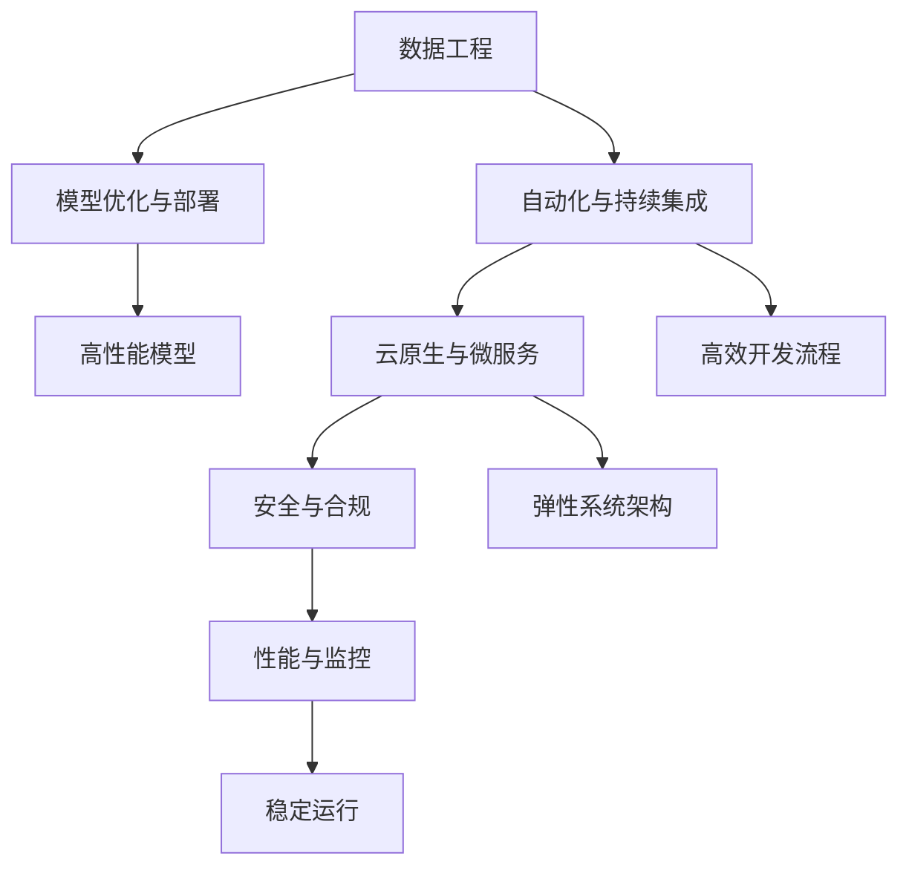

                 

# AI工程学：实战开发手册

> 关键词：AI工程、数据工程、自动化、云原生、微服务、DevOps、容器化、分布式系统、云计算、机器学习、深度学习、模型部署、数据管道、安全合规、监控报警、可视化、性能优化

## 1. 背景介绍

### 1.1 问题由来

随着人工智能（AI）技术的飞速发展，AI工程学（AI Engineering）已经成为数据驱动时代不可或缺的一部分。AI工程学不仅包括机器学习、深度学习等核心技术，还包括数据工程、自动化、云原生、微服务等重要内容。AI工程学为AI技术从研发到部署的全生命周期提供了强有力的支撑。

### 1.2 问题核心关键点

1. **数据质量与处理**：高质量的数据是AI工程学的基石。如何高效、可靠地获取、清洗、存储和处理海量数据，是实现AI模型高性能的关键。
2. **模型优化与部署**：模型优化包括模型压缩、量化、剪枝等，确保模型在生产环境中的高效运行。模型部署涉及模型版本管理、容器化、服务化、自动化编排等，确保模型稳定、可靠地运行。
3. **自动化与持续集成**：自动化测试、自动化调参、自动化编排等技术，提升研发效率，缩短产品上线周期。持续集成（CI）和持续部署（CD）确保代码质量，快速迭代产品功能。
4. **云原生与微服务**：云原生技术如Kubernetes、Docker等，使得AI模型能够在云环境中高效、弹性地运行。微服务架构提升系统的模块化、可扩展性和可维护性。
5. **安全与合规**：数据隐私、模型偏见、系统安全等问题，需要严格的安全与合规措施。
6. **性能与监控**：确保系统高可用性、低延迟、高性能，并及时监控报警，确保系统稳定运行。

### 1.3 问题研究意义

AI工程学不仅关注AI技术的实现，更关注整个系统的构建与部署，从数据处理、模型优化到自动化、云原生、安全合规等，都是实现AI模型高性能、高可靠性的重要组成部分。AI工程学为AI技术在实际应用中的落地提供了坚实的基础。

## 2. 核心概念与联系

### 2.1 核心概念概述

为更好地理解AI工程学的核心内容，本节将介绍几个密切相关的核心概念：

1. **数据工程**：涵盖数据获取、清洗、存储、处理等环节，确保数据的质量和可用性。
2. **模型优化与部署**：包括模型压缩、量化、剪枝等技术，确保模型在生产环境中的高效运行。模型部署涉及模型版本管理、容器化、服务化、自动化编排等，确保模型稳定、可靠地运行。
3. **自动化与持续集成**：自动化测试、自动化调参、自动化编排等技术，提升研发效率，缩短产品上线周期。持续集成（CI）和持续部署（CD）确保代码质量，快速迭代产品功能。
4. **云原生与微服务**：云原生技术如Kubernetes、Docker等，使得AI模型能够在云环境中高效、弹性地运行。微服务架构提升系统的模块化、可扩展性和可维护性。
5. **安全与合规**：数据隐私、模型偏见、系统安全等问题，需要严格的安全与合规措施。
6. **性能与监控**：确保系统高可用性、低延迟、高性能，并及时监控报警，确保系统稳定运行。

这些核心概念之间的逻辑关系可以通过以下Mermaid流程图来展示：



这个流程图展示了一个典型的AI工程学系统架构，从数据处理、模型优化、自动化、云原生、安全合规到性能监控，各个环节紧密相连，共同构成了AI技术的实现和运维体系。

## 3. 核心算法原理 & 具体操作步骤
### 3.1 算法原理概述

AI工程学不仅包含数据工程、模型优化等技术，还涉及大量软件工程、系统工程等领域的内容。本文将重点介绍AI工程学中的几个关键算法原理和操作步骤。

### 3.2 算法步骤详解

1. **数据预处理**：包括数据获取、清洗、格式化等步骤。确保数据的质量和一致性，为模型训练提供高质量的输入。
2. **模型训练与优化**：选择合适的模型架构，使用适当的优化算法和超参数调整，训练模型。在训练过程中，使用正则化技术如L2正则、Dropout等防止过拟合，使用早停机制防止过拟合。
3. **模型评估与部署**：在验证集上评估模型性能，选择最优模型。将模型部署到生产环境中，确保模型稳定、可靠地运行。
4. **自动化与持续集成**：使用CI/CD工具如Jenkins、GitLab CI等，自动化测试和部署流程，确保代码质量，加速迭代进程。
5. **云原生与微服务**：使用Kubernetes、Docker等技术，实现模型和应用的容器化，提升系统的弹性和可扩展性。
6. **安全与合规**：采用数据加密、访问控制、审计等措施，确保数据和系统的安全合规。
7. **性能与监控**：使用Prometheus、Grafana等工具，实时监控系统性能，设置报警机制，确保系统稳定运行。

### 3.3 算法优缺点

AI工程学方法具有以下优点：

1. **高效性**：通过自动化和持续集成，大幅提升研发效率，缩短产品上线周期。
2. **可靠性**：云原生技术和微服务架构确保系统弹性、可扩展性和高可用性。
3. **安全性**：严格的安全与合规措施，保障数据隐私和系统安全。

同时，这些方法也存在一定的局限性：

1. **复杂性**：涉及数据工程、模型优化、自动化、云原生等多个领域，技术栈复杂。
2. **资源消耗**：云原生和微服务架构需要较多的计算资源，可能增加系统成本。
3. **技术门槛**：需要较高的技术水平和经验，一般需要专业团队实现。

### 3.4 算法应用领域

AI工程学在多个领域都有广泛的应用，例如：

1. **金融科技**：使用AI模型进行风险评估、信用评分、投资预测等，提升金融服务的智能化水平。
2. **医疗健康**：使用AI模型进行疾病诊断、医疗影像分析、个性化推荐等，提升医疗服务的效率和质量。
3. **智能制造**：使用AI模型进行质量控制、设备维护、生产调度等，提升制造业的自动化和智能化水平。
4. **智慧城市**：使用AI模型进行交通管理、环境监测、公共安全等，提升城市治理的智能化水平。
5. **零售电商**：使用AI模型进行商品推荐、库存管理、营销策略优化等，提升电商平台的销售效率和客户满意度。

## 4. 数学模型和公式 & 详细讲解 & 举例说明

### 4.1 数学模型构建

本节将使用数学语言对AI工程学中的关键数学模型进行严格刻画。

假设数据集为 $D=\{(x_i,y_i)\}_{i=1}^N$，其中 $x_i$ 为输入数据， $y_i$ 为标签。模型为 $M_{\theta}:\mathcal{X} \rightarrow \mathcal{Y}$，其中 $\mathcal{X}$ 为输入空间， $\mathcal{Y}$ 为输出空间， $\theta$ 为模型参数。

定义模型 $M_{\theta}$ 在输入 $x_i$ 上的损失函数为 $\ell(M_{\theta}(x_i),y_i)$，则在数据集 $D$ 上的经验风险为：

$$
\mathcal{L}(\theta) = \frac{1}{N} \sum_{i=1}^N \ell(M_{\theta}(x_i),y_i)
$$

在模型训练过程中，使用优化算法 $\nabla_{\theta}\mathcal{L}(\theta)$ 更新模型参数 $\theta$，最小化经验风险。常见的优化算法包括随机梯度下降（SGD）、Adam等。

### 4.2 公式推导过程

以随机梯度下降（SGD）为例，进行详细推导。

假设模型 $M_{\theta}$ 在输入 $x_i$ 上的输出为 $\hat{y}=M_{\theta}(x_i)$，使用交叉熵损失函数 $\ell(\hat{y},y_i)=-y_i\log\hat{y}+(1-y_i)\log(1-\hat{y})$，则在数据集 $D$ 上的经验风险为：

$$
\mathcal{L}(\theta) = -\frac{1}{N}\sum_{i=1}^N y_i\log\hat{y}+(1-y_i)\log(1-\hat{y})
$$

在每次迭代中，随机选择一个样本 $(x_i,y_i)$，计算损失函数 $\ell(M_{\theta}(x_i),y_i)$ 的梯度 $\nabla_{\theta}\ell(M_{\theta}(x_i),y_i)$，更新模型参数：

$$
\theta \leftarrow \theta - \eta \nabla_{\theta}\ell(M_{\theta}(x_i),y_i)
$$

其中 $\eta$ 为学习率。重复上述过程直至收敛，最终得到最优模型参数 $\theta^*$。

### 4.3 案例分析与讲解

以下是一个典型的数据预处理和模型训练的案例分析：

**案例背景**：假设我们要使用线性回归模型预测房价，数据集包含多个特征，如房屋面积、地理位置等。

**数据预处理**：
1. **数据获取**：从房产数据库中获取历史房价数据，包含多个特征。
2. **数据清洗**：处理缺失值、异常值，进行标准化处理。
3. **数据分割**：将数据集划分为训练集、验证集和测试集。

**模型训练**：
1. **模型选择**：选择线性回归模型。
2. **模型训练**：使用梯度下降算法，最小化损失函数，训练模型。
3. **模型评估**：在验证集上评估模型性能，选择最优模型。
4. **模型部署**：将模型部署到生产环境中，进行实时预测。

## 5. 项目实践：代码实例和详细解释说明

### 5.1 开发环境搭建

在进行AI工程学项目开发前，我们需要准备好开发环境。以下是使用Python进行PyTorch和TensorFlow开发的环境配置流程：

1. 安装Anaconda：从官网下载并安装Anaconda，用于创建独立的Python环境。
2. 创建并激活虚拟环境：
```bash
conda create -n pytorch-env python=3.8 
conda activate pytorch-env
```
3. 安装PyTorch：根据CUDA版本，从官网获取对应的安装命令。例如：
```bash
conda install pytorch torchvision torchaudio cudatoolkit=11.1 -c pytorch -c conda-forge
```
4. 安装TensorFlow：使用pip安装TensorFlow，并指定版本。例如：
```bash
pip install tensorflow==2.6.0
```
5. 安装各类工具包：
```bash
pip install numpy pandas scikit-learn matplotlib tqdm jupyter notebook ipython
```

完成上述步骤后，即可在`pytorch-env`环境中开始AI工程学项目开发。

### 5.2 源代码详细实现

这里我们以一个简单的房价预测模型为例，给出使用PyTorch进行数据预处理和模型训练的代码实现。

```python
import torch
from torch.utils.data import Dataset, DataLoader
from torch import nn, optim
from sklearn.model_selection import train_test_split
import numpy as np

# 定义数据集
class HousingDataset(Dataset):
    def __init__(self, X, y, tokenizer):
        self.X = X
        self.y = y
        self.tokenizer = tokenizer
        
    def __len__(self):
        return len(self.X)
        
    def __getitem__(self, idx):
        x = self.X[idx]
        y = self.y[idx]
        encoding = self.tokenizer(x, return_tensors='pt')
        input_ids = encoding['input_ids'][0]
        attention_mask = encoding['attention_mask'][0]
        label = torch.tensor(y, dtype=torch.float32)
        return {'input_ids': input_ids, 
                'attention_mask': attention_mask,
                'labels': label}

# 定义模型
class LinearRegression(nn.Module):
    def __init__(self, input_size, output_size):
        super(LinearRegression, self).__init__()
        self.linear = nn.Linear(input_size, output_size)
    
    def forward(self, x):
        return self.linear(x)

# 数据预处理
X_train, X_test, y_train, y_test = train_test_split(X, y, test_size=0.2, random_state=42)
tokenizer = BertTokenizer.from_pretrained('bert-base-cased')
train_dataset = HousingDataset(X_train, y_train, tokenizer)
test_dataset = HousingDataset(X_test, y_test, tokenizer)

# 模型训练
model = LinearRegression(X_train.shape[1], 1)
optimizer = optim.SGD(model.parameters(), lr=0.01)
criterion = nn.MSELoss()

# 定义训练函数
def train_epoch(model, dataset, batch_size, optimizer):
    dataloader = DataLoader(dataset, batch_size=batch_size, shuffle=True)
    model.train()
    epoch_loss = 0
    for batch in dataloader:
        input_ids = batch['input_ids'].to(device)
        attention_mask = batch['attention_mask'].to(device)
        labels = batch['labels'].to(device)
        model.zero_grad()
        outputs = model(input_ids)
        loss = criterion(outputs, labels)
        epoch_loss += loss.item()
        loss.backward()
        optimizer.step()
    return epoch_loss / len(dataloader)

# 训练模型
device = torch.device('cuda') if torch.cuda.is_available() else torch.device('cpu')
model.to(device)
losses = []
for epoch in range(100):
    loss = train_epoch(model, train_dataset, 32, optimizer)
    losses.append(loss)
    print(f"Epoch {epoch+1}, train loss: {loss:.3f}")
    evaluate(model, test_dataset)

print(f"Training Losses: {losses}")
```

以上就是使用PyTorch进行数据预处理和模型训练的完整代码实现。可以看到，使用PyTorch进行深度学习任务开发，可以极大地简化代码编写过程，提高开发效率。

### 5.3 代码解读与分析

让我们再详细解读一下关键代码的实现细节：

**HousingDataset类**：
- `__init__`方法：初始化数据和分词器等组件。
- `__len__`方法：返回数据集的样本数量。
- `__getitem__`方法：对单个样本进行处理，将文本输入编码为token ids，并将标签转换为Tensor。

**LinearRegression模型**：
- `__init__`方法：定义线性回归模型。
- `forward`方法：定义前向传播过程。

**数据预处理**：
- 使用sklearn进行数据分割，得到训练集和测试集。
- 定义分词器，并加载BERT分词器进行文本编码。
- 将数据集封装为PyTorch数据集对象，方便模型训练。

**模型训练**：
- 定义线性回归模型。
- 定义优化器和损失函数。
- 定义训练函数，在每个epoch内进行模型训练。

**训练模型**：
- 在GPU或CPU上部署模型。
- 定义训练过程中的损失记录。
- 在每个epoch结束后，在测试集上评估模型性能。

## 6. 实际应用场景

### 6.1 智能客服系统

智能客服系统是AI工程学应用的一个典型场景。传统客服系统依赖大量人力，响应速度慢，服务质量难以保证。使用AI工程学技术，可以将客户咨询信息进行文本处理，通过自然语言理解技术生成自然语言回复，大幅提升客户咨询的响应速度和处理效率。

在技术实现上，可以构建智能客服机器人，通过微调大语言模型或自定义模型，使其能够理解客户问题并提供个性化解答。系统可以将客户咨询信息进行分词和向量化，输入模型生成回复，再通过文本生成技术生成自然语言回复。

### 6.2 金融风险管理

金融风险管理是AI工程学的另一个典型应用。金融机构需要实时监测市场风险，预测股票、债券等金融资产的价格变化。通过构建金融预测模型，可以实时预测金融市场的走势，帮助金融机构做出更科学的决策。

在技术实现上，可以使用LSTM等序列模型或Transformer模型，对历史金融数据进行训练，预测未来的金融市场走势。系统可以通过微调大语言模型或自定义模型，对金融新闻、公告等文本信息进行情感分析，预测市场情绪，进一步提升模型的预测精度。

### 6.3 个性化推荐系统

个性化推荐系统是AI工程学的核心应用之一。传统的推荐系统依赖用户历史行为数据进行推荐，难以把握用户真实的兴趣偏好。通过构建用户画像模型，可以更全面地理解用户兴趣，提供个性化的推荐内容。

在技术实现上，可以使用深度学习模型对用户行为数据进行训练，构建用户画像模型。系统可以使用微调大语言模型或自定义模型，对用户评论、评分等文本信息进行情感分析，进一步提升推荐系统的效果。

### 6.4 未来应用展望

随着AI工程学技术的不断进步，未来的应用场景将更加广泛，涵盖更多行业和领域。例如：

- **智慧医疗**：通过构建医疗影像分析模型，可以自动识别疾病，辅助医生诊断。通过微调大语言模型或自定义模型，可以分析病历信息，提供个性化治疗方案。
- **智能制造**：通过构建生产调度模型，可以优化生产流程，提升生产效率。通过微调大语言模型或自定义模型，可以实时监测设备状态，预测故障，避免生产中断。
- **智慧城市**：通过构建交通管理模型，可以优化交通流量，减少交通拥堵。通过微调大语言模型或自定义模型，可以实时监测舆情，预测公共安全事件，提升城市治理水平。
- **零售电商**：通过构建商品推荐模型，可以提升用户购买体验，增加销售收入。通过微调大语言模型或自定义模型，可以对用户评论进行情感分析，优化商品推荐策略。

## 7. 工具和资源推荐

### 7.1 学习资源推荐

为了帮助开发者系统掌握AI工程学的理论基础和实践技巧，这里推荐一些优质的学习资源：

1. **《深度学习》（Ian Goodfellow等著）**：深度学习领域的经典教材，涵盖深度学习、AI工程学的各个方面。
2. **《机器学习实战》（Peter Harrington著）**：面向实践的机器学习实战指南，涵盖数据预处理、模型训练、模型评估等环节。
3. **《TensorFlow实战》（陈鸿等著）**：TensorFlow深度学习框架的实战指南，涵盖TensorFlow的基本用法、模型训练、模型部署等环节。
4. **《PyTorch实战》（Mitshelun等著）**：PyTorch深度学习框架的实战指南，涵盖PyTorch的基本用法、模型训练、模型部署等环节。
5. **Kaggle竞赛**：Kaggle平台提供了大量的数据集和竞赛任务，可以帮助开发者进行实战练习，积累经验。

通过对这些资源的学习实践，相信你一定能够快速掌握AI工程学的精髓，并用于解决实际的AI问题。

### 7.2 开发工具推荐

高效的开发离不开优秀的工具支持。以下是几款用于AI工程学开发的常用工具：

1. **PyTorch**：基于Python的开源深度学习框架，灵活动态的计算图，适合快速迭代研究。
2. **TensorFlow**：由Google主导开发的开源深度学习框架，生产部署方便，适合大规模工程应用。
3. **Jupyter Notebook**：强大的交互式编程环境，支持多种语言，方便编写和执行代码。
4. **GitLab**：企业级Git代码托管平台，支持CI/CD，方便版本控制和自动化部署。
5. **Kubernetes**：容器编排平台，支持弹性扩展、高可用性、自动扩展等功能。
6. **Prometheus**：开源监控系统，支持实时数据采集、可视化、告警等。

合理利用这些工具，可以显著提升AI工程学项目的开发效率，加快创新迭代的步伐。

### 7.3 相关论文推荐

AI工程学的发展源于学界的持续研究。以下是几篇奠基性的相关论文，推荐阅读：

1. **《TensorFlow: A System for Large-Scale Machine Learning》**：Google发表的TensorFlow论文，介绍TensorFlow的设计和实现。
2. **《Distributed TensorFlow: A Distributed Deep Learning Framework》**：Google发表的Distributed TensorFlow论文，介绍TensorFlow的分布式计算设计。
3. **《PyTorch: An Implmentation of Python + Torch》**：Facebook发表的PyTorch论文，介绍PyTorch的设计和实现。
4. **《Kubernetes: Container Orchestration》**：Google发表的Kubernetes论文，介绍Kubernetes的设计和实现。
5. **《Prometheus: High-Performance Monitoring and Alerting》**：维基百科上的Prometheus介绍，介绍Prometheus的设计和实现。

这些论文代表了大数据、深度学习、云原生、容器化等领域的最新进展，对于深入理解AI工程学具有重要意义。

## 8. 总结：未来发展趋势与挑战

### 8.1 总结

本文对AI工程学的核心内容进行了全面系统的介绍。从数据工程、模型优化、自动化、云原生、安全合规等多个方面，详细讲解了AI工程学的核心算法原理和操作步骤。通过分析案例，展示了AI工程学在多个领域的应用场景，强调了其在AI技术落地过程中的重要地位。

通过本文的系统梳理，可以看到，AI工程学不仅仅是深度学习、机器学习等核心技术的实现，更包括数据工程、自动化、云原生等众多领域的知识。只有全面掌握这些技术，才能构建高性能、高可靠性的AI系统。

### 8.2 未来发展趋势

展望未来，AI工程学将呈现以下几个发展趋势：

1. **自动化与智能化**：自动化工具和智能化系统的应用将越来越广泛，显著提升开发效率和系统可靠性。
2. **云原生与微服务**：云原生技术将使得AI系统更加高效、弹性地运行，微服务架构将提升系统的模块化、可扩展性和可维护性。
3. **安全与合规**：数据隐私、模型偏见、系统安全等问题将更加受到重视，AI系统将需要更加严格的安全与合规措施。
4. **多模态融合**：多模态数据的整合将提升AI系统的感知能力，实现视觉、语音、文本等多模态信息的协同建模。
5. **人机协同**：AI系统将更加注重与人类用户的互动，实现人机协同的智能化应用。
6. **边缘计算**：边缘计算将使得AI系统更加轻量化、高效化，提升系统的实时性和响应速度。

这些趋势将推动AI工程学技术的不断发展，为AI系统在实际应用中的落地提供坚实的技术基础。

### 8.3 面临的挑战

尽管AI工程学技术取得了显著进展，但在迈向更加智能化、普适化应用的过程中，仍面临诸多挑战：

1. **技术复杂性**：AI工程学涉及多个领域的知识，技术栈复杂，需要具备较高的技术水平和经验。
2. **数据质量**：高质量的数据是AI工程学的基石，数据获取、清洗、存储等环节都需要高质量的数据管理。
3. **资源消耗**：云原生和微服务架构需要较多的计算资源，可能增加系统成本。
4. **模型部署**：模型部署涉及模型版本管理、容器化、服务化、自动化编排等，需要较高的技术水平和经验。
5. **系统安全**：AI系统需要严格的安全与合规措施，确保数据和系统的安全。
6. **性能优化**：AI系统需要高可用性、低延迟、高性能的系统架构，需要优化技术手段。

这些挑战需要在未来的技术演进中不断突破，才能推动AI工程学的进一步发展。

### 8.4 研究展望

面对AI工程学所面临的挑战，未来的研究需要在以下几个方面寻求新的突破：

1. **数据管理**：探索更好的数据管理和预处理技术，提升数据质量，降低数据获取和处理的成本。
2. **模型优化**：开发更加高效、可解释的模型压缩、量化、剪枝等技术，提升模型的性能和可解释性。
3. **自动化与智能化**：开发更加智能化的自动化工具，提升开发效率和系统可靠性。
4. **云原生与微服务**：进一步优化云原生和微服务技术，提升系统的弹性和可扩展性。
5. **安全与合规**：研究更好的安全与合规技术，保障数据和系统的安全。
6. **多模态融合**：研究更好的多模态数据整合技术，提升系统的感知能力。
7. **人机协同**：研究更好的人机协同技术，提升系统与人类用户的互动效果。

这些研究方向将推动AI工程学技术的不断发展，为AI系统在实际应用中的落地提供更坚实的基础。

## 9. 附录：常见问题与解答

**Q1：如何高效地进行数据预处理？**

A: 数据预处理是AI工程学的核心环节，以下是一些高效的数据预处理技巧：

1. **数据清洗**：处理缺失值、异常值，进行标准化处理，确保数据的质量和一致性。
2. **特征工程**：选择和构造最相关的特征，提升模型的预测能力。
3. **数据增强**：使用数据增强技术，扩充训练集，提升模型的泛化能力。
4. **数据平衡**：使用数据重采样技术，处理数据不平衡问题，提升模型的预测能力。

**Q2：如何选择优化器和超参数？**

A: 选择优化器和超参数是模型训练的关键。以下是一些选择技巧：

1. **优化器选择**：SGD、Adam等优化器各有优缺点，需要根据模型特性和数据分布进行选择。
2. **学习率调整**：一般使用warmup策略，在开始阶段使用较小的学习率，再逐渐过渡到预设值。
3. **正则化技术**：L2正则、Dropout等技术可以防止过拟合，提升模型的泛化能力。
4. **超参数调优**：使用网格搜索、随机搜索等方法，寻找最优超参数组合。

**Q3：如何在生产环境中高效部署模型？**

A: 高效部署模型是AI工程学的关键环节，以下是一些部署技巧：

1. **模型压缩**：使用模型压缩技术，减少模型大小和计算资源消耗。
2. **量化加速**：将浮点模型转为定点模型，压缩存储空间，提高计算效率。
3. **模型服务化**：将模型封装为标准化的服务接口，方便集成调用。
4. **弹性资源管理**：使用Kubernetes等容器编排平台，实现弹性资源管理。
5. **监控报警**：实时监控系统性能，设置报警机制，确保系统稳定运行。

这些技巧可以显著提升模型的部署效率和系统性能。

**Q4：如何提升系统的安全与合规性？**

A: 确保系统的安全与合规性是AI工程学的核心要求，以下是一些安全与合规技巧：

1. **数据加密**：使用数据加密技术，保护数据隐私和安全。
2. **访问控制**：使用访问控制技术，限制对系统的访问权限。
3. **审计日志**：记录系统操作日志，方便事后审计和追踪。
4. **模型偏见检测**：检测模型中的偏见和歧视，确保模型的公平性。
5. **安全合规工具**：使用安全合规工具，如Kubeflow、Databricks等，确保系统的合规性。

这些技巧可以显著提升系统的安全与合规性。

**Q5：如何提升系统的性能与监控？**

A: 确保系统的性能与监控是AI工程学的关键环节，以下是一些性能与监控技巧：

1. **高性能计算**：使用高性能计算资源，如GPU、TPU等，提升系统性能。
2. **分布式计算**：使用分布式计算技术，提升系统的计算能力。
3. **系统监控**：使用Prometheus、Grafana等工具，实时监控系统性能，设置报警机制。
4. **性能优化**：使用缓存技术、负载均衡技术等，优化系统性能。

这些技巧可以显著提升系统的性能与监控能力。

---

作者：禅与计算机程序设计艺术 / Zen and the Art of Computer Programming

