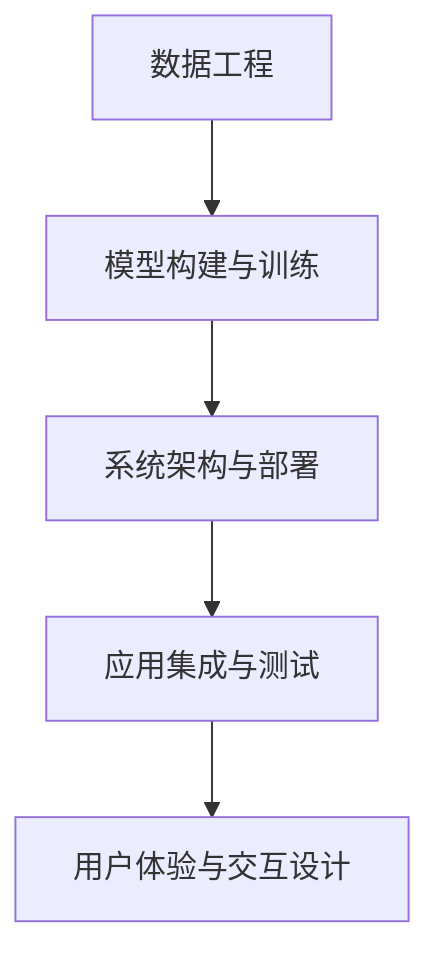

                 

# AI工程学：实战开发指南

> 关键词：AI工程学, 人工智能实战, 机器学习, 深度学习, 计算机视觉, 自然语言处理, 数据工程, 工程架构

## 1. 背景介绍

### 1.1 问题由来

在当今数字化、信息化时代，人工智能(AI)已经成为推动社会进步的重要力量。AI不仅在科学研究、智能制造等领域发挥着关键作用，更在金融、医疗、教育等社会服务行业展示了巨大潜力。然而，AI技术的落地应用并非一帆风顺。研发、部署、维护一条AI产品线的全流程涉及众多环节，单靠技术算法难以实现成功。AI工程学（AI Engineering）由此应运而生，强调AI技术的工程化和系统化开发，弥补了AI研究与实际应用之间的鸿沟。

AI工程学的兴起，源于业界对AI技术在落地应用过程中遇到的一系列挑战。这些问题包括但不限于：

- **数据管理与处理**：AI应用通常需要大量标注数据，数据质量、数据管理和数据处理效率直接影响模型性能。
- **模型构建与训练**：模型设计、超参数调优、分布式训练等技术难题需要专业工程技能。
- **产品部署与运维**：模型上线、性能监控、故障排查等运维工作需要严谨的系统架构和工程实践。
- **应用集成与集成测试**：AI产品往往需要与其他系统集成，确保与现有系统兼容性和稳定性。
- **人机交互与用户体验**：AI应用需要考虑用户界面设计、交互逻辑、反馈机制等用户体验问题。

为解决上述问题，AI工程学整合了数据工程、系统架构、软件工程等多个领域的知识，构建了一套全面、系统的AI产品开发流程。本指南旨在通过详细讲解AI工程学的核心概念与实践技术，帮助读者掌握从算法设计到系统部署的全流程技能，顺利将AI技术应用于实际业务场景中。

### 1.2 问题核心关键点

AI工程学集成了数据工程、系统架构、软件工程等多个领域的知识，构建了一套全面、系统的AI产品开发流程。其中，关键点包括以下几方面：

- **数据工程**：通过数据收集、清洗、标注、存储等环节，为AI模型提供高质量的数据支持。
- **模型构建与训练**：涵盖模型架构设计、特征工程、超参数调优、分布式训练等技术细节。
- **系统架构与部署**：包括模型选择、系统架构设计、模型微调、容器化、部署优化等工程实践。
- **应用集成与测试**：涉及API设计、系统集成、测试策略、故障排错等技术问题。
- **用户体验与交互设计**：通过界面设计、交互逻辑、反馈机制等，提升用户的使用体验。

这些关键点共同构成了AI工程学的核心框架，为AI技术的工程化和系统化开发提供了有效指导。

## 2. 核心概念与联系

### 2.1 核心概念概述

为更好地理解AI工程学的核心概念，本节将介绍几个密切相关的核心概念：

- **数据工程**：涉及数据的收集、清洗、标注、存储等环节，为AI模型提供高质量的数据支持。
- **模型构建与训练**：涵盖模型架构设计、特征工程、超参数调优、分布式训练等技术细节。
- **系统架构与部署**：包括模型选择、系统架构设计、模型微调、容器化、部署优化等工程实践。
- **应用集成与测试**：涉及API设计、系统集成、测试策略、故障排错等技术问题。
- **用户体验与交互设计**：通过界面设计、交互逻辑、反馈机制等，提升用户的使用体验。

这些核心概念之间的逻辑关系可以通过以下Mermaid流程图来展示：



这个流程图展示了我们AI工程学工作的核心流程：

1. 首先通过数据工程获取高质量的数据集。
2. 在数据集基础上进行模型构建与训练，构建出高性能的AI模型。
3. 将模型部署到生产环境中，通过系统架构设计、模型微调等工程实践确保其稳定运行。
4. 对AI产品进行应用集成与测试，确保其与其他系统兼容性和稳定性。
5. 最后通过用户体验与交互设计，提升用户的使用体验。

这些核心概念共同构成了AI工程学的学习和实践框架，使其能够顺利将AI技术应用于实际业务场景中。

## 3. 核心算法原理 & 具体操作步骤
### 3.1 算法原理概述

AI工程学涉及的算法原理丰富多样，涵盖数据处理、模型训练、系统架构等多个方面。以下对其中一些核心算法原理进行概述：

- **数据预处理**：通过数据清洗、标准化、归一化等预处理操作，提高数据质量，为模型训练提供更好的输入。
- **特征工程**：通过特征提取、特征选择、特征变换等方法，优化模型输入特征，提升模型性能。
- **模型训练**：通过选择合适的损失函数、优化器、学习率等，训练模型参数，优化模型性能。
- **分布式训练**：通过将训练任务分布到多台机器上并行计算，提高训练效率，加速模型训练。
- **模型微调**：通过在少量标注数据上微调模型参数，使模型更适应特定任务，提升模型性能。
- **系统架构设计**：通过选择合适的架构模式、容器化技术、服务编排等，设计出高效、可扩展的系统架构。
- **应用集成测试**：通过单元测试、集成测试、负载测试等，确保系统稳定性，避免集成错误。
- **用户体验设计**：通过界面设计、交互逻辑、反馈机制等，提升用户的使用体验。

这些算法原理共同构成了AI工程学的核心算法体系，为AI技术的工程化和系统化开发提供了科学指导。

### 3.2 算法步骤详解

以下对AI工程学的主要算法步骤进行详细讲解：

**Step 1: 数据工程**

- **数据收集**：从多种数据源（如数据库、API、爬虫等）获取数据。
- **数据清洗**：删除重复、无关、缺失数据，修正错误。
- **数据标注**：对数据进行标注，如分类、标记等。
- **数据存储**：将数据存储到高效、可扩展的数据库中，如Hadoop、MySQL等。

**Step 2: 模型构建与训练**

- **特征工程**：选择、提取、转换、选择特征。
- **模型选择**：选择适合任务需求的模型，如线性回归、决策树、神经网络等。
- **超参数调优**：通过网格搜索、随机搜索等方法，寻找最佳超参数组合。
- **分布式训练**：将训练任务并行化，提高训练效率。
- **模型微调**：在少量标注数据上微调模型参数，提升模型性能。

**Step 3: 系统架构与部署**

- **架构设计**：选择适合任务需求的架构模式，如微服务、微核等。
- **容器化**：将模型部署到容器化环境中，如Docker、Kubernetes等。
- **模型微调**：在少量标注数据上微调模型参数，提升模型性能。
- **部署优化**：通过负载均衡、缓存优化等方法，提高系统性能。

**Step 4: 应用集成与测试**

- **API设计**：设计符合业务需求的API接口。
- **系统集成**：将AI模型与其他系统集成，确保兼容性。
- **测试策略**：制定测试计划，进行单元测试、集成测试、负载测试等。
- **故障排错**：通过日志分析、监控工具等手段，及时发现和解决故障。

**Step 5: 用户体验与交互设计**

- **界面设计**：设计符合用户习惯、美观、易用的界面。
- **交互逻辑**：设计符合用户需求的交互逻辑。
- **反馈机制**：设计反馈机制，提升用户满意度。

这些算法步骤共同构成了AI工程学的核心实践流程，为AI技术的工程化和系统化开发提供了科学指导。

### 3.3 算法优缺点

AI工程学涉及的算法具有以下优点：

- **系统性**：将AI技术的研发、部署、运维等环节系统化，提高了AI项目的成功率。
- **高效性**：通过数据预处理、分布式训练等技术，显著提高了AI模型的训练效率。
- **可扩展性**：通过架构设计、容器化等方法，使系统具有更好的可扩展性。
- **易用性**：通过API设计、用户体验设计等方法，提升了AI产品的易用性。

同时，这些算法也存在一些缺点：

- **技术复杂性**：涉及数据工程、系统架构、软件工程等多个领域的知识，对开发者要求较高。
- **成本高**：数据标注、模型训练、系统部署等环节成本较高，尤其是对于大型项目。
- **易用性不足**：对于非AI领域的开发者，学习曲线较陡峭，需要时间和实践积累。

尽管存在这些缺点，但AI工程学仍是大数据、人工智能技术落地的重要方法论，通过科学管理与实践，可以最大化地发挥AI技术的应用潜力。

### 3.4 算法应用领域

AI工程学在多个领域中都有广泛的应用，例如：

- **金融科技**：在金融风控、智能投顾、量化交易等领域，利用AI模型提升业务效率和决策水平。
- **医疗健康**：在医疗影像、病历分析、药物研发等领域，利用AI模型辅助医生诊断和治疗。
- **智能制造**：在智能检测、故障预测、质量控制等领域，利用AI模型提升生产效率和产品质量。
- **智慧城市**：在城市交通管理、环境监测、安全预警等领域，利用AI模型提升城市治理水平。
- **教育培训**：在在线教育、个性化推荐、智能评估等领域，利用AI模型提升教学效果和学生体验。

以上领域仅是冰山一角，AI工程学覆盖的应用范围非常广泛，几乎涉及到所有行业。

## 4. 数学模型和公式 & 详细讲解 & 举例说明

### 4.1 数学模型构建

AI工程学中涉及的数学模型构建，主要围绕数据处理、模型训练、系统优化等方面展开。以下对其中几个关键数学模型进行讲解：

- **线性回归模型**：线性回归模型用于预测连续变量，数学表达式为 $y = \beta_0 + \beta_1x_1 + \beta_2x_2 + ... + \beta_nx_n + \epsilon$。其中 $y$ 为预测变量，$x_i$ 为特征变量，$\beta_i$ 为回归系数，$\epsilon$ 为误差项。
- **决策树模型**：决策树模型用于分类和回归，通过构建树形结构对数据进行分割，数学表达式为 $y = f(x, \theta)$，其中 $f$ 为决策函数，$\theta$ 为模型参数。
- **神经网络模型**：神经网络模型用于复杂的分类和回归任务，通过多层神经元对数据进行处理，数学表达式为 $y = h(Wx + b)$，其中 $h$ 为激活函数，$W$ 和 $b$ 为模型参数。

### 4.2 公式推导过程

以下对几个核心数学模型的公式推导过程进行详细讲解：

**线性回归模型**：

假设有一组训练数据 $(x_i, y_i)$，其中 $x_i = [x_{i1}, x_{i2}, ..., x_{in}]$，$y_i$ 为连续变量。则线性回归模型的目标是最小化均方误差：

$$
\mathcal{L}(\theta) = \frac{1}{2N} \sum_{i=1}^N (y_i - h_{\theta}(x_i))^2
$$

其中 $h_{\theta}(x_i) = \theta_0 + \sum_{j=1}^n \theta_jx_{ij}$，$\theta = (\theta_0, \theta_1, ..., \theta_n)^T$。

**决策树模型**：

决策树模型通过递归分割数据集，构建树形结构。假设有 $m$ 个特征 $x_1, x_2, ..., x_m$，$N$ 个训练样本 $D$，则决策树的构建过程如下：

1. 选择最优特征 $x_j$，计算信息增益 $IG$。
2. 将数据集 $D$ 按照 $x_j$ 的值进行分割，得到子集 $D_j^+$ 和 $D_j^-$。
3. 对于子集 $D_j^+$ 和 $D_j^-$，递归进行步骤1和2，直到满足停止条件。

**神经网络模型**：

神经网络模型通过多层神经元对数据进行处理。假设有一层神经元 $z_i = \sum_{j=1}^n w_{ij}x_j + b_i$，则神经元的激活函数 $h(z_i) = max(0, z_i)$。对于 $L$ 层的神经网络，前向传播过程为：

$$
h_i^{(l)} = g(z_i^{(l)}) \quad (l = 1, ..., L)
$$

其中 $z_i^{(l)} = \sum_{j=1}^n w_{ij}^{(l)}h_j^{(l-1)} + b_i^{(l)}$。

### 4.3 案例分析与讲解

以下通过几个实际案例，详细讲解AI工程学在实际应用中的具体应用：

**案例1: 金融风控**

某银行希望利用AI技术提升信用卡欺诈检测的准确率。首先，通过数据工程环节收集信用卡交易记录，清洗和标注数据。然后，构建决策树模型，通过特征选择和超参数调优，在训练集上训练模型，并在验证集上评估模型性能。最终，将训练好的模型部署到生产环境中，实现实时欺诈检测。

**案例2: 医疗影像分析**

某医院希望利用AI技术提升乳腺癌的诊断准确率。首先，通过数据工程环节收集医疗影像数据，清洗和标注数据。然后，构建卷积神经网络模型，通过特征工程和超参数调优，在训练集上训练模型，并在验证集上评估模型性能。最终，将训练好的模型部署到医院的信息系统中，辅助医生进行乳腺癌的诊断和治疗。

**案例3: 智能推荐系统**

某电商公司希望利用AI技术提升用户的购物体验。首先，通过数据工程环节收集用户的历史购物数据，清洗和标注数据。然后，构建神经网络模型，通过特征工程和超参数调优，在训练集上训练模型，并在验证集上评估模型性能。最终，将训练好的模型部署到电商平台的推荐系统中，实现个性化推荐。

这些案例展示了AI工程学在实际应用中的广泛应用，通过科学管理与实践，可以最大化地发挥AI技术的应用潜力。

## 5. 项目实践：代码实例和详细解释说明

### 5.1 开发环境搭建

在进行AI工程学项目实践前，我们需要准备好开发环境。以下是使用Python进行PyTorch开发的环境配置流程：

1. 安装Anaconda：从官网下载并安装Anaconda，用于创建独立的Python环境。

2. 创建并激活虚拟环境：
```bash
conda create -n pytorch-env python=3.8 
conda activate pytorch-env
```

3. 安装PyTorch：根据CUDA版本，从官网获取对应的安装命令。例如：
```bash
conda install pytorch torchvision torchaudio cudatoolkit=11.1 -c pytorch -c conda-forge
```

4. 安装TensorFlow：从官网下载并按照官方文档进行安装。

5. 安装各类工具包：
```bash
pip install numpy pandas scikit-learn matplotlib tqdm jupyter notebook ipython
```

完成上述步骤后，即可在`pytorch-env`环境中开始AI工程学实践。

### 5.2 源代码详细实现

下面以线性回归模型为例，给出使用PyTorch实现数据预处理、模型训练和系统优化的完整代码实现。

```python
import numpy as np
import torch
import torch.nn as nn
from sklearn.model_selection import train_test_split
from sklearn.metrics import mean_squared_error

# 数据预处理
def load_data():
    X = np.loadtxt('data.csv', delimiter=',')
    y = np.loadtxt('labels.csv', delimiter=',')
    X_train, X_test, y_train, y_test = train_test_split(X, y, test_size=0.2)
    return X_train, X_test, y_train, y_test

# 模型定义
class LinearRegression(nn.Module):
    def __init__(self, input_dim, output_dim):
        super(LinearRegression, self).__init__()
        self.linear = nn.Linear(input_dim, output_dim)

    def forward(self, x):
        out = self.linear(x)
        return out

# 模型训练
def train_model(model, X_train, y_train, X_test, y_test, learning_rate, epochs):
    criterion = nn.MSELoss()
    optimizer = torch.optim.SGD(model.parameters(), lr=learning_rate)
    
    for epoch in range(epochs):
        running_loss = 0.0
        for i in range(len(X_train)):
            inputs = torch.from_numpy(X_train[i,:]).float()
            targets = torch.from_numpy(y_train[i,:]).float()
            optimizer.zero_grad()
            outputs = model(inputs)
            loss = criterion(outputs, targets)
            loss.backward()
            optimizer.step()
            running_loss += loss.item()
        print(f'Epoch {epoch+1}, loss: {running_loss/len(X_train):.4f}')
    
    # 模型评估
    with torch.no_grad():
        predictions = model(torch.from_numpy(X_test)).detach().numpy()
        mse = mean_squared_error(y_test, predictions)
        print(f'Test MSE: {mse:.4f}')

# 运行示例
if __name__ == '__main__':
    X_train, X_test, y_train, y_test = load_data()
    model = LinearRegression(input_dim=2, output_dim=1)
    train_model(model, X_train, y_train, X_test, y_test, learning_rate=0.01, epochs=1000)
```

在这个代码示例中，我们首先定义了数据预处理函数`load_data`，用于加载和分割数据集。然后，定义了线性回归模型的类`LinearRegression`，并在`forward`方法中实现了模型的前向传播。

在`train_model`函数中，我们定义了模型的损失函数为均方误差损失，优化器为随机梯度下降(SGD)，并在每个epoch中对模型进行前向传播、损失计算、反向传播和参数更新。最后，在测试集上评估模型性能。

### 5.3 代码解读与分析

让我们再详细解读一下关键代码的实现细节：

**数据预处理函数**：
- `load_data`函数：从文件中加载数据集，并使用`train_test_split`方法将其分割为训练集和测试集。

**模型定义类**：
- `LinearRegression`类：继承自`nn.Module`，定义了线性回归模型的架构。在`__init__`方法中定义了线性层，并在`forward`方法中实现了前向传播。

**模型训练函数**：
- `train_model`函数：定义了损失函数、优化器等关键参数，并在每个epoch中执行前向传播、损失计算、反向传播和参数更新。

**模型评估**：
- 在测试集上计算模型的均方误差，评估模型性能。

可以看到，PyTorch提供了丰富的工具和API，可以轻松实现数据预处理、模型训练、模型评估等核心操作，极大简化了AI工程学的实践流程。

当然，工业级的系统实现还需考虑更多因素，如模型的保存和部署、超参数的自动搜索、更灵活的任务适配层等。但核心的实践流程基本与此类似。

## 6. 实际应用场景

### 6.1 金融科技

AI工程学在金融科技领域的应用广泛且深入。利用AI技术，金融机构可以在风险管理、欺诈检测、信用评估等多个方面提升业务效率和决策水平。例如，通过构建决策树模型，可以实时分析客户的信用记录和行为数据，预测其违约风险，辅助银行进行贷款审批和风险控制。此外，通过构建神经网络模型，可以实时监控市场波动，预测股票价格，辅助投资者进行投资决策。

### 6.2 医疗健康

AI工程学在医疗健康领域的应用同样广泛。利用AI技术，医疗机构可以在疾病诊断、医学影像分析、药物研发等多个方面提升诊疗效果和治疗效率。例如，通过构建卷积神经网络模型，可以实时分析医学影像数据，辅助医生进行疾病诊断和治疗方案选择。此外，通过构建神经网络模型，可以模拟药物分子结构和反应路径，加速新药研发进程。

### 6.3 智能制造

AI工程学在智能制造领域的应用主要集中在生产自动化、故障预测和质量控制等方面。利用AI技术，制造企业可以在生产过程中实现自动化和智能化，提高生产效率和产品质量。例如，通过构建神经网络模型，可以实时监控生产设备的运行状态，预测其故障发生概率，辅助维护人员进行设备检修。此外，通过构建神经网络模型，可以对产品质量进行实时检测，提高产品的合格率和用户满意度。

### 6.4 智慧城市

AI工程学在智慧城市领域的应用主要集中在城市管理、交通管理、环境监测等方面。利用AI技术，城市管理者可以在交通管理、垃圾处理、能源管理等多个方面提升城市治理水平。例如，通过构建神经网络模型，可以实时分析交通流量数据，优化交通信号灯控制，缓解交通拥堵。此外，通过构建神经网络模型，可以实时监测环境污染数据，辅助环保部门进行污染治理。

### 6.5 教育培训

AI工程学在教育培训领域的应用主要集中在智能评估、个性化推荐、在线教育等方面。利用AI技术，教育机构可以在学生评估、课程推荐、学习路径优化等多个方面提升教学效果和学习体验。例如，通过构建神经网络模型，可以实时分析学生的学习数据，预测其学习成果，辅助教师进行教学优化。此外，通过构建推荐系统，可以为学生推荐适合的课程和学习资源，提高学习效率和效果。

## 7. 工具和资源推荐

### 7.1 学习资源推荐

为了帮助开发者系统掌握AI工程学的理论基础和实践技术，这里推荐一些优质的学习资源：

1. 《深度学习》课程：斯坦福大学开设的深度学习经典课程，涵盖深度学习的基础理论和实践应用。

2. 《机器学习实战》书籍：Wes McKinney所著，详细讲解了机器学习的理论基础和实践方法。

3. 《Python深度学习》书籍：Francois Chollet所著，深入讲解了TensorFlow和Keras的使用方法和实践技巧。

4. 《TensorFlow实战》书籍：Chuck Wonnacott所著，详细讲解了TensorFlow的架构和应用方法。

5. 《Kaggle竞赛指南》书籍：Kaggle官方指南，详细讲解了数据科学竞赛的流程和技巧。

通过对这些资源的学习实践，相信你一定能够快速掌握AI工程学的精髓，并用于解决实际的AI问题。

### 7.2 开发工具推荐

高效的开发离不开优秀的工具支持。以下是几款用于AI工程学开发的常用工具：

1. PyTorch：基于Python的开源深度学习框架，灵活动态的计算图，适合快速迭代研究。

2. TensorFlow：由Google主导开发的开源深度学习框架，生产部署方便，适合大规模工程应用。

3. TensorFlow Serving：TensorFlow的模型服务框架，支持模型快速部署和高效推理。

4. Kubernetes：开源容器编排系统，支持容器化应用的自动扩展和管理。

5. Jupyter Notebook：交互式编程环境，支持多种语言和库，适合快速开发和调试。

6. GitLab：开源代码托管平台，支持CI/CD、版本控制等，适合团队协作和持续集成。

合理利用这些工具，可以显著提升AI工程学的开发效率，加快创新迭代的步伐。

### 7.3 相关论文推荐

AI工程学的发展离不开学界的持续研究。以下是几篇奠基性的相关论文，推荐阅读：

1. "Deep Learning" by Ian Goodfellow, Yoshua Bengio, and Aaron Courville。

2. "TensorFlow: A System for Large-Scale Machine Learning" by Jeff Dean et al.

3. "GPU Accelerated Machine Learning on the Google Cloud Platform" by Sanjay Ghemawat et al.

4. "Deep Neural Network Architecture Search with Physics-Informed Neural Architecture Search Space" by Sergey Zagoruyko et al.

5. "Mixed Precision Training of Deep Neural Networks" by Chris Loftus et al.

这些论文代表了大数据、人工智能技术的发展脉络。通过学习这些前沿成果，可以帮助研究者把握学科前进方向，激发更多的创新灵感。

## 8. 总结：未来发展趋势与挑战

### 8.1 研究成果总结

AI工程学作为AI技术的工程化和系统化开发方法论，已经得到了广泛应用，并在多个领域取得了显著成果。其在金融科技、医疗健康、智能制造、智慧城市、教育培训等领域的实践案例，展示了AI工程学的强大应用潜力。同时，AI工程学的学习资源和开发工具也为开发者提供了全面的技术支持。

### 8.2 未来发展趋势

展望未来，AI工程学将呈现以下几个发展趋势：

1. 自动化与智能化：AI工程学的自动化和智能化程度将不断提升，开发效率和效果将进一步提升。

2. 模型优化与高效部署：模型压缩、量化、分布式训练等技术将得到进一步发展，模型的部署效率和运行性能将显著提升。

3. 跨领域知识融合：AI工程学将与其他领域的知识进行更深层次的融合，如自然语言处理、计算机视觉、认知科学等。

4. 多模态数据整合：AI工程学将支持多模态数据的整合，实现视觉、语音、文本等不同模态信息的协同建模。

5. 可解释性与透明度：AI工程学将更加注重模型的可解释性和透明度，提高用户对AI系统的信任和接受度。

### 8.3 面临的挑战

尽管AI工程学已经取得了显著成果，但在其发展过程中仍面临一些挑战：

1. 数据质量与获取：高质量数据的获取和处理成本较高，尤其是在小样本场景下。

2. 模型复杂性与维护：大规模、复杂模型的维护成本较高，需要高水平的技术团队。

3. 系统复杂性与集成：跨系统、跨平台的集成和互操作性问题复杂，需要协同开发。

4. 安全性与隐私保护：AI模型可能存在安全隐患，用户隐私保护问题亟需解决。

5. 法律与伦理问题：AI模型的使用过程中可能涉及法律和伦理问题，需要严格的监管和规范。

### 8.4 研究展望

面对AI工程学面临的挑战，未来的研究需要在以下几个方面寻求新的突破：

1. 数据增强与生成技术：通过数据增强和生成技术，减少对高质量标注数据的依赖，提升数据质量和多样性。

2. 模型压缩与优化技术：通过模型压缩和优化技术，降低模型复杂性和维护成本，提升模型的运行效率。

3. 跨领域知识融合方法：通过跨领域知识融合方法，实现不同领域知识的整合，提高AI模型的泛化能力和应用范围。

4. 多模态数据整合技术：通过多模态数据整合技术，实现视觉、语音、文本等不同模态信息的协同建模，提升模型的全面性和准确性。

5. 安全性与隐私保护方法：通过安全性和隐私保护方法，确保AI模型的安全性，保护用户隐私。

6. 法律与伦理规范：通过制定法律与伦理规范，确保AI模型的合规性和透明性。

这些研究方向将引领AI工程学迈向更高的台阶，为AI技术的工程化和系统化开发提供新的突破点。

## 9. 附录：常见问题与解答

**Q1：AI工程学与传统软件开发有何不同？**

A: AI工程学强调数据驱动、模型驱动的开发方式，传统软件开发则更多依赖于代码驱动。AI工程学注重数据工程、模型构建、系统部署等多个环节的协同工作，而传统软件开发则更注重代码实现和功能测试。

**Q2：AI工程学对开发人员的技术要求有哪些？**

A: AI工程学对开发人员的技术要求较高，需要掌握数据工程、模型构建、系统部署等多个方面的知识。具体要求包括：

- 数据预处理：掌握数据清洗、标准化、归一化等数据预处理技术。
- 模型构建：掌握各种机器学习、深度学习模型的构建和调优方法。
- 系统部署：掌握容器化、分布式训练、模型微调等系统部署技术。
- 测试与监控：掌握单元测试、集成测试、性能监控等测试与监控方法。

**Q3：AI工程学的应用场景有哪些？**

A: AI工程学的应用场景非常广泛，涵盖了金融科技、医疗健康、智能制造、智慧城市、教育培训等多个领域。以下是一些具体应用场景：

- 金融科技：信用评估、风险管理、欺诈检测等。
- 医疗健康：疾病诊断、医学影像分析、药物研发等。
- 智能制造：故障预测、质量控制、生产自动化等。
- 智慧城市：交通管理、环境监测、能源管理等。
- 教育培训：个性化推荐、智能评估、在线教育等。

**Q4：AI工程学的学习资源有哪些？**

A: AI工程学的学习资源非常丰富，包括在线课程、书籍、论文等多种形式。以下是一些推荐的学习资源：

- 在线课程：Coursera、edX、Udacity等平台提供的数据科学、机器学习、深度学习课程。
- 书籍：《深度学习》、《机器学习实战》、《Python深度学习》等书籍详细讲解了AI工程学的理论基础和实践方法。
- 论文：arXiv、Google Scholar等平台提供了大量的AI工程学研究论文，可以深入了解前沿技术。

通过对这些资源的学习实践，相信你一定能够快速掌握AI工程学的精髓，并用于解决实际的AI问题。

