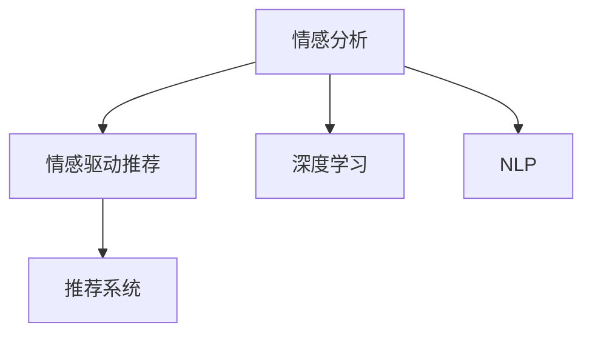

                 

# AI情感驱动推荐系统的优势

## 1. 背景介绍

### 1.1 问题由来

随着人工智能技术的迅速发展，推荐系统成为了互联网企业提高用户体验、增加收益的重要工具。然而，传统的推荐系统大多基于用户的历史行为数据进行推荐，这种方式虽然有效，但在用户行为不明确、数据稀疏时表现不佳。情感分析技术的引入，为推荐系统开辟了新的方向。

情感分析，即通过文本分析、图像识别等方式，自动提取和分析用户对于产品、服务、内容等的情感倾向。这种分析可以与推荐系统结合，使推荐系统能够更好地理解用户情绪，并据此进行个性化推荐。例如，在商品推荐中，情感分析可以识别出用户对于某类商品的不满和反感，从而减少推荐这类商品的概率。

情感驱动推荐系统（Emotion-Driven Recommendation System）作为基于情感分析技术的推荐系统，近年来在电子商务、社交网络、内容平台等应用中逐渐崭露头角，成为推荐系统领域的一个重要分支。

### 1.2 问题核心关键点

情感驱动推荐系统通过情感分析技术，识别和理解用户的情感状态，并将其作为推荐依据，以实现更符合用户心理预期的个性化推荐。其核心问题包括：

- 情感分析的准确性：情感分析模型需要准确识别和理解用户的情感状态，才能保证推荐系统的有效性。
- 推荐策略的合理性：推荐系统需结合情感分析结果，设计合理的推荐策略，保证推荐内容的优质和多样性。
- 系统整体的实时性：情感驱动推荐系统需具备高效的数据处理和实时推荐能力，以提升用户体验。

## 2. 核心概念与联系

### 2.1 核心概念概述

为更好地理解情感驱动推荐系统的核心思想和工作原理，本节将介绍几个关键概念：

- 情感分析（Sentiment Analysis）：通过自然语言处理（NLP）技术，识别文本中的情感倾向，通常分为正面、负面和中性。
- 情感驱动推荐（Emotion-Driven Recommendation）：基于用户的情感状态，调整推荐算法，以提升推荐效果。
- 推荐系统（Recommendation System）：利用用户的历史行为数据，通过算法计算生成推荐内容，以提升用户满意度。
- 深度学习（Deep Learning）：利用神经网络等深度学习技术，进行数据特征提取和模式识别。
- 自然语言处理（NLP）：处理和分析自然语言文本，进行语言理解、信息提取等任务。

这些核心概念之间的逻辑关系可以通过以下Mermaid流程图来展示：



这个流程图展示了几大核心概念之间的联系：

1. 情感分析通过深度学习和自然语言处理技术，从用户文本中提取情感信息。
2. 情感驱动推荐系统将情感信息作为调整推荐策略的依据，优化推荐结果。
3. 推荐系统利用优化后的推荐策略，生成个性化的推荐内容。

## 3. 核心算法原理 & 具体操作步骤
### 3.1 算法原理概述

情感驱动推荐系统通过结合情感分析与推荐算法，实现个性化的推荐。其核心算法原理如下：

1. 收集用户对于商品、服务、内容等的情感反馈数据，进行情感分析，得到用户的情感状态。
2. 根据用户的情感状态，调整推荐算法，生成符合用户情感偏好的推荐内容。
3. 将推荐结果展示给用户，根据用户的反馈，不断优化情感驱动推荐系统。

### 3.2 算法步骤详解

情感驱动推荐系统的具体实现步骤如下：

**Step 1: 数据预处理**

1. 收集用户的情感反馈数据，如评论、评分等。
2. 对数据进行清洗，去除噪声和无用信息。
3. 使用NLP技术对文本数据进行分词、去除停用词、词干提取等处理。

**Step 2: 情感分析**

1. 选择适合的情感分析模型，如基于词典的方法、基于机器学习的方法、基于深度学习的方法等。
2. 使用训练好的情感分析模型，对用户文本进行情感分类，得到用户的情感状态。

**Step 3: 推荐策略设计**

1. 根据用户的情感状态，设计合理的推荐策略。例如，对于负面情感的用户，可以推荐与其情感一致的替代商品，避免用户再次购买不满意商品。
2. 考虑不同情感状态下的推荐权重，优化推荐算法，提高推荐的个性化程度。

**Step 4: 推荐结果生成**

1. 使用推荐算法，生成符合用户情感偏好的推荐内容。
2. 将推荐结果展示给用户，并记录用户反馈，用于后续优化。

**Step 5: 反馈与优化**

1. 根据用户的反馈，不断优化情感驱动推荐系统。
2. 使用用户反馈数据，重新训练情感分析模型，提高情感分析的准确性。

### 3.3 算法优缺点

情感驱动推荐系统具有以下优点：

1. 提升推荐效果：通过情感分析，结合用户情感状态，推荐系统能够提供更加个性化、符合用户心理预期的推荐内容。
2. 减少用户流失：通过识别用户的不满意和负面情绪，及时调整推荐策略，减少用户流失。
3. 实时性：情感驱动推荐系统可以实时分析用户的情感状态，并动态调整推荐策略，提升用户体验。

但同时，该系统也存在一些局限性：

1. 数据获取困难：情感反馈数据的收集和清洗难度较大，需要大量人工干预。
2. 情感分析准确性：情感分析模型的准确性直接影响推荐系统的效果。
3. 推荐策略设计复杂：不同的情感状态对应不同的推荐策略，策略设计复杂且需要不断优化。
4. 推荐公平性：情感驱动推荐系统可能存在偏见，对某些情感状态的用户推荐效果不佳。

### 3.4 算法应用领域

情感驱动推荐系统已经在多个领域得到了应用，例如：

- 电子商务：在电商平台上，情感驱动推荐系统可以识别用户的购物情绪，推荐符合用户情感预期的商品。
- 社交网络：在社交媒体上，情感驱动推荐系统可以根据用户的情感状态，推荐相应的内容和话题。
- 内容平台：在视频、音乐等内容平台上，情感驱动推荐系统可以识别用户的情感状态，推荐与用户情绪相符的内容。

## 4. 数学模型和公式 & 详细讲解
### 4.1 数学模型构建

情感驱动推荐系统的主要数学模型包括情感分析模型和推荐算法模型。

设用户文本为 $X$，情感分析模型为 $S(X)$，推荐算法模型为 $R(S(X))$。则情感驱动推荐系统的整体模型为 $F(X) = R(S(X))$。

### 4.2 公式推导过程

假设情感分析模型为基于深度学习的BERT模型，其输出为情感状态 $S(X)$。推荐算法模型为基于协同过滤的算法，如基于矩阵分解的方法，其输出为推荐内容 $R$。则推荐系统整体的模型推导过程如下：

1. 情感分析模型输出情感状态 $S(X) \in \{0,1\}$，其中0表示负面情感，1表示正面情感。
2. 推荐算法模型根据情感状态 $S(X)$，生成推荐内容 $R(S(X))$。
3. 情感驱动推荐系统的整体模型为 $F(X) = R(S(X))$。

### 4.3 案例分析与讲解

以下以电商平台的情感驱动推荐系统为例，进行具体分析：

**案例场景**：用户在电商平台浏览某款手机，并留下了一条评论，情感分析模型识别出用户对该手机的情感状态为负面。

**分析步骤**：

1. 情感分析模型对用户评论进行情感分析，识别出用户对手机的负面情感。
2. 推荐算法模型根据用户情感状态，生成手机相关的替代品牌、型号等推荐内容。
3. 推荐系统展示推荐内容，用户可以选择接受推荐，也可以手动调整推荐策略，优化情感驱动推荐系统。

## 5. 项目实践：代码实例和详细解释说明
### 5.1 开发环境搭建

在进行情感驱动推荐系统开发前，我们需要准备好开发环境。以下是使用Python进行开发的环境配置流程：

1. 安装Anaconda：从官网下载并安装Anaconda，用于创建独立的Python环境。

2. 创建并激活虚拟环境：
```bash
conda create -n emotion_recog_env python=3.8 
conda activate emotion_recog_env
```

3. 安装相关库：
```bash
pip install torch torchtext sklearn pandas
```

4. 安装情感分析工具：
```bash
pip install vaderSentiment
```

5. 安装推荐算法工具：
```bash
pip install Surprise
```

完成上述步骤后，即可在`emotion_recog_env`环境中开始开发。

### 5.2 源代码详细实现

以下是一个基于情感分析的电商推荐系统示例代码实现：

```python
from surprise import Reader, Dataset, SVD
from surprise.prediction_algorithms import SVD
from vaderSentiment.vaderSentiment import SentimentIntensityAnalyzer
import pandas as pd
import torch
import torchtext

# 数据预处理
def preprocess_data(data):
    # 清洗数据
    cleaned_data = data.apply(lambda x: re.sub('[^a-zA-Z0-9\s]', '', x))
    # 分词
    tokenizer = torchtext.data.utils.get_tokenizer('basic_english')
    tokenized_data = cleaned_data.apply(lambda x: tokenizer(x))
    # 转换为文本表示
    text_data = [torch.tensor(tokenized_data[i], dtype=torch.long) for i in range(len(cleaned_data))]
    # 转换为标签
    label_data = cleaned_data.apply(lambda x: 1 if x == 'positive' else 0)
    return text_data, label_data

# 情感分析
def sentiment_analysis(text_data, label_data):
    sid = SentimentIntensityAnalyzer()
    scores = []
    for text in text_data:
        score = sid.polarity_scores(text)
        if score['compound'] > 0:
            label = 1
        else:
            label = 0
        scores.append(label)
    return scores, label_data

# 推荐算法
def recommendation_algorithm(data, labels, scores):
    reader = Reader(rating_scale=(0, 1))
    data = Dataset.load_from_df(data, reader)
    algo = SVD()
    algo.fit(data.build_full_trainset())
    pred = algo.test(test_data)
    # 计算推荐权重
    weights = [1 if label == 1 else 0.5 for label in labels]
    weighted_pred = [pred[i] * weights[i] for i in range(len(pred))]
    # 生成推荐内容
    recommendations = data.titles[np.argmax(weighted_pred)]
    return recommendations

# 加载数据
data = pd.read_csv('product_reviews.csv')
text_data, label_data = preprocess_data(data)
scores, label_data = sentiment_analysis(text_data, label_data)

# 推荐内容生成
recommendations = recommendation_algorithm(data, label_data, scores)
print('推荐内容：', recommendations)
```

### 5.3 代码解读与分析

让我们再详细解读一下关键代码的实现细节：

**SentimentIntensityAnalyzer类**：
- 使用vaderSentiment库中的SentimentIntensityAnalyzer，对输入文本进行情感分析，返回文本的情感得分。

**SVD类**：
- 使用Surprise库中的SVD算法，对用户评分数据进行协同过滤推荐。

**preprocess_data函数**：
- 对用户评论进行清洗、分词、转换为文本表示和标签表示，准备数据用于情感分析和推荐算法。

**sentiment_analysis函数**：
- 对输入文本进行情感分析，得到情感得分，并根据得分转换为0或1的标签。

**recommendation_algorithm函数**：
- 使用协同过滤算法，对用户评分数据进行推荐，并根据用户情感状态调整推荐权重。

以上代码实现了基本的情感驱动推荐系统，但实际应用中还需要结合更多的数据、算法和优化策略，才能达到更好的效果。

## 6. 实际应用场景

### 6.1 电商平台推荐

情感驱动推荐系统在电商平台中具有广泛的应用前景。电商平台需要提供个性化的购物推荐，提升用户满意度。通过情感分析，识别用户的购物情绪，推荐符合用户情感预期的商品，可以有效减少用户的不满和流失。

例如，某用户在浏览某款手机时，留下了一条负面评论，情感分析系统识别出用户对手机的负面情绪。根据这一情感反馈，推荐系统可以推荐与手机相似的其他品牌或型号，或者推荐与用户情感相反的正面评价商品，以提高用户的购买欲望。

### 6.2 社交媒体推荐

社交媒体平台需要为用户提供高质量的内容推荐，情感驱动推荐系统可以在这方面发挥重要作用。例如，某用户在评论某部电影时，表达了对电影的负面情感。根据这一情感分析结果，推荐系统可以推荐其他用户对该电影的负面评论，或者推荐与其情感相符的相似电影。

### 6.3 内容平台推荐

内容平台需要推荐符合用户情感预期的视频、文章等内容。通过情感分析，识别用户的情感状态，调整推荐策略，生成符合用户心理预期的推荐内容。例如，某用户在评论某部电影时，表达了对其剧情的正面情感。推荐系统可以推荐与该电影类似的电影，或者推荐电影中的经典片段，提升用户的观看体验。

### 6.4 未来应用展望

情感驱动推荐系统具有广阔的应用前景，未来的发展方向包括：

1. 多模态数据融合：除了文本数据，还可以结合图像、视频等多模态数据进行情感分析，进一步提升推荐系统的精度和鲁棒性。
2. 个性化推荐模型：基于用户的情感状态，设计更加个性化、符合用户心理预期的推荐模型。
3. 实时推荐系统：通过实时分析用户的情感状态，动态调整推荐策略，提高推荐系统的实时性。
4. 推荐系统优化：通过不断优化推荐算法和情感分析模型，提升系统的准确性和稳定性。
5. 用户反馈机制：引入用户反馈机制，不断优化情感驱动推荐系统，提高用户体验。

## 7. 工具和资源推荐

### 7.1 学习资源推荐

为了帮助开发者系统掌握情感驱动推荐系统的理论基础和实践技巧，这里推荐一些优质的学习资源：

1. 《深度学习》书籍：由Ian Goodfellow、Yoshua Bengio、Aaron Courville所著，详细介绍了深度学习的基本原理和实践方法。
2. 《推荐系统》书籍：由Wenwu Zhu、Geoffrey Gordon、Tong Zhang所著，介绍了推荐系统的基本框架和最新研究成果。
3. 《自然语言处理入门》课程：由斯坦福大学李飞飞教授主讲，介绍了自然语言处理的基本概念和关键技术。
4. 《情感分析》课程：由NLP知名专家Geoffrey Zweig主讲，介绍了情感分析的基本原理和最新应用。
5. 《推荐系统课程》：由卡耐基梅隆大学Edoardo Melnyk教授主讲，介绍了推荐系统的基本原理和最新研究成果。

通过对这些资源的学习实践，相信你一定能够快速掌握情感驱动推荐系统的精髓，并用于解决实际的推荐问题。

### 7.2 开发工具推荐

高效的开发离不开优秀的工具支持。以下是几款用于情感驱动推荐系统开发的常用工具：

1. PyTorch：基于Python的开源深度学习框架，灵活动态的计算图，适合快速迭代研究。
2. TensorFlow：由Google主导开发的开源深度学习框架，生产部署方便，适合大规模工程应用。
3. Surprise：开源推荐系统库，提供了多种推荐算法和评估指标，方便快速开发推荐系统。
4. VADERSentiment：基于Python的自然语言处理库，提供了情感分析功能，方便情感驱动推荐系统的开发。
5. Jupyter Notebook：开源的交互式笔记本，方便开发者进行数据处理和算法调试。

合理利用这些工具，可以显著提升情感驱动推荐系统的开发效率，加快创新迭代的步伐。

### 7.3 相关论文推荐

情感驱动推荐系统作为推荐系统的新兴分支，近年来受到了广泛关注。以下是几篇奠基性的相关论文，推荐阅读：

1. A Survey on Sentiment Analysis and Opinion Mining (2010)：J. Wiebe等，综述了情感分析的基本原理和应用场景。
2. TextRank: Bring Order into Texts by Ranking Phrases (2002)：J. Mihalcea等，介绍了一种基于图模型的文本排序方法，用于情感分析。
3. Word2Vec: Efficient Estimation of Word Representations in Vector Space (2013)：T. Mikolov等，提出了一种基于神经网络的文本表示方法，用于情感分析。
4. Dive into Deep Learning (2016)：Ian Goodfellow等，介绍深度学习的基本原理和最新进展。
5. Collaborative Filtering for Implicit Feedback Datasets (2008)：A. Bobadilla等，介绍协同过滤推荐算法的基本原理和应用场景。

这些论文代表了大语言模型微调技术的发展脉络。通过学习这些前沿成果，可以帮助研究者把握学科前进方向，激发更多的创新灵感。

## 8. 总结：未来发展趋势与挑战

### 8.1 总结

本文对情感驱动推荐系统进行了全面系统的介绍。首先阐述了情感驱动推荐系统的背景和意义，明确了其在推荐系统中的重要地位。其次，从原理到实践，详细讲解了情感驱动推荐系统的数学模型和实现步骤，给出了情感驱动推荐系统开发的完整代码实例。同时，本文还探讨了情感驱动推荐系统在电商平台、社交网络、内容平台等实际应用场景中的应用前景，展示了情感驱动推荐系统的广阔应用前景。最后，本文精选了情感驱动推荐系统的学习资源、开发工具和相关论文，力求为读者提供全方位的技术指引。

通过本文的系统梳理，可以看到，情感驱动推荐系统在推荐系统中具有重要价值，通过结合情感分析与推荐算法，能够提供更加个性化、符合用户心理预期的推荐内容。未来，伴随情感分析技术、推荐算法和计算技术的不断进步，情感驱动推荐系统将具有更广泛的应用前景，为推荐系统的创新发展注入新的动力。

### 8.2 未来发展趋势

展望未来，情感驱动推荐系统将呈现以下几个发展趋势：

1. 多模态数据融合：除了文本数据，还可以结合图像、视频等多模态数据进行情感分析，进一步提升推荐系统的精度和鲁棒性。
2. 个性化推荐模型：基于用户的情感状态，设计更加个性化、符合用户心理预期的推荐模型。
3. 实时推荐系统：通过实时分析用户的情感状态，动态调整推荐策略，提高推荐系统的实时性。
4. 推荐系统优化：通过不断优化推荐算法和情感分析模型，提升系统的准确性和稳定性。
5. 用户反馈机制：引入用户反馈机制，不断优化情感驱动推荐系统，提高用户体验。

这些趋势凸显了情感驱动推荐系统的发展潜力，未来还有更多技术方向可以探索和研究。

### 8.3 面临的挑战

尽管情感驱动推荐系统已经取得了一定进展，但在向更深层次应用过程中，仍然面临诸多挑战：

1. 数据获取困难：情感反馈数据的收集和清洗难度较大，需要大量人工干预。
2. 情感分析准确性：情感分析模型的准确性直接影响推荐系统的效果。
3. 推荐策略设计复杂：不同的情感状态对应不同的推荐策略，策略设计复杂且需要不断优化。
4. 推荐公平性：情感驱动推荐系统可能存在偏见，对某些情感状态的用户推荐效果不佳。
5. 系统安全性：情感驱动推荐系统可能受到恶意攻击，导致用户隐私泄露等安全问题。

这些挑战需要进一步研究和解决，以推动情感驱动推荐系统向更深层次应用。

### 8.4 研究展望

面向未来，情感驱动推荐系统需要在以下几个方向进行深入研究：

1. 情感分析模型的优化：提高情感分析模型的准确性和鲁棒性，减少情感分析结果的误差。
2. 推荐策略的优化：设计更加高效、合理的推荐策略，提高推荐系统的个性化程度。
3. 多模态数据的融合：将文本、图像、视频等多模态数据进行融合，提升推荐系统的精度和稳定性。
4. 实时推荐系统的构建：通过实时分析用户的情感状态，动态调整推荐策略，提高推荐系统的实时性。
5. 用户隐私保护：引入隐私保护技术，保护用户的隐私数据，确保情感驱动推荐系统的安全性。

这些研究方向将推动情感驱动推荐系统向更深层次发展，为推荐系统的创新应用提供新的突破。

## 9. 附录：常见问题与解答

**Q1：情感分析的准确性如何保证？**

A: 情感分析的准确性取决于模型的选择和训练数据的质量。常用的情感分析模型包括基于词典的方法、基于机器学习的方法和基于深度学习的方法。选择合适的模型并使用高质量的训练数据，可以有效提高情感分析的准确性。

**Q2：推荐策略如何设计？**

A: 推荐策略的设计需要结合用户的情感状态，考虑不同情感状态下的推荐权重。例如，对于负面情感的用户，可以推荐与其情感一致的替代商品，避免用户再次购买不满意商品。

**Q3：推荐系统如何优化？**

A: 推荐系统的优化可以通过不断调整推荐算法和情感分析模型，提升系统的准确性和稳定性。例如，可以使用协同过滤、内容过滤等推荐算法，结合情感分析结果进行优化。

**Q4：多模态数据的融合如何进行？**

A: 多模态数据的融合可以通过使用集成学习、融合神经网络等方式进行。例如，可以使用LSTM等神经网络对文本、图像等数据进行处理，将不同模态的信息进行融合，提升推荐系统的精度和稳定性。

**Q5：用户隐私如何保护？**

A: 用户隐私保护可以通过数据匿名化、差分隐私等技术进行。例如，对用户的情感数据进行匿名化处理，使用差分隐私技术保护用户的隐私数据。

**Q6：情感驱动推荐系统在实际应用中需要注意什么？**

A: 情感驱动推荐系统在实际应用中需要注意以下几个问题：

1. 数据收集和清洗：需要保证数据的质量和多样性，防止数据偏见。
2. 模型训练：选择合适的模型并使用高质量的训练数据，保证模型的准确性和鲁棒性。
3. 推荐策略设计：根据用户的情感状态，设计合理的推荐策略，提高推荐系统的个性化程度。
4. 系统优化：通过不断优化推荐算法和情感分析模型，提升系统的准确性和稳定性。
5. 用户反馈机制：引入用户反馈机制，不断优化情感驱动推荐系统，提高用户体验。

以上问题需要在实际应用中不断探索和解决，才能保证情感驱动推荐系统的有效性和稳定性。

---

作者：禅与计算机程序设计艺术 / Zen and the Art of Computer Programming

