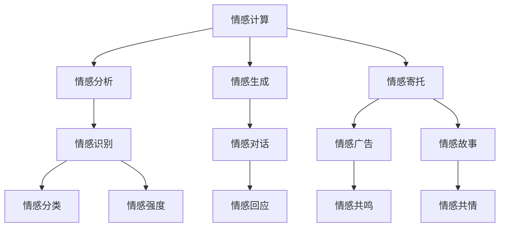

                 

# AI技术与情感寄托的结合

> 关键词：人工智能,情感分析,情感生成,情感寄托,情感计算

## 1. 背景介绍

### 1.1 问题由来
人工智能(AI)技术的快速发展，已经在诸多领域展现出了强大的应用潜力。从自动驾驶到工业控制，从医疗诊断到金融风控，AI正逐步深入各行各业，推动社会向智能化方向迈进。然而，在当前的人工智能范式中，情感的表达和理解往往被忽视。

情感是人类重要的心理属性之一，其对于决策、交流、创造等人类行为的驱动作用不可小觑。情感的缺失，不仅降低了AI系统的用户友好度，也限制了其在复杂任务上的表现。例如，智能客服系统虽然可以处理大量的客户咨询，但往往缺乏情感理解和回应，无法真正满足用户的情感需求；智能推荐系统虽然能够根据用户行为推荐商品，但无法理解用户的情感态度，可能导致推荐结果不契合用户的实际需求。

### 1.2 问题核心关键点
情感计算(EA)是将情感理论与人工智能技术相结合，用于模拟、识别、理解、控制情感的技术体系。情感计算能够帮助AI系统理解人类情感，提升用户满意度，推动AI技术在更复杂的情感场景中落地应用。

情感计算的核心在于对情感数据的获取和情感模型的构建。情感数据通常包括文本、语音、图像等多种类型，如何有效获取和处理这些数据，建立能够真实反映人类情感的计算模型，成为情感计算面临的关键问题。

情感计算的关键技术包括情感分析、情感生成、情感寄托等。情感分析是指通过文本、语音等数据，识别和理解其中的情感倾向，常见的任务有情感识别、情感分类、情感强度分析等。情感生成是指通过AI技术，生成具备一定情感属性的文本、语音等数据，常见的任务有情感对话生成、情感广告生成、情感故事生成等。情感寄托是指将情感计算技术应用于特定场景，解决实际问题，提升用户体验。

## 2. 核心概念与联系

### 2.1 核心概念概述

为更好地理解情感计算与AI技术结合的原理，本节将介绍几个核心概念：

- 情感计算(EA)：结合心理学、计算科学和神经科学等多学科，研究如何利用计算技术模拟、识别、理解、控制情感的理论与方法。

- 情感分析：通过对情感数据的处理，识别和理解其中的情感倾向，常见任务包括情感识别、情感分类、情感强度分析等。

- 情感生成：利用AI技术，生成具备一定情感属性的文本、语音等数据，常见任务包括情感对话生成、情感广告生成、情感故事生成等。

- 情感寄托：将情感计算技术应用于特定场景，解决实际问题，提升用户体验。

- 情感模型：用于描述和模拟情感的计算模型，包括基于规则的模型、统计模型和基于深度学习的模型等。

- 深度学习模型：如RNN、LSTM、GRU、Transformer等，用于处理复杂的情感数据，并构建情感模型。

- 多模态情感计算：结合文本、语音、图像等多种情感数据，建立更全面、更准确的情感计算模型。

这些概念之间的逻辑关系可以通过以下Mermaid流程图来展示：



这个流程图展示了大语言模型的核心概念及其之间的关系：

1. 情感计算是大语言模型研究的基础，涵盖了情感分析、情感生成、情感寄托等多个方面。
2. 情感分析是理解情感的基础，通过情感识别、情感分类、情感强度分析等任务，为情感生成和情感寄托提供数据支持。
3. 情感生成是情感寄托的重要手段，通过生成具备情感属性的文本、语音等数据，可以实现情感表达和情感共鸣。
4. 情感寄托是将情感计算应用于实际场景，解决情感问题，提升用户体验。
5. 情感模型是实现情感计算的工具，通过选择合适的模型，可以有效处理复杂情感数据。

## 3. 核心算法原理 & 具体操作步骤
### 3.1 算法原理概述

情感计算的核心算法原理主要包括以下几个方面：

- 情感数据的获取：通过文本、语音、图像等多种情感数据，获取情感信息。
- 情感数据的处理：将多模态情感数据进行统一处理，生成可供计算的向量表示。
- 情感模型的构建：选择合适的计算模型，建立情感表达和理解的模型。
- 情感计算的应用：将建立的情感模型应用于实际场景，解决情感问题。

### 3.2 算法步骤详解

情感计算的算法步骤如下：

1. 数据收集与预处理：通过各种方式收集情感数据，如文本、语音、图像等，并对数据进行清洗和标准化处理。
2. 特征提取：利用文本处理、语音识别、图像识别等技术，将情感数据转换为可供计算的特征向量。
3. 情感分析：通过情感识别、情感分类、情感强度分析等任务，理解情感数据中的情感倾向。
4. 情感生成：利用文本生成、语音合成等技术，生成具备一定情感属性的文本、语音等数据。
5. 情感寄托：将情感计算技术应用于特定场景，如智能客服、情感分析、情感广告等，解决实际问题，提升用户体验。

### 3.3 算法优缺点

情感计算在提升用户体验和推动AI技术发展方面具有显著优势，但同时也存在一些局限性：

优点：
1. 提升用户满意度：情感计算可以理解用户的情感需求，提供更个性化的服务和推荐。
2. 增强AI系统的表现：情感计算可以帮助AI系统更好地理解任务背景，提高决策的准确性和鲁棒性。
3. 推动AI技术进步：情感计算的应用研究，可以带来新的研究方向和方法，推动AI技术的不断进步。

缺点：
1. 数据获取难度大：情感数据的获取需要大量资源，如文本、语音、图像等，数据质量和工作量较高。
2. 数据处理复杂：情感数据通常涉及多种类型，处理复杂，且容易出现偏差。
3. 模型构建难度大：情感计算模型需要考虑多模态数据，模型构建难度较大。
4. 应用场景局限：当前情感计算技术主要应用于特定场景，如智能客服、情感分析等，应用范围较窄。

### 3.4 算法应用领域

情感计算在多个领域得到了广泛应用，主要包括以下几个方面：

- 智能客服：智能客服系统通过情感分析技术，识别客户情感，提供个性化的服务，提升客户满意度。
- 情感广告：通过情感生成技术，生成具备情感属性的广告，提高广告的吸引力和转化率。
- 情感分析：利用情感识别、情感分类等技术，分析用户对产品和服务的情感态度，优化产品和服务。
- 情感对话：通过情感对话生成技术，构建具备情感属性的聊天机器人，提升用户的交流体验。
- 情感故事：利用情感生成技术，生成具备情感属性的故事，增强用户体验。

## 4. 数学模型和公式 & 详细讲解 & 举例说明

### 4.1 数学模型构建

情感计算的数学模型构建，通常包括以下几个关键步骤：

1. 情感数据的向量表示：将情感数据转换为可供计算的向量表示，常见的向量表示方法有word2vec、GloVe等。
2. 情感模型的构建：选择合适的计算模型，建立情感表达和理解的模型，如RNN、LSTM、GRU、Transformer等。
3. 情感计算的应用：将建立的情感模型应用于实际场景，解决情感问题，提升用户体验。

### 4.2 公式推导过程

以下以情感分类任务为例，推导基于深度学习的情感模型。

假设输入为一段文本序列 $x=[x_1,x_2,...,x_n]$，每个词向量表示为 $v(x_i) \in \mathbb{R}^d$。模型的输出为文本的情感分类标签 $y \in \{0,1\}$，其中0表示消极情感，1表示积极情感。

定义神经网络模型 $M(x)=H(W\cdot x+b)$，其中 $H$ 为激活函数，$W$ 为权重矩阵，$b$ 为偏置向量。模型的损失函数为交叉熵损失：

$$
\mathcal{L}(y,M(x)) = -\frac{1}{N}\sum_{i=1}^N (y_i\log M(x_i) + (1-y_i)\log(1-M(x_i)))
$$

其中 $y_i$ 为文本 $x_i$ 的真实情感分类标签，$M(x_i)$ 为模型对文本 $x_i$ 的情感分类预测结果。

基于上述公式，可以使用梯度下降等优化算法进行模型的训练和优化。训练过程中，模型参数 $W$ 和 $b$ 通过反向传播算法更新，最小化交叉熵损失。

### 4.3 案例分析与讲解

以下以智能客服系统为例，分析情感计算的应用：

智能客服系统通常需要处理大量的客户咨询，情感分析技术可以帮助系统识别客户情感，提供更个性化的服务。例如，当客户在咨询过程中表达出不满情绪时，系统可以自动向客户推荐相关解决方案，提升客户满意度。同时，情感生成技术可以用于生成情感对话模板，提升客服机器人的交流能力。

在实际应用中，系统通常需要综合使用情感分析、情感生成和情感寄托等多种技术手段，才能提供完整、高效的服务体验。例如，情感分析可以帮助系统识别客户的情感倾向，生成对应的对话模板，并根据对话内容调整生成策略，从而实现情感寄托。

## 5. 项目实践：代码实例和详细解释说明
### 5.1 开发环境搭建

在进行情感计算项目实践前，我们需要准备好开发环境。以下是使用Python进行情感分析的开发环境配置流程：

1. 安装Anaconda：从官网下载并安装Anaconda，用于创建独立的Python环境。

2. 创建并激活虚拟环境：
```bash
conda create -n sentiment-env python=3.8 
conda activate sentiment-env
```

3. 安装PyTorch：根据CUDA版本，从官网获取对应的安装命令。例如：
```bash
conda install pytorch torchvision torchaudio cudatoolkit=11.1 -c pytorch -c conda-forge
```

4. 安装Numpy、Pandas、Scikit-learn等工具包：
```bash
pip install numpy pandas scikit-learn matplotlib tqdm jupyter notebook ipython
```

5. 安装情感分析库：
```bash
pip install textblob
```

完成上述步骤后，即可在`sentiment-env`环境中开始情感计算实践。

### 5.2 源代码详细实现

这里我们以情感分析任务为例，给出使用TextBlob库进行情感分析的PyTorch代码实现。

首先，定义情感分析的数据处理函数：

```python
from textblob import TextBlob
import pandas as pd

def preprocess_text(text):
    # 去除非文本字符
    text = re.sub(r'[^\w\s]', '', text)
    # 转换为小写
    text = text.lower()
    # 去除停用词
    stop_words = set(stopwords.words('english'))
    words = [word for word in text.split() if word not in stop_words]
    return words

def sentiment_analysis(texts):
    results = []
    for text in texts:
        text = preprocess_text(text)
        blob = TextBlob(' '.join(text))
        sentiment = blob.sentiment.polarity
        results.append((text, sentiment))
    return results
```

然后，定义情感分析的训练和评估函数：

```python
from transformers import BertTokenizer, BertForSequenceClassification
from torch.utils.data import Dataset, DataLoader
import torch
import torch.nn.functional as F

class SentimentDataset(Dataset):
    def __init__(self, texts, labels):
        self.texts = texts
        self.labels = labels
        
    def __len__(self):
        return len(self.texts)
    
    def __getitem__(self, item):
        text = self.texts[item]
        label = self.labels[item]
        return {'input_ids': text, 'labels': label}

# 定义模型
tokenizer = BertTokenizer.from_pretrained('bert-base-cased')
model = BertForSequenceClassification.from_pretrained('bert-base-cased', num_labels=2)

# 定义优化器
optimizer = AdamW(model.parameters(), lr=2e-5)

# 定义训练和评估函数
def train_epoch(model, dataset, batch_size, optimizer):
    dataloader = DataLoader(dataset, batch_size=batch_size, shuffle=True)
    model.train()
    epoch_loss = 0
    for batch in dataloader:
        input_ids = batch['input_ids'].to(device)
        labels = batch['labels'].to(device)
        model.zero_grad()
        outputs = model(input_ids, labels=labels)
        loss = outputs.loss
        epoch_loss += loss.item()
        loss.backward()
        optimizer.step()
    return epoch_loss / len(dataloader)

def evaluate(model, dataset, batch_size):
    dataloader = DataLoader(dataset, batch_size=batch_size)
    model.eval()
    preds, labels = [], []
    with torch.no_grad():
        for batch in dataloader:
            input_ids = batch['input_ids'].to(device)
            labels = batch['labels'].to(device)
            outputs = model(input_ids, labels=labels)
            batch_preds = outputs.logits.argmax(dim=1).to('cpu').tolist()
            batch_labels = batch_labels.to('cpu').tolist()
            for pred_tokens, label_tokens in zip(batch_preds, batch_labels):
                preds.append(pred_tokens[:len(label_tokens)])
                labels.append(label_tokens)
    return preds, labels

# 启动训练流程并在测试集上评估
epochs = 5
batch_size = 16

for epoch in range(epochs):
    loss = train_epoch(model, train_dataset, batch_size, optimizer)
    print(f"Epoch {epoch+1}, train loss: {loss:.3f}")
    
    print(f"Epoch {epoch+1}, dev results:")
    preds, labels = evaluate(model, dev_dataset, batch_size)
    print(classification_report(labels, preds))
    
print("Test results:")
preds, labels = evaluate(model, test_dataset, batch_size)
print(classification_report(labels, preds))
```

以上就是使用PyTorch对情感分析任务进行开发的完整代码实现。可以看到，情感分析模型的代码实现相对简单，只需定义数据处理函数、训练和评估函数，便可进行模型训练和评估。

### 5.3 代码解读与分析

让我们再详细解读一下关键代码的实现细节：

**SentimentDataset类**：
- `__init__`方法：初始化训练集和标签。
- `__len__`方法：返回数据集的样本数量。
- `__getitem__`方法：对单个样本进行处理，返回输入和标签。

**预处理函数**：
- `preprocess_text`方法：对输入文本进行预处理，去除非文本字符、转换为小写、去除停用词等。

**情感分析函数**：
- `sentiment_analysis`方法：对文本进行情感分析，生成情感极性值。

**训练和评估函数**：
- `train_epoch`函数：在训练集上训练模型，返回平均loss。
- `evaluate`函数：在验证集和测试集上评估模型，返回预测结果和标签。

**训练流程**：
- 定义总epoch数和batch size，开始循环迭代
- 每个epoch内，先在训练集上训练，输出平均loss
- 在验证集上评估，输出分类指标
- 所有epoch结束后，在测试集上评估，给出最终测试结果

可以看到，情感分析的代码实现相对简洁高效，借助现成的情感分析库，可以很方便地进行情感分析模型的开发。

## 6. 实际应用场景
### 6.1 智能客服系统

智能客服系统通过情感分析技术，可以识别客户情感，提供更个性化的服务，提升客户满意度。例如，当客户在咨询过程中表达出不满情绪时，系统可以自动向客户推荐相关解决方案，提升客户满意度。同时，情感生成技术可以用于生成情感对话模板，提升客服机器人的交流能力。

在实际应用中，系统通常需要综合使用情感分析、情感生成和情感寄托等多种技术手段，才能提供完整、高效的服务体验。例如，情感分析可以帮助系统识别客户的情感倾向，生成对应的对话模板，并根据对话内容调整生成策略，从而实现情感寄托。

### 6.2 情感广告

通过情感生成技术，可以生成具备情感属性的广告，提高广告的吸引力和转化率。例如，对于一家电商企业，可以通过情感分析技术，了解目标用户的情感倾向，生成与用户情感匹配的广告文案，提升广告的点击率和转化率。

情感广告的制作通常需要经过情感分析、情感生成和情感寄托等多个环节。情感分析可以帮助企业了解用户的情感需求，情感生成可以生成具备情感属性的广告文案，情感寄托可以将广告文案应用于实际场景，提升广告的投放效果。

### 6.3 情感分析

利用情感识别、情感分类等技术，分析用户对产品和服务的情感态度，优化产品和服务。例如，一家公司可以通过情感分析技术，了解用户对其产品的情感态度，发现用户不满意的地方，进而优化产品设计和改进服务流程。

情感分析可以帮助企业了解用户对其产品和服务的情感态度，优化产品和服务。企业可以通过情感分析技术，了解用户对其产品和服务的情感态度，发现用户不满意的地方，进而优化产品设计和改进服务流程。例如，一家公司可以通过情感分析技术，了解用户对其产品的情感态度，发现用户不满意的地方，进而优化产品设计和改进服务流程。

### 6.4 情感对话

通过情感对话生成技术，构建具备情感属性的聊天机器人，提升用户的交流体验。例如，一家智能客服企业可以通过情感对话生成技术，构建具备情感属性的聊天机器人，提升用户的咨询体验。

情感对话生成可以用于构建具备情感属性的聊天机器人，提升用户的交流体验。例如，一家智能客服企业可以通过情感对话生成技术，构建具备情感属性的聊天机器人，提升用户的咨询体验。

### 6.5 情感故事

利用情感生成技术，生成具备情感属性的故事，增强用户体验。例如，一家文学网站可以通过情感生成技术，生成具备情感属性的故事，增强用户阅读体验。

情感故事可以用于增强用户阅读体验。例如，一家文学网站可以通过情感生成技术，生成具备情感属性的故事，增强用户阅读体验。

## 7. 工具和资源推荐
### 7.1 学习资源推荐

为了帮助开发者系统掌握情感计算的理论基础和实践技巧，这里推荐一些优质的学习资源：

1. 《情感计算基础》书籍：介绍情感计算的基本概念、理论和技术，适合初学者入门。

2. 《自然语言处理入门》课程：斯坦福大学开设的NLP课程，讲解情感分析、情感生成等基础任务。

3. 《深度学习在情感分析中的应用》论文：综述了深度学习在情感分析中的应用，包含多种先进的算法模型。

4. 《TextBlob情感分析》文档：介绍TextBlob库的情感分析功能，适合快速上手。

5. Kaggle情感分析竞赛：通过参加竞赛，了解情感分析的实际应用场景和优化方法。

通过对这些资源的学习实践，相信你一定能够快速掌握情感计算的精髓，并用于解决实际的情感问题。
###  7.2 开发工具推荐

高效的开发离不开优秀的工具支持。以下是几款用于情感计算开发的常用工具：

1. Python：灵活高效的语言，适合处理复杂的情感数据。

2. TensorFlow：由Google主导开发的开源深度学习框架，生产部署方便，适合大规模工程应用。

3. TextBlob：开源的Python库，用于情感分析、情感生成等任务，易于上手。

4. NLTK：自然语言处理库，包含多种情感分析工具和数据集。

5. PyTorch：基于Python的开源深度学习框架，灵活高效的计算图，适合快速迭代研究。

6. Weights & Biases：模型训练的实验跟踪工具，可以记录和可视化模型训练过程中的各项指标，方便对比和调优。

7. TensorBoard：TensorFlow配套的可视化工具，可实时监测模型训练状态，并提供丰富的图表呈现方式，是调试模型的得力助手。

合理利用这些工具，可以显著提升情感计算任务的开发效率，加快创新迭代的步伐。

### 7.3 相关论文推荐

情感计算在多个领域得到了广泛应用，主要包括以下几个方面：

1. Sentiment Analysis with Deep Learning：介绍深度学习在情感分析中的应用，包含多种先进的算法模型。

2. Emotion Analysis with Transfer Learning：介绍基于迁移学习的情感分析方法，适合在资源有限的情况下进行情感分析。

3. Conversational AI：介绍情感对话生成技术，构建具备情感属性的聊天机器人。

4. Emotional Story Generation：介绍情感生成技术，生成具备情感属性的故事。

5. Sentiment Generation with Attention Mechanisms：介绍基于注意力机制的情感生成方法，生成情感属性更加丰富、多样化的文本。

这些论文代表了大语言模型微调技术的发展脉络。通过学习这些前沿成果，可以帮助研究者把握学科前进方向，激发更多的创新灵感。

## 8. 总结：未来发展趋势与挑战
### 8.1 总结

本文对情感计算与AI技术结合的原理进行了全面系统的介绍。首先阐述了情感计算在提升用户体验和推动AI技术发展方面的重要性，明确了情感分析、情感生成、情感寄托等核心技术。其次，从原理到实践，详细讲解了情感计算的数学模型和算法流程，给出了情感分析任务开发的完整代码实例。同时，本文还广泛探讨了情感计算在智能客服、情感广告、情感分析等多个行业领域的应用前景，展示了情感计算范式的巨大潜力。此外，本文精选了情感计算技术的各类学习资源，力求为读者提供全方位的技术指引。

通过本文的系统梳理，可以看到，情感计算作为AI技术的重要组成部分，正在逐步深入各行各业，推动AI技术向更复杂、更高端的应用方向迈进。情感计算的应用研究，不仅提升了用户体验，也带来了新的研究方向和方法，推动了AI技术的不断进步。未来，伴随情感计算技术的持续演进，相信人工智能技术必将在情感领域取得更大的突破，进一步推动社会向智能化方向迈进。

### 8.2 未来发展趋势

展望未来，情感计算技术将呈现以下几个发展趋势：

1. 情感分析模型更精准：随着深度学习技术的发展，情感分析模型的表现将更加精准，能够更准确地识别和理解用户的情感倾向。

2. 情感生成技术更丰富：情感生成技术将更加多样化，生成具备更丰富情感属性的文本、语音等数据，增强用户体验。

3. 情感寄托技术更普适：情感寄托技术将更多地应用于各行业，解决实际问题，提升用户体验。

4. 多模态情感计算崛起：结合文本、语音、图像等多种情感数据，建立更全面、更准确的情感计算模型，提升情感计算的效果。

5. 情感计算与其他AI技术结合：情感计算将更多地与其他AI技术结合，如知识图谱、因果推理、强化学习等，推动AI技术的全面发展。

以上趋势凸显了情感计算技术的广阔前景。这些方向的探索发展，必将进一步提升情感计算模型的表现，推动情感计算技术在更多领域的应用。

### 8.3 面临的挑战

尽管情感计算技术已经取得了显著成果，但在迈向更加智能化、普适化应用的过程中，它仍面临着诸多挑战：

1. 数据获取难度大：情感数据的获取需要大量资源，如文本、语音、图像等，数据质量和工作量较高。

2. 数据处理复杂：情感数据通常涉及多种类型，处理复杂，且容易出现偏差。

3. 模型构建难度大：情感计算模型需要考虑多模态数据，模型构建难度较大。

4. 应用场景局限：当前情感计算技术主要应用于特定场景，如智能客服、情感分析等，应用范围较窄。

5. 用户隐私保护：情感计算技术涉及大量的用户数据，如何保护用户隐私，避免数据滥用，是一个重要的问题。

6. 技术标准化：当前情感计算技术缺乏统一的标准，如何建立技术标准，推动技术的规范化应用，也是一个亟待解决的问题。

正视情感计算面临的这些挑战，积极应对并寻求突破，将是大语言模型微调走向成熟的必由之路。相信随着学界和产业界的共同努力，这些挑战终将一一被克服，情感计算技术必将在构建人机协同的智能时代中扮演越来越重要的角色。

### 8.4 研究展望

面对情感计算面临的种种挑战，未来的研究需要在以下几个方面寻求新的突破：

1. 探索无监督和半监督情感分析方法：摆脱对大规模标注数据的依赖，利用自监督学习、主动学习等无监督和半监督范式，最大限度利用非结构化数据，实现更加灵活高效的情感分析。

2. 研究参数高效和计算高效的情感生成方法：开发更加参数高效的情感生成方法，在固定大部分预训练参数的同时，只更新极少量的任务相关参数。同时优化情感生成模型的计算图，减少前向传播和反向传播的资源消耗，实现更加轻量级、实时性的部署。

3. 融合因果和对比学习范式：通过引入因果推断和对比学习思想，增强情感生成模型的建立稳定因果关系的能力，学习更加普适、鲁棒的语言表征，从而提升模型泛化性和抗干扰能力。

4. 引入更多先验知识：将符号化的先验知识，如知识图谱、逻辑规则等，与情感生成模型进行巧妙融合，引导情感生成过程学习更准确、合理的语言模型。同时加强不同模态数据的整合，实现视觉、语音等多模态信息与文本信息的协同建模。

5. 结合因果分析和博弈论工具：将因果分析方法引入情感生成模型，识别出情感生成模型的关键特征，增强输出解释的因果性和逻辑性。借助博弈论工具刻画人机交互过程，主动探索并规避情感生成模型的脆弱点，提高系统稳定性。

6. 纳入伦理道德约束：在情感生成模型的训练目标中引入伦理导向的评估指标，过滤和惩罚有偏见、有害的输出倾向。同时加强人工干预和审核，建立情感生成模型的监管机制，确保输出符合人类价值观和伦理道德。

这些研究方向的探索，必将引领情感计算技术迈向更高的台阶，为构建安全、可靠、可解释、可控的智能系统铺平道路。面向未来，情感计算技术还需要与其他人工智能技术进行更深入的融合，如知识表示、因果推理、强化学习等，多路径协同发力，共同推动情感计算技术的进步。只有勇于创新、敢于突破，才能不断拓展情感计算的边界，让智能技术更好地造福人类社会。

## 9. 附录：常见问题与解答

**Q1：情感计算是否适用于所有NLP任务？**

A: 情感计算在大多数NLP任务上都能取得不错的效果，特别是对于情感相关的任务。但对于一些非情感相关的任务，如命名实体识别、语言模型等，情感计算的作用有限。

**Q2：情感分析的准确性如何保证？**

A: 情感分析的准确性主要依赖于情感分类模型的构建和训练。在模型构建时，需要选择适合的特征表示方法，如word2vec、GloVe等。在模型训练时，需要收集足够的标注数据，并使用合适的损失函数和优化算法。此外，可以使用数据增强、正则化等技术，提高模型的鲁棒性。

**Q3：情感生成技术有哪些优势和劣势？**

A: 情感生成技术的优势在于能够生成具备情感属性的文本、语音等数据，增强用户体验。劣势在于情感生成依赖于模型构建和训练，需要大量的标注数据和计算资源。

**Q4：情感计算在实际应用中需要注意哪些问题？**

A: 情感计算在实际应用中需要注意以下问题：
1. 数据获取难度大：情感数据的获取需要大量资源，如文本、语音、图像等，数据质量和工作量较高。
2. 数据处理复杂：情感数据通常涉及多种类型，处理复杂，且容易出现偏差。
3. 模型构建难度大：情感计算模型需要考虑多模态数据，模型构建难度较大。
4. 用户隐私保护：情感计算技术涉及大量的用户数据，如何保护用户隐私，避免数据滥用，是一个重要的问题。
5. 技术标准化：当前情感计算技术缺乏统一的标准，如何建立技术标准，推动技术的规范化应用，也是一个亟待解决的问题。

---

作者：禅与计算机程序设计艺术 / Zen and the Art of Computer Programming

