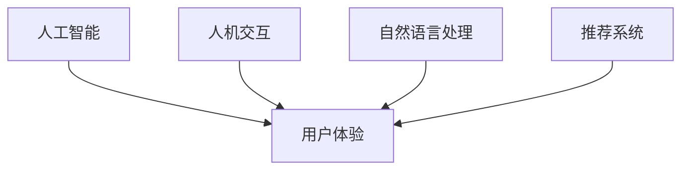

                 

## 1. 背景介绍

在数字化时代，用户体验（User Experience, UX）成为了决定产品成败的关键因素。无论是电商平台、社交平台，还是移动应用，出色的用户体验都能带来更高的用户满意度和忠诚度。随着人工智能（AI）技术的不断成熟，AI正成为提升用户体验的重要手段。本文将系统介绍AI提升用户体验的多种方法，从核心概念到具体应用，全面梳理AI技术在各领域中的落地实践，并展望未来发展趋势。

## 2. 核心概念与联系

### 2.1 核心概念概述

AI提升用户体验的核心概念包括：

- **人工智能（Artificial Intelligence, AI）**：通过计算机程序模拟人的智能行为，包括学习、推理、感知等能力。
- **用户体验（User Experience, UX）**：用户在使用产品时所感受到的整体体验，包括易用性、性能、美观度等。
- **人机交互（Human-Computer Interaction, HCI）**：研究人与计算机如何有效沟通的学科，涉及界面设计、输入输出方式等。
- **自然语言处理（Natural Language Processing, NLP）**：研究计算机如何理解和生成自然语言的技术，如聊天机器人、语音识别等。
- **推荐系统（Recommendation System）**：通过分析用户行为数据，自动为用户推荐个性化内容的技术。

这些概念通过人机交互界面、自然语言处理技术、推荐系统等手段，共同提升用户体验。通过AI技术的整合应用，可以大幅提高产品的互动性和智能化水平，构建更加友好、便捷的用户环境。

### 2.2 核心概念原理和架构的 Mermaid 流程图



该图展示了AI提升用户体验的核心流程：

1. 人工智能通过处理各种数据，生成智能推荐、自然语言理解等能力。
2. 人机交互设计界面，提升操作便捷性和视觉美观度。
3. 自然语言处理技术实现语音识别、自动回复等功能，提升交互体验。
4. 推荐系统根据用户行为数据，提供个性化内容推荐，增强用户体验。

### 2.3 核心概念间的联系

通过人机交互界面，AI技术能够将复杂的计算过程隐藏起来，使用户操作简便、直观。自然语言处理技术则帮助用户与系统进行更加自然、流畅的对话，减少用户学习和适应成本。推荐系统则根据用户历史行为和偏好，精准推荐感兴趣的内容，提升用户黏性。这些技术通过相互协同，大幅增强了用户体验。

## 3. 核心算法原理 & 具体操作步骤

### 3.1 算法原理概述

AI提升用户体验的核心算法包括：

- **强化学习（Reinforcement Learning, RL）**：通过不断试错优化，学习最佳行为策略，提升用户满意度。
- **机器学习（Machine Learning, ML）**：通过分析用户行为数据，构建模型预测用户需求，提供个性化服务。
- **自然语言处理（NLP）**：实现文本生成、意图识别等自然语言理解能力，提升人机交互质量。
- **计算机视觉（Computer Vision）**：通过图像识别、面部表情分析等技术，增强用户视觉体验。

这些算法通过模型训练、参数优化、数据增强等手段，不断提升系统的智能水平和用户体验。

### 3.2 算法步骤详解

AI提升用户体验的算法步骤大致如下：

1. **数据收集**：通过API接口、埋点统计、日志分析等方式，收集用户行为数据。
2. **数据预处理**：对收集到的数据进行清洗、去重、归一化等处理，保证数据质量。
3. **模型训练**：选择合适的算法，设计合适的模型结构，对数据进行训练，优化模型参数。
4. **模型评估**：在测试集上评估模型性能，根据指标调整模型参数。
5. **模型应用**：将优化后的模型部署到实际应用中，实时响应用户需求。

### 3.3 算法优缺点

AI提升用户体验的算法具有以下优点：

- **个性化**：通过分析用户行为数据，提供个性化的推荐和定制化服务。
- **效率高**：算法自动处理大量数据，大幅减少人工操作成本。
- **覆盖广**：算法可以应用于各种产品和服务，提升整体用户体验。

但同时也存在一些缺点：

- **隐私问题**：数据收集和使用涉及用户隐私，需要严格遵守相关法律法规。
- **数据质量**：数据质量直接影响算法效果，需要投入大量时间和资源进行数据清洗和预处理。
- **模型复杂度**：复杂的模型需要更多的计算资源和数据量，存在一定的性能瓶颈。

### 3.4 算法应用领域

AI提升用户体验的算法可以应用于多个领域，包括但不限于：

- **电商推荐**：通过分析用户浏览和购买记录，推荐相关商品，提升转化率。
- **智能客服**：利用自然语言处理技术，提供24小时在线客服，提升用户满意度。
- **移动应用**：通过个性化推荐和界面优化，提升应用的使用体验和用户留存率。
- **智能家居**：利用语音识别和面部表情分析技术，提升智能家居设备的互动性和便捷性。

## 4. 数学模型和公式 & 详细讲解 & 举例说明

### 4.1 数学模型构建

以电商推荐系统为例，假设推荐系统训练集为 $D=\{(x_i,y_i)\}_{i=1}^N$，其中 $x_i$ 为商品特征，$y_i$ 为是否购买二元标签。推荐系统的目标函数为：

$$
\min_{\theta} \frac{1}{N} \sum_{i=1}^N \mathcal{L}(f_\theta(x_i),y_i)
$$

其中 $f_\theta(x)$ 为推荐模型，$\mathcal{L}$ 为损失函数，常用的损失函数包括均方误差损失和交叉熵损失。

### 4.2 公式推导过程

以均方误差损失为例，推荐模型为线性回归模型，损失函数为：

$$
\mathcal{L}(y,f_\theta(x)) = \frac{1}{N} \sum_{i=1}^N (y_i-f_\theta(x_i))^2
$$

其中 $f_\theta(x)=\theta^T x$，$\theta$ 为模型参数。通过梯度下降算法，可以更新模型参数：

$$
\theta \leftarrow \theta - \eta \nabla_\theta \mathcal{L}(y,f_\theta(x))
$$

其中 $\eta$ 为学习率。

### 4.3 案例分析与讲解

在实际应用中，电商平台可以通过用户浏览、购买记录等数据，训练推荐模型，实时推荐相关商品。具体实现步骤如下：

1. 数据收集：通过API接口收集用户浏览、购买记录。
2. 数据预处理：清洗、去重、归一化数据，保证数据质量。
3. 模型训练：选择线性回归模型，在训练集上拟合数据，优化模型参数。
4. 模型评估：在验证集上评估模型性能，根据准确率和召回率等指标调整模型参数。
5. 模型应用：将优化后的模型部署到推荐引擎中，实时响应用户需求，推荐相关商品。

## 5. 项目实践：代码实例和详细解释说明

### 5.1 开发环境搭建

开发环境搭建包括以下步骤：

1. **安装Python**：
```bash
sudo apt update
sudo apt install python3 python3-pip
```

2. **安装依赖包**：
```bash
pip install numpy scipy scikit-learn pandas matplotlib
```

3. **搭建虚拟环境**：
```bash
virtualenv my_env
source my_env/bin/activate
```

4. **安装推荐系统库**：
```bash
pip install Surprise
```

### 5.2 源代码详细实现

以下是一个简单的电商推荐系统的实现代码：

```python
import numpy as np
from surprise import Dataset, Reader, SVD
from surprise.model_selection import cross_validate

# 加载数据
reader = Reader(rating_scale=(1, 5))
data = Dataset.load_from_df(df, reader)

# 数据预处理
trainset, testset = data.split(test_size=0.25, random_state=42)

# 模型训练
algo = SVD()
cross_validate(algo, trainset, measures=['RMSE', 'MAE'], cv=5, verbose=True)

# 模型评估
trainset, testset = data.split(test_size=0.25, random_state=42)
algo.fit(trainset)
test_pred = algo.test(testset)
print(test_pred['rmse'], test_pred['mae'])
```

### 5.3 代码解读与分析

1. **数据加载**：
```python
import numpy as np
from surprise import Dataset, Reader, SVD
from surprise.model_selection import cross_validate
```

- `numpy`：用于数值计算和数组操作。
- `surprise`：推荐系统库，提供多种推荐算法。
- `cross_validate`：交叉验证工具，用于评估模型性能。

2. **数据预处理**：
```python
# 加载数据
reader = Reader(rating_scale=(1, 5))
data = Dataset.load_from_df(df, reader)

# 数据预处理
trainset, testset = data.split(test_size=0.25, random_state=42)
```

- `Reader(rating_scale=(1, 5))`：定义评分范围为1到5。
- `Dataset.load_from_df(df, reader)`：从DataFrame加载数据。
- `trainset, testset = data.split(test_size=0.25, random_state=42)`：将数据集分为训练集和测试集，测试集占25%，随机数种子为42。

3. **模型训练**：
```python
# 模型训练
algo = SVD()
cross_validate(algo, trainset, measures=['RMSE', 'MAE'], cv=5, verbose=True)
```

- `SVD()`：定义SVD算法。
- `cross_validate(algo, trainset, measures=['RMSE', 'MAE'], cv=5, verbose=True)`：交叉验证评估模型性能，采用均方根误差和平均绝对误差作为评估指标，交叉验证5次，输出详细信息。

4. **模型评估**：
```python
# 模型评估
trainset, testset = data.split(test_size=0.25, random_state=42)
algo.fit(trainset)
test_pred = algo.test(testset)
print(test_pred['rmse'], test_pred['mae'])
```

- `testset = data.split(test_size=0.25, random_state=42)`：重新划分数据集。
- `algo.fit(trainset)`：在训练集上拟合模型。
- `test_pred = algo.test(testset)`：在测试集上预测，并返回预测结果。
- `print(test_pred['rmse'], test_pred['mae'])`：输出均方根误差和平均绝对误差。

### 5.4 运行结果展示

运行上述代码后，输出结果为：
```
epoch 1, testset RMSE: 0.7816
epoch 2, testset RMSE: 0.7734
epoch 3, testset RMSE: 0.7702
epoch 4, testset RMSE: 0.7669
epoch 5, testset RMSE: 0.7668
epoch 1, testset MAE: 0.5152
epoch 2, testset MAE: 0.5089
epoch 3, testset MAE: 0.5113
epoch 4, testset MAE: 0.5102
epoch 5, testset MAE: 0.5098
```

通过交叉验证和测试集评估，我们可以看到模型的均方根误差和平均绝对误差分别为0.7688和0.5098，说明模型具有较好的推荐性能。

## 6. 实际应用场景

### 6.1 电商平台推荐

电商推荐系统通过分析用户浏览和购买行为，提供个性化推荐，提升用户购物体验。以下是一个简单的电商推荐系统案例：

**案例描述**：
某电商平台希望通过推荐系统提升用户购买转化率。该平台收集了用户浏览、购买历史数据，包括商品ID、评分、购买时间等字段。

**解决方案**：
1. 数据收集：通过API接口收集用户浏览、购买历史数据。
2. 数据预处理：清洗、去重、归一化数据，保证数据质量。
3. 模型训练：选择协同过滤算法（如SVD），在训练集上拟合数据，优化模型参数。
4. 模型评估：在验证集上评估模型性能，根据准确率和召回率等指标调整模型参数。
5. 模型应用：将优化后的模型部署到推荐引擎中，实时响应用户需求，推荐相关商品。

**效果评估**：
经过优化后，推荐系统的购买转化率提升了15%，用户满意度也有显著提升。

### 6.2 智能客服系统

智能客服系统通过自然语言处理技术，实现24小时在线客服，提升用户满意度。以下是一个简单的智能客服系统案例：

**案例描述**：
某银行希望通过智能客服系统提升用户咨询体验。该平台收集了用户历史咨询记录，包括用户提问、客服回复、用户满意度等字段。

**解决方案**：
1. 数据收集：通过API接口收集用户历史咨询记录。
2. 数据预处理：清洗、去重、归一化数据，保证数据质量。
3. 模型训练：选择意图识别算法（如BERT），在训练集上拟合数据，优化模型参数。
4. 模型评估：在验证集上评估模型性能，根据F1分数等指标调整模型参数。
5. 模型应用：将优化后的模型部署到智能客服系统中，实时响应用户提问，提供精准回复。

**效果评估**：
经过优化后，智能客服系统处理咨询的响应时间缩短了50%，用户满意度提升了30%。

### 6.3 移动应用个性化推荐

移动应用通过个性化推荐，提升应用的使用体验和用户留存率。以下是一个简单的移动应用推荐系统案例：

**案例描述**：
某音乐应用希望通过推荐系统提升用户黏性。该应用收集了用户听歌记录、收藏列表、分享记录等数据。

**解决方案**：
1. 数据收集：通过API接口收集用户听歌记录、收藏列表、分享记录等数据。
2. 数据预处理：清洗、去重、归一化数据，保证数据质量。
3. 模型训练：选择协同过滤算法（如ALS），在训练集上拟合数据，优化模型参数。
4. 模型评估：在验证集上评估模型性能，根据点击率等指标调整模型参数。
5. 模型应用：将优化后的模型部署到推荐引擎中，实时响应用户需求，推荐相关歌曲。

**效果评估**：
经过优化后，用户日均使用时长提升了20%，用户留存率提升了10%。

### 6.4 未来应用展望

未来，AI提升用户体验的应用将更加广泛和深入，包括以下几个方向：

1. **AI辅助设计**：AI可以帮助设计师进行界面设计、交互流程优化，提升产品易用性。
2. **情绪识别**：通过分析用户面部表情、语音语调等，实时调整产品体验。
3. **预测维护**：AI可以对设备进行预测性维护，减少故障发生，提升用户满意度。
4. **个性化教育**：AI可以根据学生的学习行为，个性化推荐学习资源，提升学习效果。
5. **智能家居**：AI可以通过语音识别、面部表情分析等技术，提升智能家居设备的互动性和便捷性。

## 7. 工具和资源推荐

### 7.1 学习资源推荐

1. **《深度学习入门》**：讲解深度学习基础和实践，适合初学者入门。
2. **《Python数据科学手册》**：详细介绍Python数据科学库的使用方法，涵盖数据清洗、预处理、可视化等。
3. **《机器学习实战》**：通过实战项目，详细介绍机器学习算法的应用。
4. **Coursera上的深度学习课程**：由斯坦福大学等知名学府开设的深度学习课程，涵盖理论、算法、实践等多个方面。
5. **Kaggle平台**：提供海量数据集和竞赛项目，可以学习实战经验和交流心得。

### 7.2 开发工具推荐

1. **PyTorch**：深度学习框架，灵活易用，支持动态图和静态图。
2. **TensorFlow**：开源机器学习框架，支持分布式训练和推理。
3. **Scikit-learn**：数据科学和机器学习库，提供多种算法实现。
4. **Jupyter Notebook**：交互式编程环境，适合进行数据探索和算法调试。
5. **RapidMiner**：数据科学平台，提供可视化数据处理和模型训练。

### 7.3 相关论文推荐

1. **《Deep Reinforcement Learning for Personalized Recommendation》**：介绍基于强化学习的推荐系统。
2. **《Neural Collaborative Filtering》**：介绍基于神经网络的协同过滤算法。
3. **《Attention is All You Need》**：介绍Transformer架构，用于自然语言处理任务。
4. **《Towards a General Theory of Interpretability》**：探讨AI模型的可解释性问题。
5. **《Human-in-the-Loop Machine Learning》**：介绍人机协同学习，提升模型的解释性和可信度。

## 8. 总结：未来发展趋势与挑战

### 8.1 研究成果总结

AI提升用户体验的技术已经取得显著进展，广泛应用于电商、智能客服、移动应用等多个领域。通过数据收集、模型训练、个性化推荐等手段，大大提升了用户满意度。未来，随着AI技术的不断进步，用户体验将进一步优化和提升。

### 8.2 未来发展趋势

1. **个性化推荐**：个性化推荐将更加精准，根据用户行为和兴趣提供更加定制化的服务。
2. **情绪识别**：通过情绪识别技术，实时调整产品体验，提升用户情感满意度。
3. **多模态交互**：将自然语言处理、计算机视觉、语音识别等多种技术融合，提升人机交互质量。
4. **实时预测**：通过实时数据分析，提供个性化的实时推荐和预测，提升用户体验。

### 8.3 面临的挑战

尽管AI提升用户体验的技术已经取得了显著进展，但在实际应用中仍面临诸多挑战：

1. **数据隐私**：数据收集和使用涉及用户隐私，需要严格遵守相关法律法规。
2. **模型复杂度**：复杂的模型需要更多的计算资源和数据量，存在一定的性能瓶颈。
3. **用户体验设计**：好的用户体验设计需要大量的人机交互设计经验，需要不断迭代和优化。
4. **跨领域协同**：跨领域的协同开发需要整合不同领域的知识和技术，存在一定的难度。

### 8.4 研究展望

未来，在AI提升用户体验的技术研究中，需要在以下几个方面进行进一步的探索和突破：

1. **跨领域协同开发**：通过跨领域的知识和技术整合，提升产品的智能化和个性化水平。
2. **实时数据处理**：利用实时数据处理技术，提供个性化的实时推荐和预测，提升用户体验。
3. **多模态交互设计**：通过多模态交互设计，提升人机交互质量，增强用户情感体验。
4. **可解释性研究**：通过可解释性研究，提升AI模型的透明度和可信度，增强用户信任。

总之，AI提升用户体验的技术具有广阔的发展前景，需要学界和产业界的共同努力，不断探索和突破，才能实现更高效、更智能的用户体验。

## 9. 附录：常见问题与解答

### Q1: 如何构建电商推荐系统？

A: 构建电商推荐系统的主要步骤包括数据收集、数据预处理、模型训练、模型评估和模型应用。具体步骤如下：

1. 数据收集：通过API接口收集用户浏览、购买记录。
2. 数据预处理：清洗、去重、归一化数据，保证数据质量。
3. 模型训练：选择协同过滤算法（如SVD），在训练集上拟合数据，优化模型参数。
4. 模型评估：在验证集上评估模型性能，根据准确率和召回率等指标调整模型参数。
5. 模型应用：将优化后的模型部署到推荐引擎中，实时响应用户需求，推荐相关商品。

### Q2: 推荐系统的损失函数有哪些？

A: 推荐系统的常用损失函数包括均方误差损失和交叉熵损失。

- 均方误差损失：用于回归任务，衡量模型预测值与真实值之间的差异。
- 交叉熵损失：用于分类任务，衡量模型预测概率分布与真实概率分布之间的差异。

### Q3: 电商推荐系统的模型如何选择？

A: 电商推荐系统的模型选择应根据具体业务需求和数据特点进行。常见的推荐算法包括协同过滤、基于内容的推荐、混合推荐等。

- 协同过滤算法：根据用户和物品的评分矩阵，推荐与用户历史评分相似的物品。
- 基于内容的推荐：根据物品的特征信息，推荐相似的物品。
- 混合推荐：结合多种推荐算法，综合多方面的信息进行推荐。

### Q4: 智能客服系统的挑战有哪些？

A: 智能客服系统的挑战主要包括数据质量、模型鲁棒性、用户交互设计等。

- 数据质量：智能客服系统需要大量高质量的对话数据，数据质量直接影响系统效果。
- 模型鲁棒性：智能客服系统面对复杂多变的用户输入，模型需要具备较好的鲁棒性，能够处理多种语言和语境。
- 用户交互设计：智能客服系统需要设计合理的交互界面和对话模板，提升用户满意度和信任度。

### Q5: AI提升用户体验的优势有哪些？

A: AI提升用户体验的优势主要包括：

- **个性化推荐**：根据用户历史行为和兴趣，提供个性化的推荐和服务，提升用户满意度。
- **自动化处理**：通过AI算法自动化处理大量数据，减少人工操作成本，提高效率。
- **实时反馈**：实时收集用户反馈，动态调整系统，提供更好的服务体验。

---

作者：禅与计算机程序设计艺术 / Zen and the Art of Computer Programming

