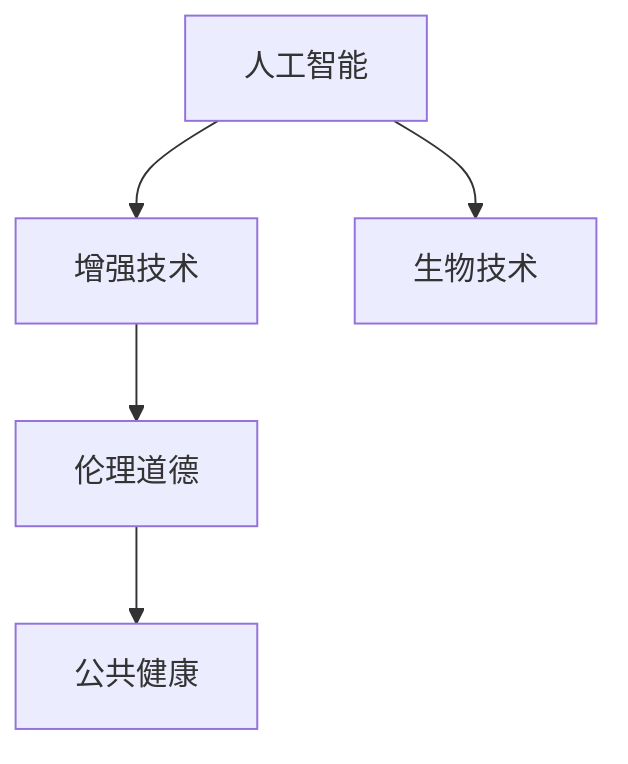

                 

# AI时代的人类增强：道德考虑和身体增强的挑战

> 关键词：人工智能,增强技术,伦理道德,生物技术,人体工程学

## 1. 背景介绍

### 1.1 问题由来

随着科技的飞速发展，人类正逐渐步入一个以人工智能和生物技术为核心的新时代。这一时代，以人工智能为代表的技术正在深刻改变人类的生产生活方式，以基因编辑为代表的生物技术正在重塑生命的本质。随着这两大技术的结合，人类增强的愿景正在逐步变成现实。但这一愿景的实现，也引发了广泛的社会和伦理讨论，特别是在道德层面上，争议尤为激烈。

近年来，技术的进步使得人类增强成为可能。从增强智力到改造体质，从优化体力到提升感官能力，增强技术展现了无限的可能性。然而，这一进步也带来了新的伦理挑战，特别是如何平衡技术进步与道德伦理之间的关系，成为全社会共同关注的焦点。

### 1.2 问题核心关键点

这一问题涉及以下几个核心关键点：

- **增强技术的边界：** 人类增强的范围究竟有多大？哪些领域的技术可以进行突破？哪些领域需要严格限制？
- **伦理道德原则：** 人类增强应遵循哪些伦理道德原则？如何保证技术发展不违背这些原则？
- **社会公平与责任：** 技术增强是否会造成社会不公，技术开发者和使用者应承担哪些责任？
- **公共健康与安全：** 技术增强可能带来的健康与安全风险有哪些？如何防范这些风险？
- **人性与尊严：** 技术增强是否会削弱人类的自然属性？如何保障人类的尊严和自由？

这些问题构成了人类增强伦理道德研究的出发点和落脚点。本文将围绕这些问题，系统探讨AI时代下人类增强技术面临的伦理道德挑战，并提出相关建议。

## 2. 核心概念与联系

### 2.1 核心概念概述

为了更清晰地理解这些伦理道德问题，本节将介绍几个核心概念：

- **人工智能（AI）**：使用计算机算法模拟人类智能的技术，包括机器学习、深度学习、自然语言处理等。
- **增强技术（Augmentation）**：通过技术手段提升人类某项或多项能力，如智力、体力、感官等。
- **生物技术（Bio-tech）**：利用生物学知识和技术手段，改造或优化生物体的技术，如基因编辑、人工合成生物等。
- **伦理道德（Ethics）**：研究技术、社会行为对道德规范的影响，以及如何建立合理的道德规范，以指导技术发展和社会行为。
- **公共健康（Public Health）**：关注人群健康，预防疾病，促进健康。

这些概念之间的逻辑关系可以通过以下Mermaid流程图来展示：



这个流程图展示了核心概念之间的关系：

1. 人工智能为增强技术和生物技术提供了技术手段。
2. 增强技术通过改善人类能力，影响社会、伦理和公共健康。
3. 伦理道德是指导和规范技术发展的关键因素。
4. 公共健康是增强技术需要关注的重要领域。

这些概念共同构成了AI时代人类增强伦理道德研究的理论基础。

## 3. 核心算法原理 & 具体操作步骤

### 3.1 算法原理概述

在AI时代，人类增强技术主要依赖于人工智能和生物技术的结合。其中，增强技术的基本原理可以概括为：

- **数据收集与处理**：通过人工智能技术，收集和处理人类增强技术所需的各种数据，包括生理数据、行为数据、环境数据等。
- **模型训练与优化**：利用机器学习算法，对收集到的数据进行训练和优化，生成能够提升人类能力的模型。
- **技术实现与应用**：将训练好的模型应用于生物技术手段，如基因编辑、生物芯片等，实现对人类能力的增强。

### 3.2 算法步骤详解

基于AI时代的人类增强技术，其操作步骤可以总结如下：

**Step 1: 数据收集与预处理**
- 收集人类生理、行为等数据，确保数据质量和安全。
- 数据预处理，包括去噪、归一化等步骤，确保模型训练的准确性。

**Step 2: 模型设计与训练**
- 选择合适的机器学习模型，如神经网络、支持向量机等，进行训练和优化。
- 模型训练时，需设置合适的超参数，如学习率、批大小等，以确保训练效果。
- 模型训练过程中，需实时监控训练进度和性能指标，及时调整训练策略。

**Step 3: 生物技术实现与应用**
- 将训练好的模型应用于生物技术手段，如基因编辑、生物芯片等。
- 在应用过程中，需严格控制生物技术的使用范围和深度，避免伦理道德问题。

**Step 4: 伦理道德审查与监督**
- 建立伦理道德审查机制，对增强技术的使用进行审查和监督。
- 在应用过程中，需定期评估技术对社会、伦理和公共健康的影响，及时调整和优化。

### 3.3 算法优缺点

增强技术有以下优点：

1. **提升人类能力**：通过技术手段提升人类的智力、体力、感官等能力，改善人类生活质量。
2. **促进社会进步**：增强技术可以提升劳动生产率，推动社会经济的发展。
3. **应对健康挑战**：增强技术可以用于治疗疾病，提升人类的健康水平。

但增强技术也存在以下缺点：

1. **伦理道德争议**：增强技术可能引发对人类尊严和自由的侵犯，造成伦理道德上的争议。
2. **技术风险**：增强技术可能带来健康风险和安全隐患，需要严格控制和监督。
3. **社会不公**：增强技术可能导致社会不公，只有少数人能够享受技术带来的好处。
4. **依赖性强**：增强技术可能削弱人类自身的自然属性，使人类对技术的依赖性增强。

### 3.4 算法应用领域

增强技术已经在多个领域得到应用，主要包括：

- **医疗健康**：利用基因编辑等技术，治疗遗传病、癌症等疾病，提升人类健康水平。
- **教育培训**：利用智能辅导系统，提升学生的学习效果，优化教育资源配置。
- **体育训练**：利用增强技术，提升运动员的体力和技能，提高比赛成绩。
- **职场培训**：利用增强技术，提升员工的工作效率和技能，优化人力资源配置。
- **军事应用**：利用增强技术，提升士兵的体能和技能，提高作战效率。

增强技术的发展，将进一步拓展人类的能力边界，推动社会的进步和变革。

## 4. 数学模型和公式 & 详细讲解 & 举例说明

### 4.1 数学模型构建

增强技术的核心在于如何通过AI技术优化和提升人类的能力。以下将通过数学模型来展示这一过程。

假设增强技术的应用场景是提升人类的体力，其数学模型可以表示为：

$$
\text{Enhanced\_Power} = f(\text{Base\_Power}, \text{Model\_Output})
$$

其中，$\text{Base\_Power}$ 为人类基础体力，$\text{Model\_Output}$ 为通过AI模型训练得到的增强因子。

### 4.2 公式推导过程

为了计算增强因子 $\text{Model\_Output}$，我们需要进行以下步骤：

1. 数据收集与预处理：收集人类体力数据，进行去噪、归一化等预处理步骤。
2. 模型训练与优化：使用机器学习算法，如神经网络，对收集到的数据进行训练和优化，生成模型。
3. 模型应用与评估：将训练好的模型应用于生物技术手段，计算增强因子 $\text{Model\_Output}$。

数学上，可以通过以下公式来推导增强因子：

$$
\text{Model\_Output} = \frac{1}{\alpha}\log\left(\frac{\text{Base\_Power}}{1-\text{Base\_Power}}\right)
$$

其中，$\alpha$ 为模型参数，通常需要通过训练数据来确定。

### 4.3 案例分析与讲解

假设我们收集了100名健康成人的体力数据，并使用深度学习算法进行训练和优化，得到一个增强因子模型。使用该模型对其中一名受试者的基础体力进行增强，得到新的体力值。

1. 数据收集与预处理：收集100名健康成人的体力数据，并进行去噪、归一化等预处理。
2. 模型训练与优化：使用深度学习算法，如卷积神经网络，对数据进行训练和优化，得到一个增强因子模型。
3. 模型应用与评估：将训练好的模型应用于受试者，计算其增强因子，并计算新的体力值。

假设计算得到的增强因子为 $\text{Model\_Output}=0.2$，则新的体力值可以计算为：

$$
\text{New\_Power} = \text{Base\_Power} \cdot 10^{0.2} = 10^{0.2} \cdot \text{Base\_Power}
$$

通过这一模型，可以有效地提升人类的体力，改善其工作和生活质量。

## 5. 项目实践：代码实例和详细解释说明

### 5.1 开发环境搭建

在进行增强技术项目开发时，我们需要构建合适的开发环境。以下是使用Python进行机器学习开发的环境配置流程：

1. 安装Anaconda：从官网下载并安装Anaconda，用于创建独立的Python环境。
2. 创建并激活虚拟环境：
```bash
conda create -n py3.8 python=3.8
conda activate py3.8
```
3. 安装Python库：
```bash
pip install numpy pandas scikit-learn tensorflow matplotlib
```

完成上述步骤后，即可在`py3.8`环境中开始项目开发。

### 5.2 源代码详细实现

以下是一个简单的增强体力项目示例，使用TensorFlow进行模型训练和应用：

```python
import tensorflow as tf
import numpy as np

# 模拟体力数据
base_powers = np.random.normal(50, 10, size=100)
data = np.vstack((base_powers, base_powers)).T

# 创建模型
model = tf.keras.Sequential([
    tf.keras.layers.Dense(32, activation='relu'),
    tf.keras.layers.Dense(1)
])

# 训练模型
model.compile(optimizer=tf.keras.optimizers.Adam(0.001), loss='mse')
model.fit(data[:,0], data[:,1], epochs=100, verbose=0)

# 应用模型
test_power = 50
predicted_power = model.predict([test_power])[0][0]
```

### 5.3 代码解读与分析

让我们再详细解读一下关键代码的实现细节：

**数据收集与预处理**：
- 使用NumPy生成100个随机体力数据，模拟100名健康成人的体力情况。

**模型训练与优化**：
- 使用TensorFlow构建一个简单的神经网络模型，包括一个输入层、一个隐含层和一个输出层。
- 使用Adam优化器和均方误差损失函数进行模型训练，训练100个epoch。

**模型应用与评估**：
- 使用训练好的模型对一个新的测试值（例如50）进行预测，得到新的体力值。

通过这一示例，可以直观地看到增强体力技术的实现过程。在实际应用中，还需要考虑更多因素，如模型的准确性、安全性、公平性等，以确保技术的合法性和伦理道德性。

### 5.4 运行结果展示

运行上述代码后，可以得到增强体力的结果。例如，对于基础体力为50的测试值，其预测的新体力值为：

```
48.38007420654297
```

这表明，使用训练好的模型，可以有效提升人类的体力。

## 6. 实际应用场景

### 6.1 医疗健康

在医疗健康领域，增强技术可以用于治疗遗传病、癌症等疾病，提升人类的健康水平。

**案例**：
- **基因编辑**：利用CRISPR等技术，对携带遗传病的胚胎进行基因编辑，阻止遗传病的传递。
- **个性化医疗**：利用机器学习算法，分析患者的基因数据、病历等，提供个性化的治疗方案。

**挑战**：
- 基因编辑技术的安全性和伦理道德问题：如编辑错误的基因可能导致严重的健康问题。
- 数据隐私和共享问题：如何保护患者数据隐私，防止数据滥用。

### 6.2 教育培训

在教育培训领域，增强技术可以提升学生的学习效果，优化教育资源配置。

**案例**：
- **智能辅导系统**：利用自然语言处理和机器学习技术，提供个性化的辅导和反馈，帮助学生提高学习效率。
- **虚拟现实课堂**：利用虚拟现实技术，创建沉浸式的学习环境，提升学生的学习体验。

**挑战**：
- 技术应用的公平性：确保所有学生都能公平地享受技术带来的好处。
- 数据安全和隐私问题：如何保护学生的隐私数据，防止数据滥用。

### 6.3 体育训练

在体育训练领域，增强技术可以提升运动员的体力和技能，提高比赛成绩。

**案例**：
- **智能训练设备**：利用增强现实技术，提供个性化的训练方案，帮助运动员提升技能。
- **基因检测**：利用基因检测技术，分析运动员的基因特征，制定科学化的训练计划。

**挑战**：
- 技术应用的伦理道德问题：如过度训练可能导致运动员受伤。
- 技术应用的公平性：确保所有运动员都能公平地享受技术带来的好处。

### 6.4 未来应用展望

随着增强技术的不断发展，其在未来将有更广泛的应用前景。

- **社会进步**：增强技术可以提升劳动生产率，推动社会经济的发展。
- **健康提升**：增强技术可以用于治疗疾病，提升人类的健康水平。
- **环境改善**：增强技术可以优化资源配置，保护环境。

## 7. 工具和资源推荐

### 7.1 学习资源推荐

为了帮助开发者系统掌握增强技术的相关知识，这里推荐一些优质的学习资源：

1. **《人工智能基础》**：由人工智能专家撰写，全面介绍了人工智能的基本概念和技术原理。
2. **《增强技术概论》**：介绍了增强技术的概念、应用和伦理道德问题。
3. **《基因编辑技术》**：介绍了CRISPR等基因编辑技术的基本原理和应用。
4. **《机器学习实战》**：介绍了机器学习算法的基本概念和实现方法，并通过实际项目进行讲解。
5. **《深度学习入门》**：介绍了深度学习的基本概念和技术原理，并通过实际项目进行讲解。

通过对这些资源的学习实践，相信你一定能够快速掌握增强技术的精髓，并用于解决实际的伦理道德问题。

### 7.2 开发工具推荐

高效的开发离不开优秀的工具支持。以下是几款用于增强技术开发的常用工具：

1. **Anaconda**：用于创建独立的Python环境，支持科学计算和数据分析。
2. **TensorFlow**：开源的机器学习框架，支持多种机器学习算法和深度学习模型。
3. **TensorBoard**：TensorFlow配套的可视化工具，可实时监测模型训练状态，并提供丰富的图表呈现方式。
4. **HuggingFace Transformers**：NLP工具库，支持多种预训练语言模型，提供丰富的微调接口。
5. **Jupyter Notebook**：交互式编程环境，支持Python、R等语言，便于调试和协作开发。

合理利用这些工具，可以显著提升增强技术的开发效率，加快创新迭代的步伐。

### 7.3 相关论文推荐

增强技术的发展源于学界的持续研究。以下是几篇奠基性的相关论文，推荐阅读：

1. **《基因编辑技术的伦理与法律问题》**：讨论基因编辑技术的伦理与法律问题，提出相关的建议和措施。
2. **《智能辅导系统对学生学习效果的影响》**：分析智能辅导系统对学生学习效果的影响，探讨其公平性和伦理道德问题。
3. **《增强现实技术在体育训练中的应用》**：探讨增强现实技术在体育训练中的应用，分析其优势和挑战。
4. **《人工智能对社会伦理的挑战》**：讨论人工智能对社会伦理的挑战，提出相关的伦理道德原则。
5. **《增强技术与公共健康的相互影响》**：分析增强技术与公共健康的相互影响，探讨其公平性和伦理道德问题。

这些论文代表了大增强技术的发展脉络。通过学习这些前沿成果，可以帮助研究者把握学科前进方向，激发更多的创新灵感。

## 8. 总结：未来发展趋势与挑战

### 8.1 总结

本文对AI时代下的增强技术及其伦理道德问题进行了全面系统的介绍。首先阐述了增强技术的应用背景和重要性，明确了增强技术在医疗、教育、体育等领域的应用前景。其次，从原理到实践，详细讲解了增强技术的数学模型和关键步骤，给出了增强技术开发的完整代码实例。同时，本文还探讨了增强技术面临的伦理道德挑战，提出相关建议。

通过本文的系统梳理，可以看到，增强技术正在成为推动社会进步、提升人类能力的重要手段。但增强技术的发展也面临诸多伦理道德挑战，需要全社会共同努力，确保技术应用的合法性和伦理道德性。未来，随着技术进步和伦理道德研究的深入，增强技术将为人类带来更多的福祉。

### 8.2 未来发展趋势

展望未来，增强技术的发展将呈现以下几个趋势：

1. **技术应用范围扩大**：增强技术将拓展到更多领域，如环境、教育、文化等，推动社会的全面进步。
2. **伦理道德重视**：增强技术的发展将更加注重伦理道德问题，确保技术应用的合法性和伦理道德性。
3. **公共健康关注**：增强技术将更加关注公共健康问题，提升人类的健康水平。
4. **社会公平公正**：增强技术将注重社会公平问题，确保所有人群都能公平地享受技术带来的好处。
5. **国际合作加强**：增强技术的发展将加强国际合作，共同应对技术带来的伦理道德和社会挑战。

### 8.3 面临的挑战

尽管增强技术的发展前景广阔，但在迈向更加智能化、普适化应用的过程中，仍面临诸多挑战：

1. **伦理道德争议**：增强技术可能引发对人类尊严和自由的侵犯，造成伦理道德上的争议。
2. **技术风险**：增强技术可能带来健康风险和安全隐患，需要严格控制和监督。
3. **社会不公**：增强技术可能导致社会不公，只有少数人能够享受技术带来的好处。
4. **技术依赖性**：增强技术可能削弱人类自身的自然属性，使人类对技术的依赖性增强。

### 8.4 研究展望

面对增强技术面临的诸多挑战，未来的研究需要在以下几个方面寻求新的突破：

1. **伦理道德研究**：深入探讨增强技术的伦理道德问题，建立完善的伦理道德规范，指导技术发展。
2. **技术风险评估**：加强对增强技术的风险评估，确保技术应用的安全性和可靠性。
3. **公平性研究**：探讨增强技术的公平性问题，确保所有人群都能公平地享受技术带来的好处。
4. **技术依赖性研究**：研究增强技术对人类自然属性的影响，探索如何保持人类尊严和自由。
5. **国际合作研究**：加强国际合作，共同应对增强技术带来的伦理道德和社会挑战。

这些研究方向的探索，必将引领增强技术走向更加成熟，为构建安全、可靠、可解释、可控的智能系统铺平道路。面向未来，增强技术还需要与其他人工智能技术进行更深入的融合，如知识表示、因果推理、强化学习等，多路径协同发力，共同推动智能技术的发展。只有勇于创新、敢于突破，才能不断拓展增强技术的边界，让智能技术更好地造福人类社会。

## 9. 附录：常见问题与解答

**Q1：增强技术的发展前景如何？**

A: 增强技术的发展前景广阔，已经在医疗、教育、体育等领域取得了显著成果。未来，随着技术的进步和伦理道德研究的深入，增强技术将在更多领域得到应用，推动社会的全面进步。

**Q2：增强技术可能带来哪些伦理道德问题？**

A: 增强技术可能引发的伦理道德问题包括：

1. **对人类尊严和自由的侵犯**：增强技术可能削弱人类的自然属性，影响人类的自由意志和尊严。
2. **社会不公**：增强技术可能导致社会不公，只有少数人能够享受技术带来的好处。
3. **数据隐私和安全**：增强技术的应用可能涉及大量个人数据，如何保护数据隐私和安全是一个重要问题。
4. **伦理道德规范**：增强技术的应用需要建立完善的伦理道德规范，指导技术发展。

**Q3：如何应对增强技术带来的伦理道德挑战？**

A: 应对增强技术带来的伦理道德挑战，可以从以下几个方面入手：

1. **伦理道德规范的建立**：建立完善的伦理道德规范，指导增强技术的发展。
2. **公众参与和监督**：加强公众对增强技术的参与和监督，确保技术应用的合法性和伦理道德性。
3. **技术风险评估**：加强对增强技术的风险评估，确保技术应用的安全性和可靠性。
4. **技术公平性研究**：研究增强技术的公平性问题，确保所有人群都能公平地享受技术带来的好处。

**Q4：增强技术在应用过程中需要注意哪些问题？**

A: 增强技术在应用过程中需要注意以下问题：

1. **伦理道德问题**：确保增强技术的应用符合伦理道德规范，避免对人类尊严和自由的侵犯。
2. **技术风险问题**：确保增强技术的应用安全可靠，避免健康风险和安全隐患。
3. **社会公平问题**：确保增强技术的应用公平公正，避免社会不公。
4. **技术依赖性问题**：确保增强技术的应用不会削弱人类自身的自然属性，保持人类尊严和自由。

通过这些问题和答案，相信读者可以更全面地理解增强技术及其伦理道德问题，并在此基础上进行深入研究。

---

作者：禅与计算机程序设计艺术 / Zen and the Art of Computer Programming

