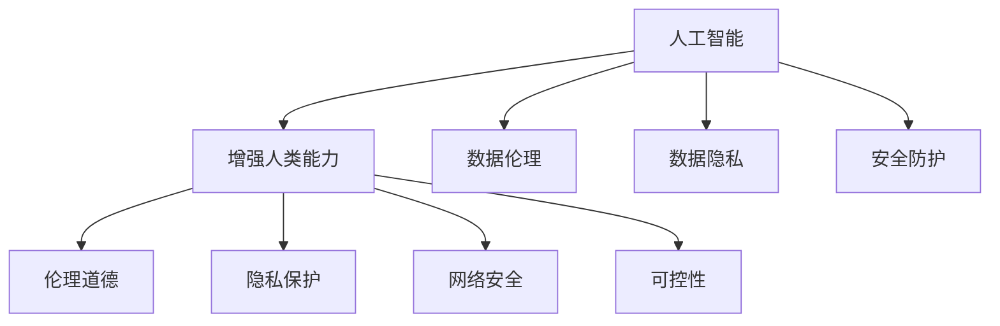

                 

# AI时代的人类增强：道德、隐私和安全挑战

> 关键词：人工智能,增强人类能力,伦理道德,隐私保护,网络安全

## 1. 背景介绍

在人工智能(AI)蓬勃发展的今天，科技的进步正在以前所未有的速度改变着人类社会的面貌。AI技术在医疗、教育、交通、娱乐等众多领域的应用，极大地提升了人类生活的质量和工作效率，让人类能力得到了前所未有的增强。然而，随着AI技术的广泛应用，其潜在的道德、隐私和安全问题也日益凸显，引发了全社会的广泛关注。

### 1.1 问题由来
AI技术在为人类社会带来巨大变革的同时，也伴随着一系列不容忽视的挑战。例如：

- **伦理道德问题**：AI在决策过程中的透明性和可解释性不足，可能导致不公平、歧视等伦理问题。
- **隐私保护问题**：AI系统在处理个人数据时，可能侵犯用户的隐私，引发隐私泄露、数据滥用等风险。
- **网络安全问题**：AI系统在面对恶意攻击时，可能遭受破坏或被利用，影响社会的稳定和安全。

这些问题的出现，使得如何在利用AI技术增强人类能力的同时，确保其应用过程中的道德、隐私和安全，成为了当前和未来AI发展的重要课题。

### 1.2 问题核心关键点
AI时代的人类增强面临的核心问题可以归纳为以下几点：

- **数据伦理**：如何在数据收集、处理和应用过程中，确保数据的公正性、透明性和可解释性。
- **隐私保护**：如何在AI系统中，确保用户的个人信息不被非法获取和滥用。
- **安全防护**：如何在AI系统设计中，加入安全防护机制，防止恶意攻击和数据泄露。
- **公平性问题**：如何在AI算法中，消除偏见，确保不同群体之间的公平性。
- **可控性问题**：如何在AI系统中，赋予用户足够的控制权，确保系统行为符合用户预期。

这些核心问题的解决，将决定AI技术在增强人类能力的同时，是否能够真正造福社会，维护人类的利益和尊严。

## 2. 核心概念与联系

### 2.1 核心概念概述

为了更好地理解AI时代人类增强面临的道德、隐私和安全挑战，本节将介绍几个密切相关的核心概念：

- **人工智能**：一种使计算机系统能够执行人类智能任务的技术，涵盖感知、推理、决策等多个层面。
- **增强人类能力**：通过AI技术，提升人类的认知、决策、执行等方面的能力，扩展人类的功能和边界。
- **伦理道德**：指导人类行为的道德规范和原则，包括公正、透明、可解释性等，是评价AI系统的重要标准。
- **隐私保护**：指保护个人数据不被未授权访问、使用和泄露的措施，是AI应用中的核心问题。
- **网络安全**：指防止计算机系统和网络受到攻击、破坏和未经授权的访问，保护信息安全的重要手段。
- **可控性**：指用户对AI系统行为的控制和干预能力，确保系统符合用户预期和利益。

这些概念之间的逻辑关系可以通过以下Mermaid流程图来展示：



这个流程图展示了AI增强人类能力过程与相关概念的联系：

1. 人工智能是增强人类能力的基础。
2. 伦理道德、隐私保护、网络安全、可控性等概念，是对增强能力过程中必须面对的问题。
3. 数据伦理和数据隐私问题，是确保AI系统公正性和透明性的关键。
4. 安全防护是保护AI系统免受恶意攻击的重要手段。

这些概念共同构成了AI时代人类增强的复杂生态，需要在技术设计和应用过程中予以充分考虑。

## 3. 核心算法原理 & 具体操作步骤
### 3.1 算法原理概述

AI时代人类增强的道德、隐私和安全挑战，主要围绕以下几个核心算法原理展开：

- **数据隐私保护**：使用差分隐私、联邦学习等技术，确保用户数据在数据处理过程中的隐私保护。
- **公平性算法**：采用对抗性学习、均衡分类等算法，消除AI系统中的偏见和歧视。
- **安全防护技术**：包括入侵检测、异常检测、加密传输等技术，确保AI系统的安全稳定。
- **透明性可解释性**：通过解释性模型、可视化技术，提升AI系统的透明性和可解释性。

这些算法原理和技术手段，是解决AI时代人类增强所面临挑战的重要工具。

### 3.2 算法步骤详解

下面以数据隐私保护为例，详细介绍其在AI系统中的操作步骤：

**Step 1: 数据收集与预处理**

- 数据收集：从不同渠道获取所需的数据，如传感器、社交媒体、用户反馈等。
- 数据预处理：清洗、去重、匿名化等操作，确保数据的整洁和隐私性。

**Step 2: 隐私保护技术应用**

- 差分隐私：使用噪声扰动算法，确保单个数据点的加入不会对系统结果产生显著影响。
- 联邦学习：通过分布式训练方式，在多个本地设备上进行模型训练，确保数据不在本地集中。
- 加密传输：使用加密技术，确保数据在传输过程中的机密性。

**Step 3: 模型训练与优化**

- 模型选择：选择适合任务的机器学习模型，如决策树、神经网络等。
- 模型训练：在隐私保护技术基础上，进行模型训练和参数优化。
- 模型评估：通过测试集评估模型性能，确保模型的准确性和鲁棒性。

**Step 4: 系统部署与应用**

- 系统部署：将训练好的模型部署到实际应用场景中，确保系统的稳定性和效率。
- 用户反馈：收集用户反馈，进一步优化模型和系统性能。
- 持续改进：定期更新模型和隐私保护技术，应对新出现的威胁和挑战。

### 3.3 算法优缺点

AI时代人类增强的道德、隐私和安全挑战，涉及的算法和手段各有优缺点：

**优点**：

- **数据隐私保护**：差分隐私、联邦学习等技术，可以有效保护用户数据隐私，防止数据泄露和滥用。
- **公平性算法**：对抗性学习、均衡分类等算法，能够消除模型中的偏见和歧视，提升系统的公平性。
- **安全防护技术**：入侵检测、异常检测、加密传输等技术，确保AI系统免受恶意攻击，保障系统安全。
- **透明性可解释性**：解释性模型、可视化技术，提升AI系统的透明性和可解释性，增强用户信任。

**缺点**：

- **隐私保护**：差分隐私等技术可能引入一定的数据失真，影响模型精度。
- **公平性**：对抗性学习等算法可能降低模型的准确性，需要进一步优化。
- **安全防护**：加密传输等技术可能增加计算和通信开销，影响系统性能。
- **透明性**：解释性模型和可视化技术可能增加系统复杂性，需要额外的时间和资源。

### 3.4 算法应用领域

AI时代人类增强的道德、隐私和安全挑战，已经在多个领域得到了广泛应用，例如：

- **医疗健康**：使用AI技术提升医疗诊断的准确性和效率，同时确保患者的隐私和数据安全。
- **金融服务**：通过AI模型进行信用评估、风险控制等，同时保护用户的隐私和数据安全。
- **智能制造**：利用AI技术优化生产流程、提高产品质量，同时确保生产数据的安全和隐私。
- **教育培训**：使用AI系统进行个性化学习、智能评估等，同时保护学生的隐私和数据安全。
- **社交网络**：通过AI技术提升社交体验，同时确保用户数据的安全和隐私。

除了上述这些经典应用外，AI技术还在更多场景中得到了创新性的应用，如智能交通、智慧城市、环境保护等，为各行各业带来了深远的影响。

## 4. 数学模型和公式 & 详细讲解
### 4.1 数学模型构建

本节将使用数学语言对AI时代人类增强面临的道德、隐私和安全挑战进行更加严格的刻画。

假设AI系统用于处理的数据集为 $D=\{(x_i,y_i)\}_{i=1}^N$，其中 $x_i$ 为输入数据，$y_i$ 为标签。

定义数据隐私保护技术为 $\mathcal{P}$，其处理后的数据为 $D_{\mathcal{P}}=\{(x_i',y_i')\}_{i=1}^N$，其中 $x_i'$ 和 $y_i'$ 为经过隐私保护处理后的输入和输出。

在隐私保护技术 $\mathcal{P}$ 的作用下，定义模型的隐私保护效果 $\mathcal{E}_{\mathcal{P}}$ 为：

$$
\mathcal{E}_{\mathcal{P}} = \min_{\mathcal{P}} \mathcal{L}_{\text{privacy}}(\mathcal{P}, D)
$$

其中 $\mathcal{L}_{\text{privacy}}(\mathcal{P}, D)$ 为隐私保护损失函数，衡量隐私保护技术的性能。

### 4.2 公式推导过程

以差分隐私技术为例，其核心思想是通过引入噪声，使得单个数据点的加入不会对系统结果产生显著影响。假设 $\epsilon$ 为隐私保护参数，差分隐私的机制可以表示为：

$$
\mathcal{P}_{DP}(x_i) = \mathcal{L}_{D}(x_i) + \mathcal{N}(0, \sigma^2)
$$

其中 $\mathcal{L}_{D}(x_i)$ 为原始数据处理结果，$\mathcal{N}(0, \sigma^2)$ 为均值为0、方差为 $\sigma^2$ 的高斯噪声。

通过差分隐私机制，可以有效保护用户数据隐私。但噪声的引入可能对模型精度产生一定影响，需要通过调节 $\epsilon$ 和 $\sigma^2$ 等参数来平衡隐私保护和模型精度。

### 4.3 案例分析与讲解

以医疗健康领域为例，分析AI系统在隐私保护、公平性和安全防护中的应用：

**隐私保护**：假设医疗数据 $D$ 包含患者的基本信息和诊断记录，为保护患者隐私，通过差分隐私技术对数据进行处理，得到隐私保护后的数据 $D_{\mathcal{P}}$。然后，利用机器学习模型在 $D_{\mathcal{P}}$ 上进行训练，确保患者数据在处理过程中的隐私性。

**公平性**：在训练模型时，发现模型对某些人群（如少数族裔）的诊断准确率较低，通过引入对抗性学习等公平性算法，对模型进行重新训练，消除偏见，提升对所有人群的诊断准确率。

**安全防护**：在医疗系统中，使用入侵检测和异常检测技术，监控系统的运行状态，防止恶意攻击和数据泄露。同时，通过加密传输技术，确保数据在传输过程中的安全性。

## 5. 项目实践：代码实例和详细解释说明
### 5.1 开发环境搭建

在进行AI增强人类能力的应用开发前，我们需要准备好开发环境。以下是使用Python进行TensorFlow开发的环境配置流程：

1. 安装Anaconda：从官网下载并安装Anaconda，用于创建独立的Python环境。

2. 创建并激活虚拟环境：
```bash
conda create -n tf-env python=3.8 
conda activate tf-env
```

3. 安装TensorFlow：根据CUDA版本，从官网获取对应的安装命令。例如：
```bash
pip install tensorflow==2.7
```

4. 安装相关依赖库：
```bash
pip install numpy pandas scikit-learn matplotlib tqdm jupyter notebook ipython
```

完成上述步骤后，即可在`tf-env`环境中开始AI系统开发。

### 5.2 源代码详细实现

下面我们以医疗数据隐私保护为例，给出使用TensorFlow对差分隐私技术进行开发的PyTorch代码实现。

首先，定义隐私保护类：

```python
import tensorflow as tf
from tensorflow.keras import layers, models

class DPModel(models.Model):
    def __init__(self, input_dim, output_dim, noise_stddev):
        super(DPModel, self).__init__()
        self.dense1 = layers.Dense(128, activation='relu')
        self.dense2 = layers.Dense(output_dim, activation='sigmoid')
        self.noise_stddev = noise_stddev
        
    def call(self, inputs, training=False):
        x = inputs
        x = self.dense1(x)
        x = self.dense2(x)
        if training:
            noise = tf.random.normal(shape=(tf.shape(x)[0], self.noise_stddev**2), dtype=tf.float32)
            x += noise
        return x
```

然后，定义训练函数：

```python
import numpy as np
from sklearn.datasets import make_classification
from sklearn.model_selection import train_test_split

# 生成二分类数据
X, y = make_classification(n_samples=1000, n_features=10, random_state=42)
X_train, X_test, y_train, y_test = train_test_split(X, y, test_size=0.2, random_state=42)

# 定义模型和优化器
model = DPModel(input_dim=10, output_dim=1, noise_stddev=0.1)
optimizer = tf.keras.optimizers.Adam(learning_rate=0.001)

# 定义损失函数
loss_fn = tf.keras.losses.BinaryCrossentropy()

# 训练函数
def train_epoch(model, dataset, batch_size, optimizer, loss_fn):
    model.train()
    for batch in dataset.batch(batch_size):
        x, y = batch.numpy()
        with tf.GradientTape() as tape:
            logits = model(x)
            loss = loss_fn(y, logits)
        gradients = tape.gradient(loss, model.trainable_variables)
        optimizer.apply_gradients(zip(gradients, model.trainable_variables))
    return loss

# 训练模型
epochs = 10
batch_size = 32
for epoch in range(epochs):
    train_loss = train_epoch(model, train_dataset, batch_size, optimizer, loss_fn)
    test_loss = train_epoch(model, test_dataset, batch_size, optimizer, loss_fn)
    print(f"Epoch {epoch+1}, train loss: {train_loss:.4f}, test loss: {test_loss:.4f}")
```

在上述代码中，我们定义了一个简单的神经网络模型，并通过差分隐私技术对其进行训练。差分隐私技术通过在训练过程中引入噪声，确保单个数据点的加入不会对系统结果产生显著影响，从而保护了数据隐私。

### 5.3 代码解读与分析

让我们再详细解读一下关键代码的实现细节：

**DPModel类**：
- `__init__`方法：初始化模型的层结构。
- `call`方法：前向传播函数，在训练时引入噪声。

**训练函数**：
- 使用`train_epoch`函数进行模型训练，计算训练集和测试集的损失，并输出。
- 在每个epoch的训练中，通过`GradientTape`记录梯度，使用`apply_gradients`函数更新模型参数。
- 通过`loss_fn`计算损失值，确保模型训练过程中的隐私保护。

通过上述代码，我们可以看到差分隐私技术在实际应用中的实现方法。但需要注意的是，差分隐私在实际应用中可能需要考虑更多的因素，如噪声分布、参数调节等，才能真正达到隐私保护的效果。

## 6. 实际应用场景
### 6.1 医疗健康

医疗健康领域是AI增强人类能力的重要应用场景，但同时也面临着数据隐私、公平性和安全性的多重挑战。

**数据隐私**：医疗数据包含患者的敏感信息，如病历、诊断记录等，对隐私保护提出了高要求。差分隐私、联邦学习等技术在此场景中得到了广泛应用，确保数据在处理和传输过程中的隐私性。

**公平性**：医疗数据中可能存在偏见，导致某些群体的诊断和治疗效果不佳。通过引入公平性算法，消除模型中的偏见，确保所有人群的公平待遇。

**安全防护**：医疗系统面临恶意攻击的风险，入侵检测、异常检测等技术在此场景中得到了应用，确保系统的安全稳定。

### 6.2 金融服务

金融服务领域也面临着AI增强人类能力的巨大需求，但同时也需要应对数据隐私、公平性和安全性的多重挑战。

**数据隐私**：金融数据包含用户的收入、消费、信用记录等敏感信息，对隐私保护提出了高要求。差分隐私、联邦学习等技术在此场景中得到了广泛应用，确保数据在处理和传输过程中的隐私性。

**公平性**：金融系统中可能存在歧视行为，如对某些人群的信贷评估不公平。通过引入公平性算法，消除模型中的偏见，确保所有人群的公平待遇。

**安全防护**：金融系统面临恶意攻击的风险，入侵检测、异常检测等技术在此场景中得到了应用，确保系统的安全稳定。

### 6.3 智能制造

智能制造领域通过AI技术优化生产流程、提高产品质量，但同时也需要应对数据隐私、公平性和安全性的多重挑战。

**数据隐私**：智能制造中的生产数据可能包含企业的敏感信息，对隐私保护提出了高要求。差分隐私、联邦学习等技术在此场景中得到了应用，确保数据在处理和传输过程中的隐私性。

**公平性**：智能制造系统可能存在偏见，导致某些产品的生产效率较低。通过引入公平性算法，消除模型中的偏见，确保所有产品的公平待遇。

**安全防护**：智能制造系统面临恶意攻击的风险，入侵检测、异常检测等技术在此场景中得到了应用，确保系统的安全稳定。

### 6.4 未来应用展望

随着AI技术的不断进步，其在增强人类能力方面的应用将越来越广泛，但同时也将面临更多挑战。

未来，AI时代人类增强将呈现以下几个发展趋势：

1. **数据伦理的提升**：在数据收集、处理和应用过程中，更加注重数据的公正性、透明性和可解释性。
2. **隐私保护技术的普及**：差分隐私、联邦学习等技术将得到更广泛的应用，确保数据在处理和传输过程中的隐私性。
3. **公平性算法的创新**：通过对抗性学习、均衡分类等算法，消除AI系统中的偏见和歧视，提升系统的公平性。
4. **安全防护机制的完善**：入侵检测、异常检测、加密传输等技术将得到更全面的应用，确保AI系统的安全稳定。
5. **透明性可解释性的增强**：通过解释性模型、可视化技术，提升AI系统的透明性和可解释性，增强用户信任。

这些发展趋势将推动AI技术在更多领域的应用，提升人类生活质量和工作效率，同时也将带来新的伦理、隐私和安全问题，需要各方共同努力应对和解决。

## 7. 工具和资源推荐
### 7.1 学习资源推荐

为了帮助开发者系统掌握AI时代人类增强面临的道德、隐私和安全挑战，这里推荐一些优质的学习资源：

1. **《人工智能伦理》系列文章**：探讨AI技术在伦理、隐私和安全方面的应用，提供前沿思考和解决方案。
2. **《数据隐私保护技术》课程**：系统介绍差分隐私、联邦学习等隐私保护技术的原理和应用。
3. **《AI系统安全与防护》书籍**：深入讲解AI系统在安全防护方面的技术手段和实现方法。
4. **HuggingFace官方文档**：包含差分隐私、公平性算法等隐私和安全保护技术的详细介绍和样例代码。
5. **Google AI博客**：定期发布AI技术在道德、隐私和安全方面的研究和应用进展。

通过学习这些资源，相信你一定能够系统掌握AI时代人类增强面临的道德、隐私和安全挑战，并用于解决实际的AI应用问题。
###  7.2 开发工具推荐

高效的开发离不开优秀的工具支持。以下是几款用于AI系统开发和测试的工具：

1. **TensorFlow**：谷歌开源的深度学习框架，支持分布式训练和推理，适用于大规模AI应用开发。
2. **PyTorch**：Facebook开源的深度学习框架，灵活易用，适用于快速迭代研究。
3. **Jupyter Notebook**：交互式编程环境，便于快速开发和测试AI模型。
4. **TensorBoard**：TensorFlow配套的可视化工具，实时监测模型训练状态，提供丰富的图表呈现方式。
5. **Weights & Biases**：模型训练的实验跟踪工具，记录和可视化模型训练过程中的各项指标，方便对比和调优。

合理利用这些工具，可以显著提升AI系统开发和测试的效率，加快创新迭代的步伐。

### 7.3 相关论文推荐

AI时代人类增强面临的道德、隐私和安全挑战，已经成为了当前研究的热点话题。以下是几篇奠基性的相关论文，推荐阅读：

1. **《深度学习中的隐私保护技术》**：系统介绍差分隐私、联邦学习等隐私保护技术的原理和应用。
2. **《对抗性学习在公平性中的应用》**：探讨使用对抗性学习消除AI系统中的偏见和歧视，提升系统的公平性。
3. **《安全防护技术在AI系统中的应用》**：介绍入侵检测、异常检测等安全防护技术在AI系统中的应用方法和实践。
4. **《透明性可解释性技术在AI系统中的应用》**：探讨如何通过解释性模型、可视化技术，提升AI系统的透明性和可解释性，增强用户信任。
5. **《AI系统中的伦理和社会影响》**：探讨AI技术在伦理、隐私和安全方面的社会影响，提供伦理指导和政策建议。

这些论文代表了AI时代人类增强领域的研究前沿，通过学习这些前沿成果，可以帮助研究者把握学科前进方向，激发更多的创新灵感。

## 8. 总结：未来发展趋势与挑战
### 8.1 总结

本文对AI时代人类增强面临的道德、隐私和安全挑战进行了全面系统的介绍。首先阐述了AI技术在增强人类能力方面的巨大潜力，以及其在道德、隐私和安全方面的多重挑战。接着从原理到实践，详细讲解了隐私保护、公平性、安全防护和透明性可解释性等核心算法，提供了完整的代码实例。同时，本文还广泛探讨了AI技术在医疗健康、金融服务、智能制造等多个领域的应用前景，展示了AI技术的广阔前景。最后，本文精选了相关的学习资源、开发工具和研究论文，力求为读者提供全方位的技术指引。

通过本文的系统梳理，可以看到，AI时代人类增强在为人类社会带来巨大变革的同时，也面临着诸多挑战。这些挑战凸显了AI技术在应用过程中必须解决的多重伦理、隐私和安全问题，需要全社会共同努力应对和解决。相信随着学界和产业界的共同努力，AI技术将在更多领域得到广泛应用，同时确保其应用过程中的道德、隐私和安全，真正造福人类社会。

### 8.2 未来发展趋势

展望未来，AI时代人类增强将呈现以下几个发展趋势：

1. **数据伦理的提升**：在数据收集、处理和应用过程中，更加注重数据的公正性、透明性和可解释性，推动伦理研究和技术发展。
2. **隐私保护技术的普及**：差分隐私、联邦学习等隐私保护技术将得到更广泛的应用，确保数据在处理和传输过程中的隐私性。
3. **公平性算法的创新**：通过对抗性学习、均衡分类等算法，消除AI系统中的偏见和歧视，提升系统的公平性。
4. **安全防护机制的完善**：入侵检测、异常检测、加密传输等技术将得到更全面的应用，确保AI系统的安全稳定。
5. **透明性可解释性的增强**：通过解释性模型、可视化技术，提升AI系统的透明性和可解释性，增强用户信任。

这些趋势将推动AI技术在更多领域的应用，提升人类生活质量和工作效率，同时也将带来新的伦理、隐私和安全问题，需要各方共同努力应对和解决。

### 8.3 面临的挑战

尽管AI技术在增强人类能力方面取得了显著成果，但在迈向更加智能化、普适化应用的过程中，仍面临诸多挑战：

1. **数据隐私**：数据隐私保护是AI应用中的核心问题，但差分隐私等技术可能引入一定的数据失真，影响模型精度。
2. **公平性**：对抗性学习等算法可能降低模型的准确性，需要进一步优化。
3. **安全防护**：加密传输等技术可能增加计算和通信开销，影响系统性能。
4. **透明性**：解释性模型和可视化技术可能增加系统复杂性，需要额外的时间和资源。
5. **伦理道德**：AI系统在决策过程中的透明性和可解释性不足，可能导致不公平、歧视等伦理问题。

这些挑战凸显了AI技术在应用过程中必须解决的多重伦理、隐私和安全问题，需要全社会共同努力应对和解决。

### 8.4 研究展望

面对AI时代人类增强所面临的挑战，未来的研究需要在以下几个方面寻求新的突破：

1. **隐私保护**：探索新的隐私保护技术，如差分隐私的改进算法、同态加密等，进一步降低对数据的依赖。
2. **公平性**：开发更加公平的AI算法，如基于模型的公平性学习、基于规则的公平性调整等，消除模型中的偏见和歧视。
3. **安全防护**：研究新的安全防护技术，如区块链、分布式账本等，确保AI系统的安全稳定。
4. **透明性可解释性**：引入更多的透明性和可解释性技术，如可视化工具、符号化推理等，提升AI系统的透明性和可解释性。
5. **伦理道德**：建立伦理道德规范，制定AI系统在决策过程中的透明性和可解释性标准，确保AI系统的公平性和公正性。

这些研究方向的探索，将引领AI技术在增强人类能力的同时，更好地维护人类的利益和尊严。面向未来，AI技术需要在技术、伦理、法律等多个维度协同发力，共同推动人工智能技术的发展和应用。

## 9. 附录：常见问题与解答
**Q1：如何确保AI系统在增强人类能力的同时，保护用户隐私？**

A: 确保AI系统在增强人类能力的同时，保护用户隐私，可以通过差分隐私、联邦学习等隐私保护技术实现。具体而言，差分隐私通过在数据处理过程中引入噪声，使得单个数据点的加入不会对系统结果产生显著影响，从而保护用户隐私。联邦学习则通过分布式训练方式，在多个本地设备上进行模型训练，确保数据不在本地集中。

**Q2：如何在AI系统中，消除模型中的偏见和歧视？**

A: 在AI系统中，消除模型中的偏见和歧视，可以通过对抗性学习、均衡分类等公平性算法实现。对抗性学习通过引入对抗样本，提升模型对不同群体的鲁棒性。均衡分类通过调整数据集的类别分布，使得模型对所有群体的预测准确性相近。

**Q3：如何确保AI系统的安全稳定？**

A: 确保AI系统的安全稳定，可以通过入侵检测、异常检测、加密传输等安全防护技术实现。入侵检测通过监控系统运行状态，及时发现和响应异常行为。异常检测通过分析数据分布，识别出异常样本和攻击行为。加密传输通过加密技术，确保数据在传输过程中的机密性。

**Q4：如何在AI系统中，增强系统的透明性和可解释性？**

A: 在AI系统中，增强系统的透明性和可解释性，可以通过解释性模型、可视化工具等技术实现。解释性模型通过分析模型内部结构，提供对决策过程的解释。可视化工具通过可视化技术，展示模型的预测过程和结果。

通过以上问题的解答，相信你一定能够更深入地理解AI时代人类增强面临的道德、隐私和安全挑战，并用于解决实际的AI应用问题。

---

作者：禅与计算机程序设计艺术 / Zen and the Art of Computer Programming

