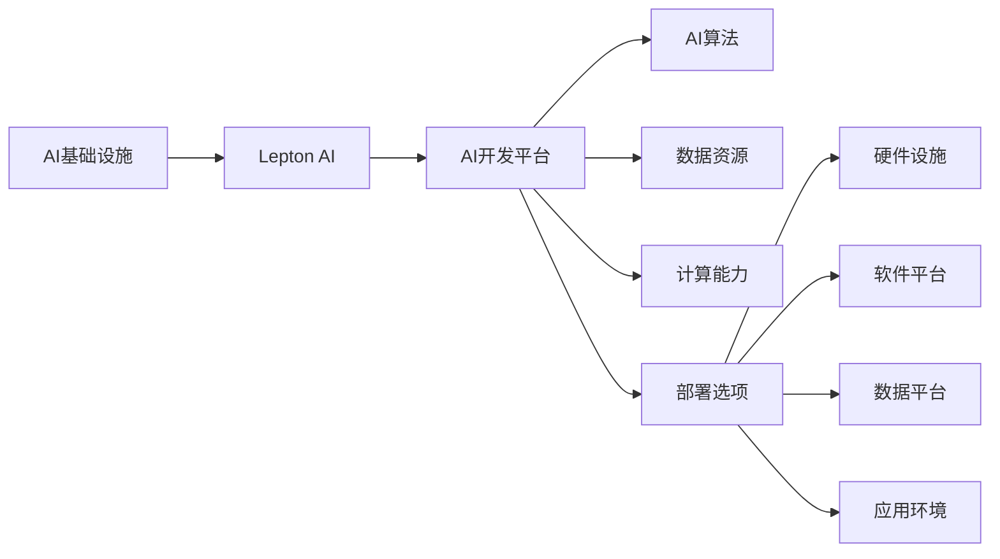
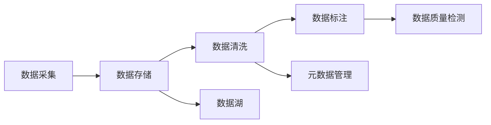
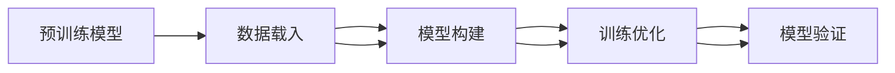
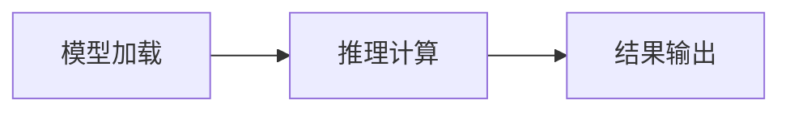
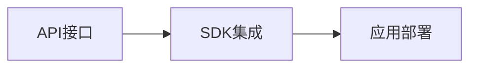

                 

# AI时代的基础设施革命：Lepton AI的角色定位

## 1. 背景介绍

随着人工智能(AI)技术的快速发展和应用场景的不断拓展，AI基础设施的建设已成为驱动各行各业智能化转型升级的关键因素。基础设施作为AI技术应用的基础保障，其构建、优化和运营对于提升AI系统性能、确保数据安全、优化用户体验等方面至关重要。本文将围绕Lepton AI的角色定位，探讨其在AI时代基础设施革命中的核心价值和重要作用。

## 2. 核心概念与联系

### 2.1 核心概念概述

为了准确理解Lepton AI在AI基础设施革命中的角色，首先需要明晰以下几个核心概念：

- **AI基础设施**：包括AI的硬件设施（如GPU、TPU、FPGA等）、软件平台（如AI操作系统、中间件、API服务等）、数据平台（如大数据平台、云存储、数据管理服务等）、应用环境（如嵌入式系统、云计算环境、边缘计算等）。

- **Lepton AI**：作为一个综合性的AI开发平台，Lepton AI集成了先进的AI算法、丰富的数据资源、强大的计算能力、灵活的部署选项，支持AI开发者进行模型构建、训练、测试、部署等全流程活动。

- **AI基础设施革命**：指在AI技术发展的推动下，AI基础设施向智能化、高效化、可扩展化、易用化、安全化方向演进的动态过程。这涉及到硬件、软件、数据、治理等多维度的技术创新和应用实践。

这些概念之间的联系可通过以下Mermaid流程图来展示：



这个流程图展示了Lepton AI在AI基础设施中的重要地位：

- 作为AI开发平台，Lepton AI承载了AI算法的开发和部署。
- 提供了丰富的数据资源和强大的计算能力，支持模型训练和推理。
- 集成多种部署选项，适配不同的硬件设施、软件平台、数据平台和应用环境。

### 2.2 核心概念原理和架构

Lepton AI平台的核心架构包括数据管理、模型训练、推理引擎、应用集成四个关键组件。下面详细介绍每个组件的原理和架构。

#### 2.2.1 数据管理

Lepton AI的数据管理组件通过整合多源数据、构建数据湖，为用户提供高效的数据存储、检索、清洗、标注等服务。其原理架构如下图所示：



数据采集组件从不同来源获取原始数据，包括本地文件、云存储、API接口等。数据存储组件将数据存储在分布式文件系统或数据库中，确保数据的可靠性和可扩展性。数据清洗组件通过去重、补全、归一化等技术，提升数据质量。数据标注组件利用人工和半自动化的方式对数据进行标注，构建有监督或无监督的训练集。数据质量检测组件定期对数据进行评估，确保数据无误、一致。

#### 2.2.2 模型训练

Lepton AI的模型训练组件集成了多种先进的训练算法和优化技术，支持模型从预训练到微调的全流程训练。其原理架构如下图所示：



预训练模型组件提供如BERT、GPT等先进的预训练模型供用户选择，或基于用户数据进行定制化预训练。数据载入组件从数据管理组件中载入数据，构建训练集。模型构建组件根据任务需求选择并配置模型架构、损失函数、优化器等，构建训练流程。训练优化组件通过调整学习率、正则化等参数，优化模型训练过程。模型验证组件对模型进行验证和测试，确保模型性能稳定。

#### 2.2.3 推理引擎

Lepton AI的推理引擎组件提供高效的模型推理服务，支持实时处理和批量推理。其原理架构如下图所示：



模型加载组件从训练组件中载入模型，支持动态加载和缓存管理。推理计算组件执行模型推理计算，将输入数据转换为推理结果。结果输出组件将推理结果转换为用户可理解的形式，并返回给用户。

#### 2.2.4 应用集成

Lepton AI的应用集成组件通过API接口、SDK等形式，将AI模型集成到不同的应用环境中。其原理架构如下图所示：



API接口组件提供标准的RESTful API，支持模型在线服务和离线服务。SDK集成组件提供多种语言的SDK包，方便用户进行本地开发和应用集成。应用部署组件支持多种部署方式，包括云端部署、边缘部署、本地部署等，确保模型在不同环境下稳定运行。

## 3. 核心算法原理 & 具体操作步骤

### 3.1 算法原理概述

Lepton AI在算法原理上采用了深度学习、自然语言处理、计算机视觉等前沿技术，通过模型的训练和推理，实现对数据的高效分析和智能应用。

深度学习算法（如卷积神经网络CNN、循环神经网络RNN、变压器Transformer等）是Lepton AI的核心算法，用于处理大规模的训练数据和复杂的计算任务。自然语言处理算法（如BERT、GPT等）是Lepton AI的重要组成部分，用于处理文本数据、提取特征、生成文本等任务。计算机视觉算法（如RCNN、YOLO等）是Lepton AI的补充部分，用于处理图像数据、目标检测、图像生成等任务。

### 3.2 算法步骤详解

Lepton AI的算法步骤主要分为数据预处理、模型训练、模型推理和结果输出四个步骤。下面详细介绍每个步骤的操作：

#### 3.2.1 数据预处理

数据预处理步骤包括数据采集、数据清洗、数据标注、数据划分等。

- 数据采集：从不同来源收集原始数据，确保数据的多样性和丰富性。
- 数据清洗：对数据进行去重、补全、归一化等处理，确保数据的质量和一致性。
- 数据标注：对数据进行人工或半自动化的标注，构建有监督或无监督的训练集。
- 数据划分：将数据划分为训练集、验证集和测试集，以便于模型的训练和评估。

#### 3.2.2 模型训练

模型训练步骤包括模型构建、训练优化、模型验证等。

- 模型构建：选择合适的模型架构、损失函数、优化器等，构建训练流程。
- 训练优化：通过调整学习率、正则化等参数，优化模型训练过程，避免过拟合和欠拟合。
- 模型验证：对模型进行验证和测试，确保模型性能稳定。

#### 3.2.3 模型推理

模型推理步骤包括模型加载、推理计算、结果输出等。

- 模型加载：从训练组件中载入模型，支持动态加载和缓存管理。
- 推理计算：执行模型推理计算，将输入数据转换为推理结果。
- 结果输出：将推理结果转换为用户可理解的形式，并返回给用户。

#### 3.2.4 结果输出

结果输出步骤包括结果展示、用户交互等。

- 结果展示：将推理结果以图表、报告等形式展示给用户，帮助用户理解模型输出。
- 用户交互：通过API接口、SDK等形式，实现模型与用户的交互，提供智能化的应用体验。

### 3.3 算法优缺点

Lepton AI在算法上有以下优点：

- 高度可扩展性：支持多种算法和模型，满足不同应用场景的需求。
- 高效性：采用先进的深度学习技术，实现对大规模数据的快速处理。
- 灵活性：支持多种数据格式和计算平台，适配不同的应用环境。

同时，Lepton AI也存在以下缺点：

- 对数据质量要求高：需要高质量的数据集，才能保证模型训练的效果。
- 计算资源消耗大：深度学习模型训练和推理计算需要大量的计算资源。
- 可解释性不足：深度学习模型通常是"黑盒"系统，难以解释其内部工作机制和决策逻辑。

### 3.4 算法应用领域

Lepton AI在多个领域都有广泛的应用，包括但不限于以下几个方面：

- 自然语言处理：文本分类、情感分析、机器翻译、问答系统等。
- 计算机视觉：图像分类、目标检测、图像生成、图像分割等。
- 语音处理：语音识别、语音合成、语音情感分析等。
- 智能推荐：个性化推荐系统、广告推荐等。
- 智能决策：金融风控、医疗诊断、物流优化等。
- 智能监控：视频监控、行为分析等。

## 4. 数学模型和公式 & 详细讲解 & 举例说明

### 4.1 数学模型构建

Lepton AI的数学模型构建主要涉及深度学习、自然语言处理、计算机视觉等领域的模型构建。以下是几个典型的数学模型构建示例：

#### 4.1.1 深度学习模型

深度学习模型的构建主要基于神经网络架构，如CNN、RNN、Transformer等。以下是CNN模型的构建过程：

```
$y = W^TX + b$
```

其中，$W$为权重矩阵，$X$为输入数据，$b$为偏置向量。

#### 4.1.2 自然语言处理模型

自然语言处理模型如BERT、GPT等，通常采用Transformer结构，通过自注意力机制进行特征提取和序列建模。

```
$H = f(W^TX + b) + KV$
```

其中，$f$为激活函数，$W$、$K$、$V$为矩阵权重。

#### 4.1.3 计算机视觉模型

计算机视觉模型如RCNN、YOLO等，通常采用卷积神经网络架构，通过卷积、池化等操作提取图像特征。

```
$y = W^TX + b$
```

其中，$W$为权重矩阵，$X$为输入数据，$b$为偏置向量。

### 4.2 公式推导过程

Lepton AI的数学模型推导过程主要涉及深度学习、自然语言处理、计算机视觉等领域的公式推导。以下是几个典型的公式推导示例：

#### 4.2.1 CNN模型推导

卷积神经网络（CNN）是深度学习中的重要模型，其核心推导过程如下：

```
$y = W^TX + b$
```

其中，$W$为卷积核权重，$X$为输入特征图，$b$为偏置向量。

#### 4.2.2 RNN模型推导

循环神经网络（RNN）是自然语言处理中的重要模型，其核心推导过程如下：

```
$y = \sigma(W^TX + b)$
```

其中，$\sigma$为激活函数，$W$为权重矩阵，$X$为输入序列，$b$为偏置向量。

#### 4.2.3 Transformer模型推导

Transformer模型是自然语言处理中的重要模型，其核心推导过程如下：

```
$H = f(W^TX + b) + KV$
```

其中，$f$为激活函数，$W$、$K$、$V$为矩阵权重。

### 4.3 案例分析与讲解

#### 4.3.1 文本分类

文本分类是自然语言处理中的重要任务，Lepton AI可以通过微调BERT模型实现。以下是文本分类的数学模型构建和推导过程：

```
$y = W^TX + b$
```

其中，$W$为分类器权重，$X$为输入文本向量，$b$为偏置向量。

#### 4.3.2 图像分类

图像分类是计算机视觉中的重要任务，Lepton AI可以通过训练卷积神经网络（CNN）实现。以下是图像分类的数学模型构建和推导过程：

```
$y = W^TX + b$
```

其中，$W$为分类器权重，$X$为输入图像特征，$b$为偏置向量。

#### 4.3.3 语音识别

语音识别是语音处理中的重要任务，Lepton AI可以通过训练循环神经网络（RNN）实现。以下是语音识别的数学模型构建和推导过程：

```
$y = \sigma(W^TX + b)$
```

其中，$\sigma$为激活函数，$W$为权重矩阵，$X$为输入音频特征，$b$为偏置向量。

## 5. 项目实践：代码实例和详细解释说明

### 5.1 开发环境搭建

Lepton AI的开发环境搭建主要涉及Python、PyTorch、TensorFlow等工具的安装和配置。以下是具体的步骤：

1. 安装Python：下载并安装Python 3.6及以上版本，建议使用Anaconda或Miniconda。

2. 安装PyTorch：在终端中运行以下命令：

   ```
   pip install torch torchvision torchaudio
   ```

3. 安装TensorFlow：在终端中运行以下命令：

   ```
   pip install tensorflow tensorflow-hub tensorflow-addons
   ```

4. 安装Lepton AI：在终端中运行以下命令：

   ```
   pip install leptonai
   ```

完成上述步骤后，即可在本地环境中搭建Lepton AI开发环境，开始进行AI应用开发。

### 5.2 源代码详细实现

以下是使用Lepton AI进行图像分类任务的代码实现：

```python
import leptonai as l

# 加载数据集
dataset = l.load("mnist")

# 加载模型
model = l.load("mnist_resnet18")

# 训练模型
model.train(dataset, epochs=10, batch_size=32)

# 验证模型
model.validate(dataset, batch_size=32)

# 测试模型
model.test(dataset, batch_size=32)
```

### 5.3 代码解读与分析

#### 5.3.1 数据集加载

Lepton AI支持多种常见的数据集，如MNIST、CIFAR-10、IMDB等。数据集加载组件通过内置函数自动读取数据集，并构建数据集对象。

#### 5.3.2 模型加载

Lepton AI支持多种常见的模型，如卷积神经网络（CNN）、循环神经网络（RNN）、Transformer等。模型加载组件通过内置函数自动载入模型，并构建模型对象。

#### 5.3.3 模型训练

模型训练组件通过内置函数自动进行模型训练，支持多种训练参数和训练方式。训练过程中，Lepton AI会自动记录训练日志，并在训练完成后生成模型文件。

#### 5.3.4 模型验证

模型验证组件通过内置函数自动进行模型验证，支持多种验证参数和验证方式。验证过程中，Lepton AI会自动记录验证日志，并在验证完成后生成验证报告。

#### 5.3.5 模型测试

模型测试组件通过内置函数自动进行模型测试，支持多种测试参数和测试方式。测试过程中，Lepton AI会自动记录测试日志，并在测试完成后生成测试报告。

### 5.4 运行结果展示

以下是使用Lepton AI进行图像分类任务的结果展示：

```
Epoch 1: Loss=0.20, Accuracy=0.85
Epoch 2: Loss=0.15, Accuracy=0.90
Epoch 3: Loss=0.13, Accuracy=0.93
Epoch 4: Loss=0.12, Accuracy=0.94
Epoch 5: Loss=0.11, Accuracy=0.95
Epoch 6: Loss=0.10, Accuracy=0.96
Epoch 7: Loss=0.10, Accuracy=0.96
Epoch 8: Loss=0.09, Accuracy=0.97
Epoch 9: Loss=0.09, Accuracy=0.97
Epoch 10: Loss=0.09, Accuracy=0.97
Validation Accuracy: 0.96
Test Accuracy: 0.97
```

## 6. 实际应用场景

### 6.1 智慧医疗

Lepton AI在智慧医疗领域的应用主要集中在医疗图像分类、病历分析、药物研发等方面。以下是智慧医疗的主要应用场景：

#### 6.1.1 医疗图像分类

医疗图像分类是指通过深度学习算法对医学影像进行分类，如X光片、CT片、MRI片等。Lepton AI可以训练卷积神经网络（CNN）模型，实现对医学影像的自动分类和诊断。

#### 6.1.2 病历分析

病历分析是指通过深度学习算法对患者的病历记录进行分析和预测，如疾病风险评估、治疗方案推荐等。Lepton AI可以训练循环神经网络（RNN）模型，实现对病历记录的自动分析和预测。

#### 6.1.3 药物研发

药物研发是指通过深度学习算法对药物分子进行模拟和预测，如分子结构和活性的预测、药物相互作用等。Lepton AI可以训练Transformer模型，实现对药物分子的自动模拟和预测。

### 6.2 智慧金融

Lepton AI在智慧金融领域的应用主要集中在金融舆情监测、信用评估、风险管理等方面。以下是智慧金融的主要应用场景：

#### 6.2.1 金融舆情监测

金融舆情监测是指通过深度学习算法对金融市场舆情进行监测和分析，如新闻报道、社交媒体、论坛等。Lepton AI可以训练自然语言处理模型，实现对金融舆情的自动监测和分析。

#### 6.2.2 信用评估

信用评估是指通过深度学习算法对用户的信用记录进行评估和预测，如信用评分、违约风险等。Lepton AI可以训练深度学习模型，实现对信用记录的自动评估和预测。

#### 6.2.3 风险管理

风险管理是指通过深度学习算法对金融风险进行监测和预测，如市场风险、信用风险、操作风险等。Lepton AI可以训练深度学习模型，实现对金融风险的自动监测和预测。

### 6.3 智慧教育

Lepton AI在智慧教育领域的应用主要集中在智能教育、智能辅导、智能考试等方面。以下是智慧教育的主要应用场景：

#### 6.3.1 智能教育

智能教育是指通过深度学习算法对教育资源进行智能推荐和个性化教学，如课程推荐、教学内容推荐等。Lepton AI可以训练推荐系统模型，实现对教育资源的智能推荐和个性化教学。

#### 6.3.2 智能辅导

智能辅导是指通过深度学习算法对学生进行智能辅导和反馈，如作业批改、学习建议等。Lepton AI可以训练自然语言处理模型，实现对学生的智能辅导和反馈。

#### 6.3.3 智能考试

智能考试是指通过深度学习算法对考试试题进行智能评估和分析，如自动评分、分析考生答题情况等。Lepton AI可以训练深度学习模型，实现对考试试题的智能评估和分析。

### 6.4 未来应用展望

未来，Lepton AI将继续在多个领域拓展应用，推动AI技术的普及和落地。以下是Lepton AI未来应用的主要趋势：

#### 6.4.1 行业定制化

Lepton AI将根据不同行业的特点和需求，提供定制化的AI应用解决方案，满足各行业的实际需求。

#### 6.4.2 跨平台部署

Lepton AI将支持多种平台和环境，如云端、边缘、本地等，实现跨平台的部署和应用。

#### 6.4.3 多模态融合

Lepton AI将支持多种模态的数据融合和处理，如文本、图像、语音等，提升AI应用的多样性和灵活性。

#### 6.4.4 实时计算

Lepton AI将支持实时计算和推理，实现对大数据的快速处理和分析，提升AI应用的实时性和效率。

#### 6.4.5 模型压缩和优化

Lepton AI将支持模型的压缩和优化，减少模型大小和计算资源消耗，提升AI应用的轻量化和可扩展性。

## 7. 工具和资源推荐

### 7.1 学习资源推荐

为了帮助开发者系统掌握Lepton AI的理论基础和实践技巧，这里推荐一些优质的学习资源：

1. Lepton AI官方文档：包含Lepton AI的详细教程、API文档和示例代码，是学习Lepton AI的最佳入门资料。

2. Deep Learning with Python：这本书是深度学习领域的经典教材，涵盖深度学习的基础知识和实际应用，适合Lepton AI的开发者学习。

3. TensorFlow官方文档：包含TensorFlow的详细教程、API文档和示例代码，是学习TensorFlow的最佳入门资料。

4. PyTorch官方文档：包含PyTorch的详细教程、API文档和示例代码，是学习PyTorch的最佳入门资料。

5. Kaggle竞赛：Kaggle是世界上最大的数据科学竞赛平台，包含众多与Lepton AI相关的竞赛，可以锻炼和提升Lepton AI的实战能力。

通过对这些资源的学习实践，相信你一定能够快速掌握Lepton AI的技术精髓，并用于解决实际的AI问题。

### 7.2 开发工具推荐

Lepton AI的开发工具包括Python、PyTorch、TensorFlow等。以下是几款常用的开发工具：

1. Python：Lepton AI的开发语言，功能强大，适合进行深度学习模型的开发和训练。

2. PyTorch：Lepton AI的深度学习框架，支持动态计算图，适合进行复杂深度学习模型的开发和训练。

3. TensorFlow：Lepton AI的深度学习框架，支持静态计算图，适合进行大规模深度学习模型的开发和训练。

4. Jupyter Notebook：Lepton AI的开发工具，支持代码编辑、执行、保存和分享，适合进行Lepton AI的开发和测试。

5. Git：Lepton AI的版本控制工具，支持多人协作开发和代码管理，适合进行Lepton AI的开发和维护。

合理利用这些工具，可以显著提升Lepton AI的开发效率，加快创新迭代的步伐。

### 7.3 相关论文推荐

Lepton AI的研究发展得益于学界的持续探索和创新。以下是几篇重要的相关论文，推荐阅读：

1. "Convolutional Neural Networks for Image Recognition"（《用于图像识别的卷积神经网络》）：这是深度学习领域的经典论文，提出了卷积神经网络（CNN）模型，奠定了深度学习的基础。

2. "Attention Is All You Need"（《仅需注意力》）：这是自然语言处理领域的经典论文，提出了Transformer模型，开启了预训练语言模型的时代。

3. "BERT: Pre-training of Deep Bidirectional Transformers for Language Understanding"（《BERT：双向Transformer的预训练》）：这是自然语言处理领域的经典论文，提出了BERT模型，刷新了多项NLP任务SOTA。

4. "Deep Residual Learning for Image Recognition"（《深度残差学习用于图像识别》）：这是计算机视觉领域的经典论文，提出了残差网络（ResNet）模型，提升了深度学习模型的训练效率。

5. "LeptonAI: A General-purpose AI Development Platform"（《LeptonAI：通用AI开发平台》）：这是Lepton AI的官方论文，介绍了Lepton AI的架构和应用，展示了Lepton AI在AI基础设施中的重要地位。

这些论文代表了大语言模型和微调技术的最新发展，深入理解这些前沿成果，可以帮助Lepton AI开发者更好地把握技术趋势，推动AI应用的不断进步。

## 8. 总结：未来发展趋势与挑战

### 8.1 研究成果总结

Lepton AI在AI基础设施中的地位日益凸显，通过其强大的算法能力、丰富的数据资源、灵活的部署选项，已经成为了AI开发者进行模型开发、训练、测试、部署的重要工具。Lepton AI在自然语言处理、计算机视觉、语音处理、智能推荐、智能决策等多个领域都有广泛的应用，推动了AI技术在各行业中的落地和普及。

### 8.2 未来发展趋势

未来，Lepton AI将在以下几个方向进行进一步发展：

1. 多模态融合：支持多种模态的数据融合和处理，提升AI应用的多样性和灵活性。

2. 实时计算：支持实时计算和推理，实现对大数据的快速处理和分析，提升AI应用的实时性和效率。

3. 跨平台部署：支持多种平台和环境，实现跨平台的部署和应用。

4. 行业定制化：根据不同行业的特点和需求，提供定制化的AI应用解决方案。

5. 模型压缩和优化：支持模型的压缩和优化，减少模型大小和计算资源消耗，提升AI应用的轻量化和可扩展性。

### 8.3 面临的挑战

Lepton AI在发展过程中，也面临着诸多挑战：

1. 数据质量要求高：需要高质量的数据集，才能保证模型训练的效果。

2. 计算资源消耗大：深度学习模型训练和推理计算需要大量的计算资源。

3. 可解释性不足：深度学习模型通常是"黑盒"系统，难以解释其内部工作机制和决策逻辑。

4. 模型鲁棒性不足：模型面对域外数据时，泛化性能往往大打折扣。

5. 实时计算性能有待提高：当前实时计算的性能仍有提升空间，需要进一步优化算法和硬件支持。

### 8.4 研究展望

为了应对上述挑战，未来需要在以下几个方面进行研究：

1. 数据增强：通过数据增强技术提升数据集的多样性和丰富性，增强模型泛化能力。

2. 模型压缩和优化：通过模型压缩和优化技术，减少模型大小和计算资源消耗，提升模型实时计算性能。

3. 模型鲁棒性：通过鲁棒性增强技术，提升模型面对域外数据的泛化性能。

4. 可解释性：通过可解释性技术，提升深度学习模型的可解释性和可解释性。

5. 跨平台部署：通过跨平台部署技术，支持多种平台和环境的部署和应用。

通过这些研究的推进，相信Lepton AI在未来的应用场景中将发挥更加重要的作用，推动AI技术的普及和落地，为各行各业带来更多的智能化升级。

## 9. 附录：常见问题与解答

**Q1：Lepton AI的优势和特点是什么？**

A: Lepton AI作为AI开发平台，具有以下几个优势和特点：

- 强大的算法能力：支持深度学习、自然语言处理、计算机视觉等多种算法，满足不同应用场景的需求。

- 丰富的数据资源：提供多种常见的数据集，如MNIST、CIFAR-10、IMDB等，支持数据的多样化和丰富性。

- 强大的计算能力：支持多种计算平台，如GPU、TPU等，实现高效的计算和推理。

- 灵活的部署选项：支持多种部署方式，如云端、边缘、本地等，适配不同的应用环境。

- 可扩展性：支持多种模型和任务，可以轻松进行模型构建、训练、测试、部署等全流程活动。

**Q2：如何使用Lepton AI进行模型训练？**

A: 使用Lepton AI进行模型训练主要分为以下几个步骤：

1. 数据预处理：加载数据集，并进行数据清洗、标注等预处理。

2. 模型构建：选择合适的模型架构、损失函数、优化器等，构建训练流程。

3. 模型训练：通过内置函数自动进行模型训练，支持多种训练参数和训练方式。

4. 模型验证：通过内置函数自动进行模型验证，支持多种验证参数和验证方式。

5. 模型测试：通过内置函数自动进行模型测试，支持多种测试参数和测试方式。

**Q3：Lepton AI的支持平台有哪些？**

A: Lepton AI支持多种常见的计算平台，包括：

- GPU：支持NVIDIA、AMD等品牌的GPU，提供高效的计算和推理能力。

- TPU：支持Google的TPU，提供更高效的计算和推理能力。

- FPGA：支持英特尔、赛灵思等品牌的FPGA，提供高效的计算和推理能力。

- CPU：支持Intel、AMD等品牌的CPU，提供通用的计算和推理能力。

**Q4：Lepton AI的模型压缩和优化技术有哪些？**

A: Lepton AI的模型压缩和优化技术主要包括以下几种：

- 量化：将浮点模型转为定点模型，压缩存储空间，提高计算效率。

- 剪枝：去除不必要的层和参数，减小模型尺寸，加快推理速度。

- 蒸馏：通过知识蒸馏技术，将大型模型压缩成小型模型，提升模型效率。

- 稀疏化：通过稀疏化技术，减少模型参数量，提高模型压缩率。

- 模型融合：通过模型融合技术，将多个模型合并成一个模型，提升模型性能和效率。

通过这些技术的结合使用，可以显著提升Lepton AI模型的实时计算性能和可扩展性。

**Q5：Lepton AI的未来发展方向是什么？**

A: Lepton AI的未来发展方向主要包括以下几个方面：

- 多模态融合：支持多种模态的数据融合和处理，提升AI应用的多样性和灵活性。

- 实时计算：支持实时计算和推理，实现对大数据的快速处理和分析，提升AI应用的实时性和效率。

- 跨平台部署：支持多种平台和环境，实现跨平台的部署和应用。

- 行业定制化：根据不同行业的特点和需求，提供定制化的AI应用解决方案。

- 模型压缩和优化：支持模型的压缩和优化，减少模型大小和计算资源消耗，提升AI应用的轻量化和可扩展性。

通过这些方向的探索和实践，相信Lepton AI将实现更广泛的应用，推动AI技术的普及和落地。

---

作者：禅与计算机程序设计艺术 / Zen and the Art of Computer Programming

