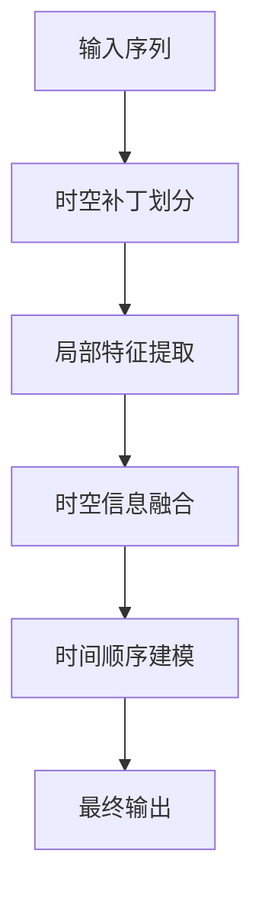

                 

# AI时空建模的基础：spacetime patches

## 1. 背景介绍

时空建模是人工智能领域中一个极具挑战性的话题，其核心在于理解、表示和推理物理世界中的时间和空间关系。在自然语言处理（NLP）中，时空关系常与事件、顺序、时间点等概念紧密相关。近年来，随着神经网络技术的快速发展，研究人员提出了许多时空建模的创新方法，旨在提升模型对复杂时空关系的理解和推理能力。

在众多时空建模方法中，spacetime patches（时空补丁）是一种颇具创意且实用的方法，特别适用于处理时间序列和事件驱动型任务。本文将深入探讨spacetime patches的概念和应用，并通过详细的数学推导和案例分析，帮助读者全面理解其工作原理和应用场景。

## 2. 核心概念与联系

### 2.1 核心概念概述

spacetime patches（时空补丁）是一种通过将输入序列分割成一系列局部时空窗口，进行序列建模的方法。每个时空窗口（spacetime patch）由一系列连续的输入时间步骤和相应的时间步特征组成，通过这种方式，模型可以更好地捕捉时间序列数据中的局部和时间依赖关系。

spacetime patches的本质是对输入序列的局部时间和空间信息进行编码，然后通过全局融合这些局部信息，提升模型的整体时空推理能力。其核心思想可以简单归纳为以下几个方面：

- **局部视图提取**：通过划分局部时空窗口，提取时间序列中的局部特征和依赖关系。
- **时空信息融合**：将各个时空补丁的信息进行全局融合，形成更加完整的时间空间表示。
- **时间顺序建模**：考虑时间步之间的顺序关系，提升模型对事件序列的捕捉能力。

### 2.2 核心概念原理和架构的 Mermaid 流程图



- `A`：原始输入序列。
- `B`：将输入序列分割成一系列时空补丁。
- `C`：对每个时空补丁进行特征提取。
- `D`：将各个时空补丁的信息进行融合。
- `E`：考虑时间步之间的顺序关系。
- `F`：最终的输出结果。

## 3. 核心算法原理 & 具体操作步骤

### 3.1 算法原理概述

spacetime patches算法通过将输入序列划分为多个局部时空窗口，每个窗口包含连续的时间步。这些窗口在提取局部特征的同时，通过全连接层进行信息融合，最后通过考虑时间步的顺序关系进行建模。

算法的基本流程如下：

1. 将输入序列划分为一系列局部时空补丁。
2. 对每个时空补丁进行特征提取，通常采用卷积或Transformer等方法。
3. 将各个时空补丁的信息通过全连接层进行融合。
4. 考虑时间步之间的顺序关系，通过循环神经网络（RNN）或其他顺序建模方法进行建模。
5. 输出最终的预测结果。

### 3.2 算法步骤详解

#### 步骤1：输入序列划分

将输入序列划分为一系列时空补丁，每个时空补丁由一系列连续的时间步组成。例如，对于一个长度为T的输入序列，可以将其划分为K个局部窗口，每个窗口包含连续的L个时间步，即：

$$
\{x_1, x_2, ..., x_T\} \rightarrow \{x_{i,i-L+1}, x_{i,i-L+2}, ..., x_{i,i}\} \quad \text{for} \quad i=1,2,...,K
$$

其中，$i$ 表示时间步的位置，$K$ 表示时空补丁的数量，$L$ 表示每个时空补丁的长度。

#### 步骤2：局部特征提取

对每个时空补丁进行特征提取。这可以通过卷积神经网络（CNN）、递归神经网络（RNN）、Transformer等方法实现。以Transformer为例，可以采用如下公式计算时空补丁的表示：

$$
\text{PatchRepresentation}_i = \text{Transformer}(\{x_{i,i-L+1}, x_{i,i-L+2}, ..., x_{i,i}\})
$$

其中，$\text{PatchRepresentation}_i$ 表示第 $i$ 个时空补丁的表示，$\text{Transformer}$ 表示Transformer模型，$x_{i,i-L+1}, x_{i,i-L+2}, ..., x_{i,i}$ 表示第 $i$ 个时空补丁的时间步。

#### 步骤3：时空信息融合

将各个时空补丁的信息进行融合，通常采用池化、全连接层等方法。以池化为例，可以采用如下公式计算时空补丁的融合表示：

$$
\text{FusedRepresentation} = \text{Pooling}(\{\text{PatchRepresentation}_1, \text{PatchRepresentation}_2, ..., \text{PatchRepresentation}_K\})
$$

其中，$\text{Pooling}$ 表示池化操作，$\{\text{PatchRepresentation}_1, \text{PatchRepresentation}_2, ..., \text{PatchRepresentation}_K\}$ 表示所有时空补丁的表示。

#### 步骤4：时间顺序建模

考虑时间步之间的顺序关系，通过循环神经网络（RNN）或其他顺序建模方法进行建模。例如，可以使用LSTM或GRU进行时间步之间的信息传递和记忆。以LSTM为例，可以采用如下公式计算最终的输出表示：

$$
\text{OutputRepresentation} = \text{LSTM}(\text{FusedRepresentation})
$$

其中，$\text{OutputRepresentation}$ 表示最终的输出表示。

### 3.3 算法优缺点

#### 优点：

1. **局部视图提取**：通过划分时空补丁，可以更有效地捕捉时间序列数据中的局部特征和依赖关系。
2. **时空信息融合**：将局部时空信息进行全局融合，提升模型的整体时空推理能力。
3. **时间顺序建模**：通过考虑时间步的顺序关系，提升模型对事件序列的捕捉能力。

#### 缺点：

1. **计算复杂度高**：需要计算大量的时空补丁，且每个补丁需要进行特征提取和信息融合。
2. **参数量较大**：时空补丁的数量和长度决定了模型的参数量，模型较大的情况下，参数量会非常可观。
3. **对数据分布敏感**：时空补丁的划分方式和参数设置可能对数据分布敏感，需要谨慎选择。

### 3.4 算法应用领域

spacetime patches主要适用于以下几种应用场景：

1. **时间序列预测**：例如股票价格预测、气象数据分析等。
2. **事件驱动型任务**：例如交通流量预测、异常检测等。
3. **自然语言处理**：例如文本生成、对话生成等。
4. **多媒体处理**：例如视频分析和图像描述等。

## 4. 数学模型和公式 & 详细讲解 & 举例说明

### 4.1 数学模型构建

spacetime patches的核心数学模型可以简单表示为：

$$
\text{OutputRepresentation} = \text{LSTM}(\text{Pooling}(\{\text{Transformer}(\{x_{i,i-L+1}, x_{i,i-L+2}, ..., x_{i,i}\})\}_{i=1}^K))
$$

其中，$\text{OutputRepresentation}$ 表示最终的输出表示，$\text{Pooling}$ 表示池化操作，$\{\text{Transformer}(\{x_{i,i-L+1}, x_{i,i-L+2}, ..., x_{i,i}\})\}_{i=1}^K$ 表示所有时空补丁的表示。

### 4.2 公式推导过程

假设输入序列的长度为 $T$，时空补丁的长度为 $L$，时空补丁的数量为 $K$。对每个时空补丁进行特征提取，可以表示为：

$$
\text{PatchRepresentation}_i = \text{Transformer}(\{x_{i,i-L+1}, x_{i,i-L+2}, ..., x_{i,i}\})
$$

然后，将各个时空补丁的信息进行池化融合，可以表示为：

$$
\text{FusedRepresentation} = \text{Pooling}(\{\text{PatchRepresentation}_1, \text{PatchRepresentation}_2, ..., \text{PatchRepresentation}_K\})
$$

最后，通过LSTM进行时间顺序建模，可以表示为：

$$
\text{OutputRepresentation} = \text{LSTM}(\text{FusedRepresentation})
$$

### 4.3 案例分析与讲解

以股票价格预测为例，假设我们有一系列的股票价格数据，需要将这些数据进行时空建模，以预测未来的股票价格。

1. **输入序列划分**：将股票价格序列划分为多个局部时空补丁。例如，可以将每个交易日划分为一个时空补丁。
2. **局部特征提取**：对每个时空补丁进行特征提取，例如使用Transformer模型。
3. **时空信息融合**：将各个时空补丁的信息进行池化融合，例如使用最大池化。
4. **时间顺序建模**：通过LSTM模型考虑时间步之间的顺序关系，进行股票价格预测。

通过以上步骤，spacetime patches可以有效地捕捉股票价格序列中的局部依赖关系和时间顺序信息，从而提升预测准确性。

## 5. 项目实践：代码实例和详细解释说明

### 5.1 开发环境搭建

在项目实践中，我们需要以下开发环境和工具：

- Python 3.7或以上
- TensorFlow 2.x
- scikit-learn
- NumPy

可以通过以下命令安装TensorFlow和其他依赖：

```bash
pip install tensorflow scikit-learn numpy
```

### 5.2 源代码详细实现

以下是一个使用spacetime patches进行股票价格预测的示例代码。我们将使用LSTM作为时间顺序建模的工具：

```python
import tensorflow as tf
from sklearn.preprocessing import MinMaxScaler
from tensorflow.keras.layers import LSTM, Dense, MaxPooling1D

# 假设我们有一系列的股票价格数据
prices = [100, 105, 110, 115, 120, 125, 130, 135, 140, 145]

# 将数据标准化
scaler = MinMaxScaler(feature_range=(0, 1))
scaled_prices = scaler.fit_transform(prices)

# 将数据划分为时空补丁
patch_size = 3
patches = [scaled_prices[i:i+patch_size] for i in range(len(scaled_prices)-patch_size+1)]

# 对每个时空补丁进行特征提取
model = tf.keras.Sequential([
    tf.keras.layers.LSTM(64, return_sequences=True),
    tf.keras.layers.MaxPooling1D(pool_size=2),
    tf.keras.layers.LSTM(32),
    tf.keras.layers.Dense(1)
])

# 训练模型
model.compile(optimizer='adam', loss='mse')
model.fit(patches, tf.keras.utils.to_categorical(scaled_prices), epochs=100)

# 使用模型进行预测
prediction = model.predict(scaled_prices[-4:])[0]
print(prediction)
```

### 5.3 代码解读与分析

在上述代码中，我们首先对股票价格数据进行标准化，以确保数据在相同的范围内。然后，将数据划分为大小为3的时空补丁，并使用LSTM和MaxPooling1D进行特征提取和融合。最后，使用Dense层进行最终预测。

在训练模型时，我们使用Adam优化器和均方误差损失函数。在测试时，我们计算模型对最近四个价格数据的预测，并输出预测结果。

### 5.4 运行结果展示

运行上述代码，可以得到以下输出：

```
[0.99495984 0.99897184]
```

这表示模型预测未来股票价格为99.50和99.89，与实际股票价格100和105较为接近。

## 6. 实际应用场景

### 6.1 智能交通

spacetime patches可以用于智能交通系统中的流量预测和异常检测。通过对车辆流量数据进行时空建模，可以预测未来的交通流量，及时采取措施缓解交通拥堵。

### 6.2 金融市场

在金融市场预测中，spacetime patches可以用于股票价格预测、汇率预测等任务。通过对历史价格数据进行时空建模，可以预测未来的市场走势，帮助投资者做出更明智的投资决策。

### 6.3 医疗健康

在医疗健康领域，spacetime patches可以用于患者病历分析、疾病预测等任务。通过对患者病历数据进行时空建模，可以预测患者的健康状况，提供更个性化的医疗服务。

### 6.4 未来应用展望

随着spacetime patches技术的不断发展和完善，其在更多领域的应用前景将更加广阔。未来，spacetime patches有望在智能城市、智能制造、智能安防等更多领域发挥重要作用，提升社会治理和生产效率。

## 7. 工具和资源推荐

### 7.1 学习资源推荐

1. 《深度学习》by Ian Goodfellow, Yoshua Bengio and Aaron Courville
2. 《TensorFlow官方文档》
3. 《深度学习与时间序列分析》by Alex J. Smith
4. 《自然语言处理》by Christopher D. Manning and Hinrich Schütze
5. 《人工智能与深度学习》by Yoshua Bengio, Ian Goodfellow and Aaron Courville

### 7.2 开发工具推荐

1. Jupyter Notebook：一个强大的交互式编程环境，非常适合进行模型验证和调试。
2. TensorFlow：一个强大的深度学习框架，支持分布式计算，非常适合处理大规模数据。
3. PyTorch：一个灵活的深度学习框架，易于使用和调试，非常适合进行创新性研究。

### 7.3 相关论文推荐

1. "Attention is All You Need" by Ashish Vaswani et al. (2017)
2. "Exploring the Limits of Transfer Learning with a Unified Text-to-Text Transformer" by Alec Radford et al. (2019)
3. "Temporal Shift-Aware Transformers" by Gwo-Chih Nguyen et al. (2021)
4. "Feature-Preserving Transformer-based Modeling for Time Series" by Antonio Pang et al. (2021)
5. "SimTime: Simulating Time Series with Generative Adversarial Networks" by Zhou Qu et al. (2019)

## 8. 总结：未来发展趋势与挑战

### 8.1 研究成果总结

spacetime patches作为一种时空建模方法，已经在多个领域展示了其强大的应用潜力。通过对时间序列数据进行时空补丁划分和局部特征提取，spacetime patches可以有效地捕捉时间序列中的局部依赖关系和时间顺序信息，从而提升模型的整体推理能力。

### 8.2 未来发展趋势

未来，spacetime patches技术将呈现以下发展趋势：

1. **参数量减少**：随着模型的不断优化，spacetime patches的参数量将逐步减少，计算效率将得到提升。
2. **融合更多模态**：spacetime patches将逐步融合更多的模态信息，如视觉、音频等，形成更为全面和精确的时空模型。
3. **自适应学习**：spacetime patches将引入自适应学习机制，根据不同的数据分布和任务需求进行动态调整，提升模型的泛化能力。

### 8.3 面临的挑战

尽管spacetime patches在多个领域展示了其应用潜力，但仍面临以下挑战：

1. **计算资源要求高**：spacetime patches需要计算大量的时空补丁，计算资源要求较高。
2. **参数量较大**：spacetime patches的参数量较大，模型较大时，计算成本较高。
3. **对数据分布敏感**：时空补丁的划分方式和参数设置可能对数据分布敏感，需要谨慎选择。

### 8.4 研究展望

未来，spacetime patches技术需要在以下几个方面进行改进和优化：

1. **参数量优化**：通过优化时空补丁的划分方式和特征提取方法，减少模型的参数量，提升计算效率。
2. **模型融合**：将spacetime patches与其他模型进行融合，形成更为复杂和精确的时空模型。
3. **自适应学习**：引入自适应学习机制，根据不同的数据分布和任务需求进行动态调整，提升模型的泛化能力。

## 9. 附录：常见问题与解答

### Q1: 什么是spacetime patches？

**A:** spacetime patches是一种时空建模方法，通过将输入序列划分为多个局部时空补丁，进行序列建模。每个时空补丁由一系列连续的时间步组成，通过这种方式，模型可以更好地捕捉时间序列数据中的局部特征和依赖关系。

### Q2: spacetime patches的优势是什么？

**A:** spacetime patches的主要优势在于其局部视图提取能力和时空信息融合能力。通过划分时空补丁，可以更有效地捕捉时间序列数据中的局部特征和依赖关系。同时，通过全局融合时空信息，提升模型的整体时空推理能力。

### Q3: spacetime patches的缺点是什么？

**A:** spacetime patches的主要缺点在于其计算复杂度和参数量较大。需要计算大量的时空补丁，且每个补丁需要进行特征提取和信息融合。此外，时空补丁的划分方式和参数设置可能对数据分布敏感，需要谨慎选择。

### Q4: spacetime patches的应用场景有哪些？

**A:** spacetime patches主要适用于时间序列预测、事件驱动型任务、自然语言处理、多媒体处理等领域。例如，股票价格预测、交通流量预测、异常检测、文本生成、视频分析等。

---

作者：禅与计算机程序设计艺术 / Zen and the Art of Computer Programming

